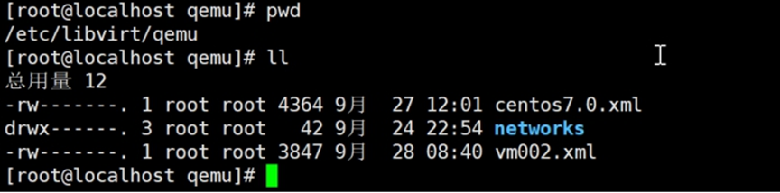
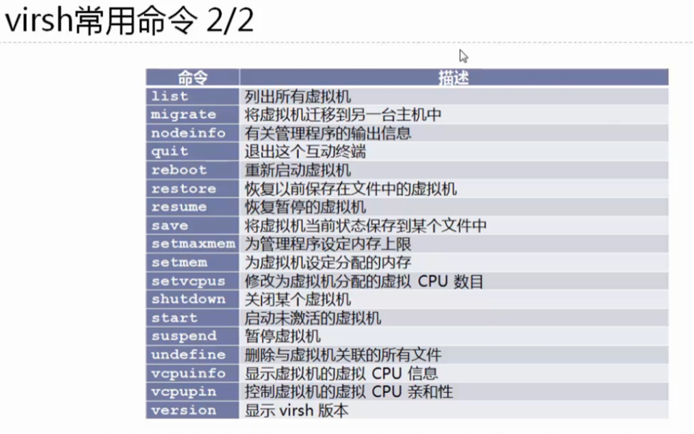

## libvirt架构概述：

libvirt是用来管理虚拟机或虚拟化功能的软件集合，主要包括：libvirt API，libvirtd进程和virsh工具集三部分。最初的目的是为不同的hypervisor提供统一的管理接口。

libvirtd该后台进程主要实现以下功能：

* 远程代理：所有remote client发送来的命令，由该进程监测执行
* 本地环境初始化：libvirt服务的启停，用户connection的响应等
* 根据环境注册各种Driver（qemu, xen, storage…）的实现：不同虚拟化技术以Driver的形式实现，由于libvirt对外提供的是统一的接口，所以各个Driver就是实现这些接口，即将Driver注册到libvirt中。


### 查看libvirtd状态

```lua
systemctl status libvirtd
```


如果libvirtd服务停止运行，那么你将不能管理虚拟机，也就是不能使用virt-manager等工具来管理虚拟机。

### 虚拟机配置文件位置

位置：`/etc/libvirt/qemu/`

虚拟机的所有配置是放置在一个xml文件中，位置在/etc/libvirt/qemu/目录中。



可以看到创建的2个虚拟机，libvirt的xml文件分为几个重要部分，整体结构如下：

```
#xml文件结构
<domain type='kvm'>
虚拟机整体信息
系统信息
硬件资源特性
突发事件处理
虚拟磁盘（单个或多个）
虚拟光盘（可选）
虚拟网络（单个或多个）
</domain>
```

下面是部分截图：


具体格式可以参看[http://libvirt.org/formatdomain.html](http://libvirt.org/formatdomain.html)

## virsh来管理虚拟机

virsh是使用libvirt management API构建的管理工具

virsh的名称的含义是virtualization shell。它有两种工作模式：

* 立即模式
* 交互模式

### 立即模式

`virsh` 命令行操作就是立即模式

```
virsh list --all
 Id   Name                State
-----------------------------------
 1    instance-00000020   running
 2    instance-0000002d   running
 3    instance-0000002c   running
 4    instance-0000001e   running

```

### 交互模式

输入 `virsh` 进入交互界面

```
virsh
Welcome to virsh, the virtualization interactive terminal.

Type:  'help' for help with commands
       'quit' to quit

virsh # 

```

查看命令帮助virsh --help,主要有以下以下几大类：

1. **Domain（域）相关命令：**
   * `list`：列出当前运行的虚拟机。
   * `start`：启动虚拟机。
   * `shutdown`：关闭虚拟机。
   * `destroy`：强制关闭虚拟机等。
2. **Snapshot（快照）相关命令：**
   * `snapshot-create`：创建虚拟机快照。
   * `snapshot-list`：列出虚拟机的快照。
   * `snapshot-revert`：恢复到指定的虚拟机快照等。
3. **Storage Pool（存储池）相关命令：**
   * `pool-list`：列出存储池。
   * `pool-start`：启动存储池。
   * `pool-destroy`：关闭存储池等。
4. **Network（网络）相关命令：**
   * `net-list`：列出网络。
   * `net-start`：启动网络。
   * `net-destroy`：关闭网络等。
5. **Node（节点）相关命令：**
   * `node-list`：列出计算节点。
   * `node-info`：显示节点信息等。
6. **Miscellaneous（其他）命令：**
   * `help`：显示命令的帮助信息。
   * `version`：显示 `virsh` 的版本信息等。

> 提示：
>
> virsh相关命令很多，以上只是举例。

### 常用命令总结




## KVM基本功能管理

```
virsh -h					#查看命令帮助

virsh list --all				#查看虚拟机状态

virsh shutdown vm002				#虚拟机关机
virsh start vm002				#虚拟机开机
virsh destroy vm002				#强制虚拟机系统关闭电源
virsh autostart vm002				#配置虚拟机实例伴随宿主机自动启动

virsh suspend vm002				#挂起虚拟机
virsh resume vm002				#恢复虚拟机

virsh undefine vm002				#删除虚拟机，只删除xml文件，不删除磁盘文件

virsh create /etc/libvirt/qemu/vm002.xml	#通过配置文件启动虚拟机系统实例
virsh define /etc/libvirt/qemu/vm002.xml	#通过备份文件重启定义（创建）虚拟机


vim /etc/libvirt/qemu/vm002.xml			#直接修改虚拟机配置文件
virsh edit vm002				#通过virsh命令修改虚拟机配置文件

virsh dominfo vm002				#查看虚拟机信息


virsh console vm002				#连接虚拟机 (进入虚拟机后按 ctrl + ] 退出虚拟机)
```

示例：

```bash


#查看命令帮助
virsh -h


#查看KVM的配置文件存放目录
ls -l /etc/libvirt/qemu
总用量 12
drwxr-xr-x. 2 root root   23   9月  28 17:20 autostart
-rw-------. 1 root root     4364 9月  27 12:01 centos7.0.xml
drwx------. 3 root root   42   9月  24 22:54 networks
-rw-------. 1 root root     3847 9月  28 16:35 vm002.xml


#查看虚拟机状态
virsh list --all
Id    名称                         状态
----------------------------------------------------
2     vm002                        running
3     centos7.0                      running


#虚拟机关机与开机
virsh shutdown vm002
域 vm002 被关闭
virsh start vm002
域 vm002 已开始


#强制虚拟机系统关闭电源
virsh destroy vm002
virsh list --all
Id    名称                         状态
----------------------------------------------------
3     centos7.0                      running
-     vm002                          关闭


#通过配置文件启动虚拟机系统实例
virsh create /etc/libvirt/qemu/vm002.xml
域 vm002 被创建（从 /etc/libvirt/qemu/vm002.xml）
virsh list --all
Id    名称                         状态
----------------------------------------------------
3     centos7.0                      running
5     vm002                        running


#挂起虚拟机
virsh suspend vm002
域 vm002 被挂起
 virsh list --all
Id    名称                         状态
----------------------------------------------------
3     centos7.0                      running
5     vm002                          暂停


#恢复虚拟机
virsh resume vm002
域 vm002 被重新恢复
virsh list --all
Id    名称                         状态
----------------------------------------------------
3     centos7.0                      running
5     vm002                        running


#配置虚拟机实例伴随宿主机自动启动
virsh autostart vm002
域 vm002标记为自动开始
上述命令将创建/etc/libvirt/qemu/autostart/目录，里面内容为开机自动启动的系统
virsh autostart --disable vm002
域 vm002取消标记为自动开始


#导出虚拟机配置
virsh dumpxml vm002 > /etc/libvirt/qemu/vm002-bak.xml


#虚拟机的删除与添加
#删除虚拟机
virsh shutdown vm002
域 vm002 被关闭
virsh undefine vm002
域 vm002 已经被取消定义
#查看删除结果，vm002的配置文件被删除，但是磁盘文件不会被删除。

ls /etc/libvirt/qemu
autostart  centos7.0.xml  networks  vm002-bak.xml

#通过virsh list --all 查看不到vm002的信息，说明此虚拟机被删除
virsh list --all
Id    名称                         状态
----------------------------------------------------
3     centos7.0                      running


#通过备份的配置文件重新定义虚拟机：
mv /etc/libvirt/qemu/vm002-bak.xml /etc/libvirt/qemu/vm002.xml
virsh define /etc/libvirt/qemu/vm002.xml
定义域 vm002（从 /etc/libvirt/qemu/vm002.xml）
virsh list --all
Id    名称                         状态
----------------------------------------------------
3     centos7.0                      running
-     vm002                          关闭


#修改虚拟机配置信息
#直接修改配置文件
vim /etc/libvirt/qemu/vm002.xml
#通过virsh命令修改
virsh edit vm002


#查看虚拟机信息
virsh dominfo vm002
Id:             1
名称：       vm002
UUID:           e144e9ba-a125-4a97-9cf1-1c571f58817a
OS 类型：    hvm
状态：       running
CPU：          1
CPU 时间：   72.9s
最大内存： 1048576 KiB
使用的内存： 1048576 KiB
持久：       是
自动启动： 禁用
管理的保存： 否
安全性模式： selinux
安全性 DOI： 0
安全性标签： system_u:system_r:svirt_t:s0:c215,c657 (enforcing)


#连接虚拟机 (进入虚拟机后按 ctrl + ] 退出虚拟机)
virsh console vm002
连接到域 vm002   换码符为 ^]
CentOS Linux 7 (Core)
Kernel 3.10.0-514.el7.x86_64 on an x86_64
vm002 login: root
Password:
Last login: Fri Sep 29 09:00:18 on ttyS0
```

 无法使用vrish console 登录虚拟机的解决方案，参见 003 节 kvm命令行安装部分内容。

## KVM虚拟机克隆

### 安装软件包

```
sudo dnf install libvirt-client
```

### 克隆虚拟机

* `virt-clone`：虚拟机克隆

语法：

```
virt-clone --original=vm_source --name=vm_clone --auto-clone
```

* `--original=vm_source`：简写 `-o vm_source` 指定原始虚拟机的名称。在这里，`vm_source` 是你要克隆的源虚拟机的名称。
* `--name=vm_clone`：指定克隆虚拟机的名称。在这里，`vm_clone` 是新虚拟机的名称。
* `--auto-clone`：指定执行克隆操作时不进行交互，使用默认选项。

```
virt-clone -o vm002 -n vm003 -f /kvm-vm/vm003.qcow2	#从vm002克隆到vm003
```


### 查看虚拟机信息

```
virsh dominfo vm003

Id:             1
Name:           vm003
UUID:           b6556d2e-ab1e-4743-b47c-55ac69bb7887
OS Type:        hvm
State:          running
CPU(s):         2
CPU time:       39756.6s
Max memory:     8388608 KiB
Used memory:    8388608 KiB
Persistent:     yes
Autostart:      disable
Managed save:   no
Security model: none
Security DOI:   0
```

### 启动虚拟机

```
virsh start vm003

域 vm003 已开始

virsh list --all

 Id    名称                         状态

----------------------------------------------------

 17    vmtest01                      running
 18    vm003                        running
 -     centos7.0                     关闭
```

## KVM虚拟机快照

* 快照实际上做的是虚拟机的XML配置文件，默认快照XML文件在/var/lib/libvirt/qemu/snapshot/虚拟机名/下
  * 快照文件位置：`/var/lib/libvirt/qemu/snapshot/虚拟机名/`
* 快照只支持qcow2磁盘格式的系统。
* 虚拟机在创建快照时必须处于关机状态。如果虚拟机正在运行，你需要先将其关闭，然后再创建快照。
* 如果希望在虚拟机运行时创建快照，可以使用 `--quiesce` 选项。这个选项会请求虚拟机中的一些应用程序在快照过程中冻结状态，以确保一致性。

### 创建快照

语法：

```
virsh snapshot-create-as --domain VM_NAME --name SNAPSHOT_NAME --description "Snapshot Description"
```

* `--domain VM_NAME`：指定虚拟机的名称，将在该虚拟机上创建快照。
* `--name SNAPSHOT_NAME`：指定快照的名称。
* `--description "Snapshot Description"`：指定快照的描述信息（可选）。

示例：

```
#对虚拟机vm002做快照
virsh snapshot-create vm002
已生成域快照 1507040414

#在创建快照的同时给快照一个名字
virsh snapshot-create-as vm002 firsh_snap
已生成域快照 firsh_snap


#实例开机状态，创建符合一致性的快照
virsh snapshot-create-as --domain my_vm --name snapshot1 --description "Running snapshot" --quiesce
```

### 查看快照

语法：

```
virsh snapshot-list --domain VM_NAME	#列出虚拟机的所有快照，显示它们的名称、创建时间和描述信息

virsh snapshot-info --domain my_vm --snapshotname snapshot1	#查看有关特定快照的详细信息，包括创建时间、磁盘状态等。

virsh snapshot-current VM_NAME		#查看虚拟机当前所处的快照，包括快照的名称、创建时间、描述等。虚拟机必须处于运行状态，且有一个关联的快照，否则命令可能不会返回任何信息。
```

示例：

```
#查看快照信息
virsh snapshot-list vm002
名称               生成时间              状态
------------------------------------------------------------
1507040414           2017-10-03 22:20:14 +0800 shutoff
firsh_snap           2017-10-03 22:26:49 +0800 shutoff


#查看当前快照信息
virsh snapshot-current vm002
<domainsnapshot>
<name>firsh_snap</name>   //快照版本号
<state>shutoff</state>
<parent>
<name>1507040414</name>
</parent>
<creationTime>1507040809</creationTime>
<memory snapshot='no'/>
```

### 使用快照恢复实例

语法：

```
virsh snapshot-revert --domain VM_NAME --snapshotname SNAPSHOT_NAME	#使用快照恢复虚拟机实例
```

* `--domain VM_NAME`：指定虚拟机的名称。
* `--snapshotname SNAPSHOT_NAME`：指定要恢复的快照的名称。

示例：

```
#恢复虚拟机状态到名为1507040414的快照
virsh snapshot-revert vm002 1507040414
#验证是否恢复：
virsh snapshot-current vm002
<domainsnapshot>
<name>1507040414</name>               //快照版本号
<state>shutoff</state>
<creationTime>1507040414</creationTime>
<memory snapshot='no'/>
```

### 删除快照

语法：

```
virsh snapshot-delete --domain VM_NAME --snapshotname SNAPSHOT_NAME
```

示例：

```
#删除快照
virsh snapshot-delete vm002 firsh_snap
已删除域快照 firsh_snap
```

## Reference Links：

https://edu.51cto.com/lecturer/9286589-c81.html

#刘世民

https://www.cnblogs.com/sammyliu/p/4543110.html
