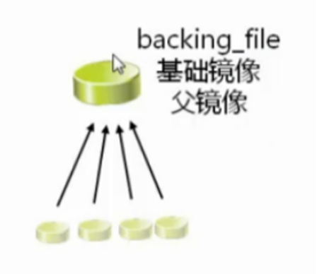
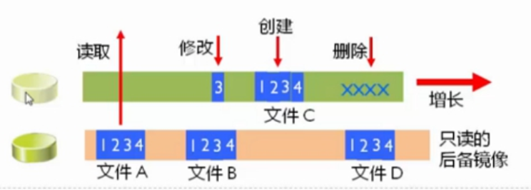

通过文件管理可以直接查看、修改、复制虚拟机的内部文件。例如，当系统因为配置文件无法启动时，可以直接修改虚拟机的文件。虚拟机磁盘文件主要有raw和qcow2格式。

* raw格式性能最好，速度最快，它的缺点就是不支持一些新的功能，如支持镜像,zlib磁盘压缩,AES加密等。
* 要使用镜像功能，磁盘格式必须为qcow2。

raw格式的话，速度稍微快点，在高版本的qemu-kvm中，几乎不比qcow2的格式快，而qcow2格式节省空间，可动态增长，在公有云中广泛使用，建议使用qcow2。

有时候，我们需要将raw格式的磁盘转换成qcow2格式(qemu-img
convert -f raw -O qcow2 /kvm-vm/vmtest01.img /kvm-vm/vmtest01.qcow2)。

## 虚拟磁盘离线访问工具

### 离线访问工具应用场景

* 观看或下载位于虚拟机磁盘中的文件
* 编辑或上传文件到虚拟机磁盘
* 读取或写入的虚拟机配置
* 准备新的磁盘映像，其中包含文件、目录、文件系统、分区、逻辑卷和其他选项
* 拯救和修复客户无法启动或需要更改启动配置的虚拟机
* 监控虚拟机的磁盘使用情况
* 根据组织安全标准审计虚拟机的合规性
* 通过克隆和修改模板来部署虚拟机
* 读取CD和DVD ISO和软盘映像

安装libguestfs，libguestfs-tools软件工具，就可以直接读取qcow2格式的磁盘文件。

下面的这些操作最好要在虚拟机关机状态下做，否则会出错。

### 管理实例磁盘文件

#### virt-inspector

* `virt-inspector`：查看虚拟机镜像中的信息的工具

```
virt-inspector -d instance-00000020	#显示os版本、内核、驱动、挂载点、应用等等，信息很详细，很少使用。
```

* `-d instance-00000020`：指定虚拟机的磁盘镜像文件或者虚拟机名（如果在 libvirt 中注册了）。

示例：

```
#virt-inspector 显示os版本、内核、驱动、挂载点、应用等等，很少使用。
virt-inspector /mykvm/vms/vm1
virt-inspector --format=qcow2 -a /mykvm/vms/vm1  |more
```

#### virt-cat 和 virt-edit

`virt-cat` 是 libguestfs 工具集合中的一个工具，用于从虚拟机的磁盘镜像中提取文件内容。

`virt-edit` 是 libguestfs 工具集合中的一个工具，用于在虚拟机磁盘镜像上直接编辑文件。

语法：

```
virt-cat -d instance-00000020 /path/to/file

virt-edit -d instance-00000020 /path/to/file
```

* `-d instance-00000020`：指定虚拟机的磁盘镜像文件或者虚拟机名（如果在 libvirt 中注册了）。
* `/path/to/file`：指定要提取内容的文件路径。

示例：

```
#读取主机名
virt-cat -a /mykvm/vms/vm1 /etc/hostname

#把主机名改成vmtest001.test.com
virt-edit -a /kvm-vm/vmtest01.qcow2 /etc/hostname
vmtest001.test.com

virt-cat -a /kvm-vm/vmtest01.qcow2 /etc/hostname
vmtest001.test.com					#然后再查看，发现主机名已经更改。
```

#### virt-df

`virt-df` 是 libguestfs 工具集合中的一个工具，用于显示虚拟机磁盘上的文件系统使用情况。

语法：

```
virt-df -d instance-00000020
```

* `-d instance-00000020`：指定虚拟机的磁盘镜像文件或者虚拟机名（如果在 libvirt 中注册了）。

示例：

```
virt-df -h instance-00000020
Filesystem                                Size       Used  Available  Use%
instance-00000020:/dev/sda                500K       500K          0  100%
instance-00000020:/dev/sdb2               507M       248M       259M   49%
instance-00000020:/dev/sdb3                19G       9.0G        10G   47%
```

#### virt-copy-out 和 virt-copy-in

`virt-copy-out` 是 libguestfs 工具集合中的一个工具，用于从虚拟机的磁盘镜像中复制文件到主机上。

`virt-copy-in` 是 libguestfs 工具集合中的一个工具，用于将主机上的文件或目录复制到虚拟机中。

语法：

```
virt-copy-out -d instance-00000020 /path/in/vm /path/on/host	#实例文件复制到主机目录中
					文件  >	目录（不能是文件名）
virt-copy-in -d instance-00000020 /path/on/host /path/in/vm	#主机文件复制到实例目录中
					文件  >	目录（不能是文件名）
virt-copy-out -a disk.img file|dir [file|dir ...] localdir	#-a选项可以指定磁盘文件
```

* `/path/in/vm`：指定虚拟机内的文件或目录路径。
* `/path/on/host`：指定主机上存放复制文件的路径。

示例：

```
#拷贝实例中的主机名文件到主机文件夹内
virt-copy-out -d instance-00000020 /etc/hostname ./

#将文件拷贝进实例中
echo "this is a test"> test.txt
virt-copy-in -d vmtest01 test.txt /opt/
```

#### guestfish

`guestfish` 是 libguestfs 工具集合中的一个交互式 shell 工具，用于在虚拟机磁盘镜像上执行各种文件系统操作。

`guestfish` 提供了丰富的文件系统操作和管理功能，可以方便地在虚拟机磁盘上执行各种操作。具体可以查看官方文档。

语法：

```
guestfish [--ro|--rw] -i -a /path/to/disk.img
guestfish [--ro|--rw] -i -d name-of-libvirt-domain
```

示例：

打开一个交互式 shell，允许你在虚拟机磁盘上执行各种命令。例如，列出文件、编辑文件、挂载文件系统等。

```
guestfish -d instance-00000020
><fs> ll /          		# 列出根目录下的文件
><fs> cat /etc/passwd 		# 查看 /etc/passwd 文件内容
><fs> mount /dev/sda1 /mnt 	# 挂载第一个分区到 /mnt 目录
><fs> ll /mnt     		# 列出 /mnt 目录下的文件
><fs> umount /mnt  		# 卸载 /mnt 目录
><fs> exit        		# 退出 guestfish
```

#### Guestmount

`guestmount` 是 libguestfs 工具集合中的一个工具，用于将虚拟机磁盘镜像挂载到主机上的一个目录，从而可以直接访问虚拟机文件系统中的文件。

```
guestmount -d instance-00000020 -i --ro /mnt/vm
```

* `-d instance-00000020`：指定虚拟机的磁盘镜像文件或者虚拟机名（如果在 libvirt 中注册了）。
* `-i`：以交互模式运行，这样你可以使用普通用户运行 guestmount。
* `--ro`：以只读模式挂载虚拟机磁盘。
* `/mnt/vm`：指定主机上的目录，用于挂载虚拟机文件系统。

挂载完成后，你就可以在 `/mnt/vm` 目录下访问虚拟机文件系统中的文件。例如：

```
ls /mnt/vm			#磁盘挂载在本机/mnt目录下
cat /mnt/vm/etc/passwd
```

示例：

```
#在一些使用场景中，直接把虚机镜像文件挂接在本地系统中，也是一个简便的办法。
guestmount -a vm1.qcow2 -m /dev/vg_centosbase/lv_root --rw /mnt

#如果事先不知道虚机内部分区的路径信息，则可以使用参数-i来让guestmount自己决定使用哪一个挂接点：
guestmount -a vm1.qcow2 -i --rw /mnt
#将/mnt下的挂载进行卸载
guestunmount   /mnt
```

## 管理虚拟磁盘

### 虚拟化项目中存储的注意事项

* 存储的性能几乎总是虚拟化的瓶颈
* 通过多个磁盘驱动以分布磁盘I/O来实现存储解决方案
* 驱动器的速度越快越好，考虑SSD与机械磁盘的混合使用
* 考虑部署集中化的SAN/NFS来实现高可用性和实时迁移

### 主要概念

#### 物理存储

* DAS：SCSI, SATAT, SAS, N-SAS
* SAN：Fibre Channel, FCoe, iSCSI, SAS
* NAS：NFS, SMB
* ......

#### 虚拟适配器

* IDE
* VirtIO
* SCSI
* ......

#### 虚拟磁盘

* 固定
* 动态
* 差异
* 缓存
* ......

### 虚拟磁盘类型

* 固定   Fixed   实盘
  * 在配置时，指定磁盘大小
  * 不管在虚拟磁盘上实际存储多少数据，都将占用相同大小主机磁盘空间
* 动态  Dynamic   稀疏盘
  * 增长到最大容量，但是只根据需求使用更多的空间
* 差异（差分盘）   Differencing
  * 因为创建是差异磁盘，所以只保存变更的数据，类似于lvm的快照
  * 例如，将操作系统安装在父盘，然后创建差异化磁盘来执行进一步配置，桌面虚拟化使用很多。

## KVM支持的虚拟磁盘类型

* raw
  * 这并非是一种真正的磁盘格式，而是代表虚拟机所使用的原始镜像
  * 它并不存储元数据，因此可以作为保证虚拟机兼容性的候选方案。然而，也正因为它不存储元数据，因此不能支持某些高级特性，比如快照和压缩等
  * 格式简单，容易转化为其他的格式。需要文件系统的支持才能支持sparse file
* cow: copy-on-wirte格式，昙花一现
* qcow: QEMU早期的copy-on-write格式，过渡性方案
* qcow2:
  * 按需进行分配磁盘空间，不管文件系统是否支持
  * 支持快照
  * 支持zlib的磁盘压缩
  * 支持AES的加密
* vmdk（virtual machine disk）
  * VMware环境当中默认使用的磁盘格式
* vhd\vhdx（virtual Hard Disk）
  * 微软默认采用的文件格式
* vdi（virtual Box）

### 查看KVM所支持的磁盘格式

`qemu-img --help | grep  Supported` ：命令查看KVM所支持的磁盘格式

示例：

```
qemu-img --help | grep  Supported
Supported formats: vvfat vpc vmdk vhdx vdi ssh sheepdog rbd raw host_cdrom host_floppy host_device file qed qcow2 qcow parallels nbd iscsi gluster dmg tftp ftps ftp https http cloop bochs blkverify blkdebug
```

qemu-img是QEMU的磁盘管理工具，在qemu-kvm源码编译后就会默认编译好qemu-img这个二进制文件。qemu-img也是QEMU/KVM使用过程中一个比较重要的工具。

qemu-img工具的命令行基本用法如下：

语法：

```
qemu-img command [command options]
```

常用功能命令：

* check  检查完整性
* create  创建镜像
* commit  提交更改
* compare  比较
* convert  转换
* info  获取信息
* map  映射
* snapshot  快照管理
* rebase  在已有的镜像的基础上创建新的镜像
* resize   调整大小
* amend  修订镜像格式选项

### 创建虚拟磁盘

#### 默认是创建raw格式的磁盘

```
#创建磁盘，默认格式raw
qemu-img create t1.img 1g

#查看磁盘信息
qemu-img info t1.img
image: t1.img
file format: raw              //默认磁盘格式
virtual size: 1.0G (1073741824 bytes)
disk size: 0                 //创建的是sparse模式
```

#### 创建qcow2格式的磁盘

```
qemu-img create -f qcow2 test1.qcow2 1g

qemu-img info test1.qcow2
image: test1.qcow2
file format: qcow2
virtual size: 1.0G (1073741824 bytes)
disk size: 196K
cluster_size: 65536
Format specific information:
    compat: 1.1
    lazy refcounts: false
```

创建qcow2格式磁盘时，可以指定选项，通过-o参数，常用参数主要有：

* backing_file     指定后端镜像文件
* backing_fmt     设置后端镜像的镜像格式
* encryption      设置加密
* cluster_size      设置簇大小，取值在512到2M之间，默认是64K
* preallocation     预分配模式 (allowed values: off, metadata, falloc, full)
* off 缺省策略，既不使用预分配策略
* metadata  分配元数据，预分配后的虚拟磁盘仍然属于稀疏模式类型磁盘
* full  分配所有磁盘空间并置零，预分配后的虚拟磁盘属于厚盘（非稀疏映像类型）
* falloc 分配文件的块并标示它们的状态为未初始化，创建速度快

示例：

```
qemu-img create -f qcow2 test2.qcow2 1g -o preallocation=full

qemu-img info test2.qcow2
image: test2.qcow2
file format: qcow2
virtual size: 1.0G (1073741824 bytes)
disk size: 1.0G
cluster_size: 65536
Format specific information:
    compat: 1.1
    lazy refcounts: false
```

### 后备差异虚拟磁盘（VMware中称作链接克隆）

* 存储与基础镜像（父）磁盘的变化
  * 基础镜像（父）磁盘不会改变
  * 差异磁盘隔离变化
  * 多个差异磁盘可以使用相同的基础镜像（父）磁盘

优点：标准化基础镜像，节省空间

缺点：增加了开销，较差的性能 （尤其是vmware虚拟机中的试验环境，要等待很久才能启动）





首选，需要拥有一个基础虚拟磁盘，可以通过安装一个全新的虚拟机得到，然后将各种使用的基本软件设置好。

#### 创建差异虚拟磁盘（默认会创建一个和母盘一样大小的盘）：

```
#创建差异磁盘
qemu-img create -f qcow2 \
-o backing_file=base-centos7.qcow2 \           \\指定父磁盘文件
oa-disk0.qcow2

#指定磁盘大小
qemu-img create -f qcow2 -o backing_file=vm1.qcow2,size=30G vm2.qcow2

#查看磁盘信息
qemu-img info oa-disk0.qcow2

image: oa-disk0.qcow2
file format: qcow2
virtual size: 10G (10737418240 bytes)
disk size: 17M
cluster_size: 65536
backing file: base-centos7.qcow2
Format specific information:
    compat: 1.1
    lazy refcounts: false
```

#### 根据差异磁盘创建虚拟机  （强烈建议通过修改配置文件）

如果修改配置文件的话，只需要修改主机名，uuid值，及mac地址即可。

```
virt-install \
--import \
--name=oa \
--vcpus=1 --ram=1024 \
--disk path=oa-disk0.qcow2 \
--network netwrok=default \
--graphics vnc,listen=0.0.0.0 \
--os-type=linux \
--os-variant=centos7.0
```

查看，发现虚拟机已经运行（启动速度特别慢，不建议）

```
virsh list

 Id    名称                         状态
---
 1     oa                         running
```

可以使用相同的方法生成多个虚拟机，它们的父虚拟磁盘都是一样的。

> 注意：
>
> 一旦建立好差分盘，母盘便不要做任何改变了，包括文件路径。就把它放在那里，谁都别动。

#### 虚拟磁盘格式转换

语法：

```
convert [-c] [-p] [-q] [-n] [-f fmt] [-t cache] [-T src_cache] [-O output_fmt] [-o options] [-s snapshot_name] [-S sparse_size] filename [filename2 [...]] output_filename
```

* `-c`：执行压缩，可以减小输出文件的大小。
* `-p`：在转换过程中显示进度。
* `-q`：静默模式，减少输出。
* `-n`：不执行转换操作，仅显示将要执行的命令。
* `-f fmt`：指定输入文件的格式。例如，`-f qcow2` 表示输入文件是 QCOW2 格式。
* `-t cache`：指定缓存模式，可选值有 `none`、`writeback`、`writethrough`、`directsync`、`unsafe`。
* `-T src_cache`：指定源文件的缓存模式，可选值同上。
* `-O output_fmt`：指定输出文件的格式。例如，`-O raw` 表示输出文件是 RAW 格式。
* `-o options`：指定其他选项，例如 `-o cluster_size=512k`。
* `-s snapshot_name`：指定要转换的快照的名称。
* `-S sparse_size`：指定输出文件的稀疏大小。
* `filename`：输入文件的路径。
* `output_filename`：输出文件的路径。

示例：

```
qemu-img convert my-vmware.vmdk  my-kvm.img

qemu-img convert -O qcow2  rhel6u3.img  rhel6u3-a.qcow2
```

#### 调整虚拟磁盘大小

语法：

```
resize [-q] filename [+ | -]size
```

* `-q`：静默模式，减少输出。
* `filename`：指定要调整大小的虚拟机磁盘镜像文件的路径。
* `+size` 或者 `-size`：指定调整的大小
  * `+` 表示增加大小
  * `-` 表示减小大小
  * `size` 可以是一个带单位的数字，例如 `10G` 表示10 GB

> 注意：
>
> * 操作之前一定要做好数据备份。
> * 增加文件大小后最好校验文件一致性。
> * 增加文件大小后，需要在客户机中使用fdisk、parted等分区工具进行相应的操作才能真正让客户机使用到增加后的镜像空间。
> * 缩小镜像之前，要在客户机中保证里面的文件系统有空余空间，否则会数据丢失。
> * `qcow2` 格式的磁盘镜像是支持调整大小的，但是目前 `qcow2` 不直接支持在线缩小操作。

示例：

```
qemu-img resize test2.qcow2 +2G		#增加2G
Image resized.

resize disk.qcow2 -5G			#减小2G
```

可以通过以下步骤实现缩小 `qcow2` 镜像的操作：

1. **清理虚拟机内不需要的文件和数据：** 在虚拟机内清理不需要的文件，确保磁盘上的空间被减少到最小。
2. **清理文件系统：** 在虚拟机内运行清理文件系统的命令，以确保文件系统释放了不再需要的空间。
3. **在虚拟机关机状态下执行 resize 命令：** 关机虚拟机后，可以使用 `qemu-img` 工具执行 resize 操作。例如，要将 `disk.qcow2` 缩小为20GB：

   ```
   qemu-img resize disk.qcow2 20G		#将虚拟机磁盘的大小调整为20GB

   ```
4. **在虚拟机启动之前检查文件系统：** 在启动虚拟机之前，建议使用文件系统检查工具（如 `fsck`）检查文件系统的一致性。确保文件系统没有损坏。
5. **启动虚拟机：** 启动虚拟机，检查是否正常运行，以及文件系统是否能够正确地识别和使用新的空间。

## 磁盘快照管理

### 快照/检查点   Snapshot/Checkpoint

* 磁盘快照
  * 对磁盘数据进行快照
  * 主要用于虚拟机备份等场合
* 内存快照
  * 对虚拟机的内存/设备信息进行保存
  * 该机制同时用于休眠恢复、迁移等场景
  * 主要使用virsh save（qemu migrate to file）实现，只能对运行的虚拟机进行
* 检查点快照
  * 同时保存虚拟机的磁盘快照和内存快照
  * 用于将虚拟机恢复到某个时间点
  * 可以保证数据的一致性

### 磁盘快照分类--不推荐使用

* 按快照信息保存分为：
  * 内置快照：快照数据和base磁盘数据放在一个qcow2文件中
  * 外置快照：快照数据单独的qcow2文件存放
* 按虚拟机状态可以分为：
  * 关机态快照：数据可以保证一致性
  * 运行态快照：数据无法保证一致性，类似于系统crash后的磁盘数据，使用时可能需要fsck等操作。
* 按磁盘数量可以分为：
  * 单盘：单盘快照不涉及原子性
  * 多盘：涉及原子性。主要分为两个方面：
    * 是所有盘快照点相同
    * 所有盘要么都快照成功，要么都快照失败。主要依赖于qemu的transaction实现。

### qemu-img的快照语法格式：

```
snapshot [-q] [-l | -a snapshot | -c snapshot | -d snapshot] filename
```

* `-q`：静默模式，减少输出。
* `-l`：列出虚拟机的所有快照。
* `-a snapshot`：应用指定的快照。这会将虚拟机状态还原到快照创建时的状态。
* `-c snapshot`：创建一个新的快照。
* `-d snapshot`：删除指定的快照。
* `filename`：指定虚拟机磁盘镜像文件的路径。

示例：

```
#创建名为s1的磁盘快照：
qemu-img snapshot -c s1 centos7-vm001.qcow2

#查看快照
qemu-img snapshot -l centos7-vm001.qcow2

Snapshot list:
ID    TAG   VM SIZE   DATE                VM CLOCK
1    s1       0    2017-10-04 23:02:43  00:00:00.000


#恢复快照
qemu-img snapshot -a s1 centos7-vm001.qcow2

#删除S1快照
qemu-img snapshot -d 1 centos7-vm001.qcow2
```

## Reference Links：

https://edu.51cto.com/lecturer/9286589-c81.html

#刘世民

https://www.cnblogs.com/sammyliu/p/4543110.html
