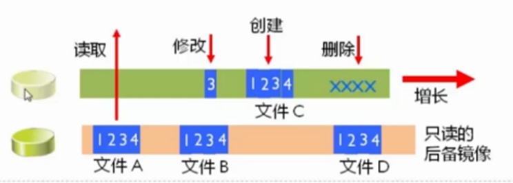
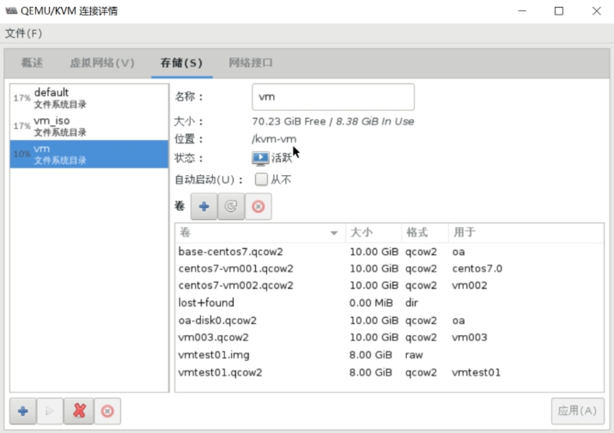
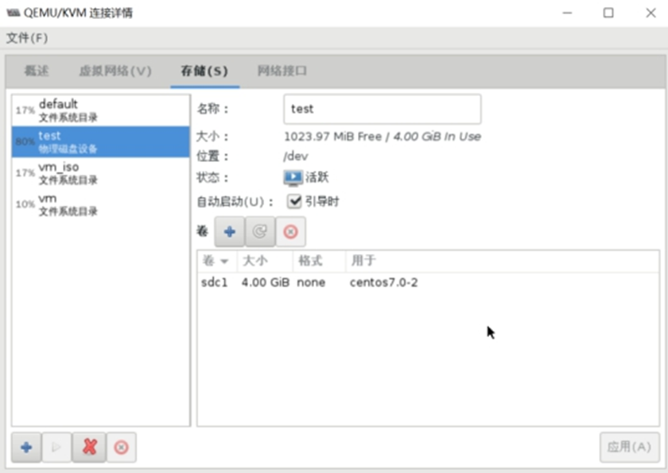
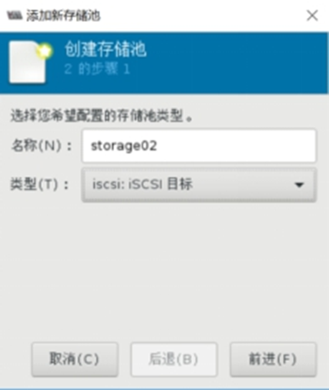
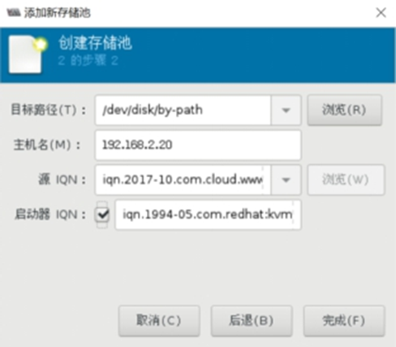
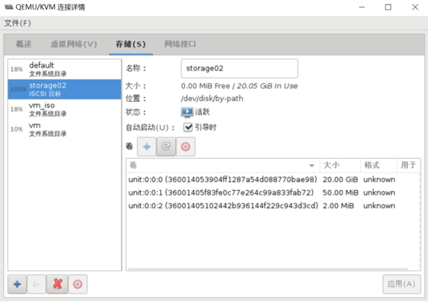

## KVM存储选项类型

KVM的存储选项有多种，包括

* 虚拟磁盘文件
* 基于文件系统的存储
* 基于设备的存储。



### 虚拟磁盘文件

当系统创建KVM虚拟机的时候，默认使用虚拟磁盘文件作为后端存储。安装后，虚拟机认为在使用真实的磁盘，但实际上看到的是用于模拟硬盘的虚拟磁盘文件。这一额外的文件系统层会降低系统速度。

当然，基于磁盘镜像的虚拟磁盘并非全无益处，磁盘文件系统可以很轻松地用于其它的KVM虚拟化宿主机。但是如果您希望优化KVM虚拟化性能，最好考虑其它的存储方式。

### 基于文件系统的KVM存储

在安装KVM宿主机时，可选文件系统为dir(directory)或fs(formatted block storage)作为初始KVM存储格式。默认选项为dir,用户指定本地文件系统中的一个目录用于创建磁盘镜像文件。

fs选项可以允许用户指定某个格式化文件系统的名称，把它作为专用的磁盘镜像文件存储。两种KVM存储选项之间最主要的区别在于：fs文件系统不需要挂载到某个特定的分区。

两种选项所指定的文件系统，都可以是本地文件系统或位于SAN上某个物理宿主机上的网络文件系统。后者具备一定的优势，因为SAN可以很轻易地实现多个主机同时访问，而本地磁盘或文件系统则无法实现。

还有一种基于文件的磁盘存储方式是netfs,用户可以指定一个网络文件系统的名称，如Samba.用这种方式作为KVM存储很方便，因为这样很容易访问到位于其它服务器上的文件系统，同时用户也可以通过多台宿主机访问磁盘文件。

所有的这些基于文件的KVM存储方式都有一个缺点：文件系统固有缺陷。因为虚拟机的磁盘文件不能直接读取或写入KVM存储设备，而是写入宿主机OS之上的文件系统。这也就意味着在访问和写入文件时中间增加了额外一层，这通常会降低性能。所以，如果您希望寻找KVM虚拟化性能最优方案，最好考虑基于设备的存储。

### 基于设备的KVM存储

另外一种KVM存储的方式就是使用基于设备的方式。共支持四种不同的物理存储：磁盘、iSCSI、SCSI和lvm逻辑盘。磁盘方式指直接读写硬盘设备。iSCSI和SCSI方式可选，取决于用户采取SCSI或iSCSI地址把磁盘设备连接。这种KVM存储方式的优势在于，磁盘的名称是固定的，而不需要取决于宿主机OS搜索到磁盘设备的顺序。

这种连接磁盘的方式也有缺点：灵活性不足。虚拟磁盘的大小很难改变，而且基于设备的KVM存储不支持快照。

如果要优化KVM存储的灵活性，可以使用LVM(Logical Volume Manager)。LVM的优势在于可以使用快照，而快照并不是KVM虚拟化自带的功能。

LVM可以把所有存储放到一个卷组里，从而轻松创建一个逻辑卷。该卷组是物理磁盘设备的一个抽象，所以如果超出可用磁盘空间最大值，还可以向卷组中添加新的设备，从而极大简化了增加存储空间的过程，增加的空间在逻辑卷中直接可以使用。使用LVM使得磁盘空间分配更加灵活，而且增加和删除存储也更为容易。

最后，LVM无论是在单宿主机或多宿主机环境中都可以很好工作。在多宿主机环境中，您可以在SAN上创建逻辑卷。如果使用Cluster LVM,可以很容易的配置成多个主机同时访问某个逻辑卷。

## 使用KVM存储池

为简化KVM存储管理的目的，可以创建存储池。在宿主机上创建存储池，可以简化KVM存储设备的管理。采用存储池的方式还可以实现对提前预留的存储空间的分配。这种策略对于大型应用环境很有效，存储管理员和创建虚拟机的管理经常不是同一个人。这样，在创建首台虚拟机之前先完成KVM存储池的创建是很好的方法。

### 存储池管理

### 存储池的基本概念

存储池是一个由libvirt管理的文件、目录或存储设备，提供给虚拟机使用。存储池被分为存储卷，这些存储卷保存虚拟镜像或连接到虚拟机作为附加存储。

libvirt通过存储池的形式对存储进行统一管理、简化操作。对于虚拟机操作来说，存储池和卷并不是必需的。支持以下类型存储池：

* **dir：** 目录存储池，简单的文件系统目录，用于存放磁盘镜像等文件。
* **fs：** 文件系统存储池，支持多种文件系统，例如 ext4、xfs、nfs 等。
* **netfs：** 网络文件系统存储池，用于将存储挂载到网络上，可以通过 NFS、CIFS 等协议实现。
* **iscsi：** iSCSI 存储池，支持通过 iSCSI 协议挂载存储。
* **scsi：** SCSI 存储池，通过 SCSI 协议挂载存储设备。
* **logical：** LVM 逻辑卷存储池，支持使用 LVM（Logical Volume Manager）创建逻辑卷并作为存储。
* **rbd：** Ceph RBD 存储池，用于连接 Ceph 分布式存储集群中的 Rados Block Device。
* **sheepdog：** Sheepdog 存储池，用于连接 Sheepdog 分布式存储系统。
* **gluster：** Gluster 存储池，用于连接 GlusterFS 分布式文件系统。
* **zfs：** ZFS 存储池，支持使用 ZFS 文件系统。
* **disk：** 直接设备存储池，可以直接使用磁盘设备。

#### virsh中和存储池相关的命令

* pool-autostart          自动启动某个池
* pool-build            建立池
* pool-create-as          从一组变量中创建一个池
* pool-create            从一个 XML 文件中创建一个池
* pool-define-as          在一组变量中定义池
* pool-define            在一个XML文件中定义（但不启动）一个池或修改已有池
* pool-delete            删除池
* pool-destroy           销毁（删除）池
* pool-dumpxml           将池信息保存到XML文档中
* pool-edit             为存储池编辑 XML 配置
* pool-info             查看存储池信息
* pool-list             列出池
* pool-name             将池 UUID 转换为池名称
* pool-refresh            刷新池
* pool-start              启动一个（以前定义的）非活跃的池
* pool-undefine           取消定义一个不活跃的池
* pool-uuid              把一个池名称转换为池 UUID

#### virsh中的和存储卷相关命令

* vol-clone             克隆卷。
* vol-create-as           从一组变量中创建卷
* vol-create             从一个 XML 文件创建一个卷
* vol-create-from           生成卷，使用另一个卷作为输入。
* vol-delete              删除卷
* vol-download            将卷内容下载到文件中
* vol-dumpxml             保存卷信息到XML文档中
* vol-info              查看存储卷信息
* vol-key               根据卷名或路径返回卷的key
* vol-list              列出卷
* vol-name              根据给定卷key或者路径返回卷名
* vol-path              根据卷名或key返回卷路径
* vol-pool              为给定密钥或者路径返回存储池
* vol-resize             重新定义卷大小
* vol-upload             将文件内容上传到卷中
* vol-wipe              擦除卷

示例：

```
#查看系统中的存储池
virsh pool-list --details
 Name  State    Autostart  Persistent   Capacity  Allocation  Available
---
 iso   running  yes        yes         38.28 GiB   11.28 GiB  27.00 GiB
 vms   running  yes        yes         38.28 GiB   11.28 GiB  27.00 GiB

#查看vm存储池的信息
virsh pool-info vm
名称：       vm
UUID:       f97233cf-7cde-4f3d-a6a7-381ca4730493
状态：       running
持久：       是
自动启动： 否
容量：       78.62 GiB
分配：       8.38 GiB
可用：       70.23 GiB

#查看vm存储池中的卷信息
virsh vol-list vm
名称               路径
---
 base-centos7.qcow2   /kvm-vm/base-centos7.qcow2
 centos7-vm001.qcow2  /kvm-vm/centos7-vm001.qcow2
 centos7-vm002.qcow2  /kvm-vm/centos7-vm002.qcow2
 lost+found           /kvm-vm/lost+found
 oa-disk0.qcow2       /kvm-vm/oa-disk0.qcow2
 vm003.qcow2          /kvm-vm/vm003.qcow2
 vmtest01.img         /kvm-vm/vmtest01.img
 vmtest01.qcow2       /kvm-vm/vmtest01.qcow2
```

图形界面查看情况



### 创建基于目录的存储池  dir:Filesystem Directory

```
#创建基于目录的存储池
virsh pool-define-as test dir --target "/guest_images/"

#查看存储池
virsh pool-list --all
 名称               状态     自动开始
---
 default               活动      是
 test                不活跃      否
 vm                 活动     否
 vm_iso               活动     是

#启动存储池
virsh pool-start test
池 test 已启动

#设置存储池自启
virsh pool-autostart test
池 test 标记为自动启动


#如果创建的存储池的目录不存在的时候，需要先通过pool-build命令构建然后才能启动成功
virsh pool-build test
```

### 创建基于分区的存储池  fs:Pre-Formatted Block Device

Libvirtd会自动挂载mount分区

```
#准备分区并创建文件系统
fdisk /dev/sdc
mkfs.ext4 /dev/sdc1

#创建：
#Source Path:块设备名
#Target Path:mount到的目录名

#定义池 test
virsh pool-define-as test fs \
--source-dev "/dev/sdc1" \
--target "/guest_images"

#构建池 test
virsh pool-build test

#启动存储池
virsh pool-start test

#设置存储池自启
virsh pool-autostart test


#查看创建的存储池
virsh pool-list
 名称               状态     自动开始
---
 default               活动     是
 test                 活动     是
 vm                 活动     否
 vm_iso               活动     是
```

### 创建基于磁盘的存储池    disk:Physical Disk Device

```
#准备XML文件
cat /etc/libvirt/storage/test.xml

<pool type='disk'>
  <name>test </name>
<source>
    <device path='/dev/sdc'/>
    <format type='gpt'/>
</source>
<target>
    <path>/dev </path>
</target>
</pool>


#创建存储池
virsh pool-define test.xml

#启动存储池
virsh pool-start test
池 test 已启动

#设置自启
virsh pool-autostart test
池 test 标记为自动启动
```

创建后结果如下图：



### 创建基于LVM的存储池  logical：LVM Volume Group

基于LVM的存储池要求使用全部磁盘分区

创建存储池时，首先准备一个vg,vg中不需要创建lv，有两种情况

* 使用现有的VG  kvmvg
* 创建新的VG    kvmvg

参数：

* Target Path:新的卷组名
* Source Path:存储设备的位置
* Build Pool：会创建新的VG

```
virsh pool-define-as kvmvg logical  --source-name kvmvg --target /dev/kvmvg
```

### 创建基于iSCSI的存储池   iscsi：iSCSI Target

#### 基于命令行创建

创建iSCSI服务器的操作此处略过。

创建iSCSI的存储池，

```
virsh pool-define-as --name storage01 --type iscsi \
--source-host 192.168.2.20 \       //存储服务器的地址
--source-dev [iqn.2017-10.com.cloud](http://iqn.2017-10.com.cloud).www:storage001 \   //target目标
--target /dev/disk/by-path


virsh pool-start storage01
virsh pool-autostart storage01
```

#### 基于virt-manager创建







### 基于NFS的存储池  netfs:Network Export Directory

创建nfs服务器部分此处略过。

#### 命令行创建存储池

```
virsh pool-define-as --name kvmnfs --type netfs \
--source-host 192.168.2.20 \
--source-path /nfsshare \
--target /nfstest      //需要提前创建目录
```

## Reference Links：

https://edu.51cto.com/lecturer/9286589-c81.html

#刘世民

https://www.cnblogs.com/sammyliu/p/4543110.html
