## 基本概念

在SAN中，主机一般都是Initiator，存储设备则是Target。

* Initiator
  * SCSI会话的发起方
  * 向Target请求LUN,并将数据的读写指令发送给Target。
* Target
  * 接受SCSI回话的一方
  * 它接收来自Initiator的指令，为Initiator提供LUN,并实现对LUN的读写

### Linux主要的开源Target项目

* Linux SCSI Target-STGT/tgt
* Linux-IO Target - LIO  Linux 2.6.38开始纳入内核
* SCST-Generic SCSI Subsystem for linux
  * http://scst.sourceforge.net/comparison.html

## Linux-IO Target概述

http://linux-iscsi.org/wiki/Main_Page

Linux-IO Target在Linux内核中，用软件实现各种SCSI Target

* 前端：FC、FCoE、iSCSI、1394、USB、vHost等
* 后端：SATA, SAS, SCSI, SSD, FLASH, DVD, USB, ramdisk等

### 架构

* 支持SSE4.2高性能、多线程
* 支持x86, ia64, Alpha, Cell, PPC, ARM, MIPS等多种CPU
* 支持高可用、负载平衡群集


iscsi实现网络存储，提供存储端叫 target，使用存储端叫 initiator。target 上可以提供存储空间，initiator负责连接ISCSI设备，在ISCSI设备中创建文件系统，以及存取数据，在 initiator 上看上去是多了一块硬盘。

服务器端配置target，准备做为LUN发布的ISCSI的存储设备（可以是一整块磁盘、一个分区、逻辑卷或RAID阵列）。

事先准备好两个逻辑卷作为ISCSI的存储设备。


首先安装target


启动服务

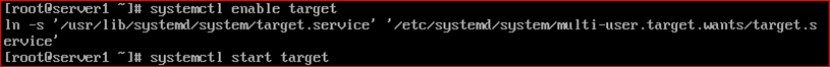

设置防火墙


执行targetcli工具


注：输入help可以查看targetcli的帮助

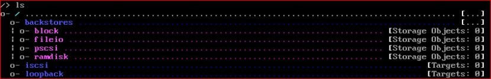

基本思路：

先把准备共享的块做出来，创建一个target，在target上创建LUN，一个LUN连接一个块

1、创建块即给要发布的逻辑卷起个名字

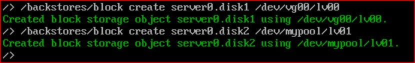

注：给/dev/vg00/lv00逻辑卷起个名字叫server0.disk1;给/dev/mypool/lv01逻辑卷起个名字叫server0.disk2

查看块如下图所示：

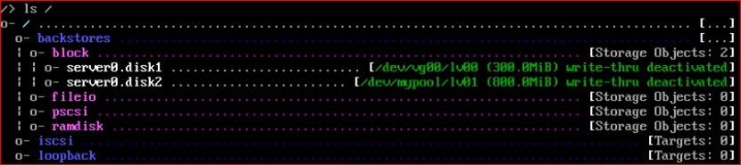

2、创建 iqn 名字即创建ISCSI对象

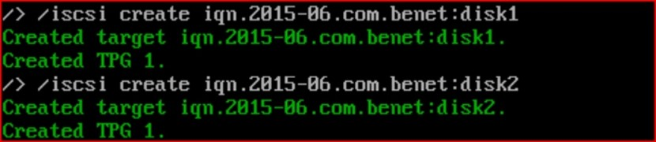

查看ISCSI对象如下图所示：

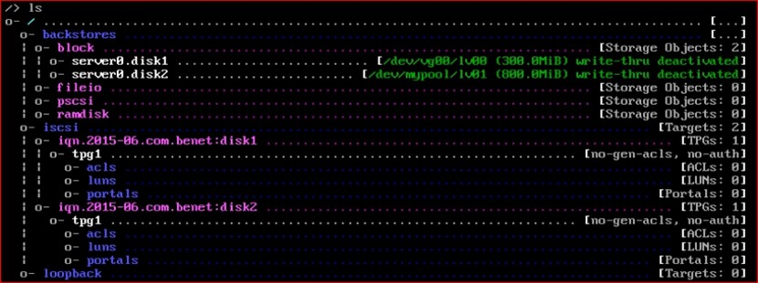

3、设置ACL即将ISCSI对象与客户端IP或主机名绑定

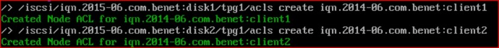

注意：iqn.2015-06.com.benet:client1是 initiator 的名字，需要在客户端中设置的。

4、创建LUN并绑定块

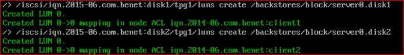

一个ISCSI对象可以创建多个LUN（LUN0、LUN1……）。

执行ls查看

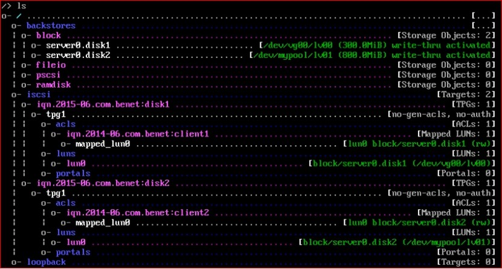

启动监听程序

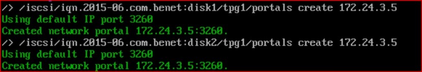

注：172.24.3.5是ISCSI服务端网卡IP


可以查看/etc/target/saveconfig.json配置文件，该配置文件保存着ISCSI的配置。


在initiator端的配置：

1、安装软件

yum install -y iscsi-initiator-utils

2、给 initiator 起个名字

vim /etc/iscsi/initiatorname.iscsi

内容如下：


3、启动服务

systemctl enable iscsi; systemctl start iscsi

4、发现存储

iscsiadm -m discovery -t st -p 172.24.3.5


5、登录存储

iscsiadm -m node -T iqn.2015-06.com.benet:disk1 -p 172.24.3.5 -l

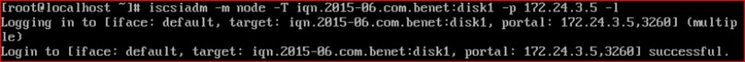

注：-l表示连接ISCSI目标；-u表示断开和ISCSI目标的连接

验证客户端ISCSI连接


剩下来的操作就和管理本地磁盘一样了

## 创建Linux的iSCSI存储

最小化安装的Linux

安装targetcli软件包：yum install targetcli

使用targetcli配置存储

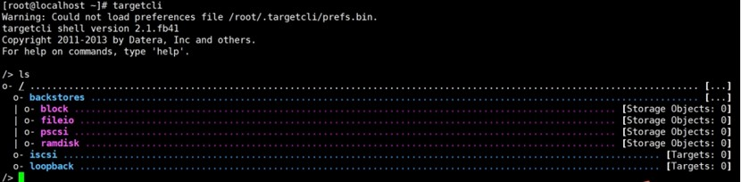

## 配置Target

1) 创建存储对象

   1) 创建块存储对象    create block1 /dev/sdb1
   2) 创建fileio对象     create fileio1 /tmp/foo.img 50M
   3) 创建ramdisk对象   create ramdisk1 2M
2) 创建iSCSI Target  create iqn.2017-10.com.cloud.www:storage001
3) 配置target portal group(TPG)

   1) 配置portals   使用create命令，默认已存在
   2) 配置LUN

      ```
      create /backstores/block/block1
      create /backstores/fileio/fileio1
      create /backstores/ramdisk/ramdisk1
      ```
   3) 配置ACL

      ```
      create iqn.1994-05.com.redhat:kvm2
      ```
   4) 保存配置   saveconfig
   5) 设置target服务自动启动

      ```
      systemctl enable target
      systemctl start target
      ```
   6) 检查配置

## initiator连接target

检查是否可以发现

```
cat /etc/iscsi/initiatorname.iscsi
InitiatorName=iqn.1994-05.com.redhat:kvm2


iscsiadm -m discovery --type sendtargets --portal 192.168.2.20
192.168.2.20:3260,1 iqn.2017-10.com.cloud.www:storage001
```

测试挂载设备

```
iscsiadm -d2 -m node --login
```

断开与target的连接

```
iscsiadm -d2 -m node --logout
```

## Reference Links：

https://edu.51cto.com/lecturer/9286589-c81.html
