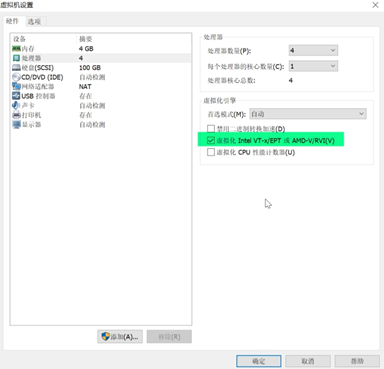

# 前置操作

KVM（Kernel-based Virtual Machine） [http://www.linux-kvm.org/](http://www.linux-kvm.org/) ，基于内核的虚拟机，配合QEMU（处理器虚拟软件），需要CPU支持虚拟化技术（并且在BIOS里打开虚拟化选项），效率可达到物理机的80％以上。

## 查看cpu是否支持

```
sudo grep -E 'svm|vmx' /proc/cpuinfo

#返回以下内容说明主机支持KVM
- vmx is for Intel processors
- svm is for AMD processors
```

# 安装虚拟化软件

```
sudo dnf install qemu-kvm libvirt virt-install bridge-util

#图形化工具：
yum install virt-manager virt-viewer
#开启 libvirtd 服务:
systemctl enable libvirtd && systemctl start libvirtd
```

> 注意：安装软件时一定要确实真正安装上了，如果个别软件无法yum安装，可以先安装epel源。

# 安装KVM

### 环境要求：

如果是物理服务器，需要在BIOS中打开虚拟化功能（Virtualization Technology），一般的服务器默认是打开这个功能的。


如果是用VMware Workstation做实验，建立的虚拟机的CPU要勾选虚拟化功能，这样虚拟机才会支持KVM虚拟化


