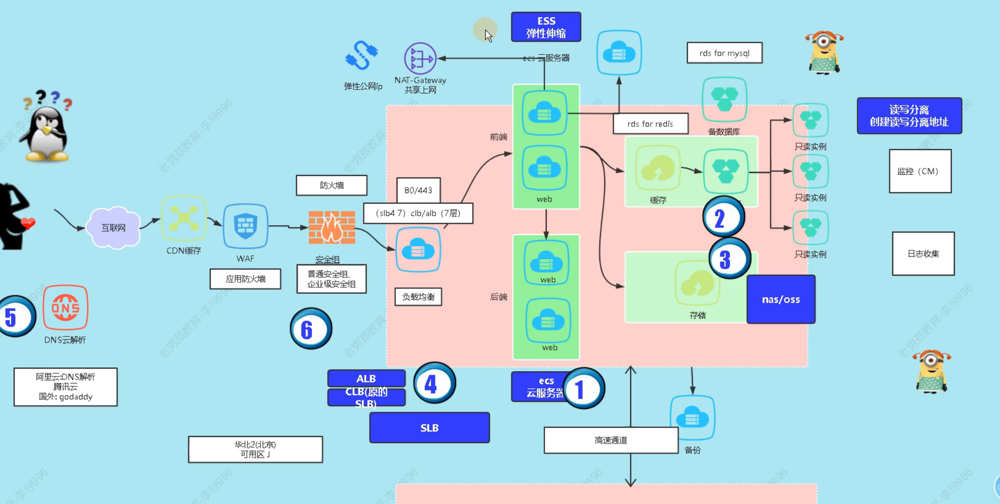
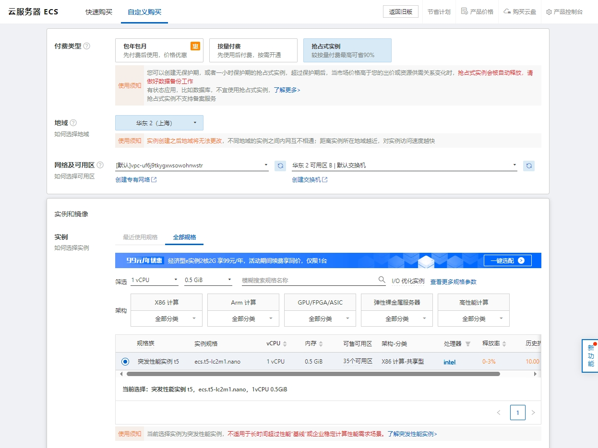
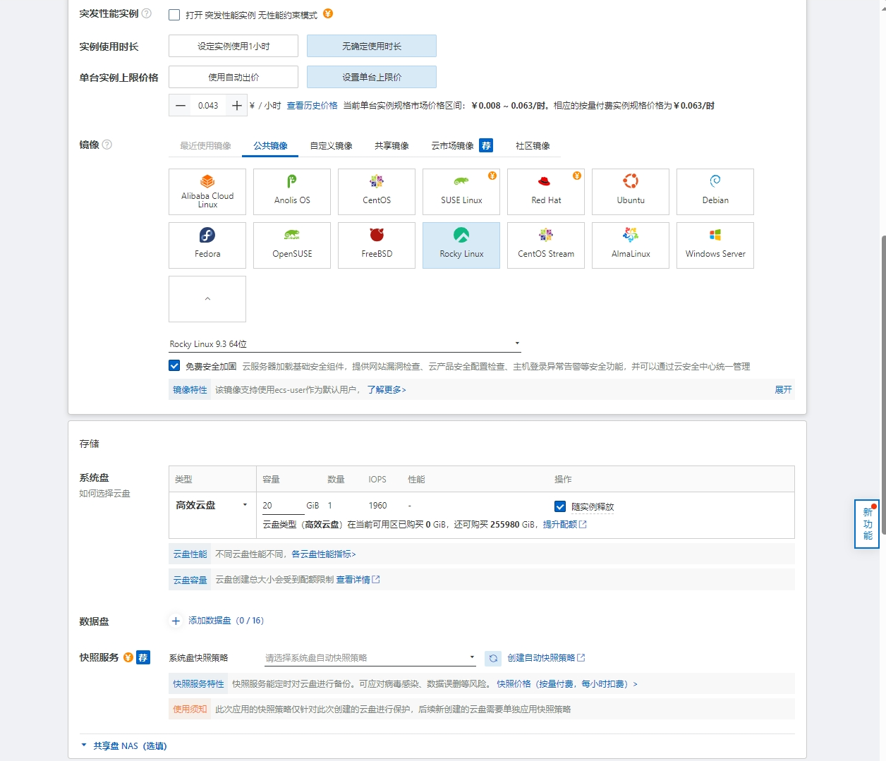
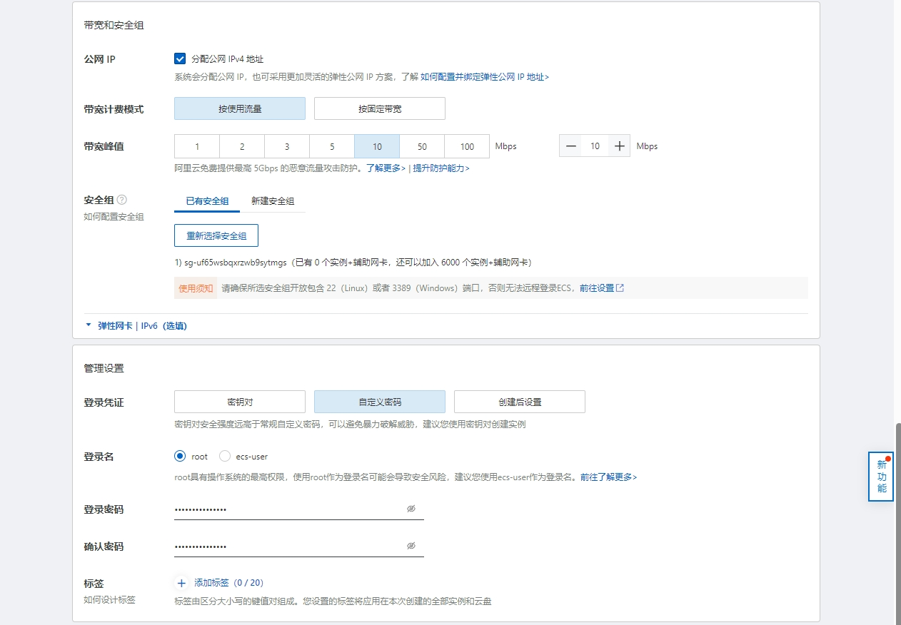
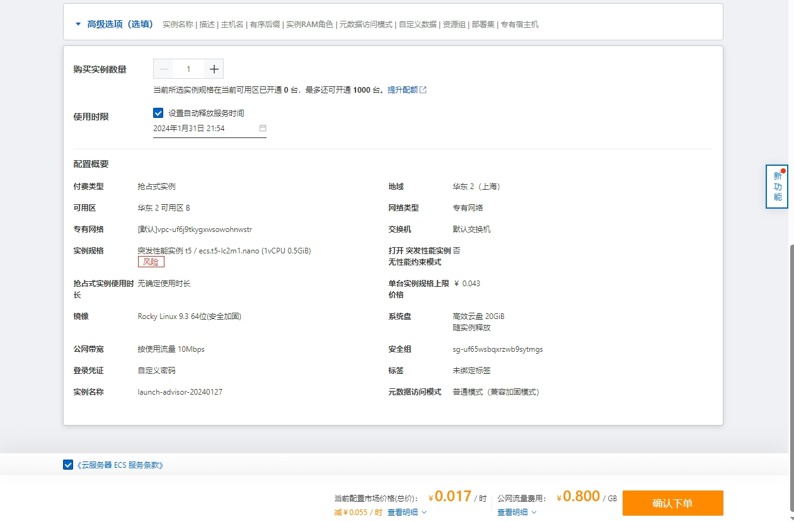

## 基础架构简介

## 实验环境

### ECS购买

阿里云官方：https://www.aliyun.com/

几个参数参考：

* 付费类型：抢占式实例
  * 抢占式实例便宜，可以设置限价释放，做完试验后可以直接删除，也可以设置自动施放时间。
  * 生产环境不要使用该类型。
* 实例规格：1v0.5g
* 系统：Rockylinux9.3
* 系统盘：20g
* 登录名：root
  * 实验环境为方便操作使用root，生产环境不要设置root登录
* 登录密码：`s+F8EVbq4{M6I+^`
  * 不要使用弱密码
* 价格：0.017*24=0.408  实例每天0.4元，流量0.8/G

## 阿里云术语

* 地域 简称 Region 是阿里云建设的数据中心。资源创建成功后无法更换地域
* 可用区简称 Zone 同一地域内，电力和网络互相独立的物理数据中心。一个地域下可以有多个可用区。同一地域内可用区之间内网互通并且故障隔离，云服务器 ECS 网络延时低。
* 实例 简称 Instance采用虚拟化技术从阿里云物理服务器上虚拟出来的虚拟机，是一台云服务器 ECS 的基本计算单位。
* 镜像 简称 Image镜像，一般包含了操作系统和应用软件。新建实例的系统盘数据完全拷贝镜像，包括操作系统，软件配置等。您可以使用镜像初始化实例或者更换系统盘。
* 磁盘 简称 Disk云服务器 ECS 的存储设备。
* 安全组 简称 Security group 虚拟防火墙，一台实例至少属于一个安全组
* 快照 简称 Snapshot 为磁盘创建的数据还原点，包含特定时刻磁盘数据。快照可以用于还原磁盘数据或创建镜像。
* 标签 简称 Tag由一对键值对（Key-Value）组成，为资源绑定标签便于快速筛选和分类。
* IP 地址IP address云服务器 ECS 的公网或者私网 IP 地址。
* 专有网络 基于阿里云创建的自定义私有网络，不同专有网络之间通过隧道在逻辑上彻底隔离。
* 弹性网卡 一种独立的虚拟网卡，可以绑定到ECS实例或从ECS实例解绑，实现业务的灵活扩展和迁移。

## Reference Links：

**#阿里云ECS相关概念**

https://help.aliyun.com/zh/ecs/product-overview/terms
