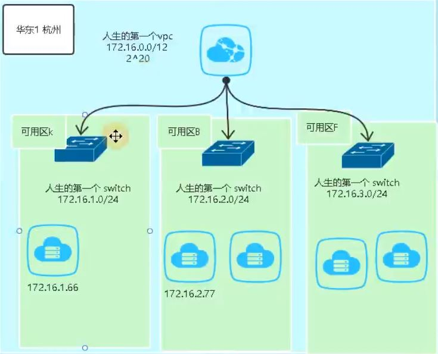
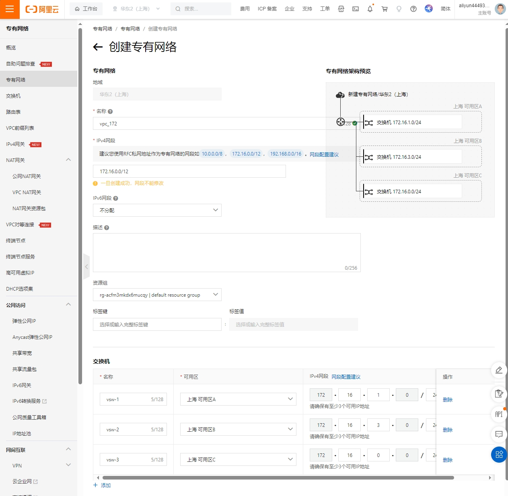
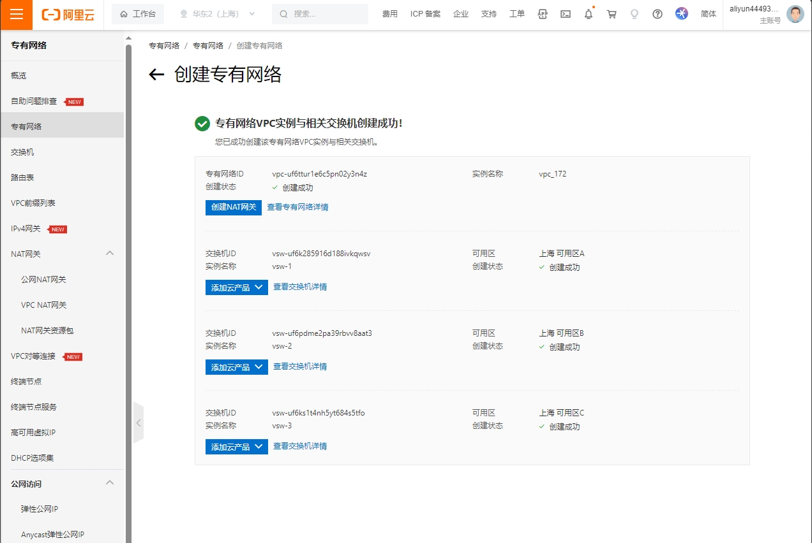
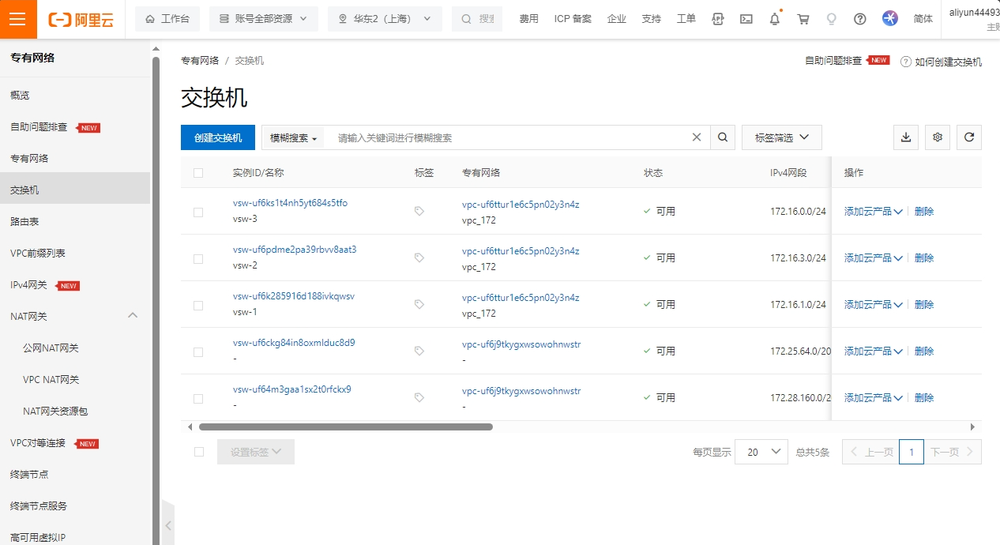
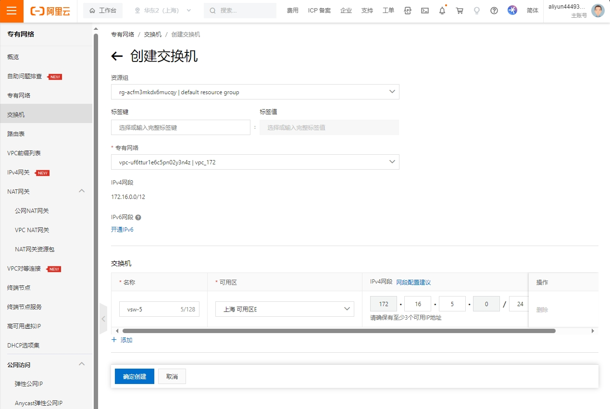
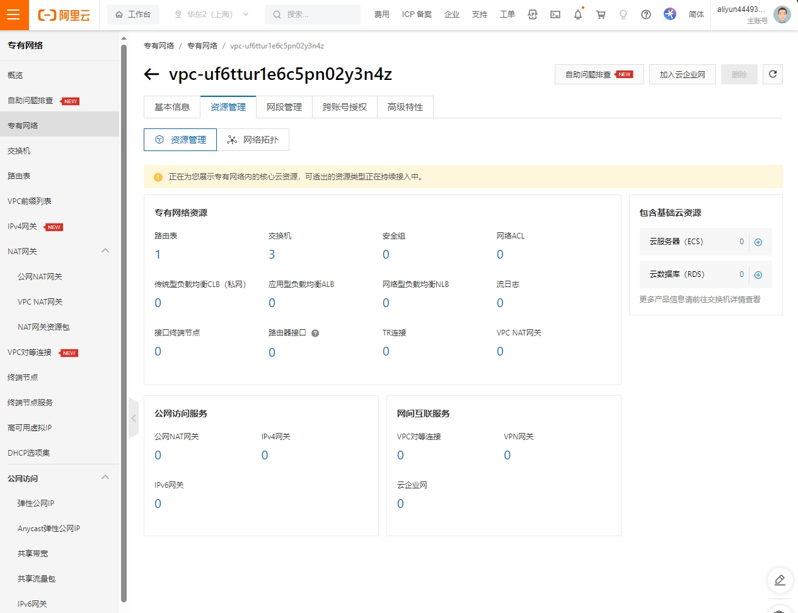
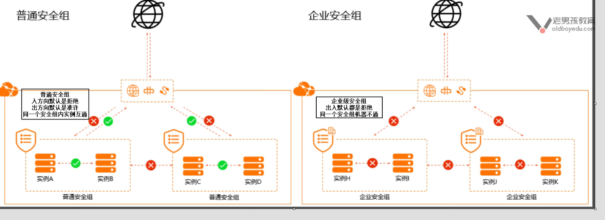
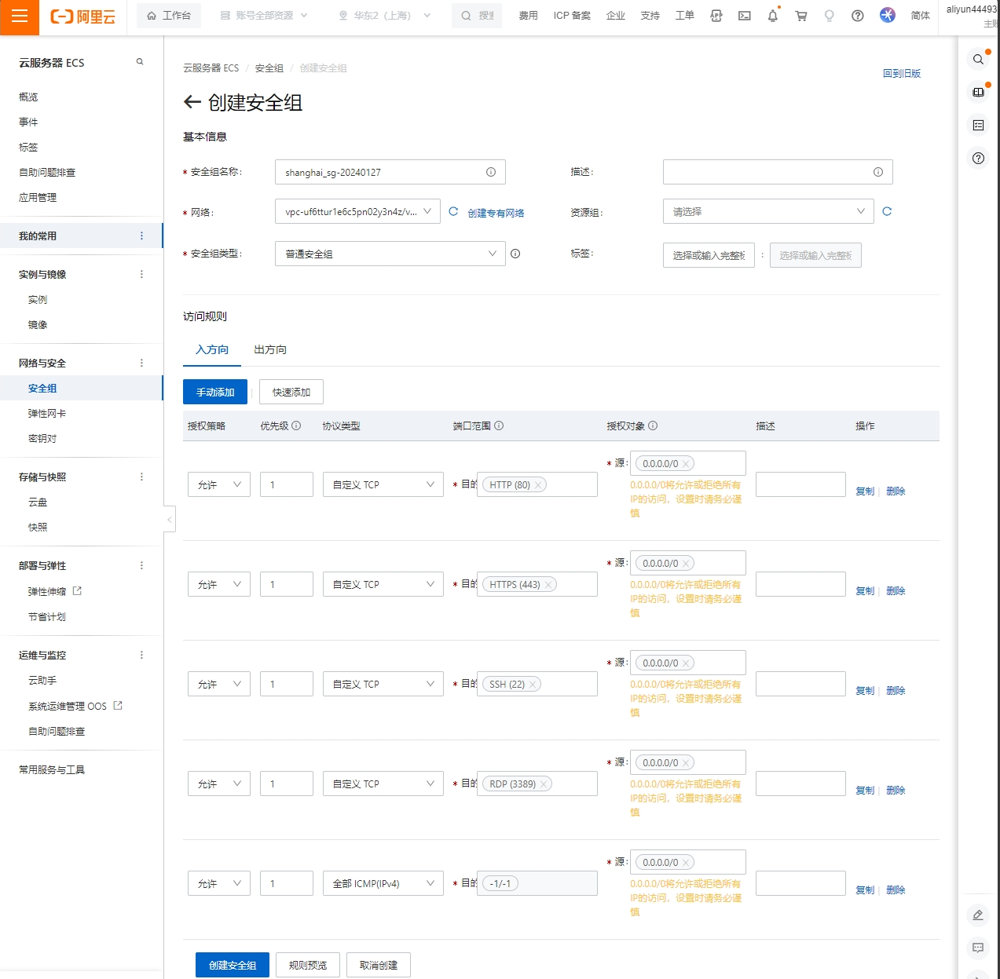

## VPC

vpc是虚拟专有网络，实现虚拟局域网功能，可以自定义网段，还可以通过创建虚拟交换机划分子网。

### 创建VPC

专有网络 > 专有网络 > 创建专有网络

主要参数：

* 名称：vpc_172
* 网段：172.16.0.0/12
* 交换机：创建三个

  * 交换机1

    * 名称：vsw-1
    * 可用区：上海 可用区A
    * 网段：172.16.1.0/24
  * 交换机2

    * 名称：vsw-2
    * 可用区：上海 可用区B
    * 网段：172.16.2.0/24
  * 交换机3

    * 名称：vsw-3
    * 可用区：上海 可用区C
    * 网段：172.16.3.0/24

创建完成

### 添加交换机

在创建VPC时可以同时创建交换机，或者在VPC创建完成后创建交换机。

专有网络 > 交换机 > 创建交换机

主要参数：

* 专有网络：交换机连接的VPC

  * 选择我们刚刚创建的172的交换机
* 交换机：可以同时创建多个，这里我们只创建一个用作测试。

  * 名称：vsw-5
  * 可用区：上海 可用区E
  * 网段：172.16.5.0/24

或者也可以按照以下操作进行添加交换机

专有网络 > 专有网络 > 选择对应的VPC > 资源管理 > 专有网络资源 > 点击“交换机”添加

## 安全组

### 安全组简介

安全组：功能类似防火墙，关闭或开启外界访问端口和IP地址

阿里云安全组默认规则是：白名单，默认拒绝。

安全组和实例的地区是绑定的，需要在同一区域

### 安全组主要概念

* 网络：安全组绑定的VPC。安全组和网络是绑定的。
* 安全组：分为普通安全组和企业安全组

  * 一般用普通安全组。
* 访问规则：分为出方向和入方向

  * 一般是关注入方向，生产环境最好也关注出方向，可以通过限制源IP达到特定主机才能访问的效果，更安全。

#### 普通安全组和企业安全组区别

具体区别可以查看文末官方链接。

### 创建安全组

ECS控制台（云服务器ECS）> 网络与安全 > 安全组 >创建安全组

参数选择：

* 网络：安全组需要和网络绑定，选择我们刚刚创建的vpc_172的VPC。
* 安全组类型：分为普通安全组和企业安全组。
  * 这里我们选择普通安全组。
* 访问规则：按照需求添加即可，类似与iptables操作。

## Reference Links：

https://help.aliyun.com/zh/ecs/user-guide/basic-security-groups-and-advanced-security-groups
