## 块存储

## NAS存储-文件存储

搜索栏目搜索NAS，有多种类型可选，通用型NAS，急速型NAS和CPFS，常用的是通用型。

收费类型是按量付费。

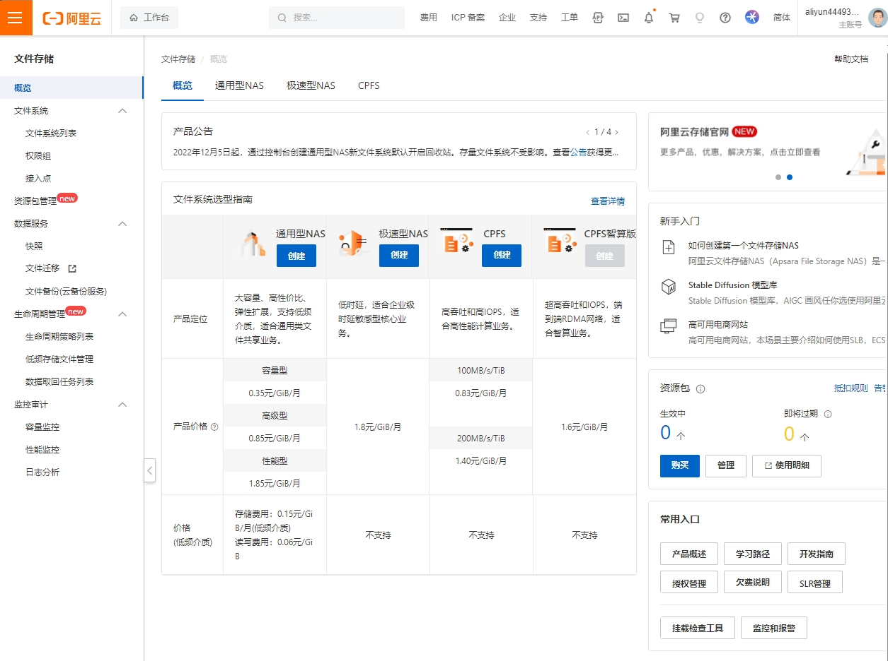

### NAS创建

参数选择：

* 地域：上海
* 可用区：华东2 可用区B

  * 通用型文件系统可以被不同可用区的计算节点挂载访问，也可通过云企业网跨网络或账号挂载访问。
* 存储规格：有容量型和性能型，选容量型。
* 协议类型：选NFS

  * Linux客户端建议使用NFS协议
  * Windows客户端建议使用SMB协议

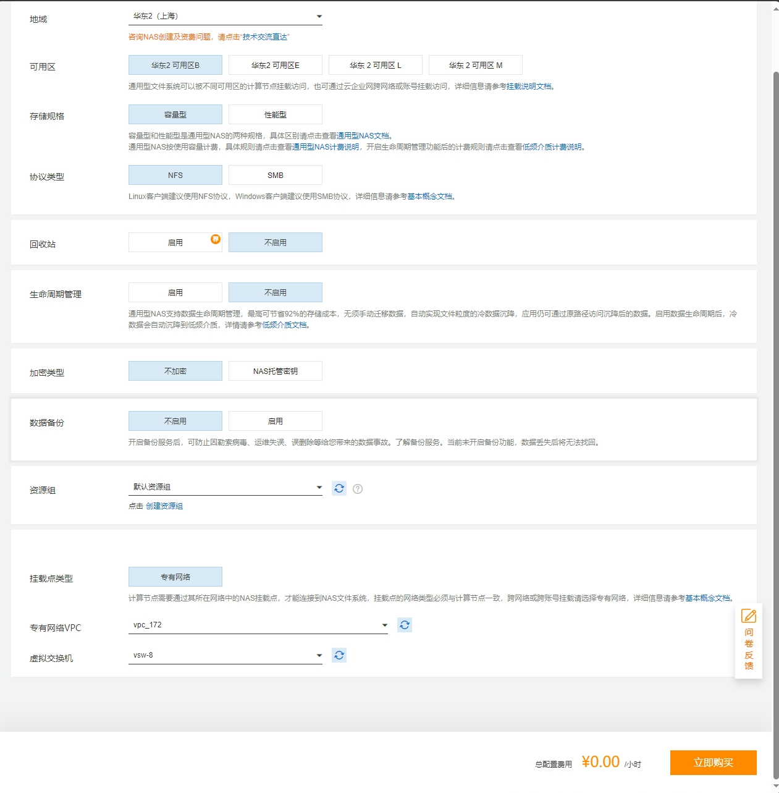

创建成功

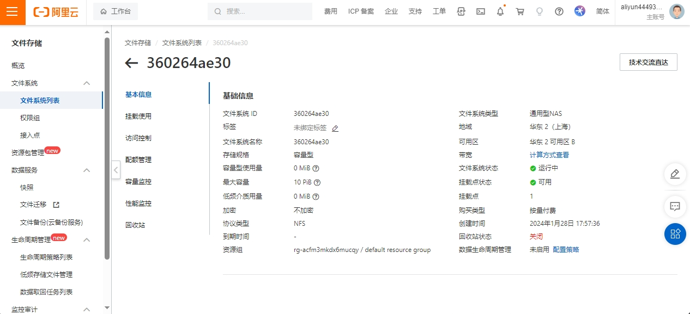

### NAS使用

文件存储 > 文件系统 > 文件系统列表 > 选择对应的NAS > 挂载使用 > 通过命令行挂载到ECS

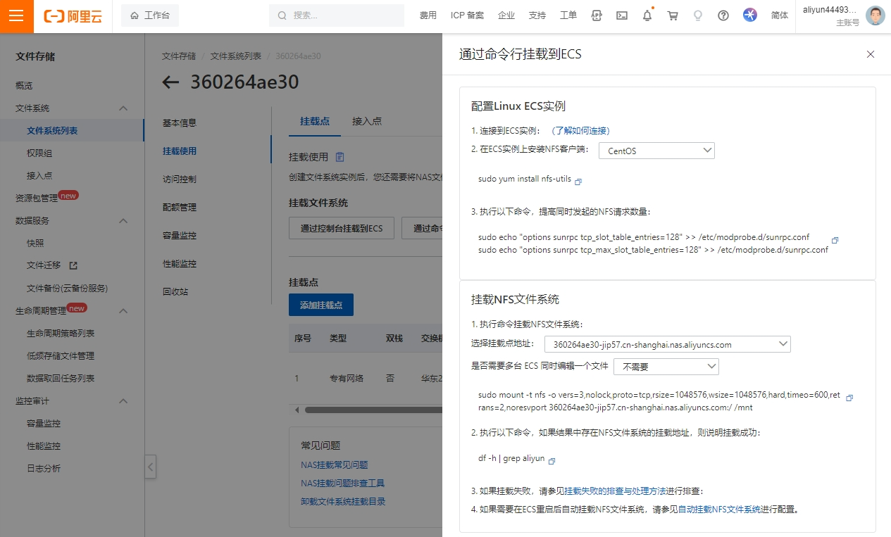

具体命令：

```
#安装NFS客户端
sudo yum install nfs-utils

#设置NFS并发数
sudo echo "options sunrpc tcp_slot_table_entries=128" >>  /etc/modprobe.d/sunrpc.conf 
sudo echo "options sunrpc tcp_max_slot_table_entries=128" >>  /etc/modprobe.d/sunrpc.conf

挂载NFS文件系统
#在ECS上执行以下命令
sudo mount -t nfs -o vers=3,nolock,proto=tcp,rsize=1048576,wsize=1048576,hard,timeo=600,retrans=2,noresvport 360264ae30-jip57.cn-shanghai.nas.aliyuncs.com:/ /mnt

#验证
#如果结果中存在NFS文件系统的挂载地址，则说明挂载成功
df -h | grep aliyun
```

## OSS存储-对象存储

搜索栏目搜索OSS存储。bucket是OSS存储对象，程序操作bucket完成数据读写。

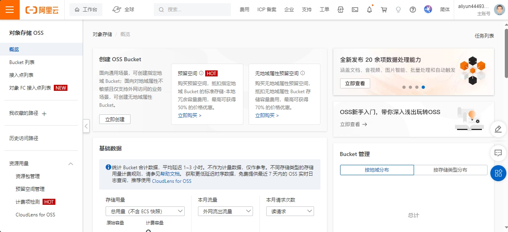

### Bucket创建

主要参数：

* Bucket名称：全网唯一，Bucket 创建成功后名称将无法更改。
* 地域：选择ECS同属区域
* 存储类型：主要有三种存储，选标准存储。
  * 标准存储：高可靠、高可用、高性能，数据会经常被访问到。
  * 低频访问存储：数据长期存储、较少访问，存储单价低于标准类型。
  * 归档存储：选择归档存储后，文件需要先解冻才能访问。数据解冻会产生数据取回费用，按解冻数据大小计算数据解冻费用。
* 读写权限：分私有，公共读，公共读写。
  * 私有：对文件的所有访问操作需要进行身份验证。
  * 公共读：公共只读，权限可以不通过身份验证直接读取您 Bucket 中的数据，安全风险高。
  * 公共读写：公共读写，权限可以不通过身份验证直接读取您 Bucket 中的数据，安全风险高。

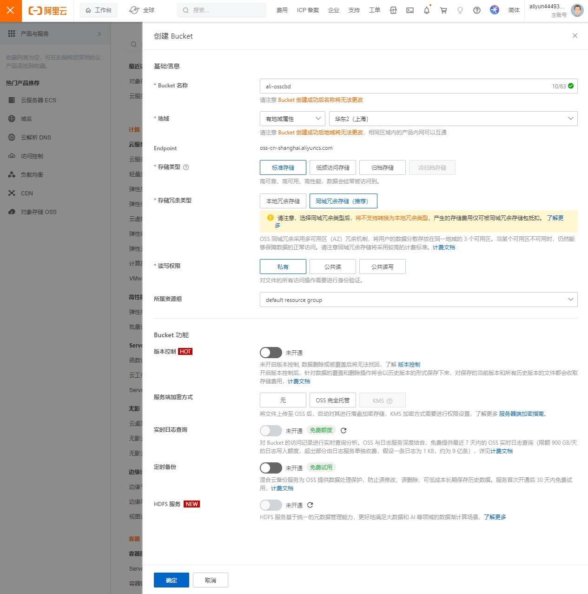

创建成功

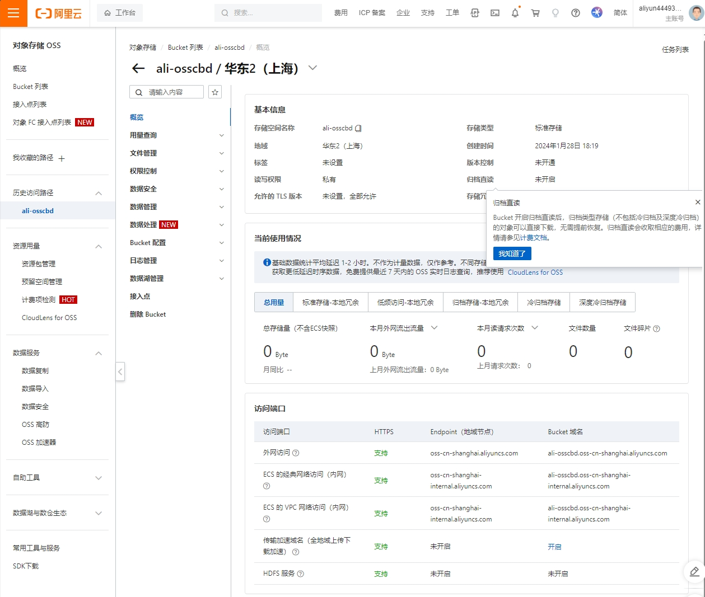

### Bucket使用

OSS存储一般是业务程序调用OSS的API直接存储文件的。具体使用需要查看阿里云的OSS API文档。

#### 创建接入点（API）

对象存储 > bucket列表 > 选择对应的bucket > 接入点 > 创建 接入点

主要参数：

* Bucket：选择需要操作数据读写的Bucket名称
* 网络来源：云实例选VPC，本地机房主机选互联网
  * 选择互联网

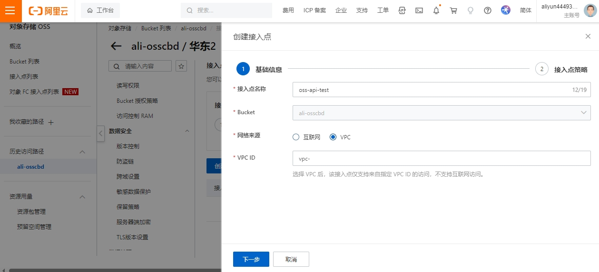

##### 接入点策略配置

接入点 ARN

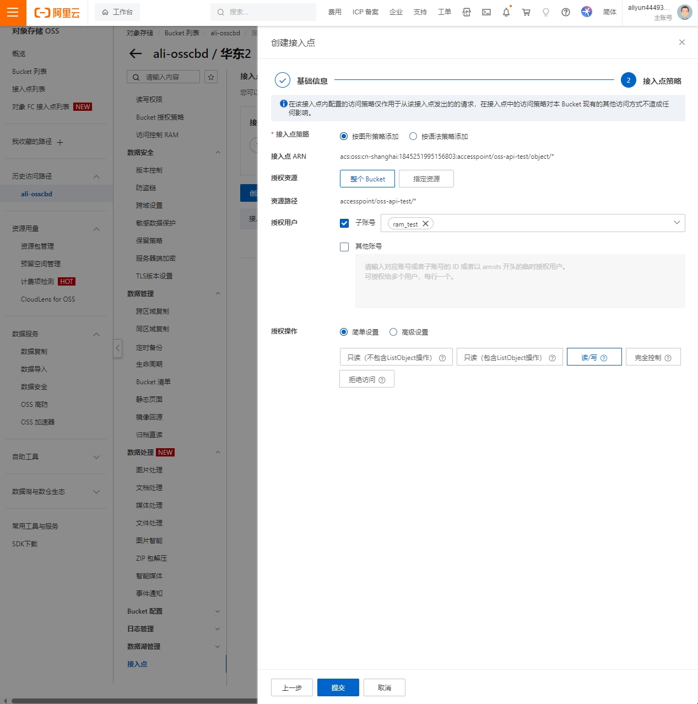

##### 查看接入点详细信息

业务操作OSS时，需要下载OSS的SDK，下图左下角可以下载。

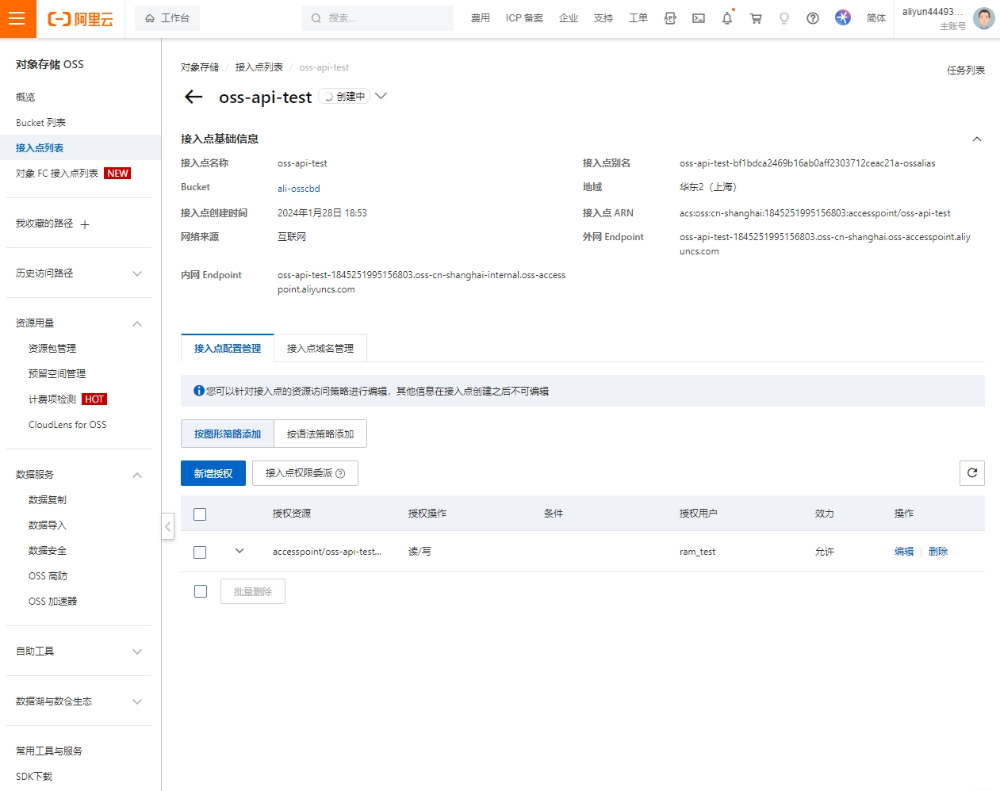

##### 接入点委派

接入点配置完成后必须进行权限委派，否则无法正常使用接入点。

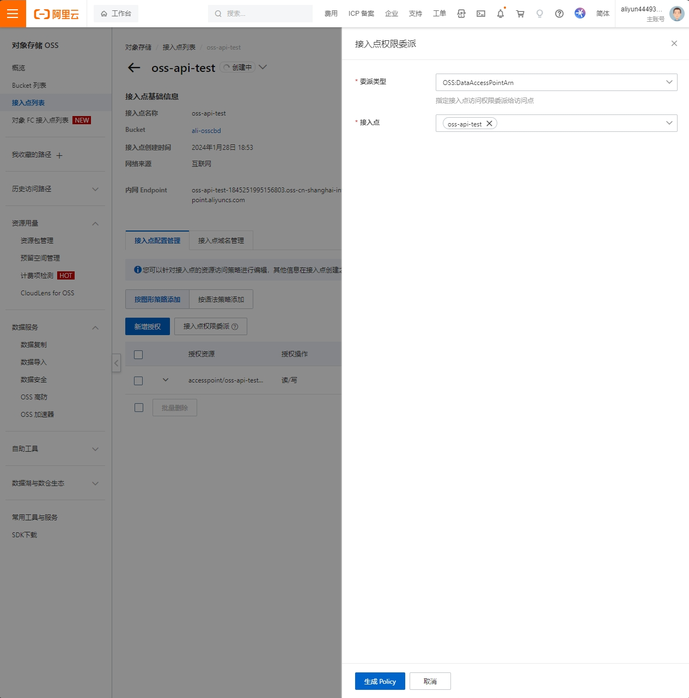
