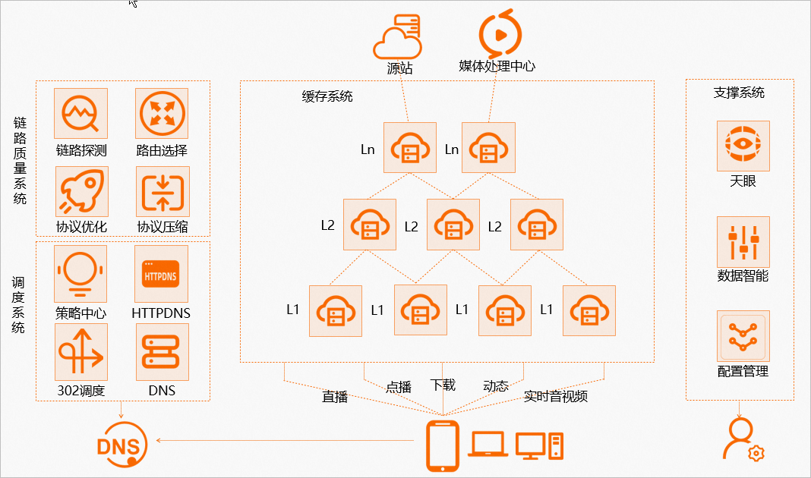
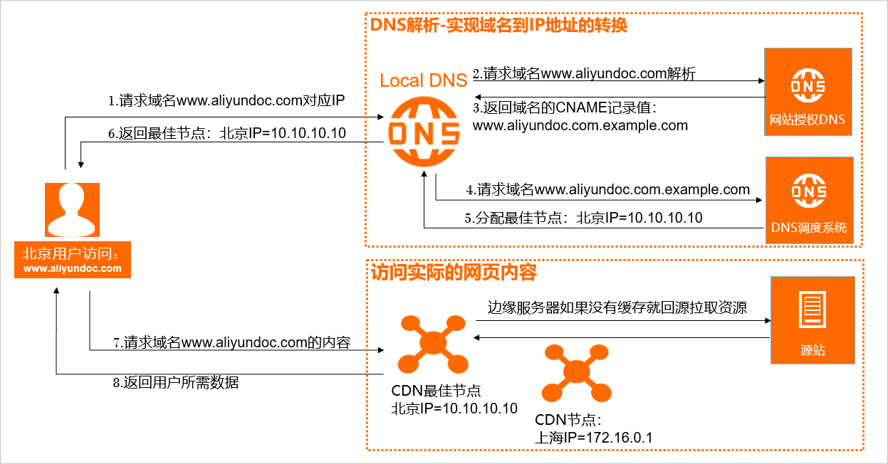
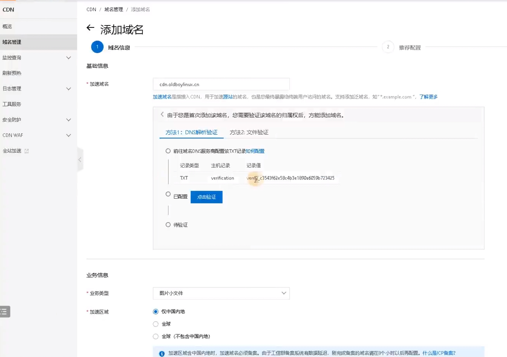
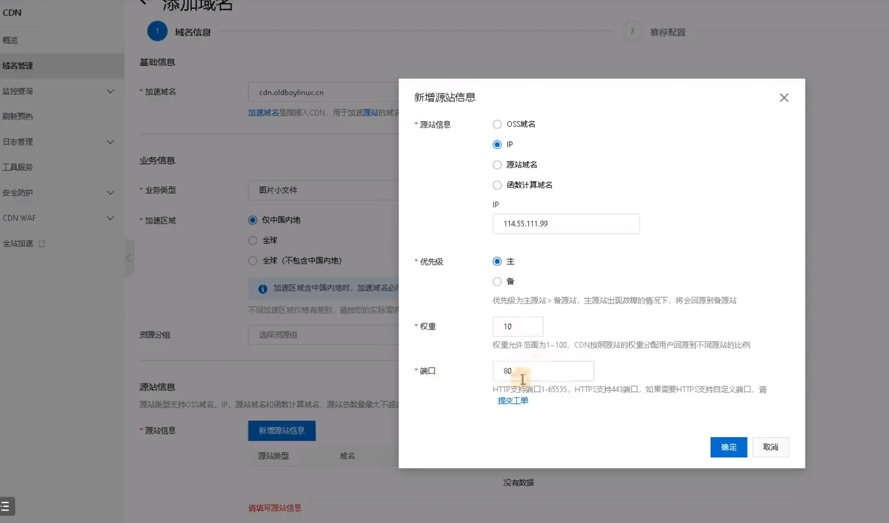
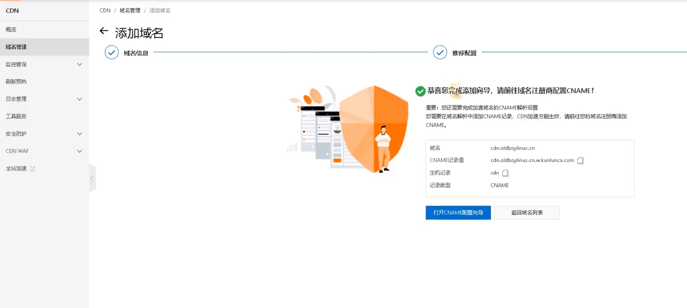
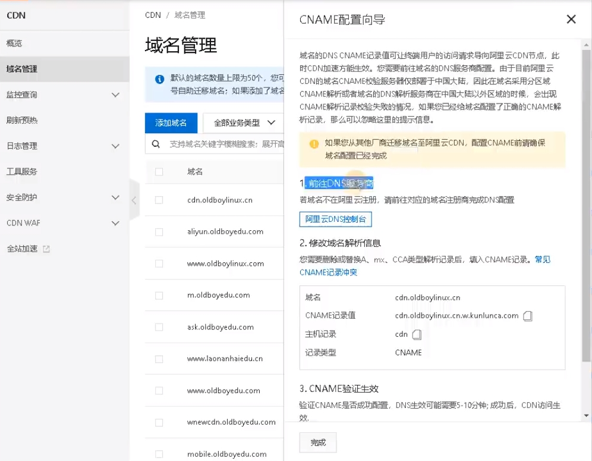

---
title：8.阿里云CDN
---
## CDN简介

CDN，即内容分发网络（Content Delivery Network），是一种通过在全球范围内分布式部署服务器，提高网络性能、加速内容传输的技术架构。CDN的主要目标是使用户能够更快速、更可靠地访问网站上的内容，提高用户体验并降低服务器负载。

## CDN基本原理

### 基本原理

CDN的基本原理是通过将网站的静态资源（如图片、样式表、脚本等）缓存到位于全球各地的分布式服务器上。当用户访问网站时，CDN会根据用户的地理位置选择距离用户最近的服务器来提供内容，从而减少数据传输的延迟，加快页面加载速度。

### 关键组件

* **原始服务器（Origin Server）：** 存放网站原始内容的服务器。CDN会从这里获取并缓存静态资源。
* **边缘服务器（Edge Server）：** 位于全球各地的服务器，缓存了从原始服务器获取的静态资源，并提供给用户访问。这些服务器通常位于与用户距离较近的位置，形成一个分布式网络。
* **CDN节点：** 边缘服务器的集合，共同组成CDN网络。CDN节点与边缘服务器有时可以互换使用的术语。

### 缓存策略

* **缓存时间：** 确定静态资源在边缘服务器上的保存时间，可配置为短期或长期缓存。
* **缓存规则：** 可以配置哪些资源需要缓存、哪些资源需要实时从原始服务器获取。

### 应用场景

* **网站加速：** 提供快速访问网站的静态资源，加速页面加载速度。
* **流媒体分发：** 用于传送音频、视频等大文件，减少卡顿和缓冲时间。
* **在线游戏：** 通过提供低延迟和高可用性，改善在线游戏的体验。
* **安全性：** 提供DDoS攻击防护、安全加密等功能。

### 优势

* **加速页面加载速度：** 将静态资源缓存在离用户更近的服务器上，减少了数据传输的延迟，提高了页面加载速度。
* **降低原始服务器负载：** 静态资源被缓存在CDN边缘服务器上，减轻了原始服务器的负载，使其更专注于处理动态内容和业务逻辑。
* **提高可用性和稳定性：** CDN通过分布式架构和负载均衡机制提高了系统的可用性，即使某个节点出现故障，其他节点仍然可以提供服务。

## 阿里云CDN架构图

## 加速原理

1. 当终端用户向 `www.aliyundoc.com`下的指定资源发起请求时，首先向Local DNS（本地DNS）发起请求域名 `www.aliyundoc.com`对应的IP。
2. Local DNS检查缓存中是否有 `www.aliyundoc.com`的IP地址记录。如果有，则直接返回给终端用户；如果没有，则向网站授权DNS请求域名 `www.aliyundoc.com`的解析记录。
3. 当网站授权DNS解析 `www.aliyundoc.com`后，返回域名的CNAME `www.aliyundoc.com.example.com`。
4. Local DNS向阿里云CDN的DNS调度系统请求域名 `www.aliyundoc.com.example.com`的解析记录，阿里云CDN的DNS调度系统将为其分配最佳节点IP地址。
5. Local DNS获取阿里云CDN的DNS调度系统返回的最佳节点IP地址。
6. Local DNS将最佳节点IP地址返回给用户，用户获取到最佳节点IP地址。
7. 用户向最佳节点IP地址发起对该资源的访问请求。
   * 如果该最佳节点已缓存该资源，则会将请求的资源直接返回给用户（步骤8），此时请求结束。
   * 如果该最佳节点未缓存该资源或者缓存的资源已经失效，则节点将会向源站发起对该资源的请求。获取源站资源后结合用户自定义配置的缓存策略，将资源缓存到CDN节点并返回给用户（步骤8），此时请求结束。

## 创建CDN

创建CDN需要域名，没有域名没法创建

CDN > 域名管理 > 添加域名

主要参数：

* 加速域名：填入域名，还要去域名解析商添加txt记录，具体操作按照图中要求操作就行。
* 业务类型：可以选择图片等加速对象
* 加速区域：国内备案的域名可以选仅中国或全球，未备案的域名只能选全球不包含内地
* 原站信息：需要加速的服务器，可以选择OSS域名，IP，源站域名等。
  * 这里添加服务器IP

添加成功

访问CDN地址相当于访问缓存

### 配置CNAME

前往域名服务商，为域名添加一条CNAME

* CNAME记录值：cdn.xxxxx.com
* 主机记录：cdn
* 记录类型：CNAME

### 测试
