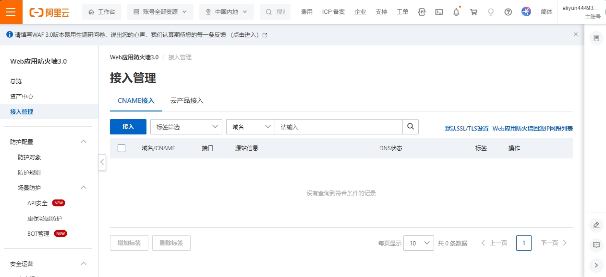
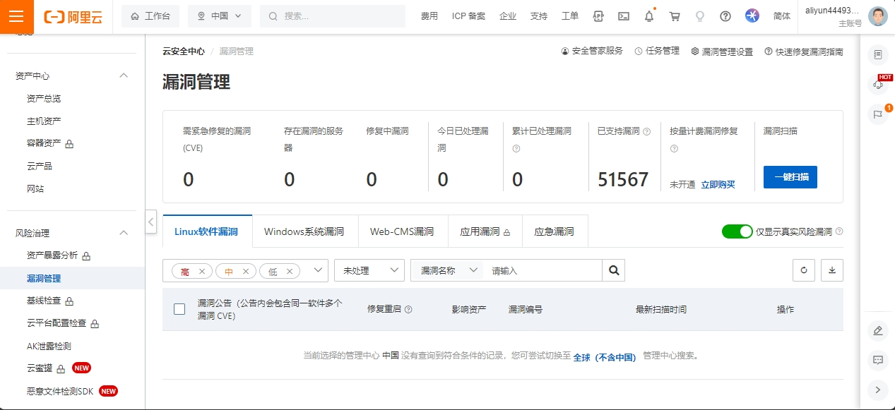

## WAF简介

WAF（Web Application Firewall）是一种网络安全工具，用于保护 Web 应用程序免受恶意攻击、SQL 注入、跨站脚本攻击（XSS）、跨站请求伪造（CSRF）等网络攻击。WAF 防火墙通过监控、过滤和阻止对 Web 应用程序的潜在恶意流量，帮助提高应用程序的安全性。

## 分类

1. **硬件 WAF：**

   * 硬件 WAF 是一种物理设备，通常是专用的硬件设备，部署在网络边缘，用于检测和阻止潜在的 Web 应用程序攻击。
   * 这些设备通常提供高性能和低延迟，适用于对安全性和性能都有高要求的环境。
2. **软件 WAF：**

   * 软件 WAF 是一种基于软件的解决方案，可以运行在通用的服务器硬件上，也可以部署在虚拟化环境中。
   * 这种类型的 WAF 提供了灵活性和可扩展性，适用于各种不同规模的应用程序。
3. **云 WAF：**

   * 云 WAF 是一种云服务，由云服务提供商提供，可以通过云平台进行部署和管理。
   * 云 WAF 提供了弹性、自动扩展和易于管理的特性，适用于分布式应用和云原生架构。
4. **开源 WAF：**

   * 一些开源的 WAF 解决方案可供用户使用，可以在自己的服务器上部署和配置。
   * 开源 WAF 提供了灵活性和可定制性，但通常需要更多的技术知识来进行配置和维护。

## 关键特性和功能

1. **攻击检测与阻止：**
   * **SQL 注入防护：** 防止恶意用户通过注入恶意 SQL 语句来攻击数据库。
   * **XSS 防护：** 防止跨站脚本攻击，保护用户免受恶意脚本的影响。
   * **CSRF 防护：** 防止跨站请求伪造攻击，确保请求是合法的。
2. **安全策略和规则：**
   * WAF 允许管理员定义一系列安全策略和规则，以适应特定应用程序的安全需求。
   * 这些规则可以根据 HTTP 请求头、URL、参数等来定义，以识别和阻止潜在的攻击行为。
3. **日志记录和分析：**
   * 记录和分析所有的 Web 请求和安全事件，以便管理员能够审查潜在的威胁和攻击。
   * 日志记录也有助于了解应用程序的正常流量和异常行为。
4. **自动学习和智能检测：**
   * 一些现代的 WAF 具备自动学习功能，可以通过机器学习和分析正常流量来识别异常模式。
   * 智能检测技术有助于减少误报，提高 WAF 的准确性。
5. **SSL/TLS 解密：**
   * 有些 WAF 可以对加密的 HTTPS 流量进行解密和检查，以识别和防范加密流量中的攻击。
6. **性能优化：**
   * 高效的 WAF 应当在保护 Web 应用程序的同时，尽量减少对应用程序性能的影响。
7. **CDN 配合：**
   * 与内容分发网络（CDN）结合使用，可以在 CDN 边缘位置提前阻挡一些恶意流量，减轻源服务器的负载。

## 配置WAF

WAF需要先开通。

### 添加WAF

web应用防火墙 > 接入管理 > CNAME接入/云产品接入

常用添加CNAME

## 态势感知

现在改名叫云安全中心，功能很多，很好用

主要是漏洞扫描和修复，其他功能很多需要收费

