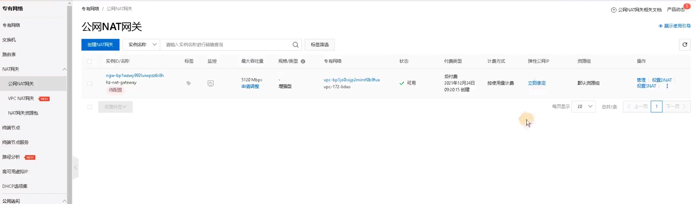
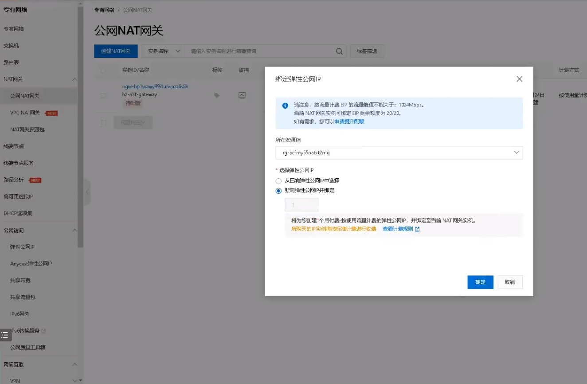
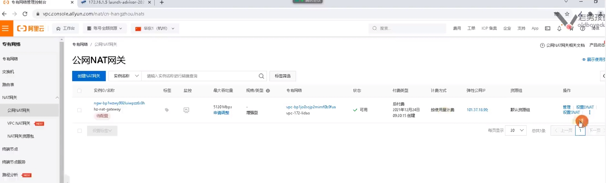
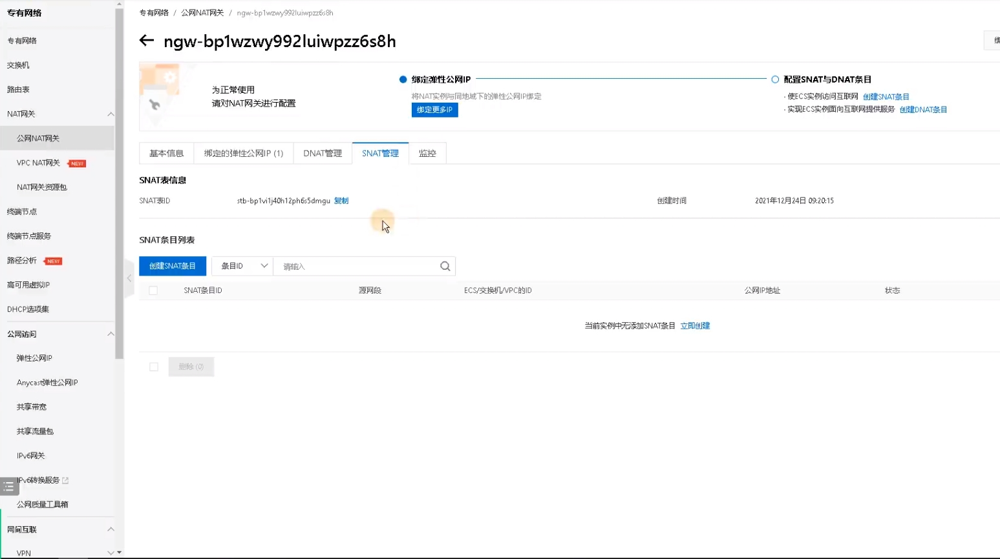
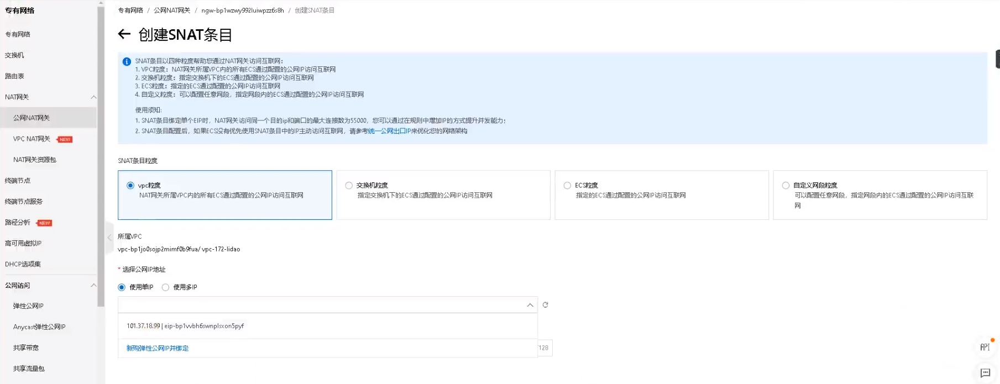
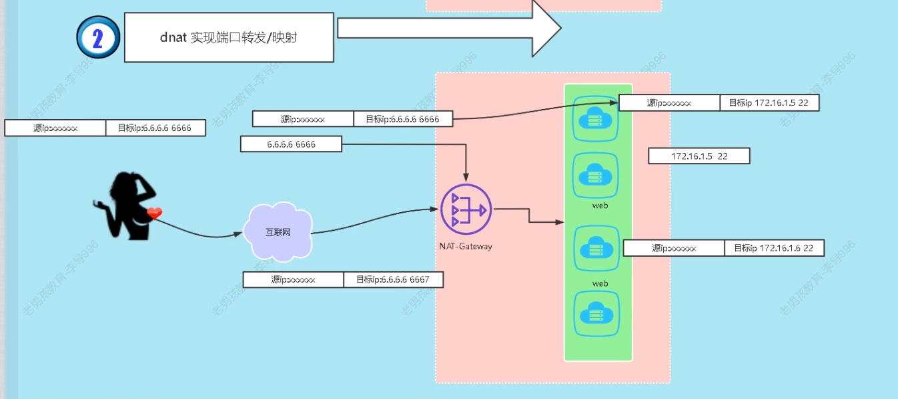
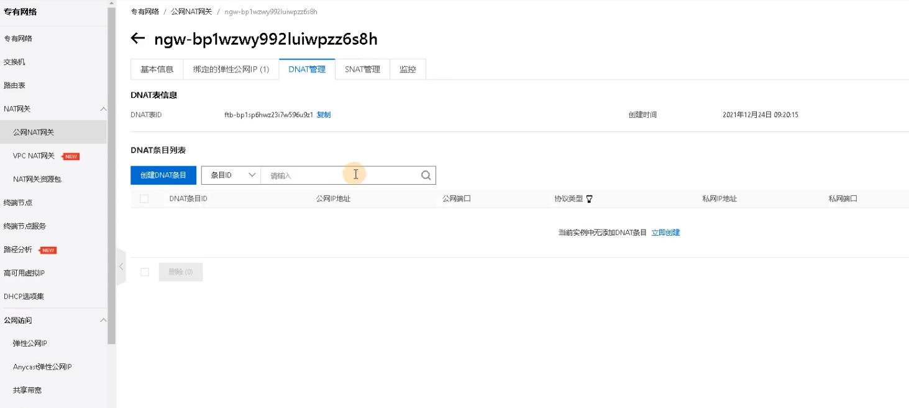
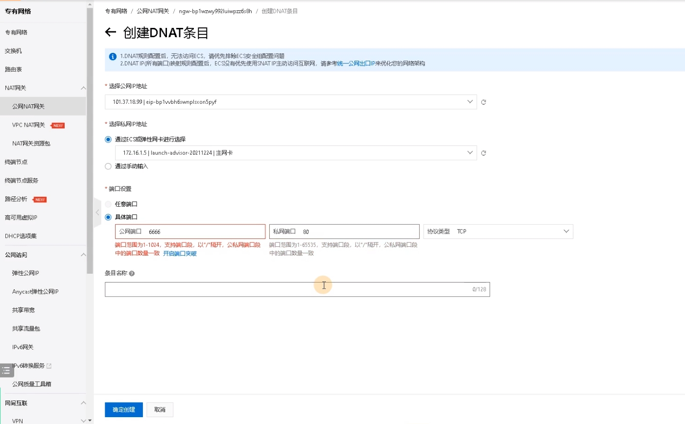

## 流程

1. 购买NAT网关
2. 绑定EIP（弹性公网IP）
3. 设置SNAT/DNAT规则

## NAT创建

专有网络 > NAT网关 > 公网NAT > 创建NAT网关

创建成功

## 绑定EIP

专有网络 > 公网NAT网关 > 选择对应的NAT网关 > 绑定弹性公网

弹性公网IP是收费的，IP按个数卖。

## 设置SNAT/DNAT规则

专有网络 > 公网NAT网关 > 选择对应的NAT网关 > 设置SNAT规则/DNAT规则

### 创建SNAT条目

* 应用场景：
  * 内网主机没有公网ip
  * 多个内网主机共享一个公网IP出口

SNAT管理 > 创建SNAT条目

主要参数

* SNAT条目粒度
  * VPC粒度
  * 交换机粒度
  * ECS粒度

### 创建DNAT条目

原理

#### 创建步骤

DNAT管理 > 创建DNAT条目

主要参数

