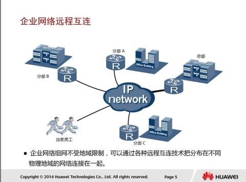
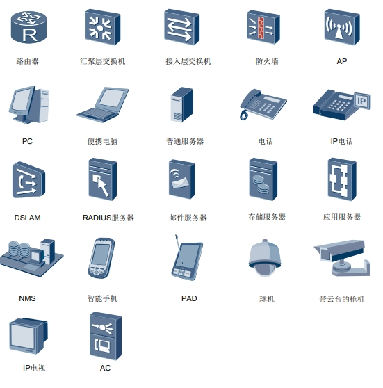
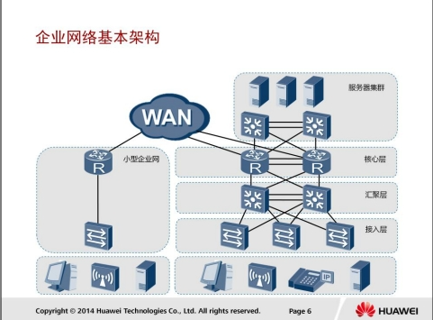
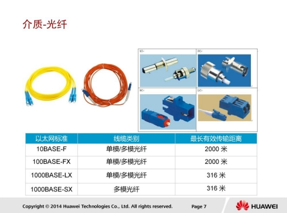
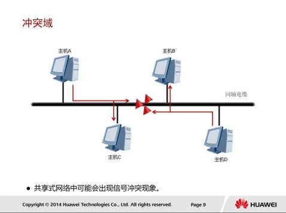
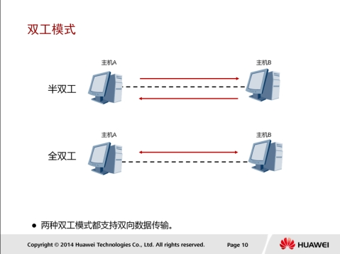
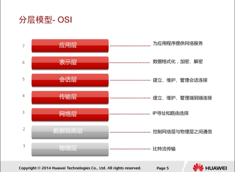
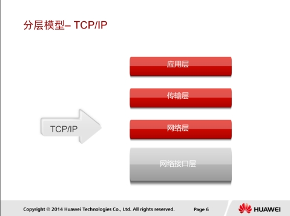

## 企业网络基础

### 简介

大型企业的网络往往跨越了多个物理区域，所以需要使用进程互连技术来连接企业总部和分支机构，从而使得出差的员工能随时随地接入企业网络实现移动办公，企业的合作伙伴和客户也能够及时高效的访问到企业的相应资源及工具。在实现进程互连的同时，企业还会基于对数据的私密性和安全性的考虑对进程互连技术进行选择。

### 拓展

#### 拓扑图常用图表参考

### 网络基础架构

企业网络架构很大程度上取决于企业或机构的业务需求。

#### 小型企业

小型企业通常只有一个办公地点，一般采用扁平网络架构进行组网。这种扁平网络能
够满足用户对资源访问的需求，并具有较强的灵活性，同时又能大大减少部署和维护成本。小型企业网络通常缺少冗余机制，可靠性不高，容易发生业务中断。

#### 大型企业

大型企业网络对业务的连续性要求很高，所以通常会通过网络冗余备份来保证网络的可用性和稳定性，从而保障企业的日常业务运营。大型企业网络也会对业务资源的访问进行控制，所以通常会采用多层网络架构来优化流量分布，并应用各种策略进行流量管理和资源访问控制。多层网络设计也可以使网络易于扩展。大型企业网络采用模块化设计能够有效实现网络隔离并简化网络维护，避免某一区域产生的故障影响到整个网络。

### 组网基本思路

* 小型企业网络通常采用扁平网络结构，网络扩展能力低。如需支持未来不断增长的用户，应采用多层网络结构。大型企业网络用户较多，通常采用层次化结构以支持网络的扩展和用户的增长。
* 在设计大型企业网络时必须首先考虑企业业务的特点，在保证网络性能满足业务需求的前提下，必须还要考虑网络的可用性、稳定性、可扩展性、安全性和可管理性，以保证企业业务的正常运营和发展。

## 传输介质简介

### 双绞线

双绞线可分为屏蔽双绞线(Shielded Twisted Pair，STP)和非屏蔽双绞线(Unshielded Twisted Pair，UTP)。

* 屏蔽双绞线在双绞线不外层绝缘封套之间有一个金属屏蔽层，可以屏蔽电磁干扰。
* 双绞线有多种类型，不同类型的双绞线所支持的传输速率一般也不相同。
  * 例如，3类双绞线支持10Mbps传输速率；5类双绞线支持100Mbps传输速率，满足快速以太网标准；超5类双绞线及更高级别的双绞线支持千兆以太网传输。
* 双绞线使用RJ-45接头连接网络设备。为保证终端能够正确收发数据，RJ-45接头中的针脚必须按照一定的线序排列。
* 双绞线传输的是电信号。

### 光纤

根据光纤传输光信号模式的不同，光纤又可分为单模光纤和多模光纤。

* 光纤传输数据时使用的是光信号。
* 单模光纤只能传输一种模式的光，不存在模间色散，因此适用于长距离高速传输。
* 多模光纤允许不同模式的光在一根光纤上传输，由于模间色散较大而导致信号脉冲展宽严重，因此多模光纤主要用于局域网中的短距离传输。
* 光纤支持的传输速率包括10Mbps，100Mbps，1Gbps，10Gbps，甚至更高。光纤连接器种类徆多，常用的连接器包括ST，FC，SC，LC连接器。

## 通信模式

### 冲突域

如图是一个10BASE5以太网，每个主机都是用同一根同轴电缆来不其它主机进行通信，因此，这里的同轴电缆又被称为共享介质，相应的网络被称为共享介质网络，或简称为共享式网络。共享式网络中，不同的主机同时发送数据时，就会产生信号冲突的问题，解决这一问题的方法一般是采用载波侦听多路访问/冲突检测技术（Carrier Sense Multiple Access/Collision Detection）。

CSMA/CD的基本工作过程如下：

1. 终端设备不停地检测共享线路的状态。如果线路空闲，则可以发送数据；如果线路不空闲，则等待一段时间后绠续检测（延时时间由退避算法决定）。
2. 如果有另外一个设备同时发送数据，两个设备发送的数据会产生冲突。
3. 终端设备检测到冲突之后，马上停止发送自己的数据，并发送特殊阻塞信息，以强化冲突信号，使线路上其他站点能够尽早检测到冲突。
4. 终端设备检测到冲突后，等待一段时间之后再进行数据发送（延时时间由退避算法决定）。

CSMA/CD的工作原理可简单总结为：先听后发，边发边听，冲突停发，随机延迟后重发。

### 双工和半双工

以太网上的通信模式包括半双工和全双工两种：

* 半双工：在半双工模式（half-duplex mode）下，通信双方都能发送和接收数据，但不能同时进行。当一台设备发送时，另一台只能接收，反之亦然。对讲机是半双工系统的典型例子。
  * 半双工模式下，共享物理介质的通信双方必须采用CSMA/CD机制来避免冲突。例如，10BASE5以太网的通信模式就必须是半双工模式。
* 全双工：在全双工模式（full-duplex mode）下，通信双方都能同时接收和发送数据。电话网络是典型的全双工例子。

同一物理链路上相连的两台设备的双工模式必须保持一致。

## 分层模型

### OSI七层模型

国 际 标 准 化 组 织 ISO 于 1984 年提出了 OSI RM （ Open System
Interconnection Reference Model，开放系统互连参考模型）。

OSI参考模型各个层次的基本功能如下：

* 物理层:
  * 在设备之间传输比特流，规定了电平、速度和电缆针脚。
* 数据链路层：
  * 将比特组合成字节，再将字节组合成帧，使用链路层地址（以太网使用MAC地址）来访问介质，幵进行差错检测。
* 网络层：
  * 提供逻辑地址，供路由器确定路径。
* 传输层：
  * 提供面向连接或非面向连接的数据传递以及进行重传前的差错检测。
* 会话层：
  * 负责建立、管理和终止表示层实体之间的通信会话。该层的通信由不同设备中的应用程序之间的服务请求和响应组成。
* 表示层：
  * 提供各种用于应用层数据的编码和转换功能，确保一个系统的应用层发送的数据能被另一个系统的应用层识别。
* 应用层：
  * OSI参考模型中最靠近用户的一层，为应用程序提供网络服务。

### TCP/IP四层模型

TCP/IP模型将网络分为四层。TCP/IP模型不关注底层物理介质，主要关注终端之间的逻辑数据流转发。

TCP/IP模型的核心是网络层和传输层：

* 网络层解决网络之间的逡辑转发问题
* 传输层保证源端到目的端之间的可靠传输。
* 最上层的应用层通过各种协议向终端用户提供业务应用。

## Reference Links：

http://bbs.hh010.com/
