## DHCP原理与配置

### DHCP应用场景

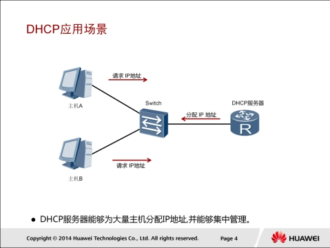

在大型企业网络中，一般会有大量的主机等终端设备。每个终端都需要配置IP地址等网络参数才能接入网络。在小型网络中，终端数量很少，可以手动配置IP地址。

但是在大中型网络中，终端数量很多，手动配置IP地址工作量大，而且配置时容易导致IP地址冲突等错误。DHCP可以为网络终端动态分配IP地址，解决了手工配置IP地址时的各种问题。

### DHCP报文类型

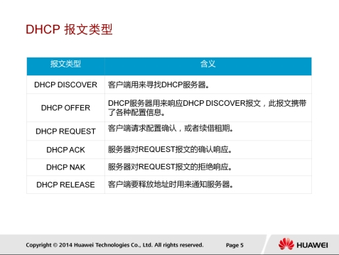

1. DHCP客户端初次接入网络时，会发送DHCP发现报文（DHCP Discover），用于查找和定位DHCP服务器。
2. DHCP服务器在收到DHCP发现报文后,发送DHCP提供报文（DHCP Offer），此报文中包含IP地址等配置信息。
3. 在DHCP客户端收到服务器发送的DHCP提供报文后，会发送DHCP请求报文（DHCP Request），另外在DHCP客户端获取IP地址并重启后，同样也会发送DHCP请求报文，用于确认分配的IP地址等配置信息。DHCP客户端获取的IP地址租期快要到期时，也发送DHCP请求报文向服务器申请延长IP地址租期。
4. 收到DHCP客户端发送的DHCP请求报文后，DHCP服务器会回复DHCP确认报文（DHCP ACK）。客户端收到DHCP确认报文后，会将获取的IP地址等信息进行配置和使用。
5. 如果DHCP服务器收到DHCP-REQUEST报文后，没有找到相应的租约记录，则发送DHCP-NAK报文作为应答，告知DHCP客户端无法分配合适IP地址。
6. DHCP客户端通过发送DHCP释放报文（DHCP Release）来释放IP地址。收到DHCP释放报文后，DHCP服务器可以把该IP地址分配给其他DHCP客户端。

### DHCP地址池

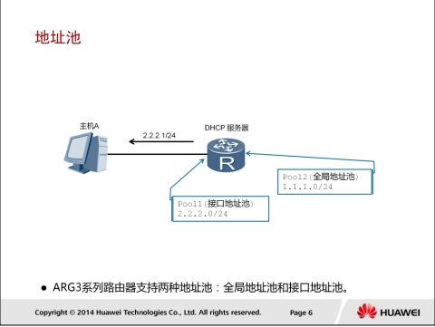

有些交换机都可以作为DHCP服务器，为主机等设备分配IP地址。DHCP服务器的地址池是用来定义分配给主机的IP地
址范围，有两种形式。

1. 接口地址池为连接到同一网段的主机或终端分配IP地址。可以在服务器的接口下执行dhcp select interface命令，配置DHCP服务器采用接口地址池的DHCP服务器模式为客户端分配IP地址。
2. 全局地址池为所有连接到DHCP服务器的终端分配IP地址。可以在服务器的接口下执行dhcp select global命令，配置DHCP服务器采用全局地址池的DHCP服务器模式为客户端分配IP地址。接口地址池的优先级比全局地址池高。配置了全局地址池后，如果又在接口上配置了地址池，客户端将会从接口地址池中获取IP地址。

### DHCP工作原理

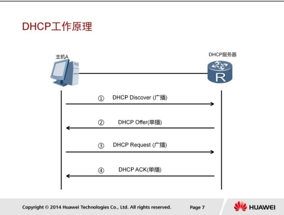

为了获取IP地址等配置信息，DHCP客户端需要和DHCP服务器进行报文交互。

首先，DHCP客户端发送DHCP发现报文来发现DHCP服务器。DHCP服务器会选取一个未分配的IP地址，向DHCP客户端发送DHCP提供报文。此报文中包含分配给客户端的IP地址和其他配置信息。如果存在多个DHCP服务器，每个DHCP服务器都会响应。

如果有多个DHCP服务器向DHCP客户端发送DHCP提供报文，DHCP客户端将会选择收到的第一个DHCP提供报文，然后发送DHCP请求报文，报文中包含请求的IP地址。收到DHCP请求报文后，提供该IP地址的DHCP服务器会向DHCP客户端发送一个DHCP确认报文，包含提供的IP地址和其他配置信息。DHCP客户端收到DHCP确认报文后，会发送免费ARP报文，检查网络中是否有其他主机使用分配的IP地址。如果指定时间内没有收到ARP应答，DHCP客户端会使用这个IP地址。如果有
主机使用该IP地址，DHCP客户端会向DHCP服务器发送DHCP拒绝报文，通知服务器该IP地址已被占用。然后DHCP客户端会向服务器重新申请一个IP地址。

### DHCP租期更新

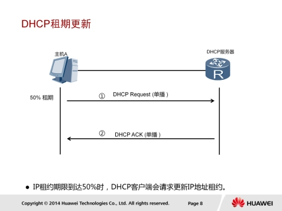

申请到IP地址后，DHCP客户端中会保存三个定时器，分别用来控制租期更新，租期重绑定和租期失效。DHCP服务器为DHCP客户端分配IP地址时会指定三个定时器的值。

如果DHCP服务器没有指定定时器的值，DHCP客户端会使用缺省值，缺省租期为1天。默认情况下，还剩下50%的租期时，DHCP客户端开始租约更新过程，DHCP客户端向分配IP地址的服务器发送DHCP请求报文来申请延长IP地址的租期。DHCP服务器向客户端发送DHCP确认报文，给予DHCP客户端一个新的租期。

### DHCP重绑定

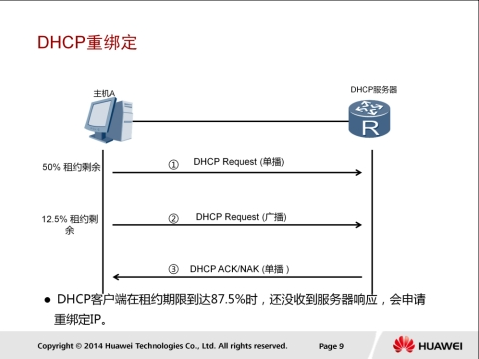

DHCP客户端发送DHCP请求报文续租时，如果DHCP客户端没有收到DHCP服务器的DHCP应答报文。默认情况下，重绑定定时器在租期剩余12.5%的时候超时，超时后，DHCP客户端会认为原DHCP服务器不可用，开始重新发送DHCP请求报文。网络上任何一台DHCP服务器都可以应答DHCP确认或DHCP非确认报文。

如果收到DHCP确认报文，DHCP客户端重新进入绑定状态，复位租期更新定时器和重绑定定时器。如果收到DHCP非确认报文，DHCP客户端进入初始化状态。此时，DHCP客户端必须立刻停止使用现有IP地址，重新申请IP地址。

### IP地址释放

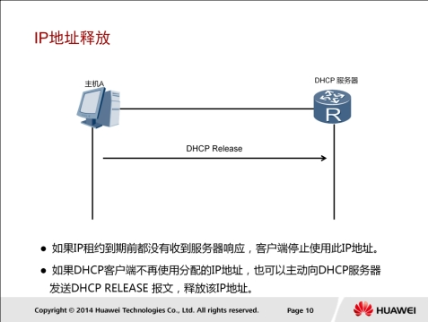

租期定时器是地址失效进程中的最后一个定时器，超时时间为IP地址的租期时间。如果DHCP客户端在租期失效定时器超时前没有收到服务器的任何回应，DHCP客户端必须立刻停止使用现有IP地址，发送DHCPRelease报文，并进入初始化状态。然后，DHCP客户端重新发送DHCP发现报文，申请IP地址。

### DHCP接口地址池配置

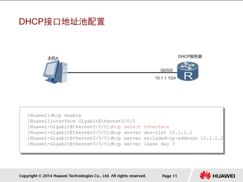

```
dhcp enable
interface GigabitEthernet 0/0/0
dhcp select interface
dhcp dns-list 10.1.1.2
dhcp server excluded-ip-address 10.1.1.2
dhcp server lesase day 3
```

DHCP支持配置两种地址池，包括全局地址池和接口地址池。

* dhcp enable：使能DHCP功能。在配置DHCP服务器时，必须先执行dhcp enable命令，才能配置DHCP的其他功能并生效。
* dhcp select interface：关联接口和接口地址池，为连接到接口的主机提供配置信息。在本示例中，接口GigabitEthernet 0/0/0被加入接口地址池中。
* dhcp server dns-list：指定接口地址池下的DNS服务器地址。
* dhcp server excluded-ip-address：配置接口地址池中不参不自动分配的IP地址范围。
* dhcp server lease：配置DHCP服务器接口地址池中IP地址的租用有效期限功能。缺省情况下，接口地址池中IP地址的租用有效期限为1天。

#### 配置验证

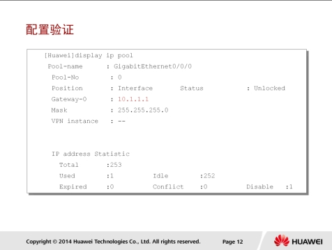

```
display ip pool
```

每个DHCP服务器可以定义一个或多个全局地址池和接口地址池。本例中执行display ip pool命令查看接口地址池的属性。display信息中包含地址池的IP地址范围，还包括IP网关，子网掩码等信息。

### DHCP全局地址池配置

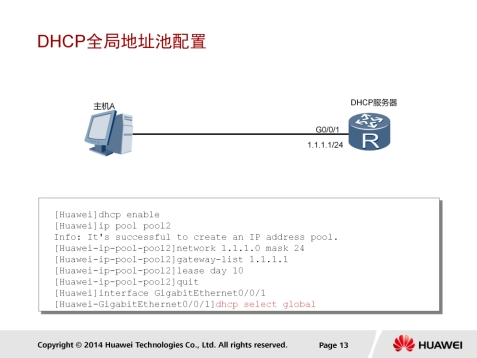

在本示例中，配置了一个DHCP全局地址池。

* ip pool：创建全局地址池。
* network：配置全局地址池下可分配的网段地址。
* gateway-list：配置DHCP服务器全局地址池的出口网关地址。
* lease：配置DHCP全局地址池下的地址租期。缺省情况下，IP地址租期是1天。
* dhcp select global：使能接口的DHCP服务器功能。

#### 配置验证

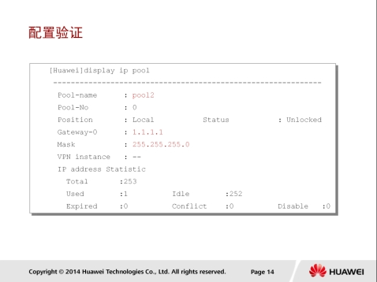

display ip pool命令可以查看全局IP地址池信息。管理员可以查看地址池的网关、子网掩码、IP地址统计信息等内容，监控地址池的使用情况，了解已分配的IP地址数量，以及其他使用统计信息。

## FTP原理与配置

### FTP的应用

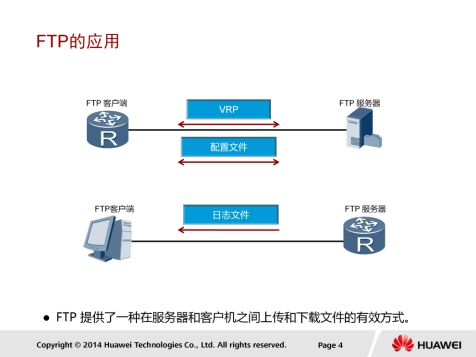

在企业网络中部署一台FTP服务器，将网络设备配置为FTP客户端，则可以使用FTP来备份或更新VRP文件和配置文件。也可以把网络设备配置为FTP服务器，将设备的日志文件保存到某台主机上方便查看。

### FTP传输文件过程

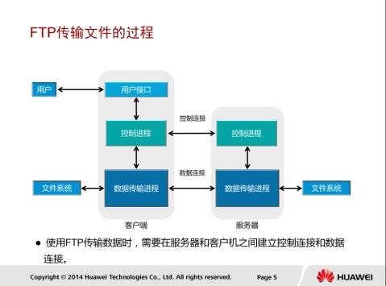

使用FTP进行文件传输时，会使用两个TCP连接。第一个连接是FTP客户端和FTP服务器间的控制连接。FTP服务器开启21号端口，等待FTP客户端发送连接请求。FTP客户端随机开启端口，向服务器发送建立连接的请求。控制连接用于在服务器和客户端之间传输控制命令。

第二个连接是FTP客户端和FTP服务器间的数据连接。服务器使用TCP的20号端口不客户端建立数据连接。通常情况下，服务器主动建立或中断数据连接。

### FTP传输模式

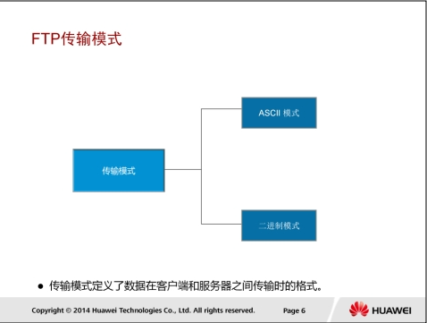

FTP传输数据时支持两种传输模式：ASCII模式和二进制模式。

ASCII模式用于传输文本。发送端的字符在发送前被转换成ASCII码格式之后进行传输，接收端收到之后再将其转换成字符。

二进制模式常用于发送图片文件和程序文件。发送端在发送这些文件时无需转换格式，即可传输。

### FTP配置

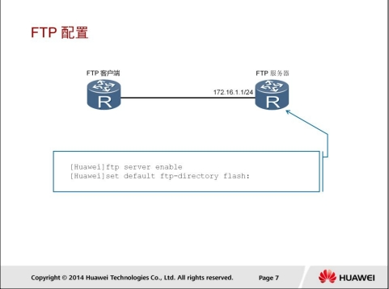

```
ftp server enable
set default ftp-directory directory-path  # 配置FTP用户的默认工作目录
```

执行ftp server enable命令使能FTP功能。
不动
执行set default ftp-directory命令设置FTP用户的默认工作目录。

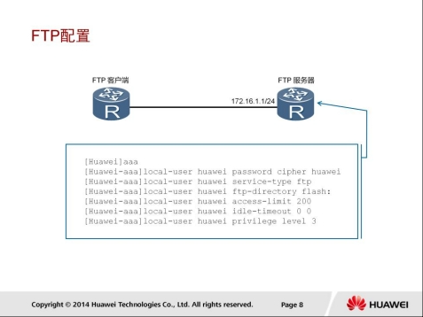

```
[Router] ftp server enable  # 启用FTP服务器
[Router] ftp server user admin  # 创建FTP用户，"admin" 是用户名，系统将提示您设置密码
Enter password:
Confirm password:
[Router] ftp server user admin ftp-directory flash:/ftp  # 配置FTP用户的默认工作目录
[Router] ftp server user admin permission list list-name  # 配置FTP用户的权限


[Router] ftp permission-list name mylist
[Router-ftp-permission-list-mylist] permission upload  # 允许上传文件
[Router-ftp-permission-list-mylist] permission download  # 允许下载文件
[Router-ftp-permission-list-mylist] permission delete  # 允许删除文件
[Router-ftp-permission-list-mylist] permission rename  # 允许重命名文件
```

在配置FTP服务器时，可以使用AAA为每个用户分别配置登录账号和访问权限。

aaa命令用来进入AAA视图。

user-name指定用户名。

local-user huawei service-type ftp命令用来配置本地用户的接入类型为ftp。

ftp-directory指定FTP用户可访问的目录。如果不配置FTP用户可访问的目录，则FTP用户无法登录设备。

access-limit指定用户名可建立的最大连接数目。

idle-timeout指定用户的闲置超时时间。

privilege level指定用户的优先级。

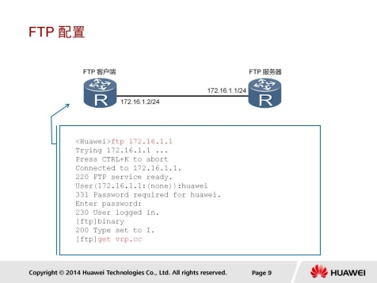

ftp命令用来不远程FTP服务器建立控制连接，并进入FTP客户端视图。

binary命令用来在设备作为FTP客户端时设置文件传输方式为Binary模式，又称二进制模式。缺省情况下，文件传输方式为ASCII模式。

get命令用来从远程FTP服务器下载文件并保存在本地。

## Telnet原理与配置

### Telnet应用场景

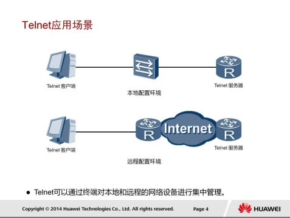

### Telnet连接

Telnet提供了一个交互式操作界面，允许终端远程登录到任何可以充当Telnet服务器的设备。Telnet用户可以像通过Console口本地登录一样对设备进行操作。远端Telnet服务器和终端之间无需直连，只需保证两者之间可以互相通信即可。通过使用Telnet，用户可以方便的实现对设备进行远程管理和维护。

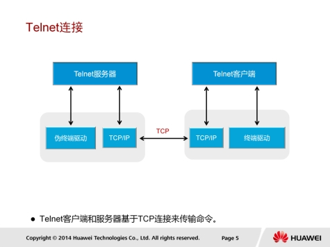

### 认证模式

Telnet以客户端/服务器模式运行。Telnet基于TCP协议，服务器端口号默认是23，服务器通过该端口与客户端建立Telnet连接。

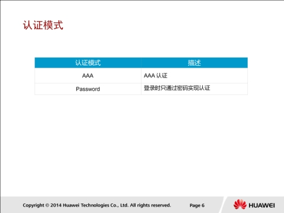

在配置Telnet登录用户界面时，必须配置认证方式，否则用户无法成功登录设备。

Telnet认证有两种模式：AAA模式，密码模式。

1. 当配置用户界面的认证方式为AAA时，用户登录设备时需要首先输入登录用户名和密码才能登录。
2. 当配置用户界面的认证方式为password时，用户登录设备时需要首先输入登录密码才能登录。

### Telnet配置

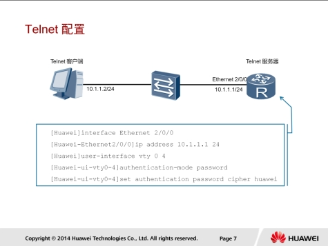

网络设备作为Telnet服务器，通常使用密码认证机制来认证连接到VTY接口的用户。

VTY（Virtual Type Terminal）是网络设备用来管理和监控通过Telnet方式登录的用户的界面。网络设备为每个Telnet用户分配一个VTY界面。

如果需要增加Telnet用户的登录数量，可以使用user-interface maximum-vty命令来调整VTY界面的数量。

执行authentication-mode password命令，可以配置VTY通过密码对用户进行认证。

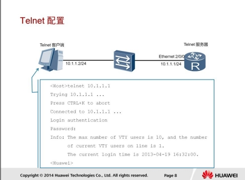

远端设备配置为Telnet服务器之后，可以在客户端上执行telnet命令来与服务器建立Telnet连接。客户端会收到需要认证相关的提示信息，用户输入的认证密码需要匹配Telnet服务器上保存的密码。认证通过之后，用户就可以通过Telnet远程连接到Telnet服务器上，在本地对远端的设备进行配置和管理。

## Reference Links：

http://bbs.hh010.com/
