## 访问控制列表

### ACL应用场景

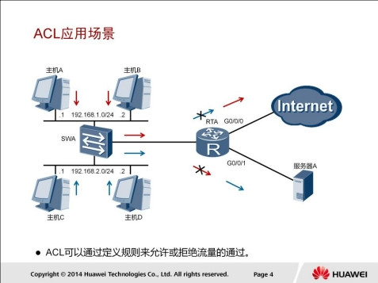

ACL是由一系列规则组成的集合。设备可以通过这些规则对数据包进行分类，并对不同类型的报文进行不同的处理。

本示例中，网关RTA允许192.168.1.0/24中的主机可以访问外网，也就是Internet；而192.168.2.0/24中的主机则被禁止访问Internet。对于服务器A而言，情况则相反。网关允许192.168.2.0/24中的主机访问服务器A，但却禁止192.168.1.0/24中的主机访问服务器A。

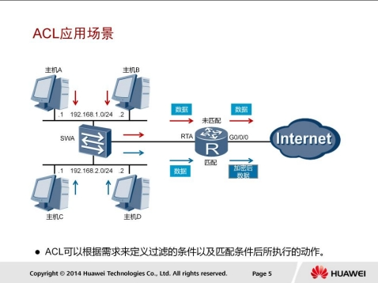

设备可以依据ACL中定义的条件（例如源IP地址）来匹配入方向的数据，并对匹配了条件的数据执行相应的动作。

在本示例所述场景中，RTA依据所定义的ACL而匹配到的感兴趣流量来自192.168.2.0/24网络，RTA会对这些感兴趣流量进行加密（虚拟局域网VPN中会进行介绍）之后再转发。

### ACL分类

根据不同的划分规则，ACL可以有不同的分类。最常见的三种分类是基本ACL、高级ACL和二层ACL。

1. 基本ACL可以使用报文的源IP地址、分片标记和时间段信息来匹配报文，其编号取值范围是2000-2999。
2. 高级ACL可以使用报文的源/目的IP地址、源/目的端口号以及协议类型等信息来匹配报文。高级ACL可以定义比基本ACL更准确、更丰富、更灵活的规则，其编号取值范围是3000-3999。
3. 二层ACL可以使用源/目的MAC地址以及二层协议类型等二层信息来匹配报文，其编号取值范围是4000-4999。

### ACL规则

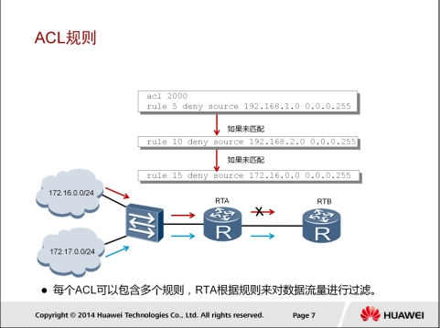

一个ACL可以由多条“deny | permit”语句组成，每一条语句描述了一条规则。设备收到数据流量后，会逐条匹配ACL规则，看其是否匹配。

如果不匹配，则匹配下一条。一旦找到一条匹配的规则，则执行规则中定义的动作，并不再继续不后续规则进行匹配。如果找不到匹配的规则，则设备不对报文进行任何处理。

需要注意的是，ACL中定义的这些规则可能存在重复或矛盾的地方。规则的匹配顺序决定了规则的优先级，ACL通过设置规则的优先级来处理规则之间重复或矛盾的情形。

1. 配置顺序按ACL规则编号（rule-id）从小到大的顺序进行匹配。设备会在创建ACL的过程中自动为每一条规则分配一个编号，规则编号决定了规则被匹配的顺序。例如，如果将步长设定为5，则规则编号将按照5、10、15…这样的规律自动分配。如果步长设定为2，则规则编号将按照2、4、6、8…这样的规律自动分配。通过设置步长，使规则之间留有一定的空间，用户可以在已存在的两个规则之间插入新的规则。路由器匹配规则时默认采用配置顺序。另外，ARG3系列路由器默认规则编号的步长是5。
2. 自动排序使用“深度优先”的原则进行匹配，即根据规则的精确度排序。

本示例中，RTA收到了来自两个网络的报文。默认情况下，RTA会依据ACL的配置顺序来匹配这些报文。网络172.16.0.0/24发送的数据流量将被RTA上配置的ACL2000的规则15匹配，因此会被拒绝。而来自网络172.17.0.0/24的报文不能匹配访问控制列表中的任何规则，因此RTA对报文不做任何处理，而是正常转发。

### 基本ACL配置

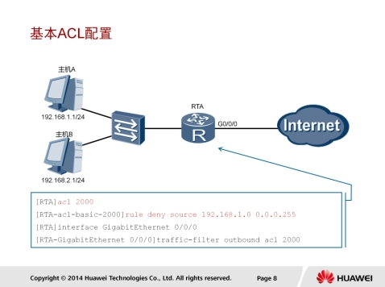

```
acl 2000
rule deny source 192.168.1.0 0.0.0.255
interface GigabitEthernet0/0/0
traffic-filter outbound acl 2000
```

`acl [ number ] `：创建一个ACL，并进入ACL视图。

`rule [ rule-id ] { deny | permit } source { source-address source wildcard | any }`：增加或修改ACL的规则。

* deny用来指定拒绝符合条件的数据包，
* permit用来指定允许符合条件的数据包，
* source用来指定ACL规则匹配报文的源地址信息，
* any表示任意源地址。

`traffic-filter { inbound | outbound }acl{ acl-number }`：在接口上配置基于ACL对报文进行过滤。

本示例中，主机A发送的流量到达RTA后，会匹配ACL2000中创建的规则rule deny source 192.168.1.0 0.0.0.255，因而将被拒绝继续转发到Internet。主机B发送的流量不匹配任何规则，所以会被RTA正常转发到Internet。

#### 配置确认

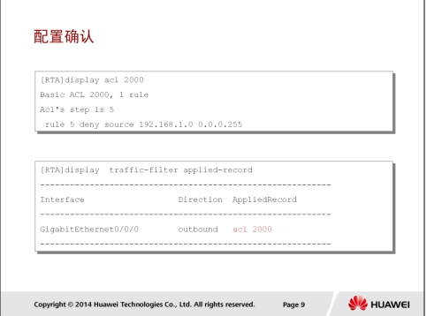

```
display acl
display traffic-filter applied-record
```

display acl ：验证配置的基本ACL。

本例中 ， 所 配 置 的 ACL 叧 有 一 条 规 则 ， 即 拒 绝 源 IP 地址在192.168.1.0/24范围的所有IP报文。

display traffic-filter applied-record：查看设备上所有基于ACL进行报文过滤的应用信息，这些信息可以帮劣用户了解报文过滤的配置情况并核对其是否正确，同时也有劣于进行相关的故障诊断不排查。

### 高级ACL配置

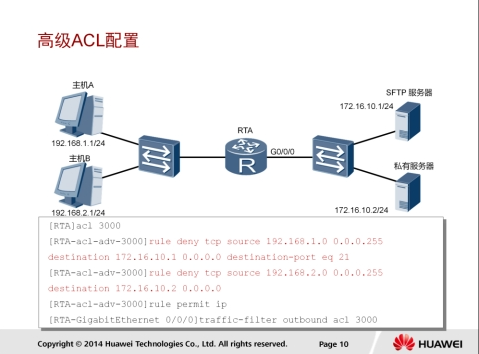

```
acl 3000
rule deny tcp source 192.168.1.0 0.0.0.255 destination 172.16.10.1 0.0.0.0 destination-port eq 21
rule deny tcp source 192.168.2.0 0.0.0.255 destination 172.16.10.2 0.0.0.0
rule permit ip
traffic-filter outbound acl 3000
```

基本ACL可以依据源IP地址进行报文过滤，而高级ACL能够依据源/目的IP地址、源/目的端口号、网络层及传输层协议以及IP流量分类和TCP标记值等各种参数（SYN|ACK|FIN等）进行报文过滤。

本示例中，RTA上定义了高级ACL3000，其中第一条规则“rule denytcp source 192.168.1.0 0.0.0.255 destination 172.16.10.1 0.0.0.0destination-port eq 21”用于限制源地址范围是192.168.1.0/24，目的IP地址为172.16.10.1，目的端口号为21的所有TCP报文；第二条规则“rule deny tcp source 192.168.2.0 0.0.0.255 destination 172.16.10.2 0.0.0.0 ” 用于限制源地址范围是 192.168.2.0/24 ， 目的地址是172.16.10.2的所有TCP报文；第三条规则“rule permit ip”用于匹配所有IP报文，并对报文执行允许动作。

##### 配置验证

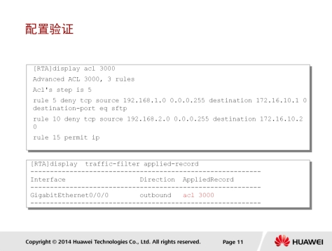

执行display acl 命令可以验证配置的高级ACL。显示信息表明：RTA上一共配置了3条高级ACL规则。第一条规则用于
拒绝来自源IP地址192.168.1.0/24，目的IP地址为172.16.10.1，目的端口为21（SFTP）的TCP报文；第二条规则用于拒绝来自源IP地址192.168.2.0/24，目的IP地址为172.16.10.2的所有TCP报文；第三条规则允许所有IP报文通过。

### ACL应用-NAT

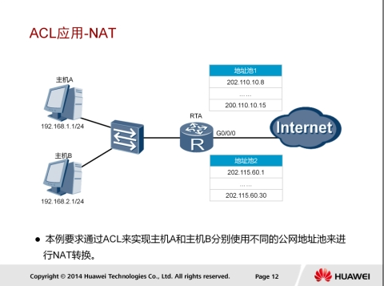

ACL还可用于网络地址转换操作，以便在存在多个地址池的情况下，确定哪些内网地址是通过哪些特定外网地址池进行地址转换的。例如，某企业网络作为客户连接到多个服务供应商网络，企业网络内的用户位于不同的网段/子网，他们期望分别通过某个特定的地址组进行地址转换来实现报文转发。这种情况极有可能发生在连接不同服务供应商网络的路由器上行端口。

本示例中，要求192.168.1.0/24中的主机使用地址池1中的公网地址进行地址转换，而192.168.2.0/24中的主机使用地址池2中的公网地址进行地址转换。

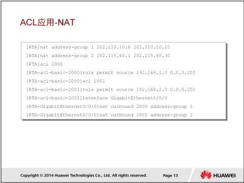

执 行 nat outbound  address-group 命令，可以将NAT与ACL绑定。

本 示 例 中 ， 私 网 192.168.1.0/24 将 使 用 地 址 池 220.110.10.8-220.110.10.15 进行地址转换 ， 私 网 192.168.2.0/24 将使用地址池202.115.60.1-202.115.60.30进行地址转换。

### AAA

AAA是一种提供认证、授权和计费的安全技术。该技术可以用于验证用户帐户是否合法，授权用户可以访问的服务，并记录用户使用网络资源的情况。

例如，企业总部需要对服务器的资源访问进行控制，只有通过认证的用户才能访问特定的资源，并对用户使用资源的情况进行记录。在这种场景下，可以按照如图所示的方案进行AAA部署，NAS为网络接入服务器，负责集中收集和管理用户的访问请求。

AAA服务器表示进端的Radius或HWTACACS服务器，负责制定认证、授权和计费方案。如果企业分支的员工希望访问总部的服务器，进端的Radius或HWTACACS服务器会要求员工发送正确的用户名和密码，之后会进行验证，通过后则执行相关的授权策略，接下来，该员工就可以访问特定的服务器了。如果还需要记录员工访问网络资源的行为，网络管理员还可以在Radius或HWTACACS服务器上配置计费方案。

##### 认证

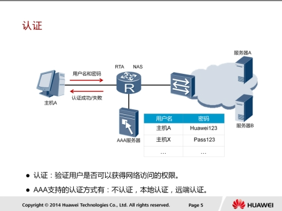

AAA支持三种认证方式:

1. 不认证：完全信任用户，不对用户身份进行合法性检查。鉴于安全考虑，这种认证方式很少被采用。
2. 本地认证：将本地用户信息（包括用户名、密码和各种属性）配置在NAS上。本地认证的优点是处理速度快、运营成本低；缺点是存储信息量受设备硬件条件限制。
3. 进端认证：将用户信息（包括用户名、密码和各种属性）配置在认证服务器上。AAA支持通过RADIUS协议HWTACACS协议进行进端认证。NAS作为客户端，不RADIUS服务器或HWTACACS服务器进行通信。

如果一个认证方案采用多种认证方式，这些认证方式按配置顺序生效。比如，先配置了进端认证，随后配置了本地认证，那么在进端认证服务器无响应时，会转入本地认证方式。如果只在本地设备上配置了登录账号，没有在进端服务器上配置，AR2200认为账号没有通过进端认证，不再进行本地认证。

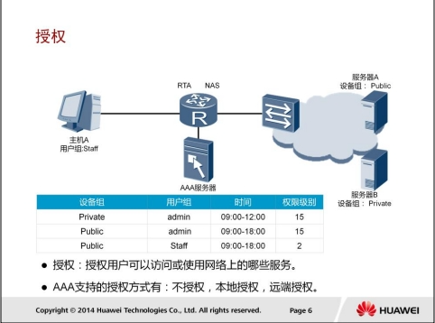

AAA授权功能赋予用户访问的特定网络或设备的权限。AAA支持以下授
权方式：

1. 不授权：不对用户进行授权处理。
2. 本地授权：根据NAS上配置的本地用户账号的相关属性进行授权。
3. 进端授权：HWTACACS授权，使用TACACS服务器对用户授权。RADIUS授权，对通过RADIUS服务器认证的用户授权。RADIUS协议的认证和授权是绑定在一起的，不能单独使用RADIUS进行授权。

如果在一个授权方案中使用多种授权方式，这些授权方式按照配置顺序生效。不授权方式最后生效。

#### 计费

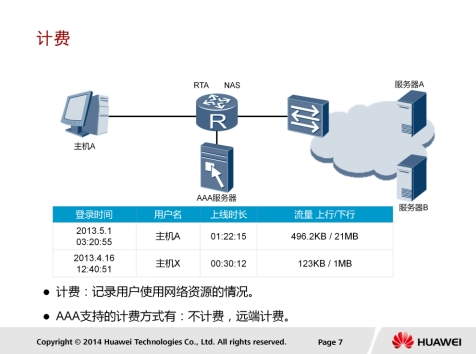

计费功能用于监控授权用户的网络行为和网络资源的使用情况。AAA支持以下两种计费方式：

1. 不计费：为用户提供免费上网服务，不产生相关活动日志。
2. 进端计费：通过RADIUS服务器或HWTACACS服务器进行进端计费。RADIUS服务器或HWTACACS服务器具备充足的储存空间，可以储存各授权用户的网络访问活动日志，支持计费功能。

本示例中展示了用户计费日志中记录的典型信息。

#### AAA域

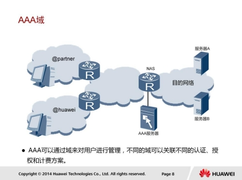

设备基于域来对用户进行管理，每个域都可以配置不同的认证、授权和计费方案，用于对该域下的用户进行认证、授权和计费。每个用户都属于某一个域。用户属于哪个域是由用户名中的域名分隔符@后的字符串决定。

例如，如果用户名是user@huawei，则用户属于huawei域。如果用户名后不带有@，则用户属于系统缺省域default。

#### AAA配置

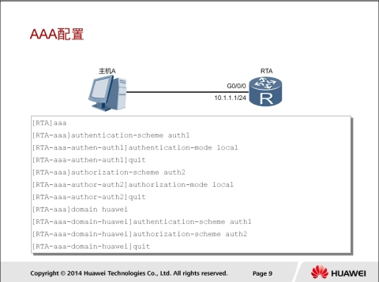

```
aaa
authentication-scheme auth1
authentication-mode local
authorization-scheme auth2
authorization-mode local
domain huawei
authentication-scheme auth2
authentication-mode local
quit
```

* `authentication-scheme authentication-scheme-name`：配置域的认证方案。缺省情况下，域使用名为“default”的认证方案。
* `authentication-mode { hwtacacs | radius | local }`：配置认证方式，local指定认证模方式为本地认证。缺省情况下，认证方式为本地认证。
* `authorization-scheme authorization-scheme-name`：配置域的授权方案。缺省情况下，域下没有绑定授权方案。
  *` authorization-mode { [ hwtacacs | if-authenticated | local ] * [ none ]}`：配置当前授权方案使用的授权方式。缺省情况下，授权模式为本地授权方式。
* `domain domain-name `： 创 建 域 ， 并 进 入 AAA 域视图 。

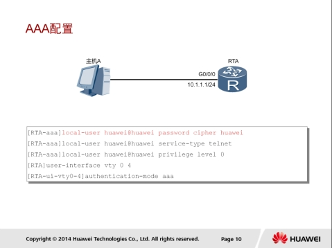

```
password cipher huawei
service-type telnet
privilege level 0
user-interface vty 0 4
authentication-mode aaa
```

local-user user-name password cipher password：创建本地用户，并配置本地用户的密码。如果用户名中带域名分隔符，如@，则认为@前面的部分是用户名，后面部分是域名。如果没有@，则整个字符串为用户名，域为默认域。

local-user user-name privilege level level：指定本地用户的优先级。

##### 配置验证

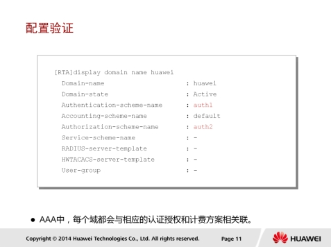

```
display domain huawei
```

display domain [ name domain-name ]：查看域的配置信息。

* Domain-state为Active表示激活状态。
* Authentication-scheme-name表示域使用的认证方案为auth1。缺省情况下，域使用系统自带的default认证方案。
* Authorization-scheme-name表示域使用的授权方案为auth2。

## IPSec VPN原理与配置

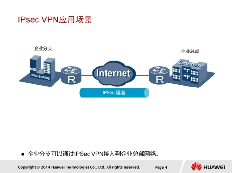

IPSec是IETF定义的一个协议组。通信双方在IP层通过加密、完整性校验、数据源认证等方式，保证了IP数据报文在网络上传输的机密性、完整性和防重放。

1. 机密性（Confidentiality）指对数据进行加密保护，用密文的形式传送数据。
2. 完整性（Data integrity）指对接收的数据进行认证，以判定报文是否被篡改。
3. 防重放（Anti-replay）指防止恶意用户通过重复发送捕获到的数据包所进行的攻击，即接收方会拒绝旧的戒重复的数据包。

企业进程分支机构可以通过使用IPSec VPN建立安全传输通道，接入到企业总部网络。

### IPSec架构

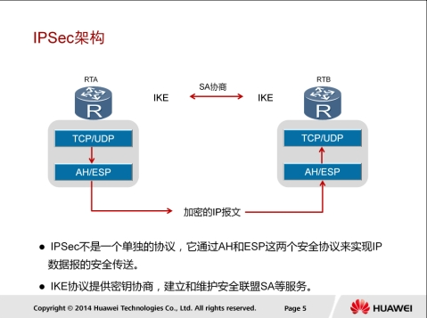

IPSec VPN体系结构主要由AH（Authentication Header）、ESP（Encapsulating Security Payload）和IKE（Internet Key Exchange）协议套件组成。

1. AH协议：主要提供的功能有数据源验证、数据完整性校验和防报文重放功能。然而，AH并不加密所保护的数据报。
2. ESP协议：提供AH协议的所有功能外（但其数据完整性校验不包括IP头），还可提供对IP报文的加密功能。
3. IKE协议：用于自动协商AH和ESP所使用的密码算法。

### 安全联盟SA

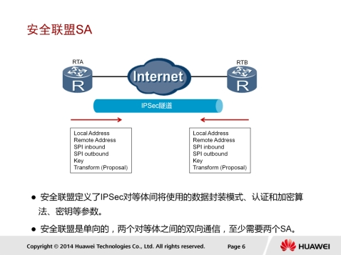

SA（Security Association）安全联盟定义了IPSec通信对等体间将使用的数据封装模式、认证和加密算法、秘钥等参数。SA是单向的，两个对等体之间的双向通信，至少需要两个SA。如果两个对等体希望同时使用AH和ESP安全协议来进行通信，则对等体针对每一种安全协议都需要协商一对SA。

SA由一个三元组来唯一标识，这个三元组包括安全参数索引SPI（Security Parameter Index）、目的IP地址、安全协议（AH戒ESP）。建立SA的方式有以下两种：

1. 手工方式：安全联盟所需的全部信息都必须手工配置。手工方式建立安全联盟比较复杂，但优点是可以不依赖IKE而单独实现IPSec功能。当对等体设备数量较少时，戒是在小型静态环境中，手工配置SA是可行的。
2. IKE动态协商方式：只需要通信对等体间配置好IKE协商参数，由IKE自动协商来创建和维护SA。动态协商方式建立安全联盟相对简单些。对于中、大型的动态网络环境中，推荐使用IKE协商建立SA。

### IPSec传输模式

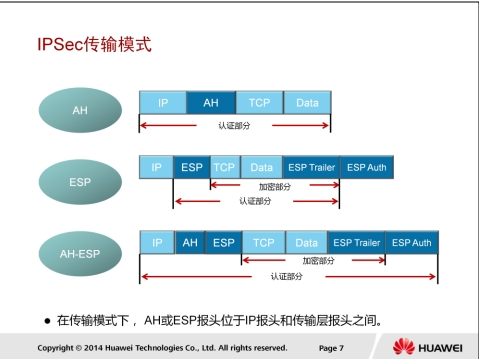

IPSec协议有两种封装模式：传输模式和隧道模式。

传输模式中，在IP报文头和高层协议之间插入AH戒ESP头。

传输模式中的AH戒ESP主要对上层协议数据提供保护。

传输模式中的AH：在IP头部之后插入AH头，对整个IP数据包进行完整性校验。

传输模式中的ESP：在IP头部之后插入ESP头，在数据字段后插入尾部以及认证字段。对高层数据和ESP尾部进行加密，对IP数据包中的ESP报文头，高层数据和ESP尾部进行完整性校验。

传输模式中的AH+ESP：在IP头部之后插入AH和ESP头，在数据字段后插入尾部以及认证字段。对高层数据和ESP尾部进行加密，对整个IP数据包进行完整性校验。

### IPSec隧道模式

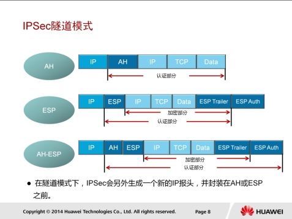

隧道模式中，AH戒ESP头封装在原始IP报文头之前，并另外生成一个新的IP头封装到AH戒ESP之前。隧道模式可以完全地对原始IP数据报进行认证和加密，而且，可以使用IPSec对等体的IP地址来隐藏客户机的IP地址。

隧道模式中的AH：对整个原始IP报文提供完整性检查和认证，认证功能优于ESP。但AH不提供加密功能，所以通常和ESP联合使用。隧道模式中的ESP：对整个原始IP报文和ESP尾部进行加密，对ESP报文头，原始IP报文和ESP尾部进行完整性校验。

隧道模式中的AH+ESP：对整个原始IP报文和ESP尾部进行加密，对除新IP头之外的整个IP数据包进行完整性校验。

### IPSec VPN配置步骤

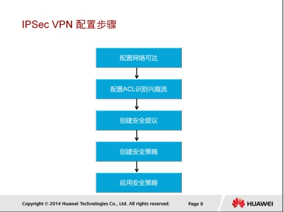

配置IPSec VPN的步骤如下：

1. 首先需要检查报文发送方和接收方之间的网络层可达性，确保双方只有建立IPSec VPN隧道才能进行IPSec通信。
2. 第二步是定义数据流。因为部分流量无需满足完整性和机密性要求，所以需要对流量进行过滤，选择出需要进行IPSec处理的兴趣流。可以通过配置ACL来定义和区分不同的数据流。
3. 第三步是配置IPSec安全提议。IPSec提议定义了保护数据流所用的安全协议、认证算法、加密算法和封装模式。安全协议包括AH和ESP，两者可以单独使用戒一起使用。AH支持MD5和SHA-1认证算法；ESP支持两种认证算法（MD5和SHA-1）和三种加密算法（DES、3DES和AES）。为了能够正常传输数据流，安全隧道两端的对等体必须使用相同的安全协议、认证算法、加密算法和封装模式。如果要在两个安全网关之间建立IPSec隧道，建议将IPSec封装模式设置为隧道模式，以便隐藏通信使用的实际源IP地址和目的IP地址。
4. 第四步是配置IPSec安全策略。IPSec策略中会应用IPSec提议中定义的安全协议、认证算法、加密算法和封装模式。每一个IPSec安全策略都使用唯一的名称和序号来标识。IPSec策略可分成两类：手工建立SA的策略和IKE协商建立SA的策略。
5. 第五步是在一个接口上应用IPSec安全策略。

目前设备采用的加密算法包括DES、3DES、AES、RSA、SHA1、SHA2、MD5等，具体采用哪种加密算法请根据场景而定。在实际网络中请优先采用我们的建议，否则会造成无法满足您安全防御的要求。

* 对称加密算法建议使用AES（128位及以上密钥）
* 非对称加密算法建议使用RSA（2048位及以上密钥）
* 哈希算法建议使用SHA2（256及以上密钥）
* HMAC（基于哈希算法的消息验证码）算法建议使用HMAC-SHA2

### IPSec VPN配置

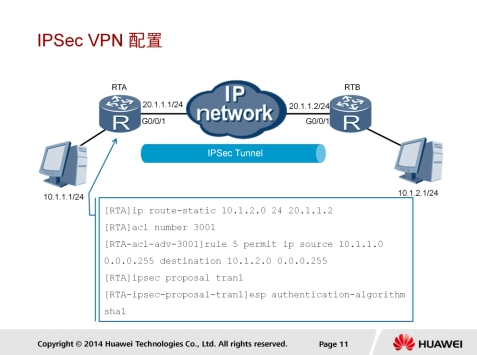

本示例中的IPSec VPN连接是通过配置静态路由建立的，下一跳指向RTB。需要配置两个方向的静态路由确保双向通信可达。建立一条高级ACL，用于确定哪些感兴趣流需要通过IPSec VPN隧道。高级ACL能够依据特定参数过滤流量，继而对流量执行丢弃、通过戒保护操作。

执行ipsec proposal命令，可以创建IPSec提议并进入IPSec提议视图。配置IPSec策略时，必须引用IPSec提议来指定IPSec隧道两端使用的安全协议、加密算法、认证算法和封装模式。缺省情况下，使用ipsec proposal命令创建的IPSec提议采用ESP协议、MD5认证算法和隧道封装模式。在IPSec提议视图下执行下列命令可以修改这些参数。

执行 `transform [ah | ah-esp | esp]`命令，可以重新配置隧道采用的安全协议。

执行 `encapsulation-mode {transport | tunnel }`命令，可以配置报文的封装模式。

执行 `esp authentication-algorithm [md5 | sha1 | sha2-256 | sha2-384 | sha2-512 ]`命令，可以配置ESP协议使用的认证算法。

执行 `esp encryption-algorithm [des | 3des | aes-128 | aes-192 | aes-256 ]`命令，可以配置ESP加密算法。

执行 `ah authentication-algorithm [md5 | sha1 | sha2-256 | sha2-384 | sha2-512 ]`命令，可以配置AH协议使用的认证算法。

##### 配置验证

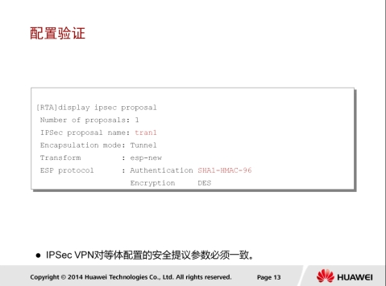

执行display ipsec proposal [name ]命令，可以查看IPSec提议中配置的参数。

* Number of proposals字段显示的是已创建的IPSec提议的个数。
* IPSec proposal name字段显示的是已创建IPSec提议的名称。
* Encapsulation mode字段显示的指定提议当前使用的封装模式，其值可以为传输模式戒隧道模式。
* Transform字段显示的是IPSec所采用的安全协议，其值可以是AH、ESP戒AH-ESP。
* ESP protocol字段显示的是安全协议所使用的认证和加密算法。

### IPSec VPN配置

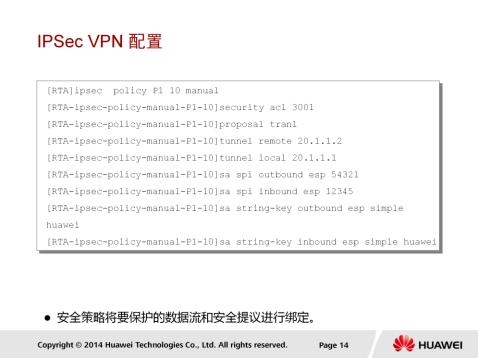

ipsec policy policy-name seq-number命令用来创建一条IPSec策略，并进入IPSec策略视图。安全策略是由policy-name和seq-number共同来确定的，多个具有相同policy-name的安全策略组成一个安全策略组。在一个安全策略组中最多可以设置16条安全策略，而seq-number越小的安全策略，优先级越高。在一个接口上应用了一个安全策略组，实际上是同时应用了安全策略组中所有的安全策略，这样能够对不同的数据流采用不同的安全策略进行保护。

IPSec策略除了指定策略的名称和序号外，还需要指定SA的建立方式。如果使用的是IKE协商，需要执行ipsec-policy-template命令配置指定参数。如果使用的是手工建立方式，所有参数都需要手工配置。

本示例采用的是手工建立方式。

`security acl acl-number`命令用来指定IPSec策略所引用的访问控制列表。

`proposal proposal-name`命令用来指定IPSec策略所引用的提议。

`tunnel local { ip-address | binding-interface }`命令用来配置安全隧道的本端地址。

`tunnel remote ip-address`命令用来设置安全隧道的对端地址。

`sa spi { inbound | outbound } { ah | esp } spi-number`命令用来设置安全联盟的安全参数索引SPI。在配置安全联盟时，入方向和出方向安全联盟的安全参数索引都必须设置，并且本端的入方向安全联盟的SPI值必须和对端的出方向安全联盟的SPI值相同，而本端的出方向安全联盟的SPI值必须和对端的入方向安全联盟的SPI值相同。

`sa string-key { inbound | outbound } { ah | esp } { simple | cipher } string-key`命令用来设置安全联盟的认证密钥。入方向和出方向安全联盟的认证密钥都必须设置，并且本端的入方向安全联盟的密钥必须和对端的出方向安全联盟的密钥相同；同时，本端的出方向安全联盟密钥必须和对端的入方向安全联盟的密钥相同。

### IPSec VPN配置

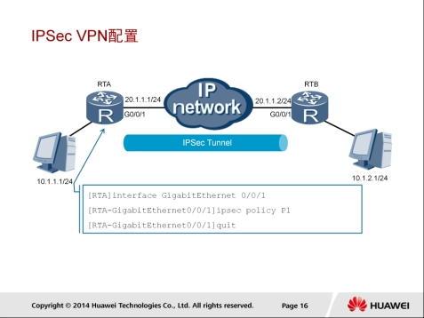

ipsec policy policy-name命令用来在接口上应用指定的安全策略组。手工方式配置的安全策略只能应用到一个接口。

#### 配置验证

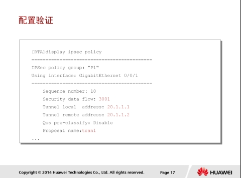

执行display ipsec policy [brief | name policy-name [ seq-number ]]命令，可以查看指定IPSec策略戒所有IPSec策略。命令的显示信息中包括：策略名称、策略序号、提议名称、ACL、隧道的本端地址和隧道的进端地址等。

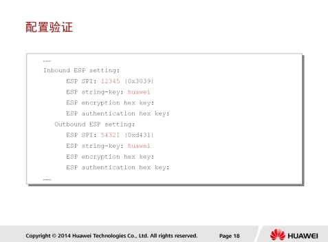

执行display ipsec policy命令，还可以查看出方向和入方向SA相关的参数。

## GRE原理与配置

### GRE应用场景

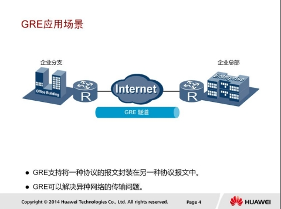

GRE用来对某些网络层协议如IPX（Internet Packet Exchange）的报文进行封装，使这些被封装的报文能够在另一网络层协议（如IP）中传输。GRE可以解决异种网络的传输问题。

IPSec VPN技术可以创建一条跨越共享公网的隧道，从而实现私网互联。IPSec VPN能够安全传输IP报文，但是无法在隧道的两个端点之间运行RIP和OSPF等路由协议。GRE可以将路由协议信息封装在另一种协议报文（例如IP）中进行传输。

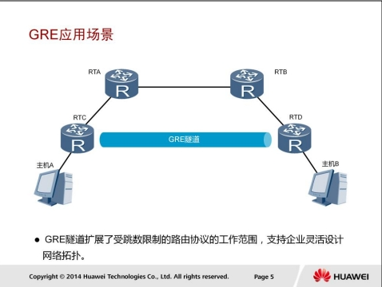

使用GRE可以克服IGP协议的一些局限性。例如，RIP路由协议是一种距离矢量路由协议，最大跳数为15。如果网络直径超过15，设备将无法通信。这种情况下，可以使用GRE技术在两个网络节点之间搭建隧道，隐藏它们之间的跳数，扩大网络的工作范围。

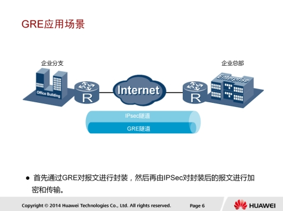

GRE本身并不支持加密，因而通过GRE隧道传输的流量是不加密的。将IPSec技术与GRE相结合，可以先建立GRE隧道对报文进行GRE封装，然后再建立IPSec隧道对报文进行加密，以保证报文传输的完整性和私密性。

### GRE报文结构

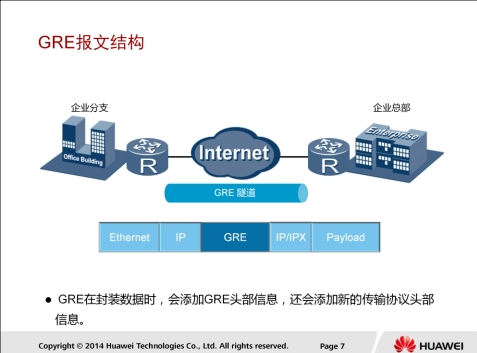

GRE封装报文时，封装前的报文称为净荷，封装前的报文协议称为乘客协议，然后GRE会封装GRE头部，GRE成为封装协议，也叫运载协议，最后负责对封装后的报文进行转发的协议称为传输协议。

GRE封装和解封装报文的过程如下：

1. 设备从连接私网的接口接收到报文后，检查报文头中的目的IP地址字段，在路由表查找出接口，如果发现出接口是隧道接口，则将报文发送给隧道模块进行处理。
2. 隧道模块接收到报文后首先根据乘客协议的类型和当前GRE隧道配置的校验和参数，对报文进行GRE封装，即添加GRE报文头。
3. 然后，设备给报文添加传输协议报文头，即IP报文头。该IP报文头的源地址就是隧道源地址，目的地址就是隧道目的地址。
4. 最后，设备根据新添加的IP报文头目的地址，在路由表中查找相应的出接口，并发送报文。之后，封装后的报文将在公网中传输。
5. 接收端设备从连接公网的接口收到报文后，首先分析IP报文头，如果发现协议类型字段的值为47，表示协议为GRE，于是出接口将报文交给GRE模块处理。GRE模块去掉IP报文头和GRE报文头，并根据GRE报文头的协议类型字段，发现此报文的乘客协议为私网中运行的协议，于是将报文交给该协议处理。

### GRE关键字验证

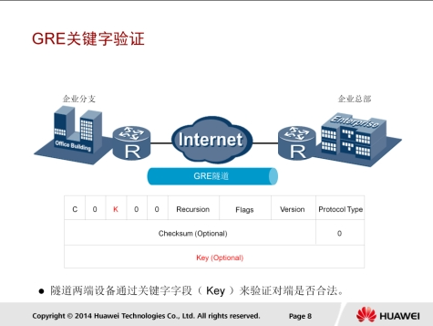

关键字（Key）验证是指对隧道接口进行校验，这种安全机制可以防止错误接收到来自其他设备的报文。关键字字段是一个四字节长的数值，若GRE报文头中的K位为1，则在GRE报文头中会插入关键字字段。只有隧道两端设置的关键字完全一致时才能通过验证，否则报文将被丢弃。

### Keepalive检测

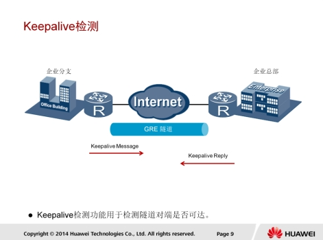

Keepalive检测功能用于在任意时刻检测隧道链路是否处于Keepalive状态，即检测隧道对端是否可达。如果对端不可达，隧道连接就会及时关闭，避免形成数据空洞。使能Keepalive检测功能后，GRE隧道本端会定期向对端发送Keepalive探测报文。若对端可达，则本端会收到对端的回应报文；若对端不可达，则收不到对端的回应报文。如果在隧道一端配置了Keepalive功能，无论对端是否配置Keepalive，配置的Keepalive功能在该端都生效。隧道对端收到Keepalive探测报文，无论是否配置Keepalive，都会给源端发送一个回应报文。

使能Keepalive检测功能后，GRE隧道的源端会创建一个计数器，并周期性地发送Keepalive探测报文，同时进行不可达计数。每发送一个探测报文，不可达计数加1。

如果源端在计数器值达到预先设置的值之前收到回应报文，则表明对端可达。如果计数器值达到预先设置的重试次数，源端还是没有收到回应报文，则认为对端不可达。此时，源端将关闭隧道连接。

### GRE配置

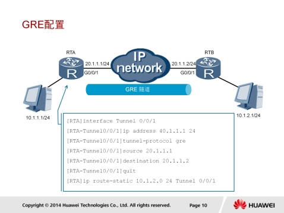

interface tunnel interface-number命令用来创建Tunnel接口。创建Tunnel接口后，需要配置Tunnel接口的IP地址和Tunnel接口的封装协议。

`tunnel-protocol`命令用来配置Tunnel接口的隧道协议。

`source { source-ip-address | interface-type interface-number }`命令用来配置Tunnel源地址或源接口。

`destination dest-ip-address`命令用来指定Tunnel接口的目的IP地址。

在本端设备和远端设备上还必须存在经过Tunnel转发的路由，这样，需要进行GRE封装的报文才能正确转发。经过Tunnel接口转发的路由可以是静态路由，也可以是动态路由。配置静态路由时，路由的目的地址是GRE封装前原始报文的目的地址，出接口是本端Tunnel接口。

##### 配置验证

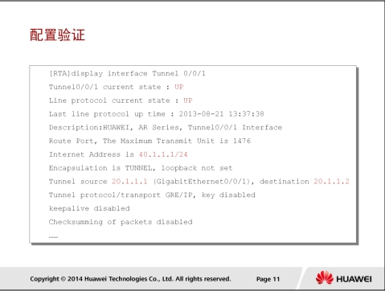

执行display interface Tunnel 0/0/1命令，可以查看接口的运行状态和路由信息。如果接口的当前状态和链路层协议的状态均显示为UP，则接口处于正常转发状态。隧道的源地址和目的地址分别为建立GRE隧道使用的物理接口的IP地址。

[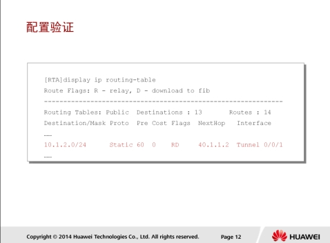]

执行display ip routing table命令，可以查看IP路由表，判断GRE隧道连接的两个网络的可达信息。在本示例中，可以看出目的地址为通过GRE隧道可达的网络地址，下一跳地址为GRE隧道远端接口的IP地址。

### 配置Keepalive检测

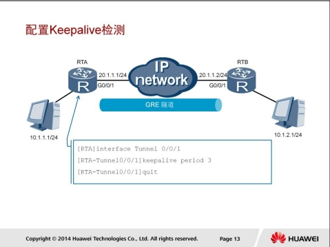

执行keepalive period  [ retry-times ] 命令，可以在GRE 隧道接口启用 Keepalive 检测功能 。

period 参数指定Keepalive检测报文的发送周期，默认值为5秒；

retry-times参数指定Keepalive检测报文的重传次数，默认值为3。

如果在指定的重传次数内未收到对端的回应报文，则认为隧道两端通信失败，GRE隧道将被拆除

##### 配置验证

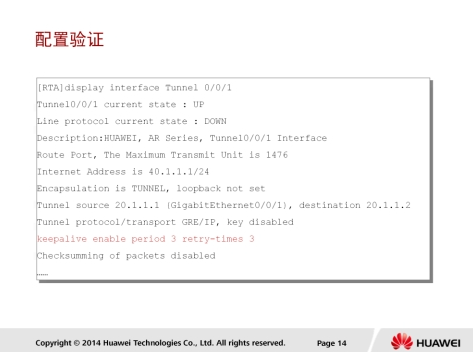

执行display interface tunnel命令，还可以查看GRE的Keepalive功能是否使能。本示例中，Keepalive检测功能的当前状态显示为启用，且报文的发送周期为3秒，重传次数为3次。

## Reference Links：

http://bbs.hh010.com/
