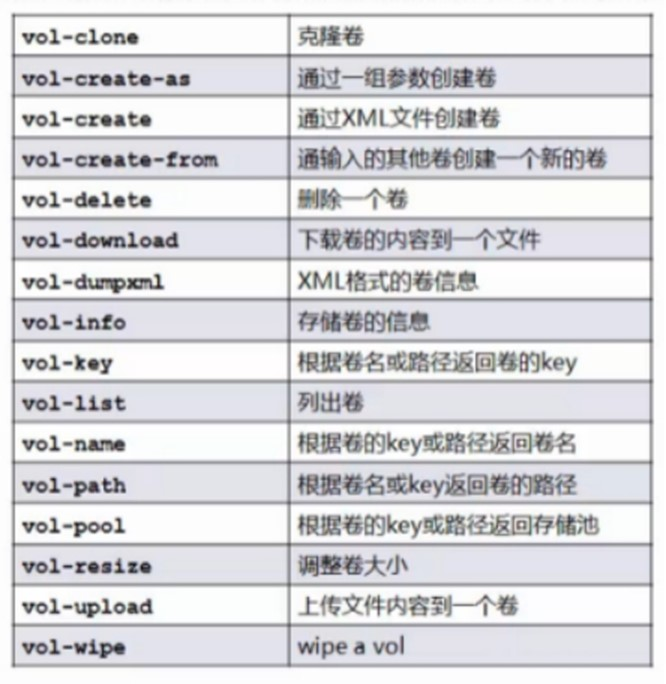
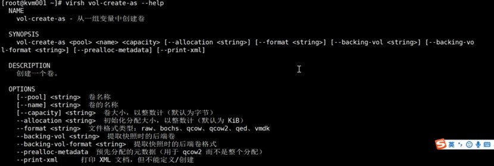
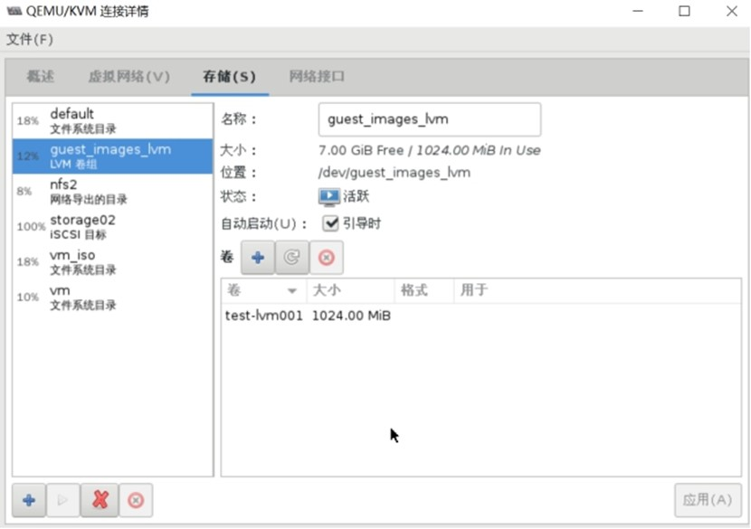
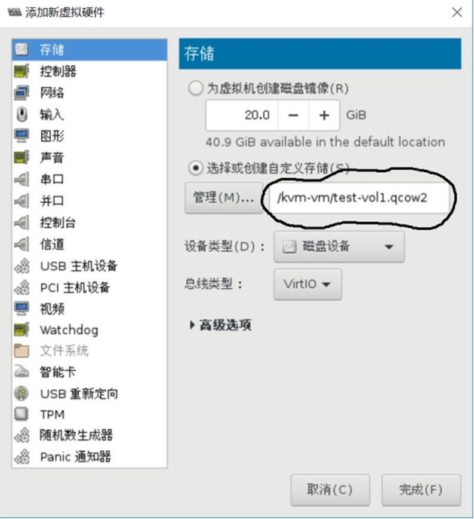

## 存储卷管理

### 存储卷概述

存储池被分割为存储卷（Storage Volume）

#### 存储卷

* 文件
* 块设备（如物理分区、LVM逻辑卷等）
* Libvirt管理的其他类型存储的抽象



### 存储卷管理

* 创建
* 克隆
* 删除
* 移动
* 修改大小



#### 基本目录的存储池中的存储卷管理

##### 列出存储池

```
virsh pool-list

名称               状态     自动开始
-------------------------------------------
 default              活动     是   
 nfs2                活动     是   
 storage02              活动     是   
 vm                 活动     否   
 vm_iso               活动     是   
```

##### 查看具体存储池vm的信息

```
virsh pool-info vm
名称：       vm
UUID:       f97233cf-7cde-4f3d-a6a7-381ca4730493
状态：       running
持久：       是
自动启动： 否
容量：       78.62 GiB
分配：       8.38 GiB
可用：       70.23 GiB
```

##### 查看存储池VM中的卷

```
virsh vol-list vm
 名称               路径                
------------------------------------------------------------------------------
 base-centos7.qcow2   /kvm-vm/base-centos7.qcow2  
 centos7-vm001.qcow2  /kvm-vm/centos7-vm001.qcow2   
 centos7-vm002.qcow2  /kvm-vm/centos7-vm002.qcow2   

#创建一个qcow2格式的卷
virsh vol-create-as vm test-vol1.qcow2 1G --format qcow2

virsh vol-list vm
 名称               路径                
------------------------------------------------------------------------------
 base-centos7.qcow2   /kvm-vm/base-centos7.qcow2  
 centos7-vm001.qcow2  /kvm-vm/centos7-vm001.qcow2   
 centos7-vm002.qcow2  /kvm-vm/centos7-vm002.qcow2   
 test-vol1.qcow2      /kvm-vm/test-vol1.qcow2  
```

#### 基本LVM的存储池中的存储卷管理

##### 建立基于LVM的存储池

```
virsh pool-define-as guest_images_lvm logical --target  /dev/vg_libvirt
定义池 guest_images_lvm

virsh pool-list --all
 名称               状态     自动开始
-------------------------------------------
 default              活动     是   
 guest_images_lvm              不活跃      否   
 nfs2                 活动     是   
 storage02            活动     是   
 vm                   活动     否   
 vm_iso               活动     是   

#构建池 guest_images_lvm
virsh pool-build guest_images_lvm

#设置自启
virsh pool-autostart guest_images_lvm
池 guest_images_lvm 标记为自动启动

#启动池
virsh pool-start guest_images_lvm

#创建卷test-lvm001
virsh vol-create-as guest_images_lvm  test-lvm001 1G

#列出卷信息
virsh vol-list guest_images_lvm
 名称               路径  
------------------------------------------------------------------------------
 test-lvm001          /dev/guest_images_lvm/test-lvm001
```



##### 向虚拟机添加卷

attach-device 通过XML添加新的设备

attach-disk  通过参数添加新的磁盘设备

```
virsh domblklist vm002
目标     源
------------------------------------------------
vda        /kvm-vm/centos7-vm002.qcow2
hda        -

cat add-disk.xml
<disk type='file' device='disk'>
  <driver name='qemu' type='qcow2' cache='none'/>
  <source file='/kvm-vm/test-vol1.qcow2'/>
  <target dev='vdb'/>
</disk>

#添加卷设备
virsh attach-device vm002 add-disk.xml

#添加新磁盘
virsh attach-disk --domain vm002 --source=/kvm-vm/test-vol1.qcow2 --target=vdb --cache=none
```

##### virt-manager图形界面添加



## Reference Links：

https://edu.51cto.com/lecturer/9286589-c81.html

#刘世民

https://www.cnblogs.com/sammyliu/p/4543110.html
