## nmcli命令行

`nmcli` 是 NetworkManager 的命令行工具，用于在命令行界面管理网络连接。NetworkManager 是一个在 Linux 系统上广泛使用的网络管理工具，提供了一种简单的方法来配置、监控和管理网络连接。

### 添加网桥

```
nmcli connection add con-name br5 type bridge ifname br5  //添加网桥
```

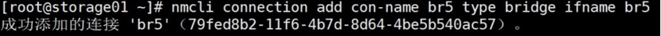

### 桥接物理网卡

```
nmcli connection add type bridge-slave con-name ens32 ifname ens32 master br5  //桥接物理网卡
```

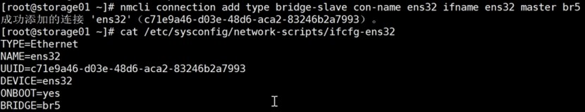

### 激活连接

```
nmcli connection up ens32  //激活连接

brctl  (需要安装bridge-utils包)
brctl addbr br10
```

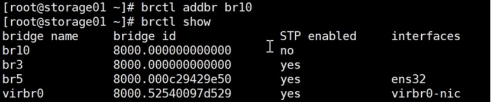

```
brctl addif br10 ens34
```

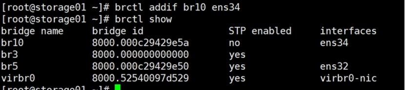

brctl命令对网桥的配置需要以文件形式保存下来，这样系统再次启动后所有配置仍能生效。

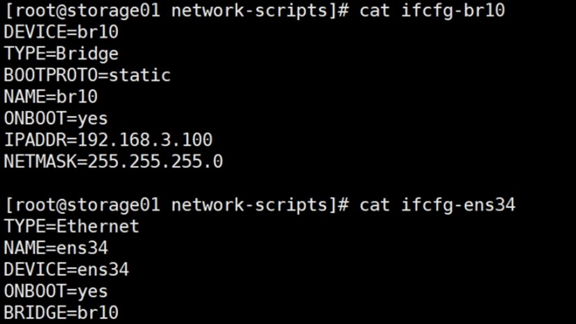

## 图形界面管理工具

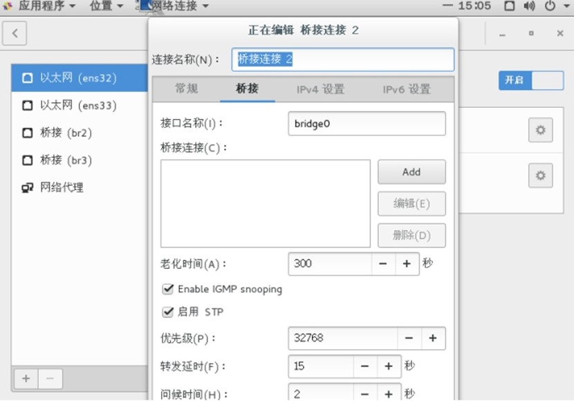

qemu-kvm支持的网络

* 虚拟机的网络模式
  * 基于NAT（Network Address Translation）的虚拟网络
  * 基于网桥（Bridge）的虚拟网络
  * 用户自定义的隔离的虚拟网络
  * 直接分配网络设备（包括VT-d和SR-IOV）
* 虚拟机的网卡：
  * RTL8139、e1000、.....
  * virtio

```
#
/usr/libexec/qemu-kvm -net nic,model=?qemu: Supported NIC models: 
ne2k_pci,i82551,i82557b,i82559er,rtl8139,e1000,pcnet,virtio
```

### 查看qemu网络配置文件

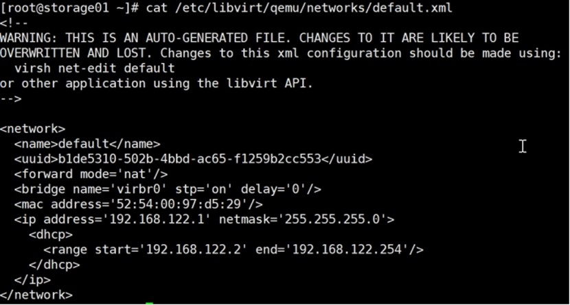

### virsh命令查看

```
virsh net-list

virsh net-info default

virsh net-dumpxml default
```

### 基于NAT的虚拟网络

KVM安装时默认的网络配置

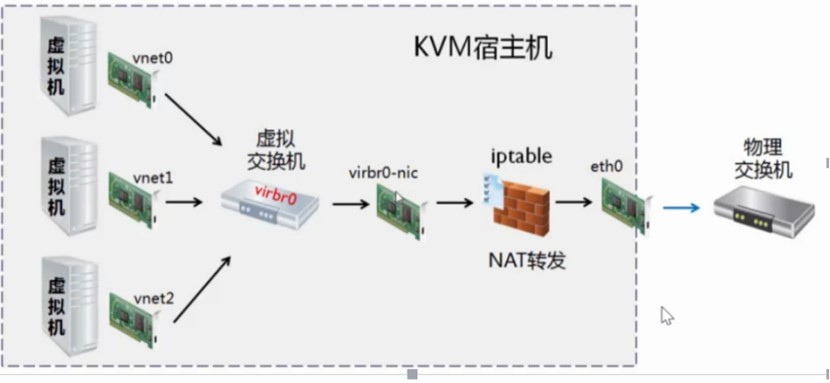

默认宿主机会有一个虚拟网卡virbr0,其实是一个虚拟交换机

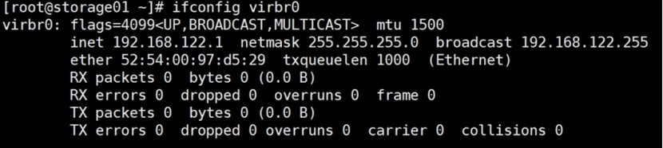

会绑定一个网卡virbr0-nic

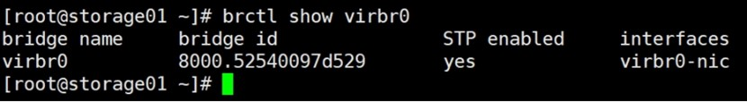

这时候主机就变成了一个路由器，可以看到路由功能已经打开

```
cat /proc/sys/net/ipv4/ip_forward
1
```

查看iptables的nat表，可以看到做了SNAT

```
iptables -t nat -L
```

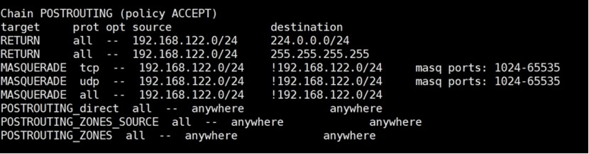

可以看到从virbr0接口进来的DNS报文和DHCP报文是允许的

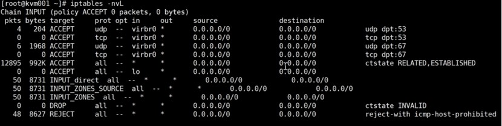

当有虚拟机启动，如果采用的是默认NAT模式，那么virbr0交换机下就会增加接口，可以看到有2个虚拟接口，代表有2个虚拟机接到了这个交换机上

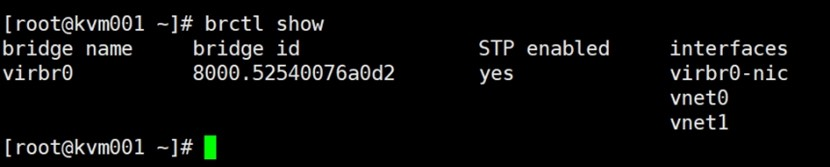


可以通过virsh命令查看虚拟机的网卡情况

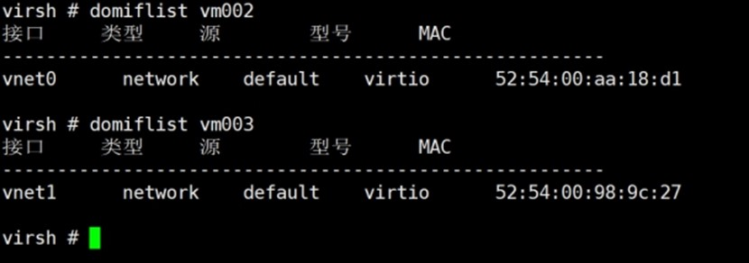

相似的命令还有：

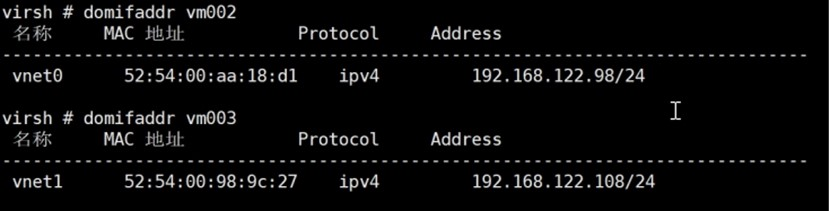

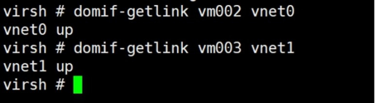

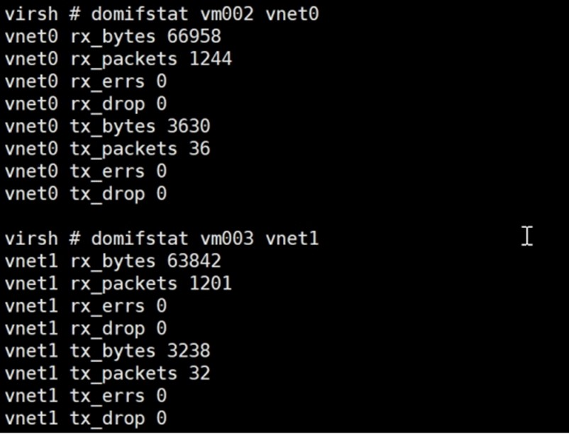

### 向虚拟机添加虚拟机网络

可以通过xml文档添加：

```
<interface type='network'>
      <mac address='52:54:00:aa:18:d1'/>
      <source network='default'/>    //网络模式
      <model type='virtio'/>        //网卡类型
      <address type='pci' domain='0x0000' bus='0x00' slot='0x03' function='0x0'/>
</interface>
```

例如：

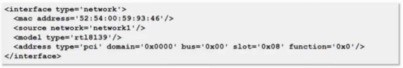

### 通过virt-manager图形添加

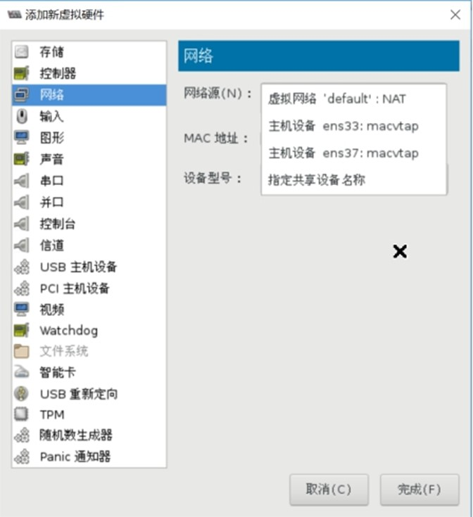

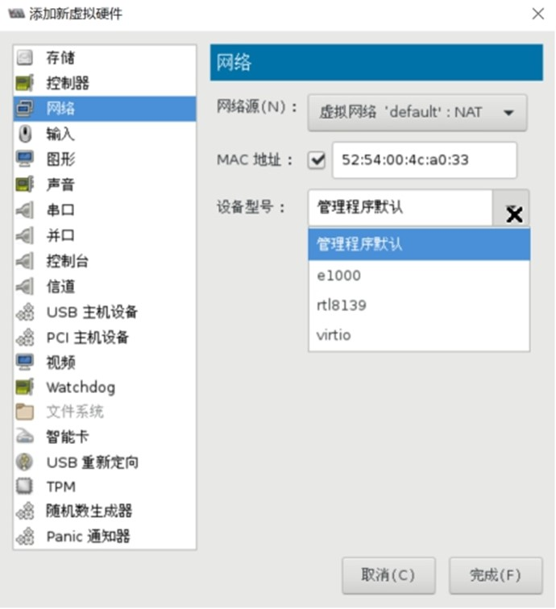

基于网桥的虚拟网络

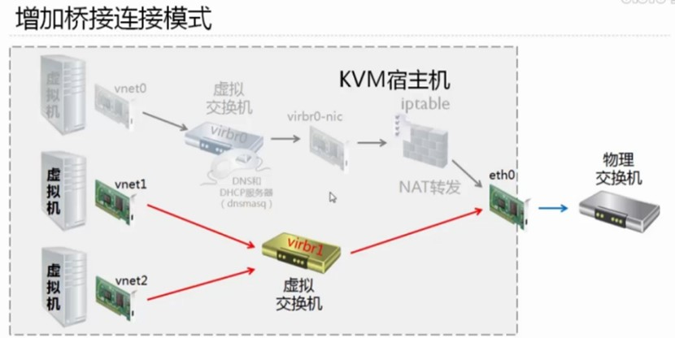

首先需要创建虚拟交换机，方式很多，可以根据前面讲的知识创建，也可以使用virt-manager来创建

添加网络接口，选择“桥接”

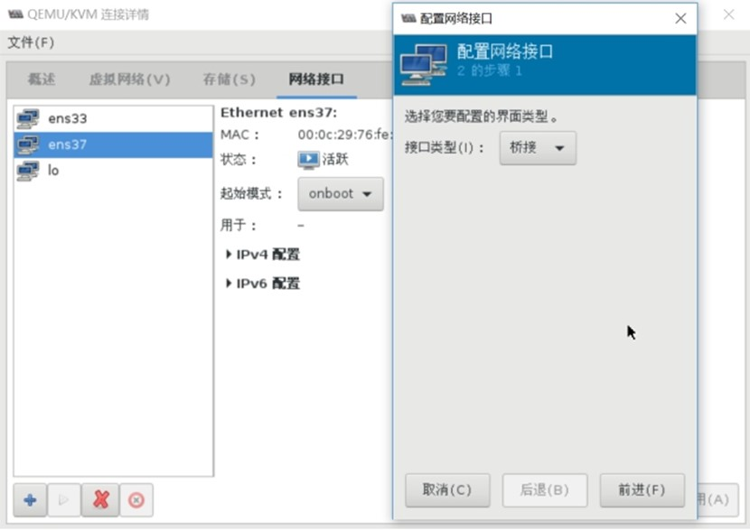

勾选要桥接的物理网卡“ens37”,不需要勾选“现在激活”

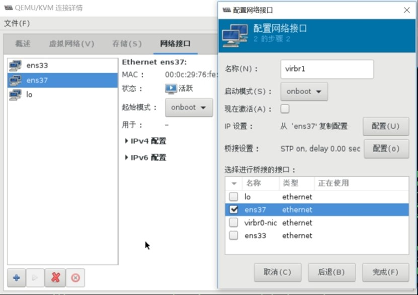

可以看到生成虚拟交换机virbr1

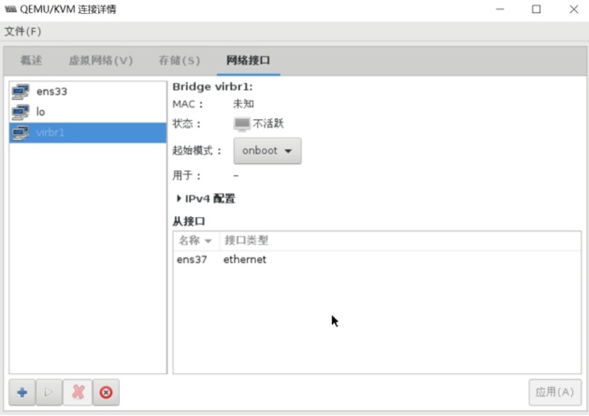

可以看到自动生成了配置文件

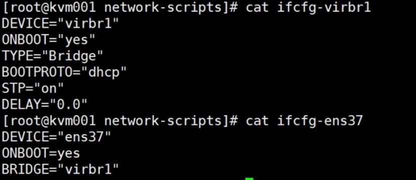

重新启动网络，让虚拟交换机virbr1激活

```
systemctl restart network
```

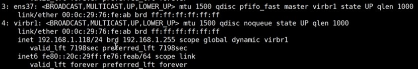

可以配置虚拟机vm003桥接到virbr1虚拟交换机上

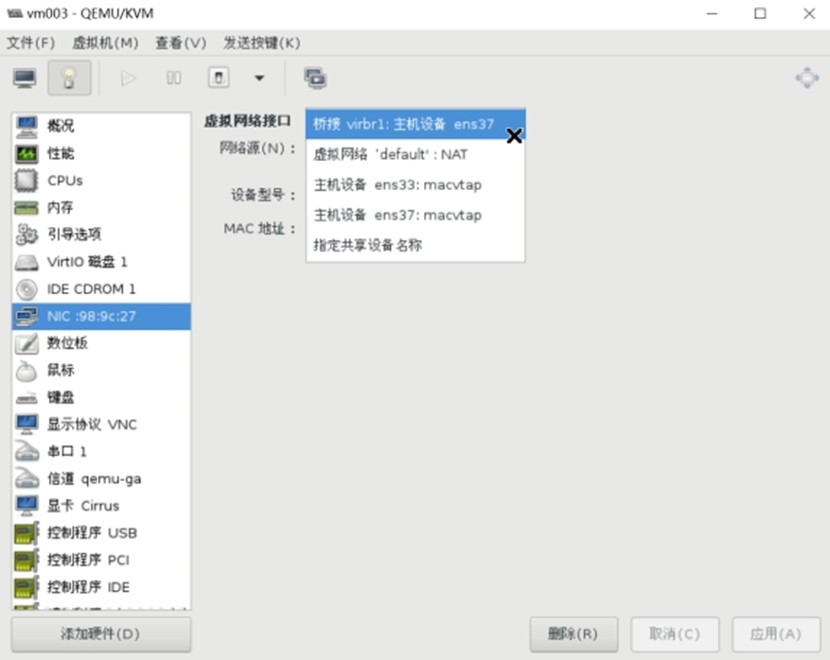

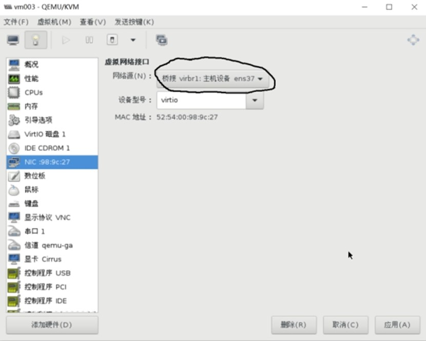

通过命令行查看交换机，发现虚拟机网卡已经到了virbr1交换机上

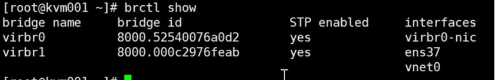

重新启动虚拟机VM003的网络，可以看到已经获取到物理网络的IP地址

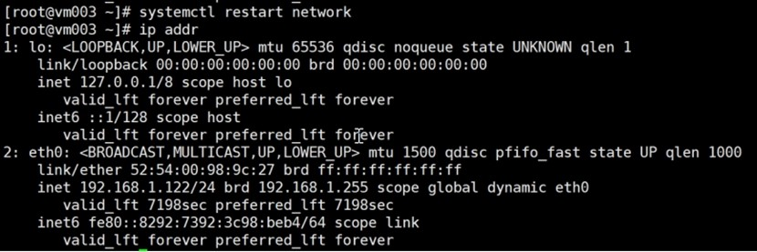

用户自定义的隔离的虚拟网络

这是官方的一个网络图：[http://libvirt.org/archnetwork.html](http://libvirt.org/archnetwork.html)

逻辑视图：

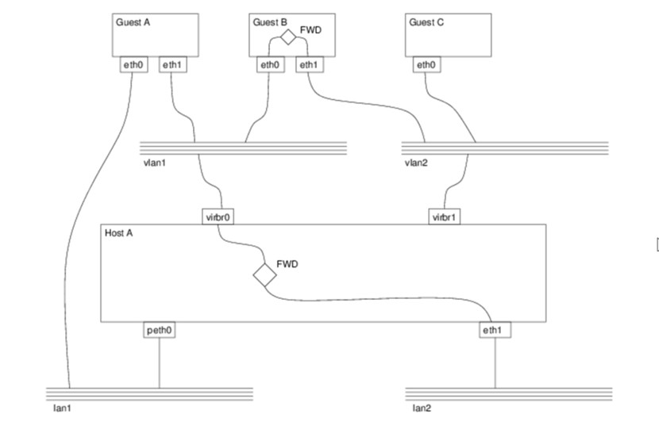

物理视图：

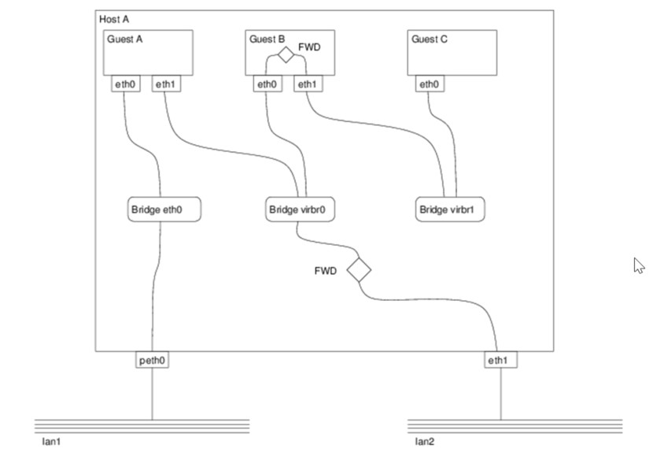

命令行添加网络

```
virsh attach-interface domain --type bridge --source br1 --model virtio --config	#下次启动生效
virsh attach-interface domain --type bridge --source br1 --model virtio --current	#立即生效

#为了让每次开机都生效，新生成一次配置文件替换原来的配置文件
virsh dumpxml domain > domain.xml
```

## Reference Links：

https://edu.51cto.com/lecturer/9286589-c81.html
