## 静态迁移（冷迁移）

对于静态迁移，你可以在宿主机上保存一个完整的客户机镜像快照，然后在宿主机中关闭或者暂停该客户机，然后将该客户机的镜像文件复制到另一台宿主机中，使用在源主机中启动该客户机时的命令来启动复制过来的镜像。

## 动态迁移（热迁移）

    如果源宿主机和目的宿主机共享存储系统，则只需要通过网络发送客户机的 vCPU 执行状态、内存中的内容、虚机设备的状态到目的主机上。否则，还需要将客户机的磁盘存储发到目的主机上。共享存储系统指的是源和目的虚机的镜像文件目录是在一个共享的存储上的。

## 迁移过程

### 动态迁移

在基于共享存储系统时，KVM 动态迁移的具体过程为：

1. 迁移开始时，客户机依然在宿主机上运行，与此同时，客户机的内存页被传输到目的主机上。
2. QEMU/KVM 会监控并记录下迁移过程中所有已被传输的内存页的任何修改，并在所有内存页都传输完成后即开始传输在前面过程中内存页的更改内容。
3. QEMU/KVM 会估计迁移过程中的传输速度，当剩余的内存数据量能够在一个可以设定的时间周期（默认 30 毫秒）内传输完成时，QEMU/KVM 会关闭源宿主机上的客户机，再将剩余的数据量传输到目的主机上，最后传输过来的内存内容在目的宿主机上恢复客户机的运行状态。
4. 至此，KVM 的动态迁移操作就完成了。迁移后的客户机尽可能与迁移前一致，除非目的主机上缺少一些配置，比如网桥等。

注意，当客户机中内存使用率非常大而且修改频繁时，内存中数据不断被修改的速度大于KVM能够传输的内存速度时，动态迁移的过程是完成不了的，这时候只能静态迁移。

关于实时迁移的效率，业界不少人提出了改进的建议，比如通过使用内存压缩技术，减少需要传输的内存的大小

#### 迁移注意事项：

* 最好迁移的服务器cpu品牌一样
* 64位只能在64位宿主机间迁移，32位可以迁移32位和64位宿主机
* 宿主机名字不能冲突
* 目的宿主机和源宿主机软件配置尽可能的相同，如 有相同的桥接网卡，资源池等。
* 两台迁移的主机 cat /proc/cpuinfo |grep nx 的设置是相同的NX，全名为“No eXecute”，即“禁止运行”，是应用在CPU的一种技术，用作把存储器区域分隔为只供存储处理器指令集，或只供数据使用。任何使用NX技术的存储器，代表仅供数据使用，因此处理器的指令集并不能在这些区域存储。这种技术可防止大多数的缓冲溢出攻击，即一些恶意程序，把自身的恶意指令集放在其他程序的数据存储区并运行，从而把整台计算机控制。

## 静态迁移

1. 拷贝镜像文件和虚拟机配置文件
2. 重新定义此虚拟机

## 动态迁移：

1. 创建共享存储
2. 两台机器挂载共享存储(手工挂载；使用资源池)
3. 启动动态迁移
4. 创建迁移后的虚拟机配置文件
5. 重新定义虚拟机

实验案例实施拓扑：

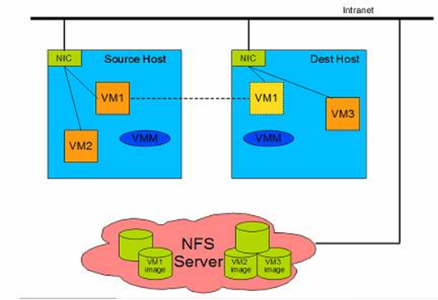

案例实施步骤如下：

1、设置主机名、/etc/hosts 互相解析，保证网络连接

2、两台主机的KVM连接NFS共享存储

3、在源主机的KVM中新建虚拟机并安装操作系统

4、连接KVM，并进行迁移。

## virsh migrate 命令

```
virsh migrate --help
virsh migrate   [--domain] <string>  	域名，id 或 uuid
    		[--desturi] <string>	客户端（常规迁移）或者源（p2p 迁移）中看到到目的地主机连接 URI

    --live           		热迁移
    --offline        		离线迁移
    --p2p            		点对点迁移
    --direct         		直接迁移
    --tunnelled      		管道迁移
    --persistent     		目的地中的持久 VM
    --undefinesource  		在源中取消定义 VM
    --suspend       		部启用目的地主机中的域
    --copy-storage-all  	使用全磁盘复制的非共享存储进行迁移
    --copy-storage-inc  	使用增值复制（源和目的地共享同一基础映像）的非共享存储进行迁移
    --change-protection		迁移结束前不得对域进行任何配置更改
    --unsafe        		即使不安全也要强制迁移
    --verbose       		显示迁移进程
    --compressed     		实时迁移过程中压缩重复的页
    --auto-converge  		force convergence during live migration
    --rdma-pin-all   		support memory pinning during RDMA live migration
    --abort-on-error  		在迁移过程中忽略软错误
    --migrateuri <string> 	迁移 URI， 通常可省略
    --graphicsuri <string>  	无空隙图形迁移中使用的图形 URI
    --listen-address <string>  	listen address that destination should bind to for incoming migration
    --dname <string>  		在迁移过长中重新命名为一个新名称（如果支持）
    --timeout <number>  	如果 live 迁移超时（以秒计）则强制虚拟机挂起
    --xml <string>   		包含为目标更新的 XML 的文件名
    --migrate-disks <string>  	comma separated list of disks to be migrated
```

示例：

```
virsh migrate --live --unsafe --verbose mynfs_vm1 qemu+ssh://192.168.145.30/system
```

## 常见错误：

### 迁移时遇到的错误描述：

```
virsh migrate centos --live qemu+ssh://192.168.30.132/system
error: unable to connect to server at 'KVM-2:49152': No route to host
```

原因：你的免密登录没有成功

解决方法：重新做免密登录即可

### 迁移时的存储错误：

```
virsh migrate centos --live qemu+ssh://192.168.30.132/system
error: Failed to open file '/mnt/CentOS6.8.qcow2': Input/output error
```

原因：存储没有挂载成功

解决方法：mount -o remount /dev/sdb /mnt

### 迁移时FQDN错误：

```
virsh migrate centos --live qemu+ssh://192.168.30.132/system
error: internal error hostname on destination resolved to [localhost](file:///C:/Users/dennis/AppData/Local/Temp/msohtmlclip1/01/clip_filelist.xml), but migration requires an FQDN
```

原因：两台宿主机无法解析主机名

解决方法：重新配置主机名和ip的解析

### 迁移时语法错误：

```
virsh migrate centos --live qemu+ssh://192.168.30.132:/system
error: internal error Unable to parse URI qemu+ssh://192.168.30.132:/system
```

原因：qemu+ssh语法写错了

解决方法：正确的应该是：virsh migrate centos --live qemu+ssh://192.168.30.132/system

## KVM性能优化

### KVM为什么要调优

性能的损耗是关键。KVM采用全虚拟化技术，全虚拟化要有一个软件来模拟硬件层，故有一定的损耗，特别是I/O，因此需要优化。KVM性能优化主要在CPU、内存、I/O这几方面。当然对于这几方面的优化，也是要分场景的，不同的场景其优化方向也是不同的。

### KVM优化思路及步骤

KVM的性能已经很不错了，但还有一些微调措施可以进一步提高KVM性能。

#### CPU优化

要考虑CPU的数量问题，所有guestcpu的总数目不要超过物理机CPU的总数目。如果超过，则将对性能带来严重影响，建议选择复制主机CPU配置，如图所示：


#### 内存优化

##### KSM(kernel samepage merging,相同页合并)

内存分配的最小单位是page（页面），默认大小是4KB。可以将host主机内容相同的内存合并，以节省内存的使用，特别是在虚拟机操作系统都一样的情况下，肯定会有很多内容相同的内存值，开启了KSM，则会将这些内存合并为一个，当然这个过程会有性能损耗，所以开启与否，需要考虑使用场景。

而KSM对KVM环境有很重要的意义，当KVM上运行许多相同系统的客户机时，客户机之间将有许多内存页是完全相同的，特别是只读的内核代码页完全可以在客户机之间共享，从而减少客户机占用的内存资源，能同时运行更多的客户机。

通过/sys/kernel/mm/ksm目录下的文件可查看内存页共享的情况：

* KSM主要有两个服务：ksm和ksmtuned。
* ksm的配置文件：/sys/kernel/mm/ksm/*

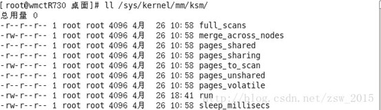

* full_scans：已经对所有可合并的内存区域扫描过的次数。
* pages_shared：正在使用中的共享内存页数量
* pages_sharing：有多少内存页正在使用被合并的共享页，不包括合并内存页本身。这是实际节省的内存页数量。
* pages_to_scan：在ksmd进程休眠之前会去扫描的内存页的数量。
* pages_unshared：无重复内容而不可以被合并的内存页数量。
* pages_volatile：因为内容很容易变化而不被合并的内存页数量。
* run：控制ksmd是否运行。
  * 0：停止运行但是保存合并的内存页；
  * 1：马上运行ksmd；
  * 2：停止运行，并且分立已经合并的所有内存页。
* sleep_millisecs：ksmd进程的休眠时间。
* 其中pages_to_scan、sleep_millisecs、run三个文件是可读写的，其他文件是只读的。

##### 配置和使用ksmtuned

配置文件：/etc/ksmtuned.conf

ksmtuned会一直保持循环执行，以调节ksm服务运行。

pages_shared文件记录了KSM共享的总页面数；

pages_sharing文件中记录了当前共享的页面数。

每个页面的大小为4KB，可计算出共享内存为：4 * 页面数 = 内存大小（KB）。

查看是否开启KSM，0是不开启，1是开启

```
pwd
/sys/kernel/mm/ksm

cat run
0
```

临时开启KSM，只能使用重定向，不支持用VI编辑器，可以在/etc/rc.local中添加

```
echo 1 > /sys/kernel/mm/ksm/run 	#让KSM开机自动运行
echo 1 > run

cat run
1
```

定期扫描相同页，sleep_millisecs决定多长时间，pages_to_scan决定每次查看多少个页面，默认为100，越大越好，超过2000无效，需要开启两个服务ksmtuned和tuned支持更多页面

KSM会影响系统性能甚到高达10%-50%，以效率换空间，如果系统的内存很宽裕，则无须开启KSM，如果想尽可能多地并行运行KVM客户机，则可以打开KSM。

##### 对内存设置限制

如果有多个虚拟机，为了防止某个虚拟机无节制的使用内存资源，导致其它虚拟机无法正常使用，就需要对内存的使用进行限制。

`virsh memtune` 是用于调整虚拟机内存调优参数的 Virsh 命令。这个命令允许你对虚拟机的内存行为进行配置，包括最大内存、硬限制、软限制等。

语法：

```
virsh memtune <domain> [options]
```

一些常见的选项包括：

* `--hard-limit`：设置虚拟机的硬限制内存。硬限制是虚拟机内存的绝对上限，不能超过这个值。
* `--soft-limit`：设置虚拟机的软限制内存。软限制是一个警告阈值，当虚拟机使用的内存接近软限制时，可以触发警告或其他操作。
* `--swap-hard-limit`：设置虚拟机的硬限制交换空间。类似于硬限制内存，这是虚拟机允许使用的交换空间的上限。
* `--min-guarantee`：设置虚拟机的最小内存保证。这是虚拟机在任何时候都能够使用的最小内存量。
* `--swap-model`：设置虚拟机的交换模型，可以是 "none"、"alloc"、"release" 等。用于控制虚拟机的交换空间使用。
* `--config` ：affect next boot    下次启动生效
* `--live` ： affect running domain   在线生效
* `--current` ：affect current domain    只在当前生效

示例：

```
virsh memtune myvm --hard-limit 4G --soft-limit 3.5G --swap-hard-limit 2G --min-guarantee 2G --swap-model release
```

设置了虚拟机 `myvm` 的硬限制为 4GB，软限制为 3.5GB，硬限制交换空间为 2GB，最小内存保证为 2GB，并设置了交换模型为 "release"。

```
virsh memtune vm002 --hard-limit 1024000 --live
```

设置vm002虚拟机强制最大内存1024M,并在线生效

##### 大页后端内存（Huge Page Backed Memory）

在逻辑地址向物理地址转换时，CPU保持一个翻译后备缓冲期TLB(Translation Lookaside Buffer转换检测缓冲区)，用来缓存转换结果，而TLB容量很小，所以如果page很小，TLB很容易就充满，这样就容易导致cache miss，相反page变大，TLB需要保存的缓存项就变少，就会减少cache miss。通过为客户机提供大页后端内存，就能减少客户机消耗的内存并提高TLB命中率，从而提高KVM性能。

Intel的x86 CPU通常使用4KB内存页，但是经过配置，也能够使用大页（huge page）

使用大页，KVM的虚拟机的页表将使用更少的内存，并且将提高CPU的效率。

查看大页功能是否开启，默认是开启的

```
cat /sys/kernel/mm/transparent_hugepage/enabled
[always] madvise never
```

默认情况下，大页的数目为0，通过下面的方式可以查看到：

```
cat /proc/meminfo | grep -i hugepages

AnonHugePages:    790528 kB
HugePages_Total:       0
HugePages_Free:        0
HugePages_Rsvd:        0
HugePages_Surp:        0
```

设置系统的大页数量，即大页需要的内存页面数，临时生效

```
echo 25000 > /proc/sys/vm/nr_hugepages

cat /proc/meminfo | grep -i hugepages
AnonHugePages:    856064 kB
HugePages_Total:     766
HugePages_Free:      766    //现在没有任何软件在使用大页
HugePages_Rsvd:        0
HugePages_Surp:        0
```

指定大页需要的内存页面数永久生效

```
sysctl -w vm.nr_hugepages=25000
vm.nr_hugepages = 25000
```

或者在/etc/sysctl.conf中添加vm.nr_hugepages=25000来持久设定大页文件系统需要的内存页面数。

注意：大页文件系统需要的页面数可以由客户机需要的内存除以页面大小大体估算

```
关闭虚拟机vm002
virsh destroy vm002

setlocale: No such file or directory
Domain vm002 destroyed

#编辑虚拟机的XML配置文件使用大页来分配内存
virsh edit vm002

<name>vm002 </name>
<uuid>e144e9ba-a125-4a97-9cf1-1c571f58817a </uuid>
<memory unit='KiB'>1048576 </memory>
<currentMemory unit='KiB'>1048576 </currentMemory>`
<memoryBacking><hugepages//添加，使用大页
```

挂载hugetlbfs文件系统

```
mount -t hugetlbfs hugetlbfs /dev/hugepages/
```

重启libvirtd服务

```
systemctl restart libvirtd
```

启动虚拟机vm002

```
virsh start vm002

setlocale: No such file or directory
Domain vm002 started

virsh list
setlocale: No such file or directory
 Id    Name                           State
---
 1     vm002                          running
```

查看使用情况

```
cat /proc/meminfo |grep -i hugepage

AnonHugePages:     55296 kB
HugePages_Total:    1033
HugePages_Free:      513
HugePages_Rsvd:        0
HugePages_Surp:        0
Hugepagesize:       2048 kB
```

可以看到消耗了520个大页（1033-513），每个页面大小为2M，正好是虚拟机vm002消耗的内存。

让系统开机自动挂载hugetlbfs文件系统，在/etc/fstab中添加：

```
hugetlbfs /dev/hugepages hugetlbfs  defaults 0 0
```

##### I/O的优化

在实际的生产环境中，为了避免过度消耗磁盘资源而对其它的虚拟机造成影响，我们希望每台虚拟机对磁盘资源的消耗是可以控制的。比如多个虚拟机往硬盘中写数据，谁可以优先写，就可以调整I/O的权重weight，权重越高写入磁盘的优先级越高。

对磁盘的I/O控制有两种方式：

* 在整体中的权重，范围在100-1000
* 限制具体的I/O。

```
virsh blkiotune vm002

weight         : 1000
device_weight  :
device_read_iops_sec:
device_write_iops_sec:
device_read_bytes_sec:
device_write_bytes_sec:

#设置权重为500
virsh blkiotune vm002 --weight 500
virsh blkiotune vm002

weight         : 500
device_weight  :
device_read_iops_sec:
device_write_iops_sec:
device_read_bytes_sec:
device_write_bytes_sec:
```

编辑虚拟机的XML配置文件：

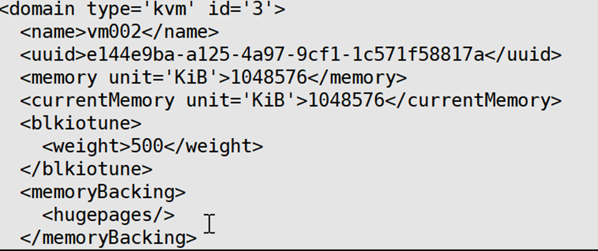

##### blkdeviotune设置虚拟机的读写速度

`blkdeviotune` 是用于调整虚拟机块设备 I/O 操作的 Virsh 命令。通过这个命令，你可以为虚拟机的块设备设置一些参数，以优化或限制虚拟机的磁盘 I/O 行为。

语法如下：

```
virsh blkdeviotune <domain> <path> [options]
```

* `<domain>` 是虚拟机的名称或标识符。
* `<path>` 是虚拟机块设备的路径。

一些常见的选项包括：

* `--total_bytes_sec`：限制块设备的总 I/O 吞吐量（字节/秒）。
* `--read_bytes_sec`：限制块设备的读取 I/O 吞吐量（字节/秒）。
* `--write_bytes_sec`：限制块设备的写入 I/O 吞吐量（字节/秒）。
* `--total_iops_sec`：限制块设备的总 I/O 操作数（每秒）。
* `--read_iops_sec`：限制块设备的读取 I/O 操作数（每秒）。
* `--write_iops_sec`：限制块设备的写入 I/O 操作数（每秒）。

示例：

```
virsh blkdeviotune myvm /dev/sdb --total_bytes_sec 1048576 --read_iops_sec 1000
```

设置了虚拟机 `myvm` 的块设备 `/dev/sdb`，限制了总 I/O 吞吐量为 1 MB/秒，并限制了读取 I/O 操作数为 1000 次/秒。

##### 系统调优工具tuned/tuned-adm

CentOS在6.3版本以后引入了一套新的 系统调优工具tuned/tuned-adm。

* tuned是服务端程序，用来监控和收集系统各个组件的数据，并依据数据提供的信息动态调整系统设置，达到动态优化系统的目的。
* tuned-adm是客户端程序，用来和tuned打交道，用命令行的方式管理和配置tuned。
  * tuned-adm提供了一些预先配置的优化方案可供直接使用。当然不同的系统和应用场景有不同的优化方案，tuned-adm预先配置的优化策略不是总能满足要求，这时候就需要定制，tuned-adm允许用户自己创建和定制新的调优方案。

安装tuned工具

```
yum install tuned -y
```

开机启动并开启tuned服务

```
systemctl start tuned

systemctl enable tuned

systemctl status tuned

tuned.service - Dynamic System Tuning Daemon
   Loaded: loaded (/usr/lib/systemd/system/tuned.service; enabled; vendor preset: enabled)
   Active: active (running) since 二 2017-10-17 08:36:52 CST; 5h 56min ago
 Main PID: 1332 (tuned)
   CGroup: /system.slice/tuned.service
    └─1332 /usr/bin/python -Es /usr/sbin/tuned -l -P
10月 17 08:36:52 kvm001 systemd[1]: Starting Dynamic System Tuning Daemon...
10月 17 08:36:52 kvm001 systemd[1]: Started Dynamic System Tuning Daemon.
```

查看当前优化方案

```
tuned-adm active

Current active profile: virtual-guest
```

查看预先设定好的优化方案

```
tuned-adm list
```

Available profiles:

- balanced                   	 - General non-specialized tuned profile
- desktop                     	 - Optmize for the desktop use-case
- latency-performance	 - Optimize for deterministic performance at the cost of increased power consumption  			\\延迟性能调试的服务器配置，以提高功耗为代价优化确定性性能
- network-latency             	 - Optimize for deterministic performance at the cost of increased power consumption, focused on low latency network performance
- network-throughput      	 - Optimize for streaming network throughput.  Generally only necessary on older CPUs or 40G+ networks.
- powersave                  	 - Optimize for low power consumption
- throughput-performance   - Broadly applicable tuning that provides excellent performance across a variety of common server workloads.  This is the default profile for RHEL7.  	#吞吐性能调整的服务器profile。如果系统没有企业级存储，则建议使用这个profile
- virtual-guest               	- Optimize for running inside a virtual guest. 	#企业级服务器配置中使用这个profile，其中包括电池备份控制程序、缓存保护及管理磁盘缓存
- virtual-host               	- Optimize for running KVM guests	#根据enterprise-storage配置，virtual-host还可减少可置换的虚拟内存，并启用更多集合脏页写回。同时推荐在虚拟化主机中使用这个配置，包括KVM和红帽企业版linux虚拟化主机

Current active profile: virtual-guest

修改优化方案为virtual-host

```
tuned-adm profile virtual-host

tuned-adm active
Current active profile: virtual-host
```

如果预定的方案不是总能满足要求，用户可以为自己的需求定制自己的优化方案。自己定制很容易，只需切换到优化方案的配置目录:/usr/lib/tuned/，不同的profile以目录的形式存在，拷贝其中一个例子，然后编辑里面的相关参数就可以了，使用tuned-adm list命令就能看到新创建的方案。

```
pwd
/usr/lib/tuned


cp -r virtual-host/ my-server
ls
balanced  functions            my-server        network-throughput  recommend.conf          virtual-guest
desktop   latency-performance  network-latency  powersave           throughput-performance  virtual-host

#编辑my-server目录中的文件添加调优参数即可：
tuned-adm list
......
```

## 虚拟机迁移

### 迁移 VMware workstation 虚拟机到 KVM

当我们需要把vmware虚拟机迁移到kvm时，就伴随着镜像格式的转换，vmdk→img

#### 转换过程

1.检查vmware虚拟机保存目录，查看是否为独立的vmdk文件，如果不是独立文件需要对其进行合并。

还有如果这台虚拟机有快照，需要将快照导出为完整虚拟机！

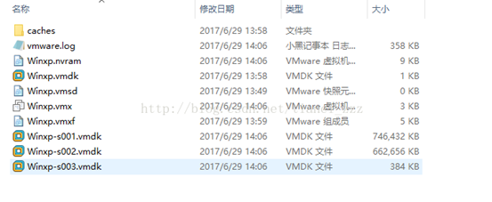

合并方法：以管理员身份运行cmd，进入到C:\Program Files (x86)\VMware\VMware Workstation>

用vmware自带的工具vmware- vdiskmanager.exe来合并多个文件，命令如下：

vmware-vdiskmanager.exe -r "C:\Winxp\Winxp.vmdk" -t 0 "C:\Winxpvm.vmdk"

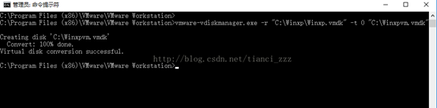

可以看到合并成功，Winxpvm.vmdk就是合并后的独立文件。

另外一种得到整个vm磁盘文件的方法为，vm --> 文件--导出ovf 导出后会有一个完整的磁盘文件。

2.将vmdk文件拷贝到KVM Linux主机，运行磁盘格式转换

```
qemu-img convert  Winxp.vmdk -O qcow2 Winxpvm.img
```

3.运行虚拟机

方法一：

启动virtmanager，导入镜像创建虚拟机。

方法二：

```
qemu-system-x86_64   -m 2048  Winxpvm.img
```

### 迁移 VMware vsphere 虚拟机到 KVM

#### VMware 虚拟机迁移到 KVM 的方式

虚拟机 V2V（Virtual-to-Virtual）迁移是在虚拟机之间移动操作系统和数据， 照顾主机级别的差异和处理不同的虚拟硬件。V2V 的迁移方法有两种，静态迁移和在线迁移。静态迁移（offline migration）也叫做常规迁移、离线迁移。在迁移之前将虚拟机暂停，同时拷贝虚拟机镜像和状态到目的主机。相比较于在线迁移（online migration），其缺点是静态迁移方式的过程需要显式的停止虚拟机的运行，而在线迁移的过程仅有非常短暂的停机时间，保证迁移过程中虚拟机服务的持续可用；优点是兼容性强，不需要 VMM 的有统一的 API 接口，可以借助第三方工具辅助迁移。由于目前 VMM 的开发没有统一的标准，不同的虚拟化厂商，尤其是闭源的商业厂商开发的 VMM 各成一套，静态迁移是解决不同类型虚拟机之间迁移的有效办法。本文采用 V2V 静态迁移的方法实现 VMware 虚拟机到 KVM 的迁移，同时介绍开源迁移工具 virt-v2v 的使用。

#### VMware 虚拟化产品及虚拟机文件

##### VMware 产品简介

VMware 是全球虚拟化解决方案的领导厂商，提供了一套虚拟机解决方案，按产品特点可分为如下四类。 　

* VMware ESX/ESXi：这个产品不需要安装任何操作系统，它本身就是一个用来管理硬件资源的特殊的操作系统，所有的虚拟机都安装在它的上面。ESX Server 带有远程 web 管理和客户端管理功能。
* VMware Server、Workstation 和 Fusion：与 ESX 相比，这三个产品都是要安装在操作系统上的。Server 和 Workstation 运行在 Windows 和 Linux 上，Fusion 运行在苹果的 Mac OS 上。
* VMware VMotion：是 VMware 开发出的一项独特技术，它将服务器、存储和网络设备完全虚拟化，使得正在运行的整个虚拟机能够在瞬间从一台服务器移到另一台服务器上。
* Virtual Center、Importer、Convertor、P2V、Player：这些是为了配合 VMware 虚拟引擎，主要是为了配合 ESX 开发的管理软件和工具，这些工具中很多是免费的。

本文主要迁移创建在 VMware ESX/ESXi、VMware Workstation 和 VMware Player 上的虚拟机到 KVM 主机上，迁移后的虚拟机可以被开源的 libvirt 软件管理。

##### VMware 虚拟机文件介绍

成功迁移虚拟机的一个重要的验证标准就是文件的正确性和完整性。下图中列出与 VMware 虚拟机相关的文件，但是迁移 VMware 虚拟机到 KVM 并不需要用到所有的文件。

图 1. VMware 虚拟机文件

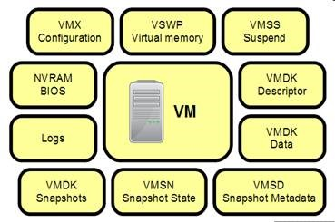

图 1. VMware 虚拟机文件

VMware 虚拟机的文件主要包括 .nvram 文件，.vmx 文件，vmdk 文件，.vswp 文件，.vmss 文件，.vmsd 文件，.vmsn 文件，.log 文件，.vmxf 文件。与迁移相关的最主要的是 .vmx 文件和 .vmdk 文件。

* .vmx 文件：包括虚拟机所有配置信息与硬件设置。不管你对虚拟机的设置做了何种编辑，所有的信息都会以文本形式保存在这个文件里。如特殊硬件配置（例如 RAM 大小，网络接口信息，硬盘驱动信息，串行与并行信息），高级能源与资源配置、VMware 工具选项及能源管理选项。迁移虚拟机时，需要更改这个文件的格式到 KVM 支持的 xml 文件，并且重新确认文件信息的有效性。
* .vmdk 文件：包含虚拟磁盘的信息。虚拟机的文件系统就建立在 .vmdk 文件上。迁移时需要拷贝这个文件到 KVM 主机，并且转换成能够被 libvirt 识别的文件格式。

以下的虚拟机文件有些只在虚拟机处于的某种状态时出现，迁移过程中不会用到。例如当虚拟机开启时出现 .vswp 文件，当虚拟机暂停时出现 .vmss 文件。

* .nvram 文件：包括虚拟机启动过程一部分的 Phoenix BIOS。它类似于拥有 BIOS 芯片的物理服务器，能够设置硬件配置选项。如果删除的话，在虚拟机启动时会自动地重新创建。
* .vswp file：这些文件的大小等于分配给虚拟机的内存大小，再减去任何内存预留（默认是 0）。这些文件通常创建在虚拟机里，但是只有当 ESX 主机耗尽所有物理内存时才使用。当虚拟机关闭或暂停时，这些文件将删除。
* .vmss 文件：这个文件用于虚拟机暂停时，保存虚拟机的存储内容，以便在重新开始时继续运行。
* .vmsd 文件：这个文件与快照一起使用，用于存储元数据和其他活动在虚拟机里的每个快照的信息。这个文本文件在创建快照之前的初始大小是 0 字节，并在每次创建或删除快照时更新信息。
* .vmsn 文件：这个文件与快照一起使用，用于存储虚拟机在进行快照时的状态。每在虚拟机上创建一个快照就会生成一个 .vmsn 文件，在删除快照时，文件自动删除。
* .log 文件：这些文件创建来用于存储虚拟机的日志信息，并常常用于故障检查。在虚拟机目录里，有大量的这样的文件。当前的日志文件通常命名为 vmware.log。
* .vmxf 文件：这是一个附加配置文件，不用于 ESX，用于与 Workstation 兼容的目的。这个文件是文本格式，Workstation 用来聚合虚拟机（VM teaming），将多个虚拟机分配成一组，作为一个单一对象开启或关闭、暂停或恢复它们。

### virt-v2v 迁移 VMware ESX 虚拟机

从 RHEL6（Red Hat Enterprise Linux 6）开始，RHEL 发行版中包含了 Red Hat 公司开发的 virt-v2v 工具。它是由 perl 语言编写的脚本，可以自动化的将创建在 Xen，KVM 和 VMware ESX 上的虚拟机拷贝到 virt-v2v 的主机，并且自动的更改配置，使之能够被 libvirt 进行管理。目前，virt-v2v 支持静态迁移下列虚拟机：RHEL4、RHEL5, RHEL6，Windows XP，Windows Vista, Windows 7, Windows Server 2003 和 Windows Server 2008。

图 2. virt-v2v 迁移 VMware/Xen/KVM 虚拟机示意图

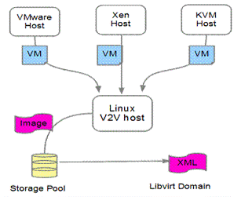

图 2. virt-v2v 迁移 VMware/Xen/KVM 虚拟机示意图

本节中，将分别介绍如何使用 virt-v2v 工具迁移 Vmware ESXi 上的 RHEL 虚拟机和 Windows 7 虚拟机到 KVM 主机。

#### 迁移前的环境设置

本文的 KVM 主机安装最新的 RHEL6.1 操作系统（发布于 2011 年 5 月 19 日）。这样，最基本的支持 KVM 虚拟机的软件 qemu-kvm、libvirt、virt-manager 和 virt-v2v 工具都在发行版中安装了。

清单 1. 支持 KVM 虚拟机的软件包

```
[root@localhost ~]# rpm -qa qemu-kvm 
qemu-kvm-0.12.1.2-2.160.el6.x86_64 
[root@localhost ~]# rpm -qa libvirt 
libvirt-0.8.7-18.el6.x86_64 
[root@localhost ~]# rpm -qa virt-manager 
virt-manager-0.8.6-4.el6.noarch 
[root@localhost ~]# rpm -qa virt-v2v 
virt-v2v-0.7.1-3.el6.x86_64
```

为了使 virt-v2v 工具能够自动化的迁移 VMware ESX 虚拟机，尽量减少手动干预，还需要在 KVM 主机上做一些设置。

1. 安装支持 Windows 虚拟机迁移的软件。

对于 Windows 虚拟机的迁移需要安装 libguestfs-winsupport 包来支持 NTFS 文件系统和 virtio-win 包来支持 Windows para-virtualized 存储和网络设备驱动。

清单 2. 安装 Windows 虚拟机迁移的支持包

```
[root@victory4 v2v]# rpm -ivh libguestfs-winsupport-1.0-7.el6.x86_64.rpm  \
virtio-win-1.2.0-1.el6.noarch.rpm 
Preparing...                ########################################### [100%] 
  1:virtio-win             ########################################### [ 50%] 
  2:libguestfs-winsupport  ########################################### [100%]
```

2. 创建 KVM 主机存储域

virt-v2v 在迁移虚拟机的过程中，需要拷贝被迁移虚拟机到 KVM 主机预先定义的存储池中。存储池可以用 libvirt 工具创建。最简单的方法就是使用 virt-manager 来创建新的存储池。本文中创建了一个文件目录类型的存储池，位置在 KVM 主机系统的 /home/images/migration 目录。

图 3. 使用 virt-manager 创建本地存储域

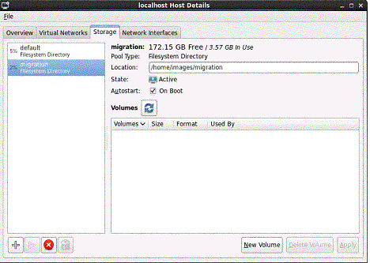

图 3. 使用 virt-manager 创建本地存储域

3. 创建 KVM 主机网络接口

虚拟机在迁移之后将连接 KVM 主机网络， 因此主机必须有一个与之相匹配的网络接口，比如说网桥。Linux 系统上有很多工具可以创建网桥，其中 RHEL6.1 发行版上的 virt-manager 已经支持创建和管理网桥。本文创建了网桥 br0，并且绑定在 eth0 的接口上，具体配置如下图。

图 4. 使用 virt-manager 创建网桥

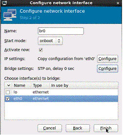

图 4. 使用 virt-manager 创建网桥

4. 创建配置文件 virt-v2v.conf

在 virt-v2v.conf 文件中设置 virt-v2v 迁移的规则，包括网络接口迁移后的映射，迁移的方式，存储的位置，输出的格式等等。这些规则也能以命令行参数的方式输入，如 - - network，-o，-os，-of 等。

#### virt-v2v 迁移 VMware 虚拟机的步骤

在 KVM 主机上完成上节的准备工作后，可以正式开始迁移 VMware ESX 上的虚拟机了。下面是迁移的具体步骤：

1. 如果虚拟机上安装了 VMware Tools，必须先卸载它。因为 KVM 的虚拟机不支持 VMware Tools 里面的虚拟驱动。
2. 在 VMware ESX 上停止等待迁移的虚拟机，因为 virt-v2v 只支持静态迁移。
3. 为自动登录 VMware ESX 服务器创建 .netrc 文件。VMware ESX 服务器的连接需要授权，virt-v2v 支持密码方式的授权连接，可以从 $HOME/.netrc 文件中读取密码并自动登录。如果主机系统没有这个文件，就手动创建它。并且 .netrc 文件需要 0600 权限，使 virt-v2v 工具可以正确读取它。

清单 3. .netrc 文件的格式

```
machine esx.example.com login root password xxxxxx
```

4. 使用 virt-v2v 命令进行迁移。VMware ESX 服务器采用 HTTPS 连接方式，连接时需要配置 SSL 证书。本文通过添加'?no_verify=1'; 到 VMware 服务器的 URI 连接中，来关闭证书检查。

清单 4. virt-v2v 迁移命令及参数

```
virt-v2v -ic esx://esx.example.com/?no_verify=1 -os pool --bridge brname vm-name 
  
esx.example.com – 是 ESX 服务器主机名或 IP Address 
pool – 本地主机存储池，用来保存镜像
brname – 本地主机网桥名字，用来连接迁移后的虚拟机网络
vm-name – 虚拟机的名字
```

5. 迁移成功后，虚拟机出现在 virt-manager 管理的虚拟机列表中。通过 virt-manager 工具启动虚拟机。
6. 检查迁移后的虚拟机的设备驱动。如果需要，重新安装虚拟设备驱动。
7. 验证迁移后的虚拟机的配置和系统是否和迁移之前一致。

#### virt-v2v 迁移实例：Linux 虚拟机 RHEL5.5

本例将迁移创建在 VMWare ESXi 服务器上的 RHEL5.5 虚拟机到 KVM 主机上，并使迁移后的虚拟机被 libvirt 管理。本例的环境中，VMware ESXi 服务器和 KVM 主机通过网络连接，虚

拟机镜像被各自的存储管理。

图 5. virt-v2v 迁移 RHEL5 虚拟机的环境

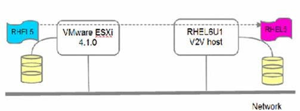

图 5. virt-v2v 迁移 RHEL5 虚拟机的环境

下面就开始正式的迁移 :

1. 在 VMware ESXi 上检测 RHEL5.5 虚拟机，如果安装了 VMware Tools，先卸载它。
2. 在 VMware ESXi 上关闭 RHEL5.5 虚拟机。
3. 在 KVM 主机上创建或修改 $HOME/.netrc 文件，添加 VMware ESXi 服务器的用户名和密码。

清单 5. 修改 .netrc 文件

```
[root@localhost home]# cat ~/.netrc 
machine 9.123.99.913 login root password xxxxxx 
 
[root@localhost home]# chmod 0600 ~/.netrc
```

4. 开始迁移虚拟机。KVM 的存储是迁移前准备好的存储域 migration，文件格式采用 libvirt 支持的 qcow2，网络连接方式与 VMware 虚拟机相同，采用网桥。

清单 6. 迁移 RHEL5.5 虚拟机

```
[root@localhost ~]# virt-v2v -ic esx://9.123.99.193/?no_verify=1 \
 -os migration -of qcow2 --bridge br0 RHEL5.5 
 Using CPU model "cpu64-rhel6"
 RHEL5.5_RHEL5.5: 100% [=============================================]D 0h22m52s 
 Using CPU model "cpu64-rhel6"
 virt-v2v: RHEL5.5 configured with virtio drivers 
 
参数说明
 -os migration:  迁移虚拟机的镜像文件到主机上的存储池
 -of qcow2：     转换迁移后虚拟机的文件格式
 --bridge br0：  设置迁移后虚拟机的网络映射到网桥 br0 
 RHEL5.5:        Vmware ESXi 上虚拟机的名字，迁移后保持名字一致
```

5. 在 KVM 主机上启动 virt-manager 软件，就会发现迁移后的虚拟机已经被 libvirt 管理了。

图 6. virt-manager 管理迁移后的 RHEL5.5 虚拟机

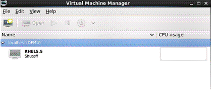

图 6. virt-manager 管理迁移后的 RHEL5.5 虚拟机

6. 深入比较迁移前在 VMware ESXi 上的虚拟机和迁移后在 KVM 上的虚拟机。

表 1. RHEL5.5 虚拟机迁移前后在 VMware ESXi 和 KVM 上的比较

| RHEL5.5         | VMware ESXi                                     | KVM/Libvirt                                        | 结论                                                   |
| --------------- | ----------------------------------------------- | -------------------------------------------------- | ------------------------------------------------------ |
| CPUs            | Intel Xeon 5160 x2                              | QEMU vCPU (cpu64-rhel6)                            | 数量一致，类型和转化为虚拟CPU，主频和支持的flags有变化 |
| Memory          | 1384M                                           | 1384M                                              | 数量一致                                               |
| Hard Disk       | 18GB， LSI Logic SCSI VMDK                      | 18GB virtio SCSI qcow2                             | 大小一致，总线接口和文件系统转换为适合libvirt的类型    |
| CDROM           | IDE                                             | IDE                                                | 类型一致                                               |
| Network Adaptor | MAC 00:0c:29:a9:7b:83 Type: e1000 vSwitch0 DHCP | MAC 00:0c:29:a9:7b:83 Type: virtio bridge br0 DHCP | Mac相同，网卡类型和连接方式转换为适合libvirt的类型     |
| Video Card      | Vmware SVGA 4M Video RAM                        | Model: Cirrus 9M RAM                               | 转换为libvirt支持的类型                                |
| 系统用户        | root/admin001                                   | root/admin001                                      | 一致                                                   |
| 磁盘分区        | VolGroup00 /dev/sda                             | VolGroup00 /dev/vda                                | 逻辑卷一致，物理盘符有变化。                           |

从表中的比较看出，RHEL5.5 从 VMware ESXi 服务器迁移到 KVM 主机上后，由于 Hypervisor 的不同，硬件发生了很大的变化。但是 virt-v2v 工具很好的解决的这个问题，使用 virtio 虚拟设备驱动使 RHEL5.5 系统迁移后能够流畅的运行。除了 RHEL5，virt-v2v 还支持 RHEL4 及 RHEL6 版本的迁移。

virt-v2v 迁移实例：Windows 虚拟机 WinXP，Win7

本例中将介绍如何使用 virt-v2v 工具迁移创建在 VMware ESXi 上的 Windows 虚拟机，包括 Windows XP SP3 32bit 中文版和 Windows 7 Professional 32bit 中文版。本节的环境中，KVM 主机上安装了 virt-v2v 及相应的支持包 libguestfs-winsupport 和 virtio-win。VMware ESXi 服务器和 KVM 主机通过网络连接，虚拟机镜像被各自的存储管理。

图 7. virt-v2v 迁移 Windows 虚拟机的环境

下面是正式的迁移步骤：

1. 在 VMware ESXi 上检测 WinXP 和 Win7 虚拟机，如果安装了 VMware Tools，先卸载它。
2. 在 VMware ESXi 上关闭 WinXP 和 Win7 虚拟机。
3. 在 KVM 主机上创建或修改 $HOME/.netrc 文件，添加 VMware ESXi 服务器的用户名和密码。
4. 开始迁移虚拟机。KVM 的存储是迁移前准备好的存储域 migration，文件格式采用 libvirt 支持的 qcow2，网络连接方式与 VMware 虚拟机相同，采用网桥。

清单 7. 迁移 WinXP 虚拟机

```
[root@localhost ~]# virt-v2v -ic esx://9.123.99.193/?no_verify=1 \
-os migration -of qcow2 --bridge br0 WinXP 
Using CPU model "cpu64-rhel6"
WinXP_WinXP: 100% [=========================================================]D 0h11m13s 
Using CPU model "cpu64-rhel6"
virt-v2v: WARNING: There is no virtio net driver available in the directory 
specified for this version of Windows. The guest will be configured with 
a rtl8139 network adapter, but no driver will be installed for it.
 If the rtl8139 driver is not already installed in the guest, you must install 
 it manually after conversion. 
virt-v2v: WinXP configured with virtio storage only.
```

清单 8. 迁移 Win7 虚拟机

```
[root@localhost ~]# virt-v2v -ic esx://9.123.99.193/?no_verify=1 \
-os migration -of qcow2 --bridge br0 Win7 
Using CPU model "cpu64-rhel6"
Win7_Win7: 100% [====================================
===================================
=======================================]D 0h35m41s 
Using CPU model "cpu64-rhel6"
virt-v2v: Win7 configured with virtio drivers 
[root@localhost ~]#
```

5. 迁移完成后，在 KVM 主机上启动 virt-manager 软件，会发现迁移后的 Windows 虚拟机已经被 libvirt 管理了。
6. 在 KVM 上启动虚拟机后，由于更新了一些虚拟硬件设备，可能需要重新安装驱动程序和重启系统。
7. 深入比较迁移前在 VMware ESXi 上的虚拟机和迁移后在 KVM 上的虚拟机，

表 2. WinXP 虚拟机迁移前后在 VMware ESXi 和 KVM 上的比较

| WinXP           | VMware ESXi                                     | KVM/Libvirt                                         | 结论                                                   |
| --------------- | ----------------------------------------------- | --------------------------------------------------- | ------------------------------------------------------ |
| CPUs            | Intel Xeon 5160                                 | Intel Pentium II处理器                              | 数量一致，类型和转化为虚拟CPU，主频和支持的flags有变化 |
| Memory          | 1256M                                           | 1256M                                               | 数量一致                                               |
| Hard Disk       | 8GB， Vmware Virtual IDE VMDK                   | 8GB Virtio SCSI qcow2                               | 大小一致，总线接口和文件系统转换为适合libvirt的类型    |
| CDROM           | VMware IDE                                      | IDE                                                 | 类型一致                                               |
| Network Adaptor | MAC 00:0c:29:83:86:d7 Type: PCNET vSwitch0 DHCP | MAC 00:0c:29:83:86:d7 Type: rtl8139 bridge br0 DHCP | Mac相同，网卡类型和连接方式转换为适合libvirt的类型     |
| Video Card      | Vmware SVGA 4M Video RAM                        | Model: Cirrus 9M RAM                                | 转换为libvirt支持的类型                                |
| 系统            | Administrator/admin001                          | Administrator/admin001                              | 一致                                                   |
| 磁盘分区        | C:\ D:\                                         | C:\ D:\                                             | 一致                                                   |

表 3. Win7 虚拟机迁移前后在 VMware ESXi 和 KVM 上的比较

| Win7            | VMware ESXi                                     | KVM/Libvirt                                        | 结论                                                   |
| --------------- | ----------------------------------------------- | -------------------------------------------------- | ------------------------------------------------------ |
| CPUs            | Intel Xeon 5160 x 2                             | X86 family 6 x 2                                   | 数量一致，类型和转化为虚拟CPU，主频和支持的flags有变化 |
| Memory          | 1024M                                           | 1024M                                              | 数量一致                                               |
| Hard Disk       | 24GB， LSI Logic SCSI VMDK                      | 24GB Virtio SCSI qcow2                             | 大小一致，总线接口和文件系统转换为适合libvirt的类型    |
| CDROM           | VMware IDE                                      | IDE                                                | 类型一致                                               |
| Network Adaptor | MAC 00:0c:29:64:de:6a Type: e1000 vSwitch0 DHCP | MAC 00:0c:29:64:de:6a Type: virtio bridge br0 DHCP | Mac相同，网卡类型和连接方式转换为适合libvirt的类型     |
| Video Card      | Vmware SVGA 8M Video RAM                        | Model: Cirrus 9M RAM                               | 转换为libvirt支持的类型                                |
| 系统            | Administrator/admin001                          | Administrator/admin001                             | 一致                                                   |
| 磁盘分区        | C:\ D:\                                         | C:\ D:\                                            | 一致                                                   |

从表中的比较看出，Windows 虚拟机从 VMware ESXi 服务器迁移到 KVM 主机上后，由于 Hypervisor 的不同，硬件发生了很大的变化。Virt-v2v 工具尽量在 KVM 虚拟机上使用 Virtio 虚拟设备加速系统的 IO 设备。WinXP 虚拟机的迁移后，使用了磁盘的 virtio 驱动而网络设备使用默认的 rtl8139。 Win7 虚拟机的迁移后磁盘和网络全部使用 virtio 的驱动。Virt-v2v 还支 Windows Vista，Win2003，Win2008 虚拟机从 VMware ESX/ESXi 上的迁移，步骤和 WinXP，Win7 虚拟机类似。

### virt-v2v 迁移小结

virt-v2v 工具自动化的解决了 VMware ESX/ESXi 服务器上的 RHEL 虚拟机和 Windows 虚拟机迁移到 KVM 主机的问题。而且在迁移的过程中尽量的使用 virtio 驱动提高 IO 设备的性能。但是，virt-2v2 工具也有一些局限性。比如只支持虚拟机关机情况下的静态迁移；只支持 RHEL 虚拟机和 Windows 虚拟机的迁移；不支持 VMware 虚拟机快照的迁移。对于创建在 VMware Workstation/Player 上的虚拟机，目前 virt-v2v 还不支持自动迁移。但是我们可以用手动迁移的方法完成到 KVM 主机的迁移。请看下节：手动迁移 VMware Workstation/Player 上的虚拟机到 KVM 。

#### 手动迁移 VMware Workstation/Player 上的虚拟机到 KVM

从物理机的文件系统看，VMware 虚拟机是由一组文件组成。这些文件可能集中存储在存储服务器上，如 VMware ESX/ESXi，也可能存储在本地，如 VMware Workstation/Player。关闭虚拟机的情况下，这些文件内容不会改变。所以我们可以用手动迁移的方法，拷贝这些文件到 KVM 主机并且转换这些文件的格式或内容，使 libvirt 能够管理和识别。这样就完成了 VMware 虚拟机的手动迁移。

手动迁移的准备工作

在 VMware 虚拟机众多的文件中，最重要的是虚拟机镜像文件 .vmdk 和系统配置文件 .xml。所以手动迁移就是要分别处理这两种文件。

合并分散的 vmdk 镜像文件。在 VMware Workstation 上创建虚拟机的时候，可以选择存储虚拟磁盘为一个文件或多个文件。但是 libvirt 不能管理多个文件组成的磁盘镜像，所以需要在迁移前合并这些文件为一个单独的文件。VMware Workstation 自带了离线的磁盘管理工具 vmware-vdiskmanager.exe 来合并 vmdk 文件。

图 8. 多个文件存储的 VMware 虚拟机

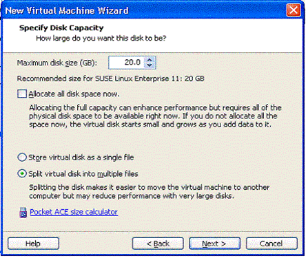

图 8. 多个文件存储的 VMware 虚拟机

qemu-img 转换 vmdk 的文件格式。KVM 主机上安装 qemu-img 包，可以察看并转换 vmdk 文件到 raw/qcow2 文件格式。

创建 xml 文件。VMware 的系统配置文件是 vmx，必须转换成 libvirt 能够识别的 xml 格式。一种方法是根据 VMware 虚拟机的硬件信息，手动创建一个新的 xml 文件；另一种方法是利用工具辅助转换 vmx 文件。比如 virt-goodies/vmware2libvirt 工具，可以从下面 link 下载安装 virt-goodies：[https://launchpad.net/ubuntu/+source/virt-goodies/0.4](file:///C:/Users/dennis/AppData/Local/Temp/msohtmlclip1/01/clip_filelist.xml)

下面我们以 VMware Workstations 上的 SUSE Linux Enterprise Server 11 SP1 虚拟机和 VMware Player 上的 Windows 2008 R2 虚拟机为例，详细介绍迁移到 KVM 主机的步骤。

手动迁移 VMware Workstation 上的 SLES11SP1 虚拟机

VMware Workstation 软件安装在一个 Windows XP 系统上，然后创建 SLES11SP1 虚拟机。虚拟机的文件都存储在本地。KVM 主机通过网络连接到 Window XP 系统。

图 9. 手动迁移 SLES11SP1 虚拟机的环境

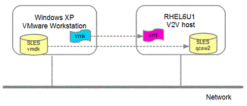

图 9. 手动迁移 SLES11SP1 虚拟机的环境

迁移的过程如下：

1. 登录宿主机 Windows XP 系统，在 VMware Workstation 上检查 SLES11SP1 虚拟机，如果安装了 VMware Tools，以 root 用户运行 [vmware-uninstall-tools.pl](file:///C:/Users/dennis/AppData/Local/Temp/msohtmlclip1/01/clip_filelist.xml) 卸载它。
2. 关闭 SLES11SP1 虚拟机。
3. 检查虚拟机的镜像文件。本例中，虚拟机的镜像存储在多个 vmdk 文件中，所以需要在迁移前合并他们。

图 10. 用 vmware-vdiskmanager.exe 合并多个 vmdk 文件

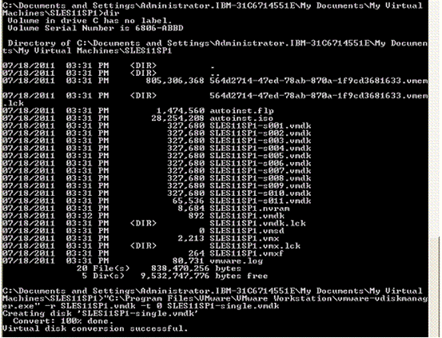

图 10. 用 vmware-vdiskmanager.exe 合并多个 vmdk 文件

4. 拷贝合并后的 vmdk 文件到 KVM 主机上。本例中，拷贝文件 SLES11SP1-single.vmdk 到 KVM 主机的 /home/images/migration 目录下。并且使用 qemu-img 工具将 vmdk 文件转换成 qcow2 格式的文件。可以看出，转换后镜像文件 SLES11SP1-single.img 的实际大小 3.9G 和最大范围 20G 没有改变，仅仅是文件系统类型变化了。

清单 9. 转换 vmdk 文件到 qcow2 格式

```
[root@localhost migration]# qemu-img info SLES11SP1-single.vmdk 
image: SLES11SP1-single.vmdk 
file format: vmdk 
virtual size: 20G (21474836480 bytes) 
disk size: 3.9G 
 
[root@localhost migration]# qemu-img convert -f vmdk \
-O qcow2 SLES11SP1-single.vmdk SLES11SP1-single.img 
 
[root@localhost migration]# qemu-img info SLES11SP1-single.img 
image: SLES11SP1-single.img 
file format: qcow2 
virtual size: 20G (21474836480 bytes) 
disk size: 3.9G 
cluster_size: 65536
```

5. 转换 vmx 文件。本例介绍第一种方法，即手动创建 vmx 文件。首先要找出 SLES11SP1 虚拟机全部虚拟设备信息，这些信息可以从 VMware Workstation 的管理界面和虚拟机系统的系统信息获得；然后在 KVM 主机上的 virt-manager 中，以第 4 步转换完成的镜像文件 SLES11SP1-single.img 为基础创建一个虚拟机；最后添加与 VMware 相同或类似的硬件，并且尽量保证数量、类型和配置的一致，包括 CPU 和 MEM 数量、系统构架、网络类型、MAC 地址等。

图 11. VMware Workstation 上查看虚拟机的硬件信息

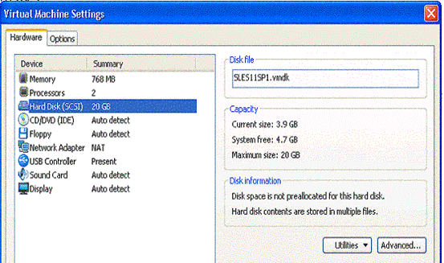

图 11. VMware Workstation 上查看虚拟机的硬件信息

图 12. 手动配置 KVM 虚拟机

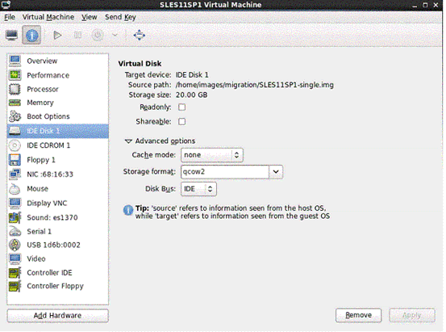

图 12. 手动配置 KVM 虚拟机

6. 设置完成后，自动创建 KVM 虚拟机的配置文件 /etc/libvirt/qemu/SLES11SP1.xml，并且 virt-manager 可以管理这个 SLES 虚拟机了。在 libvirt 上启动虚拟机，手动配置虚拟机系统以适应新的硬件。
7. 深入比较迁移前在 VMware Workstation 上的虚拟机和迁移后在 KVM 上的虚拟机。

表 4. SLES11SP1 虚拟机迁移前后在 VMware Workstation 和 KVM 上的比较

| SLES11SP1       | VMware Workstation                                 | KVM/Libvirt                                         | 结论                                                   |
| --------------- | -------------------------------------------------- | --------------------------------------------------- | ------------------------------------------------------ |
| CPUs            | Intel Core2 x 2                                    | QEMU vCPU x 2                                       | 数量一致，类型和转化为虚拟CPU，主频和支持的flags有变化 |
| Memory          | 768M                                               | 768M                                                | 数量一致                                               |
| Hard Disk       | 20GB LSI Logic SCSI VMDK                           | 20GB IDE qcow2                                      | 大小一致，总线接口和文件系统转换为适合libvirt的类型    |
| CDROM           | IDE                                                | IDE                                                 | 类型一致                                               |
| Floppy          |                                                    |                                                     | 类型一致                                               |
| USB Controller  | USB 2.0                                            | Physical USB device                                 | libvirt对USB的支持较弱                                 |
| Network Adaptor | MAC 00:0c:29:68:16:33 Type: PCNet NAT Virtual DHCP | MAC 00:0c:29:a9:7b:83 Type: Virtio NAT Virtual DHCP | Mac相同，网卡类型和连接方式转换为适合libvirt的类型     |
| Video Card      | Vmware SVGA                                        | Model: Cirrus 9M RAM                                | 转换为libvirt支持的类型                                |
| Audio device    | ES1371                                             | ES1370                                              | 转换为libvirt支持的类型                                |
| 系统用户        | root/admin001                                      | root/admin001                                       | 一致                                                   |
| 磁盘分区        | /dev/sda1 /dev/sda2                                | /dev/sda1 /dev/sda2                                 | 物理盘符及系统分区一致                                 |

和使用 virt-v2v 自动化迁移工具相比，手动迁移增加了很多工作和不确定性。在本系列文章第一篇列举了”Linux 系统在虚拟机迁移中的技术难点”，此处正好验证了手动迁移中需要注意的问题。比如在本例中，有以下两个问题：

如何选择磁盘总线类型。virt-v2v 工具自动选择 virtio 磁盘驱动来提高 KVM 虚拟机的性能，但是在本例中，SLES 虚拟机不能直接使用 virtio 磁盘驱动。因为 SLES 系统的磁盘分区名在 /etc/fstab 被硬编码为 /dev/sda，而 virtio 磁盘分区名为 /dev/vda，直接使用 virtio 磁盘驱动会导致系统找不到分区而无法启动的错误。所以本例为 KVM 虚拟机选择了性能较差的 IDE 磁盘类型。

Xwindow 需要重新配置。SLES 虚拟机不能自动处理显示设备的变化，所以需要手动运行 SaX2 重新配置 Xwindow 并重新启动 gdm。

实际上，手动把 SLES 虚拟机里面关于磁盘分区的硬编码全部改成 UUID 后，就可以使用高性能的 virtio 磁盘驱动。具体操作方法将在本系列文章的第五部分介绍。

手动迁移 VMware Player 上的 Win2008R2 虚拟机

VMware Player 软件安装在 Linux 系统上，然后创建了 Windows 2008 R2 虚拟机。虚拟机的文件都存储在本地。KVM 主机通过网络连接到 VMware Player 的主机系统。

图 13. 手动迁移 Win2008R2 虚拟机的环境设置

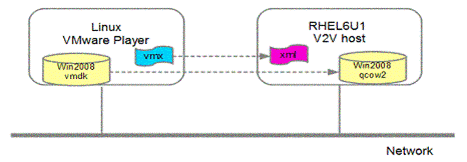

图 13. 手动迁移 Win2008R2 虚拟机的环境设置

迁移的过程如下：

1. 登录宿主机 Linux 系统，在 VMware Player 上检查 Win2008R2 虚拟机，如果安装了 VMware Tools，必须先卸载它。
2. 关闭 Win2008R2 虚拟机，因为手动迁移必须保持虚拟机文件的一致性。
3. 检查虚拟机的镜像文件。如果虚拟机的镜像存储在多个 vmdk 文件中，需要在迁移前合并。本例的 VMware 虚拟机存储在单独的 vmdk 文件中，所以略过此步。
4. 拷贝 vmdk 文件到 KVM 主机上。本例中，拷贝 Win2008R2.vmdk 文件到 KVM 主机的 /home/images/migration 目录下。并且使用 qemu-img 工具将 vmdk 文件转换成 qcow2 格式的文件。可以看出，转换后镜像文件 Win2008R2.img 的实际大小 6.4G 和最大范围 20G 没有改变，仅仅是文件系统类型变化了。

清单 10. 转换 vmdk 文件到 qcow2 格式

```
[root@localhost migration]# qemu-img info Win2008R2.vmdk 
image: Win2008R2.vmdk 
file format: vmdk 
virtual size: 20G (21474836480 bytes) 
disk size: 6.4G 
 
[root@localhost migration]# qemu-img convert -f vmdk \
-O qcow2 Win2008R2.vmdk Win2008R2.img 
 
[root@localhost migration]# qemu-img info Win2008R2.img 
image: Win2008R2.img 
file format: qcow2 
virtual size: 20G (21474836480 bytes) 
disk size: 6.4G 
cluster_size: 65536
```

5. 转换 vmx 文件。virt-goodies/vmware2libvirt 脚本是用来做 vmx 到 xml 转换的简单工具。但是由于它很长时间没有升级，而且不同的 Linux 发行版对 KVM/libvirt 安装方式不同，vmware2libvirt 工具转换后的 xml 文件需要手动更改或添加某些配置。

注意不同 Linux 发行版 qemu-kvm 的路径不同，RHEL6.1 下是 /usr/libexec/qemu-kvm。

把虚拟机的镜像文件路径及名字改成 /home/images/migration/Win2008R2.img。

vmware2libvirt 只转换第一块网卡，如果有多块网卡需要手动添加。

vmware2libvirt 不转换 CDROM、Floppy、USB 和显示设备，需要手动为 KVM 虚拟机添加。

磁盘和网卡采用默认的驱动程序，因为 Windows 系统没有预装 virtio 驱动。

清单 11. vmware2libvirt 转换 vmx 文件

```
[root@localhost migration]# /home/vmware2libvirt \
 -f Win2008R2.vmx > /etc/libvirt/qemu/Win2008R2.xml 
添加 Win2008R2 到 virt-manager 
 [root@localhost migration]# virsh -c qemu:///system \
 define /etc/libvirt/qemu/Win2008R2.xml 
 Domain Win2008R2 defined from /etc/libvirt/qemu/Win2008R2.xml
```

6. 在 virt-manager 中启动 Win2008R2 虚拟机，手动添加缺少的硬件。

图 14. KVM 上 Win2008R2 虚拟机的配置

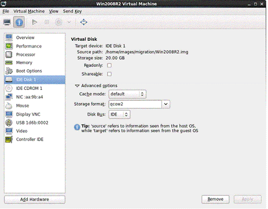

图 14. KVM 上 Win2008R2 虚拟机的配置

7. 启动虚拟机，检查系统状态。

表 5. Win2008R2 虚拟机迁移前后在 VMware Player 和 KVM 上的比较

| Win2008R2       | VMware Player                         | KVM/Libvirt                           | 结论                                                   |
| --------------- | ------------------------------------- | ------------------------------------- | ------------------------------------------------------ |
| CPUs            | Intel Core Duo 2.66G x 2              | QEMU vCPU 2.66G x 2                   | 数量一致，类型和转化为虚拟CPU，主频和支持的flags有变化 |
| Memory          | 1024M                                 | 1024M                                 | 数量一致                                               |
| Hard Disk       | 20GB， LSI Logic SCSI VMDK            | 20GB IDE qcow2                        | 大小一致，总线接口和文件系统转换为适合libvirt的类型    |
| CDROM           | VMware IDE                            | IDE                                   | 类型一致                                               |
| Network Adaptor | MAC 00:0c:29:aa:9b:a4 Type: e1000 NAT | MAC 00:0c:29:aa:9b:a4 Type: e1000 NAT | Mac地址、网卡类型和连接方式相同                        |
| Video Card      | Vmware SVGA                           | Model: Cirrus 9M RAM                  | 转换为libvirt支持的类型                                |
| 系统            | Administrator/qwe123OP                | Administrator/qwe123OP                | 一致                                                   |
| 磁盘分区        | C:\ D:\                               | C:\ D:\                               | 一致                                                   |

由上表可以看出，Win2008R2 虚拟机迁移到 KVM 后，虽然硬件有变化，但是不影响操作系统及软件的运行。这此迁移过程中没有使用任何 virtio 的驱动程序，因为 Windows 系统本身没有 virtio 的驱动。如果想使用 virtio 来提高 KVM 虚拟机的性能，参见下节如何用 virtio 驱动光盘或软盘手动安装。

在 Windows 虚拟机上手动安装 virtio 驱动

实际上，virtio 驱动光盘镜像文件和软盘镜像文件包含在清单 2 列出的 virtio-win 包中。只需要在虚拟机的虚拟光驱或软驱中装载这些镜像文件，就可以升级磁盘和网卡驱动为 virtio 驱动了。

清单 12. virtio 光盘镜像和软盘镜像文件

```
[root@localhost migration]# rpm -ql virtio-win 
....... 
/usr/share/virtio-win/virtio-win-1.2.0.iso 
/usr/share/virtio-win/virtio-win-1.2.0.vfd 
/usr/share/virtio-win/virtio-win.iso 
/usr/share/virtio-win/virtio-win.vfd
```

下面以上一个小节中，迁移到 KVM 的 Win2008R2 虚拟机为例，介绍如何在 Windows 虚拟机上安装 virtio 驱动。

1. 在虚拟光驱中加载 virtio 镜像。

图 15. 加载 virtio 光盘镜像

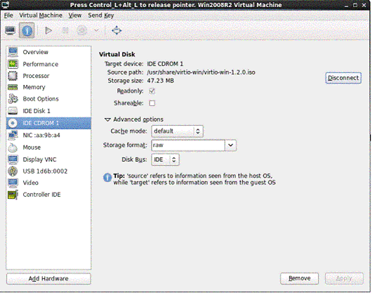

图 15. 加载 virtio 光盘镜像

2. 更改网卡的类型为 virtio，这样系统启动后可以从 virtio 光盘升级网卡驱动程序。
3. 此时不能更改磁盘的驱动类型。因为此时 virtio 驱动还没有安装，直接更改磁盘类型会导致系统无法启动的错误。替代方法是临时添加一块新的磁盘，大小随意，类型为 virtio。

图 16. 添加临时 virtio 磁盘


图 16. 添加临时 virtio 磁盘

4. 启动虚拟机并登陆系统，查看硬件设备管理器。发现缺少了网卡和磁盘控制器的驱动。用 virtio 光盘中的驱动安装他们。

图 17. 安装 virtio 驱动

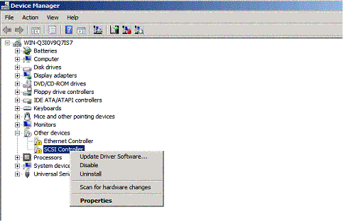

图 17. 安装 virtio 驱动

5. 安装完成后，关闭虚拟机。删除临时磁盘并把主磁盘的类型改为 virtio，然后启动虚拟机。这时你会发现 Win2008R2 虚拟机已经用上 virtio 的磁盘和网卡设备了。

目前 virtio 光盘镜像包含 WinXP、Win7、Win2003 和 Win2008 四个平台的驱动程序，都可以用上面这种方法手动安装。

小结

以上章节详细介绍了几种迁移 VMware 虚拟机到 KVM 的方法，下面总结一下各种迁移方法的的优缺点。

virt-v2v 工具是专门针对 VMware ESX/ESXi 的自动化迁移工具，而且支持的虚拟机系统仅限于 RHEL 和 Windows 虚拟机。Virt-v2v 在迁移后的 KVM 虚拟机中优先使用 virtio 虚拟驱动来提高系统 IO 的性能。如果不支持，才选用性能稍低，但更稳定可靠的虚拟硬件。而且这个过程全部自动化完成。

手动迁移可以涵盖所有的 VMware 软件和所有的虚拟机系统。从而迁移中面临的问题也是多样化的，需要不同程度的手动干预。某些特定的环境下，可以使用一些工具来辅助手动迁移，比如 virt-goodies/vmware2libvirt。另外 libvirt 也在开发支持 VMware Workstation/Player 迁移的新功能。

不论是 virt-v2v 自动化工具还是手动迁移，由于商业软件 VMware 开放的编程接口的限制，VMware 虚拟机到 KVM 的迁移有一些软肋：

一些 VMware 虚拟机的特性没有办法迁移到 KVM 虚拟机上。比如 VMware 虚拟机广泛使用的快照功能。

只能实现关闭虚拟机情况下的静态迁移，无法做到虚拟机不关机情况下的在线迁移。

一些特殊的 VMware 设备不能迁移到 KVM 虚拟机，于是采用了类似功能的硬件设备替代。比如 VMware Tools 中的虚拟驱动、VMware SVGA、VMware USB Controller 等。

总的来说，VMware 虚拟机到 KVM 的迁移不够成熟和自动化，迁移的过程需要手动干预。这要求迁移的操作人员具有相关的知识和经验。开源工具 virt-v2v 的出现简化了 VMware ESX/ESXi 上部分虚拟机的迁移，而且计划将来支持 VMware Workstation/Player 上虚拟机的自动迁移。反言之，自动化的迁移工具不就是用脚本语言把手动迁移的步骤和条件程序化么？掌握了手动迁移，才能了解虚拟机迁移更多的奥秘。

## Reference Links：

https://edu.51cto.com/lecturer/9286589-c81.html
