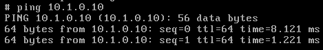

## qemu-kvm命令语法

```
qemu-kvm [options] [disk_image]
```

选项有很多类别：标准选项、块设备相关选项、显示选项、网络选项、...

### 标准选项：

-machine [type=]name：

-machine help来获取列表，用于指定模拟的主机类型； 　　

-cpu cpu：

-cpu help来获取列表；用于指定要模拟的CPU型号；　　

-smp n[,maxcpus=cpus][,cores=cores][,threads=threads]多少线程[,sockets=sockets]多少核：指明虚拟机上vcpu的数量及拓扑；　　

-boot [order=drives][,once=drives]只用一次（如按照系统时只用一次光盘引导）[,menu=on|off] [,splash=sp_name][,splash-time=sp_time][,reboot-timeout=rb_time][,strict=on|off]　　order：各设备的引导次序：c表示第一块硬盘，d表示第一个光驱设备；

-boot order=dc,once=d　　

-m megs：虚拟机的内存大小；　　

-name NAME：当前虚拟机的名称，要惟一；

### 块设备相关的选项

-hda/-hdb file：指明IDE总线类型的磁盘映像文件路径；第0和第1个；　　

-hdc/-hdd file：第2和第3个；　　

-cdrom file：指定要使用光盘映像文件； 　　

-drive [file=file路径][,if=type接口][,media=d接口对应的设备类型][,index=i] [,cache=writethrough|writeback|none|directsync|unsafe][,format=f]：　　　

* file=/PATH/TO/SOME_IMAGE_FILE：映像文件路径；
* if=TYPE：块设备总线类型，ide, scsi, sd, floppy, virtio,...
* media=TYPE：介质类型，cdrom和disk；
* index=i：设定同一类型设备多个设备的编号；
* cache=writethrough|writeback|none|directsync|unsafe：缓存方式；
* format=f：磁盘映像文件的格式；　　

### 显示选项

-display type：显示的类型，sdl, curses, none和vnc；　　

-nographic：不使用图形接口； 显卡型号　　

-vga [std|cirrus|vmware|qxl|xenfb|none]：模拟出的显卡的型号；　　

-vnc display[,option[,option[,...]]]：启动一个vnc server来显示虚拟机接口； 让qemu进程监听一个vnc接口； 　　　　display：　　　　　

HOST:N　在HOST主机的第N个桌面号输出vnc；　　　　　

unix:/PATH/TO/SOCK_FILE　　　　　

password：连接此服务所需要的密码；

-monitor stdio：在标准输出上显示monitor界面；　　

### 网络选项

-net nic[,vlan=n][,macaddr=mac][,model=type][,name=str][,addr=str][,vectors=v]　　　　为虚拟机创建一个网络接口，并将其添加至指定的VLAN；　　　　model=type：指明模拟出的网卡的型号，ne2k_pci,i82551,i82557b,i82559er,rtl8139,e1000,pcnet,virtio；　　　　　　net nic,model=?　　　　macaddr=mac：指明mac地址；52:54:00:　　

-net tap[,vlan=n][,name=str][,fd=h][,fds=x:y:...:z][,ifname=name][,script=file][,downscript=dfile]:　　　　通过物理的TAP网络接口连接至vlan；　　　　script=file：启动虚拟机时要执行的脚本，默认为/etc/qemu-ifup　　　　downscript=dfile：关闭虚拟机时要执行的脚本，/etc/qemu-ifdown　　　　ifname=NAME：自定义接口名称；其它选项：　　

-daemonize：以守护进程运行；

## 创建一个虚拟机

创建一个虚拟机，用kubuntu 的镜像文件（用windows、linux 什么镜像文件都行）

```
qemu-kvm -cpu host \
-smp 2,sockets=1,cores=2,threads=1 \
-m 512 \
-drive file=/data/imgs/test.img,if=virtio,media=disk,format=qcow2 \
-drive file=/root/kubuntu-17.10-desktop-amd64.iso,if=ide,media=cdrom \
-boot order=dc,once=d \
-vnc 172.16.1.7:0 \
```

## 创建、登录两个虚拟机

创建并开启虚拟机

```
qemu-kvm -name c1 \
-cpu host -smp 2 \
-m 64 \
-drive file=/data/imgs/c1.img,if=virtio,media=disk,format=qcow2 \
-vnc :0 \
-net nic,model=e1000,macaddr=52:54:00:00:01:01 \
-net tap,script=/etc/qemu-ifup-pn1 \

qemu-kvm -name c2 \
-cpu host \
-smp 2 \
-m 64 \
-drive file=/data/imgs/c2.img,if=virtio,media=disk,format=qcow2 \
-vnc :1 \
-net nic,model=e1000,macaddr=52:54:00:00:00:01 \
-net tap,script=/etc/qemu-ifup-pn1 \
-daemonize \
```

注意：-vnc :0/1 是窗口号；MAC 地址52:54:00 不能改，后边随意

```
ss -nutl 	#开启了5900 和5901 的端口
```


### 登录连接2个虚拟机

开2个终端，vnc 连接虚拟机

```
vncviewer 192.168.30.107:0

vncviewer 192.168.30.107:1

#登录用户：cirros
#登录密码：cubswin:)

sudo su - 	#切换到管理用户
poweroff 	#关机
```


## 建立虚拟机间的虚拟通道

### 给2个虚拟机加 IP ，在同一网段

```
ifconfig eth0 10.1.0.1/16 up

ifconfig eth0 10.1.0.2/16 up
```

分析：一旦添加了IP，就是仅主机模式了

### 测试虚拟通道是否连通

```
ping 10.1.0.2
```


```
ping 10.1.0.1
```


## 通过仅主机网桥连通宿主机

### 在宿主机上的br-c1-and-c2 网桥，添加虚拟机网段的地址

每创建一个虚拟主机，都会有另一半在宿主机上


```
ip addr add 10.1.0.10/16 dev br-c1-and-c2

ip a show br-c1-and-c2
```


测试仅主机网桥

ping 10.1.0.10 在虚拟机上ping



## 通过NAT 网桥实现NAT 模式

在宿主机上开启路由转发功能

```
sysctl -w net.ipv4.ip_forward=1
```


在2个虚拟机上添加路由

```
route add default gw 10.1.0.10
```

ping 172.16.1.7 发现ping 宿主机的另一块网卡能ping 通了，因为内核机制


ping 172.16.0.1 但是外网还是ping不同，原因：宿主机上只有出包，没有进包

```
tcpdump -i eth1 -nn icmp 	#只有出包，没有进包
```


### 做SNAT 策略

```
iptables -t nat -A POSTROUTING -s 10.1.0.0/16 -j SNAT --to-source 172.16.1.7

iptables -vnL -t nat 查询
```


### 测试NAT 网桥

在宿主机上ping 外网

```
ping 172.16.0.1
```


宿主机也有回包了


## 关闭虚拟机

在虚拟机上poweroff

```
poweroff 关机
```

在宿主机上杀死进程


推荐几个图形化管理虚拟机的工具

（1）图形管理工具：

　　OpenStack：IaaS 非常重量级，非常吃资源；至少10台以上的虚拟机才用它

　　oVirt：比kimchi 功能强大的多，比OpenStack轻量；但配置也较麻烦

　　proxmox VE

（2）kvm 官方的管理工具栈：[https://www.linux-kvm.org/page/Management_Tools](file:///C:/Users/dennis/AppData/Local/Temp/msohtmlclip1/01/clip_filelist.xml)

## Reference Links：

https://edu.51cto.com/lecturer/9286589-c81.html

#刘世民

https://www.cnblogs.com/sammyliu/p/4543110.html
