## RDS简介

云数据库RDS（Relational Database Service，简称RDS）是一种基于云计算平台的稳定可靠、弹性伸缩、便捷管理的在线云数据库服务。

## RDS创建

搜索RDS > 云数据库RDS > 实例列表 > 创建实例

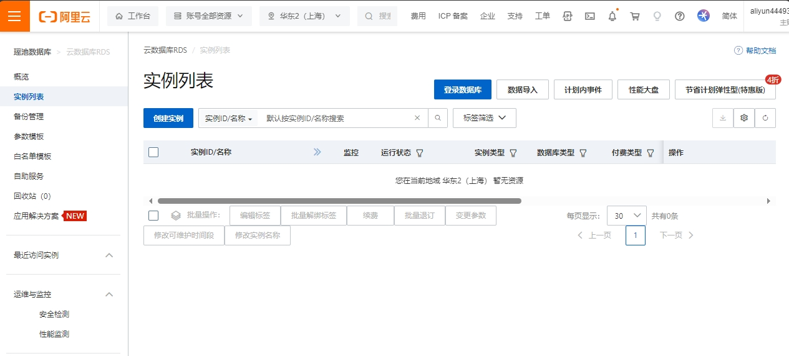

### 规格选择

主要参数：

* 计费方式：按量付费
* 地域：选上海
  * RDS实例与需要连接的ECS实例创建于同一地域，否则RDS实例与ECS实例无法通过内网互通，只能通过外网互通，无法发挥最佳性能
* 实例创建后地域无法修改。
* 产品系列：有三种类型可选。这里我们选集群模式
  * 基础系列：单节点
  * 高可用系列：一主一备
  * 集群系列：一主两备
* 实列规格：2v4g
* 存储空间：20G

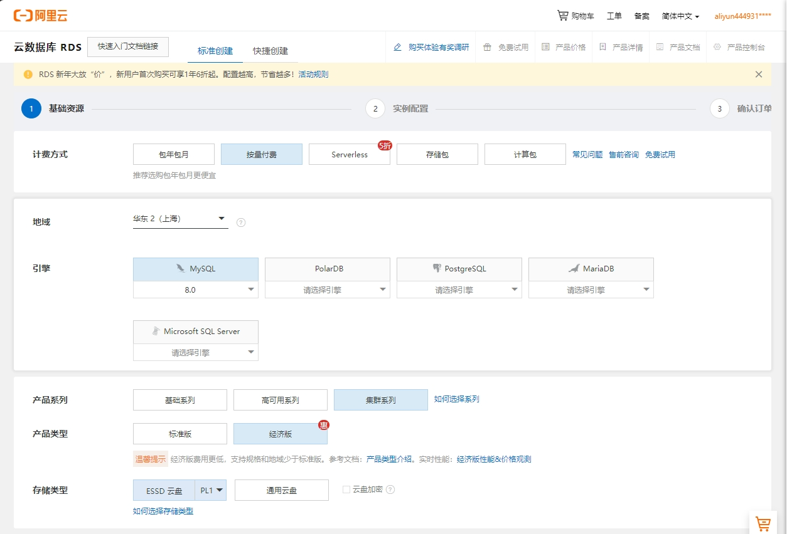

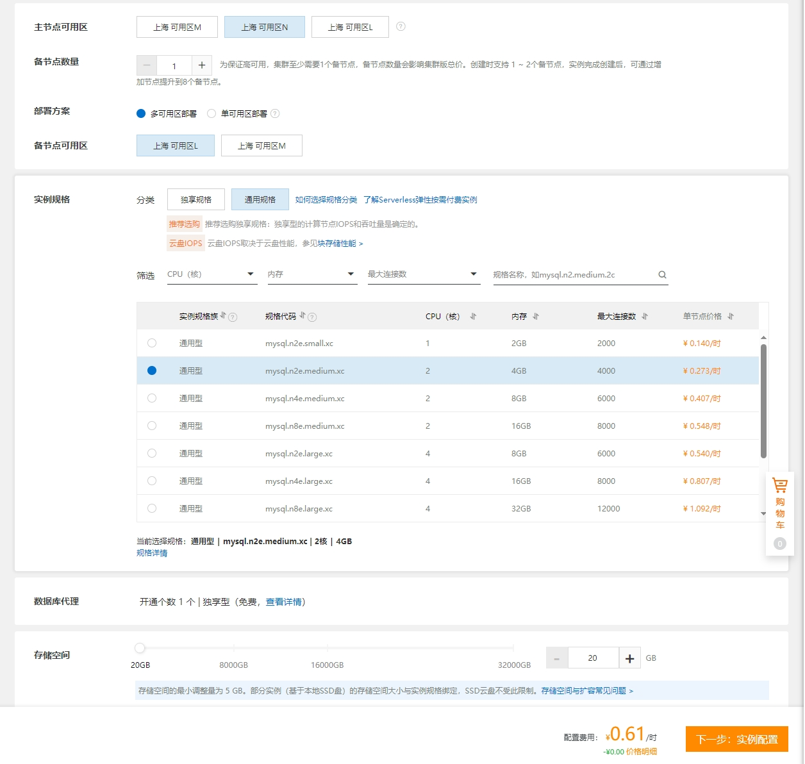

### 实例配置

* VPC：选择名称为vpc_172这个VPC
* 主节点交换机：交换机需要和RDS在同一区域。没有交换机就创建一个。
* 加入白名单：选是

  * 将VPC网段加入到RDS实例白名单中，使得同一VPC下的ECS实例可以访问RDS实例。
* 数据库端口：3306

  * 生产环境不要使用3306
* 参数模板：选MySQL_InnoDB_8.0_集群系列_高性能参数模版，这个是默认参数。
* 表名大小写：不区分大小写

  * MySQL 8.0 表名大小写设置后不支持修改，请谨慎设置。
* 小版本升级策略：自动升级

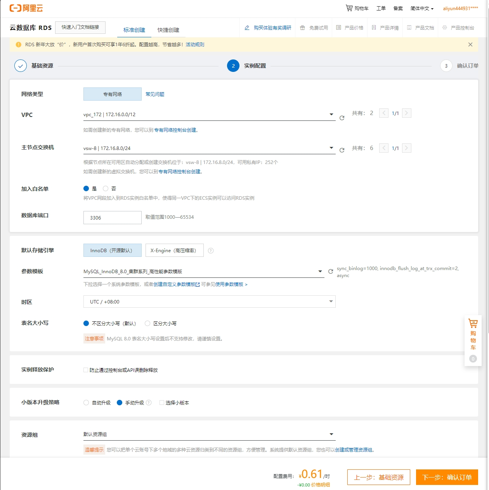

### 查看实例

云数据库RDS > 实列列表

下图显示RDS正在创建中

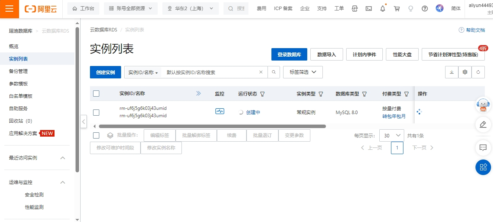

## RDS管理

### 账号管理

RDS创建完成后默认没有账号

#### 创建账号

云数据库RDS > 实力列表 > 账号管理 > 创建账号

主要参数：

* 数据库账号：oldboy_rds_user03
* 账号类型：高权限账号
  * 高权限账号用作管理员账号，且只能创建一个。
  * 业务程序操作使用普通账号
* 密码：1WIDNdLxu9ep9uY

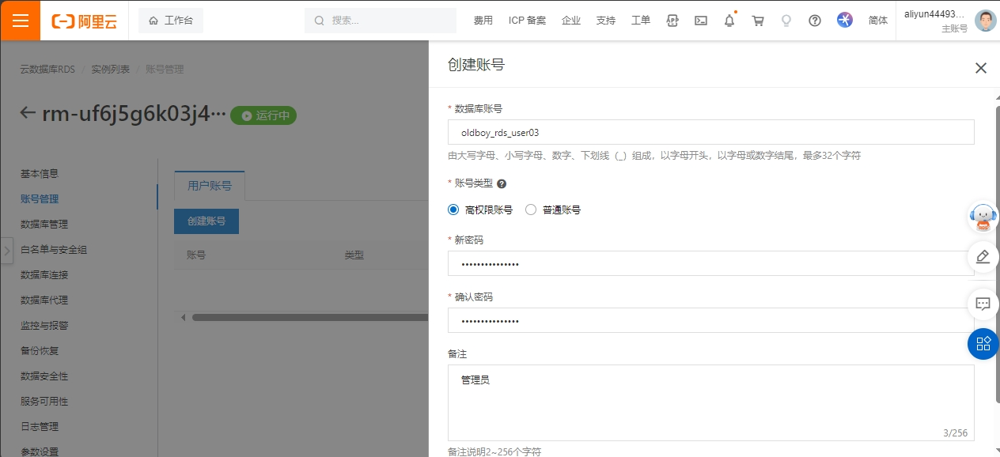

创建成功

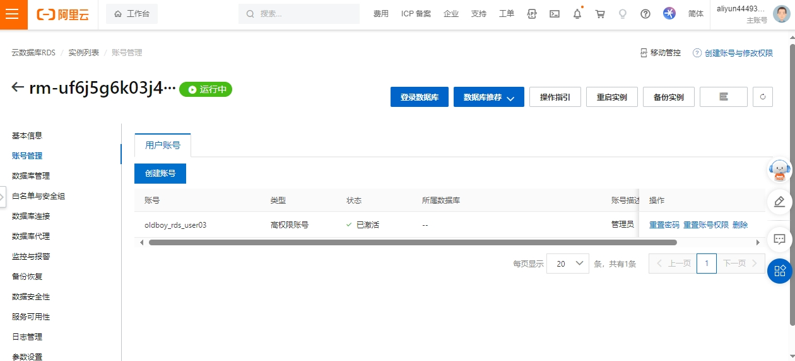

接下来再创建一个普通账号，此处略过。

### 数据库管理

RDS创建完成后默认没有数据库

#### 创建数据库

云数据库RDS > 实例列表 > 数据库管理 > 创建数据库

主要参数：

* 数据库名称：test_db
  * 生产环境需要按照规范命名。此处test_db仅用于演示。
* 支持字符集：utf8mb4
* 授权账号：选择普通账号

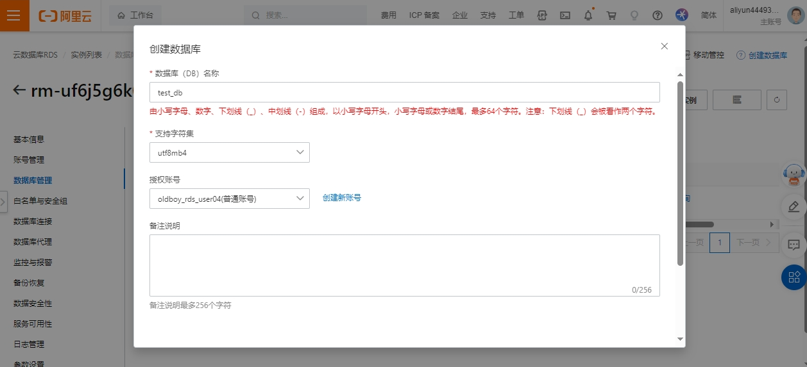

创建成功

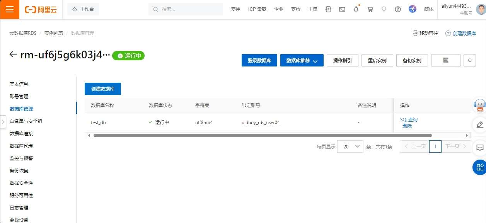

#### 登录测试

生产环境一般不用Web界面操作RDS，此处登录仅作演示。

云数据库RDS > 实例列表 > 数据库管理 > 登录数据库

数据库账号：输入刚刚创建的普通账号

管控模式：永久免费

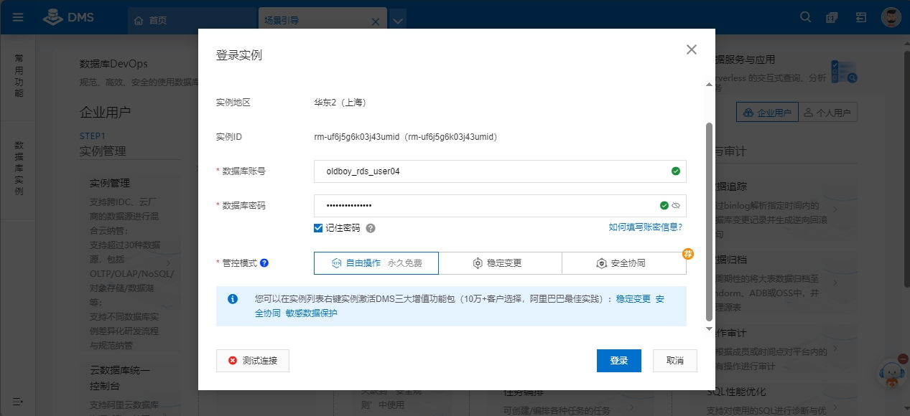

登录成功

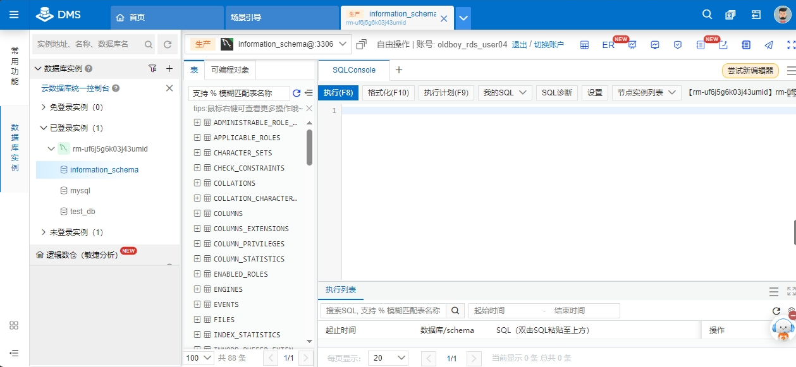

> 注意：
>
> 通过注销登录方式退出数据库是安全的方法。

### 网路设置

RDS访问方式：通过为RDS设置私有IP来访问公网。

#### 设置私有IP

云数据库RDS > 实例列表 > 选择对应实例 > 白名单与安全组 > 设置白名单 > 修改默认网段设置

修改成业务实例的网段即可

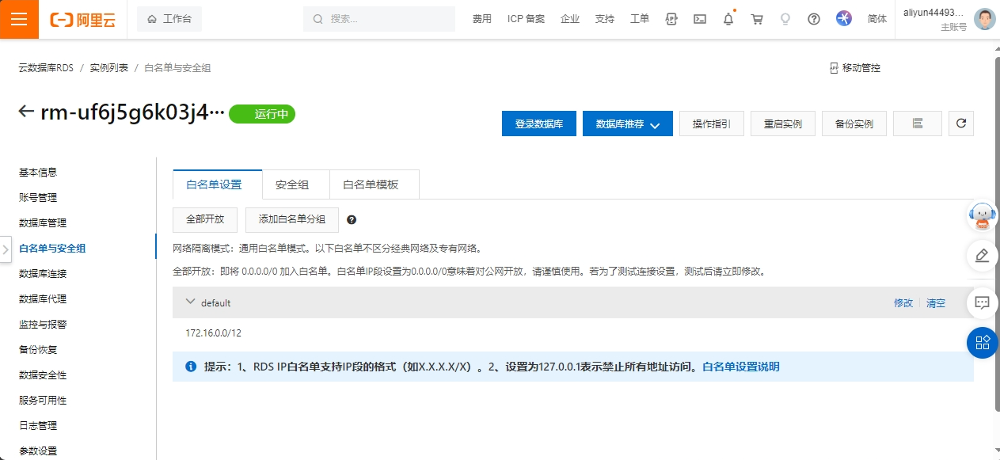

#### 查看私有IP

设置完成后，会生成一个内网地址。

云数据库RDS > 实例列表 >  > 基本信息 > 网络类型 > 查看裂解详情

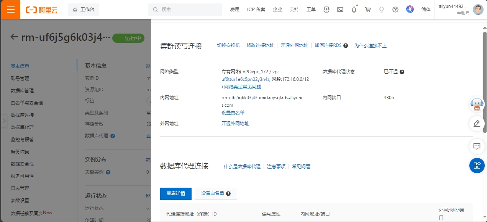

#### 登录验证

使用内网实例登录RDS验证是否配置成功。

云服务器 > 实例与镜像 > 实例 > 选择对应实例 > 远程连接

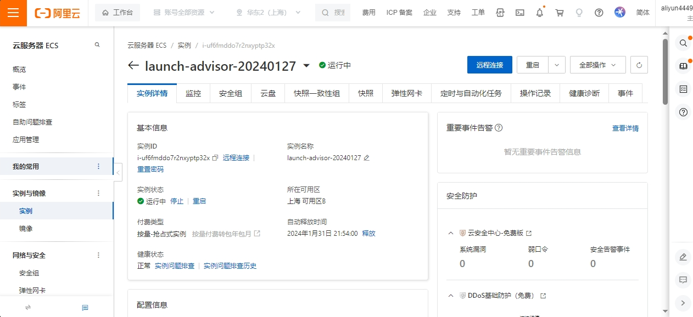

选择Workbench页面登录

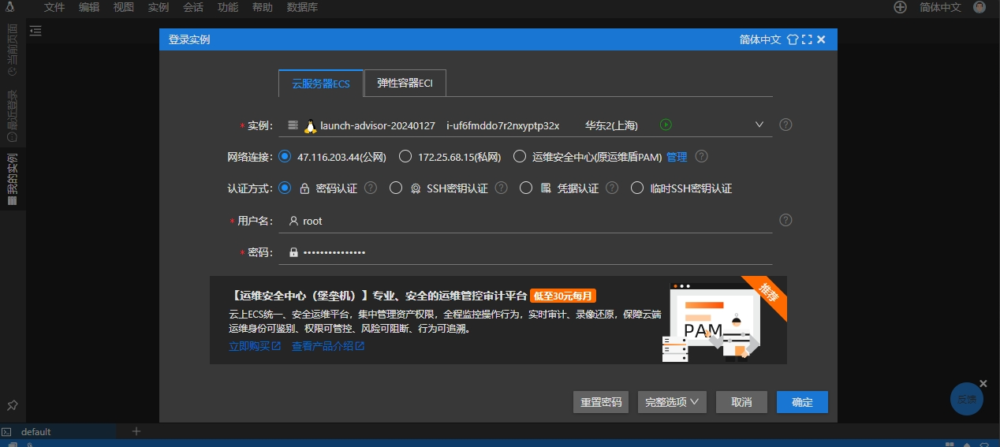

登录后，使用RDS内网地址登录RDS

默认的ECS没有mysql连接工具，需要先安装

```
dnf install -y mariadb
```

使用mariadb登录RDS，能正常登录，代表配置没问题。

### 备份管理

开启备份功能，需要先授权DBS服务关联角色，可以开启也可以不开。

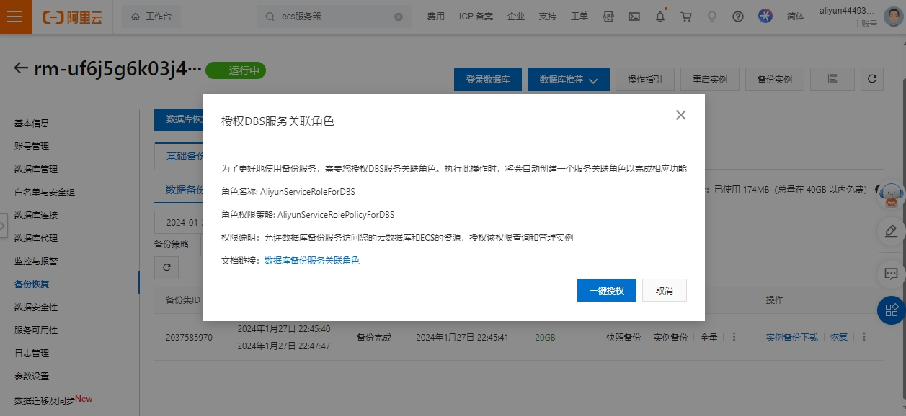

#### 备份关键概念

* 基础备份列表：分为数据备份和日志备份
  * 数据备份：备份数据库数据
  * 日志备份：备份数据库操作日志，文件格式类型是Binlog
* 备份策略：有增量，全量，物理，快照等备份策略。
* 备份列表下载：可以按照时间或者备份集下载创建的备份文件。

#### 备份实例

云数据库RDS > 实例列表 > 选择对应实例 > 备份恢复 > 备份数据库

手动备份的方式是快照备份，实例级别，就是备份整个实例，而且因为是快照，源实例删除后，快照备份会失效。

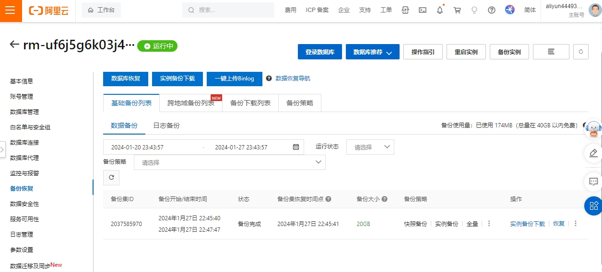

备份数据库需要点时间，下图是备份完成

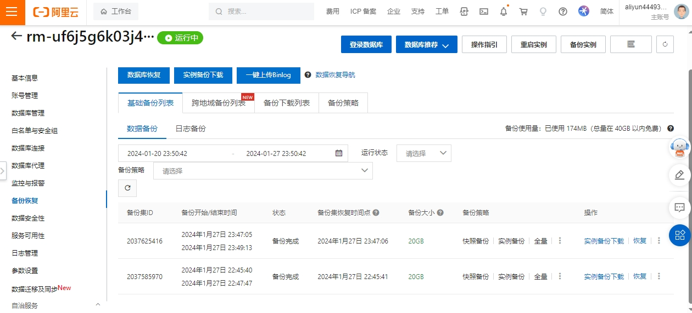

#### 恢复实例

数据库恢复服务是需要购买的，此处不做讲解。点击恢复后，会跳转如下界面。

如果需要恢复的话，选择按量付费就行，创建一个相同规格实例，按小时收费，恢复完删除就行。

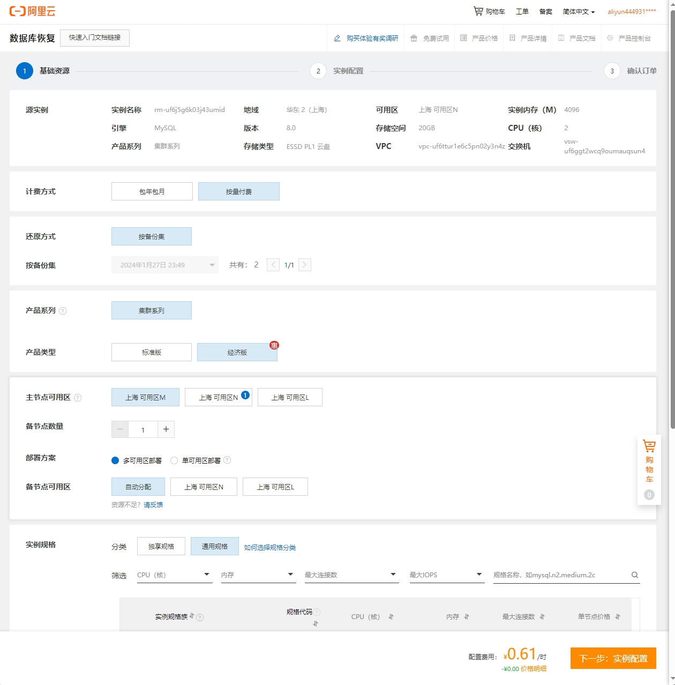

## RDS优化

### 慢SQL

阿里云RDS自带慢SQL分析工具


