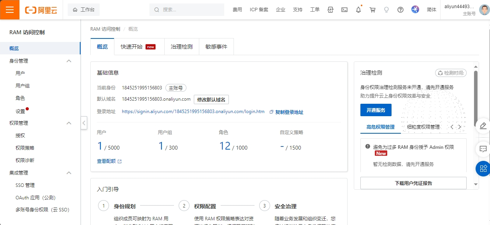
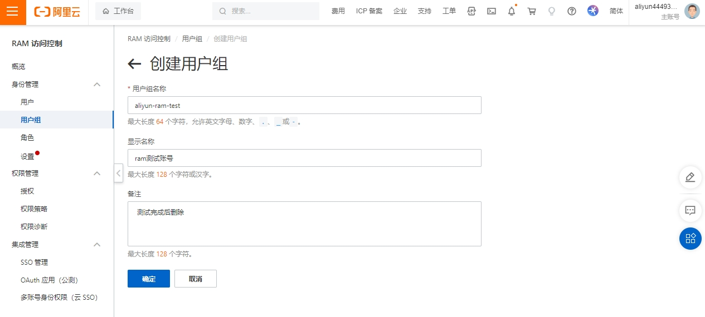
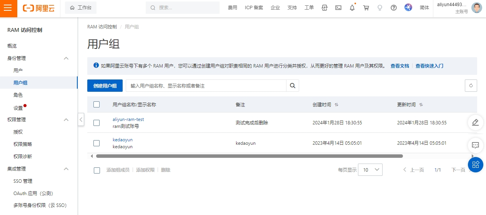
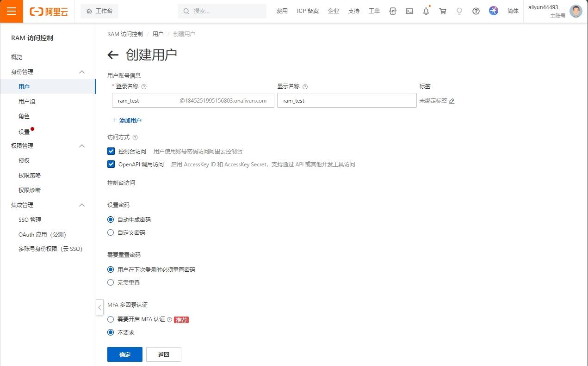
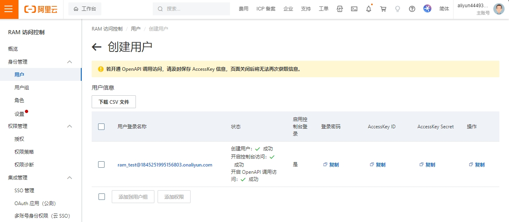
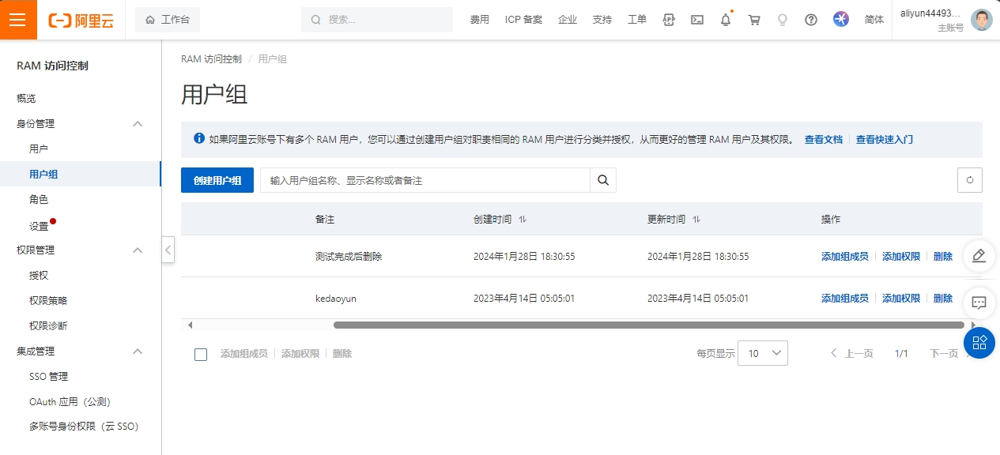
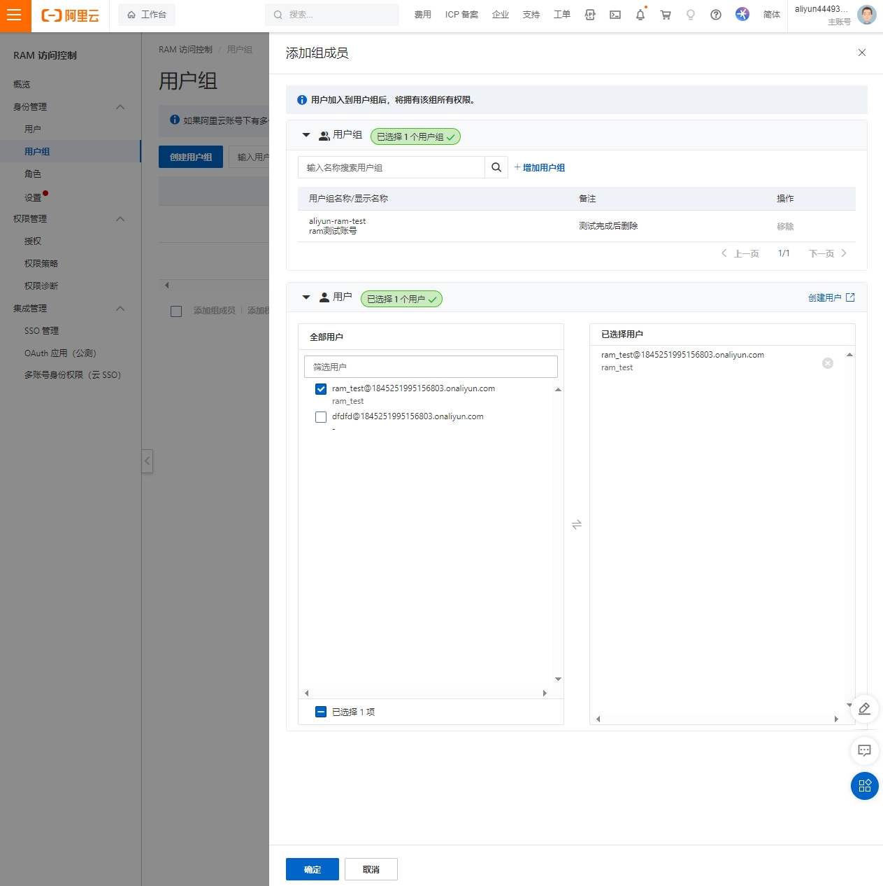
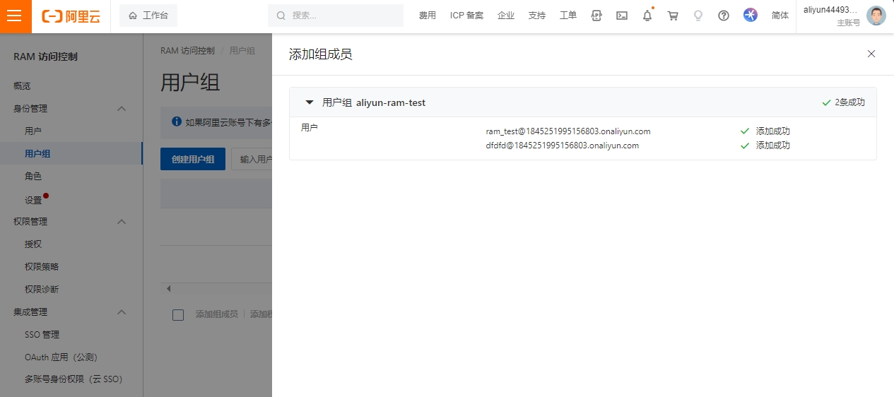
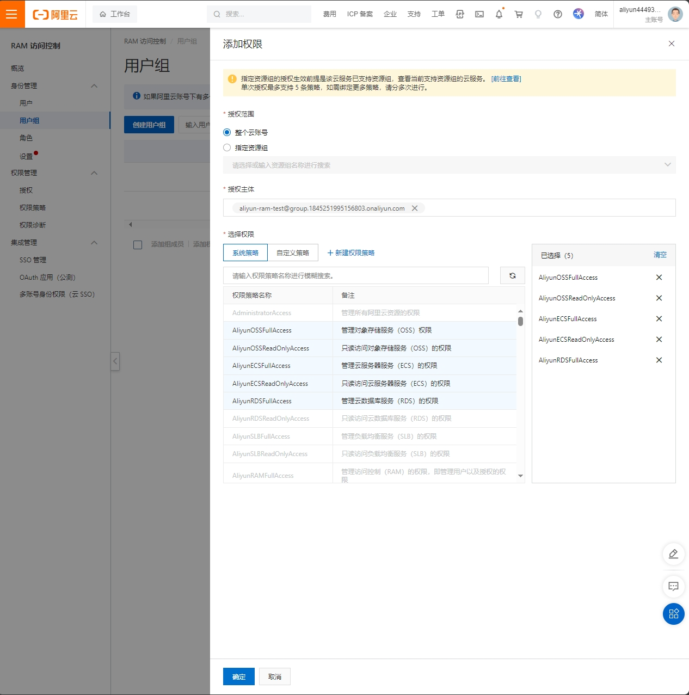

## RAM简介

功能：访问控制，类似与linux sudo权限，或者可以理解为阿里云子账号。

应用场景：

* 刚刚入职的运维人员
* 创建出来给开发使用（程序代码调用 ram的API）

## RAM分类

* 用户
* 用户组：方便批量管理权限

搜索栏搜索RAM

## 管理RAM

### 创建组

RAM访问控制 > 身份管理 > 用户组 > 创建用户组

创建成功

### 创建用户

RAM访问控制 > 身份管理 > 用户 > 创建用户，可以同时创建多个用户

主要参数：

* 登录名称：用于账号登录
* 访问方式：
  * 控制台访问：用户使用账号密码访问阿里云控制台
  * OpenAPI调用访问：启用 AccessKey ID 和 AccessKey Secret，支持通过 API 或其他开发工具访问

创建成功

#### 登录验证

使用上面创建的账号登录阿里云，测试是否能够正常登录。

### 添加成员和权限

RAM访问控制 > 用户组 > 组的操作列表有添加成员和权限按钮

#### 添加成员

在用户列表勾选用户即可

添加成功

#### 添加权限

* 添加权限是为组赋予权限，组内所有人都能享有权限。
* 单次授权最多支持 5 条策略，如需绑定更多策略，需要分多次进行。

主要参数：

* 授权范围：分为云账号和资源组。
* 授权主体：需要赋予权限的账号
* 选择权限：系统策略和自定义策略，一般用系统策略就行。然后选择对应的单个权限条目。

