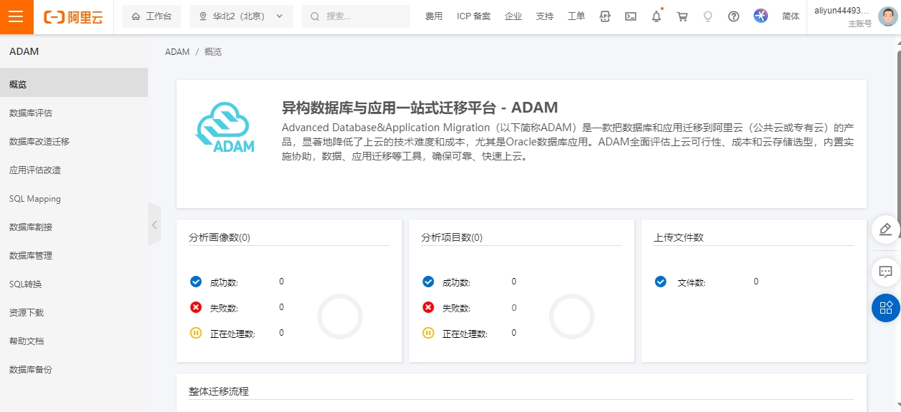
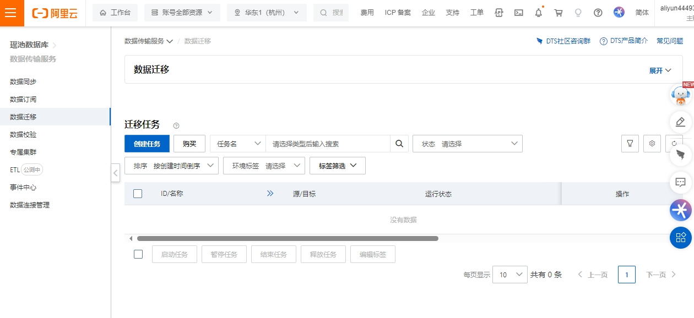
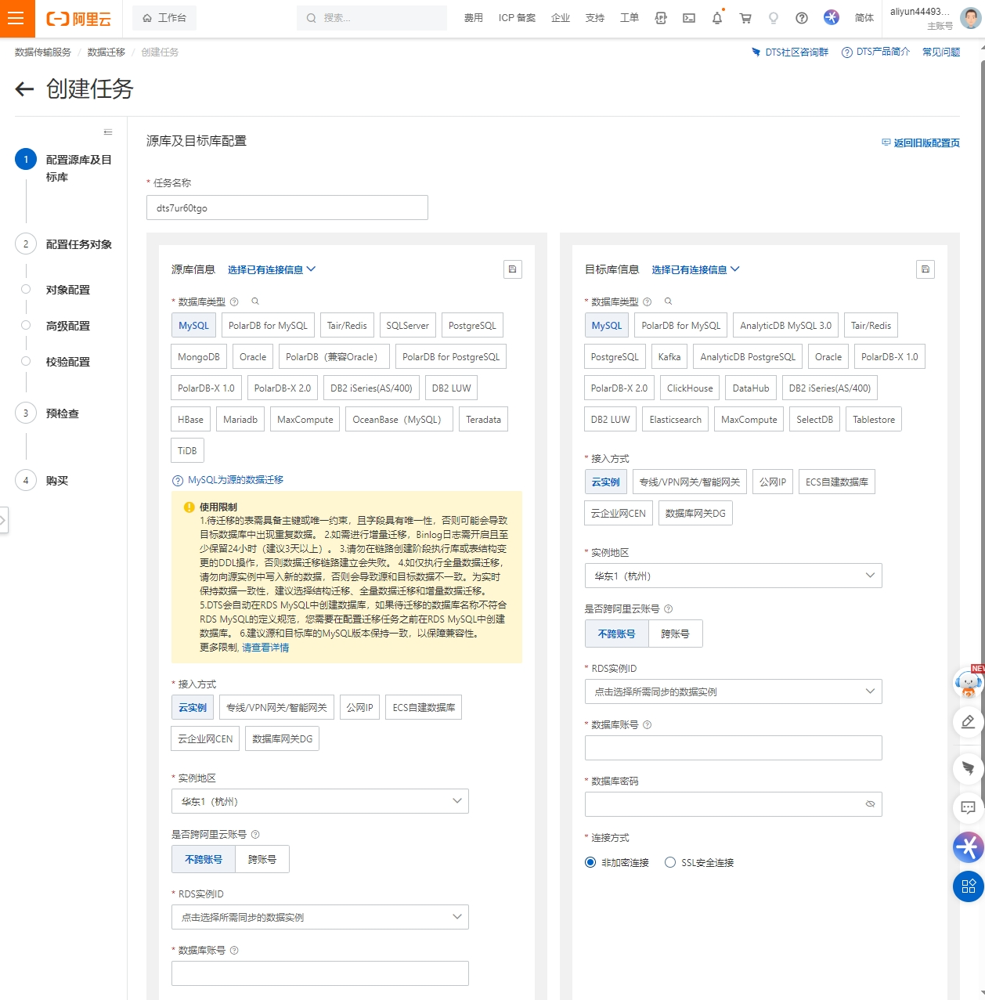

## 迁移工具DTS

### 简介

Advanced Database&Application Migration（以下简称ADAM）是一款把数据库和应用迁移到阿里云（公共云或专有云）的产品，显著地降低了上云的技术难度和成本，尤其是Oracle数据库应用。ADAM全面评估上云可行性、成本和云存储选型，内置实施协助，数据、应用迁移等工具，确保可靠、快速上云。

主要用于数据库迁移

## 具体操作

瑶池数据库 > 数据传输服务 > 数据迁移 > 创建任务

填写具体的数据库信息

* 源库信息
  * 数据库类型
  * 接入方式
  * 实例地区
  * RDS实例
  * 数据库账号密码
  * 连接方式
    * 非加密连接
    * SSL安全连接
* 目标库信息
  * 数据库类型
  * 接入方式
  * 实例地区
  * RDS实例
  * 数据库账号密码
  * 连接方式
    * 非加密连接
    * SSL安全连接

