## ESS弹性伸缩简介

阿里云的ESS（Elastic Scaling Service）是一项用于实现弹性伸缩的服务。ESS 允许用户根据应用程序的负载情况，自动增加或减少计算资源，以满足不同时间和工作负载的需求。这有助于提高应用程序的可用性和性能，并同时最大程度地降低资源成本。

## ESS架构

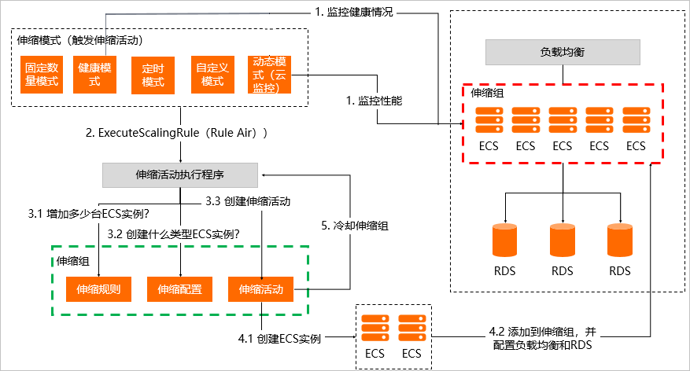

## 使用流程

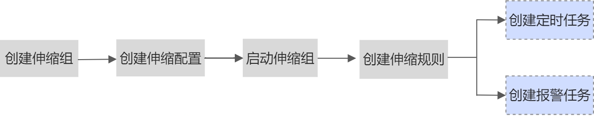

### 环境准备

* 准备负载均衡SLB
  * 需要创建负载均衡，将服务器组加入负载均衡列表
* 2台ecs，运行nginx并设置开机自启

#### 创建SLB

创建一个负载均衡，配置监听2台ecs的服务器组

#### 配置OS镜像

云服务器ECS > 实例与镜像 > 镜像 > 创建镜像 > 创建自定义镜像

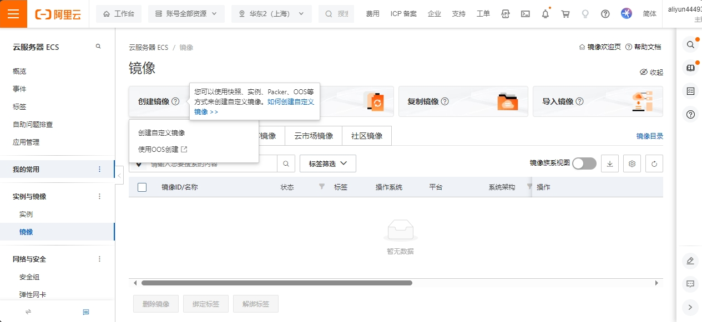

主要参数：

* 创建方式：实例和快照

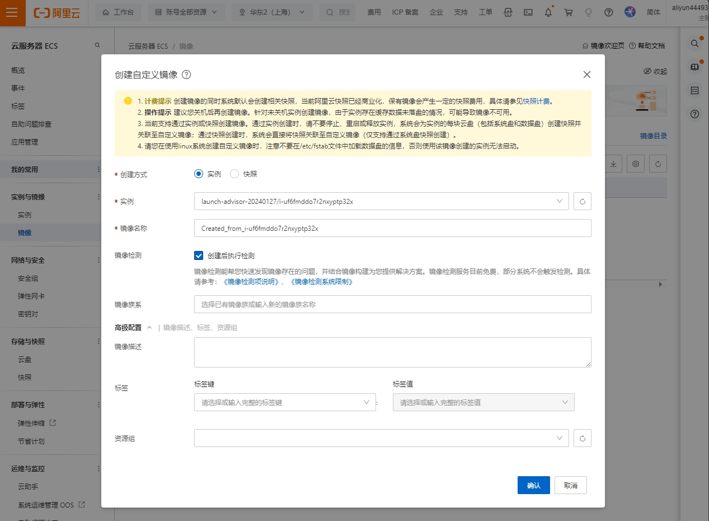

镜像创建需要一点时间

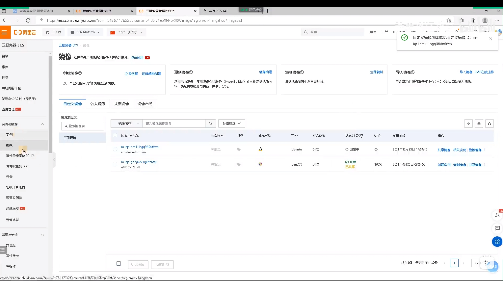

#### 创建伸缩组

弹性伸缩 > 伸缩组管理 > 创建伸缩组

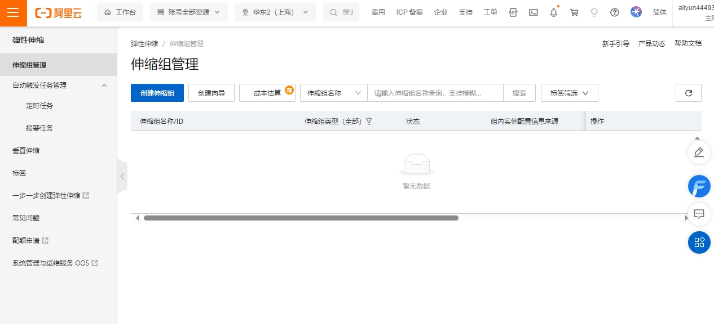

主要参数：

* 伸缩组名称：多个组便于区分
* 伸缩组类型：ECS
* 组内实例配置信息来源：加的机器的配置，

  * 选择已有实例，添加的配置和现有实例一样
* 启动模板：支持从已有实例或者新建实例中选择。这里使用已有实例。
* 实例移除策略：流量高峰通过后，需要关闭实例，关闭实例的规则，
* 开启伸缩组保护：开启伸缩组删除保护后，该伸缩组不能通过API或者控制台直接删除，必须将删除保护关闭后，才能删除。
* 默认冷却时间：伸缩后需要等待多久才能再次伸缩
* 网络类型：专有类型
* 交换机：选择同一网络下的交换机，可以选择多个交换机
* 实列回收模式：回收的主机是释放还是停机回收
* 扩缩容策略：加机器的策略

  * **优先级策略**
    * 根据您定义的虚拟交换机扩缩容。当优先级较高的虚拟交换机所在可用区无法创建实例时，自动使用下一优先级的虚拟交换机创建实例。
  * **均衡分布策略**
    * 在伸缩组指定的多可用区（即指定多个专有网络交换机）之间均匀分配ECS实例。如果由于库存不足等原因可用区之间变得不平衡，您可以进行再均衡操作来平衡资源的可用区分步。
    * 只有设置了多个专有网络交换机时该策略才能生效
  * **成本优化策略**
    * 按vCPU单价从低到高进行尝试创建，当伸缩配置设置了抢占式计费方式的多实例规格时，优先创建对应抢占式计费实例，当抢占式计费实例规格由于库存等原因都无法创建时，自动尝试以按量付费的方式创建。
  * **自定义组合策略**
    * 使用组合方式自定义容量分布策略。您可使用该策略调整伸缩组内按量实例和抢占式实例的比例，可用区间的容量均衡，实例规格的选择。
* 添加已有实例：添加一些已创建的实例供伸缩
* 关联传统型负载均衡CLB（原SLB）：伸缩添加的实例加入的负载均衡组
* 关联RDS数据库实例：

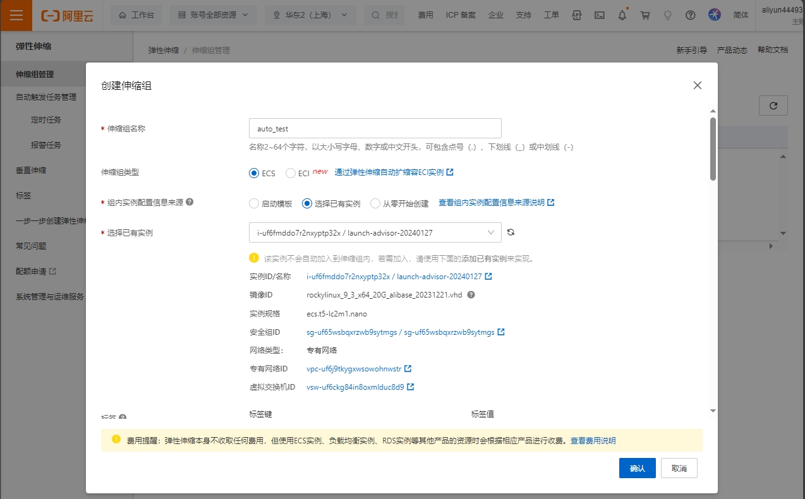

创建成功

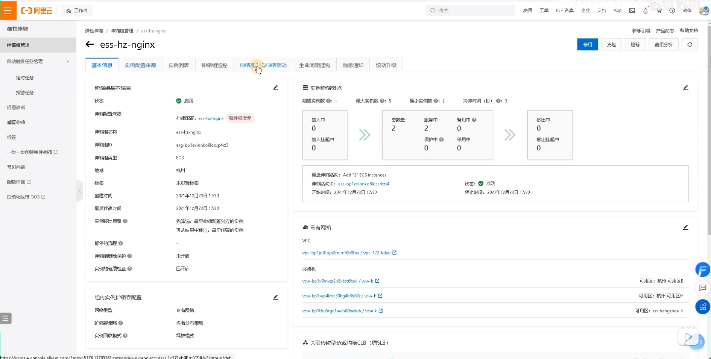

#### 添加伸缩规则

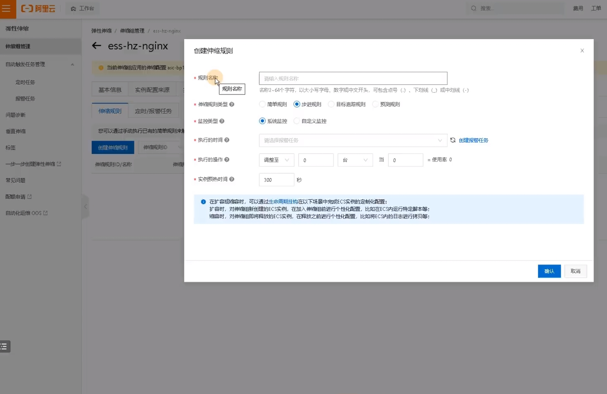

修改ESS的镜像

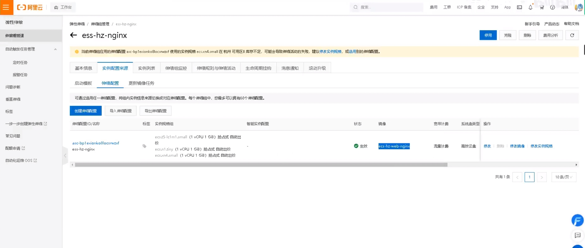

#### 创建报警任务

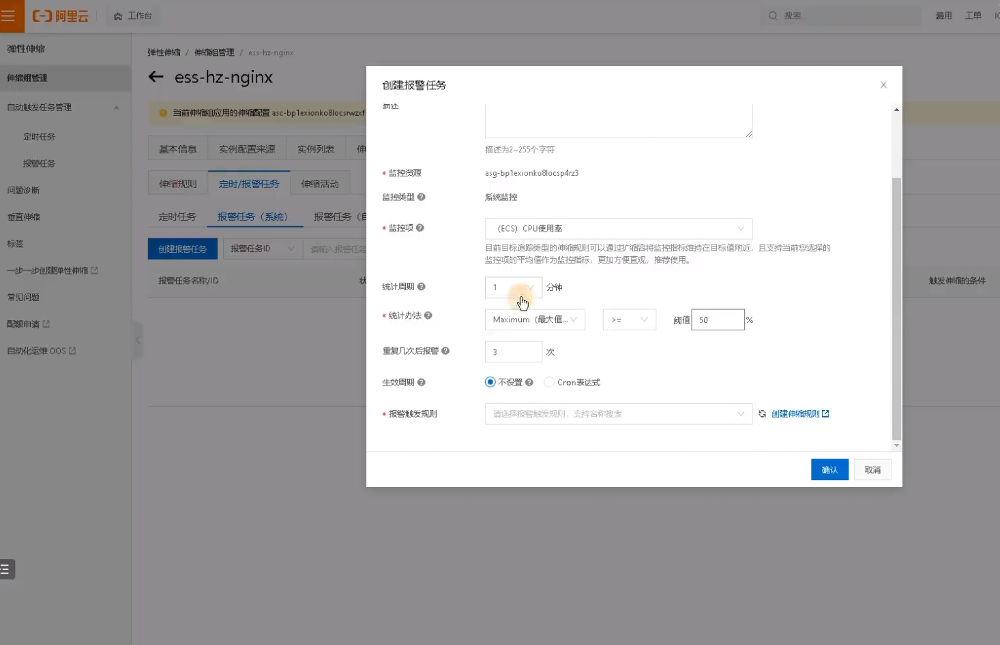

可以通过伸缩规则和报警结合使用，达到自动化伸缩，类似zabbix监控报警后，执行固定的脚本，而伸缩是执行伸缩规则。
