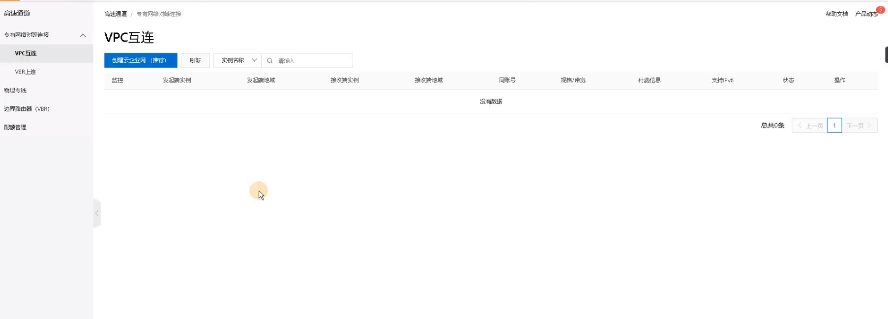
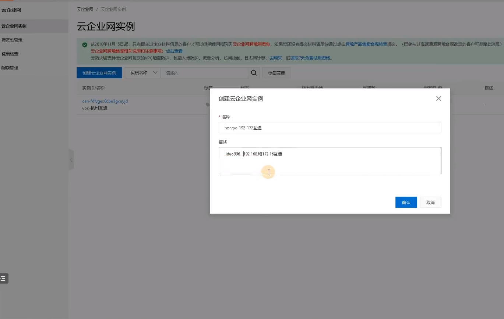
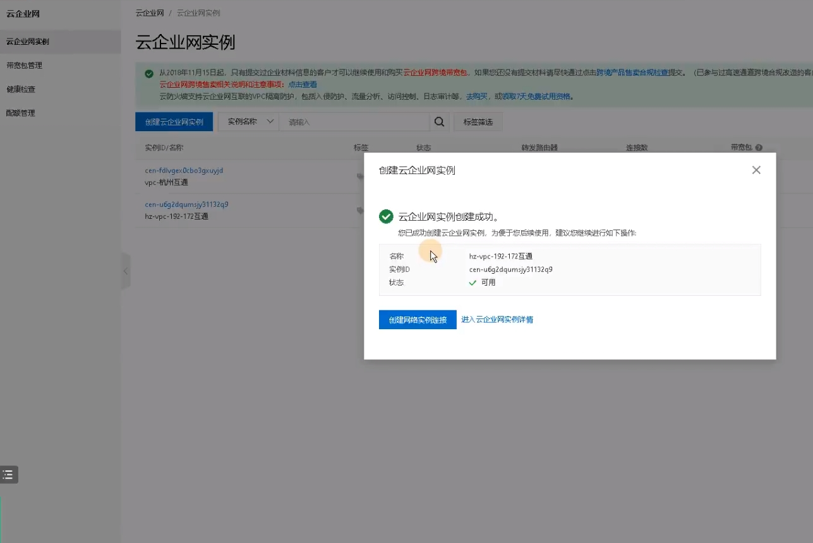
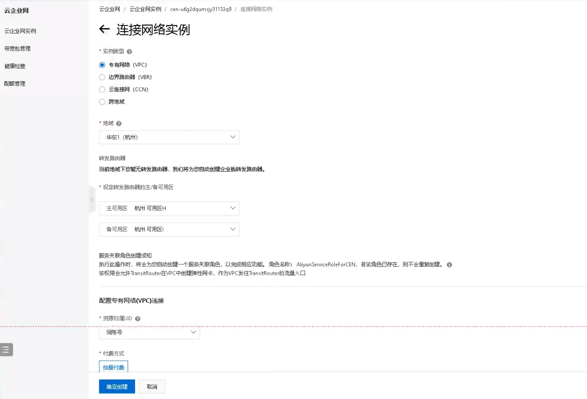

## 简介

CEN 允许用户将不同地域、不同帐户下的阿里云VPC（Virtual Private Cloud）实例、本地数据中心、支持云接入的第三方云服务（如AWS、Azure等）等云资源通过一个全球化的私有网络进行连接，实现跨地域、跨账户的云资源互通。

## CEN 的关键特点和功能

1. **全球化网络连接：**
   * CEN 提供了一个全球化的网络服务，允许用户在不同的地理区域和帐户之间构建专有网络。
   * 用户可以通过 CEN 轻松实现多地域的云资源互联，提高网络灵活性和可用性。
2. **动态路由：**
   * CEN 使用 BGP（Border Gateway Protocol）动态路由协议，实现了自动路由学习和动态路由更新。
   * 当用户添加或删除云资源时，CEN 可以自动更新路由表，确保网络拓扑的实时性。
3. **带宽弹性：**
   * CEN 允许用户在连接 VPC 时设置带宽，并根据实际需求随时调整带宽大小。
   * 这样用户可以根据业务需求调整带宽，以适应不同流量的需求。
4. **跨账户互通：**
   * CEN 允许用户在不同阿里云账户之间建立私有网络连接，方便不同业务单元之间的资源互通。
   * 这样用户可以实现跨账户的资源共享和协同工作。
5. **安全性和隔离：**
   * CEN 提供了安全的网络隔离机制，确保连接在 CEN 中的 VPC 和本地数据中心之间的通信是安全可靠的。
   * 用户可以通过网络 ACL、安全组等功能对连接进行更细粒度的访问控制。
6. **支持云接入：**
   * CEN 支持连接到其他云服务提供商（如AWS、Azure等）的 VPC，实现多云环境下的资源互通。
7. **可视化管理：**
   * CEN 提供了直观的控制台界面，帮助用户轻松配置、管理和监控网络连接。

## 高速通道使用

高速通道 > 专有网络对等连接 > VPC互联 > 创建云企业网

* VPC互联是云服务器互联
* VBR上连是物理机房和云服务互联

主要步骤：

* 创建云企业网实例
* 创建转发路由器
* 创建网络实例连接
* 配置跨地域宽带包

### 创建云企业网实例

创建成功

### 创建转发路由器

