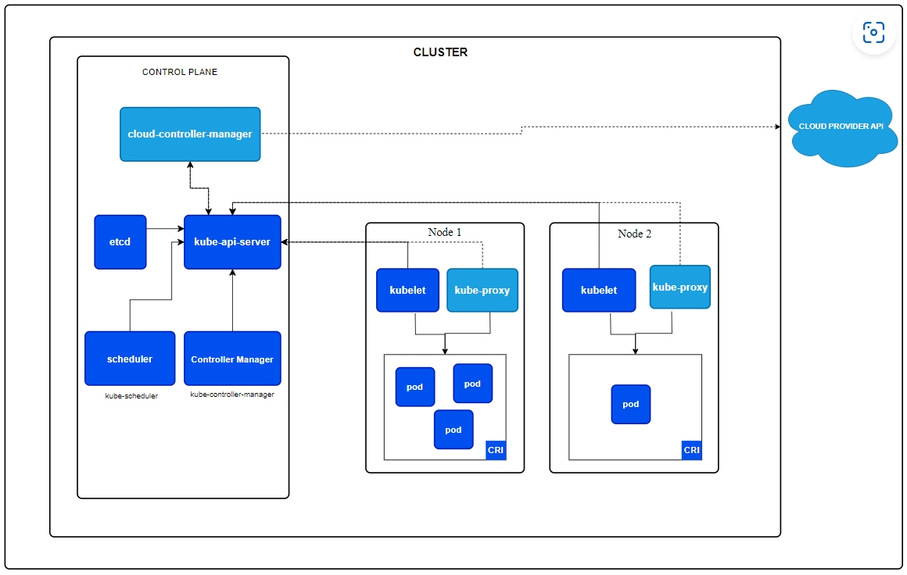

> k8s主要内容来自k8s官网（kubernetes.io）黑马k8s 和 尚硅谷k8s 教学视频：https://www.bilibili.com/video/BV13Q4y1C7hS/
>
> https://www.bilibili.com/video/BV1Qv41167ck
>
> 有兴趣学习k8s的同学可以直接前往观看。

> 提示：
>
> k8s官网有中文文档

## kubernetes 基本介绍

Kubernetes（通常缩写为K8s）是一个用于自动化容器化应用程序部署、扩展和管理的开源平台。它是由Google设计并开源，现在由Cloud Native Computing Foundation（CNCF）维护。Kubernetes提供了一个可移植、可扩展且易于管理的平台，可以用来运行容器化的应用程序。

## kubernetes 基本概念

1. **容器化：** Kubernetes主要用于管理容器化的应用程序。容器是一种轻量级、可移植且自包含的软件单元，包括应用程序及其所有依赖项。Kubernetes支持多种容器运行时，最常用的是Docker。
2. **集群：** Kubernetes通过将多个计算机节点组成一个集群，实现对应用程序的高可用性和可伸缩性。集群中的节点可以是物理机器或虚拟机。
3. **Master和Node：** Kubernetes集群由两类节点组成：Master节点和工作节点（Node）。Master节点负责整个集群的管理和控制，而工作节点用于运行应用程序容器。
4. **Pod：** Pod是Kubernetes中最小的可调度和可部署的单元。它是一个或多个相关容器的组合，共享相同的网络命名空间和存储卷。Pod内的容器可以协同工作以支持应用程序。
5. **控制器：** 控制器是Kubernetes中用于确保系统中运行的应用程序与期望状态一致的组件。常见的控制器包括Deployment、ReplicaSet和StatefulSet。
6. **服务：** Kubernetes服务是一种抽象，用于定义一组Pod及其访问策略。通过服务，可以将应用程序从其底层实现中解耦，并提供稳定的网络端点。
7. **命名空间：** 命名空间是一种用于将Kubernetes集群内部划分为多个虚拟集群的机制。它允许在同一集群中运行多个项目或团队，每个项目或团队都有自己的命名空间。
8. **存储卷：** 存储卷是用于在Pod之间共享数据的抽象。它可以是本地存储、网络存储或其他外部存储系统。

## kubernetes 基本特新

1. **自动装箱：** Kubernetes允许自动部署应用容器，基于容器对应用运行环境的资源配置要求，简化了应用的部署过程。
2. **自我修复（自愈能力）：** Kubernetes具有自我修复机制，当容器失败时会进行重启，节点有问题时会重新部署和重新调度容器，还能够关闭未通过监控检查的容器，直到其正常运行。
3. **水平扩展：** Kubernetes提供了简单的命令、用户UI界面以及基于资源使用情况的方式，允许用户对应用容器进行规模扩大或规模剪裁，以应对不同负载情况。
4. **服务发现：** Kubernetes内建了服务发现和负载均衡的能力，用户无需使用额外的服务发现机制，便能够实现服务的发现和负载均衡。
5. **滚动更新：** Kubernetes支持对应用容器进行滚动更新，根据应用变化可以进行一次性或批量式的更新，确保平滑的应用升级。
6. **版本回退：** Kubernetes允许根据应用部署情况，对应用容器进行历史版本的即时回退，确保系统稳定性。
7. **密钥和配置管理：** Kubernetes支持在不需要重新构建镜像的情况下，部署和更新密钥和应用配置，实现类似热部署的效果。
8. **存储编排：** Kubernetes提供存储编排，自动实现存储系统挂载及应用，特别适用于有状态应用的数据持久化，支持本地目录、网络存储和公共云存储服务。
9. **批处理：** Kubernetes提供了支持一次性任务和定时任务的批处理能力，满足批量数据处理和分析的场景。

## 应用部署架构分类

无中心节点架构的例子包括分布式文件系统（如GlusterFS），而有中心节点架构的例子包括分布式文件系统（如HDFS）和容器编排系统（如Kubernetes）。

1. **无中心节点架构:**
   * **GlusterFS:** GlusterFS是一个开源的分布式文件系统，采用无中心节点的架构。它通过将存储空间组合在一起，形成一个大的、统一的文件系统，提供可扩展性和高可用性。每个节点都可以独立管理文件和目录，并且数据可以分布存储在整个集群中。
2. **有中心节点架构:**
   * **HDFS (Hadoop Distributed File System):** HDFS是Apache Hadoop生态系统中的分布式文件系统，采用有中心节点的架构。它的中心节点包括NameNode（命名节点）和多个DataNode（数据节点）。NameNode负责存储文件系统的元数据，而DataNode存储实际的数据块。HDFS提供高容错性和可伸缩性，适用于大规模数据存储和处理。
   * **Kubernetes (K8S):** Kubernetes是一个容器编排和管理系统，它采用有中心节点的架构。Kubernetes的中心节点是Master节点，包括API Server、Scheduler、Controller Manager和etcd（分布式键值存储）。工作节点(Node)上运行着应用容器。Master节点负责集群管理、调度和控制，而Node节点负责实际运行应用容器。Kubernetes提供了自动化部署、扩展、管理和维护容器化应用的功能。

## k8s 集群架构

Kubernetes（K8s）的集群架构主要分为Master节点和Node节点。

### Master节点：

Master Node 由 API Server、Scheduler、ClusterState Store（ETCD 数据库）和Controller MangerServer 所组成。

1. **API Server（API服务器）：** 提供Kubernetes集群的API入口，负责接收和处理用户、管理员以及其他组件的请求，并将请求转发给合适的组件进行处理。
2. **etcd：** 一个分布式键值存储系统，用于存储Kubernetes集群的所有配置信息、状态以及元数据。etcd是Kubernetes的数据存储后端，保证了集群的一致性和可靠性。
3. **Controller Manager（控制器管理器）：** 负责运行控制器，这些控制器负责监视集群的状态，并根据需要进行调整，确保实际状态与期望状态一致。常见的控制器包括Replication Controller、StatefulSet等。
4. **Scheduler（调度器）：** 监听新创建的Pod，并根据集群中节点的资源状况和Pod的调度策略，将Pod分配到合适的Node上运行。

### Node节点：

Worker Node 包含 kubelet、kube proxy 和 ContainerRuntime。

1. **Kubelet：** 在每个Node节点上运行的代理，负责与Master节点通信，并确保在Node上启动、停止和维护容器的状态。
2. **Container Runtime（容器运行时）：** 负责实际运行容器的软件，常见的容器运行时包括Docker、containerd等。
3. **Kube Proxy：** 负责维护节点上的网络规则，实现Kubernetes服务的负载均衡，以及将服务请求转发到合适的Pod。

### 其他组件：

1. **Pod：** 是Kubernetes中最小的可调度单元，包含一个或多个容器。Pod由Kubelet在Node上创建和管理。
2. **Controller**：控制器，通过它来实现对pod的管理，比如启动pod、停止pod、伸缩pod的数量等等。
3. **Service：** 提供了一种稳定的网络入口，使得应用程序的不同部分能够相互通信，同时隐藏了底层Pod的变化。
4. **Label**：标签，用于对pod进行分类，同一类pod会拥有相同的标签
5. **NameSpace**：命名空间，用来隔离pod的运行环境。
6. **Volume：** 用于在Pod之间共享和持久化数据的抽象。Volume可以挂载到Pod中的容器，实现数据的持久化和共享。
7. **Ingress：** 允许外部流量进入集群，并提供对服务的路由、负载均衡和SSL终止等功能。
8. **ConfigMap和Secret：** 用于存储应用程序的配置信息和敏感信息，使得应用程序能够更加灵活和安全。

## Reference Links：

https://kubernetes.io/zh-cn
