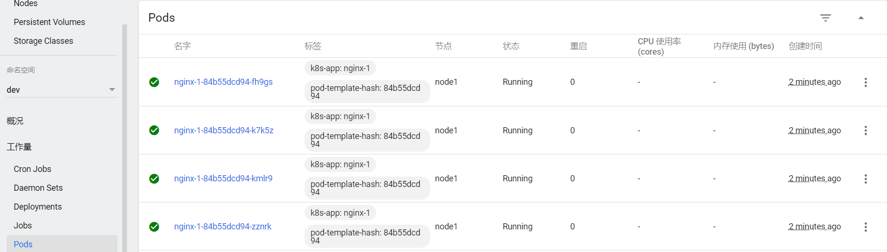
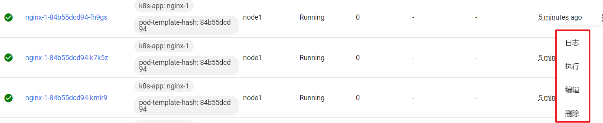

之前在kubernetes中完成的所有操作都是通过命令行工具kubectl完成的。其实，为了提供更丰富的用户体验，kubernetes还开发了一个基于web的用户界面（Dashboard）。用户可以使用Dashboard部署容器化的应用，还可以监控应用的状态，执行故障排查以及管理kubernetes中各种资源。

## 部署Dashboard

1. 下载yaml，并运行Dashboard

   ```
   # 下载yaml
   [root@master ~]# wget  https://raw.githubusercontent.com/kubernetes/dashboard/v2.0.0/aio/deploy/recommended.yaml

   # 修改kubernetes-dashboard的Service类型
   kind: Service
   apiVersion: v1
   metadata:
     labels:
       k8s-app: kubernetes-dashboard
     name: kubernetes-dashboard
     namespace: kubernetes-dashboard
   spec:
     type: NodePort  # 新增
     ports:
       - port: 443
         targetPort: 8443
         nodePort: 30009  # 新增
     selector:
       k8s-app: kubernetes-dashboard

   # 部署
   [root@master ~]# kubectl create -f recommended.yaml

   # 查看namespace下的kubernetes-dashboard下的资源
   [root@master ~]# kubectl get pod,svc -n kubernetes-dashboard
   NAME                                            READY   STATUS    RESTARTS   AGE
   pod/dashboard-metrics-scraper-c79c65bb7-zwfvw   1/1     Running   0          111s
   pod/kubernetes-dashboard-56484d4c5-z95z5        1/1     Running   0          111s

   NAME                               TYPE       CLUSTER-IP      EXTERNAL-IP  PORT(S)         AGE
   service/dashboard-metrics-scraper  ClusterIP  10.96.89.218    <none>       8000/TCP        111s
   service/kubernetes-dashboard       NodePort   10.104.178.171  <none>       443:30009/TCP   111s
   ```
2. 创建访问账户，获取token

   ```
   # 创建账号
   [root@master-1 ~]# kubectl create serviceaccount dashboard-admin -n kubernetes-dashboard

   # 授权
   [root@master-1 ~]# kubectl create clusterrolebinding dashboard-admin-rb --clusterrole=cluster-admin --serviceaccount=kubernetes-dashboard:dashboard-admin

   # 获取账号token
   [root@master ~]#  kubectl get secrets -n kubernetes-dashboard | grep dashboard-admin
   dashboard-admin-token-xbqhh        kubernetes.io/service-account-token   3      2m35s

   [root@master ~]# kubectl describe secrets dashboard-admin-token-xbqhh -n kubernetes-dashboard
   Name:         dashboard-admin-token-xbqhh
   Namespace:    kubernetes-dashboard
   Labels:       <none>
   Annotations:  kubernetes.io/service-account.name: dashboard-admin
                 kubernetes.io/service-account.uid: 95d84d80-be7a-4d10-a2e0-68f90222d039

   Type:  kubernetes.io/service-account-token

   Data
   ====
   namespace:  20 bytes
   token:      eyJhbGciOiJSUzI1NiIsImtpZCI6ImJrYkF4bW5XcDhWcmNGUGJtek5NODFuSXl1aWptMmU2M3o4LTY5a2FKS2cifQ.eyJpc3MiOiJrdWJlcm5ldGVzL3NlcnZpY2VhY2NvdW50Iiwia3ViZXJuZXRlcy5pby9zZXJ2aWNlYWNjb3VudC9uYW1lc3BhY2UiOiJrdWJlcm5ldGVzLWRhc2hib2FyZCIsImt1YmVybmV0ZXMuaW8vc2VydmljZWFjY291bnQvc2VjcmV0Lm5hbWUiOiJkYXNoYm9hcmQtYWRtaW4tdG9rZW4teGJxaGgiLCJrdWJlcm5ldGVzLmlvL3NlcnZpY2VhY2NvdW50L3NlcnZpY2UtYWNjb3VudC5uYW1lIjoiZGFzaGJvYXJkLWFkbWluIiwia3ViZXJuZXRlcy5pby9zZXJ2aWNlYWNjb3VudC9zZXJ2aWNlLWFjY291bnQudWlkIjoiOTVkODRkODAtYmU3YS00ZDEwLWEyZTAtNjhmOTAyMjJkMDM5Iiwic3ViIjoic3lzdGVtOnNlcnZpY2VhY2NvdW50Omt1YmVybmV0ZXMtZGFzaGJvYXJkOmRhc2hib2FyZC1hZG1pbiJ9.NAl7e8ZfWWdDoPxkqzJzTB46sK9E8iuJYnUI9vnBaY3Jts7T1g1msjsBnbxzQSYgAG--cV0WYxjndzJY_UWCwaGPrQrt_GunxmOK9AUnzURqm55GR2RXIZtjsWVP2EBatsDgHRmuUbQvTFOvdJB4x3nXcYLN2opAaMqg3rnU2rr-A8zCrIuX_eca12wIp_QiuP3SF-tzpdLpsyRfegTJZl6YnSGyaVkC9id-cxZRb307qdCfXPfCHR_2rt5FVfxARgg_C0e3eFHaaYQO7CitxsnIoIXpOFNAR8aUrmopJyODQIPqBWUehb7FhlU1DCduHnIIXVC_UICZ-MKYewBDLw
   ca.crt:     1025 bytes
   ```
3. 通过浏览器访问Dashboard的UI

   在登录页面上输入上面的token

   

   出现下面的页面代表成功

   

## 使用DashBoard

本章节以Deployment为例演示DashBoard的使用

### 查看

选择指定的命名空间 `dev`，然后点击 `Deployments`，查看dev空间下的所有deployment


### 扩缩容

在 `Deployment`上点击 `规模`，然后指定 `目标副本数量`，点击确定


### 编辑

在 `Deployment`上点击 `编辑`，然后修改 `yaml文件`，点击确定


### 查看Pod

点击 `Pods`, 查看pods列表



### 操作Pod

选中某个Pod，可以对其执行日志（logs）、进入执行（exec）、编辑、删除操作



Dashboard提供了kubectl的绝大部分功能，这里不再一一演示
