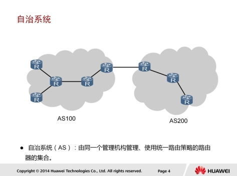
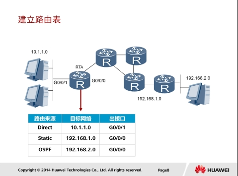
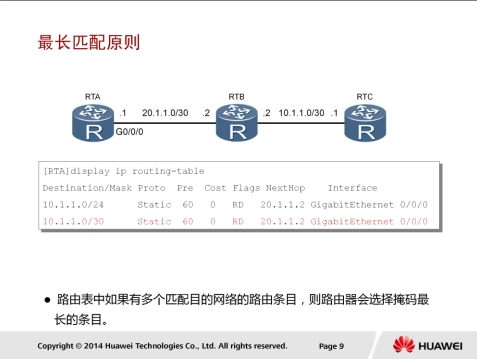
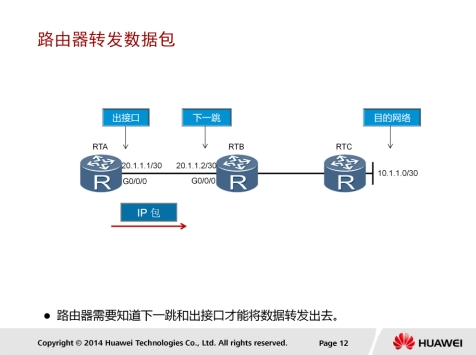
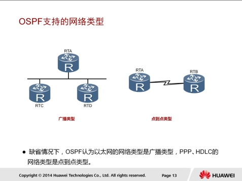

## IP路由基础

### 自治系统



一般地我们可以把一个企业网络认为是一个自治系统AS（Autonomous System）。根据RFC1030的定义，自治系统是由一个单一实体管辖的网络，这个实体可以是一个互联网服务提供商，或一个大型组织机构。自治系统内部遵循一个单一且明确的路由策略。最初，自治系统内部只考虑运行单个路由协议；然而，随着网络的发展，一个自治系统内现在也可以支持同时运行多种路由协议。

### LAN和广播域


一个AS通常由多个不同的局域网组成。以企业网络为例，各个部门可以属于不同的局域网，或者各个分支机构和总部也可以属于不同的局域网。

局域网内的主机可以通过交换机来实现相互通信。不同局域网之间的主机要想相互通信，可以通过路由器来实现。路由器工作在网络层，隔离了广播域，并可以作为每个局域网的网关，发现到达目的网络的最优路径，最终实现报文在不同网络间的转发。

此例中，RTA和RTB把整个网络分成了三个不同的局域网，每个局域网为一个广播域。LAN1内部的主机直接可以通过交换机实现相互通信，LAN2内部的主机之间也是如此。但是，LAN1内部的主机不LAN2内部的主机之间则必须要通过路由器才能实现相互通信。

### 路由选择


路由器收到数据包后，会根据数据包中的目的IP地址选择一条最优的路径，并将数据包转发到下一个路由器，路径上最后的路由器负责将数据包送交目的主机。

数据包在网络上的传输就好像是体育运动中的接力赛一样，每一个路由器负责将数据包按照最优的路径向下一跳路由器进行转发，通过多个路由器一站一站的接力，最终将数据包通过最优路径转发到目的地。当然有时候由于实施了一些特别的路由策略，数据包通过的路径可能并不一定是最佳的。

路由器能够决定数据报文的转发路径。如果有多条路径可以到达目的地，则路由器会通过进行计算来决定最佳下一跳。计算的原则会随实际使用的路由协议不同而不同。

### IP路由表


路由器转发数据包的关键是路由表。

每个路由器中都保存着一张路由表，表中每条路由项都指明了数据包要到达某网络或某主机应通过路由器
的哪个物理接口发送，以及可到达该路径的哪个下一个路由器，或者不再经过别的路由器而直接可以到达目的地。

路由表中包含了下列关键项：

* 目的地址（Destination）：用来标识IP包的目的地址或目的网络。
* 网络掩码（Mask）：IP地址和网络掩码进
  行“逻辑不”便可得到相应的网段信息。网络掩码的另一个作用还表现在当路由表中有多条目的地址相同的路由信
  息时，路由器将选择其掩码最长的一项作为匹配项。
* 输出接口（Interface）：指明IP包将从该路由器的哪个接口转发出去。
* 下一跳IP地址（NextHop）：指明IP包所经由的下一个路由器的接口地址。
* 路由表中优先级、度量值等其他的几个字段我们将在以后进行介绍。

#### 建立路由表



根据来源的不同，路由表中的路由通常可分为以下三类：

1. 链路层协议发现的路由（也称为接口路由或直连路由）。
2. 由网络管理员手工配置的静态路由。
3. 动态路由协议发现的路由。

#### 最长匹配原则



路由器在转发数据时，需要选择路由表中的最优路由。当数据报文到达路由器时，路由器首先提取出报文的目的IP地址，然后查找路由表，将报文的目的IP地址不路由表中某表项的掩码字段做“不”操作，“不”操作后的结果跟路由表该表项的目的IP地址比较，相同则匹配上，否则就没有匹配上。 当不所有的路由表项都进行匹配后，路由器会选择一个掩码最长的匹配项。

如图所示，路由表中有两个表项到达目的网段10.1.1.0，下一跳地址都是20.1.1.2。如果要将报文转发至网段10.1.1.1，则10.1.1.0/30符合最长匹配原则。

#### 路由优先级


路由器可以通过多种不同协议学习到去往同一目的网络的路由，当这些路由都符合最长匹配原则时，必须决定哪个路由优先。

每个路由协议都有一个协议优先级（取值越小、优先级越高）。当有多个路由信息时，选择最高优先级的路由作为最佳路由。

如图所示，路由器通过两种路由协议学习到了网段10.1.1.0的路由。虽然RIP协议提供了一条看起来更加直连的路线，但是由于OSPF具有更高的优先级，因而成为优选路由，并被加入路由表中。

#### 路由度量


如果路由器无法用优先级来判断最优路由，则使用度量值（metric）来决定需要加入路由表的路由。

一些常用的度量值有：跳数，带宽，时延，代价，负载，可靠性等。

* 跳数是指到达目的地所通过的路由器数目。
* 带宽是指链路的容量，高速链路开销（度量值）较小。
* metric值越小，路由越优先；因此，图示中metric=1+1=2的路由是到达
* 目的地的最优路由，其表项可以在路由表中找到。

### 路由器转发数据包



路由器收到一个数据包后，会检查其目的IP地址，然后查找路由表。查找到匹配的路由表项之后，路由器会根据该表项所指示的出接口信息和下一跳信息将数据包转发出去。

## 静态路由基础


静态路由是指由管理员手动配置和维护的路由。静态路由配置简单，并且无需像动态路由那样占用路由器的CPU资源来计算和分析路由更新。

静态路由的缺点在于，当网络拓扑发生变化时，静态路由不会自动适应拓扑改变，而是需要管理员手动进行调整。
静态路由一般适用于结构简单的网络。

在复杂网络环境中，一般会使用动态路由协议来生成动态路由。不过，即使是在复杂网络环境中，合理地配置一些静态路由也可以改进网络的性能。

### 静态路由配置


```
ip route-static ip-address { mask | mask-length } interface-type interface-number [ nexthop-address ]
ip route-static 192.168.1.0 255.255.255.0 10.0.12.1
```

该命令用来配置静态路由。

* ip address指定了一个网络或者主机的目的地址。
* mask指定了一个子网掩码或者前缀长度。
* 如果使用了广播接口如以太网接口作为出接口，则必须要指定下一跳地址。
* 如果使用了串口作为出接口，则可以通过参数interface-type和interface-number（如Serial 1/0/0）来配置出接口，此时不必指定下一跳地址。

### 静态路由


静态路由可以应用在串行网络或以太网中，但静态路由在这两种网络中的配置有所不同。

在串行网络中配置静态路由时，可以只指定下一跳地址或只指定出接口。

以太网是广播类型网络，和串行网络情况不同。在以太网中配置静态路由，必须指定下一跳地址。


在广播型的接口上配置静态路由时，必须明确指定下一跳地址。

以太网中同一网络可能连接了多台路由器，如果在配置静态路由时只指定了出接口，则路由器无法将报文转发到正确的下一跳。在本示例中，RTA需要将数据转发到192.168.2.0/24网络，在配置静态路由时，需要明确指定下一跳地址10.0.123.2，否则，RTA将无法将报文转发到RTB所连接的192.168.2.0/24网络，因为RTA不知道应该通过RTB还是RTC才能到达目的地。

## 负载分担


当源网络和目的网络之间存在多条链路时，可以通过等价路由来实现流量负载分担。这些等价路由具有相同的目的网络和掩码、优先级和度量值。

```
#RTB上执行
ip route-static 192.168.1.0 255.255.255.0 10.0.12.1
ip route-static 192.168.1.0 255.255.255.0.20.0.12.1
```

本示例中RTA和RTB之间有两条链路相连，通过使用等价的静态路由来实现流量负载分担。

* 在RTB上配置了两条静态路由，它们具有相同的目的IP地址和子网掩码、优先级（都为60）、路由开销（都为0），但下一跳不同。在RTB需要转发数据给RTA时，就会使用这两条等价静态路由将数据进行负载分担。
* 在RTA上也应该配置对应的两条等价的静态路由。

### 配置验证


```
display ip routing-table
```

在配置完静态路由之后，可以使用display ip routing-table命令来验证配置结果。

在本示例中，红色高亮部分代表路由表中的静态路由。这两条路由具有相同的目的地址和掩码，并且有相同的优先级和度量值，但是它们的下一跳地址和出接口不同。此时，RTB就可以通过这两条等价路由实现负载分担。

## 路由备份


在配置多条静态路由时，可以修改静态路由的优先级，使一条静态路由的优先级高于其他静态路由，从而实现静态路由的备份，也叫浮动静态路由。

在本示例中，RTB上配置了两条静态路由。正常情况下，这两条静态路由是等价的。通过配置preference 100，使第二条静态路由的优先级要低于第一条（值越大优先级越低）。路由器只把优先级最高的静态路由加入到路由表中。当加入到路由表中静态路由出现故障时，优先级低的静态路由才会加入到路由表并承担数据转发业务。

### 配置验证


```
display ip routing-table
```

从display ip routing-table命令的回显信息中可以看出，通过修改静态路由优先级实现了浮动静态路由。

正常情况下，路由表中应该显示两条有相同目的地、但不同下一跳和出接口的等价路由。由于修改了优先级，回显中只有一条默认优先级为60的静态路由。另一条静态路由的优先级是100，该路由优先级低，所以不会显示在路由表中。


当主用静态路由出现物理链路故障或者接口故障时，该静态路由不能再提供到达目的地的路径，所以在路由表中会被删除。此时，浮动静态路由会被加入到路由表，以保证报文能够从备份链路成功转发到目的地。

在主用静态路由的物理链路恢复正常后，主用静态路由会重新被加入到路由表，并且数据转发业务会从浮动静态路由切换到主用静态路由，而浮动静态路由会在路由表中再次被隐藏。

## 缺省路由


```
ip route-static 0.0.0.0 0.0.0.0 10.0.12.2
ip route-static 0.0.0.0 10.0.12.2 GigabitEthernet 0/0/0
```

当路由表中没有与报文的目的地址匹配的表项时，设备可以选择缺省路由作为报文的转发路径。在路由表中，缺省路由的目的网络地址为0.0.0.0，掩码也为0.0.0.0。

在配置缺省路由时，目的网络为0.0.0.0，代表的是任意网络。

在本示例中，RTA使用缺省路由转发到达未知目的地址的报文。缺省静态路由的默认优先级也是60。在路由选择过程中，缺省路由会被最后匹配。

### 配置验证


配置缺省路由后，可以使用display ip routing-table命令来查看该路由的详细信息。

在本示例中，目的地址在路由表中没能匹配的所有报文都将通过GigabitEthernet 0/0/0接口转发到下一跳地址10.0.12.2。

## 距离矢量路由-RIP

### 路由信息协议-RIP


RIP（Routing Information Protocol）是一种比较简单的内部网关协议。RIP使用了基于距离矢量的贝尔曼-福特算法（Bellman-Ford）来计算到达目的网络的最佳路径。

最初的RIP协议开发时间较早，所以在带宽、配置和管理方面要求也较低，因此，RIP主要适合于规模较小的网络中。
RIP协议中定义的相关参数也比较少。例如，它不支持VLSM和CIDR，也不支持认证功能。

### RIP工作原理


* 路由器启动时，路由表中只会包含直连路由。
* 运行RIP之后，路由器会发送Request报文，用来请求邻居路由器的RIP路由。
* 运行RIP的邻居路由器收到该Request报文后，会根据自己的路由表，生成Response报文进行回复。
* 路由器在收到Response报文后，会将相应的路由添加到自己的路由表中。
* RIP网络稳定以后，每个路由器会周期性地向邻居路由器通告自己的整张路由表中的路由信息，默认周期为30秒。
* 邻居路由器根据收到的路由信息刷新自己的路由表。

### RIP-度量


RIP使用跳数作为度量值来衡量到达目的网络的距离。

在RIP中，路由器到与它直接相连网络的跳数为0，每经过一个路由器后跳数加1。为限制收敛时间，RIP规定跳数的取值范围为0~15之间的整数，大于15的跳数被定义为无穷大，即目的网络或主机不可达。

路由器从某一邻居路由器收到路由更新报文时，将根据以下原则更新本路由器的RIP 路由表：

1. 对于本路由表中已有的路由项，当该路由项的下一跳是该邻居路由器时，不论度量值将增大或是减少，都更新该路由项（度量值相同时只将其老化定时器清零。路由表中的每一路由项都对应了一个老化定时器，当路由项在 180 秒内没有任何更新时，定时器超时，该路由项的度量值变为不可达）。
2. 当该路由项的下一跳不是该邻居路由器时，如果度量值将减少，则更新该路由项。
3. 对于本路由表中不存在的路由项，如果度量值小于16，则在路由表中增加该路由项。

某路由项的度量值变为不可达后，该路由会在 Response 报文中发布四次（120 秒），然后从路由表中清除。

在本示例中，路由器RTA通过两个接口学习路由信息，每条路由信息都有相应的度量值，到达目的网络的最佳路由就是通过这些度量值计算出来的。

RIP的路由跳数是在路由器发出路由通告之前增加的。

### RIPv1和RIPv2


RIP包括RIPv1和RIPv2两个版本。

RIPv1为有类别路由协议，不支持VLSM和CIDR。 RIPv2为无类别路由协议，支持VLSM，支持路由聚合不CIDR。

RIPv1使用广播发送报文；RIPv2有两种发送方式：广播方式和组播方式，缺省是组播方式。

RIPv2的组播地址为224.0.0.9。组播发送报文的好处是在同一网络中那些没有运行RIP的网段可以避免接收RIP的广播报文；另外，组播发送报文还可以使运行RIPv1的网段避免错误地接收和处理RIPv2中带有子网掩码的路由。

RIPv1不支持认证功能，RIPv2支持明文认证和MD5密文认证。

### RIPv1报文格式


RIP协议通过UDP交换路由信息，端口号为520。RIPv1以广播形式发送路由信息，目的IP地址为广播地址255.255.255.255。报文格式中每个字段的值和作用：

* Command：表示该报文是一个请求报文还是响应报文，只能取1与者2。1表示该报文是请求报文，2表示该报文是响应报文。
* Version：表示RIP的版本信息。对于RIPv1，该字段的值为1。
* Address Family Identifier（AFI）：表示地址标识信息，对于IP协议，其值为2。
* IP address：表示该路由条目的目的IP地址。这一项可以是网络地址、主机地址。
* Metric：标识该路由条目的度量值，取值范围1-16。

一个RIP路由更新消息中最多可包含25条路由表项，每个路由表项都携带了目的网络的地址和度量值。整个RIP报文大小限制为不超过504字节。如果整个路由表的更新消息超过该大小，需要发送多个RIPv1报文。

### RIPv2报文格式


RIPv2在RIPv1基础上进行了扩展，但RIPv2的报文格式仍然同RIPv1类似。

其中不同的字段如下所示：

* AFI:地址族标识除了表示支持的协议类型外，还可以用来描述认证信息。
* Route tag：用于标记外部路由。
* Subnet Mask：指定IP地址的子网掩码，定义IP地址的网络或子网部分。
* Next Hop：指定通往目的地址的下一跳IP地址。

RFC1723对RIPv1和RIPv2的兼容性问题进行了分析和讨论，这里不再进行描述。

### RIPv2-认证


RIPv2的认证功能是一种过滤恶意路由信息的方法，该方法根据key值来检查从有效对端设备接收到的报文。这个key值是每个接口上都可以配置的一个显示密码串，相应的认证类型（Authentication Type）的值为2。

早期的RIPv2只支持简单明文认证，安全性低，因为明文认证密码串可以很轻易地截获。随着对RIP安全性的需求越来越高，RIPv2引入了加密认证功能，开始是通过支持MD5认证（RFC 2082）来实现，后来通过支持HMAC-SHA-1认证（RFC 2082）进一步增强了安全性。

### RIP-环路


本示例介绍了RIP网络上路由环路的形成。

如图所示，RIP网络正常运行时，RTA会通过RTB学习到10.0.0.0/8网络的路由，度量值为1。一旦路由器RTB的直连网络10.0.0.0/8产生故障，RTB会立即检测到该故障，并认为该路由不可达。

此时，RTA还没有收到该路由不可达的信息，于是会继续向RTB发送度量值为2的通往10.0.0.0/8的路由信息。RTB会学习此路由信息，认为可以通过RTA到达10.0.0.0/8网络。

此后，RTB发送的更新路由表，又会导致RTA路由表的更新，RTA会新增一条度量值为3的10.0.0.0/8网络路由表项，从而形成路由环路。这个过程会持续下去，直到度量值为16。

#### 环路避免-水平分割


RIP路由协议引入了很多机制来解决环路问题，除了之前介绍的最大跳数，还有水平分割机制。

水平分割的原理是，路由器从某个接口学习到的路由，不会再从该接口发出去。也就是说，RTA从RTB学习到的10.0.0.0/8网络的路由不会再从RTA的接收接口重新通告给RTB，由此避免了路由环路的产生。

#### 环路避免-毒性反转


RIP的防环机制中还包括毒性反转，毒性反转机制的实现可以使错误路由立即超时。

配置了毒性反转之后，RIP从某个接口学习到路由之后，发回给邻居路由器时会将该路由的跳数设置为16。利用这种方式，可以清除对方路由表中的无用路由。

本示例中，RTB向RTA通告了度量值为1的10.0.0.0/8路由，RTA在通告给RTB时将该路由度量值设为16。如果10.0.0.0/8网络发生故障，RTB便不会认为可以通过RTA到达10.0.0.0/8网络，因此就可以避免路由环路的产生。

#### 环路避免-触发更新


缺省情况下，一台RIP路由器每30秒会发送一次路由表更新给邻居路由器。当本地路由信息发生变化时，触发更新功能允许路由器立即发送触发更新报文给邻居路由器，来通知路由信息更新，而不需要等待更新定时器超时，从而加速了网络收敛。

### RIP基本配置


```
rip process-id
version id
network network-address

rip
version 2
network 10.0.0.0
```

rip [process-id]命令用来使能RIP进程。

* process-id指定了RIP进程ID。如果未指定process-id，命令将使用1作为缺省进程ID。
* version 2可用于使能RIPv2以支持扩展能力，比如支持VLSM、认证等。
* network 命令可用于在RIP中通告网络，network `<network adress>`必须是一个自然网段的地址。只有处于此网络中的接口，才能进行RIP报文的接收和发送。

#### RIP配置-Metricin


```
interace GigabitEthernet 0/0/0
rip metricin 2
```

在RIP网络中，命令rip metricin 用于修改接口上应用的度量值（注意：该命令所指定的度量值会与当前路由的度量值相加）。

当路由器的一个接口收到路由时，路由器会首先将接口的附加度量值增加到该路由上，然后将路由加入路由表中。

本示例中，RTA发送的10.0.0.0/8路由条目的度量值为1，由于在RTC的GigabitEthernet0/0/0接口上配置了rip metricin 2，所以当路由到达RTC的接口时，RTC会将该路由条目的度量值加2，最后该路由的度量值为3。

#### RIP配置-Metricout


```
rip metricout 2
```

命令rip metricout用于路由器在通告RIP路由时修改路由的度量值。一般情况下，在将路由表项转发到下一跳之前，RIP会将度量值加1。如果配置了rip metricout命令，则只应用命令中配置的度量值。即，当路由器发布一条路由时，此命令配置的度量值会在发布该路由之前附加在这条路由上，但本地路由表中的度量值不会发生改变。

在本示例中，缺省情况下，RTA发送的10.0.0.0/8路由条目的度量值为1。但是，由于在RTA的GigabitEthernet0/0/0接口上配置了rip metricout 2，所以RTA会将该路由条目的度量值设置为2，然后发送给RTC。

#### 水平分割和毒性逆转


```
rip split-horizon
rip poison-reverse
```

水平分割和毒性反转都是基于每个接口来配置的。缺省情况下，每个接口都启用了rip split-horizon命令（NBMA网络除外）以防止路由环路。

#### 配置验证


命令display rip  interface  verbose用来确认路由器接口的RIP配置。命令回显中会显示相关RIP参数，包括RIP版本
以及接口上是否应用了水平分割和毒性反转。

此例中显示RTC的GigabitEthernet0/0/0接口配置了RIPv2，metricin为2，还启用了水平分割和毒性反转的功能。

#### RIP配置-Output


```
rip output
```

命令rip output用于配置允许一个接口发送RIP更新消息。

如果想要禁止指定接口发送RIP更新消息，可以在接口上运行命令undo rip output。

企业网络中，可以通过运行命令undo rip output来防止连接外网的接口发布内部路由。

#### RIP配置-Input


* rip input：配置允许指定接口接收RIP报文。
* undo rip input：禁止指定接口接收RIP报文。运行命令undo rip input之后，该接口所收到的RIP报文会被立即丢弃。
* 缺省情况下，接口可以接收RIP报文。

#### 抑制接口


silent-interface命令用来抑制接口，使其只接收RIP报文，更新自己的路由表，但不发送RIP报文。

命令silent-interface比命令rip input和rip output的优先级更高。

命令silent-interface all表示抑制所有接口，此命令优先级最高，在配置该命令之后，所有接口都被抑制。

命令silent-interface通常会配置在NBMA网络上。在NBMA网络上，一些路由器需要接收RIP更新消息但是不需要广播或者组播路由器自身的路由更新，而是通过命令peer 与对端路由器建立关系。

#### 配置验证


命令display rip可以比较全面地显示路由器上的RIP信息，包括全局参数以及部分接口参数。例如，该命令可以显示哪些接口上执行了silentinterface命令。

## 链路状态路由协议-OSPF

### 开放式最短路径优先OSPF（Open shortest Path First）


OSPF是一种基于链路状态的路由协议，它从设计上就保证了无路由环路。

OSPF支持区域的划分，区域内部的路由器使用SPF最短路径算法保证了区域内部的无环路。OSPF还利用区域间的连接规则保证了区域之间无路由环路。

OSPF支持触收更新，能够快速检测并通告自治系统内的拓扑变化。OSPF可以解决网络扩容带来的问题。当网络上路由器越来越多，路由信息流量急剧增长的时候，OSPF可以将每个自治系统划分为多个区域，并限制每个区域的范围。OSPF这种分区域的特点，使得OSPF特别适用于大中型网络。

OSPF还可以同其他协议（比如多协议标记切换协议MPLS）同时运行来支持地理覆盖很广的网络。

OSPF可以提供认证功能。OSPF路由器之间的报文可以配置成必须经过认证才能进行交换。

### OSPF原理介绍


* OSPF要求每台运行OSPF的路由器都了解整个网络的链路状态信息，这样才能计算出到达目的地的最优路径。
* OSPF的收敛过程由链路状态公告LSA（Link State Advertisement）泛洪开始，LSA中包含了路由器已知的接口IP地址、掩码、开销和网络类型等信息。
* 收到LSA的路由器都可以根据LSA提供的信息建立自己的链路状态数据库LSDB（Link State Database），并在LSDB的基础上使用SPF算法进行运算，建立起到达每个网络的最短路径树。
* 最后，通过最短路径树得出到达目的网络的最优路由，并将其加入到IP路由表中。

### OSPF报文


OSPF直接运行在IP协议之上，使用IP协议号89。

OSPF有五种报文类型，每种报文都使用相同的OSPF报文头。

* Hello报文：最常用的一种报文，用于收现、维护邻居关系。并在广播和NBMA（None-Broadcast Multi-Access）类型的网络中选举指定路由器DR（Designated Router）和备份指定路由器BDR（Backup Designated Router）。
* DD报文：两台路由器进行LSDB数据库同步时，用DD报文来描述自己的LSDB。DD报文的内容包括LSDB中每一条LSA的头部（LSA的头部可以唯一标识一条LSA）。LSA头部只占一条LSA的整个数据量的一小部分，所以，这样就可以减少路由器之间的协议报文流量。
* LSR报文：两台路由器互相交换过DD报文之后，知道对端的路由器有哪些LSA是本地LSDB所缺少的，这时需要收送LSR报文向对方请求缺少的LSA，LSR只包含了所需要的LSA的摘要信息。
* LSU报文：用来向对端路由器收送所需要的LSA。
* LSACK报文：用来对接收到的LSU报文进行确认。

### 邻居状态机


邻居和邻接关系建立的过程如下：

1. Down：这是邻居的初始状态，表示没有从邻居收到任何信息。
2. Attempt：此状态只在NBMA网络上存在，表示没有收到邻居的任何信息，但是已经周期性的向邻居发送报文，发送间隔为HelloInterval。如果RouterDeadInterval间隔内未收到邻居的Hello报文，则转为Down状态。
3. Init：在此状态下，路由器已经从邻居收到了Hello报文，但是自己不在所收到的Hello报文的邻居列表中，尚未不邻居建立双向通信关系。
4. 2-Way：在此状态下，双向通信已经建立，但是没有与邻居建立邻接关系。这是建立邻接关系以前的最高级状态。
5. ExStart：这是形成邻接关系的第一个步骤，邻居状态变成此状态以后，路由器开始向邻居收送DD报文。主从关系是在此状态下形成的，初始DD序列号也是在此状态下决定的。在此状态下发送的DD报文不包含链路状态描述。
6. Exchange：此状态下路由器相互发送包含链路状态信息摘要的DD报文，描述本地LSDB的内容。
7. Loading：相互发送LSR报文请求LSA，发送LSU报文通告LSA。
8. Full：路由器的LSDB已经同步。

### Router ID 、邻居和邻接


Router ID是一个32位的值，它唯一标识了一个自治系统内的路由器，可以为每台运行OSPF的路由器上可以手动配置一个Router ID，或者指定一个IP地址作为Router ID。

如果设备存在多个逻辑接口地址，则路由器使用逻辑接口中最大的IP地址作为Router ID；如果没有配置逻辑接口，则路由器使用物理接口的最大IP地址作为Router ID。

在为一台运行OSPF的路由器配置新的Router ID后，可以在路由器上通过重置OSPF进程来更新Router ID。通常建议手动配置Router ID，以防止Router ID因为接口地址的变化而改变。运行OSPF的路由器之间需要交换链路状态信息和路由信息，在交换这些信息之前路由器之间首先需要建立邻接关系。

* 邻居（Neighbor）：OSPF路由器启动后，便会通过OSPF接口向外发送Hello报文用于发现邻居。收到Hello报文的OSPF路由器会检查报文中所定义的一些参数，如果双方的参数一致，就会彼此形成邻居关系。
* 邻接（Adjacency）：形成邻居关系的双方不一定都能形成邻接关系，这要根据网络类型而定。只有当双方成功交换DD报文，并能交换LSA之后，才形成真正意义上的邻接关系。

路由器在发送LSA之前必须先发现邻居并建立邻居关系。

本例中，RTA通过以太网连接了三个路由器，所以RTA有三个邻居，但不能说RTA有三邻接关系。

### 邻居发现


OSPF的邻居发现过程是基于Hello报文来实现的，Hello报文中的重要字段解释如下：

1. Network Mask：发送Hello报文的接口的网络掩码。
2. HelloInterval：发送Hello报文的时间间隔，单位为秒。
3. Options：标识发送此报文的OSPF路由器所支持的可选功能。具体的可选功能已超出这里的讨论范围。
4. Router Priority：发送Hello报文的接口的Router Priority，用于选举DR和BDR。
5. RouterDeadInterval：失效时间。如果在此时间内未收到邻居发来的Hello报文，则认为邻居失效；单位为秒，通常为四倍HelloInterval。
6. Designated Router：发送Hello报文的路由器所选举出的DR的IP地址。如果设置为0.0.0.0，表示未选举DR路由器。
7. Backup Designated Router：发送Hello报文的路由器所选举出的BDR的IP地址。如果设置为0.0.0.0，表示未选举BDR。
8. Neighbor：邻居的Router ID列表，表示本路由器已经从这些邻居收到了合法的Hello报文。

如果路由器发现所接收的合法Hello报文的邻居列表中有自己的RouterID，则认为已经和邻居建立了双向连接，表示邻居关系已经建立。

验证一个接收到的Hello报文是否合法包括：

* 如果接收端口的网络类型是广播型，点到多点或者NBMA，所接收的Hello报文中Network Mask字段必须和接收端口的网络掩码一致，如果接收端口的网络类型为点到点类型或者是虚连接，则不检查Network Mask字段；
* 所接收的Hello报文中Hello Interval字段必须和接收端口的配置一致；
* 所接收的Hello报文中Router Dead Interval字段必须和接收端口的配置一致；
* 所接收的Hello报文中Options字段中的E-bit（表示是否接收外部路由信息）必须和相关区域的配置一致。

### 数据库同步


如图所示，路由器在建立完成邻居关系之后，便开始进行数据库同步，具体过程如下：

1. 邻居状态变为ExStart以后，RTA向RTB发送第一个DD报文，在这个报文中，DD序列号被设置为X（假设），RTA宣告自己为主路由器。
2. RTB也向RTA发送第一个DD报文，在这个报文中，DD序列号被设置为Y（假设）。RTB也宣告自己为主路由器。由于RTB的Router ID比RTA的大，所以RTB应当为真正的主路由器。
3. RTA发送一个新的DD报文，在这个新的报文中包含LSDB的摘要信息，序列号设置为RTB在步骤2里使用的序列号，因此RTB将邻居状态改变为Exchange。
4. 邻居状态变为Exchange以后，RTB发送一个新的DD报文，该报文中包含LSDB的描述信息，DD序列号设为Y+1（上次使用的序列号加1）。
5. 即使RTA不需要新的DD报文描述自己的LSDB，但是作为从路由器，RTA需要对主路由器RTB发送的每一个DD报文进行确认。所以，RTA向RTB发送一个内容为空的DD报文，序列号为Y+1。发送完最后一个DD报文之后，RTA将邻居状态改变为Loading；RTB收到最后一个DD报文之后，改变状态为Full（假设RTB的LSDB是最新最全的，不需要向RTA请求更新）。
6. 邻居状态变为Loading之后，RTA开始向RTB发送LSR报文，请求那些在Exchange状态下通过DD报文发现的，而且在本地LSDB中没有的链路状态信息。
7. RTB收到LSR报文之后，向RTA发送LSU报文，在LSU报文中，包含了那些被请求的链路状态的详细信息。RTA收到LSU报文之后，将邻居状态从Loading改变成Full。
8. RTA向RTB发送LSACK报文，用于对已接收LSA的确认。此时，RTA和RTB之间的邻居状态变成Full，表示达到完全邻接状态。

### OSPF支持的网络类型



OSPF定义了四种网络类型，分别是点到点网络，广播型网络，NBMA网络和点到多点网络。

点到点网络是指只把两台路由器直接相连的网络。一个运行PPP的64K串行线路就是一个点到点网络的例子。

广播型网络是指支持两台以上路由器，并且具有广播能力的网络。一个含有三台路由器的以太网就是一个广播型网络的例子。


OSPF可以在不支持广播的多路访问网络上运行，此类网络包括在hub-spoke拓扑上运行的帧中继（FR）和异步传输模式（ATM）网络，这些网络的通信依赖于虚电路。OSPF定义了两种支持多路访问的网络类型：非广播多路访问网络（NBMA）和点到多点网络（Point To MultiPoints）。

* NBMA:在NBMA网络上，OSPF模拟在广播型网络上的操作，但是每个路由器的邻居需要手动配置。NBMA方式要求网络中的路由器组成全连接。
* P2MP:将整个网络看成是一组点到点网络。对于不能组成全连接的网络应当使用点到多点方式，例如只使用PVC的不完全连接的帧中继网络。

### DR和BDR


每一个含有至少两个路由器的广播型网络和NBMA网络都有一个DR和BDR。

DR和BDR可以减少邻接关系的数量，从而减少链路状态信息以及路由信息的交换次数，这样可以节省带宽，降低对路由器处理能力的压力。一个既不是DR也不是BDR的路由器只不DR和BDR形成邻接关系并交换链路状态信息以及路由信息，这样就大大减少了大型广播型网络和NBMA网络中的邻接关系数量。在没有DR的广播网络上，邻接关系的数量可以根据公式n(n-1)/2计算出，n代表参不OSPF的路由器接口的数量。

在本例中，所有路由器之间有6个邻接关系。当指定了DR后，所有的路由器都不DR建立起邻接关系，DR成为该广播网络上的中心点。BDR在DR发生故障时接管业务，一个广播网络上所有路由器都必须同BDR建立邻接关系。本例中使用DR和BDR将邻接关系从6减少到了5，RTA和RTB都只需要同DR和BDR建立邻接关系，RTA和RTB之间建立的是邻居关系。

此例中，邻接关系数量的减少效果并不明显。但是，当网络上部署了大量路由器时，比如100台，那么情况就大不一样了。

#### DR和BDR选举


在邻居发现完成之后，路由器会根据网段类型进行DR选举。在广播和NBMA网络上，路由器会根据参不选举的每个接口的优先级进行DR选举。优先级叏值范围为0-255，值越高越优先。缺省情况下，接口优先级为1。如果一个接口优先级为0，那么该接口将不会参不DR或者BDR的选举。如果优先级相同时，则比较Router ID，值越大越优先被选举为DR。

为了给DR做备份，每个广播和NBMA网络上还要选举一个BDR。BDR也会不网络上所有的路由器建立邻接关系。为了维护网络上邻接关系的稳定性，如果网络中已经存在DR和BDR，则新添加进该网络的路由器不会成为DR和BDR，不管该路由器的Router Priority是否最大。如果当前DR发生故障，则当前BDR自动成为新的DR，网络中重新选举BDR；如果当前BDR发生故障，则DR不变，重新选举BDR。这种选举机制的目的是为了保持邻接关系的稳定，使拓扑结构的改变对邻接关系的影响尽量小。

### OSPF区域


OSPF支持将一组网段组合在一起，这样的一个组合称为一个区域。

划分OSPF区域可以缩小路由器的LSDB规模，减少网络流量。区域内的详细拓扑信息不向其他区域发送，区域间传递的是抽象的路由信息，而不是详细的描述拓扑结构的链路状态信息。每个区域都有自己的LSDB，不同区域的LSDB是不同的。路由器会为每一个自己所连接到的区域维护一个单独的LSDB。由于详细链路状态信息不会被发布到区域以外，因此LSDB的规模大大缩小了。

Area 0为骨干区域，为了避免区域间路由环路，非骨干区域之间不允许直接相互发布路由信息。因此，每个区域都必须连接到骨干区域。运行在区域之间的路由器叫做区域边界路由器ABR（Area Boundary Router），它包含所有相连区域的LSDB。自治系统边界路由器ASBR（Autonomous System Boundary Router）是指和其他AS中的路由器交换路由信息的路由器，这种路由器会向整个AS通告AS外部路由信息。

在规模较小的企业网络中，可以把所有的路由器划分到同一个区域中，同一个OSPF区域中的路由器中的LSDB是完全一致的。OSPF区域号可以手动配置，为了便于将来的网络扩展，推荐将该区域号设置为0，即骨干区域。

### OSPF开销


OSPF基于接口带宽计算开销，计算公式为：接口开销=带宽参考值÷带宽。带宽参考值可配置，缺省为100Mbit/s。以此，一个64kbit/s串口的开销为1562，一个E1接口（2.048 Mbit/s）的开销为48。

命令bandwidth-reference可以用来调整带宽参考值，从而可以改变接口开销，带宽参考值越大，开销越准确。在支持10Gbit/s速率的情况下，推荐将带宽参考值提高到10000Mbit/s来分别为10 Gbit/s、1 Gbit/s和100Mbit/s的链路提供1、10和100的开销。

注意，配置带宽参考值时，需要在整个OSPF网络中统一进行调整。另外，还可以通过ospf cost命令来手劢为一个接口调整开销，开销值范围是1~65535，缺省值为1。

### OSPF配置


在配置OSPF时，需要首先使能OSPF进程。

```
ospf router-id 1.1.1.1
area 0
network 192.168.1.0 0.0.0.255
```

* ospf [process id]用来使能OSPF，在该命令中可以配置进程ID。如果没有配置进程ID，则使用1作为缺省进程ID。
* ospf [process id] [router-id ]既可以使能OSPF进程，还同时可以用于配置Router ID。在该命令中，router-id代表路由器的ID。
* network用于指定运行OSPF协议的接口，在该命令中需要指定一个反掩码。反掩码中，“0”表示此位必须严格匹配，“1”表示该地址可以为任意值。

#### 配置验证


```
display ospf peer
```

命令display ospf peer可以用于查看邻居相关的属性，包括区域、邻居的状态、邻接协商的主从状态以及DR和BDR情况。

### OSPF认证


OSPF支持简单认证及加密认证功能，加密认证对潜在的攻击行为有更强的防范性。OSPF认证可以配置在接口或区域上，配置接口认证方式的优先级高于区域认证方式。

接口或区域上都可以运行 `ospf authentication-mode { simple [ [ plain ]  | cipher ] | null } `命令来配置简单认证，参数plain表示使用显示密码，参数cipher表示使用密文密码，参数null表示不认证。

命令 `ospf authentication-mode { md5 | hmac-md5 } [ key-id { plain | [ cipher ] } ]` 用于配置加密认证，MD5是一种保证链路认证安全的加密算法（具体配置已在丼例中给出），参数key-id表示接口加密认证中的认证密钥ID，它必须不对端上的key-id一致。

#### 配置验证


```
debugging ospf packet
```

在启用认证功能之后，可以在终端上进行调试来查看认证过程。debugging ospf packet命令用来指定调试OSPF报文，然后便可以查看认证过程，以确定认证配置是否成功。

## Reference Links：

http://bbs.hh010.com/
