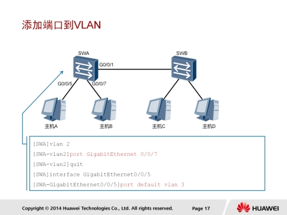

## 企业网路架构


企业需要具备一个完整的网络解决方案，才能支撑各种各样的业务运转。随着业务不断发展，对企业对网络的各种需求也在不断增加。例如：用户密度可能在短时间内快速增加，用户需要移动办公，此外企业还需要有效地管理网络中不同的业务流量。

本例中描述的是一个企业网络解决方案，此方案将网络在逻辑上分为不同的区域：接入、汇聚、核心区域，数据中心区域，DMZ区域，企业边缘，网络管理区域等。

此网络使用了一个三层的网络架构，包括核心层，汇聚层，接入层。将网络分为三层架构有诸多优点：

* 每一层都有各自独立而特定的功能；
* 使用模块化的设计，便于定位错误，简化网络拓展和维护；
* 可以隔离一个区域的拓扑变化，避免影响其他区域。

此解决方案能够支持各种应用对网络的需求，包括高密度的用户接入，移动办公，VoIP，视频会议和视频监控的使用等，满足了客户对于可扩展性，可靠性，安全性，可管理性的需求。

### 拓展企业网络


企业网络通过与电信服务供应商的网络建立连接，来支撑移动办公和分支机构网络的互联。移动办公的用户只要能够接入网络，就可以在任何时间、任何地点访问到企业内部网络。

### 提升企业网络性能


提升企业网络运作效率，需要优化网络设计。在网络中使用冗余架构，可以尽可能地保证无论任何设备或链路发生故障，用户业务都不会被影响。双节点冗余设计作为企业网络设计的一部分，增强了网络可靠性。但冗余不能过度使用，因为太多的冗余节点难以维护，并且增加了整体开销。

### 保障企业网络安全


网络安全在企业网络中变得日益重要。TCP/IP协议簇在建立之初并没有考虑到安全问题，因此，企业网络亟需能够应对内外两种安全威胁的解决方案，用来对抗IP网络中日益增长的安全威胁。华为网络安全解决方案覆盖了终端安全管理，业务安全控制，网络攻击防护三大方面。

### 管理企业网络


华为开发的eSight网管系统实现了企业资源、服务和用户的统一管理，并且允许它们进行智能互动。此外，eSight还能够管理来自其它厂商的设备，比如华三、思科和中兴的网络设备以及IBM、惠普和Sun Microsystems的IT设备。

### 下一代企业网络


随着行业的不断发展，出现了新一代企业解决方案，即云解决方案。云解决方案为业务运行所需的基础设施、平台及软件提供了云服务，以此来满足每个客户的需求。企业需要建设云解决方案所需的数据中心和基础设施，需要使用虚拟化和存储等技术，推动企业把云解决方案运用到所有业务中，从而满足客户持续增长的业务需求。

## 链路聚合

### 链路聚合的应用场景


在企业网络中，所有设备的流量在转发到其他网络前都会汇聚到核心层，再由核心区设备转发到其他网络，或者转发到外网。因此，在核心层设备负责数据的高速交换时，容易发生拥塞。在核心层部署链路聚合，可以提升整个网络的数据吞吐量，解决拥塞问题。本示例中，两台核心交换机SWA和SWB之间通过两条成员链路互相连接，通过部署链路聚合，可以确保SWA和SWB之间的链路不会产生拥塞。

### 链路聚合


链路聚合是把两台设备之间的多条物理链路聚合在一起，当做一条逻辑链路来使用。这两台设备可以是一对路由器，一对交换机，或者是一台路由器和一台交换机。一条聚合链路可以包含多条成员链路。

链路聚合能够提高链路带宽。理论上，通过聚合几条链路，一个聚合口的带宽可以扩展为所有成员口带宽的总和，这样就有效地增加了逻辑链路的带宽。

链路聚合为网络提供了高可靠性。配置了链路聚合之后，如果一个成员接口发生故障，该成员口的物理链路会把流量切换到另一条成员链路上。

链路聚合还可以在一个聚合口上实现负载均衡，一个聚合口可以把流量分散到多个不同的成员口上，通过成员链路把流量发送到同一个目的地，将网络产生拥塞的可能性降到最低。

### 链路聚合模式


链路聚合包含两种模式：手动负载均衡模式和静态 LACP（Link Aggregation Control Protocol）模式。

* 手工负载分担模式下，Eth-Trunk的建立、成员接口的加入由手工配置，没有链路聚合控制协议的参不。该模式下所有活动链路都参不数据的转发，平均分担流量，因此称为负载分担模式。如果某条活动链路故障，链路聚合组自动在剩余的活动链路中平均分担流量。当需要在两个直连设备间提供一个较大的链路带宽而设备又不支持LACP协议时，可以使用手工负载分担模式
* 在静态LACP模式中，链路两端的设备相互发送LACP报文，协商聚合参数。协商完成后，两台设备确定活动接口和非活动接口。在静态LACP模式中，需要手动创建一个Eth-Trunk口，并添加成员口。LACP协商选不活动接口和非活动接口。静态LACP模式也叫M:N模式。M代表活动成员链路，用于在负载均衡模式中转发数据。N代表非活动链路，用于冗余备份。如果一条活动链路发生故障，该链路传输的数据被切换到一条优先级最高的备份链路上，这条备份链路转变为活动状态。

两种链路聚合模式的主要区别是：

* 在静态LACP模式中，一些链路充当备份链路。
* 在手动负载均衡模式中，所有的成员口都处于转发状态。

### 数据流控制


在一个聚合口中，聚合链路两端的物理口（即成员口）的所有参数必须一致，包括物理口的数量，传输速率，双工模式和流量控制模式。成员口可以是二层接口或三层接口。

数据流在聚合链路上传输，数据顺序必须保持不变。一个数据流可以看做是一组MAC地址和IP地址相同的帧。例如，两台设备间的SSH或SFTP连接可以看做一个数据流。如果未配置链路聚合，只是用一条物理链路来传输数据，那么一个数据流中的帧总是能按正确的顺序到达目的地。配置了链路聚合后，多条物理链路被绑定成一条聚合链路，一个数据流中的帧通过不同的物理链路传输。如果第一个帧通过一条物理链路传输，第二个帧通过另外一条物理链路传输，这样一来同一数据流的
第二个数据帧就有可能比第一个数据帧先到达对端设备，从而产生接收数据包乱序的情况。

为了避免这种情况的发生，Eth-Trunk采用逐流负载分担的机制，这种机制把数据帧中的地址通过HASH算法生成HASH-KEY值，然后根据这个数值在Eth-Trunk转发表中寻找对应的出接口，不同的MAC或IP地址HASH得出的HASH-KEY值不同，从而出接口也就不同，这样既保证了同一数据流的帧在同一条物理链路转发，又实现了流量在聚合组内各物理链路上的负载分担，即逐流的负载分担。逐流负载分担能保证包的顺序，但不能保证带宽利用率。负载分担的类型主要包括以下几种，用户可以根据具体应用选择不同的负载分担类型。

1. 根据报文的源MAC地址进行负载分担；
2. 根据报文的目的MAC地址进行负载分担；
3. 根据报文的源IP地址进行负载分担；
4. 根据报文的目的IP地址进行负载分担；
5. 根据报文的源MAC地址和目的MAC地址进行负载分担；
6. 根据报文的源IP地址和目的IP地址进行负载分担；
7. 根据报文的VLAN、源物理端口等对L2、IPv4、IPv6和MPLS报文进行增强型负载分担。

### 二层链路聚合配置


```
interface Eth-Trunk 1
interface GigabitTethernet 0/0/1
eth-trunk 1
interface GigabitEthernet 0/0/2
eth-trunk 1
```

本例中，通过执行interface Eth-trunk 命令配置链路聚合。

这条命令创建了一个Eth-Trunk口，并且进入该Eth-Trunk口视图。trunkid用来唯一标识一个Eth-Trunk口，该参数的取值可以是0到63之间的任
何一个整数。如果指定的Eth-Trunk口已经存在，执行interface ethtrunk命令会直接进入该Eth-Trunk口视图。
配置Eth-Trunk口和成员口，需要注意以下规则：

1. 只能删除不包含任何成员口的Eth-Trunk口。
2. 把接口加入Eth-Trunk口时，二层Eth-Trunk口的成员口必须是二层接口，三层Eth-Trunk口的成员口必须是三层接口。
3. 一个Eth-Trunk口最多可以加入8个成员口。
4. 加入Eth-Trunk口的接口必须是hybrid接口（默认的接口类型）。
5. 一个Eth-Trunk口不能充当其他Eth-Trunk口的成员口。
6. 一个以太接口只能加入一个Eth-Trunk口。如果把一个以太接口加入另一个Eth-Trunk口，必须先把该以太接口从当前所属的Eth-Trunk口中删除。
7. 一个Eth-Trunk口的成员口类型必须相同。例如，一个快速以太口（FE口）和一个千兆以太口（GE口）不能加入同一个Eth-Trunk。
8. 位于不同接口板（LPU）上的以太口可以加入同一个Eth-Trunk口。如果一个对端接口直接和本端Eth-Trunk口的一个成员口相连，该对端接口也必须加入一个Eth-Trunk口。否则两端无法通信。
9. 如果成员口的速率不同，速率较低的接口可能会拥塞，报文可能会被丢弃。
10. 接口加入Eth-Trunk口后，Eth-Trunk口学习MAC地址，成员口不再学习。

#### 查看链路聚合信息


```
display interface eth-trunk 1
```

执行display interface eth-trunk 命令，可以确认两台设备间是否已经成功实现链路聚合。也可以使用这条命令收集流量统计数据，定位接口故障。

如果Eth-Trunk口处于UP状态，表明接口正常运行。

* 如果接口处于Down状态，表明所有成员口物理层发生故障。
* 如果管理员手动关闭端口，接口处于Administratively DOWN状态。
* 可以通过接口状态的改变发现接口故障，所有接口正常情况下都应处于Up状态。

### 三层链路聚合配置


```
interface eth-trunk 1
undo portswitch
ip address 100.1.1.1 24
quit

eth-trunk 1
quit
interface GigabitEthernet0/0/2
eth-trunk 1
quit
```

如果要在路由器上配置三层链路聚合，需要首先创建Eth-Trunk接口，然后在Eth-Trunk逻辑口上执行undo portswitch命令，把聚合链路从二层转为三层链路。执行undo portswitch命令后，可以为Eth-Trunk逻辑口分配一个IP地址。

#### 查看链路聚合信息


执行display interface eth-trunk 命令，可以确认两台设备间是否已经成功实现链路聚合。和查看二层链路聚合操作一样。

## VLAN原理和配置

### VLAN技术


VLAN技术可以将一个物理局域网在逻辑上划分成多个广播域，也就是多个VLAN。VLAN技术部署在数据链路层，用于隔离二层流量。同一个VLAN内的主机共享同一个广播域，它们之间可以直接进行二层通信。而VLAN间的主机属于不同的广播域，不能直接实现二层互通。这样，广播报文就被限制在各个相应的VLAN内，同时也提高了网络安全性。

本例中，原本属于同一广播域的主机被划分到了两个VLAN中，即，VLAN1和VLAN2。VLAN内部的主机可以直接在二层互相通信，VLAN1和VLAN2之间的主机无法直接实现二层通信。

### VLAN帧格式


VLAN标签长4个字节，直接添加在以太网帧头中，IEEE802.1Q文档对VLAN标签作出了说明。

* TPID：Tag Protocol Identifier，2字节，固定取值，0x8100，是IEEE定义的新类型，表明这是一个携带802.1Q标签的帧。如果不支持802.1Q的设备收到这样的帧，会将其丢弃。
* TCI：Tag Control Information，2字节。帧的控制信息，详细说明如下：
  * Priority：3比特，表示帧的优先级，取值范围为0～7，值越大优先级越高。当交换机阻塞时，优先发送优先级高的数据帧。
  * CFI：Canonical Format Indicator，1比特。CFI表示MAC地址是否是经典格式。CFI为0说明是经典格式，CFI为1表示为非经典格式。用于区分以太网帧、FDDI（Fiber Distributed Digital Interface）帧和令牌环网帧。在以太网中，CFI的值为0。
  * VLAN Identifier：VLAN ID，12比特，在X7系列交换机中，可配置的VLAN ID取值范围为0～4095，但是0和4095在协议中规定为保留的VLAN ID，不能给用户使用。
* 在现有的交换网络环境中，以太网的帧有两种格式：
  * 没有加上VLAN标记的标准以太网帧（untagged frame）；
  * 有VLAN标记的以太网帧（tagged frame）。

### 链路类型


VLAN链路分为两种类型：Access链路和Trunk链路。

* 接入链路（Access Link）：连接用户主机和交换机的链路称为接入链路。如本例所示，图中主机和交换机之间的链路都是接入链路。
* 干道链路（Trunk Link）：连接交换机和交换机的链路称为干道链路。如本例所示，图中交换机之间的链路都是干道链路。干道链路上通过的帧一般为带Tag的VLAN帧。

### PVID


PVID即Port VLAN ID，代表端口的缺省VLAN。

交换机从对端设备收到的帧有可能是Untagged的数据帧，但所有以太网帧在交换机中都是以Tagged的形式来被处理和转发的，因此交换机必须给端口收到的Untagged数据帧添加上Tag。

为了实现此目的，必须为交换机配置端口的缺省VLAN。当该端口收到Untagged数据帧时，交换机将给它加上该缺省VLAN的VLAN Tag。

#### 端口类型-Access


Access端口是交换机上用来连接用户主机的端口，它只能连接接入链路，并且只能允许唯一的VLAN ID通过本端口。

Access端口收发数据帧的规则如下：

1. 如果该端口收到对端设备发送的帧是untagged（不带VLAN标签），交换机将强制加上该端口的PVID。
   1. 如果该端口收到对端设备发送的帧是tagged（带VLAN标签），交换机会检查该标签内的VLAN ID。当VLAN ID与该端口的PVID相同时，接收该报文。
   2. 当VLAN ID与该端口的PVID不同时，丢弃该报文。
2. Access端口发送数据帧时，总是先剥离帧的Tag，然后再发送。
   1. Access端口发往对端设备的以太网帧永远是不带标签的帧。

在本示例中，交换机的G0/0/1，G0/0/2，G0/0/3端口分别连接三台主机，都配置为Access端口。主机A把数据帧（未加标签）发送到交换机的G0/0/1端口，再由交换机发往其他目的地。收到数据帧之后，交换机根据端口的PVID给数据帧打上VLAN标签10，然后决定从G0/0/3端口转发数据帧。G0/0/3端口的PVID也是10，不VLAN标签中的VLAN ID相同，交换机移除标签，把数据帧发送到主机C。连接主机B的端口的PVID是2，不VLAN10不属于同一个VLAN，因此此端口不会接收到VLAN10的数据帧。

#### 端口类型-Trunk


Trunk端口是交换机上用来和其他交换机连接的端口，它只能连接干道链路。Trunk端口允许多个VLAN的帧（带Tag标记）通过。

Trunk端口收发数据帧的规则如下：

* 当接收到对端设备发送的不带Tag的数据帧时，会添加该端口的PVID，如果PVID在允许通过的VLAN ID列表中，则接收该报文，否则丢弃该报文。当接收到对端设备发送的带Tag的数据帧时，检查VLAN ID是否在允许通过的VLAN ID列表中。如果VLAN ID在接口允许通过的VLAN ID列表中，则接收该报文。否则丢弃该报文。
* 端口发送数据帧时，当VLAN ID与端口的PVID相同，且是该端口允许通过的VLAN ID时，去掉Tag，发送该报文。当VLAN ID与端口的PVID不同，且是该端口允许通过的VLAN ID时，保持原有Tag，发送该报文。

#### 端口类型-Hybrid


Access端口发往其他设备的报文，都是Untagged数据帧，而Trunk端口仅在一种特定情况下才能发出untagged数据帧，其它情况发出的都是Tagged数据帧。

Hybrid端口是交换机上既可以连接用户主机，又可以连接其他交换机的端口。Hybrid端口既可以连接接入链路又可以连接干道链路。Hybrid端口允许多个VLAN的帧通过，并可以在出端口方向将某些VLAN帧的Tag剥掉。华为设备默认的端口类型是Hybrid。

在本示例中，要求主机A和主机B都能访问服务器，但是它们之间不能互相访问。此时交换机连接主机和服务器的端口，以及交换机互连的端口都配置为Hybrid类型。交换机连接主机A的端口的PVID是2，连接主机B的端口的PVID是3，连接服务器的端口的PVID是100。

Hybrid端口收发数据帧的规则如下：

* 当接收到对端设备发送的不带Tag的数据帧时，会添加该端口的PVID，如果PVID在允许通过的VLAN ID列表中，则接收该报文，否则丢弃该报文。当接收到对端设备发送的带Tag的数据帧时，检查VLAN ID是否在允许通过的VLAN ID列表中。如果VLAN ID在接口允许通过的VLAN ID列表中，则接收该报文，否则丢弃该报文。
* Hybrid端口发送数据帧时，将检查该接口是否允许该VLAN数据帧通过。如果允许通过，则可以通过命令配置发送时是否携带Tag。

```
port hybrid tagged vlan vlan-id
port hybrid untagged vlan vlan-id
```

* 配置port hybrid tagged vlan vlan-id命令后，接口发送该vlan-id的数据帧时，不剥离帧中的VLAN Tag，直接发送。该命令一般配置在连接交换机的端口上。
* 配置port hybrid untagged vlan vlan-id命令后，接口在发送vlan-id的数据帧时，会将帧中的VLAN Tag剥离掉再发送出去。该命令一般配置在连接主机的端口上。

本例介绍了主机A和主机B发送数据给服务器的情况。在SWA和SWB互连的端口上配置了port hybrid tagged vlan 2 3 100命令后，SWA和SWB之间的链路上传输的都是带Tag标签的数据帧。在SWB连接服务器的端口上配置了port hybrid untagged vlan 2 3，主机A和主机B发送的数据会被剥离VLAN标签后转发到服务器。

### VLAN划分方法


VLAN的划分包括如下5种方法：

1. 基于端口划分：根据交换机的端口编号来划分VLAN。通过为交换机的每个端口配置不同的PVID，来将不同端口划分到VLAN中。
2. 基于MAC地址划分：根据主机网卡的MAC地址划分VLAN。此划分方法需要网络管理员提前配置网络中的主机MAC地址和VLAN ID的映射关系。如果交换机收到不带标签的数据帧，会查找之前配置的MAC地址和VLAN映射表，根据数据帧中携带的MAC地址来添加相应的VLAN标签。在使用此方法配置VLAN时，即使主机移动位置也不需要重新配置VLAN。
3. 基于IP子网划分：交换机在收到不带标签的数据帧时，根据报文携带的IP地址给数据帧添加VLAN标签。
4. 基于协议划分：根据数据帧的协议类型（或协议族类型）、封装格式来分配VLAN ID。网络管理员需要首先配置协议类型和VLAN ID之间的映射关系。
5. 基于策略划分：使用几个条件的组合来分配VLAN标签。这些条件包括IP子网、端口和IP地址等。只有当所有条件都匹配时，交换机才为数据帧添加VLAN标签。另外，针对每一条策略都是需要手工配置的。

### VLAN配置


```
vlan 10
quit
vlan batch 2 to 4
```

在交换机上划分VLAN时，需要首先创建VLAN。在交换机上执行vlan命令，创建VLAN。

`vlan id`：创建了VLAN id，并进入了VLAN id视图。VLAN ID的取值范围是1到4094。

`vlan batch { vlan id1 [ to vlan-id2 ] }`：创建多个连续的VLAN。也可以执行`vlan batch { vlan-id1 vlan-id2 }`命令，创建多个不连续的VLAN，VLAN号之间需要有空格。

#### 配置验证


```
display vlan
display vlan [ vlan-id [ verbose ] ]
display vlan vlan-id statistics
display vlan summary
```

* display vlan：验证配置结果。如果不指定任何参数，则该命令将显示所有VLAN的简要信息。
* display vlan [ vlan-id [ verbose ] ]：查看指定VLAN的详细信息，包括VLAN ID、类型、描述、VLAN的状态、VLAN中的端口、以及VLAN中端口的模式等。
* display vlan vlan-id statistics：查看指定VLAN中的流量统计信息。
* display vlan summary：查看系统中所有VLAN的汇总信息。

#### 配置Access端口


```
prot link-type access
```

配置端口类型的命令是port link-type ，type可以配置为Access，Trunk或Hybrid。

需要注意的是，如果查看端口配置时没有发现端口类型信息，说明端口使用了默认的hybrid端口链路类型。当修改端口类
型时，必须先恢复端口的默认VLAN配置，使端口属于缺省的VLAN 1。

#### 添加端口到VLAN



```
vlan 2
port GigabitEthernet0/0/7

interface GigabitEthernet0/0/5
prot default vlan 3
```

可以使用两种方法把端口加入到VLAN。

* 第一种方法是进入到VLAN视图，执行port 命令，把端口加入VLAN。
* 第二种方法是进入到接口视图，执行port default 命令，把端口加入VLAN。vlan-id是指端口要加入的VLAN。

##### 配置验证


* display vlan：确认端口是否已经加入到VLAN中。

在本示例 中 ， 端口GigabitEthernet0/0/5 和GigabitEthernet0/0/7 分别 加 入了VLAN 3和VLAN 2。UT表明该端口发送数据帧时，会剥离VLAN标签，即此端口是一个Access端口或不带标签的Hybrid端口。U或D分别表示链路当前是Up状态或Down状态。

#### 配置Trunk端口


```
prot link-type trunk
port trunk allow-pass vlan 2 3
```

配置Trunk时，应先使用port link-type trunk命令修改端口的类型为Trunk，然后再配置Trunk端口允许哪些VLAN的数据帧通过。

* `porttrunk allow-pass vlan { { vlan-id1 [ to vlan-id2 ] } | all }`：可以配置端口允许的VLAN，all表示允许所有VLAN的数据帧通过。
* `port trunk pvid vlan vlan-id`：修改Trunk端口的PVID。修改Trunk端口的PVID之后，需要注意：缺省VLAN不一定是端口允许

通过的VLAN。只有使用命令`port trunk allow-pass vlan { { vlan id1 [ to vlan-id2 ] } | all }`允许缺省VLAN数据通过，才能转发缺省VLAN的数据帧。交换机的所有端口默认允许VLAN1的数据通过。

在本示例中，将SWA的G0/0/1端口配置为Trunk端口，该端口PVID默认为1。配置port trunk allow-pass vlan 2 3命令之后，该Trunk允许VLAN 2和VLAN 3的数据流量通过。

##### 配置验证


```
display vlan
```

执行display vlan命令可以查看修改后的配置。TG表明该端口在转发对应VLAN的数据帧时，不会剥离标签，直接进行转发，该端口可以是Trunk端口或带标签的Hybrid端口。

本示例中，GigabitEthernet0/0/1在转发VLAN 2和VLAN3的流量时，不剥离标签，直接转发。

#### 配置Hybrid端口


```
port link-type hybrid
port hybrid tagged vlan 2 3 100
port hybrid pvid vlan 2
port hybrid untagged vlan 2 100
port hybrid pvid vlan 3
port hybrid untagged vlan 3 100
```

* `port link-type hybrid`：将端口的类型配置为Hybrid。
* `port hybrid tagged vlan{ { vlan-id1 [ to vlan-id2 ] } | all }`：配置允许哪些VLAN的数据帧以Tagged方式通过该端口。
* `port hybrid untagged vlan { { vlan-id1 [ to vlan-id2 ] } | all }`：配置允许哪些VLAN的数据帧以Untagged方式通过该端口。

在本示例中，要求主机A和主机B都能访问服务器，但是它们之间不能互相访问。此时通过命令port link-type hybrid配置交换机连接主机和服务器的端口，以及交换机互连的端口都为Hybrid类型。

通过命令porthybrid pvid vlan 2配置交换机连接主机A的端口的PVID是2。类似地，连接主机B的端口的PVID是3，连接服务器的端口的PVID是100。通过在G0/0/1端口下使用命令port hybrid tagged vlan 2 3 100，配置VLAN2,VLAN3和VLAN100的数据帧在通过该端口时都携带标签。在G0/0/2端口下使用命令port hybrid untagged vlan 2 100，配置VLAN2和VLAN100的数据帧在通过该端口时都不携带标签。在G0/0/3端口下使用命令port hybrid untagged vlan 3 100，配置VLAN3和VLAN100的数据帧在通过该端口时都不携带标签。


在SWB上继续进行配置，在G0/0/1端口下使用命令port link-typehybrid配置端口类型为Hybrid。

在G0/0/1端口下使用命令port hybrid tagged vlan 2 3 100，配置VLAN2，VLAN3和VLAN100的数据帧在通过该端口时都携带标签。在G0/0/2端口下使用命令port hybrid untagged vlan 2 3 100，配置VLAN2，VLAN3和VLAN100的数据帧在通过该端口时都不携带标签。

##### 配置验证


在SWA上执行display vlan命令，可以查看hybrid端口的配置。

在本示例中，GigabitEthernet 0/0/2在发送VLAN2和VLAN100的数据帧时会剥离标签。GigabitEthernet 0/0/3在发送VLAN3和VLAN100的数据帧时会剥离标签。GigabitEthernet 0/0/1允许VLAN 2，VLAN 3和VLAN 100的带标签的数据帧通过。此配置满足了多个VLAN可以访问特定VLAN，而其他VLAN间不允许互相访问的需求。

#### Voice VLAN应用


随着IP网络的融合，TCP/IP网络可以为高速上网HSI（High Speed Internet）业务、VoIP（Voice over IP）业务、IPTV（Internet Protocol Television）业务提供服务。

语音数据在传输时需要具有比其他业务数据更高的优先级，以减少传输过程中可能产生的时延和丢包现象。

为了区分语音数据流，可在交换机上部署Voice VLAN功能，把VoIP的电话流量进行VLAN隔离，并配置更高的优先级，从而能够保证通话质量。

##### 配置Voice VLAN


```
voice-vlan  enable
voice-vlan 2 enable
voice-vlan mode auto
voice-vlan mac-address 0011-2200-0000 mask ffff-ff00-0000
```

voice-vlan  enable：把VLAN 2到VLAN 4094之间的任一VLAN配置成语音VLAN。
voice-vlan mode：配置端口加入语音VLAN的模式。

端口加入Voice VLAN的模式有两种：

* 自动模式：使能Voice VLAN功能的端口根据进入端口的数据流中的源MAC地址字段来判断该数据流是否为语音数据流。源MAC地址符合系统设置的语音设备OUI（Organizationally Unique Identifier）地址的报文认为是语音数据流。接收到语音数据流的端口将自动加入Voice VLAN中传输，并通过老化机制维护Voice VLAN内的端口数量。
* 手动模式：当接口使能Voice VLAN功能后，必须通过手工将连接语音设备的端口加入或退出Voice VLAN中，这样才能保证VoiceVLAN功能生效。

voice-vlan mac-address mac-address mask ouimask [ description text ]：配置Voice VLAN的OUI地址。OUI
地址表示一个MAC地址段。交换机将48位的MAC地址和掩码的对应位做“与”运算可以确定出OUI地址。

接入设备的MAC地址和OUI地址匹配的位数，由掩码中全“1”的长度决定。例如，MAC地址为0001–0001–
0001，掩码为FFFF-FF00–0000，那么将MAC地址不其相应掩码位执行“与”运算的结果就是OUI地址0001–0000–0000。只要接入设备的MAC地址前24位和OUI地址的前24位匹配，那么使能Voice VLAN功能的端口将认为此数据流是语音数据流，接入的设备是语音设备。

##### 配置验证


```
display voice-vlan status
```

执行display voice-vlan status命令，可以查看语音VLAN的信息，包括状态、工作模式、老化时间、以及使能了语音VLAN功能的端口信息。

* Add-Mode字段表明语音VLAN的添加模式。自动模式中，使能了语音VLAN功能后，端口可以自动加入到语音VLAN。如果语音设备发送的报文的MAC地址匹配了OUI，连接该语音设备的端口也会加入语音VLAN。如果在老化时间内，端口没有收到语音设备的任何语音数据报文，端口自动会被删除。手动模式中，在端口上使能了语音VLAN功能之后，必须手动把端口添加到语音VLAN中。
* Security-Mode字段表示Voice VLAN端口的工作模式，有两种：
  * 正常模式：可以传输语音数据和业务数据，但是容易受到恶意数据流量的攻击。
  * 安全模式：只允许传输语音数据流。安全模式可以防止Voice VLAN受到恶意数据流量的攻击，但是检查报文的工作会占用一定的系统资源。
* Legacy字段表明端口是否开启不其他厂商语音设备互通的功能，Enable表示开启，Disable表示关闭。

## GARP和GVRP

### GARP应用


GARP（Generic Attribute Registration Protocol），全称是通用属性注册协议。它为处于同一个交换网内的交换成员之间提供了一种分发、传播、注册某种信息的手段，这些信息可以是VLAN信息、组播组地址等。

通过GARP机制，一个GARP成员上的配置信息会迅速传播到整个交换网。GARP主要用于大中型网络中，用来提升交换机的管理效率。

在大中型网络中，如果管理员手动配置和维护每台交换机，将会带来巨大的工作量。使用GARP可以自动完成大量交换机的配置和部署，减少了大量的人力消耗。

GARP本身仅仅是一种协议规范，并不作为一个实体在交换机中存在。遵循GARP协议的应用实体称为GARP应用，目前主要的GARP应用为GVRP和GMRP。

### GARP报文结构


GARP协议报文采用IEEE 802.3 Ethernet封装形式，目的MAC地址为多播MAC地址01-80-C2-00-00-21。GARP使用PDU包含的消息定义属性，根据属性类型字段和属性列表识别消息。

属性列表中包含多个属性。每个属性包含属性长度、属性事件和属性值字段。属性长度范围在2到255个字节之间。属性值为属性定义了具体的值。属性事件是0到5之间的一个值，这些值代表GARP支持的不同事件类型，具体含义如下：

* 0：代表LeaveAll事件；
* 1：代表JoinEmpty事件；
* 2：代表JoinIn事件；
* 3：代表LeaveEmpty事件；
* 4：代表LeaveIn事件；
* 5：代表Empty事件。

### GARP消息-Join


如果GARP参与者希望其他交换机注册自己的属性，则会向它们发送Join消息。

如果一个GARP参与者收到其他交换机发送的Join消息，或者手动配置了某些属性，该参与者也会向其他交换机发送Join消息，让其他交换机注册这些新的属性。

### GARP消息-Leave


如果GARP参与者希望其他交换机注销自己的属性，则会向它们发送Leave消息。

如果GARP参与者收到其他交换机发送的Leave消息，或者手动注销了某些属性，该参与者也会向其他交换机发送Leave消息。

### GARP消息-All


如果GARP参与者希望其他交换机注销所有属性，来重新注册自己发送的属性信息，则会向它们发送Leave All消息。

### GARP应用


GVRP（GARP VLAN Registration Protocol），称为VLAN注册协议。GVRP基于GARP的工作机制，是GARP的一种应用。

GVRP用来维护交换机中的VLAN动态注册信息，并传播该信息到其它的交换机中。支持GVRP特性的交换机能够接收来自其它交换机的VLAN注册信息，并动态更新本地的VLAN注册信息，包括当前的VLAN、VLAN成员等。

支持GVRP特性的交换机能够将本地的VLAN注册信息向其它交换机传播，以便使同一交换网内所有支持GVRP特性的设备的VLAN信息达成一致。交换机可以静态创建VLAN，也可以动态通过GVRP获取VLAN信息。手动配置的VLAN是静态VLAN，通过GVRP创建的VLAN是动态VLAN。

GVRP传播的VLAN注册信息包括本地手工配置的静态注册信息和来自其它交换机的动态注册信息。

### GVRP单向注册


如图所示，所有交换机以及互连的接口都已经启用GVRP协议，各交换机之间相连的端口均为Trunk端口并配置为允许所有VLAN的数据通过。

在SWA上手动创建VLAN2之后，SWA的G0/0/1端口会注册此VLAN并发送声明给SWB，SWB的G0/0/1端口接收到由SWA发来的声明后，会在此端口注册VLAN2，然后从G0/0/2发送声明给SWC，SWC的G0/0/1收到声明后也会注册VLAN2。通过此过程就完成了VLAN2从SWA向其他交换机的单向注册。只有注册了VLAN2的端口才可以接收和转发VLAN2的数据，没有注册VLAN2的端口会丢弃VLAN2的数据，如SWB的G0/0/2端口没有收到VLAN2的Join消息，不会注册VLAN2，就不能接收和转发VLAN2的数据。

为使VLAN 2流量可以双向互通，还需要进行SWC到SWA方向的VLAN属性的注册过程。

### GVRP单向注销


如图所示，如果所有交换机都不再需要VLAN2，可以在SWA上手动删除VLAN2，则GVRP会通过发送Leave消息，注销SWB和SWC上G0/0/1端口的VLAN2信息。为了彻底删除所有设备上的VLAN 2，需要进行VLAN属性的双向注销。

### 注册模式-Normal


GVRP的注册模式包括：Normal、Fixed和Forbidden。

当一个Trunk端口被配置为Normal注册模式时，允许在该端口动态或手工创建、注册和注销VLAN，同时会发送静态VLAN和动态VLAN的声明消息。

本例中，在SWA上存在手动创建的VLAN2和动态学习的VLAN3的信息，三台交换机的注册模式都默认为Normal，则SWA发送的Join消息中会包含VLAN2和VLAN3的信息，SWB的G0/0/1端口会注册VLAN2和VLAN3，之后会同样发送Join消息给SWC，SWC的G0/0/1端口也会注册VLAN2和VLAN3。

### 注册模式-Fixed


Fixed注册模式中，GVRP不能动态注册或注销VLAN，只能发送静态VLAN注册信息。如果一个Trunk端口的注册模式被设置为Fixed模式，即使接口被配置为允许所有VLAN的数据通过，该接口也只允许手动配置的VLAN内的数据通过。

本例中，在SWA上存在手动创建的VLAN2和动态学习的VLAN3的信息，SWA的G0/0/1端口的注册模式被修改为Fixed，则SWA发送的Join消息中会只包含静态VLAN2的信息，SWB的G0/0/1端口会注册VLAN2。

### 注册模式-Forbidden


Forbidden注册模式中，GVRP接口不能动态注册或注销VLAN，只保留VLAN1的信息。如果一个Trunk端口的注册模式被设置为Forbidden模式，即使端口被配置为允许所有VLAN的数据通过，该端口也只允许VLAN1的数据通过。

本例中，在SWA上存在手动创建的VLAN2和动态学习的VLAN3的信息，SWA的G0/0/1端口配置为Forbidden模式，不会发送VLAN2和VLAN3的信息，且只允许VLAN1的数据通过。

### 配置GVRP


```
gvrp
interface Gigabitethernet0/0/
port link-type trunk
port trunk allow-pass vlan all
gvrp
gvrp registration fixed
```

配置GVRP时必须先在系统视图下使能GVRP，然后在接口视图下使能GVRP。

在全局视图下执行gvrp命令，全局使能GVRP功能。

在接口视图下执行gvrp命令，在端口上使能GVRP功能。

执行gvrp registration 命令，配置端口的注册模式，可以配置

为Normal、Fixed和Forbidden。默认情况下，接口的注册模式为Normal模式。

##### 配置验证


执行display gvrp status命令，验证GVRP的配置，可以查看交换机是否使能了GVRP。

执行display gvrp statistics命令，可以查看GVRP中活动接口的信息。

在本示例中，可以查看接口当前的GVRP状态为Enabled，注册类型为Fixed。

## VLAN间路由

### VLAN的局限性


VLAN隔离了二层广播域，也严格地隔离了各个VLAN之间的任何二层流量，属于不同VLAN的用户之间不能进行二层通信。

### VLAN路由-每个VLAN一个物理连接


因为不同VLAN之间的主机是无法实现二层通信的，所以必须通过三层路由才能将报文从一个VLAN转发到另外一个VLAN。

解决VLAN间通信问题的第一种方法是：

* 在路由器上为每个VLAN分配一个单独的接口，并使用一条物理链路连接到二层交换机上。
* 当VLAN间的主机需要通信时，数据会经由路由器进行三层路由，并被转发到目的VLAN内的主机，这样就可以实现VLAN之间的相互通信。

然而，随着每个交换机上VLAN数量的增加，这样做必然需要大量的路由器接口，而路由器的接口数量是极其有限的。并且，某些VLAN之间的主机可能不需要频繁进行通信，如果这样配置的话，会导致路由器的接口利用率很低。因此，实际应用中一般不会采用这种方案来解决VLAN间的通信问题。

### VLAN路由-单臂路由


解决VLAN间通信问题的第二种方法是：

在交换机和路由器之间仅使用一条物理链路连接。在交换机上，把连接到路由器的端口配置成Trunk类型的端口，并允许相关VLAN的帧通过。在路由器上需要创建子接口，逻辑上把连接路由器的物理链路分成了多条。一个子接口代表了一条归属于某个VLAN的逻辑链路。配置子接口时，需要注意以下几点：

1. 必须为每个子接口分配一个IP地址。该IP地址与子接口所属VLAN位于同一网段。
2. 需要在子接口上配置802.1Q封装，来剥掉和添加VLAN Tag，从而实现VLAN间互通。
3. 在子接口上执行命令arp broadcast enable使能子接口的ARP广播功能。

本例中，主机A发送数据给主机B时，RTA会通过G0/0/1.1子接口收到此数据，然后查找路由表，将数据从G0/0/1.2子接口发送给主机B，这样就实现了VLAN2和VLAN3之间的主机通信。

### VLAN路由-三层交换


解决VLAN间通信问题的第三种方法是：

在三层交换机上配置VLANIF接口来实现VLAN间路由。如果网络上有多个VLAN，则需要给每个VLAN配置一个VLANIF接口，并给每个VLANIF接口配置一个IP地址。用户设置的缺省网关就是三层交换机中VLANIF接口的IP地址。

### 配置单臂路由


```
vlan batch 2 3
port link-type trunk
port trunk allow-pass vlan 2 3
port link-type access
port default vlan 2
prot link-type access
port default vlan 3
```

执行port link-type trunk命令，配置SWA的G0/0/1端口为Trunk类型的端口。

执行port trunk allow-pass vlan 2 3命令，配置SWA的G0/0/1端口允许VLAN 2和VLAN 3的数据通过。


```
interface gigabitEthernet0/1/1.1
dot1q termination vid 2
ip address 192.168.2.254 24
arp broadcast enable

interface gigabitEthernet0/1/1.2
dot1q termination vid 3
ip address 192.168.3.254 24
arp broadcast enable
```

* interface interface-type interface-number.sub-interface number：创建子接口。sub-interface number代表物理接口内的逻辑接口通道。
* dot1q termination vid：配置子接口dot1q封装的单层VLAN ID。缺省情况，子接口没有配置dot1q封装的单层VLAN ID。本命令执行成功后，终结子接口对报文的处理如下：接收报文时，剥掉报文中携带的Tag后进行三层转发。转发出去的报文是否带Tag由出接口决定。发送报文时，将相应的VLAN信息添加到报文中再发送。
* arp broadcast enable：使能终结子接口的ARP广播功能。缺省情况下，终结子接口没有使能ARP广播功能。终结子接口不能转发广播报文，在收到广播报文后它们直接把该报文丢弃。为了允许终结子接口能转发广播报文，可以通过在子接口上执行此命令。

#### 配置验证


配置完成单臂路由后，可以使用ping命令来验证主机之间的连通性。如上所示，VLAN2中的主机A(IP地址：192.168.2.1）可以Ping通VLAN 3中的主机B(IP地址：192.168.3.1)。

#### 配置三层交换


```
vlan batch 2 3
port link-type acess
port default vlan 2
port link-type access
port default vlan 3
```

在三层交换机上配置VLAN路由时，首先创建VLAN，并将端口加入到VLAN中。


```
interface vlanif 2
ip address 192.168.2.254 24
quit
interface vlanif 3
ip address 192.168.3.254 24
quit
```

interface vlanif vlan-id：创建VLANIF接口并进入到VLANIF接口视图。vlan-id表示与VLANIF接口相关联的VLAN编号。VLANIF接口的IP地址作为主机的网关IP地址，和主机的IP地址必须位于同一网段。

##### 配置验证


配置三层交换后，可以用ping命令验证主机之间的连通性。如上所示，VLAN2中的主机A(IP地址：192.168.2.2）可以Ping通VLAN 3中的主机B(IP地址：192.168.3.2)。

## WLAN概述

### IEEE 802.11 主要标准


802.11协议组是国际电工电子工程学会（IEEE）与门为无线局域网络制定的标准。原始标准制定于1997年，工作在2.4GHz频段，速率最高只能达到2Mbps。随后IEEE又相继开发了802.11a和802.11b两个标准，分别工作在5GHz和2.4GHz频段。这两个标准提供的信号范围有差异。

5GHz频段信号衰减严重，速率高，但是抗干扰能力差，传输距离较短。

2.4GHz频段抗衰减能力强，传输距离较进，因而允许在较大的范围内部署更少的AP。

之后，IEEE还发布了802.11g，802.11n和802.11ac标准。

### WLAN解决方案


中小企业园区一般面积有限，因而通常只需要部署一个两层架构的小型无线网络就可以满足用户接入网络的需求。接入控制器一般旁挂在网络的核心层，而不是直接连接接入点，这样既可以达到无线网络叠加的目的，同时也能降低对现有企业网络的影响。

### WLAN覆盖


每个接入点只能覆盖一定的周边面积。因为受到各种因素以及障碍物的影响，各个接入点的覆盖面积还会有所差异。障碍物会造成信号衰减，引起信号反射进而影响信号覆盖范围。因此，为了扩大覆盖面积，一般将多个AP作为独立的单元同时部署，提供重叠的覆盖区域，允许用户在几个AP的覆盖面积内秱动时可以无缝漫游。合理的无线部署能够实现整个园区的全面覆盖，消除覆盖盲区。

无线覆盖同时也需要考虑网络安全问题。不同于有线以太连接，无线网络的范围超出建筑物戒局点的物理边界之外时，未知的外部用户在没有经过授权的情况下可能获叏到无线资源，从而带来网络安全风险。

### WLAN安全


为了维护无线企业网络的安全性，IEEE 设计了多种安全机制。

边界安全机制是一种典型的无线安全解决方案，能够保护802.11网络不受来自非法AP、非法用户、DoS攻击的威胁。

无线入侵检测系统可以用来检测非法用户和非法AP，无线入侵防御系统则可以保护企业网络来防御非法接入。

用户接入安全解决方案则运用链路认证，接入认证和数据加密等网络接入控制方式，保证数据的有效性和用户的接入安全，通过定义用户权限来管理用户接入。

业务安全是无线网络的另一个安全特性，用以在数据传输过程中防止合法用户的数据被非法用户窃叏。


## Reference Links：

http://bbs.hh010.com/
