## 以太网帧结构

网络中传输数据时需要定义并遵循一些标准，以太网是根据IEEE 8.02.3标准来管理和控制数据帧的。

### 数据封装

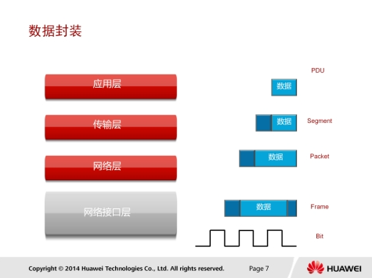

应用数据需要经过TCP/IP每一层处理之后才能通过网络传输到目的端，每一层上都使用该层的协议数据单元PDU（Protocol Data Unit）彼此交换信息。

不同层的PDU中包含有不同的信息，因此PDU在不同层被赋予了不同的名称。如上层数据在传输层添加TCP报头后得到的PDU被称为 Segment（数据段 ）；

数据段被传递给网络层，网络层添加IP报头得到的PDU被称为Packet（数据包）；

数据包被传递到数据链路层，封装数据链路层报头得到的PDU被称为Frame（数据帧）；

最后，帧被转换为比特，通过网络介质传输。这种协议栈逐层向下传递数据，幵添加报头和报尾的过程称为封装。

### 终端之间的通信

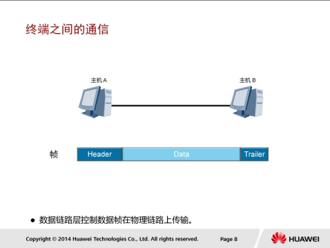

数据包在以太网物理介质上传播之前必须封装头部和尾部信息。封装后的数据包称为称为数据帧，数据帧中封装的信息决定了数据如何传输。以太网上传输的数据帧有两种格式，选择哪种格式由TCP/IP协议簇中的网络层决定。

### 帧格式分类

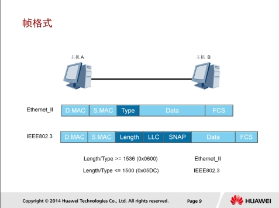

以太网上使用两种标准帧格式。

* 第一种是上世纪80年代初提出的DIX v2格式，即Ethernet II帧格式。Ethernet II后来被IEEE 802标准接纳，并写
  进了IEEE 802.3x-1997的3.2.6节。
* 第二种是1983年提出的IEEE 802.3格式。

这两种格式的主要区别在于

* Ethernet II格式中包含一个Type字段，标识以太帧处理完成之后将被发送到哪个上层协议进行处理。IEEE802.3格式中，同样的位置是长度字段。
* 不同的Type字段值可以用来区别这两种帧的类型，当Type字段值小于等于1500（或者十六进制的0x05DC）时，帧使用的是IEEE 802.3格式。
* 当Type字段值大于等于1536 （或者十六进制的0x0600）时，帧使用的是Ethernet II格式。以太网中大多数的数据帧使用的是Ethernet II格式。

以太帧中还包括源和目的MAC地址，分别代表发送者的MAC和接收者的MAC，此外还有帧校验序列字段，用于检验传输过程中帧的完整性。

## Ethernet II帧格式

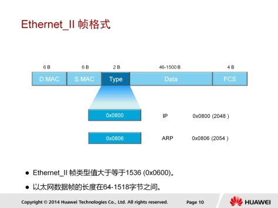

Ethernet_II的帧中各字段说明如下：

1. DMAC（Destination MAC）是目的MAC地址。DMAC字段长度为6个字节，标识帧的接收者。
2. SMAC（Source MAC）是源MAC地址。SMAC字段长度为6个字节，标识帧的发送者。
3. 类型字段（Type）用于标识数据字段中包含的高层协议，该字段长度为2个字节。类型字段取值为0x0800的帧代表IP协议帧；类型字段取值为0806的帧代表ARP协议帧。
4. 数据字段(Data)是网络层数据，最小长度必须为46字节以保证帧长至少为64字节，数据字段的最大长度为1500字节。
5. 循环冗余校验字段（FCS）提供了一种错误检测机制。该字段长度为4个字节。

### 数据帧传输

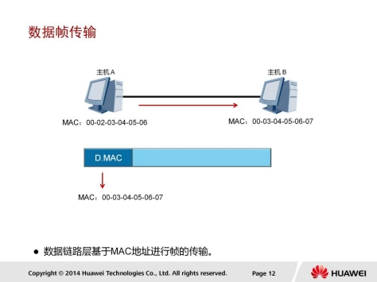

以太网在二层链路上通过MAC地址来唯一标识网络设备，并且实现局域网上网络设备之间的通信。

MAC地址也叫物理地址，大多数网卡厂商把MAC地址烧入了网卡的ROM中。

发送端使用接收端的MAC地址作为目的地址。以太帧封装完成后会通过物理层转换成比特流在物理介质上传输。

#### MAC地址

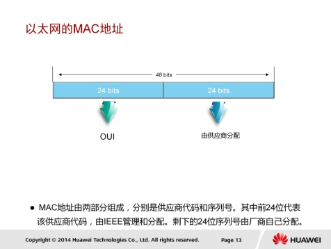

每一台网络设备都用物理地址来标识自己，这个地址就是MAC地址。网络设备的MAC地址是全球唯一的。
MAC地址长度为48比特，通常用十六进制表示。

MAC地址包含两部分：

* 前 24 比 特 是 组 织 唯 一 标 识 符 （ OUI ， Organizationally Unique Identifier），由IEEE统一分配给设备制造商。例如，华为的网络产品的MAC地址前24比特是0x00e0fc。
* 后24位序列号是厂商分配给每个产品的唯一数值，由各个厂商自行分配（这里所说的产品可以是网卡或者其他需要MAC地址的设备）。

## 单播，广播和广播

### 单播

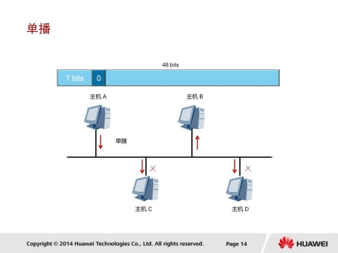

局域网上的帧可以通过三种方式发送。

第一种是单播，指从单一的源端发送到单一的目的端。每个主机接口由一个MAC地址唯一标识，MAC地址的OUI中，第一字节第8个比特表示地址类型。对于主机MAC地址，这个比特固定为0，表示目的MAC地址为此MAC地址的帧都是发送到某个唯一的目的端。

在冲突域中，所有主机都能收到源主机发送的单播帧，但是其他主机发现目的地址不本地MAC地址不一致后会丢弃收到的帧，只有真正的目的主机才会接收幵处理收到的帧。

### 广播

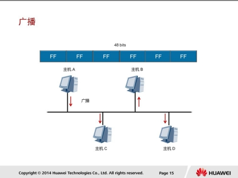

第二种发送方式是广播，表示帧从单一的源发送到共享以太网上的所有主机。广播帧的目的MAC地址为十六进制的FF:FF:FF:FF:FF:FF，所有收到该广播帧的主机都要接收并处理这个帧。

广播方式会产生大量流量，导致带宽利用率降低，进而影响整个网络的性能。当需要网络中的所有主机都能接收到相同的信息并进行处理的情况下，通常会使用广播方式。

### 组播

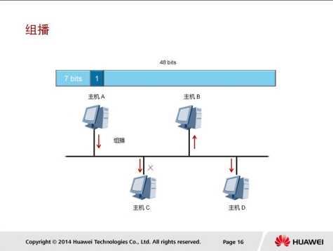

第三种发送方式为组播，组播比广播更加高效。组播转发可以理解为选择性的广播，主机侦听特定组播地址，接收并处理目的MAC地址为该组播MAC地址的帧。

组播MAC地址和单播MAC地址是通过第一字节中的第8个比特区分的。组播MAC地址的第8个比特为1，而单播MAC地址的第8个比特为0。

当需要网络上的一组主机（而不是全部主机）接收相同信息，并且其他主机不受影响的情况下通常会使用组播方式。

## 帧发送和接收

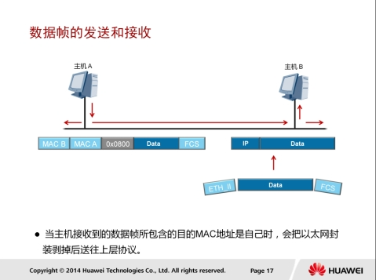

* 帧从主机的物理接口发送出来后，通过传输介质传输到目的端。共享网络中，这个帧可能到达多个主机。
* 主机先检查帧头中的目的MAC地址
  * 如果目的MAC地址不是本机MAC地址，也不是本机侦听的组播或广播MAC地址，则主机会丢弃收到的帧。
  * 如果目的MAC地址是本机MAC地址，则接收该帧，
* 然后检查帧校验序列（FCS）字段，并与本机计算的值对比来确定帧在传输过程中是否保持了完整性。
  * 如果帧的FCS值不本机计算的值不同，主机会认为帧已被破坏，并会丢弃该帧。
  * 如果该帧通过了FCS校验，则主机会根据帧头部中的Type字段来确定将帧发送给上层哪个协议处理。

本例中，Type字段的值为0x0800，表明该帧需要发送到IP协议上处理。在发送给IP协议之前，帧的头部和尾部会被剥掉。

## IP报文

在剥掉帧的头部和尾部之前，网络设备需要根据帧头中Type字段确定下一步将帧发送到哪个上层协议进行处理。

本例中的帧头部Type字段表示该帧需要上送到IP协议进行处理。

以下将介绍帧的头部和尾部被剥掉后，IP协议将如何处理帧中的数据。

### IP报文头部

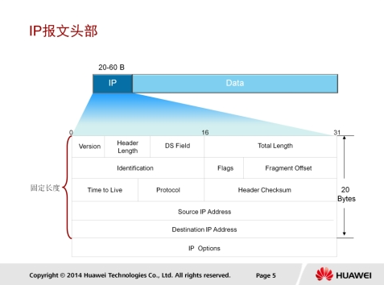

IP报文头部信息用于指导网络设备对报文进行路由和分片。

同一个网段内的数据转发通过链路层即可实现，而跨网段的数据转发需要使用网络设备的路由功能。

#### 分片

分片是指数据包超过一定长度时，需要被划分成不同的片段使其能够在网络中传输。

#### 字段

IP报文头部长度为20到60字节，报文头中的信息可以用来指导网络设备如何将报文从源设备发送到目的设备。

* 版本字段表示当前支持的IP协议版本，当前的版本号为4。
* DS字段早期用来表示业务类型，现在用于支持QoS中的差别服务模型，实现网络流量优化。
* 源和目的IP地址是分配给主机的逻辑地址，用于在网络层标识报文的发送方和接收方。根据源和目的IP地址可以判断目的端是否与发送端位于同一网段，如果二者不在同一网段，则需要采用路由机制进行跨网段转发。

### IP编址

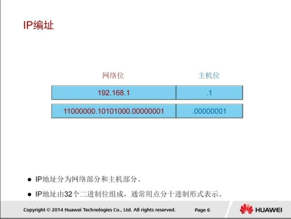

IPv4地址为32比特的二进制数，通常用点分十进制表示。IP地址用来标识网络中的设备，具有IP地址的设备可以在同一网段内或跨网段通信。

IP地址包括两部分

* 第一部分是网络号，表示IP地址所属的网段
* 第二部分是主机号，用来唯一标识本网段上的某台网络设备。

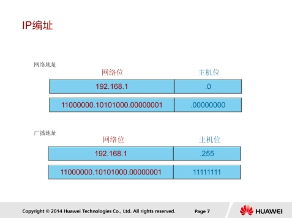

每个网段上都有两个特殊地址不能分配给主机或网络设备。

* 第一个是该网段的网络地址，该IP地址的主机位为全0，表示一个网段。
* 第二个地址是该网段中的广播地址，目的地址为广播地址的报文会被该网段中的所有网络设备接收。广播地址的主机位为全1。

除网络地址和广播地址以外的其他IP地址可以作为网络设备的IP地址。

### 网络中的进制

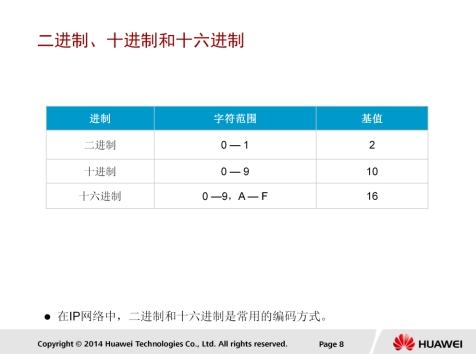

网络中的数据可以采用二进制、十进制、或十六进制来表示，每种进制使用不同的基值表示每
一位的数值。

* 二进制每一位只有0和1两个值，基值为2，二进制数的每一位都可以用2的x次幂来表示，x表示二进制数的位数。
* 十六进制的每一位可以有16个数值，范围为0-F（即0-9和A-F），A对应十进制的10，F对应十进制的15（二进制1111）。

### IP地址分类

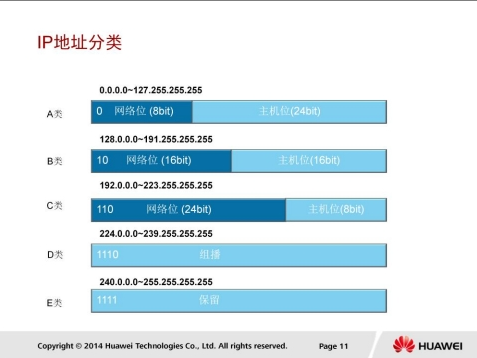

IPv4地址被划分为A、B、C、D、E五类，每类地址的网络号包含不同的字节数。

A类，B类，和C类地址为可分配IP地址，每类地址支持的网络数和主机数不同。

* A类地址可支持126个网络，每个网络支持2^24 （16,777,216 )个主机地址，另外每个网段中的网络地址和广播地址不能分配给主机。
* C类地址支持200多万个网络，每个网络支持256个主机地址，其中254个地址可以分配给主机使用。
* D类地址为组播地址。主机收到以D类地址为目的地址的报文后，且该主机是该组播组成员，就会接收并处理该报文。

各类IP地址可以通过第一个字节中的比特位进行区分。

* A类地址第一字节的最高位固定为0。
* B类地址第一字节的高两位固定为10。
* C类地址第一字节的高三位固定为110。
* D类地址第一字节的高四位固定为1110。
* E类地址第一字节的高四位固定为1111。

#### 私有和特殊地址

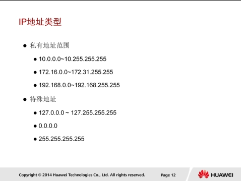

IPv4中的部分IP地址被保留用作特殊用途。为节省IPv4地址，A， B，C类地址段中都预留了特定范围的地址作为私网地址。现在，世界上所有终端系统和网络设备需要的IP地址总数已经超过了32位IPv4地址所能支持的最大地址数4，294，967，296。为主机分配私网地址节省了公网地址，可以用来缓解IP地址短缺的问题。

企业网络中普遍使用私网地址，不同企业网络中的私网地址可以重叠。默认情况下，网络中的主机无法使用私网地址与公网通信；当需要与公网通信时，私网地址必须转换成公网地址。还有其他一些特殊IP地址，如127.0.0.0网段中的地址为环回地址，用于诊断网络是否正常。

IPv4中的第一个地址0.0.0.0表示任何网络，这个地址的作用将在路由原理中详细介绍。

IPv4中的最后一个地址255.255.255.255是0.0.0.0网络中的广播地址。

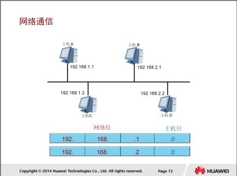

源主机必须要知道目的主机的IP地址后才能将数据发送到目的地。

源主机向其他目的主机发送报文之前，需要检查目的IP地址和源IP地址是否属于同一个网段。

* 如果是，则报文将被下发到底层协议进行以太网封装处理。
* 如果目的地址和源地址属于不同网段，则主机需要获取下一跳路由器的IP地址，然后将报文下发到底层协议处理。

### 子网掩码

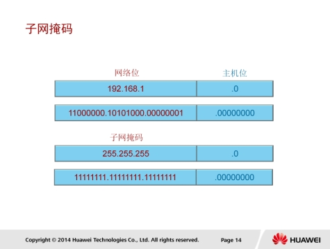

子网掩码用于区分网络部分和主机部分。子网掩码与IP地址的表示方法相同。每个IP地址和子网掩码一起可以用来唯一的标识一个网段中的某台网络设备。子网掩码中的1表示网络位，0表示主机位。

#### 地址规划

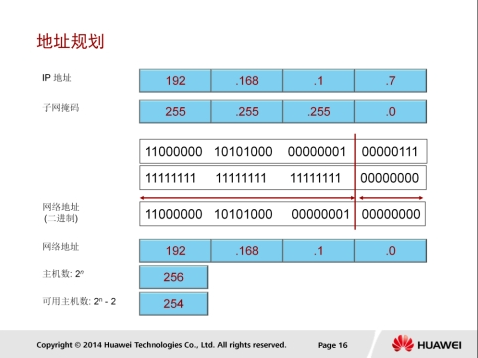

通过子网掩码可以判断主机所属的网段、网段上的广播地址、以及网段上支持的主机数。

图中这个例子，主机地址为192.168.1.7，子网掩码为24位（C类IP地址的缺省掩码），从中我们可以判断该主机位于
192.168.1.0/24网段。将IP地址中的主机位全部置为1，并转换为十进制数，即可得到该网段的广播地址192.168.1.255。网段中支持的主机数为2^n, n为主机位的个数。本例中n=8，2^8=256，减去本网段的网络地址和广播地址，可知该网段支持254个有效主机地址。

#### 默认子网掩码

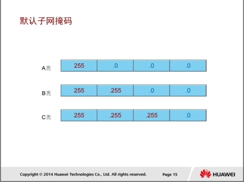

每类IP地址有一个缺省子网掩码。

* A类地址的缺省子网掩码为8位，即第一个字节表示网络位，其他三个字节表示主机位。
* B类地址的缺省子网掩码为16位，因此B类地址支持更多的网络，但是主机数也相应减少。
* C类地址的缺省子网掩码为24位，支持的网络最多，同时也限制了单个网络中主机的数量。

#### 默认子网缺陷

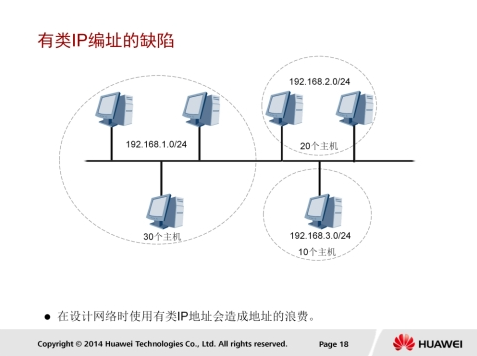

如果企业网络中希望通过规划多个网段来隔离物理网络上的主机，使用缺省子网掩码就会存在一定的局限性。网络中划分多个网段后，每个网段中的实际主机数量可能很有限，导致很多地址未被使用。如图所示的场景下，如果使用缺省子网掩码的编址方案，则地址使用率很低。

#### 变长子网掩码

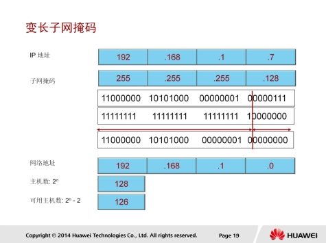

缺省子网掩码可以进一步划分，成为变长子网掩码（VLSM）。通过改变子网掩码，可以将网络划分为多个子网。

本例中的地址为C类地址，缺省子网掩码为24位。现借用一个主机位作为网络位，借用的主机位变成子网位。一个子网位有两个取值0和1，因此可划分两个子网。该比特位设置为0，则子网号为0，该比特位设置为1，则子网号为128。将剩余的主机位都设置为0，即可得到划分后的子网地址；将剩余的主机位都设置为1，即可得到子网的广播地址。每个子网中支持的主机数为2^7-2（减去子网地址和广播地址），即126个主机地址。

### 无类域间路由

无类域间路由CIDR（Classless Inter Domain Routing）由RFC1817定义。

CIDR突破了传统IP地址的分类边界，将路由表中的若干条路由汇聚为一条路由，减少了路由表的规模，提高了路由器的可扩展性。
如上图所示，一个企业分配到了一段A类网络地址，10.24.0.0/22。该企业准备把这些A类网络分配给各个用户群，目前已经分配了四个网段给用户。如果没有实施CIDR技术，企业路由器的路由表中会有四条下连网段的路由条目，并且会把它通告给其他路由器。

通过实施CIDR技术，我们可以在企业的路由器上把这四条路由10.24.0.0/24，10.24.1.0/24，10.24.2.0/24，10.24.3.0/24汇聚成一条路由10.24.0.0/22。这样，企业路由器只需通告10.24.0.0/22这一条路由，大大减少了路由表的规模。

### 网关

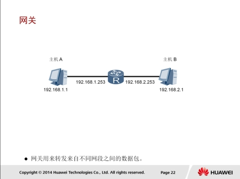

报文转发过程中，首先需要确定转发路径以及通往目的网段的接口，然后将报文封装在以太帧中通过指定的物理接口转发出去。如果目的主机与源主机不在同一网段，报文需要先转发到网关，然后通过网关将报文转发到目的网段。

网关是指接收并处理本地网段主机发送的报文并转发到目的网段的设备。为实现此功能，网关必须知道目的网段的IP地址。

网关设备上连接本地网段的接口地址即为该网段的网关地址。

### IP包分片

网络中转发的IP报文的长度可以不同，但如果报文长度超过了数据链路所支持的最大长度，则报文需要分割成若干个较小的片段才能够在链路上传输。将报文分割成多个片段的过程叫做分片。

* 接收端根据分片报文中的标识符（Identification），标志（Flags)，及片偏移（Fragment Offset）字段对分片报文进行重组。
* 标识符用于识别属于同一个数据包的分片，以区别于同一主机或其他主机发送的其它数据包分片，保证分片被正确的重新组合。
* 标志字段用于判断是否已经收到最后一个分片。
  * 最后一个分片的标志字段设置为0，其他分片的标志字段设置为1
  * 目的端在收到标志字段为0的分片后，开始重组报文。
* 片偏移字段表示每个分片在原始报文中的位置。
  * 第一个分片的片偏移为0，第二个分片的片偏移表示紧跟第一个分片后的第一个比特的位置。
  * 比如，如果首片报文包含1259比特，那么第二片报文的片偏移字段值就应该为1260。

### 生存时间

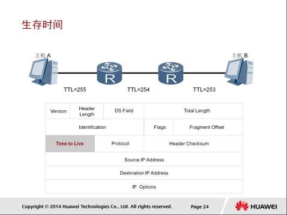

报文在网段间转发时，如果网络设备上的路由规划不合理，就可能会出现环路，导致报文在网络中无限循环，无法到达目的端。环路发生后，所有发往这个目的地的报文都会被循环转发，随着这种报文逐渐增多，网络将会发生拥塞。

为避免环路导致的网络拥塞，IP报文头中包含一个生存时间TTL（TimeTo Live）字段。报文每经过一台三层设备，TTL值减1。

初始TTL值由源端设备设置。当报文中的TTL降为0时，报文会被丢弃。同时，丢弃报文的设备会根据报文头中的源IP地址向源端发送ICMP错误消息。

### 协议号

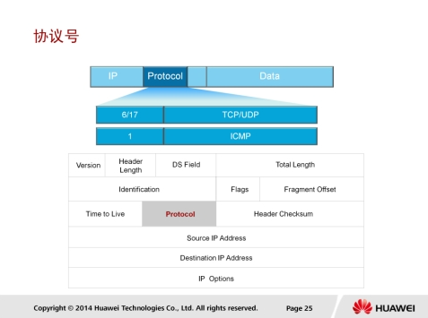

目的端的网络层在接收并处理报文以后，需要决定下一步对报文该做如何处理。IP报文头中的协议字段标识了将会继续处理报文的协议。

与以太帧头中的Type字段类似，协议字段也是一个十六进制数。该字段可以标识网络层协议，如ICMP（Internet Control Message Protocol，因特网控制报文协议），也可以标识上层协议，如TCP（TransmissionControl Protocol ， 传输控制协议 ， 对应值 0x06 ） 、 UDP （ User Datagram Protocol，用户数据报协议，对应值0x11）。

## ICMP协议

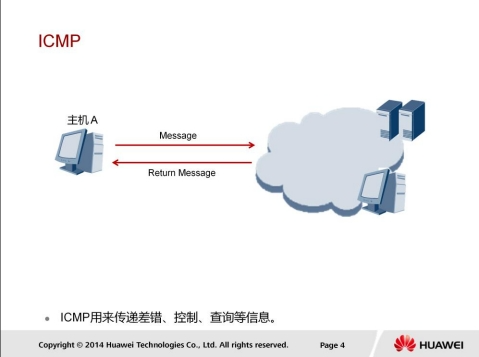

ICPM（Internet Control Message Protocol）是TCP/IP协议簇的核心协议之一，它用于在IP网络设备之间发送控制报文，传递差错、控制、查询等信息。

### ICMP重定向

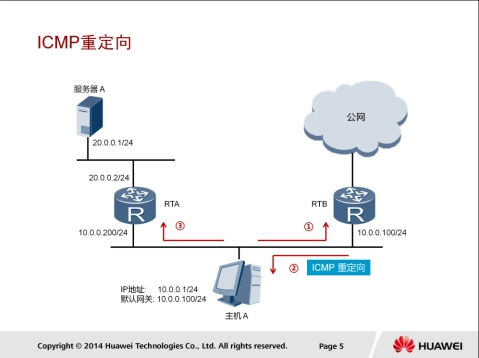

ICMP Redirect重定向消息用于支持路由功能。

如图所示，主机A希望发送报文到服务器A，于是根据配置的默认网关地址向网关RTB发送报文。网关RTB收到报文后，检查报文信息，发现报文应该转发到不源主机在同一网段的另一个网关设备RTA，因为此转发路径是更优的路径。所以RTB会向主机发送一个Redirect消息，通知主机直接向另一个网关RTA发送该报文。主机收到Redirect消息后，向RTA发送报文，RTA会
将报文转发给服务器A。

### ICMP差错检测

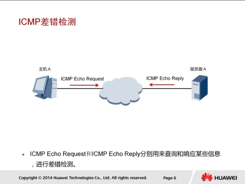

ICMP Echo消息常用于诊断源和目的之间的网络连通性，还可以提供其他信息，如报文往返时间等。

### ICMP错误报告

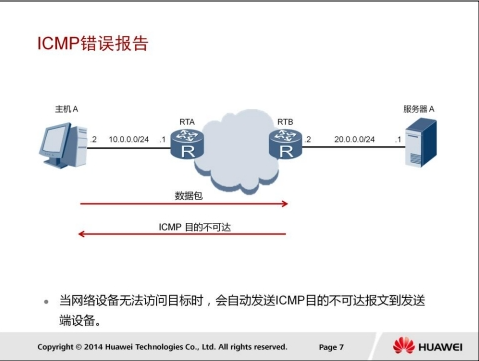

ICMP定义了各种错误消息，用于诊断网络连接性问题；根据这些错误消息，源设备可以判断出数据传输失败的原因。

* 比如，如果网络中发生了环路，导致报文在网络中循环，最终TTL超时，这种情况下网络设备会发送TTL超时消息给发送端设备。
* 又比如如果目的不可达，则中间的网络设备会发送目的不可达消息给发送端设备。目的不可达的情况有多种
  * 如果是网络设备无法找到目的网络，则发送目的网络不可达消息。
  * 如果网络设备无法找到目的网络中的目的主机，则发送目的主机不可达消息。

### ICMP数据包格式

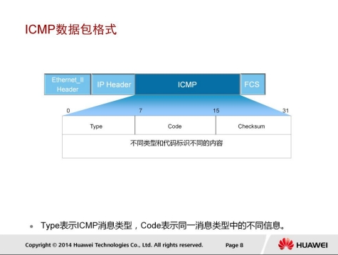

ICMP消息封装在IP报文中。ICMP消息的格式取决于Type和Code字段，其中Type字段为消息类型，Code字段包含该消息类型的具体参数。后面的校验和字段用于检查消息是否完整。

消息中包含32比特的可变参数，这个字段一般不使用，通常设置为0。

在ICMP Redirect消息中，这个字段用来指定网关IP地址，主机根据这个地址将报文重定向到指定网关。

在Echo请求消息中，这个字段包含标识符和序号，源端根据这两个参数将收到的回复消息不本端发送的Echo请求消息进行关联。尤其是当源端向目的端发送了多个Echo请求消息时，需要根据标识符和序号将Echo请求和回复进行一一对应。

### 消息类型和编码类型

ICMP定义了多种消息类型，用于不同的场景。

有些消息不需要Code字段来描述具体类型参数，仅用Type字段表示消息类型。

* 比如，ICMP Echo回复消息的Type字段设置为0。

有些ICMP消息使用Type字段定义消息大类，用Code字段表示消息的具体类型。

* 比如，类型为3的消息表示目的不可达，

不同的Code值表示不可达的原因

* 目的网络不可达(Code=0)
* 目的主机不可达(Code=1)
* 协议不可达（Code=2）
* 目的TCP/UDP端口不可达(Code=3)
* ......

### ICMP应用-Ping

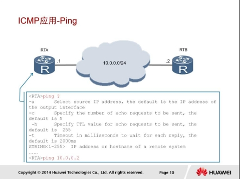

Ping是检测网络连通性的常用工具，同时也能够收集其他相关信息。用户可以在Ping命令中指定不同参数，如ICMP报文长度、发送的ICMP报文个数、等待回复响应的超时时间等，

设备根据配置的参数来构造并发送ICMP报文，进行Ping测试。

Ping常用的配置参数说明如下：

1. -a source-ip-address指定发送ICMP ECHO-REQUEST报文的源IP地
   址。如果不指定源IP地址，将采用出接口的IP地址作为ICMP ECHOREQUEST报文发送的源地址。
2. -c count指定发送ICMP ECHO-REQUEST报文次数。缺省情况下发送5个ICMP ECHO-REQUEST报文。
3. -h ttl-value指定TTL的值。缺省值是255。
4. -t timeout指定发送完ICMP ECHO-REQUEST后，等待ICMP ECHOREPLY的超时时间。

Ping命令的输出信息中包括目的地址、ICMP报文长度、序号、TTL值、以及往返时间。序号是包含在Echo回复消息（Type=0）中的可变参数字段，TTL和往返时间包含在消息的IP头中。

### ICMP应用-Tracert

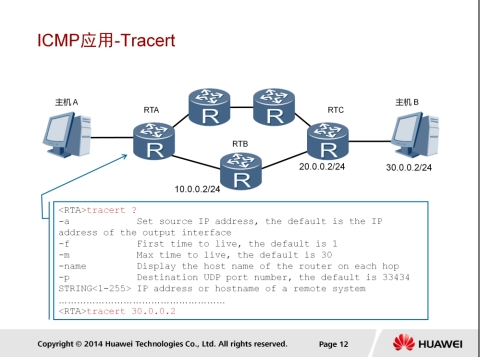

Tracert基于报文头中的TTL值来逐跳跟踪报文的转发路径。

* 为了跟踪到达某特定目的地址的路径，源端首先将报文的TTL值设置为1。该报文到达第一个节点后，TTL超时，于是该节点向源端发送TTL超时消息，消息中携带时间戳。
* 然后源端将报文的TTL值设置为2，报文到达第二个节点后超时，该节点同样返回TTL超时消息。
* 以此类推，直到报文到达目的地。
* 这样，源端根据返回的报文中的信息可以跟踪到报文经过的每一个节点，并根据时间戳信息计算往返时间。

Tracert是检测网络丢包及时延的有效手段，同时可以帮助管理员发现网络中的路由环路。

Tracert常用的配置参数说明如下：

1. -a source-ip-address指定tracert报文的源地址。
2. -f first-ttl指定初始TTL。缺省值是1。
3. -m max-ttl指定最大TTL。缺省值是30。
4. -name使能显示每一跳的主机名。
5. -p port指定目的主机的UDP端口号。

源端（RTA）向目的端（主机B）发送一个UDP报文，TTL值为1，目的UDP端口号是大于30000的一个数，因为在大多数情况下，大于30000的UDP端口号是任何一个应用程序都不可能使用的端口号。

第一跳（RTB）收到源端发出的UDP报文后，判断出报文的目的IP地址不是本机IP地址，将TTL值减1后，判断出TTL值等于0，则丢弃报文并向源端发送一个ICMP超时（Time Exceeded）报文（该报文中含有第一跳的IP地址10.0.0.2），这样源端就得到了RTB的地址。源端收到RTB的ICMP超时报文后，再次向目的端发送一个UDP报文，TTL值为2。

第二跳（RTC）收到源端发出的UDP报文后，回应一个ICMP超时报文，这样源端就得到了RTC的地址（20.0.0.2）。

以上过程不断进行，直到目的端收到源端发送的UDP报文后，判断出目的IP地址是本机IP地址，则处理此报文。根据报文中的目的UDP端口号寻找占用此端口号的上层协议，因目的端没有应用程序使用该UDP端口号，则向源端返回一个ICMP端口不可达（Destination Unreachable）报文。

源端收到ICMP端口不可达报文后，判断出UDP报文已经到达目的端，则停止Tracert程序，从而得到数据报文从源端到目的端所经历的路径（10.0.0.2；20.0.0.2；30.0.0.2）。

## ARP协议

一台网络设备要发送数据给另一台网络设备时，必须要知道对方的IP地址。但是，仅有IP地址是不够的，因为IP数据报文必须封装成帧才能通过数据链路进行发送，而数据帧必须要包含目的MAC地址，因此发送端还必须获取到目的MAC地址。

每一个网络设备在数据封装前都需要获取下一跳的MAC地址。IP地址由网络层来提供，MAC地址通过ARP协议来获取。ARP协议是TCP/IP协议簇中的重要组成部分，ARP能够通过目的IP地址发现目标设备的MAC地址，从而实现数据链路层的可达性。

### ARP数据包格式

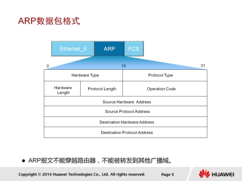

网络设备通过ARP报文来发现目的MAC地址。ARP报文中包含以下字段：

* Hardware Type表示硬件地址类型，一般为以太网；
* Protocol Type表示三层协议地址类型，一般为IP；
* Hardware Length和Protocol Length为MAC地址和IP地址的长度，单位是字节；
* Operation Code指定了ARP报文的类型，包括ARP request和ARP reply；
* Source Hardware Address指的是发送ARP报文的设备MAC地址；
* Source Protocol Address指的是发送ARP报文的设备IP地址；
* Destination Hardware Address指的是接收者MAC地址，在ARP request报文中，该字段值为0；
* Destination Protocol Address指的是指接收者的IP地址。

### ARP工作过程

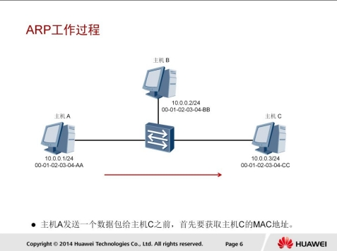

通过ARP协议，网络设备可以建立目标IP地址和MAC地址之间的映射。网络设备通过网络层获取到目的IP地址之后，还要判断目的MAC地址是否已知。

### ARP缓存

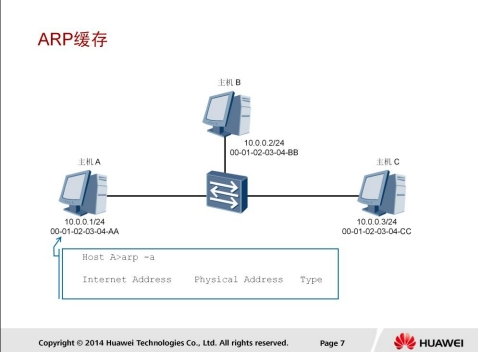

网络设备一般都有一个ARP缓存（ARP Cache），ARP缓存用来存放IP地址和MAC地址的关联信息。

在发送数据前，设备会先查找ARP缓存表。如果缓存表中存在对方设备的MAC地址，则直接采用该MAC地址来封装帧，然后将帧发送出去。

如果缓存表中不存在相应信息，则通过发送ARP request报文来获得它。学习到的IP地址和MAC地址的映射关系会被放入ARP缓存表中存放一段时间。

在有效期内，设备可以直接从这个表中查找目的MAC地址来进行数据封装，而无需进行ARP查询。

过了有效期，ARP表项会被自动删除。

如果目标设备位于其他网络，则源设备会在ARP缓存表中查找网关的MAC地址，然后将数据发送给网关，网关再把数据转发给目的设备。

### ARP请求

本例中，主机A的ARP缓存表中不存在主机C的MAC地址，所以主机A会发送ARP request来获取目的MAC地址。

ARP request报文封装在以太帧里。帧头中的源MAC地址为发送端主机A的MAC地址。

此时，由于主机A不知道主机C的MAC地址，所以目的MAC地址为广播地址FF-FFFF-FF-FF-FF。

ARP request报文中包含源IP地址、目的IP地址、源MAC地址、目的MAC地址，其中目的MAC地址的值为0。

ARP Request报文会在整个网络上传播，该网络中所有主机包括网关都会接收到此ARP request报文。网关将会阻止该报文发送到其他网络上。

### ARP响应

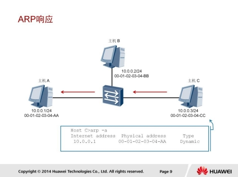

所有的主机接收到该ARP Request报文后，会检查它的目的协议地址字段与自身的IP地址是否匹配。

* 如果不匹配，则该主机将不会响应该ARP Request报文。
* 如果匹配，则该主机会将ARP报文中的源MAC地址和源IP地址信息记录到自己的ARP缓存表中，然后通过ARP Reply报文进行响应。

### 响应和缓存

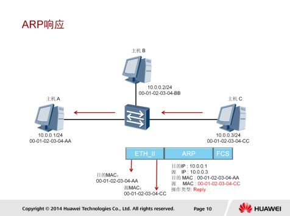

主机C会向主机A回应ARP Reply报文。ARP Reply报文中的源协议地址是主机C自己的IP地址，目标协议地址是主机A的IP地址，目的MAC地址是主机 A 的 MAC 地 址 ， 源 MAC 地址是自己的 MAC 地 址 ， 同 时Operation Code被设置为reply。ARP Reply报文通过单播传送。

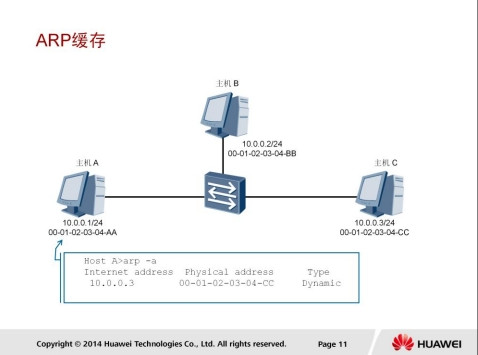

主机A收到ARP Reply以后，会检查ARP报文中目的MAC地址是否与自己的MAC匹配。如果匹配，ARP报文中的源MAC地址和源IP地址会被记录到主机A的ARP缓存表中。ARP表项的老化超时时间缺省为1200秒。

### ARP代理

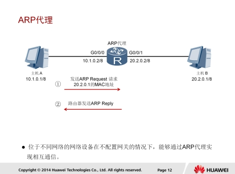

在上述例子的组网中，主机A需要与主机B通信时，目的IP地址与本机的IP地址位于不同网络，但是由于主机A未配置网关，所以它将会以广播形式发送ARP Request报文，请求主机B的MAC地址。但是，广播报文无法被路由器转发，所以主机B无法收到主机A的ARP请求报文，当然也就无法应答。

在路由器上启用代理ARP功能，就可以解决这个问题。启用代理ARP后，路由器收到这样的请求，会查找路由表，如果存在主机B的路由表项，路由器将会使用自己的G0/0/0接口的MAC地址来回应该ARP request。主机A收到ARP reply后，将以路由器的G0/0/0接口MAC地址作为目的MAC地址进行数据转发。

### 免费ARP

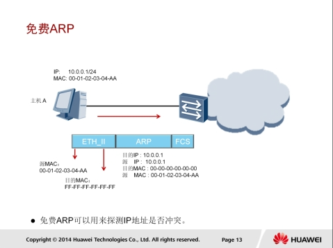

主机被分配了IP地址或者IP地址发生变更后，必须立刻检测其所分配的IP地址在网络上是否是唯一的，以避免地址冲突。主机通过发送ARP request报文来进行地址冲突检测。

主机A将ARP Request广播报文中的目的IP地址字段设置为自己的IP地址，该网络中所有主机包括网关都会接收到此报文。当目的IP地址已经被某一个主机或网关使用时，该主机或网关就会回应ARP reply报文。通过这种方式，主机A就能探测到IP地址冲突了。

## 传输层协议

### TCP

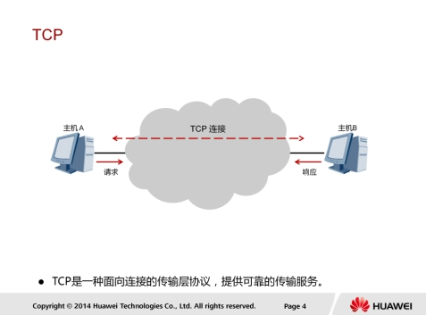

TCP位于TCP/IP模型的传输层，它是一种面向连接的端到端协议。TCP作为传输控制协议，可以为主机提供可靠的数据传输。TCP需要依赖网络协议为主机提供可用的传输路径。在本例中，两台主机在通信之前，需要TCP在它们之间建立可靠的传输通道。

#### TCP端口号

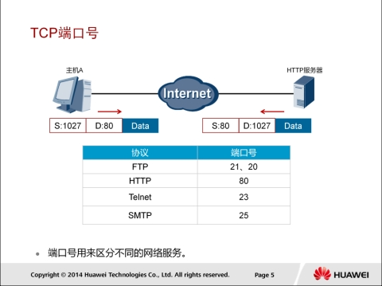

TCP允许一个主机同时运行多个应用进程。每台主机可以拥有多个应用端口，每对端口号、源和目标IP地址的组合唯一地标识了一个会话。端口分为知名端口和动态端口。

* 知名端口：有些网络服务会使用固定的端口，端口号范围为0-1023。如FTP、HTTP、Telnet、SNMP服务均使用知名端口。
* 动态端口：动态端口号范围从1024到65535，这些端口号一般不固定分配给某个服务，也就是说许多服务都可以使用这些端口。只要运行的程序向系统提出访问网络的申请，那么系统就可以从这些端口号中分配一个供该程序使用。

#### TCP头部

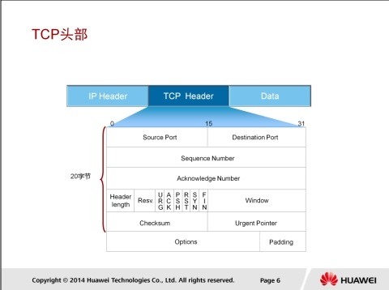

TCP通常使用IP作为网络层协议,这时TCP数据段被封装在IP数据包内。

TCP数据段由TCP Header（头部）和TCP Data（数据）组成。TCP最多可以有60个字节的头部，如果没有Options字段，正常的长度是20字节。

TCP Header是由如上图标识一些字段组成，这里列出几个常用字段。

1. 16位源端口号：源主机的应用程序使用的端口号。
2. 16位目的端口号：目的主机的应用程序使用的端口号。每个TCP头部都包含源和目的端的端口号，这两个值加上IP头部中的源IP地址和目的IP地址可以唯一确定一个TCP连接。
3. 32位序列号：用于标识从发送端发出的不同的TCP数据段的序号。数据段在网络中传输时，它们的顺序可能会发生变化；接收端依据此序列号，便可按照正确的顺序重组数据。
4. 32位确认序列号：用于标识接收端确认收到的数据段。确认序列号为成功收到的数据序列号加1。
5. 4位头部长度：表示头部占32bit字的数目，它能表达的TCP头部最大长度为60字节。
6. 16位窗口大小：表示接收端期望通过单次确认而收到的数据的大小。由于该字段为16位，所以窗口大小的最大值为65535字节，该机制通常用来进行流量控制。
7. 16位校验和：校验整个TCP报文段，包括TCP头部和TCP数据。该值由发送端计算和记录并由接收端进行验证。

#### TCP建立连接过程

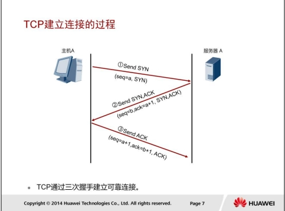

TCP是一种可靠的，面向连接的全双工传输层协议。

TCP连接的建立是一个三次握手的过程。如图所示：

1. 主机A（通常也称为客户端）发送一个标识了SYN的数据段，表示期望与服务器A建立连接，此数据段的序列号（seq）为a。
2. 服务器A回复标识了SYN+ACK的数据段，此数据段的序列号（seq）为b，确认序列号为主机A的序列号加1（a+1），以此作为对主机A的SYN报文的确认。
3. 主机A发送一个标识了ACK的数据段，此数据段的序列号（seq）为a+1，确认序列号为服务器A的序列号加1（b+1），以此作为对服务器A的SYN报文段的确认。

#### TCP传输过程

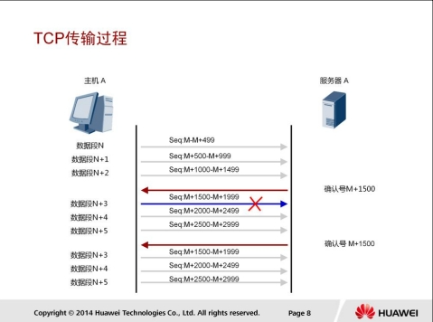

TCP的可靠传输还体现在TCP使用了确认技术来确保目的设备收到了从源设备发来的数据，并且是准确无误的。

确认技术的工作原理如下：

* 目的设备接收到源设备发送的数据段时，会向源端发送确认报文，源设备收到确认报文后，继续发送数据段，如此重复。

如图所示，主机A向服务器A发送TCP数据段，为描述方便假定每个数据段的长度都是500个字节。当服务器A成功收到序列号是M+1499的字节以及之前的所有字节时，会以序列号M+1499+1=M+1500进行确认。另外，由于数据段N+3传输失败，所以服务器A未能收到序列号为M+1500的字节，因此服务器A还会再次以序列号M+1500进行确认。

#### TCP流量控制

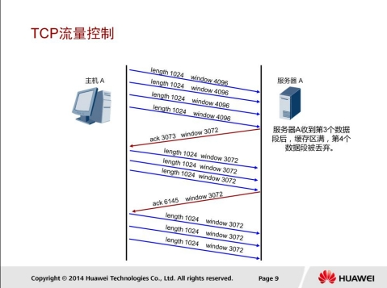

TCP滑动窗口技术通过动态改变窗口大小来实现对端到端设备之间的数据传输进行流量控制。

如图所示，主机A和服务器A之间通过滑动窗口来实现流量控制。为方便理解，此例中只考虑主机A发送数据给服务器A时，服务器A通过滑动窗口进行的流量控制。

* 主机A向服务器发送4个长度为1024字节的数据段，其中主机的窗口大小为4096个字节。
* 服务器A收到第3个数据段后，缓存区满，第4个数据段被丢弃。
* 服务器以ACK3073响应，窗口大小调整为3072，表明服务器的缓冲区只能处理3072个字节的数据段。
* 于是主机A改变其发送速率，发送窗口大小为3072的数据段。

#### TCP关闭连接

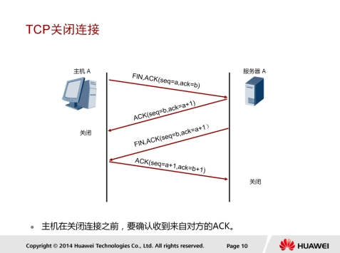

TCP支持全双工模式传输数据，这意味着同一时刻两个方向都可以进行数据的传输。在传输数据之前，TCP通过三次握手建立的实际上是两个方向的连接，因此在传输完毕后，两个方向的连接必须都关闭。TCP连接的建立是一个三次握手的过程，而TCP连接的终止则要经过四次握手。

如图所示：

1. 主机A想终止连接，于是发送一个标识了FIN，ACK的数据段，序列号为a，确认序列号为b。
2. 服务器A回应一个标识了ACK的数据段，序列号为b，确认序号为a+1，作为对主机A的FIN报文的确认。
3. 服务器A想终止连接，于是向主机A发送一个标识了FIN，ACK的数据段，序列号为b，确认序列号为a+1。
4. 主机A回应一个标识了ACK的数据段，序列号为a+1，确认序号为b+1，作为对服务器A的FIN报文的确认。以上四次交互便完成了两个方向连接的关闭。

### UDP

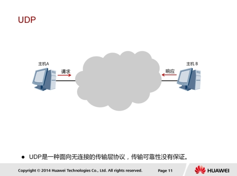

当应用程序对传输的可靠性要求不高，但是对传输速度和延迟要求较高时，可以用UDP协议来替代TCP协议在传输层控制数据的转发。

UDP将数据从源端发送到目的端时，无需事先建立连接。UDP采用了简单、易操作的机制在应用程序间传输数据，没有使用TCP中的确认技术或滑动窗口机制，因此UDP不能保证数据传输的可靠性，也无法避免接收到重复数据的情况。

#### UDP头部

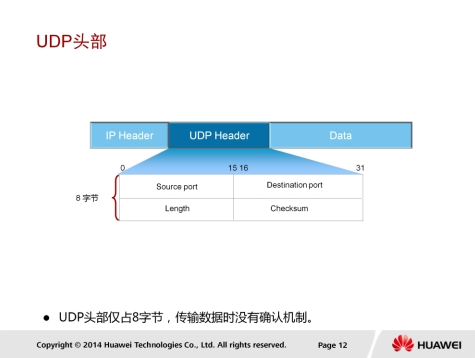

UDP报文分为UDP报文头和UDP数据区域两部分。报头由源端口、目的端口、报文长度以及校验和组成。

UDP适合于实时数据传输，如语音和视频通信。相比于TCP，UDP的传输效率更高、开销更小，但是无法保障数据传输的可靠性。

UDP头部的标识如下：

1. 16位源端口号：源主机的应用程序使用的端口号。
2. 16位目的端口号：目的主机的应用程序使用的端口号。
3. 16位UDP长度：是指UDP头部和UDP数据的字节长度。因为UDP头部长度为8字节，所以该字段的最小值为8。
4. 16位UDP校验和：该字段提供了不TCP校验字段同样的功能；该字段是可选的。

#### UDP传输过程

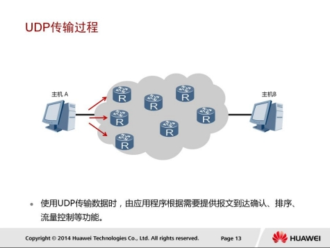

主机A发送数据包时，这些数据包是以有序的方式发送到网络中的，每个数据包独立地在网络中被发送，所以不同的数据包可能会通过不同的网络路径到达主机B。

这样的情况下，先发送的数据包不一定先到达主机B。因为UDP数据包没有序号，主机B将无法通过UDP协议将数据包按照原来的顺序重新组合，所以此时需要应用程序提供报文的到达确认、排序和流量控制等功能。通常情况下，UDP采用实时传输机制和时间戳来传输语音和视频数据。

UDP适合传输对延迟敏感的流量，如语音和视频。在使用TCP协议传输数据时，如果一个数据段丢失或者接收端对某个数
据段没有确认，发送端会重新发送该数据段。TCP重新发送数据会带来传输延迟和重复数据，降低了用户的体验。对于迟延敏感的应用，少量的数据丢失一般可以被忽略，这时使用UDP传输将能够提升用户的体验。

## 数据转发过程

数据可以在同一网络内或者不同网络间传输，数据转发过程也分为本地转发和远程转发，但两者的数据转发原理是基本一样的，都是遵循TCP/IP协议簇。

本示例中，主机A需要访问服务器A的Web服务，并且假定两者之间已经建立了TCP连接。接下来会以此示例来讲解数据在不同网络间的传输过程。

### TCP封装

主机A会对待发送的应用数据首先执行加密和压缩等相关操作，之后进行传输层封装。Web应用是基于传输层的TCP协议传输数据的。

主机A使用TCP进行报文封装时，必须填充源端口和目的端口字段，初始序列号和确认序列号字段，标识位，窗口字段以及校验和字段。

此例中数据段的源端口号为主机A随机选择的1027号端口，目的端口号为服务器A的TCP知名端口80。

### IP封装

主机A完成传输层封装后，一般会进行网络层数据封装，在使用IP进行封装时，需要明确IP报文的源和目的地址。

如果IP报文的大小大于网络的最大传输单元（MTU），则该报文有可能在传输过程中被分片。

生存时间（TTL）字段用来减少网络环路造成的影响。ARG3系列路由器产生的数据包，默认TTL值为255。路由器转发一个数据包时，该值会被减1，如果路由器发现该值被减为0，就会丢弃该数据包。这样，即使网络中存在环路，数据包也不会在网络上一直被转发。

协议字段标识了传输层所使用的协议。本例中，传输层使用的是TCP协议，所以该字段的填充值为0X06。

### 查找路由

每个主机都会独自维护各自的路由表项。

主机A在发送数据前需要先检查是否能够到达目的端，这个过程是通过查找路由来完成的。

在此示例中，主机A拥有一条到达“任何网络”（在IP编址部分已经简要介绍过）的路由，它发往其他网络的数据都会通过IP地址为10.1.1.1的接口转发到下一跳，即网关10.1.1.254。

### ARP

接下来，由于数据包要被封装成数据帧，所以主机A需要获取下一跳的MAC地址，也就是网关的MAC地址。主机首先会查询ARP缓存表。

本例中，主机A的ARP缓存表中存在网关MAC地址的表项。如果没有查找到网关的MAC地址表项，主机A会通过发送ARP请求来获取网关的MAC地址。

### 以太网封装

主机A在链路层封装数据帧时，会遵循IEEE 802.3或Ethernet_II标准，Ethernet_II帧头中的类型字段填充为0x0800，以表示网络层使用的是IP协议。源MAC地址为主机A的MAC地址，目的MAC地址为网关路由器E0/0接口的MAC地址。

### 数据帧转发过程

主机A工作在半双工状态下，所以会使用CSMA/CD来检测链路是否空闲。

如果链路空闲，主机A会将一个前导码(Preamble)和一个帧首定界符（SFD）附加到帧头然后进行传输。

前导码的作用是使接收设备进行同步并做好接收数据帧的准备。前导码是包括了7个字节的二进制“1”、“0”交替的代码，即1010…10共56位。

帧首定界符是长度为1个字节的10101011二进制序列，它的作用是使接收端对帧的第一位进行定位。

本例中，主机A发送数据帧到共享以太网，此网络中的所有网络设备都会收到该帧。

设备收到帧之后，首先会进行FCS校验。如果FCS校验未能通过，则帧被立即丢弃。

对于通过了FCS校验的帧，设备会检查帧中的目的MAC地址。

如果帧中的目的MAC地址与自己的MAC地址不同，设备将丢弃帧，如果相同，则会继续处理。

处理过程中，帧头帧尾会被剥去（也就是解封装），剩下的数据报文会被根据帧头中的类型字段的值来送到网络层中的对应协议模块去处理。

### 数据包转发过程

RTA收到此数据报文后，网络层会对该报文进行处理。

RTA首先根据IP头部信息中的校验和字段，检查IP数据报文头部的完整性，然后根据目的IP地址查看路由表，确定是否能够将数据包转发到目的端。

RTA还必须对TTL的值进行处理。另外，报文大小不能超过MTU值。如果报文大小超过MTU值，则报文将被分片。

网络层处理完成后，报文将被送到数据链路层重新进行封装，成为一个新的数据帧，该帧的头部会封装新的源MAC地址和目的MAC地址。如果当前网络设备不知道下一跳的MAC地址，将会使用ARP来获得。

### 数据帧解封装

该示例中，服务器A处于一个共享以太网中，两台服务器都会收到RTB发送的数据帧。

该帧的目的MAC地址与服务器B的接口MAC地址不匹配，所以会被服务器B丢弃。

服务器A成功收到该帧，并通过FCS校验。服务器A将利用帧中的类型字段来识别在网络层处理该数据的协议。

该示例中，服务器A会将解封装后的此数据交给网络层的IP协议来进行处理。

### 数据包解封装

服务器A通过IP协议来处理该报文，首先会通过校验和字段来验证报文头的完整性，然后检查IP报文头中的目的IP地址是否与自己当前的IP地址匹配。

如果在源与目的之间的数据传输期间数据发生了报文分片，则报文会被目的端重新组合。

标识字段用于标识属于同一数据源的分片报文，偏移量表示该分片在原分组中的相对位置。标志字段目前只有两位有意义，标志字段最低位为1表示后面还有分片，为0表示这已经是最后一个数据片；中间一位为1表示不能分片，为0表示允许分片。所有的分片报文必须被目的端全部接收到后才会进行重新组合。

协议字段表示此数据包携带的上层数据是哪种协议的数据。需要注意的是，下一个报头并非总是传输层报头。例如，ICMP报文也是使用IP协议封装，协议字段值为0x01。

### 数据段解封

当IP报文头被处理完并剥离后，数据段会被发送到传输层进行处理。

在此示例中，传输层协议使用的是TCP，且发送端和接收端已经通过三次握手建立了连接。传输层收到该数据段后，TCP协议会查看并处理该数据段头部信息，其中目的端口号为80，用于表示处理该数据的应用层协议为HTTP协议。TCP处理完头部信息后会将此数据段头部进行剥离，然后将剩下的应用数据发送到HTTP协议进行处理。

## Reference Links：

http://bbs.hh010.com/
