## HDLC和PPP原理与配置

### 串行链路的数据传输方式

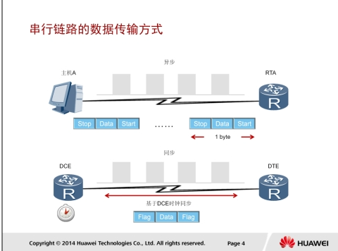

串行链路普遍用于广域网中。串行链路中定义了两种数据传输方式：异步和同步。

* 异步传输是以字节为单位来传输数据，并且需要采用额外的起始位和停止位来标记每个字节的开始和结束。起始位为二进制值0，停止位为二进制值1。在这种传输方式下，开始和停止位占据发送数据的相当大的比例，每个字节的发送都需要额外的开销。
* 同步传输是以帧为单位来传输数据，在通信时需要使用时钟来同步本端和对端的设备通信。DCE即数据通信设备，它提供了一个用于同步DCE设备和DTE设备之间数据传输的时钟信号。DTE即数据终端设备，它通常使用DCE产生的时钟信号。

### HDLC协议应用

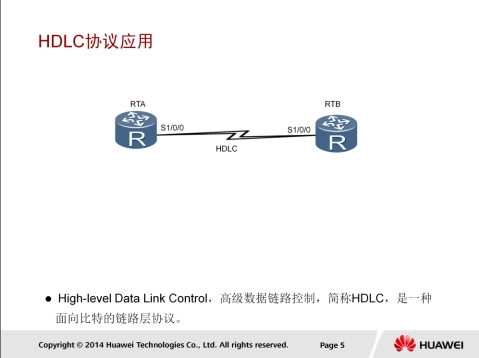

ISO制定的HDLC是一种面向比特的通信规则。HDLC传送的信息单位为帧。作为面向比特的同步数据控制协议的典型，HDLC具有如下特点：

* 协议不依赖于任何一种字符编码集；
* 数据报文可透明传输，用于透明传输的“0比特插入法”易于硬件实现；
* 全双工通信，不必等待确认可连续发送数据，有较高的数据链路传输效率；
* 所有帧均采用CRC校验，并对信息帧进行编号，可防止漏收或重收，传输可靠性高；
* 传输控制功能与处理功能分离，具有较大的灵活性和较完善的控制功能。

### HDLC帧结构

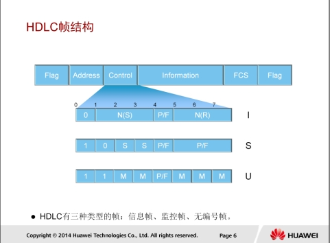

完整的HDLC帧由标志字段（F）、地址字段（A）、控制字段（C）、信息字段（I）、帧校验序列字段（FCS）等组成。

* 标志字段为01111110，用以标志帧的开始与结束，也可以作为帧与帧之间的填充字符。
* 地址字段携带的是地址信息。
* 控制字段用于构成各种命令及响应，以便对链路进行监视与控制。发送方利用控制字段来通知接收方来执行约定的操作；相反，接收方用该字段作为对命令的响应，报告已经完成的操作或状态的变化。
* 信息字段可以包含任意长度的二进制数，其上限由FCS字段或通讯节点的缓存容量来决定，目前用得较多的是1000-2000比特，而下限可以是0，即无信息字段。监控帧中不能有信息字段。
* 帧检验序列字段可以使用16位CRC对两个标志字段之间的内容进行校验。

HDLC有三种类型的帧：

* 信息帧（I帧）用于传送有效信息或数据，通常简称为I帧。
* 监控帧（S帧）用于差错控制和流量控制，通常称为S帧。S帧 的 标志是控制字段的前两个比特位为“10”。S帧不带信息字段，只有6个字节即48个比特。
* 无编号帧（U帧）简称U帧。U帧用于提供对链路的建立、拆除以及多种控制功能。

### HDLC基本配置

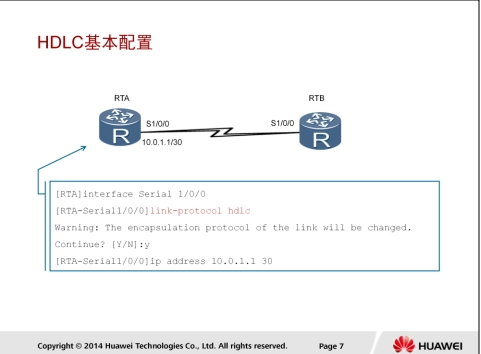

```
interface Serial 1/0/0
link-protocal hdlc
ip address 10.0.1.1 30
```

用户只需要在串行接口视图下运行link-protocol hdlc命令就可以使能接口的HDLC协议。华为设备上的串行接口默认运行PPP协议。用户必须在串行链路两端的端口上配置相同的链路协议，双方才能通信。

### HDLC接口地址借用

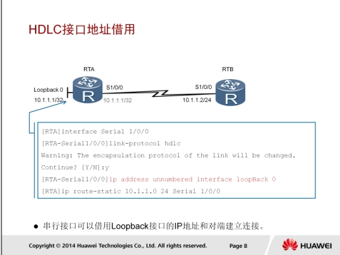

```
interface Serial 1/0/0
link-protocol hdlc
ip address unnumberrd interface loopBack 0
ip route-static 10.1.1.0 23 Serial 1/0/0
```

一个接口如果没有IP地址就无法生成路由，也就无法转发报文。IP地址借用允许一个没有IP地址的接口从其它接口借用IP地址。这样可以避免一个接口独占IP地址，节省IP地址资源。一般建议借用loopback接口的IP地址，因为这类接口总是处于活跃（active）状态，因而能提供稳定可用的IP地址。

本例中，在RTA的S1/0/0接口配置完接口地址借用之后，还需要在RTA上配置静态路由，以使RTA能够转发数据10.1.1.0/24网络。

##### 配置验证

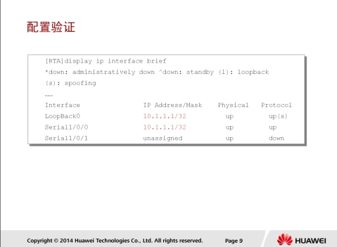

```
display ip interface brief
```

执行display ip interface brief命令可以查看路由器接口简要信息。如果有IP地址被借用，该IP地址会显示在多个接口上，说明借用loopback接口的IP地址成功。

### PPP协议应用

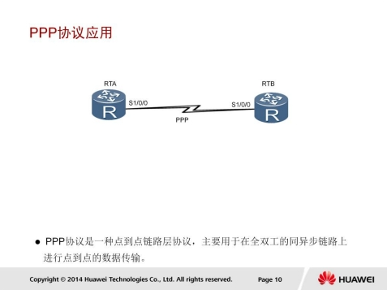

PPP协议是一种点到点链路层协议，主要用于在全双工的同异步链路上进行点到点的数据传输。PPP协议有如下优点：

1. PPP既支持同步传输又支持异步传输，而X.25、FR（Frame Relay）等数据链路层协议仅支持同步传输，SLIP仅支持异步传输。
2. PPP协议具有很好的扩展性，例如，当需要在以太网链路上承载PPP协议时，PPP可以扩展为PPPoE。
3. PPP提供了LCP（Link Control Protocol）协议，用于各种链路层参数的协商。
4. PPP提供了各种NCP（Network Control Protocol）协议（如IPCP、IPXCP），用于各网络层参数的协商，更好地支持了网络层协议。
5. PPP 提 供 了 认 证 协 议 ： CHAP （ Challenge-Handshake Authentication Protocol ） 、 PAP （ Password Authentication Protocol），更好的保证了网络的安全性。
6. 无重传机制，网络开销小，速度快。

### PPP组件

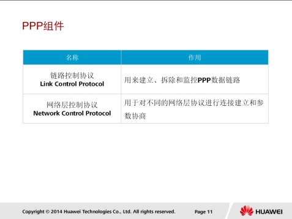

PPP包含两个组件：链路控制协议LCP和网络层控制协议NCP。

* 为了能适应多种多样的链路类型，PPP定义了链路控制协议LCP。LCP可以自动检测链路环境，如是否存在环路；协商链路参数，如最大数据包长度，使用何种认证协议等等。与其他数据链路层协议相比，PPP协议的一个重要特点是可以提供认证功能，链路两端可以协商使用何种认证协议来实施认证过程，只有认证成功之后才会建立连接。
* PPP定义了一组网络层控制协议NCP，每一个NCP对应了一种网络层协议，用于协商网络层地址等参数，例如IPCP用于协商控制IP协议，IPXCP用于协商控制IPX协议等。

### PPP链路建立过程

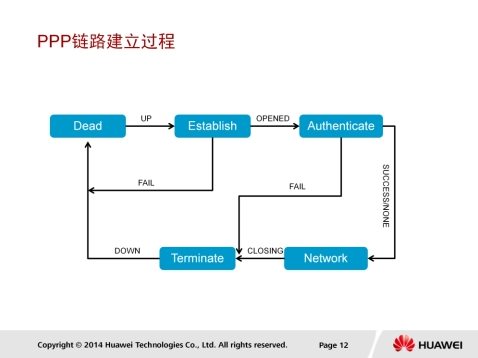

对于PPP链路建立过程的描述如下：

1. Dead阶段也称为物理层不可用阶段。当通信双方的两端检测到物理线路激活时，就会从Dead阶段迁移至Establish阶段，即链路建立阶段。
2. 在Establish阶段，PPP链路进行LCP参数协商。协商内容包括最大接收单元MRU、认证方式、魔术字（Magic Number）等选项。LCP参数协商成功后会进入Opened状态，表示底层链路已经建立。
3. 多数情况下,链路两端的设备是需要经过认证阶段（Authenticate）后才能够进入到网络层协议阶段。PPP链路在缺省情况下是不要求进行认证的。如果要求认证，则在链路建立阶段必须指定认证协议。认证方式是在链路建立阶段双方进行协商的。如果在这个阶段再次收到了Configure-Request报文，则又会返回到链路建立阶段。
4. 在Network阶段，PPP链路进行NCP协商。通过NCP协商来选择和配置一个网络层协议并进行网络层参数协商。只有相应的网络层协议协商成功后，该网络层协议才可以通过这条PPP链路发送报文。如果在这个阶段收到了Configure-Request报文，也会返回到链路建立阶段。
5. NCP协商成功后，PPP链路将保持通信状态。PPP运行过程中，可以随时中断连接，例如物理链路断开、认证失败、超时定时器时间、管理员通过配置关闭连接等动作都可能导致链路进入Terminate阶段。
6. 在Terminate阶段，如果所有的资源都被释放，通信双方将回到Dead阶段，直到通信双方重新建立PPP连接。

### PPP帧格式

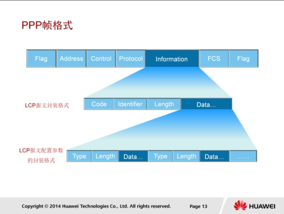

PPP采用了与HDLC协议类似的帧格式：

1. Flag 域标识一个物理帧的起始和结束 ，该字节为二进制序列01111110（0X7E）。
2. PPP帧的地址域跟HDLC帧的地址域有差异，PPP帧的地址域字节固定为11111111 （0XFF），是一个广播地址。
3. PPP数据帧的控制域默认为00000011(0X03)，表明为无序号帧。
4. 帧校验序列（FCS）是个16位的校验和，用于检查PPP帧的完整性。
5. 协议字段用来说明PPP所封装的协议报文类型，典型的字段值有：0XC021代表LCP报文，0XC023代表PAP报文，0XC223代表CHAP报文。
6. 信息字段包含协议字段中指定协议的数据包。数据字段的默认最大长度（不包括协议字段）称为最大接收单元MRU（Maximum Receive Unit），MRU的缺省值为1500字节。

如果协议字段被设为0XC021，则说明通信双方正通过LCP报文进行PPP链路的协商和建立：

1. Code字段，主要是用来标识LCP数据报文的类型。典型的报文类型有：配置信息报文（Configure Packets: 0x01)，配置成功信息报文(Configure-Ack: 0X02)，终止请求报文(Terminate-Request：0X05)。
2. Identifier域为1个字节，用来匹配请求和响应。
3. Length域的值就是该LCP报文的总字节数据。
4. 数据字段则承载各种TLV（Type/Length/Value）参数用于协商配置选项，包括最大接收单元，认证协议等等。

### LCP报文

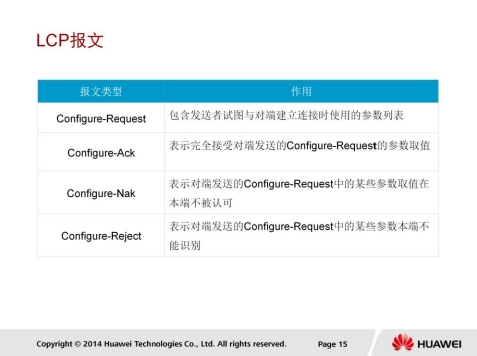

此表格列出了LCP用于链路层参数协商所使用四种报文类型。

1. Configure-Request（配置请求）：链路层协商过程中发送的第一个报文，该报文表明点对点双方开始进行链路层参数的协商。
2. Configure-Ack（配置响应）：收到对端发来的Configure-Request报文，如果参数取值完全接受，则以此报文响应。
3. Configure-Nak （ 配 置 不 响 应 ） ： 收 到 对 端 发 来 的 Configure-Request报文，如果参数取值不被本端认可，则发送此报文并且携带本端可接受的配置参数。
4. Configure-Reject （ 配 置 拒 绝 ） ： 收 到 对 端 发 来 的 Configure-Request报文，如果本端不能识别对端发送的Configure-Request中的某些参数，则发送此报文并且携带那些本端不能认别的配置参数。

### LCP协商参数

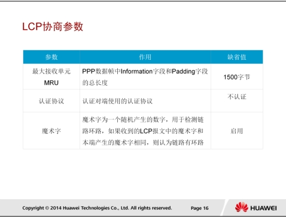

LCP报文携带的一些常见的配置参数有MRU，认证协议，以及魔术字。

1. 在VRP平台上，MRU参数使用接口上配置的最大传输单元（MTU）值来表示。
2. 常用的PPP认证协议有PAP和CHAP，一条PPP链路的两端可以使用不同的认证协议认证对端，但是被认证方必须支持认证方要求使用的认证协议并正确配置用户名和密码等认证信息。
3. LCP使用魔术字来检测链路环路和其它异常情况。魔术字为随机产生的一个数字，随机机制需要保证两端产生相同魔术字的可能性几乎为0。

收到一个Configure-Request报文之后，其包含的魔术字需要和本地产生的魔术字做比较，如果不同，表示链路无环路，则使用Confugure-Ack报文确认（其它参数也协商成功），表示魔术字协商成功。在后续发送的报文中，如果报文含有魔术字字段，则该字段设置为协商成功的魔术字。

### LCP链路参数协商

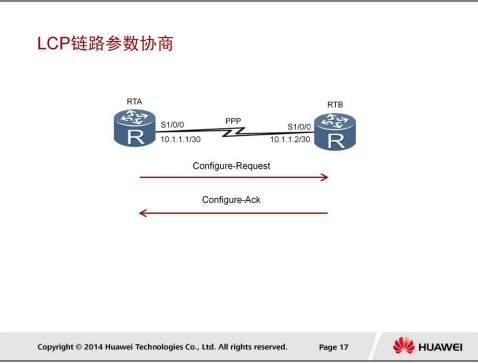

如图所示，RTA和RTB使用串行链路相连，运行PPP。当物理层链路变为可用状态之后，RTA和RTB使用LCP协商链路参数。

本例中，RTA首先发送一个Configure-Request报文，此报文中包含RTA上配置的链路层参数。当RTB收到此Configure-Request报文之后，如果RTB能识别并接受此报文中的所有链路层参数，则向RTA回应一个Configure-Ack报文。

RTA在没有收到Configure-Ack报文的情况下，会每隔3秒重传一次Configure-Request报文，如果连续10次发送Configure-Request报文仍然 没 有 收 到 Configure-Ack 报 文 ， 则 认 为 对 端 不 可 用 ， 停 止 发 送Configure-Request报文。

注：完成上述过程只是表明RTB认为RTA上的链路参数配置是可接受的。RTB也需要向RTA发送Configure-Request报文，使RTA检测RTB上的链路参数是不是可接受的。

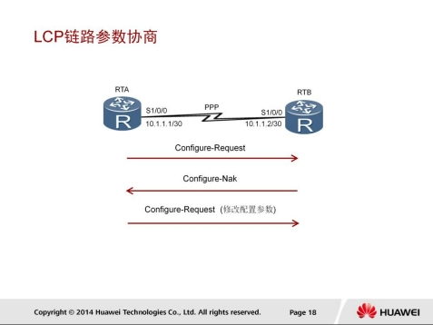

当RTB收到RTA发送的Configure-Request报文之后，如果RTB能识别此报文中携带的所有链路层参数，但是认为部分或全部参数的取值不能接 受 ， 即 参 数 的 取 值 协 商 不 成 功 ， 则 RTB 需 要 向 RTA 回 应 一 个Configure-Nak报文。

在这个Configure-Nak报文中，只包含不能接受的链路层参数，并且此报文所包含的链路层参数均被修改为RTB上可以接受的取值（或取值范围）。

在收到Configure-Nak报文之后，RTA需要根据此报文中的链路层参数重新选择本地配置的其它参数，并重新发送一个Configure-Request。

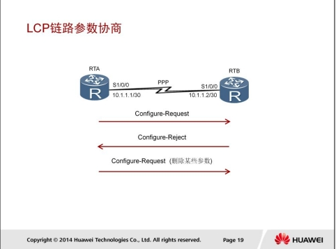

当RTB收到RTA发送的Configure-Request报文之后，如果RTB不能识别此报文中携带的部分或全部链路层参数，则RTB需要向RTA回应一个Configure-Reject报文。在此Configure-Reject报文中，只包含不能被识别的链路层参数。

在收到Configure-Reject报文之后，RTA需要向RTB重新发送一个Configure-Request报文，在新的Configure-Request报文中，不再包含不被对端（RTB）识别的参数。

### PPP基本配置

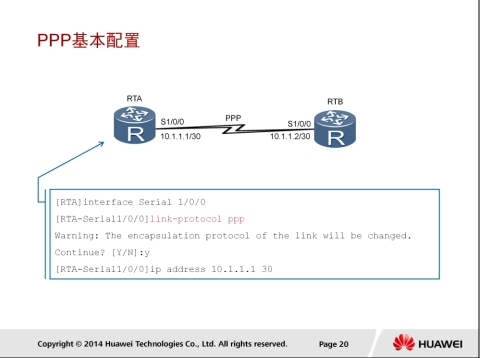

```
interface Serial 1/0/0
link-protocaol ppp
ip address 10.1.1.1 30
```

建立PPP链路之前，必须先在串行接口上配置链路层协议。。如果接口运行的不是PPP协议，需要运行link-protocol ppp命令来使能数据链路层的PPP协议。

### PPP认证模式-PAP

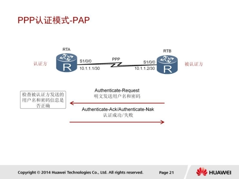

PAP认证的工作原理较为简单。PAP认证协议为两次握手认证协议，密码以明文方式在链路上发送。

LCP协商完成后，认证方要求被认证方使用PAP进行认证。被认证方将配置的用户名和密码信息使用Authenticate-Request报文以明文方式发送给认证方。

认证方收到被认证方发送的用户名和密码信息之后，根据本地配置的用户名和密码数据库检查用户名和密码信息是否匹配，如果匹配，则返回Authenticate-Ack报文，表示认证成功。否则，返回Authenticate-Nak报文，表示认证失败。

### PPP认证模式-CHAP

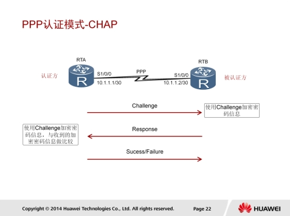

CHAP认证过程需要三次报文的交互。为了匹配请求报文和回应报文，报文中含有Identifier字段，一次认证过程所使用的报文均使用相同的Identifier信息。

1. LCP协商完成后，认证方发送一个Challenge报文给被认证方，报文中 含 有 Identifier 信息和一个随机产生的 Challenge 字符串 ， 此Identifier即为后续报文所使用的Identifier。
2. 被认证方收到此Challenge报文之后，进行一次加密运算，运算公式为`MD5{ Identifier＋密码＋Challenge }`，意思是将Identifier、密码和Challenge三部分连成一个字符串，然后对此字符串做MD5运算，得到一个16字节长的摘要信息，然后将此摘要信息和端口上配置的CHAP用户名一起封装在Response报文中发回认证方。
3. 认证方接收到被认证方发送的Response报文之后，按照其中的用户名在本地查找相应的密码信息，得到密码信息之后，进行一次加密运算，运算方式和被认证方的加密运算方式相同，然后将加密运算得到的摘要信息和Response报文中封装的摘要信息做比较，相同则认证成功，不相同则认证失败。

加密算法的声明

目前设备采用的加密算法包括DES、3DES、AES、RSA、SHA1、SHA2、MD5等，具体采用哪种加密算法请根据场景而定。请优先采用我们的建议，否则会造成无法满足您安全防御的要求。

### IPCP静态地址协商

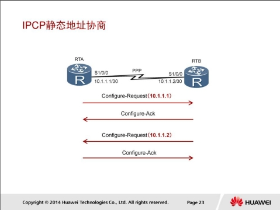

IPCP使用和LCP相同的协商机制、报文类型，但IPCP并非调用LCP，只是工作过程、报文等和LCP相同。

IP地址协商包括两种方式：静态配置协商和动态配置协商。如图所示，两端路由器配置的IP地址分别为10.1.1.1/30和10.1.1.2/30。

静态IP地址的协商过程如下：

1. 每一端都要发送Configure-Request报文，在此报文中包含本地配置的IP地址；
2. 每一端接收到此Configure-Request报文之后，检查其中的IP地址，如果IP地址是一个合法的单播IP地址，而且和本地配置的IP地址不同（没有IP冲突），则认为对端可以使用该地址，回应一个Configure-Ack报文。

### IPCP动态地址协商

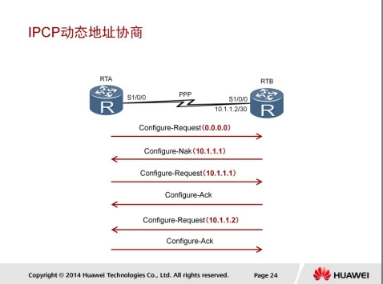

两端动态协商IP地址的过程如下：

1. RTA向RTB发送一个Configure-Request报文，此报文中会包含一个IP地址0.0.0.0，表示向对端请求IP地址；
2. RTB收到上述Configure-Request报文后，认为其中包含的地址（0.0.0.0）不合法，使用Configure-Nak回应一个新的IP地址10.1.1.1；
3. RTA收到此Configure-Nak报文之后，更新本地IP地址，并重新发送一个Configure-Request报文，包含新的IP地址10.1.1.1；
4. RTB收到Configure-Request报文后，认为其中包含的IP地址为合法地址，回应一个Configure-Ack报文。
   同时，RTB也要向RTA发送Configure-Request 报文请求使用地址10.1.1.2，RTA认为此地址合法，回应Configure-Ack报文。

### PAP认证

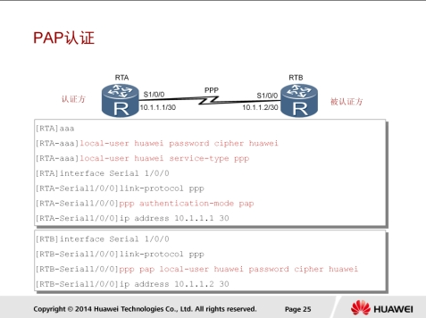

```
local-user huawei password cipher huawei
local-user huawei service-type ppp
ppp authentication-mode pap
ppp pap local-user huawei password cipher huawei
```

* local-user huawei password cipher huawei：创建一个本地用户，用户名为“huawei”，密码为“huawei”，关键字“cipher”表示密码信息在配置文件中被加密。
* local-user huawei service-type ppp：设置用户“huawei”为PPP用户。
* ppp authentication-mode pap：在认证方开启PAP认证的功能，即要求对端使用PAP认证。
* ppp pap local-user huawei password cipher huawei：在被认证方配置PAP使用的用户名和密码信息。

#### 配置验证

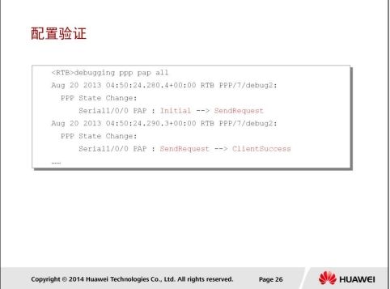

```
debugging ppp pap all
```

### 配置CHAP认证模式

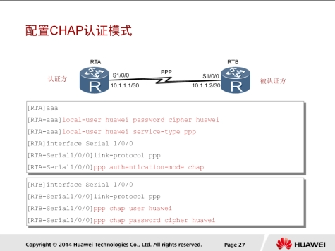

```
local-user huawei password cipher huawei
local-user huawei service-type ppp
ppp authentication-mode chap
ppp chap user huawei
ppp chap password cipher huawei
```

* local-user huawei password cipher huawei命令用于创建一个本地用户，用户名为“huawei”，密码为“huawei”；关键字“cipher”表示密码信息在配置文件中加密保存。
* local-user huawei service-type ppp命令用于设置用户“huawei”为PPP用户。
* ppp authentication-mode chap命令用于在认证方开启CHAP认证的功能，即要求对端使用CHAP认证。
* ppp chap user huawei命令用于在被认证方设置CHAP使用的用户名为“huawei”。
* ppp chap password cipher huawei命令用于在被认证方设置CHAP使用的密码为“huawei”。

##### 配置验证

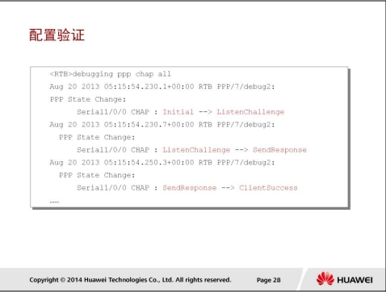

```
debugging ppp pap all
```

## 帧中继原理与配置

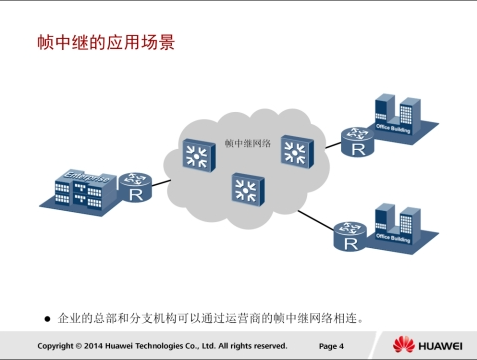

PPP、HDLC、X.25、FR、ATM都是常见的广域网技术。PPP和HDLC是一种点到点连接技术，而X.25、FR和ATM则属于分组交换技术。

X.25协议主要是描述如何在DTE和DCE之间建立虚电路、传输分组、建立链路、传输数据、拆除链路、拆除虚电路、同时进行差错控制、流量控量、情况统计等。

帧中继协议是一种简化了X.25的广域网协议，它在控制层面上提供了虚电路的管理、带宽管理和防止阻塞等功能。与传统的电路交换相比，它可以对物理电路实行统计时分复用，即在一个物理连接上可以复用多个逻辑连接，实现了带宽的复用和动态分配，有利于多用户、多速率的数据传输，充分利用了网络资源。

帧中继工作在OSI参考模型的数据链路层。与X.25协议相比，帧中继的一个显著的特点是将分组交换网中差错控制、确认重传、流量控制、拥塞避免等处理过程进行了简化，缩短了处理时间，提高了数字传输通道的利用率。新的技术诸如MPLS等的大量涌现，使得帧中继网络的部署逐渐减少。如果企业不得不使用运营商的帧中继网络服务，则企业管理员必须具备在企业边缘路由器上配置和维护帧中继的能力。

### 帧中继网络


帧中继网提供了用户设备（如路由器和主机等）之间进行数据通信的能力。

用户设备被称作数据终端设备DTE（Data Terminal Equipment）。为用户设备提供接入的设备，属于网络设备，被称为数据电路终结设备DCE（Data Circuit-terminating Equipment）。

### 虚电路

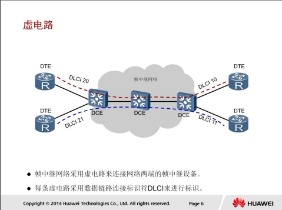

帧中继是一种面向连接的技术，在通信之前必须建立连接，DTE之间建立的连接称为虚电路。帧中继虚电路有两种类型：PVC和SVC。

1. 永久虚电路PVC（Permanent Virtual Circuit）：是指给用户提供的固定的虚电路，该虚电路一旦建立，则永久生效，除非管理员手动删除。PVC一般用于两端之间频繁的、流量稳定的数据传输。目前在帧中继中使用最多的方式是永久虚电路方式。
2. 交换虚电路SVC（Switched Virtual Circuit）：是指通过协议自动分配的虚电路。在通信结束后，该虚电路会被自动取消 。一般突发性的数据传输多用SVC。帧中继协议是一种统计复用协议，它能够在单一物理传输线路上提供多条虚电路，每条虚电路采用数据链路连接标识符DLCI（Data Link Connection Identifier）来进行标识。DLCI只在本地接口和与之直接相连的对端接口有效，不具有全局有效性，即在帧中继网络中，不同的物理接口上相同的DLCI并不表示是同一个虚电路。用户可用的DLCI的取值范围是16～1022，其中1007到1022是保留DLCI。

### LMI协商过程

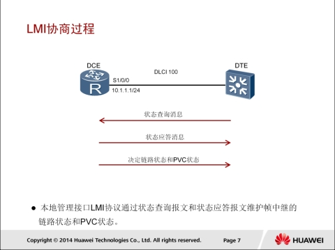

PVC方式下，不管是网络设备还是用户设备都需要知道PVC的当前状态。监控PVC状态的协议叫本地管理接口LMI（Local Management Interface）。LMI协议通过状态查询报文和状态应答报文维护帧中继的链路状态和PVC状态。LMI用于管理PVC，包括PVC的增加、删除，PVC链路完整性检测，PVC的状态等。

LMI协商过程如下：

1. DTE端定时发送状态查询消息（Status Enquiry）。
2. DCE端收到查询消息后，用状态消息（Status）应答状态查询消息。
3. DTE解析收到的应答消息，以了解链路状态和PVC状态。
4. 当两端设备LMI协商报文收发正确的情况下，PVC状态将变为Active状态。

### Inverse ARP协商过程

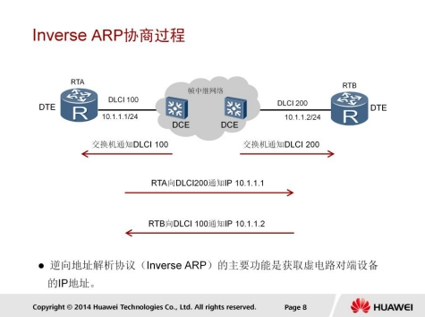

逆向地址解析协议InARP（Inverse ARP）的主要功能是获取每条虚电路连接的对端设备的IP地址。如果知道了某条虚电路连接的对端设备的IP地址，在本地就可以生成对端IP地址与本地DLCI的映射，从而避免手工配置地址映射。当帧中继LMI协商通过，PVC状态变为Active后，就会开始InARP协商过程。

InARP协商过程如下：

1. 如果本地接口上已配置了IP地址，那么设备就会在该虚电路上发送Inverse ARP请求报文给对端设备。该请求报文包含有本地的IP地址。
2. 对端设备收到该请求后，可以获得本端设备的IP地址，从而生成地址映射，并发送Inverse ARP响应报文进行响应。
3. 本端收到Inverse ARP响应报文后，解析报文中的对端IP地址，也生成地址映射。

本例中，RTA会生成地址映射`（10.1.1.2<--->100）`，RTB会生成地址映射`（10.1.1.1<--->200）`。

经过LMI和InARP协商后，帧中继接口的协议状态将变为Up状态，并且生成了对端IP地址的映射，这样PVC上就可以承载IP报文了。

### 帧中继和水分割

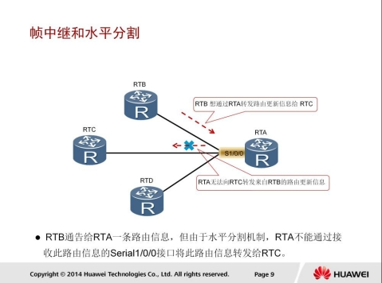

为了减少路由环路的产生，路由协议的水平分割机制不允许路由器把从一个接口接收到的路由更新信息再从该接口发送出去。水平分割机制虽然可以减少路由环路的产生，但有时也会影响网络的正常通信。例如，

本例中，RTB想通过RTA转发路由信息给RTC，但由于开启了水平分割，RTA无法通过S1/0/0接口向RTC转发RTB的路由信息。

### 帧中继子接口

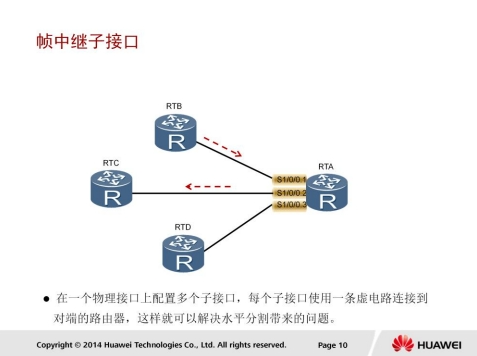

子接口可以解决水平分割带来的问题，一个物理接口可以包含多个逻辑子接口，每一个子接口使用一个或多个DLCI连接到对端的路由器。

本例中，RTA通过子接口S1/0/0.1接收到来自RTB的路由信息，然后将此信息通过子接口S1/0/0.2转发给RTC。
帧中继的子接口分为两种类型。点到点（point-to-point）子接口：用于连接单个远端设备。一个子接口只配一条PVC，不用配置静态地址映射就可以唯一地确定对端设备。

点到多点（point-to-multipoint）子接口：用于连接多个远端设备。一个子接口上配置多条PVC，每条PVC都和它相连的远端协议地址建立地址映射，这样不同的PVC就可以到达不同的远端设备。

### 帧中继配置-动态映射

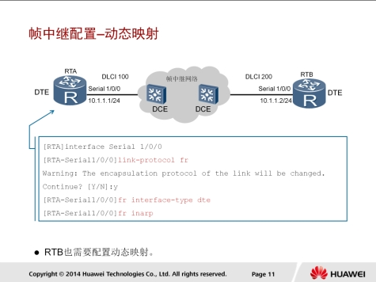

link-protocol fr命令用来指定接口链路层协议为帧中继协议。当封装帧中继协议时，缺省情况下，帧的封装格式为IETF。

`fr interface-type { dce | dte }`命令用来设置帧中继接口类型。缺省情况下，帧中继接口类型为DTE。在实际应用中，DTE接口只能和DCE接口直连。如果把设备用作帧中继交换机，则帧中继接口类型应该为DCE。

fr inarp命令用来使能帧中继逆向地址解析功能。缺省情况下，该功能已被使能。

#### 配置验证

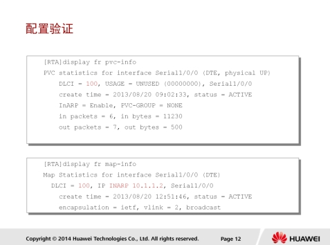

display fr pvc-info命令可以用来查看帧中继虚电路的配置情况和统计信息。

在显示信息中，

* DLCI表示虚电路的标识符。
* USAGE表示此虚电路的来源。
* LOCAL表示PVC是本地配置的，如果是UNUSED，则表示PVC是从DCE侧学习来的。
* status表示虚电路状态。可能的取值有：active：表示虚电路处于激活状态。inactive：表示虚电路处于未激活状态
* InARP表示是否使能InARP功能。

### 帧中继配置-静态映射

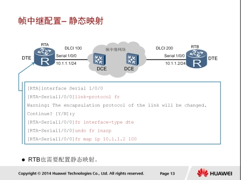

`fr map ip [destination-address [ mask ] dlci-number]`命令用来配置一个目的IP地址和指定DLCI的静态映射。

如果DCE侧设备配置静态地址映射，DTE侧启动动态地址映射功能，则DTE侧不需要再配置静态地址映射也可实现两端互通。反之，如果DCE配置动态地址映射，DTE配置静态地址映射，则不能实现互通。

`fr map ip [destination-address [ mask ] dlci-number] broadcast`命令用来配置该映射上可以发送广播报文。

#### 配置验证

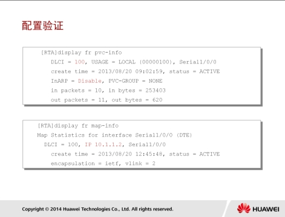

display fr map-info命令用来显示帧中继地址映射表，可以显示当前设备上目的IP地址和DLCI的映射关系。status表示地址映射的状态。

## PPPoE原理和配置

### DSL应用场景

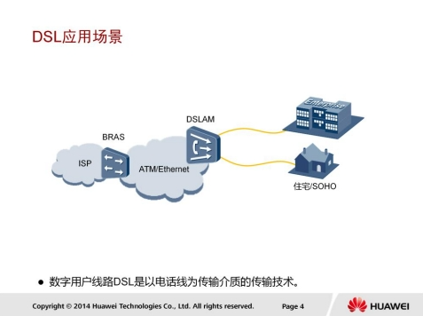

DSL是一种利用现有电话网络实现数据通信的宽带技术。在使用DSL接入网络时，用户侧会安装调制解调器，然后通过现有的电话线不数字用户线路接入复用器（DSLAM）相连。DSLAM是各种DSL系统的局端设备，属于最后一公里接入设备。

然后，DSLAM通过高速ATM网络或者以太网将用户的数据流量转发给宽带远程接入服务器（BRAS）。BRAS是面向宽带网络应用的接入网关，位于骨干网的边缘层。

### PPPoE在SDL种的应用

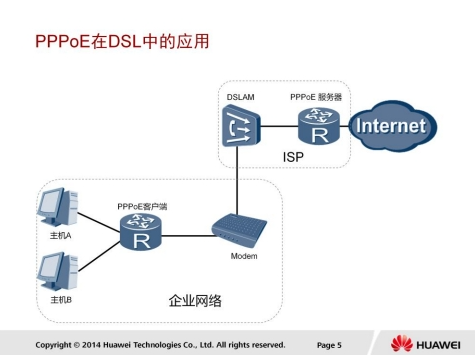

运营商希望通过同一台接入设备来连接远程的多个主机，同时接入设备能够提供访问控制和计费功能。在众多的接入技术中，把多个主机连接到接入设备的最经济的方法就是以太网，而PPP协议可以提供良好的访问控制和计费功能，于是产生了在以太网上传输PPP报文的技术，即PPPoE。

PPPoE利用以太网将大量主机组成网络，通过一个远端接入设备连入因特网，并运用PPP协议对接入的每个主机进行控制，具有适用范围广、安全性高、计费方便的特点。

PPPoE技术解决了用户上网收费等实际应用问题，得到了宽带接入运营商的认可并被广泛应用。

### PPPoE报文

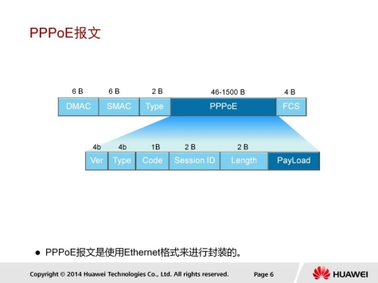

PPPoE报文是使用Ethernet格式进行封装的，Ethernet中各字段解释如下：

1. DMAC：表示目的设备的MAC地址，通常为以太网单播目的地址或者以太网广播地址（0xFFFFFFFF）。
2. SMAC：表示源设备的以太网MAC地址。
3. Type：表示协议类型字段，当值为0x8863时表示承载的是PPPoE发现阶段的报文。当值为0x8864时表示承载的是PPPoE会话阶段的报文。

PPPoE字段中的各个字段解释如下：

* VER：表示PPPoE版本号，值为0x01。
* Type：表示类型，值为0x01。
* Code：表示PPPoE报文类型，不同取值标识不同的PPPoE报文类型。
* PPPoE会话ID，不以太网SMAC和DMAC一起定义了一个PPPoE会话。
* Length：表示PPPoE报文的Payload长度，不包拪以太网头部和PPPoE头部的长度。

### PPPoE会话建立过程

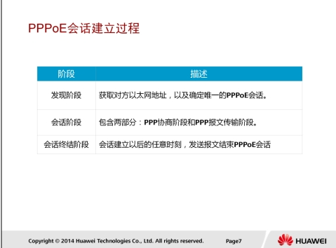

PPPoE可分为三个阶段，即发现阶段、会话阶段和会话终结阶段。

### PPPoE协议报文

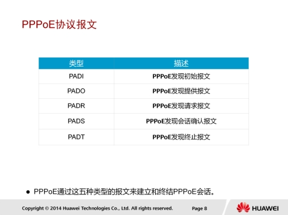

1. PADI（PPPoE Active Discovery Initiation）报文：用户主机发起的PPPoE服务器探测报文，目的MAC地址为广播地址。
2. PADO（PPPoE Active Discovery Offer）报文：PPPoE服务器收到PADI报文之后的回应报文，目的MAC地址为客户端主机的MAC地址。
3. PADR（PPPoE Active Discovery Request）报文：用户主机收到PPPoE服务器回应的PADO报文后，单播发起的请求报文，目的地址为此用户选定的那个PPPoE服务器的MAC地址。
4. PADS（PPPoE Active Discovery Session Configuration）报文：PPPoE服务器分配一个唯一的会话进程ID,并通过PADS报文发送给主机。
5. PADT（PPPoE Active Discovery Terminate）报文：当用户或者服务器需要终止会话时,可以发送这种PADT报文。

### PPPoE发现阶段

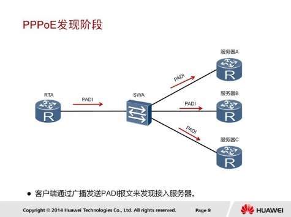

在发现阶段，PPPoE客户端在本地以太网中广播一个PADI报文，此PADI报文中包含了客户端需要的服务信息。在PADI报文中，目的MAC地址是一个广播地址，Code字段为0x09，Session ID字段为0x0000。

所有PPPoE服务器收到PADI报文之后，会将报文中所请求的服务不自己能够提供的服务进行比较。

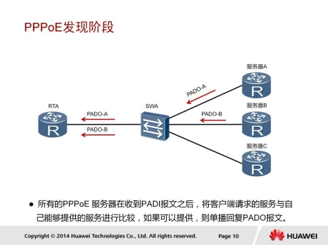

如果服务器可以提供客户端请求的服务，就会回复一个PADO报文。客户端（RTA）可能会收到多个PPPoE服务器发送的PADO报文。在PADO报文中，目的地址是发送PADI报文的客户端MAC地址，Code字段为0x07，Session ID字段为0x0000。

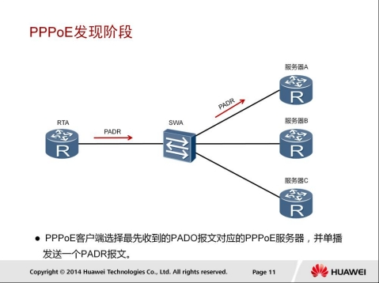

因为PPPoE客户端是以广播的形式发送PADI报文，所以客户端可能会收到多个PADO报文。在接收到的所有PADO报文中，PPPoE客户端选择最先收到的PADO报文对应的PPPoE服务器，并发送一个PADR报文给这个服务器。在PADR报文中，目的地址是选中的服务器的MAC地址，Code字段为0x19，Session ID字段为0x0000。

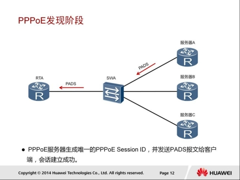

PPPoE服务器收到PADR报文后，会生成一个唯一的Session ID来标识和PPPoE客户端的会话，并通过一个PADS报文把Session ID发送给PPPoE客户端。在PADS报文中，目的地址是PPPoE客户端的MAC地址，Code字段为0x65，Session ID字段是PPPoE服务器为本PPPoE会话产生的Session ID。会话建立成功后，PPPoE客户端和服务器进入PPPoE会话阶段。

### PPPoE会话阶段

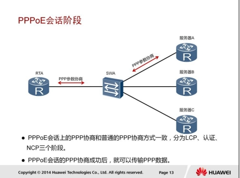

PPPoE会话阶段可分为两部分：PPP协商阶段和PPP报文传输阶段。

1. PPPoE Session上的PPP协商和普通的PPP协商方式一致，分为LCP、认证、NCP三个阶段。LCP阶段主要完成建立、配置和检测数据链路连接。LCP协商成功后，开始进行认证，认证协议类型由LCP协商结果决定。认证成功后，PPP进入NCP阶段，NCP是一个协议族，用于配置不同的网络层协议，常用的是IP控制协议（IPCP），它负责配置用户的IP地址和DNS服务器地址等。
2. PPPoE Session的PPP协商成功后，就可以承载PPP数据报文。在这一阶段传输的数据包中必须包含在发现阶段确定的Session ID并保持不变。

### PPPoE会话终结

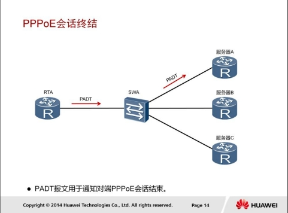

当PPPOE客户端希望关闭连接时，可以向PPPOE服务器端发送一个PADT报文。同样，如果PPPOE服务器端希望关闭连接时，也可以向PPPOE客户端发送一个PADT报文，此报文用于关闭连接。

在PADT报文中，目的MAC地址为单播地址，Session ID为希望关闭的连接的Session ID。一旦收到一个PADT报文之后，连接随即关闭。

### PPPoE会话建立过程

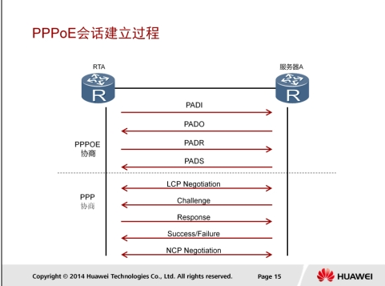

1. 用户客户端向服务器发送一个PADI报文，开始PPPOE接入。
2. 服务器向客户端发送PADO报文。
3. 客户端根据回应，发起PADR请求给服务器。
4. 服务器产生一个Session ID，通过PADS发给客户端。
5. 客户端和服务器之间进行PPP的LCP协商，建立链路层通信。同时，协商使用CHAP认证方式。
6. 服务器通过Challenge报文发送给认证客户端，提供一个128bit的Challenge。
7. 客户端收到Challenge报文后，并将密码和Challenge做MD5算法运算后，在Response回应报文中把结果发送给服务器。
8. 服务器根据用户发送的信息判断用户是否合法，然后回应认证成功/失败报文，将认证结果返回给客户端。
9. 进行NCP（如IPCP）协商，通过服务器获取到规划的IP地址等参数。

### PPPoE配置

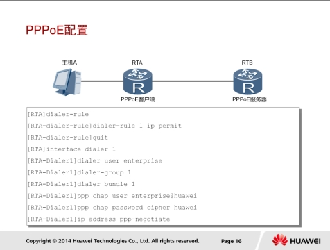

PPPoE客户端配置包拪三个步骤。

首先需要配置一个拨号接口。

dialer-rule：进入Dialer-rule视图，在该视图下，可以通过拨号规则来配置发起PPPoE会话的条件。

interface dialer number：创建并进入Dialer接口。

dialer user user-name：配置对端用户名，这个用户名必须与对端服务器上的PPP用户名相同。

dialer-group group-number命令用来将接口置于一个拨号访问组。

dialer bundle number命令用来指定Dialer接口使用的Dialer bundle。设备通过Dialer bundle将物理接口不拨号接口关联起来。

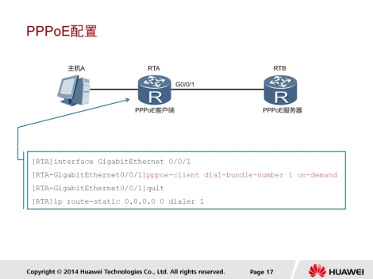

第二个步骤是在接口上将Dialer Bundle和接口绑定：

pppoe-client dial-bundle-number number命令来实现Dialer Bundle和物理接口的绑定，用来指定PPPoE会话对应的Dialer Bundle，其中number是不PPPoE会话相对应的Dialer Bundle编号。

on-demand表示PPPoE会话工作在按需拨号模式。AR2200支持报文触发方式的按需拨号。目前ARG3系列路由器支持的按需拨号方式为报文触发方式，即当物理线路Up后，设备不会立即发起PPPoE呼叫，只有当有数据需要传送时，设备才会发起PPPoE呼叫，建立PPPoE会话。

第三个步骤是配置一条缺省静态路由，该路由允许在路由表中没有相应匹配表项的流量都能通过拨号接口发起PPPoE会话。

##### 配置验证

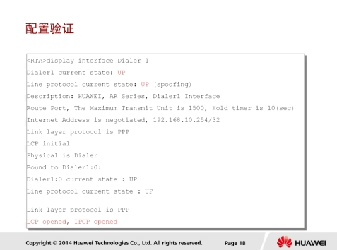

display interface dialer[ number ]命令用于查看拨号接口的配置，便于定位拨号接口的故障。

LCP opened, IPCP opened表示链路的状态完全正常。

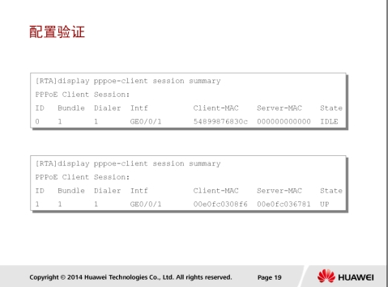

display pppoe-client session summary命令用于查看PPPoE客户端的PPPoE会话状态和统计信息。

本节给出了两个例子来说明不同的PPPoE会话状态。

ID表示PPPoE会话ID，Bundle ID和Dialer ID的值不拨号参数配置有关。

Intf表示客户端侧协商时的物理接口。

State表示PPPoE会话的状态，包拪以下四种：

1. DLE表示当前会话状态为空闲。
2. PADI表示PPPoE会话处于发现阶段，并已经发送PADI报文。
3. PADR表示PPPoE会话处于发现阶段，并已经发送PADR报文。
4. UP表示PPPoE会话建立成功。

## 网路地址转换（NAT）

### NAT应用场景


NAT是将IP数据报报头中的IP地址转换为另一个IP地址的过程，主要用于实现内部网络（私有IP地址）访问外部网络（公有IP地址）的功能。NAT一般部署在连接内网和外网的网关设备上。当收到的报文源地址为私网地址、目的地址为公网地址时，NAT可以将源私网地址转换成一个公网地址。这样公网目的地就能够收到报文，并做出响应。此外，网关上还会创建一个NAT映射表，以便判断从公网收到的报文应该发往的私网目的地址。

### 静态NAT


NAT的实现方式有多种，适用于不同的场景。

静态NAT实现了私有地址和公有地址的一对一映射。如果希望一台主机优先使用某个关联地址，或者想要外部网络使用一个指定的公网地址访问内部服务器时，可以使用静态NAT。但是在大型网络中，这种一对一的IP地址映射无法缓解公用地址短缺的问题。

在本示例中，源地址为192.168.1.1的报文需要发往公网地址100.1.1.1。在网关RTA上配置了一个私网地址192.168.1.1到公网地址200.10.10.1的映射。当网关收到主机A发送的数据包后，会先将报文中的源地址192.168.1.1转换为200.10.10.1，然后转发报文到目的设备。目的设备回复的报文目的地址是200.10.10.1。当网关收到回复报文后，也会执行静态地址转换，将200.10.10.1转换成192.168.1.1，然后转发报文到主机A。和主机A在同一个网络中其他主机，如主机B，访问公网的过程也需要网关RTA做静态NAT转换。

### 动态NAT


动态NAT通过使用地址池来实现。

本示例中，当内部主机A和主机B需要与公网中的目的主机通信时，网关RTA会从配置的公网地址池中选择一个未使用的公网地址与之做映射。每台主机都会分配到地址池中的一个唯一地址。当不需要此连接时，对应的地址映射将会被删除，公网地址也会被恢复到地址池中待用。当网关收到回复报文后，会根据之前的映射再次进行转换之后转发给对应主机。

动态NAT地址池中的地址用尽以后，只能等待被占用的公用IP被释放后，其他主机才能使用它来访问公网。

### NAPT


网络地址端口转换NAPT（Network Address Port Translation）允许多个内部地址映射到同一个公有地址的不同端口。

本例中，RTA收到一个私网主机发送的报文，源IP地址是192.168.1.1，源端口号是1025，目的IP地址是100.1.1.1，目的端口是80。RTA会从配置的公网地址池中选择一个空闲的公网IP地址和端口号，并建立相应的NAPT表项。这些NAPT表项指定了报文的私网IP地址和端口号与公网IP地址和端口号的映射关系。之后，RTA将报文的源IP地址和端口号转换成公网地址200.10.10.1和端口号2843，并转发报文到公网。当网关RTA收到回复报文后，会根据之前的映射表再次进行转换之后转发给主机A。主机B同理。

### Ease IP


Easy IP适用于小规模局域网中的主机访问Internet的场景。小规模局域网通常部署在小型的网吧或者办公室中，这些地方内部主机不多，出接口可以通过拨号方式获取一个临时公网IP地址。Easy IP可以实现内部主机使用这个临时公网IP地址访问Internet。

本示例说明了Easy IP的实现过程。RTA收到一个主机A访问公网的请求报文，报文的源IP地址是192.168.1.1，源端口号是1025。RTA会建立Easy IP表项，这些表项指定了源IP地址和端口号与出接口的公网IP地址和端口号的映射关系。之后，根据匹配的Easy IP表项，将报文的源IP地址和端口号转换成出接口的IP地址和端口号，并转发报文到公网。报文的源IP地址转换成200.10.10.10/24，相应的端口号是2843。路由器收到回复报文后，会根据报文的目的IP地址和端口号，查询EasyIP表项。路由器根据匹配的Easy IP表项，将报文的目的IP地址和端口号转换成私网主机的IP地址和端口号，并转发报文到主机。

### NAT服务器


NAT在使内网用户访问公网的同时，也屏蔽了公网用户访问私网主机的需求。当一个私网需要向公网用户提供Web和SFTP服务时，私网中的服务器必须随时可供公网用户访问。

NAT服务器可以实现这个需求，但是需要配置服务器私网IP地址和端口号转换为公网IP地址和端口号并发布出去。路由器在收到一个公网主机的请求报文后，根据报文的目的IP地址和端口号查询地址转换表项。路由器根据匹配的地址转换表项，将报文的目的IP地址和端口号转换成私网IP地址和端口号，并转发报文到私网中的服务器。

本例中，主机C需要访问私网服务器，发送报文的目的IP地址是200.10.10.1，目的端口号是80。RTA收到此报文后会查找地址转换表项，并将目的IP地址转换成192.168.1.1，目的端口号保持不变。服务器收到报文后会进行响应，RTA收到私网服务器发来的响应报文后，根据报文的源IP地址192.168.1.1和端口号80查询地址转换表项。然后，路由器根据匹配的地址转换表项，将报文的源IP地址和端口号转换成公网IP地址200.10.10.1和端口号80，并转发报文到目的公网主机。

### 静态NAT配置


```
interface GigabitEthernet0/0/1
ip address 192.168.1.254 24
interface Serial1/0/0
ip address 200.10.10.2 24
nat static global 202.10.10.1 inside 192.168.1.1
nat static global 202.10.10.2 inside 192.168.1.2
```

`nat static global { global-address} inside {host-address } `：创建静态NAT。

1. global参数用于配置外部公网地址。
2. inside参数用于配置内部私有地址。

##### 配置验证


```
display nat static
```

display nat static：查看静态NAT的配置。

* Global IP/Port表示公网地址和服务端口号。
* Inside IP/Port表示私有地址和服务端口号。

### 动态NAT配置


```
nat address-group 1 200.10.10.1 200.10.10.200
acl 2000
rule 5 permit source 192.168.1.0 0.0.0.255
quit
interface serial1/0/0
nat outbound 2000 address-group 1 no-pat
```

nat outbound：将一个访问控制列表ACL和一个地址池关联起来，表示ACL中规定的地址可以使用地址池进行地址转换。ACL用于指定一个规则，用来过滤特定流量。后续将会介绍有关ACL的详细信息。

nat address-group：配置NAT地址池。

本 示 例 中 使 用 nat outbound 命令将 ACL 2000 与 待 转 换 的192.168.1.0/24网段的流量关联起来，并使用地址池1（address-group 1）中的地址进行地址转换。no-pat表示只转换数据报文的地址而不转换端口信息。

##### 配置验证


```
display nat address-group 1
display nat outbound
```

display nat address-group group-index：查看NAT地址池配置信息。
display nat outbound：查看动态NAT配置信息。

可以用这两条命令验证动态NAT的详细配置。

在本示例中，指定接口Serial 1/0/0与ACL关联在一起，并定义了用于地址转换的地址池1。参数no-pat说明没有进行端口地址转换。

### Easy IP 配置


```
acl 2000
rule 5 permit source 192.168.1.0 0.0.0.255
quit
interface serial1/0/0
nat outbound 2000
```

nat outbound acl-number：配置Easy-IP地址转换。Easy IP的配置与动态NAT的配置类似，需要定义ACL和nat outbound命令，主要区别是Easy IP不需要配置地址池，所以nat outbound命令中不需要配置参数address-group。

在本示例中，命令nat outbound 2000表示对ACL 2000定义的地址段进行地址转换，并且直接使用Serial1/0/0接口的IP地址作为NAT转换后的地址。

##### 配置验证


命令display nat outbound用于查看命令nat outbound的配置结果。Address-group/IP/Interface表项表明接口和ACL已经关联成功，type表项表明Easy IP已经配置成功。

### NAT服务器配置


```
interface GigabitEthernet0/0/1
ip address 192.168.1.254 24
interface Serial1/0/0
ip address 200.10.2.24
nat server protocol tcp global 202.10.10.1 www inside 192.168.1.1 8080
```

`nat server [ protocol {protocol-number | icmp | tcp | udp} global { global-address | current-interface global-port} inside {host-address host-port } vpn-instance vpn-instance-name acl acl-number description description ]`命令用来定义一个内部服务器的映射表，外部用户可以通过公网地址和端口来访问内部服务器。

* protocol指定一个需要地址转换的协议；
* global-address指定需要转换的公网地址；
* inside指定内网服务器的地址。

##### 配置验证


display nat server命令用于查看详细的NAT服务器配置结果。可以通过此命令验证地址转换的接口、全局和内部IP地址以及关联的端口号。在本示例中，全局地址202.10.10.1和关联的端口号80（www）分别被转换成内部服务器地址192.168.1.1和端口号8080。

## Reference Links：

http://bbs.hh010.com/
