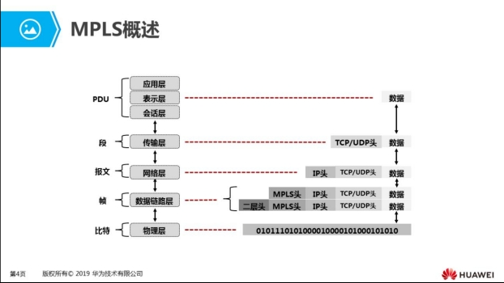
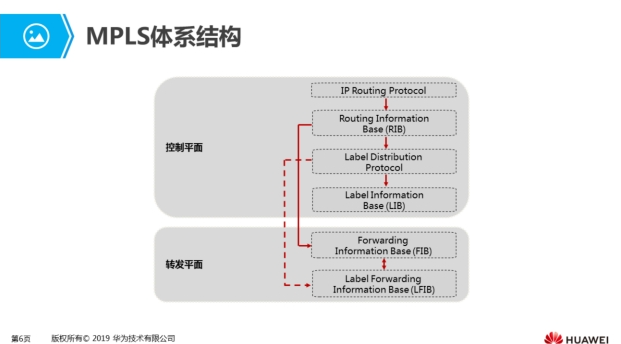
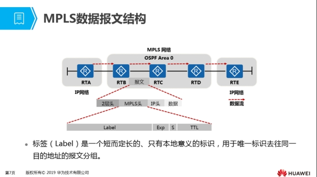
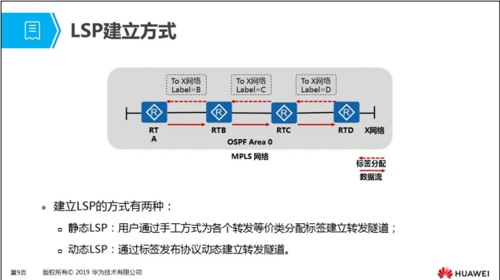
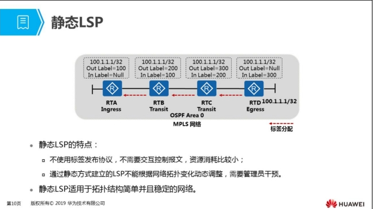
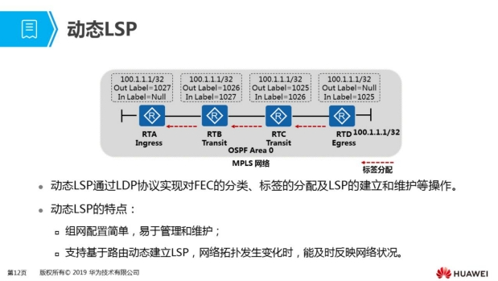

## （未完成，占位）

## MPLS协议原理与配置

### MPLS概述



MPLS协议从各种链路层协议（如PPP、ATM、帧中继、以太网等）得到链路层服务，又为网络层提供面向连接的服务。

MPLS能从IP路由协议和控制协议中得到支持，路由功能强大、灵活，可以满足各种新应用对网络的要求。

我们将分为以下两部分讲解MPLS协议：

* MPLS的基本结构；
* MPLS LSP的建立过程和数据的转发过程。

#### MPLS的基本结构

* 在MPLS网络中，路由器的角色分为两种：
  * LER（Label Edge Router）： 在MPLS网络中，用于标签的压入或弹出，如上图中的RTB，RTD。
  * LSR（Label Switched Router）：在MPLS网络中，用于标签的交换，如图中的RTC。
* 根据数据流的方向，LSP的入口LER被称为入节点（Ingress）；位于LSP中间的LSR被称为中间节点（Transit）；LSP的出口LER被称为出节点（Egress）。
  * MPLS报文由Ingress发往Transit，则Ingress是Transit的上游节点，Transit是Ingress的下游节点；同理，Transit是Egress的上游节点，Egress是Transit的下游节点。
* MPLS作为一种分类转发技术，将具有相同转发处理方式的报文分为一类，称该类报文为一个FEC（Forwarding Equivalent Class）。
  * FEC的划分方式非常灵活，可以是以源地址、目的地址、源端口、目的端口、协议类型或VPN等为划分依据的任意组合。

#### MPLS体系结构



* 控制平面：负责产生和维护路由信息以及标签信息。
  * 路由信息表RIB（Routing Information Base）：由IP路由协议（IP RoutingProtocol）生成，用于选择路由。
  * 标签分发协议LDP（Label Distribution Protocol）：负责标签的分配、标签转发信息表的建立、标签交换路径的建立、拆除等工作。
  * 标签信息表LIB（Label Information Base）：由标签分发协议生成，用于管理标签信息。
* 转发平面：即数据平面（Data Plane），负责普通IP报文的转发以及带MPLS标签报文的转发。
  * 转发信息表FIB（Forwarding Information Base）：从RIB提取必要的路由信息生成，负责普通IP报文的转发。
  * 标签转发信息表LFIB（Label Forwarding Information Base）：简称标签转发表，由标签分发协议建立LFIB，负责带MPLS标签报文的转发。
* MPLS路由器上，报文的转发过程：
  * 当收到普通IP报文时，查找FIB表，如果Tunnel ID为0x0，则进行普通IP转发；如果查找FIB表，Tunnel ID为非0x0，则进行MPLS转发。
  * 当收到带标签的报文时，查找LFIB表，如果对应的出标签是普通标签，则进行MPLS转发；查找LFIB表，如果对应的出标签是特殊标签，如标签3，则将报文的标签去掉，进行IP转发。

#### MPLS数据报文结构



* MPLS标签封装在链路层和网络层之间，可以支持任意的链路层协议，MPLS标签的封装结构如图所示。
* MPLS标签的长度为4个字节，共分4个字段：
  * Label：20bit，标签值域；
  * Exp：3bit，用于扩展。现在通常用做CoS（Class of Service），当设备发生阻塞时，优先发送优先级高的报文；
  * S：1bit，栈底标识。MPLS支持多层标签，即标签嵌套。S值为1时表明为最底层标签；
  * TTL：8bit，和IP报文中的TTL（Time To Live）意义相同。
* 标签空间是指标签的取值范围。标签空间划分如下：
  * 0～15：特殊标签。如标签3，称为隐式空标签，用于倒数第二跳弹出；
  * 16～1023：静态LSP和静态CR-LSP（Constraint-based Routed Label SwitchedPath）共享的标签空间；
  * 1024及以上：LDP、RSVP-TE（Resource Reservation Protocol-TrafficEngineering）、MP-BGP（MultiProtocol Border Gateway Protocol）等动态信
  * 令协议的标签空间。

## MPLS的建立

### LSP建立方式



### 静态LSP



* 配置静态LSP时，管理员需要为各路由器手工分配标签，需要遵循的原则是：前一节点出标签的值等于下一个节点入标签的值。
* 如图所示拓扑，MPLS网络中有一个100.1.1.1/32的用户，静态为该路由建立一条LSP，配置过程如下：

  * 配置LSR ID用来在网络中唯一标识一个MPLS路由器。缺省没有配置LSR ID，必须手工配置。为了提高网络的可靠性，推荐使用LSR某个Loopback接口的地址作为LSR ID。

    * 配置命令：mpls lsr-id lsr-id
  * 在MPLS域的所有节点与相应的接口上开启MPLS协议。

    ```
    system-view
    mpls
    interface interface-type interface-number
    mpls
    ```
  * 在Ingress进行以下配置：

    ```
    static-lsp ingress lsp-name destination ip-address { mask-length | mask } 
    { nexthop next-hop-address | outgoing-interface interface-type 
    interface-number } * out-label out-label。
    ```
* 在Transit进行以下配置：

  ```
  static-lsp transit lsp-name [ incoming-interface interface-type interface-number ] 
  in-label in-label { nexthop next-hop-address | outgoing-interface interface-type 
  interface-number } * out-label out-label
  ```
* 在Egress进行以下配置：

  ```
  static-lsp egress lsp-name [ incoming-interface interface-type interface-number ] 
  in-label in-label [ lsrid ingress-lsr-id tunnel-id tunnel-id ]
  ```
* 完成上述配置后，只是完成了RTA到RTD的单条LSP，RTD返回RTA的LSP路径也需要配置才能实现RTA正常访问RTD100.1.1.1/32的路由

### 动态LSP



如图所示拓扑：

* Egress路由器RTD为本地存在的路由分配标签，并将路由和标签的绑定关系主动发送给上游邻居路由器RTC；
* 路由器RTC收到下游邻居路由器RTD的路由和标签的绑定关系后，将其记录到LIB中，并将自己分配的标签和路由的绑定关系发送给上游邻居路由器RTB；
* RTB执行相同的动作将标签和路由的绑定关系发送给上游邻居路由器RTA，RTA为Ingress路由器，没有上游邻居，因此动态的LSP完成建立。

# （未完成，占位）

# MPLS VPM技术原理与配置

# DHCP协议原理与配置

# 镜像技术原理与配置

# QoS服务模型

# 报文分类与标记

# 拥塞管理与拥塞避免

# 流量监管与流量整形

# 信息安全综述

# 华为防火墙技术基础

# VRRP协议原理与配置

# BFD协议原理与配置

# SDN基本概述

# VXLAN基本概述

# NFV基本概述
