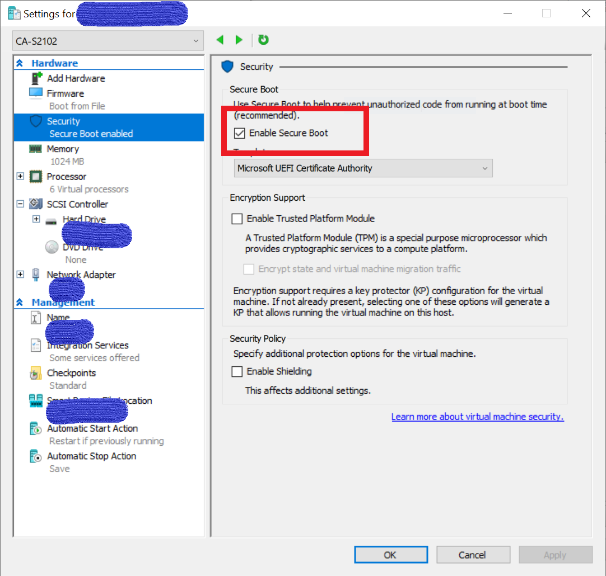

## 报错：Boot crashed vmlinuz-xxxxxx-generic has invalid signature after update linux kernel

**背景：**安装在Hyper-V的Linux虚拟主机升级内核后，启动报错，一直卡在启动界面。报错类似如下：

```vbnet
error: /boot/vmlinuz-4.18.12-041812-generic has invalid signature
error: you need to load the kernel first
```

**解决方案：**disable Secure Boot



下面引用连接给出了三种方法，其他两种方法未验证

```
1.You sign the kernel yourself.
2.You use a signed, generic kernel of your distro.
3.You disable Secure Boot.
```

**参考：**[https://askubuntu.com/questions/1081472/vmlinuz-4-18-12-041812-generic-has-invalid-signature](https://askubuntu.com/questions/1081472/vmlinuz-4-18-12-041812-generic-has-invalid-signature)
