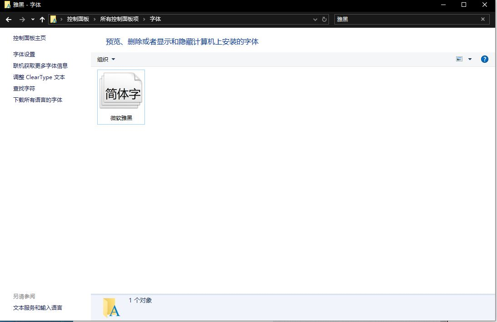

## 报错：Get value from agent failed: bind() failed: [99] Address not available

 **解决方案：** 注释掉server端的SourceIP参数即可。

```bash
sudo vim /etc/zabbix/zabbix_server.conf
#注释以下参数
#SourceIP=192.168.123.200

#重启服务
sudo systemctl restart zabbix-server
```

 **参考：** [https://www.cnblogs.com/leihongnu/p/16497318.html](https://www.cnblogs.com/leihongnu/p/16497318.html)

## 报错：zabbix6.0lts 中文乱码，流量图中文乱码解决办法

**解决方案：**

找到本机字体C:\Windows\Fonts 随便选择一种，可以选微软雅黑。



将字体从本地拷贝到/usr/share/fonts/dejavu/目录下。

备份原有的DejaVuSans.ttf，并将上传的字体改成DejaVuSans.ttf

```
cd /usr/share/fonts/dejavu/
sudo mv DejaVuSans.ttf DejaVuSans.ttf.bak
sudo mv simhei.ttf DejaVuSans.ttf
```

 **参考：** [https://www.yunweiriji.com/static/monitor/zabbix/77.html](https://www.yunweiriji.com/static/monitor/zabbix/77.html)

[https://blog.csdn.net/weixin_45551608/article/details/121257445](https://blog.csdn.net/weixin_45551608/article/details/121257445)

## 报错：Can't open PID file /run/zabbix/zabbix_agentd.pid (yet?) after start: Operation

 **解决方案：** 配置文件添加重复了，删除重复的行就行

## 报错：**zabbix_get :command not found 解决办法**

 **解决方案：** 安装zabbix-get

```swift
sudo dnf install zabbix-get -y
```

 **参考：** [https://blog.csdn.net/u010603691/article/details/50130089](https://blog.csdn.net/u010603691/article/details/50130089)

## 报错：ZBX_NOTSUPPORTED: Unsupported item key

**解决方案：** 一般是修改配置文件以后没有重启导致，重启agent即可

```
sudo systemctl restart zabbix-agent
sudo systemctl status zabbix-agent
```

**参考：** [https://blog.csdn.net/Doudou_Mylove/article/details/123271724](https://blog.csdn.net/Doudou_Mylove/article/details/123271724)
