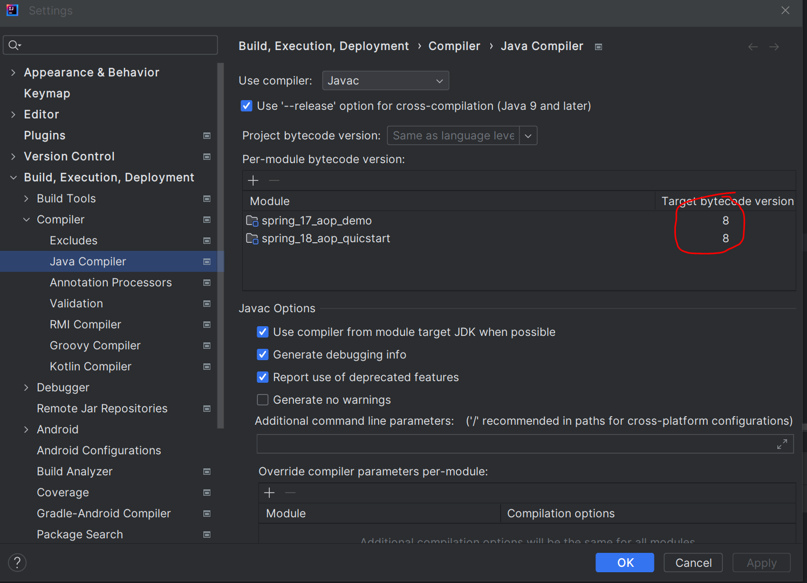

## **报错：java.lang.IllegalArgumentException: Unsupported class file major version 64**

**问题分析：** 这个错误意思大概就是：非法参数异常，不支持的类文件主版本64。

猜想应该是版本兼容问题，查找项目中只集成了spring-context，版本是5.2.21.RELEASE，而jdk版本是20。

目前spring-context版本5.2.21.RELEASE并不是最新版本，而jdk版本20是比较新的版本，那么要想解决该问题应该是要么降低jdk版本，要么升高spring-context版本。

**解決方案：**在idea中降低模塊jdk版本，將下圖的target bytecode version從20改成8(即jdk1.8)



降低JDK版本或升級spring版本均可解決問題

**參考鏈接：** [https://blog.csdn.net/qq_39653385/article/details/129483221](https://blog.csdn.net/qq_39653385/article/details/129483221)

## 報錯：No goals have been specified for this build. You must specify a valid lifecycle phase

**解決方案：** pom.xml 文件中 `<build>` 标签要加配置： `<defaultGoal>`compile `</defaultGoal>`

```xml
    <build>
        <defaultGoal>
            compile
        </defaultGoal>
    </build>
```

**參考鏈接：** [https://blog.csdn.net/jiangyu1013/article/details/86510112](https://blog.csdn.net/jiangyu1013/article/details/86510112)

## 報錯：**No qualifying bean of type ....**

**解決方案：**

1 检查是否添加了对应注解

2 检查配置是否正确,扫描包名, 类名及id是否正确

**參考鏈接：** [https://blog.csdn.net/u010565545/article/details/100066824](https://blog.csdn.net/u010565545/article/details/100066824)

## 報錯：Please refer to dump files (if any exist) [date].dump, [date]-jvmRun[N].dump and [date].dumpstream.

**解決方案：** You can try this: Add this code in the plugins section of your pom.xml

```xml
<plugin>  
    <groupId>org.apache.maven.plugins</groupId>  
    <artifactId>maven-surefire-plugin</artifactId>  
    <version>2.22.2</version>  
    <configuration>  
    <skipTests>true</skipTests>  
    </configuration>  
</plugin>  
```

**參考鏈接：** [How to fix dump files (if any exist) [date].dump, [date]-jvmRun[N].dump and [date].dumpstream. while using maven surefire plugin 3.0.0-M4 - Stack Overflow](https://stackoverflow.com/questions/71282385/how-to-fix-dump-files-if-any-exist-date-dump-date-jvmrunn-dump-and-dat)

## 報錯：org.springframework.boot.context.config.InvalidConfigDataPropertyException: Property 'spring.profiles' imported from location 'class path resource [application.yml]' is invalid and should be replaced with 'spring.config.activate.on-profile'

**解決方案：** application.yml文件的格式書寫有問題，改成以下格式

```yaml
spring:
  profiles:
    active: dev   #激活使用的環境
---
server:
  port: 8001
spring:
  config:
    activate:
      on-profile: dev
---

server:
  port: 8002
spring:
  config:
    activate:
      on-profile: pro
```

**參考鏈接：** [What is diff between spring.profiles.active vs spring.config.activate.on-profile? - Stack Overflow](https://stackoverflow.com/questions/73062721/what-is-diff-between-spring-profiles-active-vs-spring-config-activate-on-profile)

## 報錯： Consider renaming one of the beans or enabling overriding by setting spring.main.allow-bean-definition-overriding=true

**解決方案：**在application.yml或application.properties中添加以下内容

```yaml
#application.yml
spring:  
  main:
    allow-bean-definition-overriding: true
#application.properties
spring.main.allow-bean-definition-overriding=true
```

**參考鏈接：**[https://stackoverflow.com/questions/53203051/redis-consider-renaming-one-of-the-beans-or-enabling-overriding-by-setting-spr](https://stackoverflow.com/questions/53203051/redis-consider-renaming-one-of-the-beans-or-enabling-overriding-by-setting-spr)

## 報錯：[ERROR] 'mirrors.mirror.mirrorOf' for official is missing

**解決方案：** 添加下面的鏡像

```xml
<mirror>
  <id>alimaven</id>
  <mirrorOf>central</mirrorOf>
  <name>aliyun maven</name>
  <url>http://maven.aliyun.com/nexus/content/repositories/central/</url>
</mirror>

<mirror>
    <id>alimaven</id>
    <name>aliyun maven</name>
    <url>http://maven.aliyun.com/nexus/content/groups/public/</url>
    <mirrorOf>central</mirrorOf>
</mirror>

<mirror>
    <id>central</id>
    <name>Maven Repository Switchboard</name>
    <url>http://repo1.maven.org/maven2/</url>
    <mirrorOf>central</mirrorOf>
</mirror>

<mirror>
    <id>repo2</id>
    <mirrorOf>central</mirrorOf>
    <name>Human Readable Name for this Mirror.</name>
    <url>http://repo2.maven.org/maven2/</url>
</mirror>

<mirror>
    <id>ibiblio</id>
    <mirrorOf>central</mirrorOf>
    <name>Human Readable Name for this Mirror.</name>
    <url>http://mirrors.ibiblio.org/pub/mirrors/maven2/</url>
</mirror>

<mirror>
    <id>jboss-public-repository-group</id>
    <mirrorOf>central</mirrorOf>
    <name>JBoss Public Repository Group</name>
    <url>http://repository.jboss.org/nexus/content/groups/public</url>
</mirror>

<!-- 中央仓库在中国的镜像 -->
<mirror>
    <id>maven.net.cn</id>
    <name>oneof the central mirrors in china</name>
    <url>http://maven.net.cn/content/groups/public/</url>
    <mirrorOf>central</mirrorOf>
</mirror>
```

**參考** ：[https://blog.csdn.net/qq_45822970/article/details/125128359](https://blog.csdn.net/qq_45822970/article/details/125128359)

## 报错：使用idea打开新项目后，项目文件全部是灰色

**解决方案：** pom.xml文件不小心被移动到src文件夹了，移动到pom.xml后，idea能够正常识别项目了。

下面参考链接中有其他解决方案

**参考：** [https://blog.csdn.net/lillanm/article/details/124070060](https://blog.csdn.net/lillanm/article/details/124070060)

## 報錯：idea打开springboot项目后，无法直接run，运行按钮是灰色

**解决方案：** 新增一个配置文件，配置文件选maven，在配置文件的Command line中使用以下配置：

```makefile
spring-boot:run
```

如果working directory不是项目目录的话，需要更改到项目目录。

**参考：** [https://blog.csdn.net/Y12nre/article/details/60869829](https://blog.csdn.net/Y12nre/article/details/60869829)

## 報錯：Caused by: java.lang.ClassNotFoundException: com.alibaba.fastjson2.modules.ObjectReaderModule

**解決方案：** fastjson版本有問題，更改依賴版本試試

## **報錯：java 程序包org.junit.jupiter.api不存在**

**解決方案：** 添加依赖即可

```xml
		<dependency>
			<groupId>org.junit.jupiter</groupId>
			<artifactId>junit-jupiter-api</artifactId>
			<version>5.9.2</version>
			<scope>test</scope>
		</dependency>
```

**參考：** [https://blog.csdn.net/qq_22498427/article/details/117981105](https://blog.csdn.net/qq_22498427/article/details/117981105)


## 报错：Mybatis - Invalid bound statement (not found)

解决方案：检查Resources中xxxmapper.xml文件是否存在或者xxxmapper.xml是否错误移动到其他文件夹

参考：https://stackoverflow.com/questions/55000770/mybatis-invalid-bound-statement-not-found

## 报错：找不到或无法加载主类 com.ruoyi.RuoYiApplication

解决方案：重新mvn install 即可

参考：https://www.cnblogs.com/wwssgg/p/16352561.html

https://blog.csdn.net/huangbaokang/article/details/106506828

## 报错：若依新增模块后接口报错404

解决方案：若依新增模块后需要操作以下两步骤：

1. 在新模块pom中引用ruoyi-common

   ```
           </dependency>
           <dependency>
               <groupId>com.ruoyi</groupId>
               <artifactId>ruoyi-common</artifactId>
           </dependency>
   ```
2. 将新模块添加至admin包的pom，且必须添加版本号，否则依赖不成功

   ```
           <dependency>
               <groupId>com.ruoyi.oa</groupId>
               <artifactId>ruoyi-oa</artifactId>
               <version>3.8.7</version>
           </dependency>
   ```

参考：https://blog.csdn.net/baidu_16250655/article/details/135676107

https://www.cnblogs.com/simon-xie/p/16205835.html
