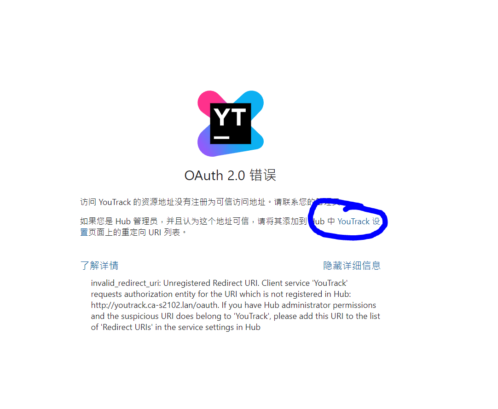

## 报错：youtrack配置nginx代理转发后无法访问，报错OAuth 2.0错误



**解决方案：**

1.点击上图蓝圈中的链接，链接如下：

```
http://192.168.xx.xxx:8080/admin/hub/services9xxx0-ca5d-4375-bb2c-8e899e31fe08?tab=settings
```

2.在“重定向URL”栏目加入nginx的地址，类似如下：

```
http://xxxx/oauth
http://xxxx/admin/hub
```
