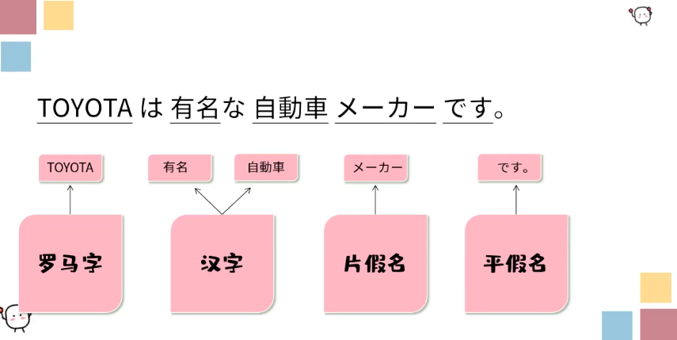
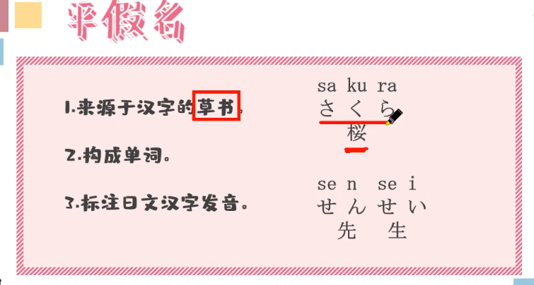
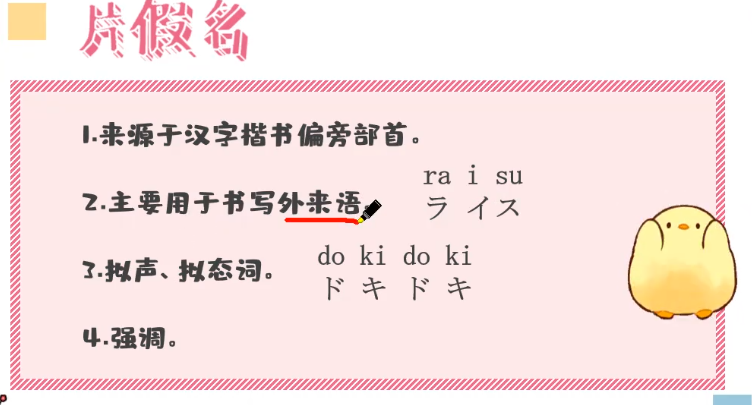
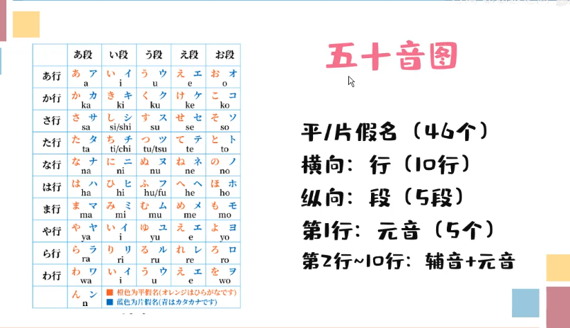
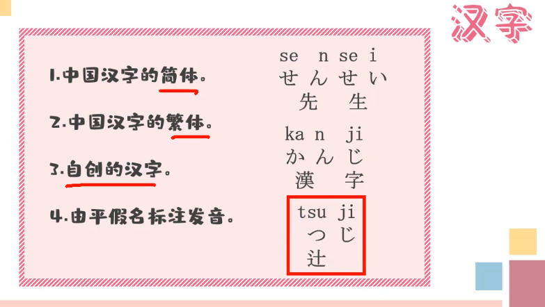
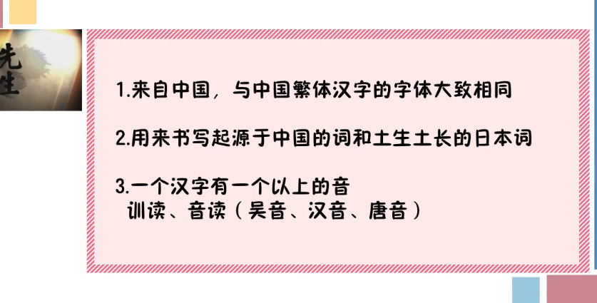
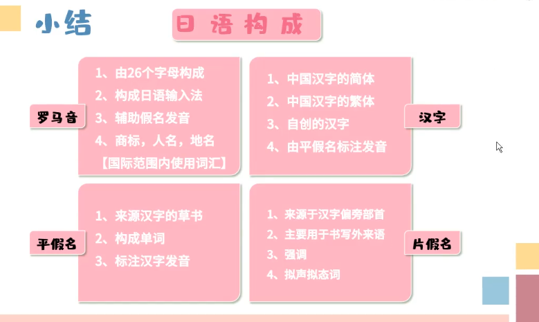

> 配套視頻學習地址：https://www.bilibili.com/video/BV1gz421171q

## 课程目标

* 认识五十音图
* 日语基本构成

## 简介

示例：

* Ka wa i i 	>> 	羅馬字
* かわいい	>＞	假名
* 可愛い	>＞	日本漢字

關係：

* 羅馬字標注假名讀音
* 假名標注漢字讀音

### 羅馬字

羅馬字的標注方式不等於拼音，不能直接用拼音的讀音去讀羅馬音讀音

### 假名

#### 平假名

sa ku ra  櫻花

#### 片假名

2.ra i su  > 米飯

3.do ki do ki > 我的心撲通撲通跳  ＞　ドキドキ

4.ダメ

## 五十音圖简介

五十音與相當於日語拼音表。

一個羅馬音對應一個平假名，對應一個片假名。

3.辻　＞十字路口

### 漢字

## 總結

日語構成：

