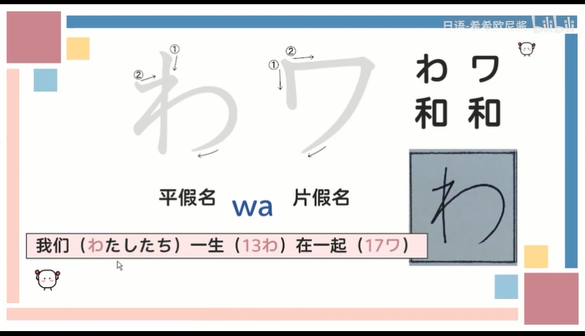
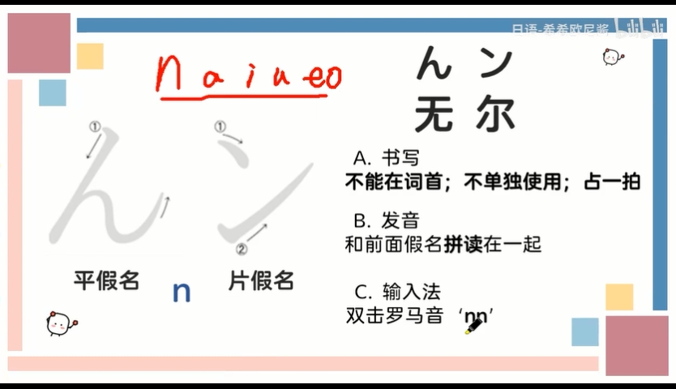

## 第一行：あ行　a

### 读音练习

* あおい	a o i
* うお		u o
* いえ		i e
* あう		a u

## 音调

如：

ha ha

は  は

高  低

技巧：

平时练习时可以全部都读高音或者低音

## 标读方式

* 数字式：2代表第二个字是高音
* 划线式：字上划红线的是高音
* 黑体式：加粗黑体的字读高音

## 发音规则

### 規則

### 示例

高低音讀法

調音

指的是第幾個字符后降音。

1調音指あ（第一個字符）后降音，依此類推。0調音中沒有降音，所以是0調音。

### 總結

### 單詞練習

#### 0調音

はな	ha na（低，高）意思是：花

かお	ka o（低，高）意思是：顔（日語），中文意思是臉

#### 1調音

はなび	ha bi ji	花火

あい		a i		愛

#### 2調音

あおい（低高）

はな（低高）

### 課後作業

練習音調

答案：

## 第二行:	か行　ka

### か	ka

### き ki

### く	ku

### け	ke

　

### こ	ko

### 單詞記憶法

答案：

## 第三行：さ行	sa

### さ sa

### し si

### す su

### せ se

### そ so

### 讀音練習

讀音回顧

### 單詞記憶法

答案：

## 第四行：た行 ta

### た ta

### ち ti chi

### つ tu tsu

### て te

### と to

### 讀音練習

### 單詞記憶法

答案：

## 第五行：な行 na

### な na

奈在日語中就讀na

### に ni

### ぬ nu

### ね ne

### の no

### 讀音練習

### 單詞記憶法

答案：

## 第六行：は行 ha

### は ha

### ひ hi

### ふ hu

### へ he

### ほ ho

### 讀音練習

### 單詞記憶法

答案：

ほし		星星

さいふ	錢包

## 第七行：ま行 ma

### ま ma

 まま	媽媽，母親

### み mi

### む mu

### め me

日語中娘是女兒的意思

### も mo

### 讀音練習

### 單詞記憶法

答案：

## 第八行：や行 ya

### や ya

### ゆ yu

### よ yo

### 讀音練習

### 單詞記憶法

答案：

## 第九行：ら行 ra

### ら ra

### り ri

 

### る ru

### れ re

しつれい中的い不發音，即si tu re

れいぎ中的い也不發音，即re gi

### ろ ro

### 讀音練習

### 單詞記憶法

答案：

## 階段小測試

答案：

## 第十行：わ行 wa

### わ wa

### を wo

### ん n

輸入法需要打nn，單個n打不出來ん

### 讀音練習

## 撥音拼讀小技巧

> 注意：
>
> 此處還需要再看視頻重複學習

