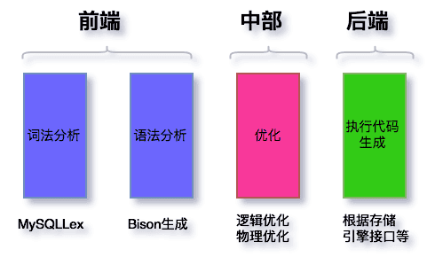
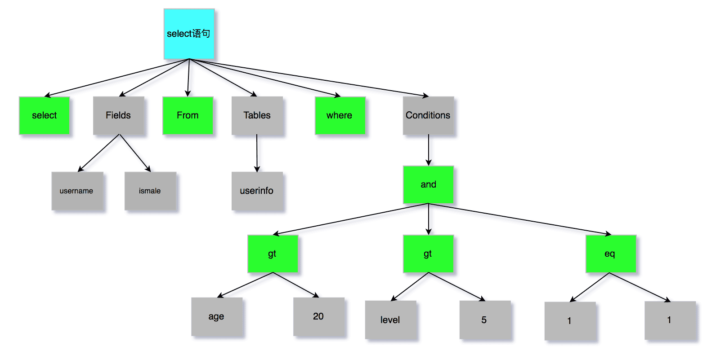
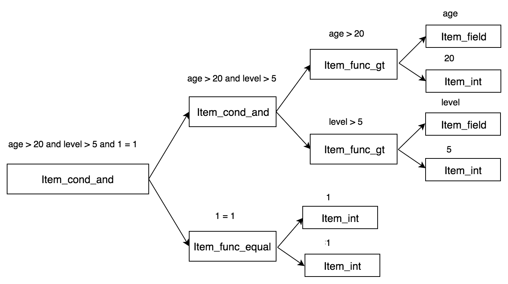
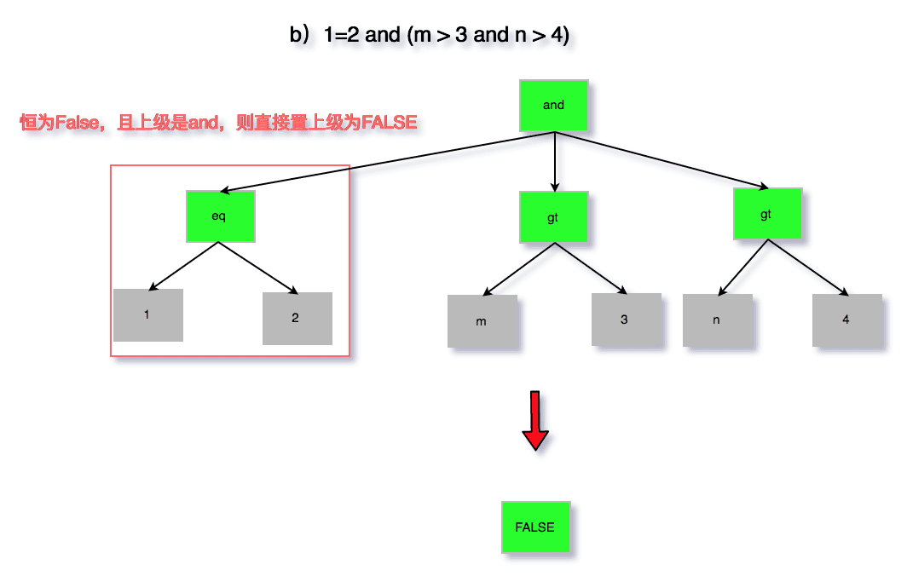
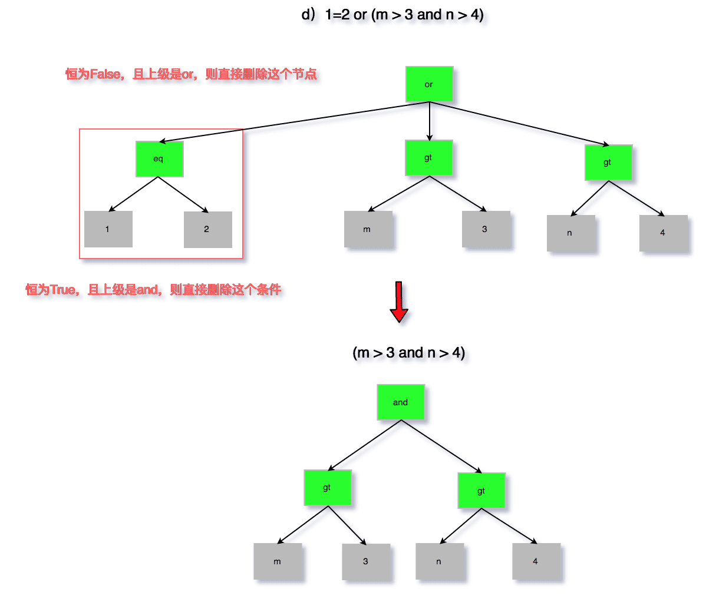

> 前文我们分享了一篇文章学习一条SQL是如何在数据库中执行的，其中有一个阶段是SQL的解析。这个阶段对于更全面的SQL优化功能；多维度的慢查询分析；辅助故障分析等有很大帮助。本文主要介绍一篇美团技术团队关于SQL解析和应用的文章，希望能给一些启示。@pdai

## 背景

数据库作为核心的基础组件，是需要重点保护的对象。任何一个线上的不慎操作，都有可能给数据库带来严重的故障，从而给业务造成巨大的损失。为了避免这种损失，一般会在管理上下功夫。比如为研发人员制定数据库开发规范；新上线的SQL，需要DBA进行审核；维护操作需要经过领导审批等等。而且如果希望能够有效地管理这些措施，需要有效的数据库培训，还需要DBA细心的进行SQL审核。很多中小型创业公司，可以通过设定规范、进行培训、完善审核流程来管理数据库。

随着美团的业务不断发展和壮大，上述措施的实施成本越来越高。如何更多的依赖技术手段，来提高效率，越来越受到重视。业界已有不少基于MySQL源码开发的SQL审核、优化建议等工具，极大的减轻了DBA的SQL审核负担。那么我们能否继续扩展MySQL的源码，来辅助DBA和研发人员来进一步提高效率呢？比如，更全面的SQL优化功能；多维度的慢查询分析；辅助故障分析等。要实现上述功能，其中最核心的技术之一就是SQL解析。

## 现状与场景

SQL解析是一项复杂的技术，一般都是由数据库厂商来掌握，当然也有公司专门提供[SQL解析的API](https://www.sqlparser.com/)。由于这几年MySQL数据库中间件的兴起，需要支持读写分离、分库分表等功能，就必须从SQL中抽出表名、库名以及相关字段的值。因此像Java语言编写的Druid，C语言编写的MaxScale，Go语言编写的Kingshard等，都会对SQL进行部分解析。而真正把SQL解析技术用于数据库维护的产品较少，主要有如下几个:

* 美团开源的[SQLAdvisor](https://github.com/Meituan-Dianping/SQLAdvisor)。它基于MySQL原生态词法解析，结合分析SQL中的where条件、聚合条件、多表Join关系给出索引优化建议。
* 去哪儿开源的Inception（原仓库已经删除，闭源了）。侧重于根据内置的规则，对SQL进行审核。
* 阿里的[Cloud DBA](https://developer.aliyun.com/article/218442)。根据官方文档介绍，其也是提供SQL优化建议和改写。

上述产品都有非常合适的应用场景，在业界也被广泛使用。但是SQL解析的应用场景远远没有被充分发掘，比如：

* 基于表粒度的慢查询报表。比如，一个Schema中包含了属于不同业务线的数据表，那么从业务线的角度来说，其希望提供表粒度的慢查询报表。
* 生成SQL特征。将SQL语句中的值替换成问号，方便SQL归类。虽然可以使用正则表达式实现相同的功能，但是其Bug较多，可以参考pt-query-digest。比如pt-query-digest中，会把遇到的数字都替换成“?”，导致无法区别不同数字后缀的表。
* 高危操作确认与规避。比如，DBA不小心Drop数据表，而此类操作，目前还无有效的工具进行回滚，尤其是大表，其后果将是灾难性的。
* SQL合法性判断。为了安全、审计、控制等方面的原因，美团不会让研发人员直接操作数据库，而是提供RDS服务。尤其是对于数据变更，需要研发人员的上级主管进行业务上的审批。如果研发人员，写了一条语法错误的SQL，而RDS无法判断该SQL是否合法，就会造成不必要的沟通成本。

因此为了让所有有需要的业务都能方便的使用SQL解析功能，我们认为应该具有如下特性。

* 直接暴露SQL解析接口，使用尽量简单。比如，输入SQL，则输出表名、特征和优化建议。
* 接口的使用不依赖于特定的语言，否则维护和使用的代价太高。比如，以HTTP等方式提供服务。

千里之行，始于足下。下面我先介绍下SQL的解析原理。

## SQL解析的原理

SQL解析与优化是属于编译器范畴，和C等其他语言的解析没有本质的区别。其中分为，词法分析、语法和语义分析、优化、执行代码生成。对应到MySQL的部分，如下图



### 词法分析

SQL解析由词法分析和语法/语义分析两个部分组成。词法分析主要是把输入转化成一个个Token。其中Token中包含Keyword（也称symbol）和非Keyword。例如，SQL语句 select username from userinfo，在分析之后，会得到4个Token，其中有2个Keyword，分别为select和from：

| 关键字 | 非关键字 | 关键字 | 非关键字 |
| ------ | -------- | ------ | -------- |
| select | username | from   | userinfo |

通常情况下，词法分析可以使用Flex来生成，但是MySQL并未使用该工具，而是手写了词法分析部分（据说是为了效率和灵活性，参考此文）。具体代码在sql/lex.h和sql/sql_lex.cc文件中。

MySQL中的Keyword定义在sql/lex.h中，如下为部分Keyword：

```sql
{ "&&",               SYM(AND_AND_SYM)},
{ "<",                SYM(LT)},
{ "<=",               SYM(LE)},
{ "<>",               SYM(NE)},
{ "!=",               SYM(NE)},
{ "=",                SYM(EQ)},
{ ">",                SYM(GT_SYM)},
{ ">=",               SYM(GE)},
{ "<<",               SYM(SHIFT_LEFT)},
{ ">>",               SYM(SHIFT_RIGHT)},
{ "<=>",              SYM(EQUAL_SYM)},
{ "ACCESSIBLE",       SYM(ACCESSIBLE_SYM)},
{ "ACTION",           SYM(ACTION)},
{ "ADD",              SYM(ADD)},
{ "AFTER",            SYM(AFTER_SYM)},
{ "AGAINST",          SYM(AGAINST)},
{ "AGGREGATE",        SYM(AGGREGATE_SYM)},
{ "ALL",              SYM(ALL)},
```

词法分析的核心代码在sql/sql_lex.c文件中的，MySQLLex→lex_one_Token，有兴趣的同学可以下载源码研究。

### 语法分析

语法分析就是生成语法树的过程。这是整个解析过程中最精华，最复杂的部分，不过这部分MySQL使用了Bison来完成。即使如此，如何设计合适的数据结构以及相关算法，去存储和遍历所有的信息，也是值得在这里研究的。

#### 语法分析树

SQL语句：

```sql
select username, ismale from userinfo where age > 20 and level > 5 and 1 = 1
```

会生成如下语法树。



对于未接触过编译器实现的同学，肯定会好奇如何才能生成这样的语法树。其背后的原理都是编译器的范畴，可以参考维基百科的一篇文章，以及该链接中的参考书籍。本人也是在学习MySQL源码过程中，阅读了部分内容。由于编译器涉及的内容过多，本人精力和时间有限，不做过多探究。从工程的角度来说，学会如何使用Bison去构建语法树，来解决实际问题，对我们的工作也许有更大帮助。下面我就以Bison为基础，探讨该过程。

#### MySQL语法分析树生成过程

全部的源码在sql/sql_yacc.yy中，在MySQL5.6中有17K行左右代码。这里列出涉及到SQL：

```sql
select username, ismale from userinfo where age > 20 and level > 5 and 1 = 1 
```

解析过程的部分代码摘录出来。其实有了Bison之后，SQL解析的难度也没有想象的那么大。特别是这里给出了解析的脉络之后。

```sql
select /*select语句入口*/:
 
          select_init
 
          {
 
            LEX *lex= Lex;
 
            lex->sql_command= SQLCOM_SELECT;
 
          }
 
        ;
 
select_init:
          SELECT_SYM /*select 关键字*/ select_init2
 
        | '(' select_paren ')' union_opt
 
        ;
 
select_init2:
          select_part2
          {
            LEX *lex= Lex;
            SELECT_LEX * sel= lex->current_select;
            if (lex->current_select->set_braces(0))
            {
              my_parse_error(ER(ER_SYNTAX_ERROR));
              MYSQL_YYABORT;
            }
            if (sel->linkage == UNION_TYPE &&
                sel->master_unit()->first_select()->braces)
            {
              my_parse_error(ER(ER_SYNTAX_ERROR));
              MYSQL_YYABORT;
            }
          }
          union_clause
        ;
select_part2:
          {
            LEX *lex= Lex;
            SELECT_LEX *sel= lex->current_select;
            if (sel->linkage != UNION_TYPE)
              mysql_init_select(lex);
            lex->current_select->parsing_place= SELECT_LIST;
          }
  
          select_options select_item_list /*解析列名*/
          {
            Select->parsing_place= NO_MATTER;
          }
          select_into select_lock_type
        ;
 
select_into:
          opt_order_clause opt_limit_clause {}
        | into
        | select_from /*from 字句*/
        | into select_from
        | select_from into
        ;
select_from:
          FROM join_table_list /*解析表名*/ where_clause /*where字句*/ group_clause having_clause
          opt_order_clause opt_limit_clause procedure_analyse_clause
          {
            Select->context.table_list=
              Select->context.first_name_resolution_table=
                Select->table_list.first;
          }
        | FROM DUAL_SYM where_clause opt_limit_clause
          /* oracle compatibility: oracle always requires FROM clause,
             and DUAL is system table without fields.
             Is "SELECT 1 FROM DUAL" any better than "SELECT 1" ?
          Hmmm :) */
        ;
 
where_clause:
          /* empty */  { Select->where= 0; }
        | WHERE
          {
            Select->parsing_place= IN_WHERE;
          }
          expr /*各种表达式*/
          {
            SELECT_LEX *select= Select;
            select->where= $3;
            select->parsing_place= NO_MATTER;
            if ($3)
              $3->top_level_item();
          }
        ;
  
/* all possible expressions */
expr:
           | expr and expr %prec AND_SYM
          {
            /* See comments in rule expr: expr or expr */
            Item_cond_and *item1;
            Item_cond_and *item3;
            if (is_cond_and($1))
            {
              item1= (Item_cond_and*) $1;
              if (is_cond_and($3))
              {
                item3= (Item_cond_and*) $3;
                /*
                  (X1 AND X2) AND (Y1 AND Y2) ==> AND (X1, X2, Y1, Y2)
                */
                item3->add_at_head(item1->argument_list());
                $$ = $3;
              }
              else
              {
                /*
                  (X1 AND X2) AND Y ==> AND (X1, X2, Y)
                */
                item1->add($3);
                $$ = $1;
              }
            }
            else if (is_cond_and($3))
            {
              item3= (Item_cond_and*) $3;
              /*
                X AND (Y1 AND Y2) ==> AND (X, Y1, Y2)
              */
              item3->add_at_head($1);
              $$ = $3;
            }
            else
            {
              /* X AND Y */
              $$ = new (YYTHD->mem_root) Item_cond_and($1, $3);
              if ($$ == NULL)
                MYSQL_YYABORT;
            }
          }
```

在大家浏览上述代码的过程，会发现Bison中嵌入了C++的代码。通过C++代码，把解析到的信息存储到相关对象中。例如表信息会存储到TABLE_LIST中，order_list存储order by子句里的信息，where字句存储在Item中。有了这些信息，再辅助以相应的算法就可以对SQL进行更进一步的处理了。

#### 核心数据结构及其关系

在SQL解析中，最核心的结构是SELECT_LEX，其定义在sql/sql_lex.h中。下面仅列出与上述例子相关的部分。


上面图示中，列名username、ismale存储在item_list中，表名存储在table_list中，条件存储在where中。其中以where条件中的Item层次结构最深，表达也较为复杂，如下图所示。---



## SQL解析的应用

为了更深入的了解SQL解析器，这里给出2个应用SQL解析的例子。

### 无用条件去除

无用条件去除属于优化器的逻辑优化范畴，可以仅仅根据SQL本身以及表结构即可完成，其优化的情况也是较多的，代码在sql/sql_optimizer.cc文件中的remove_eq_conds函数。为了避免过于繁琐的描述，以及大段代码的粘贴，这里通过图来分析以下四种情况。

a）1=1 and (m > 3 and n > 4)


b）1=2 and (m > 3 and n > 4)



c）1=1 or (m > 3 and n > 4)


d）1=2 or (m > 3 and n > 4)



如果对其代码实现有兴趣的同学，需要对MySQL中的一个重要数据结构Item类有所了解。因为其比较复杂，所以MySQL[官方文档](https://dev.mysql.com/doc/internals/en/item-class.html)，专门介绍了Item类。阿里的MySQL小组，也有类似的[文章](https://www.orczhou.com/index.php/2012/11/mysql-innodb-source-code-optimization-1/)。如需更详细的了解，就需要去查看源码中sql/item_*等文件。

### SQL特征生成

为了确保数据库，这一系统基础组件稳定、高效运行，业界有很多辅助系统。比如慢查询系统、中间件系统。这些系统采集、收到SQL之后，需要对SQL进行归类，以便统计信息或者应用相关策略。归类时，通常需要获取SQL特征。比如SQL:

```sql
select username, ismale from userinfo where age > 20 and level > 5；
```

SQL特征为：

```sql
select username, ismale from userinfo where age > ? and level > ? 
```

业界著名的慢查询分析工具pt-query-digest，通过正则表达式实现这个功能但是这类处理办法Bug较多。接下来就介绍如何使用SQL解析，完成SQL特征的生成。

SQL特征生成分两部分组成。

* a) 生成Token数组
* b) 根据Token数组，生成SQL特征

首先回顾在词法解析章节，我们介绍了SQL中的关键字，并且每个关键字都有一个16位的整数对应，而非关键字统一用ident表示，其也对应了一个16位整数。如下表：

| 标识 | select | from | where | >   | ?   | and | ident |
| ---- | ------ | ---- | ----- | --- | --- | --- | ----- |
| 整数 | 728    | 448  | 878   | 463 | 893 | 272 | 476   |

将一个SQL转换成特征的过程：

| 原SQL   | select | username           | from | userinfo           | where | age                | > | 20 |
| ------- | ------ | ------------------ | ---- | ------------------ | ----- | ------------------ | - | -- |
| SQL特征 | select | ident:length:value | from | ident:length:value | where | ident:length:value | > | ?  |

在SQL解析过程中，可以很方便的完成Token数组的生成。而一旦完成Token数组的生成，就可以很简单的完成SQL特征的生成。SQL特征被广泛用于各个系统中，比如pt-query-digest需要根据特征对SQL归类，然而其基于正则表达式的实现有诸多bug。下面列举几个已知Bug：

| 原始SQL                                                   | pt-query-digest生成的特征                           | SQL解析器生成的特征                         |
| --------------------------------------------------------- | --------------------------------------------------- | ------------------------------------------- |
| select * from email_template2 where id = 1                | select * from mail_template？ where id = ？         | select * from email_template2 where id = ？ |
| REPLACE INTO a VALUES(‘INSERT INTO foo VALUES (1),(2)’) | replace into a values(\‘insert into foo values(?+) | replace into a values （?）                 |

因此可以看出SQL解析的优势是很明显的。

## 学习建议

最近，在对SQL解析器和优化器探索的过程中，从一开始的茫然无措到有章可循，也总结了一些心得体会，在这里跟大家分享一下。

* 首先，阅读相关图书书籍。图书能给我们系统认识解析器和优化器的角度。但是针对MySQL的此类图书市面上很少，目前中文作品可以看一看《数据库查询优化器的艺术：原理解析与SQL性能优化》。
* 其次，要阅读源码，但是最好以某个版本为基础，比如MySQL5.6.23，因为SQL解析、优化部分的代码在不断变化。尤其是在跨越大的版本时，改动力度大。
* 再次，多使用GDB调试，验证自己的猜测，检验阅读质量。
* 最后，需要写相关代码验证，只有写出来了才能算真正的掌握。

## 作者简介

* 广友，美团到店综合事业群MySQL DBA专家，2012年毕业于中国科学技术大学，2017年加入美团，长期致力于MySQL及周边工具的研究。
* 金龙，2014年加入美团，主要从事相关的数据库运维、高可用和相关的运维平台建设。对运维高可用与架构相关感兴趣的同学可以关注个人微信公众号“自己的设计师”，定期推送运维相关原创内容。
* 邢帆，美团到店综合事业群MySQL DBA，2017年研究生毕业后加入美团，目前已经对MySQL运维有一定经验，并编写了一些自动化脚本。

# Reference Links：

转载说明

* 作者：广友
* 版权声明：本文为美团技术团队的原创文章，遵循 CC 4.0 BY-SA 版权协议，转载请附上原文出处链接及本声明。
* 原文链接：https://tech.meituan.com/2018/05/20/sql-parser-used-in-mtdp.html

https://pdai.tech/md/db/sql-mysql/sql-mysql-sql-parser.html
