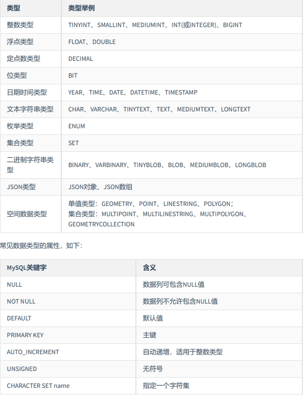
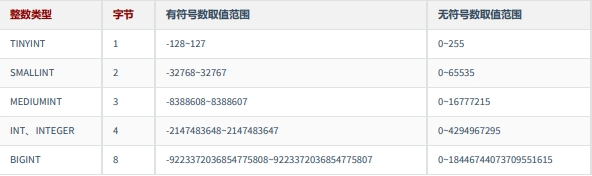
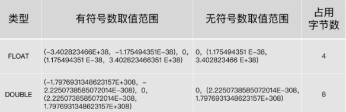

# MySQL中的数据类型



# 整数类型

## 类型介绍

整数类型一共有 5 种，包括 TINYINT、SMALLINT、MEDIUMINT、INT（INTEGER）和 BIGINT。它们的区别如下表所示：



## 可选属性

整数类型的可选属性有三个：

### M

M : 表示显示宽度，M的取值范围是(0, 255)。例如，int(5)：当数据宽度小于5位的时候在数字前面需要用字符填满宽度。该项功能需要配合“ ZEROFILL ”使用，表示用“0”填满宽度，否则指定显示宽度无效。

如果设置了显示宽度，那么插入的数据宽度超过显示宽度限制，会不会截断或插入失败？

答案：不会对插入的数据有任何影响，还是按照类型的实际宽度进行保存，即 显示宽度与类型可以存储的值范围无关 。从MySQL 8.0.17开始，整数数据类型不推荐使用显示宽度属性。

整型数据类型可以在定义表结构时指定所需要的显示宽度，如果不指定，则系统为每一种类型指定默认的宽度值。

举例：

```
CREATE TABLE test_int1 ( x TINYINT, y SMALLINT, z MEDIUMINT, m INT, n BIGINT );
```

查看表结构 （MySQL5.7中显式如下，MySQL8中不再显式范围）

```
mysql> desc test_int1;
+-------+--------------+------+-----+---------+-------+
| Field | Type | Null | Key | Default | Extra |
+-------+--------------+------+-----+---------+-------+
| x | tinyint(4) | YES | | NULL | |
| y | smallint(6) | YES | | NULL | |
| z | mediumint(9) | YES | | NULL | |
| m | int(11) | YES | | NULL | |
| n | bigint(20) | YES | | NULL | |
+-------+--------------+------+-----+---------+-------+
5 rows in set (0.00 sec)
```

TINYINT有符号数和无符号数的取值范围分别为-128~127 和 0-255，由于负号占了一个数字位，因此TINYINT默认的显示宽度为4。同理，其他整数类型的默认显示宽度与其有符号数的最小值的宽度相同。

举例：

```
CREATE TABLE test_int2(
f1 INT,
f2 INT(5),
f3 INT(5) ZEROFILL
)

DESC test_int2;

INSERT INTO test_int2(f1,f2,f3)
VALUES(1,123,123);

INSERT INTO test_int2(f1,f2)
VALUES(123456,123456);

INSERT INTO test_int2(f1,f2,f3)
VALUES(123456,123456,123456);
```

```
mysql> SELECT * FROM test_int2;
+--------+--------+--------+
| f1 | f2 | f3 |
+--------+--------+--------+
| 1 | 123 | 00123 |
| 123456 | 123456 | NULL |
| 123456 | 123456 | 123456 |
+--------+--------+--------+
3 rows in set (0.00 sec)
```

### UNSIGNED

UNSIGNED : 无符号类型（非负），所有的整数类型都有一个可选的属性UNSIGNED（无符号属性），无符号整数类型的最小取值为0。所以，如果需要在MySQL数据库中保存非负整数值时，可以将整数类型设置为无符号类型。

int类型默认显示宽度为int(11)，无符号int类型默认显示宽度为int(10)。

```
CREATE TABLE test_int3(
f1 INT UNSIGNED
);
mysql> desc test_int3;
+-------+------------------+------+-----+---------+-------+
| Field | Type | Null | Key | Default | Extra |
+-------+------------------+------+-----+---------+-------+
| f1 | int(10) unsigned | YES | | NULL | |
+-------+------------------+------+-----+---------+-------+
1 row in set (0.00 sec)
```

### ZEROFILL

ZEROFILL : 0填充,（如果某列是ZEROFILL，那么MySQL会自动为当前列添加UNSIGNED属性），如果指定了ZEROFILL只是表示不够M位时，用0在左边填充，如果超过M位，只要不超过数据存储范围即可。

原来，在 int(M) 中，M 的值跟 int(M) 所占多少存储空间并无任何关系。 int(3)、int(4)、int(8) 在磁盘上都是占用 4 bytes 的存储空间。也就是说，int(M)，必须和UNSIGNED ZEROFILL一起使用才有意义。如果整数值超过M位，就按照实际位数存储。只是无须再用字符 0 进行填充。

## 适用场景

* TINYINT ：一般用于枚举数据，比如系统设定取值范围很小且固定的场景。
* SMALLINT ：可以用于较小范围的统计数据，比如统计工厂的固定资产库存数量等。
* MEDIUMINT ：用于较大整数的计算，比如车站每日的客流量等。
* INT、INTEGER ：取值范围足够大，一般情况下不用考虑超限问题，用得最多。比如商品编号。
* BIGINT ：只有当你处理特别巨大的整数时才会用到。比如双十一的交易量、大型门户网站点击量、证券公司衍生产品持仓等。

## 如何选择？

在评估用哪种整数类型的时候，你需要考虑 存储空间 和 可靠性 的平衡问题：一方 面，用占用字节数少的整数类型可以节省存储空间；另一方面，要是为了节省存储空间， 使用的整数类型取值范围太小，一旦遇到超出取值范围的情况，就可能引起 系统错误 ，影响可靠性。

举个例子，商品编号采用的数据类型是 INT。原因就在于，客户门店中流通的商品种类较多，而且，每天都有旧商品下架，新商品上架，这样不断迭代，日积月累。

如果使用 SMALLINT 类型，虽然占用字节数比 INT 类型的整数少，但是却不能保证数据不会超出范围65535。相反，使用 INT，就能确保有足够大的取值范围，不用担心数据超出范围影响可靠性的问题。

你要注意的是，在实际工作中，系统故障产生的成本远远超过增加几个字段存储空间所产生的成本。因此，我建议你首先确保数据不会超过取值范围，在这个前提之下，再去考虑如何节省存储空间。

# 浮点类型

## 类型介绍

浮点数和定点数类型的特点是可以 处理小数 ，你可以把整数看成小数的一个特例。因此，浮点数和定点数的使用场景，比整数大多了。 MySQL支持的浮点数类型，分别是 FLOAT、DOUBLE、REAL。

* FLOAT 表示单精度浮点数；
* DOUBLE 表示双精度浮点数；



* REAL默认就是 DOUBLE。如果你把 SQL 模式设定为启用“ REAL_AS_FLOAT ”，那 么，MySQL 就认为REAL 是 FLOAT。如果要启用“REAL_AS_FLOAT”，可以通过以下 SQL 语句实现：

  ```
  SET sql_mode = “REAL_AS_FLOAT”;
  ```

问题1：FLOAT 和 DOUBLE 这两种数据类型的区别是啥呢？

FLOAT 占用字节数少，取值范围小；DOUBLE 占用字节数多，取值范围也大。

问题2：为什么浮点数类型的无符号数取值范围，只相当于有符号数取值范围的一半，也就是只相当于有符号数取值范围大于等于零的部分呢？

MySQL 存储浮点数的格式为： 符号(S) 、 尾数(M) 和 阶码(E) 。因此，无论有没有符号，MySQL 的浮点数都会存储表示符号的部分。因此， 所谓的无符号数取值范围，其实就是有符号数取值范围大于等于零的部分。

## 数据精度说明

对于浮点类型，在MySQL中单精度值使用 4 个字节，双精度值使用 8 个字节。

* MySQL允许使用 非标准语法 （其他数据库未必支持，因此如果涉及到数据迁移，则最好不要这么
  用）： FLOAT(M,D) 或 DOUBLE(M,D) 。这里，M称为 精度 ，D称为 标度 。(M,D)中 M=整数位+小数
  位，D=小数位。 `D<=M<=255`，`0<=D<=30`。例如，定义为FLOAT(5,2)的一个列可以显示为-999.99-999.99。如果超过这个范围会报错。
* FLOAT和DOUBLE类型在不指定(M,D)时，默认会按照实际的精度（由实际的硬件和操作系统决定）来显示。
* 说明：浮点类型，也可以加 UNSIGNED ，但是不会改变数据范围，例如：FLOAT(3,2) UNSIGNED仍然只能表示0-9.99的范围。
* 不管是否显式设置了精度(M,D)，这里MySQL的处理方案如下：
  * 如果存储时，整数部分超出了范围，MySQL就会报错，不允许存这样的值
  * 如果存储时，小数点部分若超出范围，就分以下情况：
    * 若四舍五入后，整数部分没有超出范围，则只警告，但能成功操作并四舍五入删除多余的小数位后保存。例如在FLOAT(5,2)列内插入999.009，近似结果是999.01。
    * 若四舍五入后，整数部分超出范围，则MySQL报错，并拒绝处理。如FLOAT(5,2)列内插入999.995和-999.995都会报错。
* 从MySQL 8.0.17开始，FLOAT(M,D) 和DOUBLE(M,D)用法在官方文档中已经明确不推荐使用，将来可能被移除。另外，关于浮点型FLOAT和DOUBLE的UNSIGNED也不推荐使用了，将来也可能被移除。
* 举例
  ```
  CREATE TABLE test_double1(
  f1 FLOAT,
  f2 FLOAT(5,2),
  f3 DOUBLE,
  f4 DOUBLE(5,2)
  );

  DESC test_double1;

  INSERT INTO test_double1
  VALUES(123.456,123.456,123.4567,123.45);

  #Out of range value for column 'f2' at row 1
  INSERT INTO test_double1
  VALUES(123.456,1234.456,123.4567,123.45);

  SELECT * FROM test_double1;
  ```

## 精度误差说明

浮点数类型有个缺陷，就是不精准。下面我来重点解释一下为什么 MySQL 的浮点数不够精准。比如，我们设计一个表，有f1这个字段，插入值分别为0.47,0.44,0.19，我们期待的运行结果是：0.47 + 0.44 + 0.19 =1.1。而使用sum之后查询：

```
CREATE TABLE test_double2(
f1 DOUBLE
);

INSERT INTO test_double2
VALUES(0.47),(0.44),(0.19);
```

```
mysql> SELECT SUM(f1)
-> FROM test_double2;
+--------------------+
| SUM(f1) |
+--------------------+
| 1.0999999999999999 |
+--------------------+
1 row in set (0.00 sec)
```

```
mysql> SELECT SUM(f1) = 1.1,1.1 = 1.1
-> FROM test_double2;
+---------------+-----------+
| SUM(f1) = 1.1 | 1.1 = 1.1 |
+---------------+-----------+
| 0 | 1 |
+---------------+-----------+
1 row in set (0.00 sec)
```

查询结果是 1.0999999999999999。看到了吗？虽然误差很小，但确实有误差。 你也可以尝试把数据类型
改成 FLOAT，然后运行求和查询，得到的是， 1.0999999940395355。显然，误差更大了。

那么，为什么会存在这样的误差呢？问题还是出在 MySQL 对浮点类型数据的存储方式上。

MySQL 用 4 个字节存储 FLOAT 类型数据，用 8 个字节来存储 DOUBLE 类型数据。无论哪个，都是采用二进制的方式来进行存储的。比如 9.625，用二进制来表达，就是 1001.101，或者表达成 1.001101×2^3。如果尾数不是 0 或 5（比如 9.624），你就无法用一个二进制数来精确表达。进而，就只好在取值允许的范围内进行四舍五入。

在编程中，如果用到浮点数，要特别注意误差问题，因为浮点数是不准确的，所以我们要避免使用“=”来判断两个数是否相等。同时，在一些对精确度要求较高的项目中，千万不要使用浮点数，不然会导致结果错误，甚至是造成不可挽回的损失。那么，MySQL 有没有精准的数据类型呢？当然有，这就是定点数类型： DECIMAL 。

# 定点数类型
