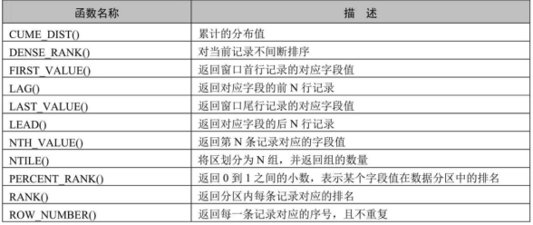

# MySQL8新特性概述

MySQL从5.7版本直接跳跃发布了8.0版本 ，可见这是一个令人兴奋的里程碑版本。MySQL 8版本在功能上做了显著的改进与增强，开发者对MySQL的源代码进行了重构，最突出的一点是多MySQL Optimizer优化器进行了改进。不仅在速度上得到了改善，还为用户带来了更好的性能和更棒的体验。

## MySQL8.0 新增特性

1. 更简便的NoSQL支持

   * NoSQL泛指非关系型数据库和数据存储。随着互联网平台的规模飞速发展，传统的关系型数据库已经越来越不能满足需求。从5.6版本开始，MySQL就开始支持简单的NoSQL存储功能。MySQL 8对这一功能做了优化，以更灵活的方式实现NoSQL功能，不再依赖模式（schema）。
1. 更好的索引

   * 在查询中，正确地使用索引可以提高查询的效率。MySQL 8中新增了 隐藏索引 和 降序索引 。隐藏索引可以用来测试去掉索引对查询性能的影响。在查询中混合存在多列索引时，使用降序索引可以提高查询的性能。
1. 更完善的JSON支持

   * MySQL从5.7开始支持原生JSON数据的存储，MySQL 8对这一功能做了优化，增加了聚合函数 JSON_ARRAYAGG() 和 JSON_OBJECTAGG() ，将参数聚合为JSON数组或对象，新增了行内操作符 ->>，是列路径运算符 ->的增强，对JSON排序做了提升，并优化了JSON的更新操作。
1. 安全和账户管理

   * MySQL 8中新增了 caching_sha2_password 授权插件、角色、密码历史记录和FIPS模式支持，这些特性提高了数据库的安全性和性能，使数据库管理员能够更灵活地进行账户管理工作。
1. InnoDB的变化

   * InnoDB是MySQL默认的存储引擎 ，是事务型数据库的首选引擎，支持事务安全表（ACID），支持行锁定和外键。在MySQL 8 版本中，InnoDB在自增、索引、加密、死锁、共享锁等方面做了大量的 改进和优化 ，并且支持原子数据定义语言（DDL），提高了数据安全性，对事务提供更好的支持。
1. 数据字典

   * 在之前的MySQL版本中，字典数据都存储在元数据文件和非事务表中。从MySQL 8开始新增了事务数据字典，在这个字典里存储着数据库对象信息，这些数据字典存储在内部事务表中。
1. 原子数据定义语句

   * MySQL 8开始支持原子数据定义语句（Automic DDL），即 原子DDL 。目前，只有InnoDB存储引擎支持原子DDL。原子数据定义语句（DDL）将与DDL操作相关的数据字典更新、存储引擎操作、二进制日志写入结合到一个单独的原子事务中，这使得即使服务器崩溃，事务也会提交或回滚。使用支持原子操作的存储引擎所创建的表，在执行DROP TABLE、CREATE TABLE、ALTER TABLE、RENAME TABLE、TRUNCATE TABLE、CREATE TABLESPACE、DROP TABLESPACE等操作时，都支持原子操作，即事务要么完全操作成功，要么失败后回滚，不再进行部分提交。 对于从MySQL 5.7复制到MySQL 8版本中的语句，可以添加 IF EXISTS 或 IF NOT EXISTS 语句来避免发生错误。
1. 资源管理

   * MySQL 8开始支持创建和管理资源组，允许将服务器内运行的线程分配给特定的分组，以便线程根据组内可用资源执行。组属性能够控制组内资源，启用或限制组内资源消耗。数据库管理员能够根据不同的工作负载适当地更改这些属性。 目前，CPU时间是可控资源，由“虚拟CPU”这个概念来表示，此术语包含CPU的核心数，超线程，硬件线程等等。服务器在启动时确定可用的虚拟CPU数量。拥有对应权限的数据库管理员可以将这些CPU与资源组关联，并为资源组分配线程。 资源组组件为MySQL中的资源组管理提供了SQL接口。资源组的属性用于定义资源组。MySQL中存在两个默认组，系统组和用户组，默认的组不能被删除，其属性也不能被更改。对于用户自定义的组，资源组创建时可初始化所有的属性，除去名字和类型，其他属性都可在创建之后进行更改。 在一些平台下，或进行了某些MySQL的配置时，资源管理的功能将受到限制，甚至不可用。例如，如果安装了线程池插件，或者使用的是macOS系统，资源管理将处于不可用状态。在FreeBSD和Solaris系统中，资源线程优先级将失效。在Linux系统中，只有配置了CAP_SYS_NICE属性，资源管理优先级才能发挥作用。
1. 字符集支持

   * MySQL 8中默认的字符集由 latin1 更改为 utf8mb4 ，并首次增加了日语所特定使用的集合，utf8mb4_ja_0900_as_cs。
1. 优化器增强

   * MySQL优化器开始支持隐藏索引和降序索引。隐藏索引不会被优化器使用，验证索引的必要性时不需要删除索引，先将索引隐藏，如果优化器性能无影响就可以真正地删除索引。降序索引允许优化器对多个列进行排序，并且允许排序顺序不一致。
1. 公用表表达式

   * 公用表表达式（Common Table Expressions）简称为CTE，MySQL现在支持递归和非递归两种形式的CTE。CTE通过在SELECT语句或其他特定语句前 使用WITH语句对临时结果集 进行命名。
   * 基础语法如下：

     ```
     WITH cte_name (col_name1,col_name2 ...) AS (Subquery)
     SELECT * FROM cte_name;
     ```

     Subquery代表子查询，子查询前使用WITH语句将结果集命名为cte_name，在后续的查询中即可使用cte_name进行查询。
1. 窗口函数

   * MySQL 8开始支持窗口函数。在之前的版本中已存在的大部分 聚合函数 在MySQL 8中也可以作为窗口函数来使用。

     
1. 正则表达式支持

   * MySQL在8.0.4以后的版本中采用支持Unicode的国际化组件库实现正则表达式操作，这种方式不仅能提供完全的Unicode支持，而且是多字节安全编码。MySQL增加了REGEXP_LIKE()、EGEXP_INSTR()、REGEXP_REPLACE()和 REGEXP_SUBSTR()等函数来提升性能。另外，regexp_stack_limit和regexp_time_limit 系统变量能够通过匹配引擎来控制资源消耗。
1. 内部临时表

   * TempTable存储引擎取代MEMORY存储引擎成为内部临时表的默认存储引擎 。TempTable存储引擎为VARCHAR和VARBINARY列提供高效存储。internal_tmp_mem_storage_engine会话变量定义了内部临时表的存储引擎，可选的值有两个，TempTable和MEMORY，其中TempTable为默认的存储引擎。temptable_max_ram系统配置项定义了TempTable存储引擎可使用的最大内存数量。
1. 日志记录

   * 在MySQL 8中错误日志子系统由一系列MySQL组件构成。这些组件的构成由系统变量log_error_services来配置，能够实现日志事件的过滤和写入。
1. 备份锁

   * 新的备份锁允许在线备份期间执行数据操作语句，同时阻止可能造成快照不一致的操作。新备份锁由 LOCK INSTANCE FOR BACKUP 和 UNLOCK INSTANCE 语法提供支持，执行这些操作需要备份管理员特权。
1. 增强的MySQL复制

   * MySQL 8复制支持对 JSON文档 进行部分更新的 二进制日志记录 ，该记录 使用紧凑的二进制格式 ，从而节省记录完整JSON文档的空间。当使用基于语句的日志记录时，这种紧凑的日志记录会自动完成，并且可以通过将新的binlog_row_value_options系统变量值设置为PARTIAL_JSON来启用。


## MySQL8.0移除的旧特性

在MySQL 5.7版本上开发的应用程序如果使用了MySQL8.0 移除的特性，语句可能会失败，或者产生不同的执行结果。为了避免这些问题，对于使用了移除特性的应用，应当尽力修正避免使用这些特性，并尽可能使用替代方法。

1. 查询缓存
   * 查询缓存已被移除 ，删除的项有：
     1. 语句：FLUSH QUERY CACHE和RESET QUERY CACHE。
     2. 系统变量：query_cache_limit、query_cache_min_res_unit、query_cache_size、query_cache_type、query_cache_wlock_invalidate。
     3. 状态变量：Qcache_free_blocks、Qcache_free_memory、Qcache_hits、Qcache_inserts、Qcache_lowmem_prunes、Qcache_not_cached、Qcache_queries_in_cache、Qcache_total_blocks。
     4. 线程状态：checking privileges on cached query、checking query cache for query、invalidating query cache entries、sending cached result to client、storing result in query cache、waiting for query cache lock。
2. 加密相关
   * 删除的加密相关的内容有：ENCODE()、DECODE()、ENCRYPT()、DES_ENCRYPT()和DES_DECRYPT()函数，配置项des-key-file，系统变量have_crypt，FLUSH语句的DES_KEY_FILE选项，HAVE_CRYPT CMake选项。 对于移除的ENCRYPT()函数，考虑使用SHA2()替代，对于其他移除的函数，使用AES_ENCRYPT()和AES_DECRYPT()替代。
3. 空间函数相关
   * 在MySQL 5.7版本中，多个空间函数已被标记为过时。这些过时函数在MySQL 8中都已被移除，只保留了对应的ST_和MBR函数。
4. `.\N`和 `NULL`
   * 在SQL语句中，解析器不再将\N视为NULL，所以在SQL语句中应使用NULL代替\N。这项变化不会影响使用LOAD DATA INFILE或者SELECT...INTO OUTFILE操作文件的导入和导出。在这类操作中，NULL仍等同于\N。
5. mysql_install_db
   * 在MySQL分布中，已移除了mysql_install_db程序，数据字典初始化需要调用带着--initialize或者--initialize-insecure选项的mysqld来代替实现。另外，--bootstrap和INSTALL_SCRIPTDIR CMake也已被删除
6. 通用分区处理程序
   * 通用分区处理程序已从MySQL服务中被移除。为了实现给定表分区，表所使用的存储引擎需要自有的分区处理程序。 提供本地分区支持的MySQL存储引擎有两个，即InnoDB和NDB，而在MySQL 8中只支持InnoDB。
7. 系统和状态变量信息
   * 在INFORMATION_SCHEMA数据库中，对系统和状态变量信息不再进行维护。
     GLOBAL_VARIABLES、SESSION_VARIABLES、GLOBAL_STATUS、SESSION_STATUS表都已被删除。另外，系
     统变量show_compatibility_56也已被删除。被删除的状态变量有Slave_heartbeat_period、Slave_last_heartbeat,Slave_received_heartbeats、Slave_retried_transactions、Slave_running。以上被删除的内容都可使用性能模式中对应的内容进行替代。
8. .mysql_plugin工具
   * mysql_plugin工具用来配置MySQL服务器插件，现已被删除，可使用--plugin-load或--plugin-load-add选项在服务器启动时加载插件或者在运行时使用INSTALL PLUGIN语句加载插件来替代该工具。

# 未完待续，占位
