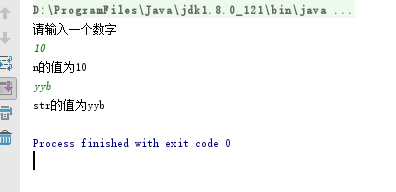
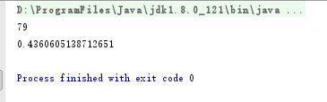
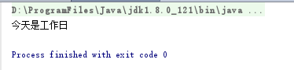
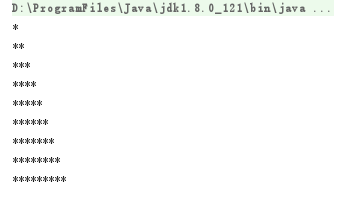
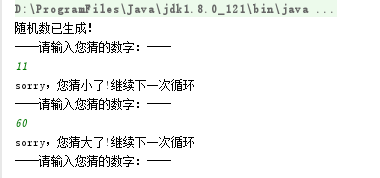

# 流程控制语句、循环

## Scanner类

Scanner类属于引用数据类型，先了解下引用数据类型。

### 引用数据类型的使用

与定义基本数据类型变量不同，引用数据类型的变量定义及赋值有一个相对固定的步骤或格式。

```
数据类型  变量名  =  new 数据类型();
```

每种引用数据类型都有其功能，我们可以调用该类型实例使用其功能。

```
变量名.方法名();
```

Scanner类可以完成用户键盘录入，获取到录入的数据。

Scanner使用步骤：

导包： **import java.util.Scanner;**

创建对象实例：**Scanner sc =** new **Scanner(System.**in**);**

调用方法：

```
int  i = sc.nextInt(); 用来接收控制台录入的数字

String s = sc.next(); 用来接收控制台录入的字符串
```

了解完Scanner类，我们编写代码来使用下它：ScannerDemo01.java

```
import java.util.Scanner;
public class ScannerDemo01 {
    public static void main(String[] args) {
        //创建Scanner引用类型的变量
        Scanner sc = new Scanner(System.in);
        //获取数字
        System.out.println("请输入一个数字");
        int n = sc.nextInt();
        System.out.println("n的值为" + n);
        //获取字符串
        String str = sc.next();
        System.out.println("str的值为" + str);

    }
}
```

运行结果如下图所示:



## **随机数类Random**

用来产生随机数的类Random，它也属于引用数据类型。

这个Random类，它可以产生多种数据类型的随机数，在这里主要介绍生成整数与小数的方式。

方法简介

```
public int nextInt(int maxValue) 产生[0,maxValue)范围的随机整数，包含0，不包含maxValue；

public double nextDouble()  产生[0,1)范围的随机小数，包含0.0，不包含1.0。
```

Random使用方式:

import导包： **java.util.Random**

创建实例格式 **：Random 变量名 =** new **Random();**

接下来，通过一段代码，学习下Random类的使用，RandomDemo.java

```
import java.util.Random;
public class RandomDemo {
    public static void main(String[] args) {
        // 创建Random类的实例
        Random r = new Random();
        // 得到0-100范围内的随机整数，将产生的随机整数赋值给i变量
        int i = r.nextInt(100);
        //得到0.0-1.0范围内的随机小数，将产生的随机小数赋值给d变量
        double d = r.nextDouble();
        System.out.println(i);
        System.out.println(d);
    }
}
```

运行结果如下图所示：



## 选择结构if

 **if语句**

if语句是指如果满足某种条件，就进行某种处理。

在Java中，if语句的具体语法格式如下：

```
if (条件语句){

执行语句;

……

}
```

上述格式中，判断条件是一个布尔值，当判断条件为true时，{}中的执行语句才会执行。

接下来通过一段代码，学习一下if语句的具体用法，IfDemo01.java

```
//定义了一个变量x，其初始值为5。在if语句的判断条件中判断x的值是否小于10，很明显条件成立，{}中的语句会被执行，变量x的值将进行自增。从运行结果可以看出，x的值已由原来的5变成了6。
public class IfDemo01 {
    public static void main(String[] args) {
        int x = 5;
        if (x < 10) {
            x++;
        }
        System.out.println("x=" + x);//x=6
    }
}
```

### **if…** **else语句**

if…else语句是指如果满足某种条件，就进行某种处理，否则就进行另一种处理。if…else语句具体语法格式如下：

```
if (判断条件){
    执行语句1
    ……
}else{
    执行语句2
    ……
}
```

上述格式中，判断条件是一个布尔值。当判断条件为true时，if后面{}中的执行语句1会执行。当判断条件为false时，else后面{}中的执行语句2会执行。

接下来通过一段代码，来实现判断奇偶数的程序，IfDemo02.java

```
public class IfDemo02 {
    public static void main(String[] args) {
        int num = 19;
        if (num % 2 == 0) {
        // 判断条件成立，num被2整除
            System.out.println("num是一个偶数");
        } else {
            System.out.println("num是一个奇数");
        }
    }
}
//num是一个奇数
```

上述代码中，变量num的值为19，模以2的结果为1，不等于0，判断条件不成立。因此会执行else后面{}中的语句，打印“num是一个奇数”。

### **if…**  **else if**  **…** **else语句**

if…else if…else语句用于对多个条件进行判断，进行多种不同的处理。if…else if…else语句具体语法格式如下：

```
if (判断条件1) {
　　执行语句1
} else if (判断条件2) {
　　执行语句2
}
...
else if (判断条件n) {
　　执行语句n
} else {
　　执行语句n+1
}
```

上述格式中，判断条件是一个布尔值。当判断条件1为true时，if后面{}中的执行语句1会执行。当判断条件1为false时，会继续执行判断条件2，如果为true则执行语句2，以此类推，如果所有的判断条件都为false，则意味着所有条件均未满足，else后面{}中的执行语句n+1会执行。

接下来通过一段代码，来实现对学生考试成绩进行等级划分的程序，IfDemo03.java

```
public class IfDemo03 {
    public static void main(String[] args) {
        int grade = 75; // 定义学生成绩
        if (grade > 80) {
        // 满足条件 grade > 80
            System.out.println("该成绩的等级为优");
        } else if (grade > 70) {
        // 不满足条件 grade > 80 ，但满足条件 grade > 70
            System.out.println("该成绩的等级为良");
        } else if (grade > 60) {
        // 不满足条件 grade > 70 ，但满足条件 grade > 60
            System.out.println("该成绩的等级为中");
        } else {
        // 不满足条件 grade > 60
            System.out.println("该成绩的等级为差");
        }
    }
}
//该成绩的等级为良
```

上述代码中，定义了学生成绩grade为75。它不满足第一个判断条件grade>80，会执行第二个判断条件grade>70，条件成立，因此会打印“该成绩的等级为良”。

### **选择结构if语句与三元运算转换**

三元运算符，它和if-else语句类似，语法如下：

```
判断条件 ? 表达式1 : 表达式2
```

三元运算符会得到一个结果，通常用于对某个变量进行赋值，当判断条件成立时，运算结果为表达式1的值，否则结果为表达式2的值。

例如求两个数x、y中的较大者，如果用if…else语句来实现，具体代码如下：

```
int x = 0;
int y = 1;
int max;
if (x > y) {
　　max = x;
} else {
　　max = y;
}
```

可以替换为

```
int x=0;
int y=1;
int max = x > y ? x : y;
```

## **switch语句**

**根据一个整数表达式的值， switch 语句可从一系列**代码选出一段执行。它的格式如下：

```
switch(整数选择因子或者字符串或者枚举) {
　　case 整数值 1 : 语句; break;
　　case 整数值 2 : 语句; break;
　　case 整数值 3 : 语句; break;
　　case 整数值 4 : 语句; break;
　　case 整数值 5 : 语句; break;
　　//..
　　default:语句;92
}
```

switch 能将整数选择因子的结果与每个整数值比较。若发现相符的，就执行对应的语句（简单或复合语句）。若没有发现相符的，就执行default 语句。 示例：VowelsAndConsonants.java

```
public class VowelsAndConsonants {
    public static void main(String[] args) {
        char c = (char) (Math.random() * 26 + 'a');
        System.out.print(c + ": ");
        switch (c) {
            case 'a':
            case 'e':
            case 'i':
            case 'o':
            case 'u':
                System.out.println("vowel");
                break;
            case 'y':
            case 'w':
                System.out.println(
                        "Sometimes a vowel");
                break;
            default:
                System.out.println("consonant");
        }
    }
}
```

### switch语句接受的数据类型

switch语句中的表达式的数据类型,是有要求的

* JDK1.0 - 1.4 数据类型接受 byte short int char
* JDK1.5 数据类型接受 byte short int char enum(枚举)
* JDK1.7 数据类型接受 byte short int char enum(枚举), String

### case穿透

在使用switch语句的过程中，如果多个case条件后面的执行语句是一样的，则该执行语句只需书写一次即可，这是一种简写的方式。
例如，要判断一周中的某一天是否为工作日，同样使用数字1~7来表示星期一到星期天，当输入的数字为1、2、3、4、5时就视为工作日，否则就视为休息日。如下所示。SwitchDemo02.java

```
public class SwitchDemo02 {
    public static void main(String[] args) {
        int week = 2;
        switch (week) {
            case 1:
            case 2:
            case 3:
            case 4:
            case 5:
                // 当 week 满足值 1、2、3、4、5 中任意一个时，处理方式相同
                System.out.println("今天是工作日");
                break;
            case 6:
            case 7:
                // 当 week 满足值 6、7 中任意一个时，处理方式相同
                System.out.println("今天是休息日");
                break;
        }
    }
}
```



上述代码中，当变量week值为1、2、3、4、5中任意一个值时，处理方式相同，都会打印“今天是工作日”。同理，当变量week值为6、7中任意一个值时，打印“今天是休息日”。

## 循环语句while

while循环语句和选择结构if语句有些相似，都是根据条件判断来决定是否执行大括号内的执行语句。区别在于，while语句会反复地进行条件判断，只要条件成立，{}内的执行语句就会执行，直到条件不成立，while循环结束。while循环语句的语法结构如下：

```
while(循环条件){
    执行语句
    ………
}
```

在上面的语法结构中，{}中的执行语句被称作循环体，循环体是否执行取决于循环条件。当循环条件为true时，循环体就会执行。循环体执行完毕时会继续判断循环条件，如条件仍为true则会继续执行，直到循环条件为false时，整个循环过程才会结束。

接下来通过一段代码，来实现打印1~4之间的自然数，WhileDemo.java

```
public class WhileDemo {
    public static void main(String[] args) {
        int x = 1; // 定义变量x，初始值为1
        while (x <= 4) { // 循环条件
            System.out.println("x = " + x); // 条件成立，打印x的值
            x++; // x进行自增
        }
    }
}

//x = 1
//x = 2
//x = 3
//x = 4
```

在上述代码中，x初始值为1，在满足循环条件 `x <= 4`的情况下，循环体会重复执行，打印x的值并让x进行自增。因此打印结果中x的值分别为1、2、3、4。

值得注意的是，代码x++用于在每次循环时改变变量x的值，从而达到最终改变循环条件的目的。如果没有这行代码，整个循环会进入无限循环的状态，永远不会结束。

## **循环语句for**

for循环语句是最常用的循环语句，一般用在循环次数已知的情况下。for循环语句的语法格式如下：

```
for（初始化表达式; 循环条件; 操作表达式）{

    执行语句
    ………
}
```

在上面的语法结构中，for关键字后面()中包括了三部分内容：初始化表达式、循环条件和操作表达式，它们之间用“;”分隔，{}中的执行语句为循环体。

接下来分别用①表示初始化表达式、②表示循环条件、③表示操作表达式、④表示循环体，通过序号来具体分析for循环的执行流程。具体如下：

```
for（① ; ② ; ③）{
　　④
}
```

* 第一步，执行①
* 第二步，执行②，如果判断结果为true，执行第三步，如果判断结果为false，执行第五步
* 第三步，执行④
* 第四步，执行③，然后重复执行第二步
* 第五步，退出循环

接下来通过一个案例对自然数1~4进行求和，如下所示。ForDemo01.java

```
public class ForDemo01 {
    public static void main(String[] args) {
        int sum = 0; // 定义变量sum，用于记住累加的和
        for (int i = 1; i <= 4; i++) { // i的值会在1~4之间变化
            sum += i; // 实现sum与i的累加
        }
        System.out.println("sum = " + sum); // 打印累加的和
    }
}
```

上述代码中，变量i的初始值为1，在判断条件 `i<=4`为true的情况下，会执行循环体 `sum+=i`，执行完毕后，会执行操作表达式i++，i的值变为2，然后继续进行条件判断，开始下一次循环，直到i=5时，条件 `i<=4`为false，结束循环，执行for循环后面的代码，打印“sum=10”。

## do…while语句

do…while循环语句和while循环语句功能类似，其语法结构如下：

```
do {

    执行语句
    ………
} while(循环条件);
```

在上面的语法结构中，关键字do后面{}中的执行语句是循环体。do…while循环语句将循环条件放在了循环体的后面。这也就意味着，循环体会无条件执行一次，然后再根据循环条件来决定是否继续执行。

接下来使用do…while循环语句来实现打印1~4之间的自然数DoWhileDemo.java。

```
public class DoWhileDemo {
    public static void main(String[] args) {
        int x = 1; // 定义变量x，初始值为1
        do {
            System.out.println("x = " + x); // 打印x的值
            x++; // 将x的值自增
        } while (x <= 4); // 循环条件
    }
}
```

do …while循环和while循环能实现同样的功能。然而在程序运行过程中，这两种语句还是有差别的。如果循环条件在循环语句开始时就不成立，那么while循环的循环体一次都不会执行，而do…while循环的循环体还是会执行一次。若将DoWhileDemo.java中的循环条件 `x<=4`改为 `x < 1`，DoWhileDemo.java运行结果会打印x=1，而WhileDemo.java运行结果什么也不会打印。

### **无限循环**

最简单无限循环格式：

```
while(true){}

或

for(;;){}
```

无限循环存在的原因是并不知道循环多少次，而是根据某些条件，来控制循环。

### 循环嵌套

嵌套循环是指在一个循环语句的循环体中再定义一个循环语句的语法结构。while、do…while、for循环语句都可以进行嵌套，并且它们之间也可以互相嵌套，如最常见的在for循环中嵌套for循环，格式如下：

```
for(初始化表达式; 循环条件; 操作表达式) {
    ………
    for(初始化表达式; 循环条件; 操作表达式) {
        执行语句
        ………
     }
    ………
}
```

接下来实现使用“*”打印直角三角形，如下所示。ForForDemo.java

```
public class ForForDemo {
    public static void main(String[] args) {
        int i, j; // 定义两个循环变量
        for (i = 1; i <= 9; i++) { // 外层循环
            for (j = 1; j <= i; j++) { // 内层循环
                System.out.print("*"); // 打印*
            }
            System.out.print("\n"); // 换行
        }
    }
}
```

运行结果如下所示：



在上述代码中定义了两层for循环，分别为外层循环和内层循环，外层循环用于控制打印的行数，内层循环用于打印“*”，每一行的“*”个数逐行增加，最后输出一个直角三角形。由于嵌套循环程序比较复杂，下面分步骤进行详细地讲解，具体如下：

* 第一步，在第3行代码定义了两个循环变量i和j，其中i为外层循环变量，j为内层循环变量。
* 第二步，在第4行代码将i初始化为1，条件 `i <= 9`为true，首次进入外层循环的循环体。
* 第三步，在第5行代码将j初始化为1，由于此时i的值为1，条件 `j <= i`为true，首次进入内层循环的循环体，打印一个“*”。
* 第四步，执行第5行代码中内层循环的操作表达式j++，将j的值自增为2。
* 第五步，执行第5行代码中的判断条件 `j<=i`，判断结果为false，内层循环结束。执行后面的代码，打印换行符。
* 第六步，执行第4行代码中外层循环的操作表达式i++，将i的值自增为2。
* 第七步，执行第4行代码中的判断条件 `i<=9`，判断结果为true，进入外层循环的循环体，继续执行内层循环。
* 第八步，由于i的值为2，内层循环会执行两次，即在第2行打印两个“*”。在内层循环结束时会打印换行符。
* 第九步，以此类推，在第3行会打印3个“*”，逐行递增，直到i的值为10时，外层循环的判断条件 `i <= 9`结果为false，外层循环结束，整个程序也就结束了。

## 跳转语句（break、continue）

跳转语句用于实现循环执行过程中程序流程的跳转，在Java中的跳转语句有break语句和continue语句。接下来分别进行详细地讲解。

### **break语句**

在switch条件语句和循环语句中都可以使用break语句。当它出现在switch条件语句中时，作用是终止某个case并跳出switch结构。当它出现在循环语句中，作用是跳出循环语句，执行后面的代码。

接下来通过下面一段代码，实现将当变量x的值为3时，使用break语句跳出循环，代码如下所示。BreakDemo.java

```
public class BreakDemo {
    public static void main(String[] args) {
        int x = 1; // 定义变量x，初始值为1
        while (x <= 4) { // 循环条件
            System.out.println("x = " + x); // 条件成立，打印x的值
            if (x == 3) {
                break;
            }
            x++; // x进行自增
        }
    }
}

```

```
在上述带代码中，通过while循环打印x的值，当x的值为3时使用break语句跳出循环。因此打印结果中并没有出现“x=4”。
```

### **标记**

当break语句出现在嵌套循环中的内层循环时，它只能跳出内层循环，如果想使用break语句跳出外层循环则需要对外层循环添加标记。接下来将ForForDemo.java稍作修改，控制程序只打印4行“*”，如下所示。BreakDemo02.java

```
public class BreakDemo02 {
    public static void main(String[] args) {
        int i, j; // 定义两个循环变量
        AA: for (i = 1; i <= 9; i++) { // 外层循环
            for (j = 1; j <= i; j++) { // 内层循环
                if (i > 4) { // 判断i的值是否大于4
                    break AA; // 跳出外层循环
                }
                System.out.print("*"); // 打印*
            }
            System.out.print("\n"); // 换行
        }
    }
}
```


BreakDemo02.java与ForForDemo.java实现原理类似，只是在外层for循环前面增加了标记“AA”。当i>4时，使用break AA;语句跳出外层循环。因此程序只打印了4行“*”。

### **continue语句**

continue语句用在循环语句中，它的作用是终止本次循环，执行下一次循环。接下来通过一个练习对1~100之内的奇数求和，ContinueDemo.java

```
public class ContinueDemo {
    public static void main(String[] args) {
        int sum = 0; // 定义变量sum，用于记住和
        for (int i = 1; i <= 100; i++) {
            if (i % 2 == 0) { // i是一个偶数，不累加
                continue; // 结束本次循环
            }
            sum += i; // 实现sum和i的累加
        }
        System.out.println("sum = " + sum);
    }
}
//sum = 2500
```

上述代码中，使用for循环让变量i的值在1~100之间循环，在循环过程中，当i的值为偶数时，将执行continue语句结束本次循环，进入下一次循环。当i的值为奇数时，sum和i进行累加，最终得到1~100之间所有奇数的和，打印“sum = 2500”。

在嵌套循环语句中，continue语句后面也可以通过使用标记的方式结束本次外层循环，用法与break语句相似，在此不再举例说明。

# 猜数字案例

### **案例介绍**

猜数字案例是要完成什么样的功能呢？顾名思义，这个游戏就是你出个数字、我来猜。

游戏操作如下：

后台预先生成一个1-100之间的随机数，用户键盘录入猜数字

如果猜对了，打印“恭喜您，答对了”

如果猜错了

* 猜大了：打印“sorry，您猜大了!”
* 猜小了：打印“sorry，您猜小了!”
* 直到数字猜到为止

### 思路

1.通过Random类中方法nextInt（），生成一个1-100之间的随机数

2.输入猜的数字

3.通过while循环，进行猜数字对错判断

猜对，跳出循环，游戏结束

猜错了，根据结果，给出提示，接着猜数字，游戏继续

如果猜大了，打印sorry，您猜大了!继续下一次循环

如果猜小了，打印sorry，您猜小了!继续下一次循环

### **实现代码步骤**

分析完毕之后，完成代码的编写：GuessNumber.java

```
import java.util.Random;
import java.util.Scanner;

public class GuessNumber {
    public static void main(String[] args) {
//1.通过Random类中方法nextInt（），生成一个1-100之间的随机数
        int randomNumber = new Random().nextInt(100);
        System.out.println("随机数已生成！");
//2.输入猜的数字
        System.out.println("----请输入您猜的数字：----");
        Scanner sc = new Scanner(System.in);
        int enterNumber = sc.nextInt();
//3.通过while循环，进行猜数字对错判断
//猜对，跳出循环，游戏结束
        while (enterNumber != randomNumber) {
//猜错了，根据结果，给出提示，接着猜数字，游戏继续
            if (enterNumber > randomNumber) {
//如果猜大了，打印sorry，您猜大了!继续下一次循环
                System.out.println("sorry，您猜大了!继续下一次循环");
            } else {
//如果猜小了，打印sorry，您猜小了!继续下一次循环
                System.out.println("sorry，您猜小了!继续下一次循环");
            }
//输入猜的数字
            System.out.println("----请输入您猜的数字：----");
            enterNumber = sc.nextInt();
        }
        System.out.println("恭喜您，答对了！");
    }

}
```

运行结果：



# Reference Links：

https://www.cnblogs.com/ginb/p/7105719.html
