> 在學習這章節内容前最好學習過Springboot内容

# MyBatisPlus入门案例与简介

## 入门案例

MybatisPlus(简称MP)是基于MyBatis框架基础上开发的增强型工具，旨在简化开发、提供效
率。
**开发方式：**

* 基于MyBatis使用MyBatisPlus
* 基于Spring使用MyBatisPlus
* **基于SpringBoot使用MyBatisPlus**

学习之前，我们先来回顾下，SpringBoot整合Mybatis的开发过程:

* 创建SpringBoot工程


* 勾选配置使用的技术，能够实现自动添加起步依赖包


* 设置dataSource相关属性(JDBC参数)


* 定义数据层接口映射配置


我们可以参考着上面的这个实现步骤把SpringBoot整合MyBatisPlus来快速实现下，具体的实现步
骤为:

### 步骤1:创建数据库及表

```
create database if not exists mybatisplus_db character set utf8;
use mybatisplus_db;
        CREATE TABLE user (
        id bigint(20) primary key auto_increment,
        name varchar(32) not null,
        password varchar(32) not null,
        age int(3) not null ,
        tel varchar(32) not null
        );
insert into user values(1,'Tom','tom',3,'18866668888');
insert into user values(2,'Jerry','jerry',4,'16688886666');
insert into user values(3,'Jock','123456',41,'18812345678');
insert into user values(4,'传智播客','itcast',15,'4006184000');
```

### 步骤2:创建SpringBoot工程


### 步骤3:勾选配置使用技术

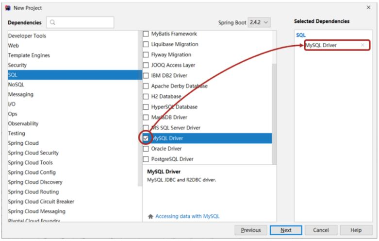

> 说明:
> 由于MP并未被收录到idea的系统内置配置，无法直接选择加入，需要手动在pom.xml中配置添加

### 步骤4:pom.xml补全依赖

```
<dependency>
    <groupId>com.baomidou</groupId>
    <artifactId>mybatis-plus-boot-starter</artifactId>
    <version>3.4.1</version>
</dependency>
<dependency>
    <groupId>com.alibaba</groupId>
    <artifactId>druid</artifactId>
    <version>1.1.16</version>
</dependency>
```

> 说明:
> druid数据源可以加也可以不加，SpringBoot有内置的数据源，可以配置成使用Druid数据源
> 从MP的依赖关系可以看出，通过依赖传递已经将MyBatis与MyBatis整合Spring的jar包导入，我们不需要额外在添加MyBatis的相关jar包

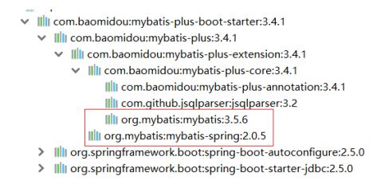

### 步骤5:添加MP的相关配置信息

resources默认生成的是properties配置文件，可以将其替换成yml文件，并在文件中配置数据库
连接的相关信息: application.yml

```
spring:
  datasource:
  type: com.alibaba.druid.pool.DruidDataSource
  driver-class-name: com.mysql.cj.jdbc.Driver
  url: jdbc:mysql://localhost:3306/mybatisplus_db?serverTimezone=UTC
  username: root
  password: root
```

### 步骤6:根据数据库表创建实体类

```
public class User {
    private Long id;
    private String name;
    private String password;
    private Integer age;
    private String tel;
//setter...getter...toString方法略
}
```

### 步骤7:创建Dao接口

```
@Mapper
public interface UserDao extends BaseMapper<User>{
}
```

### 步骤8:编写引导类

```
@SpringBootApplication
//@MapperScan("com.itheima.dao")
public class Mybatisplus01QuickstartApplication {
    public static void main(String[] args) {
        SpringApplication.run(Mybatisplus01QuickstartApplication.class, args);
    }
}
```

Dao接口要想被容器扫描到，有两种解决方案:

* 在Dao接口上添加@Mapper注解，并且确保Dao处在引导类所在包或其子包中。
  * 该方案的缺点是需要在每一Dao接口中添加注解
* 在引导类上添加@MapperScan注解，其属性为所要扫描的Dao所在包。
  * 该方案的好处是只需要写一次，则指定包下的所有Dao接口都能被扫描到，@Mapper就可以不写。

### 步骤9:编写测试类

```
@SpringBootTest
class MpDemoApplicationTests {
    @Autowired
    private UserDao userDao;
    @Test
    public void testGetAll() {
        List<User> userList = userDao.selectList(null);
        System.out.println(userList);
    }
}
```

userDao注入的时候下面有红线提示的原因是什么?

* UserDao是一个接口，不能实例化对象
* 只有在服务器启动IOC容器初始化后，由框架创建DAO接口的代理对象来注入
* 现在服务器并未启动，所以代理对象也未创建，IDEA查找不到对应的对象注入，所以提示报红
* 一旦服务启动，就能注入其代理对象，所以该错误提示不影响正常运行。

查看运行结果:


跟之前整合MyBatis相比，你会发现我们不需要在DAO接口中编写方法和SQL语句了，只需要继承BaseMapper接口即可。整体来说简化很多。

## MybatisPlus简介

MyBatisPlus（简称MP）是基于MyBatis框架基础上开发的增强型工具，旨在简化开发、提高效率。

官網是：https://baomidou.com/

MP旨在成为MyBatis的最好搭档，而不是替换MyBatis,所以可以理解为MP是MyBatis的一套增强工具，它是在MyBatis的基础上进行开发的，我们虽然使用MP但是底层依然是MyBatis的东西，也就是说我们也可以在MP中写MyBatis的内容。

对于MP的学习，大家可以参考着官方文档来进行学习，里面都有详细的代码案例。

* 无侵入：只做增强不做改变，不会对现有工程产生影响
* 强大的 CRUD 操作：内置通用 Mapper，少量配置即可实现单表CRUD 操作
* 支持 Lambda：编写查询条件无需担心字段写错
* 支持主键自动生成
* 内置分页插件
* ......

### 标准数据层开发

在这一节中我们重点学习的是数据层标准的CRUD(增删改查)的实现与分页功能。代码比较多，我们一
个个来学习。

#### 标准CRUD使用

对于标准的CRUD功能都有哪些以及MP都提供了哪些方法可以使用呢?

我们先来看张图:


对于这张图的方法，我们挨个来演示下:
首先说下，案例中的环境就是咱们入门案例的内容，第一个先来完成新增功能

#### 新增

在进行新增之前，我们可以分析下新增的方法:

```
int insert (T t)
```

* T : 泛型，新增用来保存新增数据
* int : 返回值，新增成功后返回1，没有新增成功返回的是0

在测试类中进行新增操作:

```
@SpringBootTest
class Mybatisplus01QuickstartApplicationTests {
    @Autowired
    private UserDao userDao;
    @Test
    void testSave() {
        User user = new User();
        user.setName("黑马程序员");
        user.setPassword("itheima");
        user.setAge(12);
        user.setTel("4006184000");
        userDao.insert(user);
    }
}
```

执行测试后，数据库表中就会添加一条数据。


但是数据中的主键ID，有点长，那这个主键ID是如何来的?我们更想要的是主键自增，应该是5才对，
这个是我们后面要学习的主键ID生成策略，这块的这个问题，我们暂时先放放。

#### 删除

在进行删除之前，我们可以分析下删除的方法:

```
int deleteById (Serializable id)
```

Serializable：参数类型

> 思考:参数类型为什么是一个序列化类?


从这张图可以看出：

* String和Number是Serializable的子类，
* Number又是Float,Double,Integer等类的父类，
* 能作为主键的数据类型都已经是Serializable的子类，
* MP使用Serializable作为参数类型，就好比我们可以用Object接收任何数据类型一样。

int:返回值类型，数据删除成功返回1，未删除数据返回0。

在测试类中进行新增操作:

```
@SpringBootTest
class Mybatisplus01QuickstartApplicationTests {
    @Autowired
    private UserDao userDao;
    @Test
    void testDelete() {
        userDao.deleteById(1401856123725713409L);
    }
}
```

#### 修改

在进行修改之前，我们可以分析下修改的方法:

```
int updateById(T t);
```

* T : 泛型，需要修改的数据内容，注意因为是根据ID进行修改，所以传入的对象中需要有ID属性值
* int : 返回值，修改成功后返回1，未修改数据返回0

在测试类中进行新增操作:

```
@SpringBootTest
class Mybatisplus01QuickstartApplicationTests {
    @Autowired
    private UserDao userDao;
    @Test
    void testUpdate() {
        User user = new User();
        user.setId(1L);
        user.setName("Tom888");
        user.setPassword("tom888");
        userDao.updateById(user);
    }
}
```

> 说明:修改的时候，只修改实体对象中有值的字段。

#### 根据ID查询

在进行根据ID查询之前，我们可以分析下根据ID查询的方法:

```
T selectById (Serializable id)
```

* Serializable：参数类型,主键ID的值
* T : 根据ID查询只会返回一条数据

在测试类中进行新增操作:

```
@SpringBootTest
class Mybatisplus01QuickstartApplicationTests {
    @Autowired
    private UserDao userDao;
    @Test
    void testGetById() {
        User user = userDao.selectById(2L);
        System.out.println(user);
    }
}
```

#### 查询所有

在进行查询所有之前，我们可以分析下查询所有的方法:

```
List<T> selectList(Wrapper<T> queryWrapper)
```

* Wrapper：用来构建条件查询的条件，目前我们没有可直接传为Null
* List : 因为查询的是所有，所以返回的数据是一个集合

在测试类中进行新增操作:

```
@SpringBootTest
class Mybatisplus01QuickstartApplicationTests {
    @Autowired
    private UserDao userDao;
    @Test
    void testGetAll() {
        List<User> userList = userDao.selectList(null);
        System.out.println(userList);
    }
}
```

我们所调用的方法都是来自于DAO接口继承的BaseMapper类中。里面的方法有很多，我们后面会慢慢
去学习里面的内容。

### Lombok

代码写到这，我们会发现DAO接口类的编写现在变成最简单的了，里面什么都不用写。反过来看看模型
类的编写都需要哪些内容:

* 私有属性
* setter...getter...方法
* toString方法
* 构造函数

虽然这些内容不难，同时也都是通过IDEA工具生成的，但是过程还是必须得走一遍，那么对于模型类的编写有没有什么优化方法?就是我们接下来要学习的Lombok。

#### **概念：**

* Lombok，一个Java类库，提供了一组注解，简化POJO实体类开发。

#### 使用步骤

#### 步骤1:添加lombok依赖

```
<dependency>
    <groupId>org.projectlombok</groupId>
    <artifactId>lombok</artifactId>
    <!--<version>1.18.12</version>-->
</dependency>
```

> 注意：版本可以不用写，因为SpringBoot中已经管理了lombok的版本。

#### 步骤2:安装Lombok的插件

> 新版本IDEA已经内置了该插件，如果删除setter和getter方法程序有报红，则需要安装插件

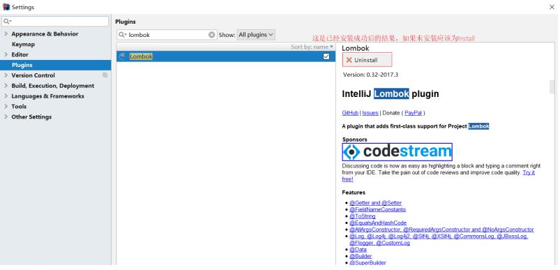

如果在IDEA中找不到lombok插件，可以访问如下网站：https://plugins.jetbrains.com/plugin/6317-lombok/versions

根据自己IDEA的版本下载对应的lombok插件，下载成功后，在IDEA中采用离线安装的方式进行安装。


#### 步骤3:模型类上添加注解

**Lombok常见的注解有:**

* @Setter:为模型类的属性提供setter方法
* @Getter:为模型类的属性提供getter方法
* @ToString:为模型类的属性提供toString方法
* @EqualsAndHashCode:为模型类的属性提供equals和hashcode方法
* @Data:是个组合注解，包含上面的注解的功能
* @NoArgsConstructor:提供一个无参构造函数
* @AllArgsConstructor:提供一个包含所有参数的构造函数

Lombok的注解还有很多，上面标红的三个是比较常用的，其他的大家后期用到了，再去补充学习。

```
@Data
@AllArgsConstructor
@NoArgsConstructor
public class User {
    private Long id;
    private String name;
    private String password;
    private Integer age;
    private String tel;
}
```

**说明:**
Lombok只是简化模型类的编写，我们之前的方法也能用，比如有人会问:我如果只想要有name和
password的构造函数，该如何编写?

```
@Data
@AllArgsConstructor
@NoArgsConstructor
public class User {
    private Long id;
    private String name;
    private String password;
    private Integer age;
    private String tel;
    public User(String name, String password) {
        this.name = name;
        this.password = password;
    }
}
```

这种方式是被允许的。

### 分页功能

基础的增删改查就已经学习完了，刚才我们在分析基础开发的时候，有一个分页功能还没有实现，在
MP中如何实现分页功能，就是咱们接下来要学习的内容。
**分页查询使用的方法是:**

```
IPage<T> selectPage(IPage<T> page, Wrapper<T> queryWrapper)
```

* IPage:用来构建分页查询条件
* Wrapper：用来构建条件查询的条件，目前我们没有可直接传为Null
* IPage:返回值，你会发现构建分页条件和方法的返回值都是IPage

IPage是一个接口，我们需要找到它的实现类来构建它，具体的实现类，可以进入到IPage类中按
ctrl+h,会找到其有一个实现类为Page。

#### 步骤1:调用方法传入参数获取返回值

```
@SpringBootTest
class Mybatisplus01QuickstartApplicationTests {
    @Autowired
    private UserDao userDao;
    //分页查询
    @Test
    void testSelectPage(){
        //1 创建IPage分页对象,设置分页参数,1为当前页码，3为每页显示的记录数
        IPage<User> page=new Page<>(1,3);
        //2 执行分页查询
        userDao.selectPage(page,null);
        //3 获取分页结果
        System.out.println("当前页码值："+page.getCurrent());
        System.out.println("每页显示数："+page.getSize());
        System.out.println("一共多少页："+page.getPages());
        System.out.println("一共多少条数据："+page.getTotal());
        System.out.println("数据："+page.getRecords());
    }
}
```

#### 步骤2:设置分页拦截器

这个拦截器MP已经为我们提供好了，我们只需要将其配置成Spring管理的bean对象即可。

```
@Configuration
public class MybatisPlusConfig {
    @Bean
    public MybatisPlusInterceptor mybatisPlusInterceptor(){
        //1 创建MybatisPlusInterceptor拦截器对象
        MybatisPlusInterceptor mpInterceptor=new MybatisPlusInterceptor();
        //2 添加分页拦截器
        mpInterceptor.addInnerInterceptor(new PaginationInnerInterceptor());
        return mpInterceptor;
    }
}
```

**说明:**上面的代码记不住咋办呢?
这些内容在MP的官方文档中有详细的说明，我们可以查看官方文档类配置


#### 步骤3:运行测试程序


如果想查看MP执行的SQL语句，可以修改application.yml配置文件，

```
mybatis-plus:
  configuration:
    log-impl: org.apache.ibatis.logging.stdout.StdOutImpl #打印SQL日志到控制台
```

打开日志后，就可以在控制台打印出对应的SQL语句，开启日志功能性能就会受到影响，调试完后记得
关闭。


## DQL编程控制

增删改查四个操作中，查询是非常重要的也是非常复杂的操作，这块需要我们重点学习下，这节我们
主要学习的内容有:

* 条件查询方式
* 查询投影
* 查询条件设定
* 字段映射与表名映射

### 条件查询

#### 条件查询的类

MyBatisPlus将书写复杂的SQL查询条件进行了封装，使用编程的形式完成查询条件的组合。

这个我们在前面都有见过，比如查询所有和分页查询的时候，都有看到过一个Wrapper类，这个类就
是用来构建查询条件的，如下图所示:

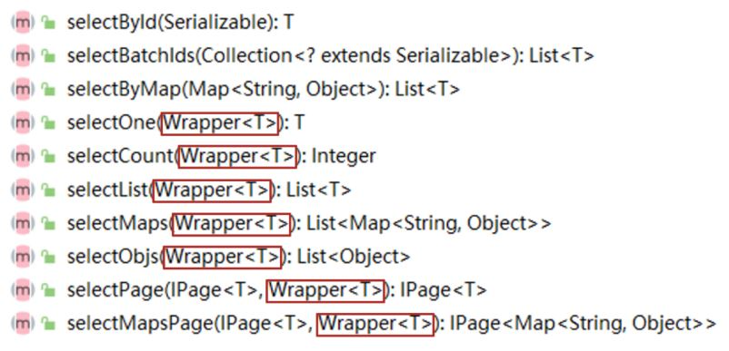

那么条件查询如何使用Wrapper来构建呢?

#### 环境构建

在构建条件查询之前，我们先来准备下环境

* 创建一个SpringBoot项目
* pom.xml中添加对应的依赖

```
<?xml version="1.0" encoding="UTF-8"?>
<project xmlns="http://maven.apache.org/POM/4.0.0"
         xmlns:xsi="http://www.w3.org/2001/XMLSchema-instance"
         xsi:schemaLocation="http://maven.apache.org/POM/4.0.0
https://maven.apache.org/xsd/maven-4.0.0.xsd">
    <modelVersion>4.0.0</modelVersion>
    <parent>
        <groupId>org.springframework.boot</groupId>
        <artifactId>spring-boot-starter-parent</artifactId>
        <version>2.5.0</version>
    </parent>
    <groupId>com.itheima</groupId>
    <artifactId>mybatisplus_02_dql</artifactId>
    <version>0.0.1-SNAPSHOT</version>
    <properties>
        <java.version>1.8</java.version>
    </properties>
    <dependencies>
        <dependency>
            <groupId>com.baomidou</groupId>
            <artifactId>mybatis-plus-boot-starter</artifactId>
            <version>3.4.1</version>
        </dependency>
        <dependency>
            <groupId>org.springframework.boot</groupId>
            <artifactId>spring-boot-starter</artifactId>
        </dependency>
        <dependency>
            <groupId>com.alibaba</groupId>
            <artifactId>druid</artifactId>
            <version>1.1.16</version>
        </dependency>
        <dependency>
            <groupId>mysql</groupId>
            <artifactId>mysql-connector-java</artifactId>
            <scope>runtime</scope>
        </dependency>
        <dependency>
            <groupId>org.springframework.boot</groupId>
            <artifactId>spring-boot-starter-test</artifactId>
            <scope>test</scope>
        </dependency>
        <dependency>
            <groupId>org.projectlombok</groupId>
            <artifactId>lombok</artifactId>
        </dependency>
    </dependencies>
    <build>
        <plugins>
            <plugin>
                <groupId>org.springframework.boot</groupId>
                <artifactId>spring-boot-maven-plugin</artifactId>
            </plugin>
        </plugins>
    </build>
</project>
```

* 编写UserDao接口

```
@Mapper
public interface UserDao extends BaseMapper<User> {
}
```

* 编写模型类

```
@Data
public class User {
    private Long id;
    private String name;
    private String password;
    private Integer age;
    private String tel;
}
```

* 编写引导类

```
@SpringBootApplication
public class Mybatisplus02DqlApplication {
    public static void main(String[] args) {
        SpringApplication.run(Mybatisplus02DqlApplication.class, args);
    }
}
```

* 编写配置文件

```
# dataSource
spring:
  datasource:
    type: com.alibaba.druid.pool.DruidDataSource
    driver-class-name: com.mysql.cj.jdbc.Driver
    url: jdbc:mysql://localhost:3306/mybatisplus_db?serverTimezone=UTC
    username: root
    password: root
# mp日志
mybatis-plus:
  configuration:
    log-impl: org.apache.ibatis.logging.stdout.StdOutImpl
```

* 编写测试类

```
@SpringBootTest
class Mybatisplus02DqlApplicationTests {
    @Autowired
    private UserDao userDao;
    @Test
    void testGetAll(){
        List<User> userList = userDao.selectList(null);
        System.out.println(userList);
    }
}
```

最终创建的项目结构为:

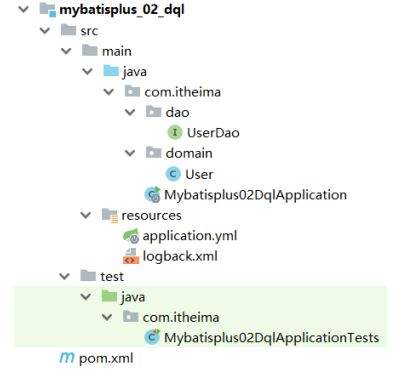

测试的时候，控制台打印的日志比较多，速度有点慢而且不利于查看运行结果，所以接下来我们把这个日志处理下:

* 取消初始化spring日志打印，resources目录下添加logback.xml，名称固定，内容如下:

```
<?xml version="1.0" encoding="UTF-8"?>
<configuration>
</configuration>
```

> 说明:logback.xml的配置内容，不是我们学习的重点，如果有兴趣可以自行百度查询。

* 取消MybatisPlus启动banner图标。application.yml添加如下内容:

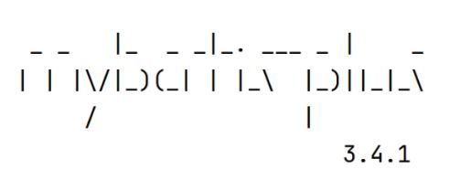

```
# mybatis-plus日志控制台输出
mybatis-plus:
  configuration:
    log-impl: org.apache.ibatis.logging.stdout.StdOutImpl
  global-config:
    banner: off # 关闭mybatisplus启动图标
```

* 取消SpringBoot的log打印。application.yml添加如下内容:


```
spring:
  main:
    banner-mode: off # 关闭SpringBoot启动图标(banner)
```

解决控制台打印日志过多的相关操作可以不用去做，一般会被用来方便我们查看程序运行的结果。

#### 构建条件查询

在进行查询的时候，我们的入口是在Wrapper这个类上，因为它是一个接口，所以我们需要去找它对
应的实现类，关于实现类也有很多，说明我们有多种构建查询条件对象的方式，

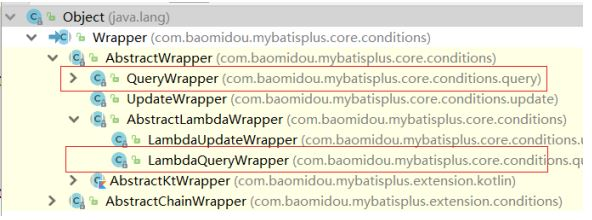

先来看第一种:QueryWrapper

```
@SpringBootTest
class Mybatisplus02DqlApplicationTests {
    @Autowired
    private UserDao userDao;
    @Test
    void testGetAll(){
        QueryWrapper qw = new QueryWrapper();
        qw.lt("age",18);
        List<User> userList = userDao.selectList(qw);
        System.out.println(userList);
    }
}
```

lt: 小于(<) ,最终的sql语句为

```
SELECT id,name,password,age,tel FROM user WHERE (age < ?)
```

第一种方式介绍完后，有个小问题就是在写条件的时候，容易出错，比如age写错，就会导致查询不成
功。

接着来看第二种:QueryWrapper的基础上使用lambda

```
@SpringBootTest
class Mybatisplus02DqlApplicationTests {
    @Autowired
    private UserDao userDao;
    @Test
    void testGetAll(){
        QueryWrapper<User> qw = new QueryWrapper<User>();
        qw.lambda().lt(User::getAge, 10);//添加条件
        List<User> userList = userDao.selectList(qw);
        System.out.println(userList);
    }
}
```

User::getAget,为lambda表达式中的，类名::方法名，最终的sql语句为:

```
SELECT id,name,password,age,tel FROM user WHERE (age < ?)
```

> 注意:构建LambdaQueryWrapper的时候泛型不能省。

此时我们再次编写条件的时候，就不会存在写错名称的情况，但是qw后面多了一层lambda()调用

接着来看第三种:LambdaQueryWrapper

```
@SpringBootTest
class Mybatisplus02DqlApplicationTests {
    @Autowired
    private UserDao userDao;
    @Test
    void testGetAll(){
        LambdaQueryWrapper<User> lqw = new LambdaQueryWrapper<User>();
        lqw.lt(User::getAge, 10);
        List<User> userList = userDao.selectList(lqw);
        System.out.println(userList);
    }
}
```

这种方式就解决了上一种方式所存在的问题。

#### 多条件构建

学完了三种构建查询对象的方式，每一种都有自己的特点，所以用哪一种都行，刚才都是一个条件，
那如果有多个条件该如何构建呢?

需求:查询数据库表中，年龄在10岁到30岁之间的用户信息

```
@SpringBootTest
class Mybatisplus02DqlApplicationTests {
    @Autowired
    private UserDao userDao;
    @Test
    void testGetAll(){
        LambdaQueryWrapper<User> lqw = new LambdaQueryWrapper<User>();
        lqw.lt(User::getAge, 30);
        lqw.gt(User::getAge, 10);
        List<User> userList = userDao.selectList(lqw);
        System.out.println(userList);
    }
}
```

* gt：大于(>),最终的SQL语句为

  ```
  SELECT id,name,password,age,tel FROM user WHERE (age < ? AND age > ?)
  ```
* 构建多条件的时候，可以支持链式编程

  ```
  LambdaQueryWrapper<User> lqw = new LambdaQueryWrapper<User>();
  lqw.lt(User::getAge, 30).gt(User::getAge, 10);
  List<User> userList = userDao.selectList(lqw);
  System.out.println(userList);
  ```

需求:查询数据库表中，年龄小于10或年龄大于30的数据

```
@SpringBootTest
class Mybatisplus02DqlApplicationTests {
    @Autowired
    private UserDao userDao;
    @Test
    void testGetAll(){
        LambdaQueryWrapper<User> lqw = new LambdaQueryWrapper<User>();
        lqw.lt(User::getAge, 10).or().gt(User::getAge, 30);
        List<User> userList = userDao.selectList(lqw);
        System.out.println(userList);
    }
}
```

* or()就相当于我们sql语句中的or关键字,不加默认是and，最终的sql语句为:
  ```
  SELECT id,name,password,age,tel FROM user WHERE (age < ? OR age > ?)
  ```

#### null判定

先来看一张图，


* 我们在做条件查询的时候，一般会有很多条件可以供用户进行选择查询。
* 这些条件用户可以选择使用也可以选择不使用，比如我要查询价格在8000以上的手机
* 在输入条件的时候，价格有一个区间范围，按照需求只需要在第一个价格输入框中输入8000
* 后台在做价格查询的时候，一般会让 price>值1 and price <值2
* 因为前端没有输入值2，所以如果不处理的话，就会出现 price>8000 and price < null问题
* 这个时候查询的结果就会出问题，具体该如何解决?


需求:查询数据库表中，根据输入年龄范围来查询符合条件的记录。

用户在输入值的时候，

* 如果只输入第一个框，说明要查询大于该年龄的用户
* 如果只输入第二个框，说明要查询小于该年龄的用户
* 如果两个框都输入了，说明要查询年龄在两个范围之间的用户

思考第一个问题：后台如果想接收前端的两个数据，该如何接收?
我们可以使用两个简单数据类型，也可以使用一个模型类，但是User类中目前只有一个age属性,如:

```
@Data
public class User {
    private Long id;
    private String name;
    private String password;
    private Integer age;
    private String tel;
}
```

使用一个age属性，如何去接收页面上的两个值呢?这个时候我们有两个解决方案

方案一:添加属性age2,这种做法可以但是会影响到原模型类的属性内容

```
@Data
public class User {
    private Long id;
    private String name;
    private String password;
    private Integer age;
    private String tel;
    private Integer age2;
}
```

方案二:新建一个模型类,让其继承User类，并在其中添加age2属性，UserQuery在拥有User属性后
同时添加了age2属性。

```
@Data
public class User {
    private Long id;
    private String name;
    private String password;
    private Integer age;
    private String tel;
}
@Data
public class UserQuery extends User {
    private Integer age2;
}
```

环境准备好后，我们来实现下刚才的需求：

```
@SpringBootTest
class Mybatisplus02DqlApplicationTests {
    @Autowired
    private UserDao userDao;
    @Test
    void testGetAll(){
        //模拟页面传递过来的查询数据
        UserQuery uq = new UserQuery();
        uq.setAge(10);
        uq.setAge2(30);
        LambdaQueryWrapper<User> lqw = new LambdaQueryWrapper<User>();
        if(null != uq.getAge2()){
            lqw.lt(User::getAge, uq.getAge2());
        }
        if( null != uq.getAge()) {
            lqw.gt(User::getAge, uq.getAge());
        }
        List<User> userList = userDao.selectList(lqw);
        System.out.println(userList);
    }
}
```

上面的写法可以完成条件为非空的判断，但是问题很明显，如果条件多的话，每个条件都需要判断，
代码量就比较大，来看MP给我们提供的简化方式：

```
@SpringBootTest
class Mybatisplus02DqlApplicationTests {
    @Autowired
    private UserDao userDao;
    @Test
    void testGetAll(){
        //模拟页面传递过来的查询数据
        UserQuery uq = new UserQuery();
        uq.setAge(10);
        uq.setAge2(30);
        LambdaQueryWrapper<User> lqw = new LambdaQueryWrapper<User>();
        lqw.lt(null!=uq.getAge2(),User::getAge, uq.getAge2());
        lqw.gt(null!=uq.getAge(),User::getAge, uq.getAge());
        List<User> userList = userDao.selectList(lqw);
        System.out.println(userList);
    }
}
```

* lt()方法

  

  condition为boolean类型，返回true，则添加条件，返回false则不添加条件

### 查询投影

#### 查询指定字段

目前我们在查询数据的时候，什么都没有做默认就是查询表中所有字段的内容，我们所说的查询投影即不查询所有字段，只查询出指定内容的数据。具体如何来实现?

```
@SpringBootTest
class Mybatisplus02DqlApplicationTests {
    @Autowired
    private UserDao userDao;
    @Test
    void testGetAll(){
        LambdaQueryWrapper<User> lqw = new LambdaQueryWrapper<User>();
        lqw.select(User::getId,User::getName,User::getAge);
        List<User> userList = userDao.selectList(lqw);
        System.out.println(userList);
    }
}
```

* select(...)方法用来设置查询的字段列，可以设置多个，最终的sql语句为:

  ```
  SELECT id,name,age FROM user
  ```
* 如果使用的不是lambda，就需要手动指定字段

  ```
  @SpringBootTest
  class Mybatisplus02DqlApplicationTests {
      @Autowired
      private UserDao userDao;
      @Test
      void testGetAll(){
          QueryWrapper<User> lqw = new QueryWrapper<User>();
          lqw.select("id","name","age","tel");
          List<User> userList = userDao.selectList(lqw);
          System.out.println(userList);
      }
  }
  ```

  最终的sql语句为:SELECT id,name,age,tel FROM user

#### 聚合查询

需求:聚合函数查询，完成count、max、min、avg、sum的使用

* count:总记录数
* max:最大值
* min:最小值
* avg:平均值
* sum:求和

```
@SpringBootTest
class Mybatisplus02DqlApplicationTests {
    @Autowired
    private UserDao userDao;
    @Test
    void testGetAll() {
        QueryWrapper<User> lqw = new QueryWrapper<User>();
        //lqw.select("count(*) as count");
        //SELECT count(*) as count FROM user
        //lqw.select("max(age) as maxAge");
        //SELECT max(age) as maxAge FROM user
        //lqw.select("min(age) as minAge");
        //SELECT min(age) as minAge FROM user
        //lqw.select("sum(age) as sumAge");
        //SELECT sum(age) as sumAge FROM user
        lqw.select("avg(age) as avgAge");
        //SELECT avg(age) as avgAge FROM user
        List<Map<String, Object>> userList = userDao.selectMaps(lqw);
        System.out.println(userList);
    }
}
```

为了在做结果封装的时候能够更简单，我们将上面的聚合函数都起了个名称，方面后期来获取这些数
据。

#### 分组查询

需求:分组查询，完成 group by的查询使用

```
@SpringBootTest
class Mybatisplus02DqlApplicationTests {
    @Autowired
    private UserDao userDao;
    @Test
    void testGetAll(){
        QueryWrapper<User> lqw = new QueryWrapper<User>();
        lqw.select("count(*) as count,tel");
        lqw.groupBy("tel");
        List<Map<String, Object>> list = userDao.selectMaps(lqw);
        System.out.println(list);
    }
}
```

* groupBy为分组，最终的sql语句为

  ```
  SELECT count(*) as count,tel FROM user GROUP BY tel
  ```

注意:

* 聚合与分组查询，无法使用lambda表达式来完成
* MP只是对MyBatis的增强，如果MP实现不了，我们可以直接在DAO接口中使用MyBatis的方式实现

### 查询条件

前面我们只使用了lt()和gt(),除了这两个方法外，MP还封装了很多条件对应的方法，这一节我们重
点把MP提供的查询条件方法进行学习下。

MP的查询条件有很多:

* 范围匹配（> 、 = 、between）
* 模糊匹配（like）
* 空判定（null）
* 包含性匹配（in）
* 分组（group）
* 排序（order）
* ……

#### 等值查询

需求:根据用户名和密码查询用户信息

```
@SpringBootTest
class Mybatisplus02DqlApplicationTests {
    @Autowired
    private UserDao userDao;
    @Test
    void testGetAll(){
        LambdaQueryWrapper<User> lqw = new LambdaQueryWrapper<User>();
        lqw.eq(User::getName, "Jerry").eq(User::getPassword, "jerry");
        User loginUser = userDao.selectOne(lqw);
        System.out.println(loginUser);
    }
}
```

* eq()： 相当于 = ,对应的sql语句为

  ```
  SELECT id,name,password,age,tel FROM user WHERE (name = ? AND password = ?)
  ```
* selectList：查询结果为多个或者单个
* selectOne:查询结果为单个

#### 范围查询

需求:对年龄进行范围查询，使用lt()、le()、gt()、ge()、between()进行范围查询

```
@SpringBootTest
class Mybatisplus02DqlApplicationTests {
    @Autowired
    private UserDao userDao;

    @Test
    void testGetAll() {
        LambdaQueryWrapper<User> lqw = new LambdaQueryWrapper<User>();
        lqw.between(User::getAge, 10, 30);
        //SELECT id,name,password,age,tel FROM user WHERE (age BETWEEN ? AND?)
        List<User> userList = userDao.selectList(lqw);
        System.out.println(userList);
    }
}
```

* gt():大于(>)
* ge():大于等于(>=)
* lt():小于(<)
* lte():小于等于(<=)
* between():between ? and ?

#### 模糊查询

需求:查询表中name属性的值以J开头的用户信息,使用like进行模糊查询

```
@SpringBootTest
class Mybatisplus02DqlApplicationTests {
    @Autowired
    private UserDao userDao;
    @Test
    void testGetAll(){
        LambdaQueryWrapper<User> lqw = new LambdaQueryWrapper<User>();
        lqw.likeLeft(User::getName, "J");
        //SELECT id,name,password,age,tel FROM user WHERE (name LIKE ?)
        List<User> userList = userDao.selectList(lqw);
        System.out.println(userList);
    }
}
```

* like():前后加百分号,如 %J%
* likeLeft():前面加百分号,如 %J
* likeRight():后面加百分号,如 J%

#### 排序查询

需求:查询所有数据，然后按照id降序

```
@SpringBootTest
class Mybatisplus02DqlApplicationTests {
    @Autowired
    private UserDao userDao;
    @Test
    void testGetAll(){
        LambdaQueryWrapper<User> lwq = new LambdaQueryWrapper<>();
        /** 
         * condition ：条件，返回boolean，
         当condition为true，进行排序，如果为false，则不排序
         * isAsc:是否为升序，true为升序，false为降序
         * columns：需要操作的列
         */
        lwq.orderBy(true,false, User::getId);
        userDao.selectList(lw
    }
}
```

除了上面演示的这种实现方式，还有很多其他的排序方法可以被调用，如图:


* orderBy排序
* condition:条件，true则添加排序，false则不添加排序
* isAsc:是否为升序，true升序，false降序
* columns:排序字段，可以有多个
* orderByAsc/Desc(单个column):按照指定字段进行升序/降序
* orderByAsc/Desc(多个column):按照多个字段进行升序/降序
* orderByAsc/Desc
* condition:条件，true添加排序，false不添加排序
* 多个columns：按照多个字段进行排序

除了上面介绍的这几种查询条件构建方法以外还会有很多其他的方法，比如isNull,isNotNull,in,notIn等等方法可供选择，具体参考官方文档的条件构造器来学习使用。

### 映射匹配兼容性

前面我们已经能从表中查询出数据，并将数据封装到模型类中，这整个过程涉及到一张表和一个模型
类:


之所以数据能够成功的从表中获取并封装到模型对象中，原因是表的字段列名和模型类的属性名一
样。

那么问题就来了:

**问题1:表字段与编码属性设计不同步**

当表的列名和模型类的属性名发生不一致，就会导致数据封装不到模型对象，这个时候就需要其中一
方做出修改，那如果前提是两边都不能改又该如何解决?
MP给我们提供了一个注解@TableField ,使用该注解可以实现模型类属性名和表的列名之间的映射关
系。


**问题2:编码中添加了数据库中未定义的属性**

当模型类中多了一个数据库表不存在的字段，就会导致生成的sql语句中在select的时候查询了数据
库不存在的字段，程序运行就会报错，错误信息为:

`Unknown column '多出来的字段名称' in 'field list'`

具体的解决方案用到的还是@TableField注解，它有一个属性叫exist，设置该字段是否在数据库表
中存在，如果设置为false则不存在，生成sql语句查询的时候，就不会再查询该字段了。


**问题3：采用默认查询开放了更多的字段查看权限**

查询表中所有的列的数据，就可能把一些敏感数据查询到返回给前端，这个时候我们就需要限制哪些
字段默认不要进行查询。解决方案是@TableField注解的一个属性叫select，该属性设置默认是否需
要查询该字段的值，true(默认值)表示默认查询该字段，false表示默认不查询该字段。

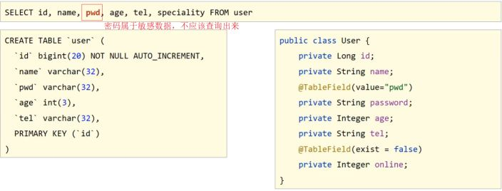

知识点1：@TableField

| 名称     | @TableField                                                                                                                                                               |
| -------- | ------------------------------------------------------------------------------------------------------------------------------------------------------------------------- |
| 类型     | 属性注解                                                                                                                                                                  |
| 位置     | 模型类属性定义上方                                                                                                                                                        |
| 作用     | 设置当前属性对应的数据库表中的字段关系                                                                                                                                    |
| 相关属性 | value(默认)：设置数据库表字段名称exist:设置属性在数据库表字段中是否存在，默认为true，此属性不能与value合并使用select:设置属性是否参与查询，此属性与select()映射配置不冲突 |

**问题4:表名与编码开发设计不同步**

该问题主要是表的名称和模型类的名称不一致，导致查询失败，这个时候通常会报如下错误信息:

`Table 'databaseName.tableNaem' doesn't exist`,翻译过来就是数据库中的表不存在。


解决方案是使用MP提供的另外一个注解@TableName来设置表与模型类之间的对应关系。


知识点2：@TableName


| 名称     | @TableNamecol2                |
| -------- | ----------------------------- |
| 类型     | 类注解                        |
| 位置     | 模型类定义上方                |
| 作用     | 设置当前类对应于数据库表关系  |
| 相关属性 | value(默认)：设置数据库表名称 |

代码演示

**步骤1:修改数据库表user为tbl_user**

直接查询会报错，原因是MP默认情况下会使用模型类的类名首字母小写当表名使用。


**步骤2:模型类添加@TableName注解**

```
@Data
@TableName("tbl_user")
public class User {
    private Long id;
    private String name;
    private String password;
    private Integer age;
    private String tel;
}
```

**步骤3:将字段password修改成pwd**

直接查询会报错，原因是MP默认情况下会使用模型类的属性名当做表的列名使用


**步骤4：使用@TableField映射关系**

```
@Data
@TableName("tbl_user")
public class User {
    private Long id;
    private String name;
    @TableField(value="pwd")
    private String password;
    private Integer age;
    private String tel;
}
```

**步骤5:添加一个数据库表不存在的字段**

```
@Data
@TableName("tbl_user")
public class User {
    private Long id;
    private String name;
    @TableField(value="pwd")
    private String password;
    private Integer age;
    private String tel;
    private Integer online;
}
```

直接查询会报错，原因是MP默认情况下会查询模型类的所有属性对应的数据库表的列，而online不存在


**步骤6：使用@TableField排除字段**

```
@Data
@TableName("tbl_user")
public class User {
    private Long id;
    private String name;
    @TableField(value="pwd")
    private String password;
    private Integer age;
    private String tel;
    @TableField(exist=false)
    private Integer online;
}
```

**步骤7:查询时将pwd隐藏**

```
@Data
@TableName("tbl_user")
public class User {
    private Long id;
    private String name;
    @TableField(value="pwd",select=false)
    private String password;
    private Integer age;
    private String tel;
    @TableField(exist=false)
    private Integer online;
}
```

## DML编程控制

查询相关的操作我们已经介绍完了，紧接着我们需要对另外三个，增删改进行内容的讲解。挨个来说明下，首先是新增(insert)中的内容。

### id生成策略控制

前面我们在新增的时候留了一个问题，就是新增成功后，主键ID是一个很长串的内容，我们更想要的是按照数据库表字段进行自增长，在解决这个问题之前，我们先来分析下ID该如何选择:

* 不同的表应用不同的id生成策略
  * 日志：自增（1,2,3,4，……）
  * 购物订单：特殊规则（FQ23948AK3843）
  * 外卖单：关联地区日期等信息（10 04 20200314 34 91）
  * 关系表：可省略id
  * ……

不同的业务采用的ID生成方式应该是不一样的，那么在MP中都提供了哪些主键生成策略，以及我们该如何进行选择?

在这里我们又需要用到MP的一个注解叫@TableId

**知识点1：@TableId**

| 名称     | @TableId                                                                                 |
| -------- | ---------------------------------------------------------------------------------------- |
| 类型     | 属性注解                                                                                 |
| 位置     | 模型类中用于表示主键的属性定义上方                                                       |
| 作用     | 设置当前类中主键属性的生成策略                                                           |
| 相关属性 | value(默认)：设置数据库表主键名称<br />type:设置主键属性的生成策略，值查照IdType的枚举值 |

#### 环境构建

在构建条件查询之前，我们先来准备下环境

* 创建一个SpringBoot项目
* pom.xml中添加对应的依赖

```
<?xml version="1.0" encoding="UTF-8"?>
<project xmlns="http://maven.apache.org/POM/4.0.0"
         xmlns:xsi="http://www.w3.org/2001/XMLSchema-instance"
         xsi:schemaLocation="http://maven.apache.org/POM/4.0.0
https://maven.apache.org/xsd/maven-4.0.0.xsd">
    <modelVersion>4.0.0</modelVersion>
    <parent>
        <groupId>org.springframework.boot</groupId>
        <artifactId>spring-boot-starter-parent</artifactId>
        <version>2.5.0</version>
        <relativePath/> <!-- lookup parent from repository -->
    </parent>
    <groupId>com.itheima</groupId>
    <artifactId>mybatisplus_03_dml</artifactId>
    <version>0.0.1-SNAPSHOT</version>
    <properties>
        <java.version>1.8</java.version>
    </properties>
    <dependencies>
        <dependency>
            <groupId>com.baomidou</groupId>
            <artifactId>mybatis-plus-boot-starter</artifactId>
            <version>3.4.1</version>
        </dependency>
        <dependency>
            <groupId>org.springframework.boot</groupId>
            <artifactId>spring-boot-starter</artifactId>
        </dependency>
        <dependency>
            <groupId>com.alibaba</groupId>
            <artifactId>druid</artifactId>
            <version>1.1.16</version>
        </dependency>
        <dependency>
            <groupId>mysql</groupId>
            <artifactId>mysql-connector-java</artifactId>
            <scope>runtime</scope>
        </dependency>
        <dependency>
            <groupId>org.springframework.boot</groupId>
            <artifactId>spring-boot-starter-test</artifactId>
            <scope>test</scope>
        </dependency>
        <dependency>
            <groupId>org.projectlombok</groupId>
            <artifactId>lombok</artifactId>
            <version>1.18.12</version>
        </dependency>
    </dependencies>
    <build>
        <plugins>
            <plugin>
                <groupId>org.springframework.boot</groupId>
                <artifactId>spring-boot-maven-plugin</artifactId>
            </plugin>
        </plugins>
    </build>
</project> 
```

* 编写UserDao接口

```
@Mapper
public interface UserDao extends BaseMapper<User> {
}
```

* 编写模型类

```
@Data
@TableName("tbl_user")
public class User {
    private Long id;
    private String name;
    @TableField(value="pwd",select=false)
    private String password;
    private Integer age;
    private String tel;
    @TableField(exist=false)
    private Integer online;
}
```

* 编写引导类

```
@SpringBootApplication
public class Mybatisplus03DqlApplication {
    public static void main(String[] args) {
        SpringApplication.run(Mybatisplus03DqlApplication.class, args);
    }
}
```

* 编写配置文件

```
# dataSource
spring:
  datasource:
    type: com.alibaba.druid.pool.DruidDataSource
    driver-class-name: com.mysql.cj.jdbc.Driver
    url: jdbc:mysql://localhost:3306/mybatisplus_db?serverTimezone=UTC
    username: root
    password: root
# mp日志
mybatis-plus:
  configuration:
    log-impl: org.apache.ibatis.logging.stdout.StdOutImpl
```

* 编写测试类

```
@SpringBootTest
class Mybatisplus02DqlApplicationTests {
    @Autowired
    private UserDao userDao;
    @Test
    void testGetAll(){
        List<User> userList = userDao.selectList(null);
        System.out.println(userList);
    }
}
```

* 测试

```
@SpringBootTest
class Mybatisplus03DqlApplicationTests {
    @Autowired
    private UserDao userDao;
    @Test
    void testSave(){
        User user = new User();
        user.setName("黑马程序员");
        user.setPassword("itheima");
        user.setAge(12);
        user.setTel("4006184000");
        userDao.insert(user);
    }
    @Test
    void testDelete(){
        userDao.deleteById(1401856123925713409L)
    }
    @Test
    void testUpdate(){
        User user = new User();
        user.setId(3L);
        user.setName("Jock666");
        user.setVersion(1);
        userDao.updateById(user);
    }
}

```

最终创建的项目结构为:

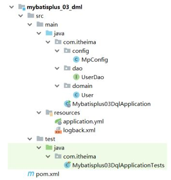

### 代码演示

**AUTO策略
步骤1:设置生成策略为AUTO**

```
@Data
@TableName("tbl_user")
public class User {
    @TableId(type = IdType.AUTO)
    private Long id;
    private String name;
    @TableField(value="pwd",select=false)
    private String password;
    private Integer age;
    private String tel;
    @TableField(exist=false)
    private Integer online;
}
```

**步骤2:删除测试数据并修改自增值**

* 删除测试数据


因为之前生成主键ID的值比较长，会把MySQL的自动增长的值变的很大，所以需要将其调整为目前最新的id值。


**步骤3:运行新增方法**

会发现，新增成功，并且主键id也是从5开始


经过这三步的演示，会发现AUTO的作用是使用数据库ID自增，在使用该策略的时候一定要确保对应数据库表设置了ID主键自增，否则无效。

接下来，我们可以进入源码查看下ID的生成策略有哪些?

打开源码后，你会发现并没有看到中文注释，这就需要我们点击右上角的Download Sources ,会自动帮你把这个类的java文件下载下来，我们就能看到具体的注释内容。因为这个技术是国人制作的，所以他代码中的注释还是比较容易看懂的。


当把源码下载完后，就可以看到如下内容:


从源码中可以看到，除了AUTO这个策略以外，还有如下几种生成策略:

* NONE: 不设置id生成策略
* INPUT:用户手工输入id
* ASSIGN_ID:雪花算法生成id(可兼容数值型与字符串型)
* ASSIGN_UUID:以UUID生成算法作为id生成策略
* 其他的几个策略均已过时，都将被ASSIGN_ID和ASSIGN_UUID代替掉。

**拓展:**

分布式ID是什么?

* 当数据量足够大的时候，一台数据库服务器存储不下，这个时候就需要多台数据库服务器进行存储
* 比如订单表就有可能被存储在不同的服务器上
* 如果用数据库表的自增主键，因为在两台服务器上所以会出现冲突
* 这个时候就需要一个全局唯一ID,这个ID就是分布式ID。

**INPUT策略
步骤1:设置生成策略为INPUT**

```
@Data
@TableName("tbl_user")
public class User {
    @TableId(type = IdType.INPUT)
    private Long id;
    private String name;
    @TableField(value="pwd",select=false)
    private String password;
    private Integer age;
    private String tel;
    @TableField(exist=false)
    private Integer online;
}
```

注意:这种ID生成策略，需要将表的自增策略删除掉

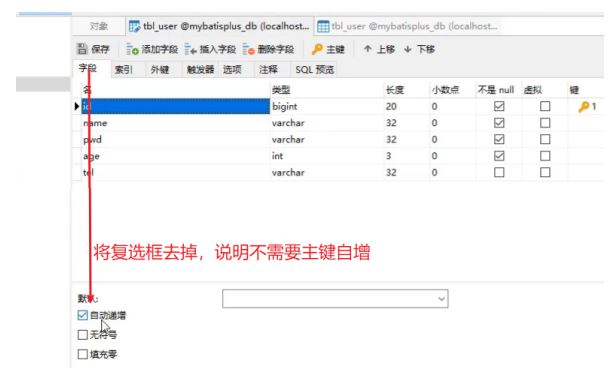

**步骤2:添加数据手动设置ID**

```
@SpringBootTest
class Mybatisplus03DqlApplicationTests {
    @Autowired
    private UserDao userDao;
    @Test
    void testSave(){
        User user = new User();
        //设置主键ID的值
        user.setId(666L);
        user.setName("黑马程序员");
        user.setPassword("itheima");
        user.setAge(12);
        user.setTel("4006184000");
        userDao.insert(user);
    }
}
```

**步骤3:运行新增方法**

如果没有设置主键ID的值，则会报错，错误提示就是主键ID没有给值:


如果设置了主键ID,则数据添加成功，如下:


**ASSIGN_ID策略**

**步骤1:设置生成策略为ASSIGN_ID**

```
@Data
@TableName("tbl_user")
public class User {
    @TableId(type = IdType.ASSIGN_ID)
    private Long id;
    private String name;
    @TableField(value="pwd",select=false)
    private String password;
    private Integer age;
    private String tel;
    @TableField(exist=false)
    private Integer online;
}
```

**步骤2:添加数据不设置ID**

```
@SpringBootTest
class Mybatisplus03DqlApplicationTests {
    @Autowired
    private UserDao userDao;
    @Test
    void testSave(){
        User user = new User();
        user.setName("黑马程序员");
        user.setPassword("itheima");
        user.setAge(12);
        user.setTel("4006184000");
        userDao.insert(user);
    }
}
```

注意:这种生成策略，不需要手动设置ID，如果手动设置ID，则会使用自己设置的值。

**步骤3:运行新增方法**


生成的ID就是一个Long类型的数据。

**ASSIGN_UUID策略**

**步骤1:设置生成策略为ASSIGN_UUID**

使用uuid需要注意的是，主键的类型不能是Long，而应该改成String类型

```
@Data
@TableName("tbl_user")
public class User {
    @TableId(type = IdType.ASSIGN_UUID)
    private String id;
    private String name;
    @TableField(value="pwd",select=false)
    private String password;
    private Integer age;
    private String tel;
    @TableField(exist=false)
    private Integer online;
}
```

**步骤2:修改表的主键类型**


主键类型设置为varchar，长度要大于32，因为UUID生成的主键为32位，如果长度小的话就会导致插入失败。

**步骤3:添加数据不设置ID**

```
@SpringBootTest
class Mybatisplus03DqlApplicationTests {
    @Autowired
    private UserDao userDao;
    @Test
    void testSave(){
        User user = new User();
        user.setName("黑马程序员");
        user.setPassword("itheima");
        user.setAge(12);
        user.setTel("4006184000");
        userDao.insert(user);
    }
}
```

**步骤4:运行新增方法**


接下来我们来聊一聊雪花算法:

雪花算法(SnowFlake),是Twitter官方给出的算法实现 是用Scala写的。其生成的结果是一个64bit大小整数，它的结构如下图:


* 1bit,不用,因为二进制中最高位是符号位，1表示负数，0表示正数。生成的id一般都是用整数，所以最高位固定为0。
* 41bit-时间戳，用来记录时间戳，毫秒级
* 10bit-工作机器id，用来记录工作机器id,其中高位5bit是数据中心ID其取值范围0-31，低位5bit是工作节点ID其取值范围0-31，两个组合起来最多可以容纳1024个节点
* 序列号占用12bit，每个节点每毫秒0开始不断累加，最多可以累加到4095，一共可以产生4096个ID

#### ID生成策略对比

介绍了这些主键ID的生成策略，我们以后该用哪个呢?

* NONE: 不设置id生成策略，MP不自动生成，约等于INPUT,所以这两种方式都需要用户手动设置，但是手动设置第一个问题是容易出现相同的ID造成主键冲突，为了保证主键不冲突就需要做很多判定，实现起来比较复杂
* AUTO:数据库ID自增,这种策略适合在数据库服务器只有1台的情况下使用,不可作为分布式ID使用
* ASSIGN_UUID:可以在分布式的情况下使用，而且能够保证唯一，但是生成的主键是32位的字符串，长度过长占用空间而且还不能排序，查询性能也慢
* ASSIGN_ID:可以在分布式的情况下使用，生成的是Long类型的数字，可以排序性能也高，但是生成的策略和服务器时间有关，如果修改了系统时间就有可能导致出现重复主键
* 综上所述，每一种主键策略都有自己的优缺点，根据自己项目业务的实际情况来选择使用才是最明
  智的选择。

### 简化配置

前面我们已经完成了表关系映射、数据库主键策略的设置，接下来对于这两个内容的使用，我们再讲
下他们的简化配置:

**模型类主键策略设置**

对于主键ID的策略已经介绍完，但是如果要在项目中的每一个模型类上都需要使用相同的生成策略，如:


确实是稍微有点繁琐，我们能不能在某一处进行配置，就能让所有的模型类都可以使用该主键ID策略呢?

答案是肯定有，我们只需要在配置文件中添加如下内容:

```
mybatis-plus:
  global-config:
    db-config:
      id-type: assign_id
```

配置完成后，每个模型类的主键ID策略都将成为assign_id.

**数据库表与模型类的映射关系**

MP会默认将模型类的类名名首字母小写作为表名使用，假如数据库表的名称都以tbl_开头，那么我们就需要将所有的模型类上添加@TableName，如:


配置起来还是比较繁琐，简化方式为在配置文件中配置如下内容:

```
mybatis-plus:
  global-config:
    db-config:
      table-prefix: tbl_
```

设置表的前缀内容，这样MP就会拿 tbl_加上模型类的首字母小写，就刚好组装成数据库的表名。

### 多记录操作

先来看下问题:


之前添加了很多商品到购物车，过了几天发现这些东西又不想要了，该怎么办呢?

很简单删除掉，但是一个个删除的话还是比较慢和费事的，所以一般会给用户一个批量操作，也就是前面有一个复选框，用户一次可以勾选多个也可以进行全选，然后删一次就可以将购物车清空，这个就需要用到批量删除的操作了。

具体该如何实现多条删除，我们找找对应的API方法

```
int deleteBatchIds(@Param(Constants.COLLECTION) Collection<? extends Serializable> idList);
```

翻译方法的字面意思为:删除（根据ID 批量删除）,参数是一个集合，可以存放多个id值。

需求:根据传入的id集合将数据库表中的数据删除掉。

```
@SpringBootTest
class Mybatisplus03DqlApplicationTests {
    @Autowired
    private UserDao userDao;
    @Test
    void testDelete(){
        //删除指定多条数据
        List<Long> list = new ArrayList<>();
        list.add(1402551342481838081L);
        list.add(1402553134049501186L);
        list.add(1402553619611430913L);
        userDao.deleteBatchIds(list);
    }
}
```

执行成功后，数据库表中的数据就会按照指定的id进行删除。

除了按照id集合进行批量删除，也可以按照id集合进行批量查询，还是先来看下API

```
List<T> selectBatchIds(@Param(Constants.COLLECTION) Collection<? extends Serializable> idList);
```

方法名称翻译为:查询（根据ID 批量查询），参数是一个集合，可以存放多个id值。

需求：根据传入的ID集合查询用户信息

```
@SpringBootTest
class Mybatisplus03DqlApplicationTests {
    @Autowired
    private UserDao userDao;
    @Test
    void testGetByIds(){
        //查询指定多条数据
        List<Long> list = new ArrayList<>();
        list.add(1L);
        list.add(3L);
        list.add(4L);
        userDao.selectBatchIds(list);
    }
}
```

查询结果就会按照指定传入的id值进行查询


### 逻辑删除

接下来要讲解是删除中比较重要的一个操作，逻辑删除，先来分析下问题:


* 这是一个员工和其所签的合同表，关系是一个员工可以签多个合同，是一个一(员工)对多(合同)的表
* 员工ID为1的张业绩，总共签了三个合同，如果此时他离职了，我们需要将员工表中的数据进行删除，会执行delete操作
* 如果表在设计的时候有主外键关系，那么同时也得将合同表中的前三条数据也删除掉


* 后期要统计所签合同的总金额，就会发现对不上，原因是已经将员工1签的合同信息删除掉了。
* 如果只删除员工不删除合同表数据，那么合同的员工编号对应的员工信息不存在，那么就会出现垃
  圾数据，就会出现无主合同，根本不知道有张业绩这个人的存在。
* 所以经过分析，我们不应该将表中的数据删除掉，而是需要进行保留，但是又得把离职的人和在职的人进行区分，这样就解决了上述问题，如:


* 区分的方式，就是在员工表中添加一列数据deleted，如果为0说明在职员工，如果离职则将其改完1，（0和1所代表的含义是可以自定义的）

所以对于删除操作业务问题来说有:

* 物理删除:业务数据从数据库中丢弃，执行的是delete操作
* 逻辑删除:为数据设置是否可用状态字段，删除时设置状态字段为不可用状态，数据保留在数据库中，执行的是update操作

MP中逻辑删除具体该如何实现?

**步骤1:修改数据库表添加deleted列**

字段名可以任意，内容也可以自定义，比如0代表正常，1代表删除，可以在添加列的同时设置其默认
值为0正常。


**步骤2:实体类添加属性**

(1)添加与数据库表的列对应的一个属性名，名称可以任意，如果和数据表列名对不上，可以使用@TableField进行关系映射，如果一致，则会自动对应。

(2)标识新增的字段为逻辑删除字段，使用@TableLogic

```
@Data
//@TableName("tbl_user") 可以不写是因为配置了全局配置
public class User {
    @TableId(type = IdType.ASSIGN_UUID)
    private String id;
    private String name;
    @TableField(value="pwd",select=false)
    private String password;
    private Integer age;
    private String tel;
    @TableField(exist=false)
    private Integer online;
    @TableLogic(value="0",delval="1")
    //value为正常数据的值，delval为删除数据的值
    private Integer deleted;
}
```

**步骤3:运行删除方法**

```
@SpringBootTest
class Mybatisplus03DqlApplicationTests {
    @Autowired
    private UserDao userDao;
    @Test
    void testDelete(){
        userDao.deleteById(1L);
    }
}
```


从测试结果来看，逻辑删除最后走的是update操作，会将指定的字段修改成删除状态对应的值。

**思考**

逻辑删除，对查询有没有影响呢?

* 执行查询操作

```
@SpringBootTest
class Mybatisplus03DqlApplicationTests {
    @Autowired
    private UserDao userDao;
    @Test
    void testFind(){
        System.out.println(userDao.selectList(null));
    }
}
```

运行测试，会发现打印出来的sql语句中会多一个查询条件，如:


可想而知，MP的逻辑删除会将所有的查询都添加一个未被删除的条件，也就是已经被删除的数据是不应该被查询出来的。

* 如果还是想把已经删除的数据都查询出来该如何实现呢?

```
@Mapper
public interface UserDao extends BaseMapper<User> {
    //查询所有数据包含已经被删除的数据
    @Select("select * from tbl_user")
    public List<User> selectAll();
}
```

* 如果每个表都要有逻辑删除，那么就需要在每个模型类的属性上添加@TableLogic注解，如何优化?
* 在配置文件中添加全局配置，如下:

```
mybatis-plus:
  global-config:
    db-config:
      # 逻辑删除字段名
      logic-delete-field: deleted
      # 逻辑删除字面值：未删除为0
      logic-not-delete-value: 0
      # 逻辑删除字面值：删除为1
      logic-delete-value: 1
```

介绍完逻辑删除，逻辑删除的本质为:

**逻辑删除的本质其实是修改操作。如果加了逻辑删除字段，查询数据时也会自动带上逻辑删除字段。**

执行的SQL语句为:

```
UPDATE tbl_user SET deleted=1 where id = ? AND deleted=0
```

执行数据结果为:

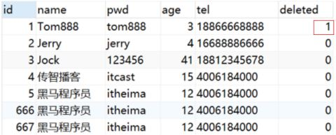

**知识点1：@TableLogic**

| 名称     | @TableLogic                                |
| -------- | ------------------------------------------ |
| 类型     | 属性注解                                   |
| 位置     | 模型类中用于表示删除字段的属性定义上方     |
| 作用     | 标识该字段为进行逻辑删除的字段             |
| 相关属性 | value：逻辑未删除值<br />delval:逻辑删除值 |

### 乐观锁

#### 概念

在讲解乐观锁之前，我们还是先来分析下问题:

业务并发现象带来的问题:秒杀

* 假如有100个商品或者票在出售，为了能保证每个商品或者票只能被一个人购买，如何保证不会出现超买或者重复卖
* 对于这一类问题，其实有很多的解决方案可以使用
* 第一个最先想到的就是锁，锁在一台服务器中是可以解决的，但是如果在多台服务器下锁就没有办法控制，比如12306有两台服务器在进行卖票，在两台服务器上都添加锁的话，那也有可能会导致在同一时刻有两个线程在进行卖票，还是会出现并发问题
* 我们接下来介绍的这种方式是针对于小型企业的解决方案，因为数据库本身的性能就是个瓶颈，如果对其并发量超过2000以上的就需要考虑其他的解决方案了。

简单来说，乐观锁主要解决的问题是当要更新一条记录的时候，希望这条记录没有被别人更新。

#### 实现思路

乐观锁的实现方式:

* 数据库表中添加version列，比如默认值给1
* 第一个线程要修改数据之前，取出记录时，获取当前数据库中的version=1
* 第二个线程要修改数据之前，取出记录时，获取当前数据库中的version=1
* 第一个线程执行更新时，set version = newVersion where version = oldVersion

  * newVersion = version+1 [2]
  * oldVersion = version [1]
* 第二个线程执行更新时，set version = newVersion where version = oldVersion

  * newVersion = version+1 [2]
  * oldVersion = version [1]
* 假如这两个线程都来更新数据，第一个和第二个线程都可能先执行

  * 假如第一个线程先执行更新，会把version改为2，
* 第二个线程再更新的时候，set version = 2 where version = 1,此时数据库表的数据version已经为2，所以第二个线程会修改失败
* 假如第二个线程先执行更新，会把version改为2，第一个线程再更新的时候，set version = 2 where version = 1,此时数据库表的数据version已经为2，所以第一个线程会修改失败
* 不管谁先执行都会确保只能有一个线程更新数据，这就是MP提供的乐观锁的实现原理分析。

  上面所说的步骤具体该如何实现呢?

#### 实现步骤

分析完步骤后，具体的实现步骤如下:

**步骤1:数据库表添加列**

列名可以任意，比如使用version ,给列设置默认值为1


**步骤2:在模型类中添加对应的属性**

根据添加的字段列名，在模型类中添加对应的属性值

```
@Data
//@TableName("tbl_user") 可以不写是因为配置了全局配置
public class User {
    @TableId(type = IdType.ASSIGN_UUID)
    private String id;
    private String name;
    @TableField(value="pwd",select=false)
    private String password;
    private Integer age;
    private String tel;
    @TableField(exist=false)
    private Integer online;
    private Integer deleted;
    @Version
    private Integer version;
}
```

**步骤3:添加乐观锁的拦截器**

```
@Configuration
public class MpConfig {
    @Bean
    public MybatisPlusInterceptor mpInterceptor() {
        //1.定义Mp拦截器
        MybatisPlusInterceptor mpInterceptor = new MybatisPlusInterceptor();
        //2.添加乐观锁拦截器
        mpInterceptor.addInnerInterceptor(new OptimisticLockerInnerInterceptor());
        return mpInterceptor;
    }
}
```

**步骤4:执行更新操作**

```
@SpringBootTest
class Mybatisplus03DqlApplicationTests {
    @Autowired
    private UserDao userDao;
    @Test
    void testUpdate(){
        User user = new User();
        user.setId(3L);
        user.setName("Jock666");
        userDao.updateById(user);
    }
}
```

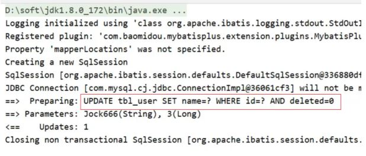

你会发现，这次修改并没有更新version字段，原因是没有携带version数据。

添加version数据

```
@SpringBootTest
class Mybatisplus03DqlApplicationTests {
    @Autowired
    private UserDao userDao;
    @Test
    void testUpdate(){
        User user = new User();
        user.setId(3L);
        user.setName("Jock666");
        user.setVersion(1);
        userDao.updateById(user);
    }
}
```


你会发现，我们传递的是1，MP会将1进行加1，然后，更新回到数据库表中。

所以要想实现乐观锁，首先第一步应该是拿到表中的version，然后拿version当条件在将version加1更新回到数据库表中，所以我们在查询的时候，需要对其进行查询

```
@SpringBootTest
class Mybatisplus03DqlApplicationTests {
    @Autowired
    private UserDao userDao;
    @Test
    void testUpdate(){
        //1.先通过要修改的数据id将当前数据查询出来
        User user = userDao.selectById(3L);
        //2.将要修改的属性逐一设置进去
        user.setName("Jock888");
        userDao.updateById(user);
    }
}
```


大概分析完乐观锁的实现步骤以后，我们来模拟一种加锁的情况，看看能不能实现多个人修改同一个数据的时候，只能有一个人修改成功。

```
@SpringBootTest
class Mybatisplus03DqlApplicationTests {
    @Autowired
    private UserDao userDao;
    @Test
    void testUpdate(){
        //1.先通过要修改的数据id将当前数据查询出来
        User user = userDao.selectById(3L); //version=3
        User user2 = userDao.selectById(3L); //version=3
        user2.setName("Jock aaa");
        userDao.updateById(user2); //version=>4
        user.setName("Jock bbb");
        userDao.updateById(user); //verion=3?条件还成立吗？
    }
}
```

运行程序，分析结果：


乐观锁就已经实现完成了，如果对于上面的这些步骤记不住咋办呢?

参考官方文档来实现: 一个插件就搞定。

https://baomidou.com/pages/0d93c0/#optimisticlockerinnerinterceptor

## 快速开发

### 代码生成器原理分析


所以我们会发现，做任何模块的开发，对于这段代码，基本上都是对红色部分的调整，所以我们把去掉红色内容的东西称之为模板，红色部分称之为参数，以后只需要传入不同的参数，就可以根据模板创建出不同模块的dao代码。

除了Dao可以抽取模块，其实我们常见的类都可以进行抽取，只要他们有公共部分即可。再来看下模型类的模板：


① 可以根据数据库表的表名来填充

② 可以根据用户的配置来生成ID生成策略

③到⑨可以根据数据库表字段名称来填充

所以只要我们知道是对哪张表进行代码生成，这些内容我们都可以进行填充。

分析完后，我们会发现，要想完成代码自动生成，我们需要有以下内容:

* 模板: MyBatisPlus提供，可以自己提供，但是麻烦，不建议
* 数据库相关配置:读取数据库获取表和字段信息
* 开发者自定义配置:手工配置，比如ID生成策略

### 代码生成器实现

**步骤1:创建一个Maven项目**

**代码2:导入对应的jar包**

```
<?xml version="1.0" encoding="UTF-8"?>
<project xmlns="http://maven.apache.org/POM/4.0.0"
         xmlns:xsi="http://www.w3.org/2001/XMLSchema-instance"
         xsi:schemaLocation="http://maven.apache.org/POM/4.0.0
https://maven.apache.org/xsd/maven-4.0.0.xsd">
    <modelVersion>4.0.0</modelVersion>
    <parent>
        <groupId>org.springframework.boot</groupId>
        <artifactId>spring-boot-starter-parent</artifactId>
        <version>2.5.1</version>
    </parent>
    <groupId>com.itheima</groupId>
    <artifactId>mybatisplus_04_generator</artifactId>
    <version>0.0.1-SNAPSHOT</version>
    <properties>
        <java.version>1.8</java.version>
    </properties>
    <dependencies>
        <!--spring webmvc-->
        <dependency>
            <groupId>org.springframework.boot</groupId>
            <artifactId>spring-boot-starter-web</artifactId>
        </dependency>
        <!--mybatisplus-->
        <dependency>
            <groupId>com.baomidou</groupId>
            <artifactId>mybatis-plus-boot-starter</artifactId>
            <version>3.4.1</version>
        </dependency>
        <!--druid-->
        <dependency>
            <groupId>com.alibaba</groupId>
            <artifactId>druid</artifactId>
            <version>1.1.16</version>
        </dependency>
        <!--mysql-->
        <dependency>
            <groupId>mysql</groupId>
            <artifactId>mysql-connector-java</artifactId>
            <scope>runtime</scope>
        </dependency>
        <!--test-->
        <dependency>
            <groupId>org.springframework.boot</groupId>
            <artifactId>spring-boot-starter-test</artifactId>
            <scope>test</scope>
        </dependency>
        <!--lombok-->
        <dependency>
            <groupId>org.projectlombok</groupId>
            <artifactId>lombok</artifactId>
            <version>1.18.12</version>
        </dependency>
        <!--代码生成器-->
        <dependency>
            <groupId>com.baomidou</groupId>
            <artifactId>mybatis-plus-generator</artifactId>
            <version>3.4.1</version>
        </dependency>
        <!--velocity模板引擎-->
        <dependency>
            <groupId>org.apache.velocity</groupId>
            <artifactId>velocity-engine-core</artifactId>
            <version>2.3</version>
        </dependency>
    </dependencies>
    <build>
        <plugins>
            <plugin>
                <groupId>org.springframework.boot</groupId>
                <artifactId>spring-boot-maven-plugin</artifactId>
            </plugin>
        </plugins>
    </build>
</project>
```

**步骤3:编写引导类**

```
@SpringBootApplication
public class Mybatisplus04GeneratorApplication {
    public static void main(String[] args) {
        SpringApplication.run(Mybatisplus04GeneratorApplication.class, args);
    }
}
```

**步骤4:创建代码生成类**

```
public class CodeGenerator {
    public static void main(String[] args) {
        //1.获取代码生成器的对象
        AutoGenerator autoGenerator = new AutoGenerator();
        //设置数据库相关配置
        DataSourceConfig dataSource = new DataSourceConfig();
        dataSource.setDriverName("com.mysql.cj.jdbc.Driver");
        dataSource.setUrl("jdbc:mysql://localhost:3306/mybatisplus_db?serverTimezone = UTC");
        dataSource.setUsername("root");
        dataSource.setPassword("root");
        autoGenerator.setDataSource(dataSource);
        //设置全局配置
        GlobalConfig globalConfig = new GlobalConfig();
        globalConfig.setOutputDir(System.getProperty("user.dir") + "/mybatisplus_04_generator / src / main / java"); //设置代码生成位置
        globalConfig.setOpen(false); //设置生成完毕后是否打开生成代码所在的目录
        globalConfig.setAuthor("黑马程序员"); //设置作者
        globalConfig.setFileOverride(true); //设置是否覆盖原始生成的文件
        globalConfig.setMapperName("%sDao"); //设置数据层接口名，%s为占位符，指代模块名称
        globalConfig.setIdType(IdType.ASSIGN_ID); //设置Id生成策略
        autoGenerator.setGlobalConfig(globalConfig);
        //设置包名相关配置
        PackageConfig packageInfo = new PackageConfig();
        packageInfo.setParent("com.aaa"); //设置生成的包名，与代码所在位置不冲突，二者叠加组成完整路径
        packageInfo.setEntity("domain"); //设置实体类包名
        packageInfo.setMapper("dao"); //设置数据层包名
        autoGenerator.setPackageInfo(packageInfo);
        //策略设置
        StrategyConfig strategyConfig = new StrategyConfig();
        strategyConfig.setInclude("tbl_user"); //设置当前参与生成的表名，参数为可变参数
        strategyConfig.setTablePrefix("tbl_"); //设置数据库表的前缀名称，模块名 =数据库表名 - 前缀名 例如：User = tbl_user - tbl_
        strategyConfig.setRestControllerStyle(true); //设置是否启用Rest风格
        strategyConfig.setVersionFieldName("version"); //设置乐观锁字段名
        strategyConfig.setLogicDeleteFieldName("deleted"); //设置逻辑删除字段名
        strategyConfig.setEntityLombokModel(true); //设置是否启用lombok
        autoGenerator.setStrategy(strategyConfig);
        //2.执行生成操作
        autoGenerator.execute();
    }
}
```

对于代码生成器中的代码内容，我们可以直接从官方文档中获取代码进行修改

**步骤5:运行程序**

运行成功后，会在当前项目中生成很多代码，代码包含controller , service，mapper和entity


至此代码生成器就已经完成工作，我们能快速根据数据库表来创建对应的类，简化我们的代码开发。

### MP中Service的CRUD

回顾我们之前业务层代码的编写，编写接口和对应的实现类:

```
public interface UserService{
}
@Service
public class UserServiceImpl implements UserService{
}

```

接口和实现类有了以后，需要在接口和实现类中声明方法

```
public interface UserService{
    public List<User> findAll();
}
@Service
public class UserServiceImpl implements UserService{
    @Autowired
    private UserDao userDao;
    public List<User> findAll(){
        return userDao.selectList(null);
    }
}
```

MP看到上面的代码以后就说这些方法也是比较固定和通用的，那我来帮你抽取下，所以MP提供了一个Service接口和实现类，分别是: IService和ServiceImpl ,后者是对前者的一个具体实现。

以后我们自己写的Service就可以进行如下修改:

```
public interface UserService extends IService<User>{
}
@Service
public class UserServiceImpl extends ServiceImpl<UserDao, User> implements
        UserService{
}
```

修改以后的好处是，MP已经帮我们把业务层的一些基础的增删改查都已经实现了，可以直接进行使
用。

编写测试类进行测试:

```
@SpringBootTest
class Mybatisplus04GeneratorApplicationTests {
    private IUserService userService;
    @Test
    void testFindAll() {
        List<User> list = userService.list();
        System.out.println(list);
    }
}
```

注意:mybatisplus_04_generator项目中对于MyBatis的环境是没有进行配置，如果想要运行，需要提取将配置文件中的内容进行完善后在运行。

思考:在MP封装的Service层都有哪些方法可以用?

查看官方文档: https://mp.baomidou.com/guide/crud-interface.html ,这些提供的方法大家可以参考官方文档进行学习使用，方法的名称可能有些变化，但是方法对应的参数和返回值基本类似。
