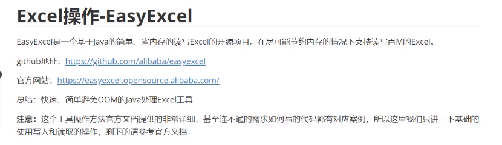

# Easyexcel使用簡介

## Excel操作-EasyExcel



**具体操作：**

引入依赖：

```xml
        <!-- Easyexcel -->
        <dependency>
            <groupId>com.alibaba</groupId>
            <artifactId>easyexcel</artifactId>
            <version>3.1.1</version>
        </dependency>
        <dependency>
            <groupId>org.projectlombok</groupId>
            <artifactId>lombok</artifactId>
            <version>1.18.8</version>
        </dependency>
        <dependency>
            <groupId>com.alibaba</groupId>
            <artifactId>fastjson</artifactId>
            <version>2.0.6</version>
        </dependency>
```

此工具读取都是依赖于实体类，所以我们需要先建立一个实体类

```kotlin
package com.test.entity;

import com.alibaba.excel.annotation.ExcelIgnore;
import com.alibaba.excel.annotation.ExcelProperty;
import lombok.Data;
import lombok.EqualsAndHashCode;

import java.util.Date;

@Data
@EqualsAndHashCode
public class DemoData {

    @ExcelProperty("字符串标题")
    private String string;
    @ExcelProperty("日期标题")
    private Date date;
    @ExcelProperty("数字标题")
    private Double doubleData;
    /**
     * 忽略这个字段
     */
    @ExcelIgnore
    private String ignore;
}
```

**写入操作：**

注意：按照固定格式来写入

```java
package com.test.write;

import com.alibaba.excel.EasyExcel;
import com.alibaba.excel.util.ListUtils;
import com.test.entity.DemoData;

import javax.swing.plaf.ListUI;
import java.util.Date;
import java.util.List;

public class EasyDemo {
    public static void main(String[] args) {
        simpleWrite();
    }

    private static List<DemoData> data(){
        List<DemoData> list = ListUtils.newArrayList();
        for(int i = 0;i<10;i++){
            DemoData data = new DemoData();
            data.setString("字符串" + i);
            data.setDate(new Date());
            data.setDoubleData(0.56);
            list.add(data);
        }
        return list;
    }

    public static void simpleWrite(){
        //注意 simpleWrite 在数据量不大的情况下可以使用（5000以内，具体也要看实际情况），数据量大参考 重复多次写入
        //写法1 JDK8+
        //since:3.0.0-beta1
        String fileName = "./easyExcel.xlsx";
        EasyExcel.write(fileName, DemoData.class)
                .sheet("模板") //第一张表的表名
                .doWrite(data());
    }
}
```

**读取操作：**

读取操作需要一个监听器，下面是官网监听器示例

```java
package com.test.util;

import com.alibaba.excel.context.AnalysisContext;
import com.alibaba.excel.read.listener.ReadListener;
import com.alibaba.excel.util.ListUtils;
import com.alibaba.fastjson.JSON;
import com.test.entity.DemoDAO;
import com.test.entity.DemoData;
import lombok.extern.slf4j.Slf4j;

import java.util.List;

// 有个很重要的点 DemoDataListener 不能被spring管理，要每次读取excel都要new,然后里面用到spring可以构造方法传进去
@Slf4j
public class DemoDataListener implements ReadListener<DemoData> {

    /**
     * 每隔5条存储数据库，实际使用中可以100条，然后清理list ，方便内存回收
     */
    private static final int BATCH_COUNT = 100;
    /**
     * 缓存的数据
     */
    private List<DemoData> cachedDataList = ListUtils.newArrayListWithExpectedSize(BATCH_COUNT);
    /**
     * 假设这个是一个DAO，当然有业务逻辑这个也可以是一个service。当然如果不用存储这个对象没用。
     */
    private DemoDAO demoDAO;

    public DemoDataListener() {
        // 这里是demo，所以随便new一个。实际使用如果到了spring,请使用下面的有参构造函数
        demoDAO = new DemoDAO();
    }

    /**
     * 如果使用了spring,请使用这个构造方法。每次创建Listener的时候需要把spring管理的类传进来
     *
     * @param demoDAO
     */
    public DemoDataListener(DemoDAO demoDAO) {
        this.demoDAO = demoDAO;
    }

    /**
     * 这个每一条数据解析都会来调用
     *
     * @param data    one row value. Is is same as {@link AnalysisContext#readRowHolder()}
     * @param context
     */
    @Override
    public void invoke(DemoData data, AnalysisContext context) {
        log.info("解析到一条数据:{}", JSON.toJSONString(data));
        cachedDataList.add(data);
        // 达到BATCH_COUNT了，需要去存储一次数据库，防止数据几万条数据在内存，容易OOM
        if (cachedDataList.size() >= BATCH_COUNT) {
            saveData();
            // 存储完成清理 list
            cachedDataList = ListUtils.newArrayListWithExpectedSize(BATCH_COUNT);
        }
    }

    /**
     * 所有数据解析完成了 都会来调用
     *
     * @param context
     */
    @Override
    public void doAfterAllAnalysed(AnalysisContext context) {
        // 这里也要保存数据，确保最后遗留的数据也存储到数据库
        saveData();
        log.info("所有数据解析完成！");
    }

    /**
     * 加上存储数据库
     */
    private void saveData() {
        log.info("{}条数据，开始存储数据库！", cachedDataList.size());
        demoDAO.save(cachedDataList);
        log.info("存储数据库成功！");
    }
}
```

对应的实体类代码参考：之前已经写好了

```less
@Getter
@Setter
@EqualsAndHashCode
public class DemoData {
    private String string;
    private Date date;
    private Double doubleData;
}
```

持久层代码：

```cpp
/**
 * 假设这个是你的DAO存储。当然还要这个类让spring管理，当然你不用需要存储，也不需要这个类。
 **/
public class DemoDAO {
    public void save(List<DemoData> list) {
        // 如果是mybatis,尽量别直接调用多次insert,自己写一个mapper里面新增一个方法batchInsert,所有数据一次性插入
    }
}
```

读Excel 简单示例：

```typescript
package com.test.read;

import com.alibaba.excel.EasyExcel;
import com.alibaba.excel.read.listener.PageReadListener;
import com.alibaba.fastjson.JSON;
import com.test.entity.DemoData;
import com.test.util.DemoDataListener;
import lombok.extern.slf4j.Slf4j;

public class EasyDemo_Read {

    public static void main(String[] args) {
        new EasyDemo_Read().simpleRead();
    }
    public void simpleRead() {
        // 写法1：JDK8+ ,不用额外写一个DemoDataListener
        // since: 3.0.0-beta1
        String fileName = "./easyExcel.xlsx";
        // 这里默认每次会读取100条数据 然后返回过来 直接调用使用数据就行
        // 具体需要返回多少行可以在`PageReadListener`的构造函数设置
        EasyExcel.read(fileName, DemoData.class, new PageReadListener<DemoData>(dataList -> {
            for (DemoData demoData : dataList) {
                System.out.println("读取到一条数据: " + JSON.toJSONString(demoData));
            }
        })).sheet().doRead();

        //自定义方法, 如果有自定义操作的话，一般都是改自定义监听器中的invoke方法来满足自己需求
//        EasyExcel.read(fileName, DemoData.class, new DemoDataListener()).sheet().doRead();
    }
}
```

ps：如果遇到报错Caused by: java.lang.ClassNotFoundException:com.alibaba.fastjson2.modules.ObjectReaderModule

解决方法是改下fastjson依赖：

```xml
        <dependency>
            <groupId>com.alibaba</groupId>
            <artifactId>fastjson</artifactId>
            <version>2.0.8</version>  
        </dependency>
```

# Reference Links :

#學習參考視頻地址：

[https://www.bilibili.com/video/BV1cG411M7ut/](https://www.bilibili.com/video/BV1cG411M7ut/)

[https://easyexcel.opensource.alibaba.com/](https://easyexcel.opensource.alibaba.com/)

[https://github.com/alibaba/easyexcel](https://github.com/alibaba/easyexcel)
