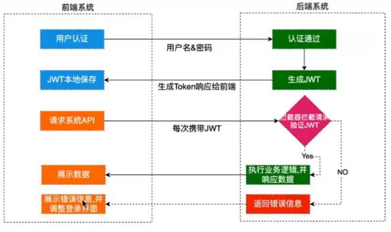
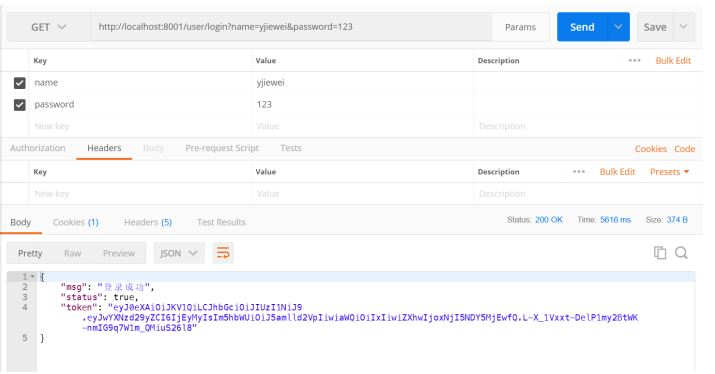
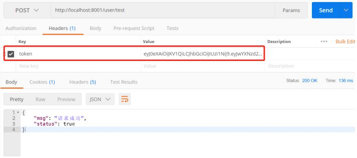

> 文檔内容來自Github的pdf文檔，具體來源鏈接找不到，如有需要，可以聯係我補充。


## JSON Web Token

### **什么是JWT？**

* JSON Web Token (JWT)是⼀个开放标准(RFC 7519)，它定义了⼀种紧凑的、⾃包含的⽅式，⽤于
  作为JSON对象在各⽅之间安全地传输信息。该信息可以被验证和信任，因为它是数字签名的。

### **什么时候应该⽤JWT？**

* Authorization (授权) : 这是使⽤JWT的最常⻅场景。⼀旦⽤⼾登录，后续每个请求都将包含
  JWT，允许⽤⼾访问该令牌允许的路由、服务和资源。单点登录是现在⼴泛使⽤的JWT的⼀个特
  性，因为它的开销很⼩，并且可以轻松地跨域使⽤。
* Information Exchange (信息交换) : 对于安全的在各⽅之间传输信息⽽⾔，JSON Web Tokens⽆
  疑是⼀种很好的⽅式。因为JWT可以被签名，例如，⽤公钥/私钥对，你可以确定发送⼈就是它们
  所说的那个⼈。另外，由于签名是使⽤头和有效负载计算的，您还可以验证内容没有被篡改。

### 认证流程



* ⾸先，前端通过Web表单将⾃⼰的⽤⼾名和密码发送到后端的接⼝。这⼀过程⼀般是⼀个HTTP
  POST请求。建议的⽅式是通过SSL加密的传输(https协议) ，从⽽避免敏感信息被嗅探。
* 后端核对⽤⼾名和密码成功后，将⽤⼾的id等其他信息作为JWT Payload (负载)，将其与头部分别
  进⾏Base64编码拼接后签名，形成⼀个JWT(Token)。形成的JWT就是⼀个形同11. zzz. xxx的字符
  串。token head.payload.signature
* 后端将JWT字符串作为登录成功的返回结果返回给前端。 前端可以将返回的结果保存在
  localStorage或sessionStorage上， 退出登录时前端删除保存的JWT即可。
* 前端在每次请求时将JWT放⼊HTTP Header中的Authorization位。 (解决XSS和XSRF问题)
* 后端检查是否存在，如存在验证JWT的有效性。
  * 检查签名是否正确;
  * 检查Token是否过期;
  * 检查Token的接收⽅是否是⾃⼰(可选)
* 验证通过后后端使⽤JWT中包含的⽤⼾信息进⾏其他逻辑操作，返回相应结果。

### JWT优势在哪?

* 简洁(Compact): 可以通过URL，POST参数或者在HTTP header发送，数据量⼩，传输速度快
* ⾃包含(Self-contained):负载中包含了所有⽤⼾所需要的信息，避免了多次查询数据库
* 因为Token是 以JSON加密的形式保存在客⼾端的，所以JWT是跨语⾔的，原则上任何web形式都⽀持。
* 不需要在服务端保存会话信息，特别适⽤于分布式微服务。

### JWT具体包含信息

#### header

标头通常由两部分组成: 令牌的类型(即JWT) 和所使⽤的签名算法，例如HMAC、SHA256或RSA。 它会使⽤Base64 编码组成JWT 结构的第⼀部分。

```
{
"alg":"HS256",
"typ":"JWT"
}
```

> 注意:Base64是⼀ 种编码，也就是说，它是可以被翻译回原来的样⼦来的。它并不是⼀种加密过程。

#### Payload

令牌的第⼆部分是有效负载，其中包含声明。声明是有关实体(通常是⽤⼾)和其他数据的声明。同样
的，它会使⽤Base64 编码组成JWT结构的第⼆部分

```
{
"sub" : "HS256"
"name" : "yjiewei"
"admin" : "true"
}
```

#### Signature

header和payload都是结果Base64编码过的，中间⽤.隔开，第三部分就是前⾯两部分合起来做签名，密钥绝对⾃⼰保管好，签名值同样做Base64编码拼接在JWT后⾯。（签名并编码）

```
HMACSHA256 (base64Ur1Encode(header) + "." + base64Ur1Encode(payload) , secret);
```

## 整合到Java

### pom引入依賴

```
Page{count=true, pageNum=1, pageSize=4, startRow=0, endRow=4, total=8, pages=2,
        reasonable=false, pageSizeZero=false}[Emp{eid=1, empName='admin', age=22,
        sex='男', email='456@qq.com', did=3}, Emp{eid=2, empName='admin2', age=22,
        sex='男', email='456@qq.com', did=3}, Emp{eid=3, empName='王五', age=12, sex='女',
        email='123@qq.com', did=3}, Emp{eid=4, empName='赵六', age=32, sex='男',
        email='123@qq.com', did=1}]
<dependencies>
    <dependency>
        <groupId>org.springframework.boot</groupId>
        <artifactId>spring-boot-starter-web</artifactId>
    </dependency>
    <!--引⼊mybatis-->
    <dependency>
        <groupId>org.mybatis.spring.boot</groupId>
        <artifactId>mybatis-spring-boot-starter</artifactId>
        <version>2.1.0</version>
    </dependency>
    <!--引⼊jwt-->
    <dependency>
        <groupId>com.auth0</groupId>
        <artifactId>java-jwt</artifactId>
        <version>3.10.3</version>
    </dependency>
    <!--引⼊mysql-->
    <dependency>
        <groupId>mysql</groupId>
        <artifactId>mysql-connector-java</artifactId>
        <version>8.0.16</version>
    </dependency>
    <!--引⼊druid-->
    <dependency>
        <groupId>com.alibaba</groupId>
        <artifactId>druid</artifactId>
        <version>1.2.0</version>
    </dependency>
    <dependency>
        <groupId>org.projectlombok</groupId>
        <artifactId>lombok</artifactId>
        <optional>true</optional>
    </dependency>
    <dependency>
        <groupId>org.springframework.boot</groupId>
        <artifactId>spring-boot-starter-test</artifactId>
        <scope>test</scope>
    </dependency>
</dependencies>
```

### 测试JWT加密过程

```
public class Jwt {
    /**
     * 获取JWT令牌
     */
    @Test
    public void getToken() {
        Map<String, Object> map = new HashMap<>();
        Calendar instance = Calendar.getInstance();
        instance.add(Calendar.SECOND, 2000);
        /**
         * header可以不写有默认值
         * payload 通常⽤来存放⽤⼾信息
         * signature 是前两个合起来的签名值
         */
        String token = JWT.create().withHeader(map) //header
                .withClaim("userId", 21)//payload
                .withClaim("username", "yjiewei")//payload
                .withExpiresAt(instance.getTime())//指定令牌的过期时间
                .sign(Algorithm.HMAC256("!RHO4$%*^fi$R")); //签名，密钥⾃⼰记住
        System.out.println(token);
    }
    /**
     * 令牌验证:根据令牌和签名解析数据
     * 常⻅异常：
     * SignatureVerificationException 签名不⼀致异常
     * TokenExpiredException 令牌过期异常
     * AlgorithmMismatchException 算法不匹配异常
     * InvalidClaimException 失效的payload异常
     */
    @Test
    public void tokenVerify() {
        // token值传⼊做验证
        String token =
                "eyJ0eXAiOiJKV1QiLCJhbGciOiJIUzI1NiJ9.eyJleHAiOjE2MjkyMDg0NjgsInVzZXJJZCI6MjEsIn
        VzZXJuYW1lIjoieWppZXdlaSJ9.e4auZWkykZ2Hu8Q20toaks-4e62gerPlDEPHvhunCnQ";
        /**
        * ⽤⼾Id：21
        * ⽤⼾名：yjiewei
        * 过期时间：Tue Aug 17 21:54:28 CST 2021
        */
        JWTVerifier jwtVerifier =
                JWT.require(Algorithm.HMAC256("!RHO4$%*^fi$R")).build();
        DecodedJWT decodedJWT = jwtVerifier.verify(token); // 验证并获取解码后的
        token
        System.out.println("⽤⼾Id：" + decodedJWT.getClaim("userId").asInt());
        System.out.println("⽤⼾名：" +
                decodedJWT.getClaim("username").asString());
        System.out.println("过期时间：" + decodedJWT.getExpiresAt());
    }
}
```

### 封装⼯具类

Java就是封装抽象封装抽象...所以这⾥也封装⼀个⼯具类。

```
public class JWTUtil {
    /**
     * 密钥要⾃⼰保管好
     */
    private static String SECRET = "privatekey#^&^%!save";
    /**
     * 传⼊payload信息获取token
     * @param map payload
     * @return token
     */
    public static String getToken(Map<String, String> map) {
        JWTCreator.Builder builder = JWT.create();
        //payload
        map.forEach(builder::withClaim);
        Calendar instance = Calendar.getInstance();
        instance.add(Calendar.DATE, 3); //默认3天过期
        builder.withExpiresAt(instance.getTime());//指定令牌的过期时间
        return builder.sign(Algorithm.HMAC256(SECRET));
    }
    /**
     * 验证token
     */
    public static DecodedJWT verify(String token) {
        //如果有任何验证异常，此处都会抛出异常
        return JWT.require(Algorithm.HMAC256(SECRET)).build().verify(token);
    }
    /**
     * 获取token中的payload
     */
    public static Map<String, Claim> getPayloadFromToken(String token) {
        return JWT.require(Algorithm.HMAC256(SECRET)).build().verify(token).getClaims();
    }
}
```

## JWT 整合SpringBoot

> 我们要对每个请求都去验证实现单点登录，通过拦截器拦截请求对JWT做验证。

### 登录并获取token



### 在请求头中添加token



### 重要的代码⽚段

```
// 拦截器
@Slf4j
public class JWTInterceptor implements HandlerInterceptor {
    @Override
    public boolean preHandle(HttpServletRequest request,
                             HttpServletResponse response,
                             Object handler) throws Exception {
        //获取请求头中的令牌
        String token = request.getHeader("token");
        log.info("当前token为：{}", token);
        Map<String, Object> map = new HashMap<>();
        try {
            JWTUtil.verify(token);
            return true;
        } catch (SignatureVerificationException e) {
            e.printStackTrace();
            map.put("msg", "签名不⼀致");
        } catch (TokenExpiredException e) {
            e.printStackTrace();
            map.put("msg", "令牌过期");
        } catch (AlgorithmMismatchException e) {
            e.printStackTrace();
            map.put("msg", "算法不匹配");
        } catch (InvalidClaimException e) {
            e.printStackTrace();
            map.put("msg", "失效的payload");
        } catch (Exception e) {
            e.printStackTrace();
            map.put("msg", "token⽆效");
        }
        map.put("status", false);
        //响应到前台: 将map转为json
        String json = new ObjectMapper().writeValueAsString(map);
        response.setContentType("application/json;charset=UTF-8");
        response.getWriter().println(json);
        return false;
    }
}
```

```
// 指定拦截路径
@Configuration
public class InterceptorConfig implements WebMvcConfigurer {
    @Override
    public void addInterceptors(InterceptorRegistry registry) {
        registry.addInterceptor(new JWTInterceptor())
                .addPathPatterns("/user/test")
                .excludePathPatterns("/user/login");
    }
}
```

```
// 拦截请求并验证请求头中的token
@PostMapping("/user/test")
public Map<String, Object> test(HttpServletRequest request) {
    String token = request.getHeader("token");
    DecodedJWT verify = JWTUtil.verify(token);
    String id = verify.getClaim("id").asString(); 
    // 我前⾯存的时候转字符串了String name = verify.getClaim("name").asString();
    log.info("⽤⼾id：{}", id)
    log.info("⽤⼾名: {}", name);
    //TODO:业务逻辑
    Map<String, Object> map = new HashMap<>();
    map.put("status", true);
    map.put("msg", "请求成功");
    return map;
}
```

# Reference Links：

[https://www.bilibili.com/video/BV1i54y1m7cP](https://www.bilibili.com/video/BV1i54y1m7cP)
