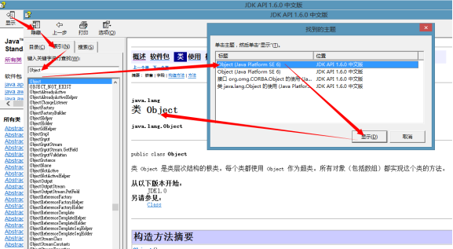
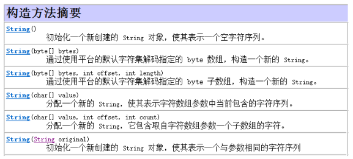

## 不同修饰符使用细节

### 常用来修饰类、方法、变量的修饰符

* public 权限修饰符，公共访问, 类,方法,成员变量
* protected 权限修饰符，受保护访问, 方法,成员变量
* 默认什么也不写 也是一种权限修饰符，默认访问, 类,方法,成员变量
* private 权限修饰符，私有访问, 方法,成员变量
* static 静态修饰符 方法,成员变量
* final 最终修饰符 类,方法,成员变量,局部变量
* abstract 抽象修饰符 类 ,方法

我们编写程序时，权限修饰符一般放于所有修饰符之前，不同的权限修饰符不能同时使用；

* 同时，abstract与private不能同时使用；
* 同时，abstract与static不能同时使用；
* 同时，abstract与final不能同时使用。

### 修饰类能够使用的修饰符

修饰类只能使用public、默认的、final、abstract关键字，使用最多的是 public关键字

```
public class Demo {} //最常用的方式
class Demo2{}
public final class Demo3{}
public abstract class Demo4{}
```

### 修饰成员变量能够使用的修饰符

* public : 公共的
* protected : 受保护的
* : 默认的
* private ：私有的
* final : 最终的
* static : 静态的

使用最多的是 private

```
public int count = 100;
protected int count2 = 100;
int count3 = 100;
private int count4 = 100; //最常用的方式
public final int count5 = 100;
public static int count6 = 100;
```

### 修饰构造方法能够使用的修饰符

* public : 公共的
* protected : 受保护的
* : 默认的
* private ：私有的

使用最多的是 public

```
public Demo(){} //最常用的方式
protected Demo(){}
Demo(){}
private Demo(){}
```

### 修饰成员方法能够使用的修饰符

* public : 公共的
* protected : 受保护的
* : 默认的
* private ：私有的
* final : 最终的
* static : 静态的
* abstract : 抽象的

使用最多的是 public

```
public void method1(){}//最常用的方式
protected void method2(){}
void method3(){}
private void method4(){}
public final void method5(){}
public static void method6(){}//最常用的方式
public abstract void method7();//最常用的方式
```

## 类作为方法参数与返回值

### 类作为方法参数

在编写程序中，会经常碰到调用的方法要接收的是一个类类型的情况，那么这时，要向方法中传入该类的对象。如下代码演示：

```
class Person{
    public void show(){
        System.out.println("show方法执行了");
    }
}
//测试类
public class Test {
    public static void main(String[] args) {
//创建Person对象
        Person p = new Person();
//调用method方法
        method(p);
    }
    //定义一个方法method，用来接收一个Person对象，在方法中调用Person对象的show方法

    public static void method(Person p){
        p.show();
    }
}
```

### 类作为方法返回值

写程序调用方法时，我们以后会经常碰到返回一个类类型的返回值，那么这时，该方法要返回一个该类的对象。如下代码演示：

```
class Person{
    public void show(){
        System.out.println("show方法执行了");
    }
}
//测试类
public class Test {
    public static void main(String[] args) {
//调用method方法，获取返回的Person对象
        Person p = method();
//调用p对象中的show方法
        p.show();
    }

    //定义一个方法method，用来获取一个Person对象，在方法中完成Person对象的创建
    public static Person method(){
        Person p = new Person();
        return p;
    }
}
```

## 抽象类作为方法参数与返回值

### 抽象类作为方法参数

开发中，抽象类作为方法参数的情况也很多见。当遇到方法参数为抽象类类型时，要传入一个实现抽象类所有抽象方法的子类对象。如下代码演示：

```
//抽象类
abstract class Person{
    public abstract void show();
}
class Student extends Person{
    @Override
    public void show() {
        System.out.println("重写了show方法");
    }
}
//测试类
public class Test {
    public static void main(String[] args) {
//通过多态的方式，创建一个Person类型的变量，而这个对象实际是Student
        Person p = new Student();
//调用method方法
        method(p);
    }

    //定义一个方法method，用来接收一个Person类型对象，在方法中调用Person对象的show方法
    public static void method(Person p){//抽象类作为参数
//通过p变量调用show方法,这时实际调用的是Student对象中的show方法
        p.show();
    }
}
```

### 抽象类作为方法返回值

抽象类作为方法返回值的情况，也是有的，这时需要返回一个实现抽象类所有抽象方法的子类对象。如下代码演示：

```
//抽象类
abstract class Person{
    public abstract void show();
}
class Student extends Person{
    @Override
    public void show() {
        System.out.println("重写了show方法");
    }
}
//测试类
public class Test {
    public static void main(String[] args) {
//调用method方法，获取返回的Person对象
        Person p = method();
//通过p变量调用show方法,这时实际调用的是Student对象中的show方法
        p.show();
    }

    //定义一个方法method，用来获取一个Person对象，在方法中完成Person对象的创建
    public static Person method(){
        Person p = new Student();
        return p;
    }
}
```

## 接口作为方法参数与返回值

### 接口作为方法参数

接口作为方法参数的情况是很常见的，经常会碰到。当遇到方法参数为接口类型时，那么该方法要传入一个接口实现类对象。如下代码演示。

```
//接口
interface Smoke{
    public abstract void smoking();
}
class Student implements Smoke{
    @Override
    public void smoking() {
        System.out.println("课下吸口烟，赛过活神仙");
    }
}
//测试类
public class Test {
    public static void main(String[] args) {
    //通过多态的方式，创建一个Smoke类型的变量，而这个对象实际是Student
        Smoke s = new Student();
        //调用method方法
        method(s);
    }

    //定义一个方法method，用来接收一个Smoke类型对象，在方法中调用Smoke对象的show方法
    public static void method(Smoke sm){//接口作为参数
    //通过sm变量调用smoking方法，这时实际调用的是Student对象中的smoking方法
        sm.smoking();
    }
}
```

### 接口作为方法返回值

接口作为方法返回值的情况，在后面的学习中会碰到。当遇到方法返回值是接口类型时，那么该方法需要返回一个接口实现类对象。如下代码演示。

```
//接口
interface Smoke{
    public abstract void smoking();
}
class Student implements Smoke{
    @Override
    public void smoking() {
        System.out.println("课下吸口烟，赛过活神仙");
    }
}
//测试类
public class Test {
    public static void main(String[] args) {
//调用method方法，获取返回的会吸烟的对象
        Smoke s = method();
//通过s变量调用smoking方法,这时实际调用的是Student对象中的smoking方法
        s.smoking();
    }

 //定义一个方法method，用来获取一个具备吸烟功能的对象，并在方法中完成吸烟者的创建
    public static Smoke method(){
        Smoke sm = new Student();
        return sm;
    }
}
```

归纳总结：

* 类作为方法参数时，说明要向方法中传入该类的对象
* 类作为方法返回值时，说明该方法要返回一个该类的对象。
* 抽象类作为方法参数时，说明要传入一个实现抽象类所有抽象方法的子类对象。
* 抽象类作为方法返回值时，说明需要返回一个实现抽象类所有抽象方法的子类对象。
* 接口作为方法参数时，说明该方法要传入一个接口实现类对象。
* 接口作为方法返回值时，说明该方法需要返回一个接口实现类对象。

# 常用API

Java 的API（API: Application(应用) Programming(程序) Interface(接口)）就是JDK中提供给我们使用的类，这些类将底层的代码实现封装了起来，我们不需要关心这些类是如何实现的，只需要学习这些类如何使用即可。

在JDK安装目录下有个src.zip文件，这个文件解压缩后里面的内容是所有Java类的源文件。可以在其中查看相对应的类的源码。
我们在每次查看类中的方法时，都打开源代码进行查看，这种方式过于麻烦。其实，我们可以通过查帮助文档的方式，来了解Java提供的API如何使用。如下图操作：

查找Object类



通过帮助文档中类与方法的介绍，我们就能够使用这个类了。

## Object类

Object类是Java语言中的根类，即所有类的父类。所有类在创建对象的时候，最终找的父类就是Object。

### equals方法

equals方法，用于比较两个对象是否相同，它其实就是使用两个对象的内存地址在比较。Object类中的equals方法内部使用的就是==比较运算符。
在开发中要比较两个对象是否相同，经常会根据对象中的属性值进行比较，也就是在开发经常需要子类重写equals方法根据对象的属性值进行比较。如下代码演示：

```
/*
描述人这个类，并定义功能根据年龄判断是否是同龄人
由于要根据指定类的属性进行比较，这时只要覆盖Object中的equals方法
在方法体中根据类的属性值进行比较
*/
class Person extends Object{
    int age ;
    //复写父类的equals方法，实现自己的比较方式
    public boolean equals(Object obj) {
//判断当前调用equals方法的对象和传递进来的对象是否是同一个
        if(this == obj){
            return true;
        }
//判断传递进来的对象是否是Person类型
        if(!(obj instanceof Person)){
            return false;
        }
//将obj向下转型为Perosn引用，访问其属性
        Person p = (Person)obj;
        return this.age == p.age;
    }
}
```

注意：在复写Object中的equals方法时，一定要注意public boolean equals(Object obj)的参数是Object类型，在调用对象的属性时，一定要进行类型转换，在转换之前必须进行类型判断。

### toString方法

toString方法返回该对象的字符串表示，其实该字符串内容就是对象的类型+@+内存地址值。
由于toString方法返回的结果是内存地址，而在开发中，经常需要按照对象的属性得到相应的字符串表现形式，因此也需要重写它。

```
class Person extends Object{
    int age ;
    //根据Person类的属性重写toString方法
    public String toString() {
        return "Person [age=" + age + "]";
    }
}
```

## String类

查阅API中的String类的描述，发现String 类代表字符串。Java 程序中的所有字符串字面值（如 "abc" ）都作为此类的实例实现。

```
//演示字符串
String str = "AAA";
str = "BBB";
```

字符串是常量；它们的值在创建之后不能更改。也就是说一旦这个字符串确定了，那么就会在内存区域中就生成了这个字符串。字符串本身不能改变，但str变量中记录的地址值是可以改变的。

字符串有大量的重载的构造方法。通过String类的构造方法可以完成字符串对象的创建，那么，通过使用双引号的方式创建对象与new的方式创建对象，有什么不同呢？

```
String s3 = "abc";
String s4 = new String("abc");
System.out.println(s3==s4);//false
System.out.println(s3.equals(s4));//true,
////因为String重写了equals方法，建立了字符串自己的判断相同的依据（通过字符串对象中的字符来判断）
```

 s3和s4的创建方式有什么不同呢？

s3创建，在内存中只有一个对象。这个对象在字符串常量池中
s4创建，在内存中有两个对象。一个new的对象在堆中，一个字符串本身对象，在字符串常量池中

### String类构造方法

构造方法是用来完成String对象的创建，下图中给出了一部分构造方法需要在API中找到，并能够使用下列构造方法创建对象。



```
String s1 = new String(); //创建String对象，字符串中没有内容

byte[] bys = new byte[]{97,98,99,100};
String s2 = new String(bys); // 创建String对象，把数组元素作为字符串的内容
String s3 = new String(bys, 1, 3); //创建String对象，把一部分数组元素作为字符串的内容，参数offset为数组元素的起始索引位置，参数length为要几个元素

char[] chs = new char[]{’a’,’b’,’c’,’d’,’e’};
String s4 = new String(chs); //创建String对象，把数组元素作为字符串的内容
String s5 = new String(chs, 0, 3);//创建String对象，把一部分数组元素作为字符串的内容，参数offset为数组元素的起始索引位置，参数count为要几个元素

String s6 = new String(“abc”); //创建String对象，字符串内容为abc
```

### String类的方法查找

String类中有很多的常用的方法，我们在学习一个类的时候，不要盲目的把所有的方法尝试去使用一遍，这时我们应该根据这个对象的特点分析这个对象应该具备那些功能，这样大家应用起来更方便。
字符串是一个对象，那么它的方法必然是围绕操作这个对象的数据而定义的。我们想想字符串中有哪些功能呢？
1、字符串中有多少个字符?

```
String str = "abcde";
int len = str.length();
System.out.println("len="+len);
```

2、获取部分字符串

```
String str = "abcde";
String s1 = str.substring(1); //返回一个新字符串，内容为指定位置开始到字符串末尾的所有字符
String s2 = str.substring(2, 4);//返回一个新字符串，内容为指定位置开始到指定位置结束所有字符
System.out.println("str="+str);
System.out.println("s1="+s1);
System.out.println("s2="+s2);
```

3、字符串是否以指定字符串开头。结尾同理

```
String str = "StringDemo.java";
boolean b1 = str.startsWith("Demo");//判断是否以给定字符串开头
boolean b2 = str.startsWith("String");
boolean b3 = str.endsWith("java");//判断是否以给定字符串结尾
```

4、字符串中是否包含另一个字符串

```
String str = "abcde";
int index = str.indexOf(“bcd”); //判断是否包含指定字符串，包含则返回第一次出现该字符串的索引，不包含则返回-1
boolean b2 = str.contains("bcd");//判断是否包含指定字符串，包含返回true，不包含返回false
```

5、将字符串转成一个字符数组。或者字节数组

```
String str = "abcde";
char[] chs = str.toCharArray();
byte[] bytes = str.getBytes();
```

6、判断两个字符串中的内容是否相同

```
String str = "abcde";
String str2 = "abcde";
String str3 = "hello";
boolean b1 = str.equals(str2);
boolean b2 = str.equals(str3);
```

7、获取该字符串对象中的内容

```
String str = new String("hello");
System.out.println( str.toString() );
System.out.pintln( str );
```

直接打印引用类型变量时，默认调用该类型进行重写后的toString方法

下面的需求所对应的方法，自己动手在API中查找，并进行方法使用。

* 判断该字符串的内容是否为空的字符串
* 获取给定的字符，在该字符串中第一次出现的位置
* 获取该字符串中指定位置上的字符
* 把该字符串转换成 小写字符串
* 把该字符串转换成 大写字符串
* 在该字符串中，将给定的旧字符，用新字符替换
* 在该字符串中， 将给定的旧字符串，用新字符串替换
* 去除字符串两端空格，中间的不会去除，返回一个新字符串

## StringBuffer类

在学习String类时，API中说字符串缓冲区支持可变的字符串，什么是字符串缓冲区呢？接下来我们来研究下字符串缓冲区。
查阅StringBuffer的API，StringBuffer又称为可变字符序列，它是一个类似于 String 的字符串缓冲区，通过某些方法调用可以改变该序列的长度和内容。
原来StringBuffer是个字符串的缓冲区，即就是它是一个容器，容器中可以装很多字符串。并且能够对其中的字符串进行各种操作。

### StringBuffer的方法使用

代码演示：
创建一个字符串缓冲区对象。用于存储数据。

```
StringBuffer sb = new StringBuffer();
sb.append("haha"); //添加字符串
sb.insert(2, "it");//在指定位置插入
sb.delete(1, 4);//删除
sb.replace(1, 4, "cast");//替换指定范围内的内容
String str = sb.toString();
```

注意：append、delete、insert、replace、reverse方法调用后，返回值都是当前对象自己，所以说，StringBuffer它可以改变字符序列的长度和内容。

StringBuffer类方法查找练习
下面的需求所对应的方法，自己动手在API中查找，并进行方法使用。

* 从指定位置开始，到末尾结束，截取该字符串缓冲区，返回新字符串
* 在原有字符串缓冲区内容基础上，删除指定位置上的字符

### 对象的方法链式调用

在我们开发中，会遇到调用一个方法后，返回一个对象的情况。然后使用返回的对象继续调用方法。这种时候，我们就可以把代码现在一起，如append方法一样，代码如下：

```
//创建一个字符串缓冲区对象。用于存储数据。
StringBuffer sb = new StringBuffer();
//添加数据。不断的添加数据后，要对缓冲区的最后的数据进行操作，必须转成字符串才可以。
String str = sb.append(true).append("hehe").toString();
```

无论多少数据，数据是什么类型都不重要，只要最终变成字符串就可以使用StringBuffer这个容器。

## StringBuilder类

查阅API发现还有一个StringBuilder类，它也是字符串缓冲区，StringBuilder与它和StringBuffer的有什么不同呢？
我们阅读StringBuilder的API说明发现，它也是一个可变的字符序列。此类提供一个与 StringBuffer 兼容的 API， **但不保证同步** 。该类被设计用作 StringBuffer 的一个简易替换，用在字符串缓冲区被单个线程使用的时候（这种情况很普遍）。如果可能，建议优先采用该类，因为在大多数实现中， **它比 StringBuffer 要快** 。

### 总结

1、Object: 它是所有类的超类，祖宗类。java中所有的类都直接或间接的继承这个类
方法：

* public String toString() 返回当前对象中的内容, 对于Object类默认操作来说，返回的对象的类型+@+内存地址值
* public boolean equals(Object obj) 比较两个对象内容是否相同，对于Object类默认操作来说,比较的是地址值

2、String: 字符串类，字符串是常量；它们的值在创建之后不能更改
方法：

* boolean equals(Object obj) 判断两个字符串中的内容是否相同
* boolean equalsIgnoreCase(String str) 判断两个字符串中的内容是否相同, 忽略大小写
* boolean contains(String str) 判断该字符串中 是否包含给定的字符串
* boolean startsWith(String str) 判断该字符串 是否以给定的字符串开头
* boolean endsWith(String str) 判断该字符串 是否以给定的字符串结尾
* boolean isEmpty() 判断该字符串的内容是否为空的字符串 ""
* int length() 获取该字符串的长度
* char charAt(int index) 获取该字符串中指定位置上的字符
* String substring(int start) 从指定位置开始，到末尾结束，截取该字符串，返回新字符串
* String substring(int start,int end) 从指定位置开始，到指定位置结束，截取该字符串，返回新字符串
* int indexOf(int ch ) 获取给定的字符，在该字符串中第一次出现的位置
* int indexOf(String str) 获取给定的字符串，在该字符串中第一次出现的位置
* int indexOf(int ch,int fromIndex) 从指定位置开始，获取给定的字符，在该字符
* byte[] getBytes() 把该字符串 转换成 字节数组
* char[] toCharArray() 把该字符串 转换成 字符数组
* String replace(char old,char new) 在该字符串中，将给定的旧字符，用新字符替换
* String replace(String old,String new) 在该字符串中， 将给定的旧字符串，用新字符串替换
* String trim() 去除字符串两端空格，中间的不会去除，返回一个新字符串
* String toLowerCase() 把该字符串转换成 小写字符串
* String toUpperCase() 把该字符串转换成 大写字符串
* int indexOf(String str,int fromIndex) 从指定位置开始，获取给定的字符串，在该字符串中第一次出现的位置

3、StringBuffer/StringBuilder:
方法：

* public StringBuffer append(String str) 在原有字符串缓冲区内容基础上，在末尾追加新数据
* public StringBuffer insert(int offset,String str) 在原有字符串缓冲区内容基础上，在指定位置插入新数据
* public StringBuffer deleteCharAt(int index) 在原有字符串缓冲区内容基础上，删除指定位置上的字符
* public StringBuffer delete(int start,int end) 在原有字符串缓冲区内容基础上，删除指定范围内的多个字符
* public StringBuffer replace(int start,int end,String str)在原有字符串缓冲区内容基础上，将指定范围内的多个字符 用给定的字符串替换
* public StringBuffer reverse() 将字符串缓冲区的内容 反转 "abc"----"cba"
* public String substring(int start) 从指定位置开始，到末尾结束，截取该字符串缓冲区，返回新字符串
* public String substring(int start,int end) 从指定位置开始，到指定位置结束，截取该字符串缓冲区，返回新字符串

# Reference Links：

https://www.cnblogs.com/ginb/p/7161107.html
