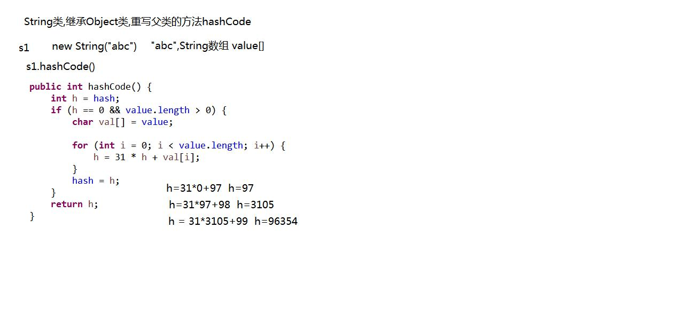
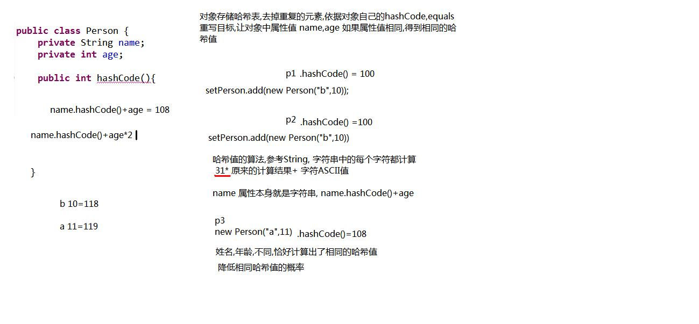

# List

List接口的特点:

* 它是一个元素存取有序的集合。例如，存元素的顺序是11、22、33。那么集合中，元素的存储就是按照11、22、33的顺序完成的。
* 它是一个带有索引的集合，通过索引就可以精确的操作集合中的元素（与数组的索引是一个道理）。
* 集合中可以有重复的元素，通过元素的equals方法，来比较是否为重复的元素。

List接口的常用子类有：

* ArrayList集合
* LinkedList集合

List接口的特有方法(带索引的方法)
1、增加元素方法

* add(Object e)：向集合末尾处，添加指定的元素
* add(int index, Object e) 向集合指定索引处，添加指定的元素，原有元素依次后移

```
/*
* add(int index, E)
* 将元素插入到列表的指定索引上
* 带有索引的操作,防止越界问题
* java.lang.IndexOutOfBoundsException
* ArrayIndexOutOfBoundsException
* StringIndexOutOfBoundsException
*/
public static void function(){
        List<String> list=new ArrayList<String>();
        list.add("abc1");
        list.add("abc2");
        list.add("abc3");
        list.add("abc4");
        System.out.println(list);

        list.add(1,"itcast");
        System.out.println(list);
}
```

2、删除元素

* remove(Object e)：将指定元素对象，从集合中删除，返回值为被删除的元素
* remove(int index)：将指定索引处的元素，从集合中删除，返回值为被删除的元素

```
/*
* E remove(int index)
* 移除指定索引上的元素
* 返回被删除之前的元素
*/
public static void function_1(){
        List<Double> list = new ArrayList<Double>();
        list.add(1.1);
        list.add(1.2);
        list.add(1.3);
        list.add(1.4);

        Double d = list.remove(0);
        System.out.println(d);
        System.out.println(list);
} 
```

```
3、替换元素方法
```

```
set(int index, Object e)：将指定索引处的元素，替换成指定的元素，返回值为替换前的元素
```

```
/*
* E set(int index, E)
* 修改指定索引上的元素
* 返回被修改之前的元素
*/
public static void function_2(){
        List<Integer> list = new ArrayList<Integer>();
        list.add(1);
        list.add(2);
        list.add(3);
        list.add(4);

        Integer i = list.set(0, 5);
        System.out.println(i);
        System.out.println(list);
}
```

查询元素方法

get(int index)：获取指定索引处的元素，并返回该元素

## 迭代器的并发修改异常

迭代器的并发修改异常 java.util.ConcurrentModificationException就是在遍历的过程中,使用了集合方法修改了集合的长度,这是不允许的。

```
import java.util.ArrayList;
import java.util.Iterator;
import java.util.List;

public class ListDemo1 {
```

```
public static void main(String[] args) {
        List<String> list = new ArrayList<String>();
        list.add("abc1");
        list.add("abc2");
        list.add("abc3");
        list.add("abc4");

//对集合使用迭代器进行获取,获取时候判断集合中是否存在 "abc3"对象
//如果有,添加一个元素 "ABC3"
        Iterator<String> it = list.iterator();
        while(it.hasNext()){
            String s = it.next();
//对获取出的元素s,进行判断,是不是有"abc3"
            if(s.equals("abc3")){
                list.add("ABC3");
            }
            System.out.println(s);
        }
    }
}
```

运行结果：

```
Exception in thread "main" abc1
abc2
abc3
java.util.ConcurrentModificationException
    at java.util.ArrayList$Itr.checkForComodification(ArrayList.java:901)
    at java.util.ArrayList$Itr.next(ArrayList.java:851)
    at ArrayListDemo.main(ArrayListDemo.java:17)
```

运行上述代码发生了错误 java.util.ConcurrentModificationException这是什么原因呢？在迭代过程中，使用了集合的方法对元素进行操作。导致迭代器并不知道集合中的变化，容易引发数据的不确定性。

并发修改异常解决办法：在迭代时，不要使用集合的方法操作元素。或者通过ListIterator迭代器操作元素是可以的，ListIterator的出现，解决了使用Iterator迭代过程中可能会发生的错误情况。

## 数据的存储结构

 栈 结 构：后进先出/先进后出(手枪弹夹) FILO (first in last out)

队列结构：先进先出/后进后出(银行排队) FIFO(first in first out)

数组结构：查询快，通过索引快速找到元素；增删慢:每次增删都需要开辟新的数组,将老数组中的元素拷贝到新数组中；开辟新数组耗费资源。

链表结构：查询慢，每次都需要从链头或者链尾找起；增删快，只需要修改元素记录的下个元素的地址值即可不需要移动大量元素

### ArrayList集合的自身特点

底层采用的是数组结构

```
ArrayList al=new ArrayList();//创建了一个长度为0的Object类型数组
al.add("abc");//底层会创建一个长度为10的Object数组 Object[] obj=new Object[10]
//obj[0]="abc"
//如果添加的元素的超过10个,底层会开辟一个1.5*10的长度的新数组
//把原数组中的元素拷贝到新数组,再把最后一个元素添加到新数组中
//原数组:a b c d e f g h k l
//添加m:a b c d e f g h k l m null null null null
```

### LinkedList集合的自身特点

底层采用链表结构,每次查询都要从链头或链尾找起,查询相对数组较慢，但是删除直接修改元素记录的地址值即可,不要大量移动元素
LinkedList的索引决定是从链头开始找还是从链尾开始找，如果该元素小于元素长度一半,从链头开始找起,如果大于元素长度的一半,则从链尾找起

LinkedList特有方法:获取,添加,删除

```
/*
* LinkedList 链表集合的特有功能
* 自身特点: 链表底层实现,查询慢,增删快
* 
* 子类的特有功能,不能多态调用
*/
public class LinkedListDemo {
    public static void main(String[] args) {
        function_3();
    }
    /*
    * E removeFirst() 移除并返回链表的开头
    * E removeLast() 移除并返回链表的结尾
    */
    public static void function_3(){
        LinkedList<String> link = new LinkedList<String>();
        link.add("1");
        link.add("2");
        link.add("3");
        link.add("4");

        String first = link.removeFirst();
        String last = link.removeLast();
        System.out.println(first);
        System.out.println(last);

        System.out.println(link);
    }

    /*
    * E getFirst() 获取链表的开头
    * E getLast() 获取链表的结尾
    */
    public static void function_2(){
        LinkedList<String> link = new LinkedList<String>();
        link.add("1");
        link.add("2");
        link.add("3");
        link.add("4");

        if(!link.isEmpty()){
            String first = link.getFirst();
            String last = link.getLast();
            System.out.println(first);
            System.out.println(last);
        }
    }

    public static void function_1(){
        LinkedList<String> link = new LinkedList<String>();
        link.addLast("a");
        link.addLast("b");
        link.addLast("c");
        link.addLast("d");

        link.addFirst("1");
        link.addFirst("2");
        link.addFirst("3");
        System.out.println(link);
    }

    /*
    * addFirst(E) 添加到链表的开头
    * addLast(E) 添加到链表的结尾
    */
    public static void function(){
        LinkedList<String> link = new LinkedList<String>();

        link.addLast("heima");

        link.add("abc");
        link.add("bcd");

        link.addFirst("itcast");
        System.out.println(link);
    }
}
```

## Vector

Vector集合数据存储的结构是数组结构，为JDK中最早提供的集合,它是线程同步的。

Vector中提供了一个独特的取出方式，就是枚举Enumeration，它其实就是早期的迭代器。

此接口Enumeration的功能与 Iterator 接口的功能是类似的。
Vector集合已被ArrayList替代。枚举Enumeration已被迭代器Iterator替代。

# Set

### Set接口的特点

它是个不包含重复元素的集合。
Set集合取出元素的方式可以采用：迭代器、增强for。
Set集合有多个子类，这里我们介绍其中的HashSet、LinkedHashSet这两个集合。

```
/*
* Set接口,特点不重复元素,没索引
* 
* Set接口的实现类,HashSet (哈希表)
* 特点: 无序集合,存储和取出的顺序不同,没有索引,不存储重复元素
* 代码的编写上,和ArrayList完全一致
*/
public class HashSetDemo {
    public static void main(String[] args) {
        Set<String> set = new HashSet<String>();
        set.add("cn");
        set.add("heima");
        set.add("java");
        set.add("java");
        set.add("itcast");

        Iterator<String> it = set.iterator();
        while(it.hasNext()){
            System.out.println(it.next());
        }
        System.out.println("==============");

        for(String s : set){
            System.out.println(s);
        }
    }
}
```

### 哈希表的数据结构

加载因子:表中填入的记录数/哈希表的长度

例如:加载因子是0.75 代表：数组中的16个位置,其中存入16*0.75=12个元素

如果在存入第十三个(>12)元素,导致存储链子过长,会降低哈希表的性能,那么此时会扩充哈希表(在哈希),底层会开辟一个长度为原长度2倍的数组,把老元素拷贝到新数组中,再把新元素添加数组中
当存入元素数量>哈希表长度*加载因子,就要扩容,因此加载因子决定扩容时机

### 字符串对象的哈希值

```
/*
 *  对象的哈希值,普通的十进制整数
 *  父类Object,方法 public int hashCode() 计算结果int整数
 */
public class HashDemo {
    public static void main(String[] args) {
        String s1 = new String("abc");
        String s2 = new String("abc");
        System.out.println(s1.hashCode());//96354
        System.out.println(s2.hashCode());//96354

        System.out.println("重地".hashCode());//1179395
        System.out.println("通话".hashCode());//1179395
    }
}
```

```
//String类重写hashCode()方法
//字符串都会存储在底层的value数组中{'a','b','c'}
public int hashCode() {
    int h = hash;
    if (h == 0 && value.length > 0) {
        char val[] = value;

        for (int i = 0; i < value.length; i++) {
            h = 31 * h + val[i];
        }
        hash = h;
    }
    return h;
}
```



### 哈希表的存储过程

```
public static void main(String[] args) {
    HashSet<String> set = new HashSet<String>();
    set.add(new String("abc"));
    set.add(new String("abc"));
    set.add(new String("bbc"));
    set.add(new String("bbc"));
    System.out.println(set);
}
```

存取原理，每存入一个新的元素都要走以下三步:

1.首先调用本类的hashCode()方法算出哈希值

2.在容器中找是否与新元素哈希值相同的老元素,如果没有直接存入；如果有转到第三步

3.新元素会与该索引位置下的老元素利用equals方法一一对比，一旦新元素.equals(老元素)返回true,停止对比,说明重复,不再存入，如果与该索引位置下的老元素都通过equals方法对比返回false,说明没有重复,存入。hashCode()返回一个是十进制的值,这个值叫做哈希值,不同的类都会重写Object类的hashCode()方法,底层有不同的生成哈希值的算法,下面介绍如何通过hashCode()方法和equals()方法保证存入HashSet的值唯一的。


### 哈希表的存储自定义对象

```
/*
* HashSet集合的自身特点:
* 底层数据结构,哈希表
* 存储,取出都比较快
* 线程不安全,运行速度快
*/
public class HashSetDemo1 {
    public static void main(String[] args) {

//将Person对象中的姓名,年龄,相同数据,看作同一个对象
//判断对象是否重复,依赖对象自己的方法 hashCode,equals
        HashSet<Person> setPerson = new HashSet<Person>();
        setPerson.add(new Person("a",11));
        setPerson.add(new Person("b",10));
        setPerson.add(new Person("b",10));
        setPerson.add(new Person("c",25));
        setPerson.add(new Person("d",19));
        setPerson.add(new Person("e",17));//每个对象的地址值都不同,调用Obejct类的hashCode方法返回不同哈希值,直接存入
        System.out.println(setPerson);
    }
}
```

```
public class Person {
    private String name;
    private int age;

    /*
    * 没有做重写父类,每次运行结果都是不同整数
    * 如果子类重写父类的方法,哈希值,自定义的
    * 存储到HashSet集合的依据
    * 
    * 尽可能让不同的属性值产生不同的哈希值,这样就不用再调用equals方法去比较属性
    *
    */
    public int hashCode(){
        return name.hashCode()+age*55;
    }
    //方法equals重写父类,保证和父类相同
//public boolean equals(Object obj){}
    public boolean equals(Object obj){
        if(this == obj)
            return true;
        if(obj == null)
            return false;
        if(obj instanceof Person){
            Person p = (Person)obj;
            return name.equals(p.name) && age==p.age;
        }
        return false;
    }

    public String getName() {
        return name;
    }
    public void setName(String name) {
        this.name = name;
    }
    public int getAge() {
        return age;
    }
    public void setAge(int age) {
        this.age = age;
    }
    public Person(String name, int age) {
        super();
        this.name = name;
        this.age = age;
    }
    public Person(){}

    public String toString(){
        return name+".."+age;
    }
}
```



### LinkedHashSet集合

LinkedHashSet 基于链表的哈希表实现，继承自HashSet。

LinkedHashSet 自身特性：

* 具有顺序,存储和取出的顺序相同的；
* 线程不安全的集合,运行速度块

```
public class LinkedHashSetDemo {
    public static void main(String[] args) {
        LinkedHashSet<Integer> link = new LinkedHashSet<Integer>();
        link.add(123);
        link.add(44);
        link.add(33);
        link.add(33);
        link.add(66);
        link.add(11);
        System.out.println(link);
    }
}
```

### ArrayList,HashSet判断对象是否重复的原因

ArrayList的contains方法原理:底层依赖于equals方法，ArrayList的contains方法调用时，会使用传入元素的equals方法依次与集合中的旧元素所比较，从而根据返回的布尔值判断是否有重复元素。

此时，当ArrayList存放自定义类型时，由于自定义类型在未重写equals方法前，判断是否重复的依据是地址值，所以如果想根据内容判断是否为重复元素，需要重写元素的equals方法。HashSet的add()方法和contains方法()底层都依赖 hashCode()方法与equals方法()。

Set集合不能存放重复元素，其添加方法在添加时会判断是否有重复元素，有重复不添加，没重复则添加。

HashSet集合由于是无序的，其判断唯一的依据是元素类型的hashCode与equals方法的返回结果。规则如下：

先判断新元素与集合内已经有的旧元素的HashCode值，如果不同，说明是不同元素，添加到集合。如果相同，再判断equals比较结果。返回true则相同元素；返回false则不同元素，添加到集合。

所以，使用HashSet存储自定义类型，如果没有重写该类的hashCode与equals方法，则判断重复时，使用的是地址值，如果想通过内容比较元素是否相同，需要重写该元素类的hashcode与equals方法。

### hashCode和equals的面试题

两个对象 Person p1 p2，如果两个对象的哈希值相同 p1.hashCode()==p2.hashCode()，两个对象的equals一定返回true吗？ 即p1.equals(p2) 一定是true吗？

正确答案:不一定

如果两个对象的equals方法返回true,p1.equals(p2)==true，两个对象的哈希值一定相同吗？

正确答案: 一定

Java对于eqauls方法和hashCode方法是这样规定的：

* 1.如果两个对象相同，那么它们的hashCode值一定要相同；
* 2.如果两个对象的hashCode相同，它们并不一定相同（这里说的对象相同指的是用eqauls方法比较）。如不按要求去做了，会发现相同的对象可以出现在Set集合中，同时，增加新元素的效率会大大下降。
* 3.equals()相等的两个对象，hashcode()一定相等；equals()不相等的两个对象，却并不能证明他们的hashcode()不相等。换句话说，equals()方法不相等的两个对象，hashcode()有可能相等（我的理解是由于哈希码在生成的时候产生冲突造成的）。反过来，hashcode()不等，一定能推出equals()也不等；hashcode()相等，equals()可能相等，也可能不等。

### 归纳总结


# Reference Links：

https://www.cnblogs.com/ginb/p/7170157.html
