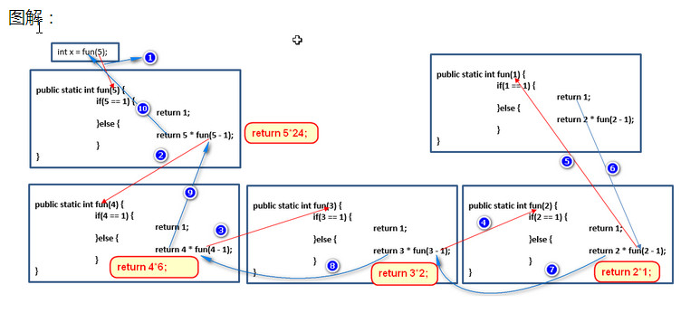

## IO概述

回想之前写过的程序，数据都是在内存中，一旦程序运行结束，这些数据都没有了，等下次再想使用这些数据，可是已经没有了。那怎么办呢？能不能把运算完的数据都保存下来，下次程序启动的时候，再把这些数据读出来继续使用呢？其实要把数据持久化存储，就需要把内存中的数据存储到内存以外的其他持久化设备(硬盘、光盘、U盘等)上。

当需要把内存中的数据存储到持久化设备上这个动作称为输出（写）Output操作。当把持久设备上的数据读取到内存中的这个动作称为输入（读）Input操作。因此我们把这种输入和输出动作称为IO操作。

## File类

File类是File文件和目录路径名的抽象表示形式。即，Java中把文件或者目录（文件夹）都封装成File对象。也就是说如果我们要去操作硬盘上的文件，或者文件夹只要找到File这个类即可。那么我们就要研究研究File这个类中都有那些功能可以操作文件或者文件夹呢？

### File类的构造函数

通过构造方法创建File对象，我们进行演示：

```
package inter;
import java.io.File;
public class Demo {
    public static void main(String[] args) {
        //File构造函数演示
        String pathName = "e:\\java_code\\hello.java";
        File f1 = new File(pathName);//将Test22文件封装成File对象。注意；可以封装不存在文件或者文件夹，变成对象。
        System.out.println(f1);
        File f2 = new File("e:\\java_code","hello.java");
        System.out.println(f2);
        //将parent封装成file对象。
        File dir = new File("e:\\java_code");
        File f3 = new File(dir,"hello.java");
        System.out.println(f3);
    }
}
//e:\java_code\hello.java
// e:\java_code\hello.java
// e:\java_code\hello.java
```

### File类的获取

创建完了File对象之后，那么File类中都有如下常用方法，可以获取文件相关信息

方法演示如下：

```
package inter;
import java.io.File;
public class Demo {
    public static void main(String[] args) {
        //创建文件对象
        File file = new File("Demo.java");
        //获取文件的绝对路径，即全路径
        String absPath = file.getAbsolutePath();
        //File中封装的路径是什么获取到的就是什么。
        String path = file.getPath();
        //获取文件名称
        String filename = file.getName();
        //获取文件大小
        long size = file.length();
        System.out.println("absPath="+absPath);
        System.out.println("path="+path);
        System.out.println("filename="+filename);
        System.out.println("size="+size);
    }

}
//absPath=F:\编程语言\Java\Project\Projects\typeInfo\Demo.java
//path=Demo.java
//filename=Demo.java
//size=0
```

### 文件和文件夹的创建删除等

经常上面介绍，我们知道可以通过File获取到文件名称，文件路径(目录)等信息。接下来演示使用File类创建、删除文件等操作。代码演示：

```
package inter;

import java.io.File;
import java.io.IOException;

public class Demo {
    public static void main(String[] args) throws IOException {
// 对文件或者文件加进行操作。
        File file = new File("f:\\file.txt");
// 创建文件，如果文件不存在，创建 true 如果文件存在，则不创建 false。 如果路径错误，IOException。
        boolean b1 = file.createNewFile();
        System.out.println("b1=" + b1);
//-----------删除文件操作-------注意：不去回收站。慎用------
        boolean b2 = file.delete();
        System.out.println("b2=" + b2);
//-----------需要判断文件是否存在------------
        boolean b3 = file.exists();
        System.out.println("b3=" + b3);
//-----------对目录操作 创建，删除，判断------------
        File dir = new File("f:\\abc");
//mkdir()创建单个目录。
        boolean b4 = dir.mkdir();
        System.out.println("b4=" + b4);
        File dir1 = new File("f:\\abcd\\ef\\gh");
//dir.mkdirs();创建多级目录
        boolean b5 = dir1.mkdirs();
        System.out.println("b5=" + b5);

//删除目录时，如果目录中有内容，无法直接删除。
        boolean b6 = dir.delete();
//只有将目录中的内容都删除后，保证该目录为空。这时这个目录才可以删除。
        System.out.println("b6=" + b6);
//-----------判断文件，目录------------
        File f = new File("f:\\javahaha");// 要判断是否是文件还是目录，必须先判断存在。
// f.mkdir();//f.createNewFile();
        System.out.println(f.isFile());
        System.out.println(f.isDirectory());
    }
}

//b1=true
//b2=true
//b3=false
//b4=true
//b5=true
//b6=true
//false
//false
```


### listFiles()方法介绍

文件都存放在目录（文件夹）中，那么如何获取一个目录中的所有文件或者目录中的文件夹呢？

方法演示如下：


```
package inter;
import java.io.File;
public class Demo {
    public static void main(String[] args) {
        File dir = new File("F:\\源码学习");
//获取的是目录下的当前的文件以及文件夹的名称。
        String[] names = dir.list();
        for(String name : names){
            System.out.println(name);
        }
//获取目录下当前文件以及文件对象，只要拿到了文件对象，那么就可以获取其中想要的信息
        File[] files = dir.listFiles();
        for(File file : files){
            System.out.println(file);
        }
    }
}
//ace-master.zip
//nfine-NFine-master
//nfine-NFine-master.zip
//SugarSite-master
//SugarSite-master.zip
//TaskManager-master
//TaskManager-master.zip
//WebDemo.rar
//websocket聊天室
//定时框架demo源码
//行动日志
//路过秋天的开源项目
//F:\源码学习\ace-master.zip
//F:\源码学习\nfine-NFine-master
//F:\源码学习\nfine-NFine-master.zip
//F:\源码学习\SugarSite-master
//F:\源码学习\SugarSite-master.zip
//F:\源码学习\TaskManager-master
//F:\源码学习\TaskManager-master.zip
//F:\源码学习\WebDemo.rar
//F:\源码学习\websocket聊天室
//F:\源码学习\定时框架demo源码
//F:\源码学习\行动日志
//F:\源码学习\路过秋天的开源项目
```


注意：在获取指定目录下的文件或者文件夹时必须满足下面两个条件

* 1、指定的目录必须是存在的，
* 2、指定的必须是目录。否则容易引发返回数组为null，出现NullPointerException

### 文件过滤器

通过listFiles()方法，我们可以获取到一个目录下的所有文件和文件夹，但能不能对其进行过滤呢？比如我们只想要一个目录下的指定扩展名的文件，或者包含某些关键字的文件夹呢？我们是可以先把一个目录下的所有文件和文件夹获取到，并遍历当前获取到所有内容，遍历过程中在进行筛选，但是这个动作有点麻烦，Java给我们提供相应的功能来解决这个问题。查阅File类的API，在查阅时发现File类中重载的listFiles方法，并且接受指定的过滤器。

测试类


```
import java.io.File;
import java.io.FilenameFilter;

public class Test {
    public static void main(String[] args) {
//获取扩展名为.java所有文件
//创建File对象
        File file = new File("F:\\源码学习");
//获取指定扩展名的文件,由于要对所有文件进行扩展名筛选，因此调用方法需要传递过滤器
        File[] files = file.listFiles(new MyFileFilter());
//遍历获取到的所有符合条件的文件
        for (File f : files) {
            System.out.println(f);
        }
    }
}
class MyFileFilter implements FilenameFilter {
    public boolean accept(File dir, String name) {
        return name.endsWith(".zip");
    }
}
//F:\源码学习\ace-master.zip
//F:\源码学习\nfine-NFine-master.zip
//F:\源码学习\SugarSite-master.zip
//F:\源码学习\TaskManager-master.zip
```


### 自定类继承FilenameFilter过滤器接口

在查阅API时，我们发现，在listFiles(FileFilter filter) 也可以接受一个FileFilter过滤器，它和我们讲的FilenameFilter有啥区别呢？

* FilenameFilter过滤器中的accept方法接受两个参数，一个当前文件或文件夹所在的路径，一个是当前文件或文件夹对象的名称。
* FileFilter 过滤器中的accept方法接受一个参数，这个参数就当前文件或文件夹对象

当我们需要过滤文件名称时就可以使用FilenameFilter这个过滤器，当我们想对当前文件或文件夹进行过滤，就可以使用FileFilter ，比如需要当前目录下的所有文件夹，就可以使用FileFilter 过滤器。

测试类

```
import java.io.File;
import java.io.FileFilter;

public class Test {
    public static void main(String[] args) {
//获取扩展名为.java所有文件
//创建File对象
        File file = new File("F:\\源码学习");
//获取指定目录下的文件夹
        File[] files = file.listFiles(new FileFileterByDir());
//遍历获取到的所有符合条件的文件
        for (File f : files) {
           System.out.println(f);
        }
    }
}
//自定义类继承FileFilter过滤器接口
//文件过滤器
class FileFileterByDir implements FileFilter {
    public boolean accept(File pathname) {
        return pathname.isDirectory();
    }
}

//F:\源码学习\nfine-NFine-master
//F:\源码学习\SugarSite-master
//F:\源码学习\TaskManager-master
//F:\源码学习\websocket聊天室
//F:\源码学习\定时框架demo源码
//F:\源码学习\行动日志
//F:\源码学习\路过秋天的开源项目
```


## 递归

递归，指在当前方法内调用自己的这种现象。递归分为两种，直接递归和间接递归。直接递归称为方法自身调用自己。间接递归可以A方法调用B方法，B方法调用C方法，C方法调用A方法。

递归的代码演示，计算1-n之间的和，使用递归完成

```
public class DiGuiDemo {
    public static void main(String[] args) {
//计算1~num的和，使用递归完成
        int n = 5;
        int sum = getSum(n);
        System.out.println(sum);
    }
    public static int getSum(int n) {
        if(n == 1){
            return 1;
        }
        return n + getSum(n-1);
    }
}
```

注意：递归一定要有条件限定，保证递归能够停止下来，否则会发生栈内存溢出。在递归中虽然有限定条件，但是递归次数不能太多。否则也会发生栈内存溢出。



### 递归打印所有子目录中的文件路径

编写一个方法用来打印指定目录中的文件路径，并进行方法的调用。要求：若指定的目录有子目录，那么把子目录中的文件路径也打印出来。

代码演示

```
import java.io.File;

public class Test {
    public static void main(String[] args) {
        File file = new File("F:\\源码学习\\nfine-NFine-master\\NFine");
        getFileAll(file);
    }
//获取指定目录以及子目录中的所有的文件
    public static void getFileAll(File file) {
        File[] files = file.listFiles();
//遍历当前目录下的所有文件和文件夹
        for (File f : files) {
//判断当前遍历到的是否为目录
            if(f.isDirectory()){
//是目录，继续获取这个目录下的所有文件和文件夹
                getFileAll(f);
            }else{
//不是目录，说明当前f就是文件，那么就打印出来
                System.out.println(f);
            }
        }
    }
}
```

## 字符编码表

我们知道计算机底层数据存储的都是二进制数据，而我们生活中的各种各样的数据，如何才能和计算机中存储的二进制数据对应起来呢？这时老美他们就把每一个字符和一个整数对应起来，就形成了一张编码表，老美他们的编码表就是ASCII表。其中就是各种英文字符对应的编码。

编码表：其实就是生活中字符和计算机二进制的对应关系表。

1、ascii： 一个字节中的7位就可以表示。对应的字节都是正数。0-xxxxxxx

2、iso-8859-1:拉丁码表 latin，用了一个字节用的8位。1-xxxxxxx 负数。

3、GB2312:简体中文码表。包含6000-7000中文和符号。用两个字节表示。两个字节第一个字节是负数,第二个字节可能是正数

* GBK:目前最常用的中文码表，2万的中文和符号。用两个字节表示，其中的一部分文字，第一个字节开头是1，第二字节开头是0
* GB18030：最新的中文码表，目前还没有正式使用。

4、unicode：国际标准码表:无论是什么文字，都用两个字节存储。

* Java中的char类型用的就是这个码表。char c = 'a';占两个字节。
* Java中的字符串是按照系统默认码表来解析的。简体中文版 字符串默认的码表是GBK。

5、UTF-8:基于unicode，一个字节就可以存储数据，不要用两个字节存储，而且这个码表更加的标准化，在每一个字节头加入了编码信息(后期到api中查找)。

能识别中文的码表：GBK、UTF-8；正因为识别中文码表不唯一，涉及到了编码解码问题。对于我们开发而言；常见的编码 GBK UTF-8 ISO-8859-1

文字--->(数字) ：编码。 “abc”.getBytes() byte[]

(数字)--->文字 : 解码。 byte[] b={97,98,99} ；new String(b)

# Reference Links：

https://www.cnblogs.com/ginb/p/7197683.html
