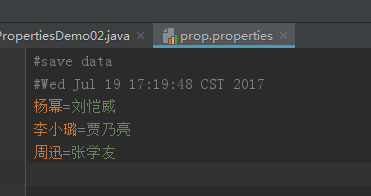

## Properties类

Properties类表示了一个持久的属性集。Properties可保存在流中或从流中加载。属性列表中每个键及其对应值都是一个字符串。

特点：

* Hashtable的子类，map集合中的方法都可以用。
* 该集合没有泛型。键值都是字符串。
* 它是一个可以持久化的属性集。键值可以存储到集合中，也可以存储到持久化的设备(硬盘、U盘、光盘)上。键值的来源也可以是持久化的设备。
* 有和流技术相结合的方法。

```
load(InputStream)  把指定流所对应的文件中的数据，读取出来，保存到Propertie集合中
load(Reader)  
store(OutputStream,commonts)把集合中的数据，保存到指定的流所对应的文件中，参数commonts代表对描述信息
stroe(Writer,comments);
```

代码演示：

```
package io;

import java.util.Properties;
import java.util.Set;
/*
 *
 * Properties集合，它是唯一一个能与IO流交互的集合
 *
 * 需求：向Properties集合中添加元素，并遍历
 *
 * 方法：
 * public Object setProperty(String key, String value)调用 Hashtable 的方法 put。
 * public Set<String> stringPropertyNames()返回此属性列表中的键集，
 * public String getProperty(String key)用指定的键在此属性列表中搜索属性
 */
public class PropertiesDemo01 {
    public static void main(String[] args) {
        //创建集合对象
        Properties prop = new Properties();
        //添加元素到集合
        //prop.put(key, value);
        prop.setProperty("周迅", "张学友");
        prop.setProperty("李小璐", "贾乃亮");
        prop.setProperty("杨幂", "刘恺威");

        //System.out.println(prop);//测试的使用
        //遍历集合
        Set<String> keys = prop.stringPropertyNames();
        for (String key : keys) {
            //通过键 找值
            //prop.get(key)
            String value = prop.getProperty(key);
            System.out.println(key+"==" +value);
        }
    }
}
```

### 将集合中内容存储到文件

```
package io;

import java.io.FileWriter;
import java.io.IOException;
import java.util.Properties;

//需求：使用Properties集合，完成把集合内容存储到IO流所对应文件中的操作
//分析：
//1，创建Properties集合
//2，添加元素到集合
//3，创建流
//4，把集合中的数据存储到流所对应的文件中
//stroe(Writer,comments)
//store(OutputStream,commonts)
//把集合中的数据，保存到指定的流所对应的文件中，参数commonts代表对描述信息
//5，关闭流
//
//代码演示：
public class PropertiesDemo02 {
    public static void main(String[] args) throws IOException {
        //1，创建Properties集合
        Properties prop = new Properties();
        //2，添加元素到集合
        prop.setProperty("周迅", "张学友");
        prop.setProperty("李小璐", "贾乃亮");
        prop.setProperty("杨幂", "刘恺威");

        //3，创建流
        FileWriter out = new FileWriter("prop.properties");
        //4，把集合中的数据存储到流所对应的文件中
        prop.store(out, "save data");
        //5，关闭流
        out.close();
    }
}
```



### 读取文件中的数据，并保存到集合

```
package io;

import java.io.FileInputStream;
import java.io.IOException;
import java.util.Properties;

//需求：从属性集文件prop.properties 中取出数据，保存到集合中
//        分析：
//        1，创建集合
//        2，创建流对象
//        3,把流所对应文件中的数据 读取到集合中
//        load(InputStream)  把指定流所对应的文件中的数据，读取出来，保存到Propertie集合中
//        load(Reader)
//        4,关闭流
//        5,显示集合中的数据
//        代码演示：
public class PropertiesDemo03 {
    public static void main(String[] args) throws IOException {
        //1，创建集合
        Properties prop = new Properties();
        //2，创建流对象
        FileInputStream in = new FileInputStream("prop.properties");
//FileReader in = new FileReader("prop.properties");
        //3,把流所对应文件中的数据 读取到集合中
        prop.load(in);
        //4,关闭流
        in.close();
        //5,显示集合中的数据
        System.out.println(prop);

    }
}
```

注意：使用字符流FileReader就可以完成文件中的中文读取操作了。

## 序列化流与反序列化流

用于从流中读取对象的操作流 ObjectInputStream 称为 反序列化流；用于向流中写入对象的操作流 ObjectOutputStream 称为 序列化流

特点：用于操作对象。可以将对象写入到文件中，也可以从文件中读取对象。

### 对象序列化流ObjectOutputStream

ObjectOutputStream 将 Java 对象的基本数据类型和图形写入 OutputStream。可以使用 ObjectInputStream 读取（重构）对象。通过在流中使用文件可以实现对象的持久存储。

#### 只能将支持 java.io.Serializable 接口的对象写入流中

代码演示：

```
package io;

import java.io.FileOutputStream;
import java.io.IOException;
import java.io.ObjectOutputStream;

public class ObjectStreamDemo {
    public static void main(String[] args) throws IOException, ClassNotFoundException {
        /*
         * 将一个对象存储到持久化(硬盘)的设备上。
         */
        writeObj();//对象的序列化。
    }
    public static void writeObj() throws IOException {
        //1,明确存储对象的文件。
        FileOutputStream fos = new FileOutputStream("obj.object");
        //2，给操作文件对象加入写入对象功能。
        ObjectOutputStream oos = new ObjectOutputStream(fos);
        //3，调用了写入对象的方法。
        oos.writeObject(new Person("wangcai",20));
        //关闭资源。
        oos.close();
    }
}
```

Person类

```
package io;

import java.io.Serializable;

public class Person implements Serializable {
    private String name;
    private int age;
    public Person() {
        super();
    }
    public Person(String name, int age) {
        super();
        this.name = name;
        this.age = age;
    }

    public String getName() {
        return name;
    }
    public void setName(String name) {
        this.name = name;
    }
    public int getAge() {
        return age;
    }
    public void setAge(int age) {
        this.age = age;
    }
    @Override
    public String toString() {
        return "Person [name=" + name + ", age=" + age + "]";
    }
}
```

### 对象反序列化流ObjectInputStream

 ObjectInputStream 对以前使用 ObjectOutputStream 写入的基本数据和对象进行反序列化。支持 java.io.Serializable接口的对象才能从流读取。

 代码演示：

```
package io;

import java.io.FileInputStream;
import java.io.IOException;
import java.io.ObjectInputStream;

public class ObjectStreamDemo1 {
    public static void main(String[] args) throws IOException, ClassNotFoundException {
        readObj();//对象的反序列化。
    }
    public static void readObj() throws IOException, ClassNotFoundException {
        //1,定义流对象关联存储了对象文件。
        FileInputStream fis = new FileInputStream("obj.object");
        //2,建立用于读取对象的功能对象。
        ObjectInputStream ois = new ObjectInputStream(fis);
        Person obj = (Person)ois.readObject();
        System.out.println(obj.toString());
    }
}
```

## 序列化接口

当一个对象要能被序列化，这个对象所属的类必须实现Serializable接口。否则会发生异常NotSerializableException异常。
同时当反序列化对象时，如果对象所属的class文件在序列化之后进行的修改，那么进行反序列化也会发生异常InvalidClassException。发生这个异常的原因如下：

* 该类的序列版本号与从流中读取的类描述符的版本号不匹配
* 该类包含未知数据类型
* 该类没有可访问的无参数构造方法

Serializable标记接口。该接口给需要序列化的类，提供了一个序列版本号。serialVersionUID. 该版本号的目的在于验证序列化的对象和对应类是否版本匹配。

代码修改如下，修改后再次写入对象，读取对象测试。

```
public class Person implements Serializable {
    //给类显示声明一个序列版本号。
    private static final long serialVersionUID = 1L;
    private String name;
    private int age;
    public Person() {
        super();
      
    }
    public Person(String name, int age) {
        super();
        this.name = name;
        this.age = age;
    }

    public String getName() {
        return name;
    }
    public void setName(String name) {
        this.name = name;
    }
    public int getAge() {
        return age;
    }
    public void setAge(int age) {
        this.age = age;
    }
    @Override
    public String toString() {
        return "Person [name=" + name + ", age=" + age + "]";
    }
}
```

## 瞬态关键字transient

当一个类的对象需要被序列化时，某些属性不需要被序列化，这时不需要序列化的属性可以使用关键字transient修饰。只要被transient修饰了，序列化时这个属性就不会被序列化了。
同时静态修饰也不会被序列化，因为序列化是把对象数据进行持久化存储，而静态的属于类加载时的数据，不会被序列化。
代码修改如下，修改后再次写入对象，读取对象测试。

```
public class Person implements Serializable {
    /*
     * 给类显示声明一个序列版本号。
     */
    private static final long serialVersionUID = 1L;
    private static String name;
    private transient/*瞬态*/ int age;
  
    public Person() {
        super();
      
    }
  
    public Person(String name, int age) {
        super();
        this.name = name;
        this.age = age;
    }

    public String getName() {
        return name;
    }
    public void setName(String name) {
        this.name = name;
    }
    public int getAge() {
        return age;
    }
    public void setAge(int age) {
        this.age = age;
    }

    @Override
    public String toString() {
        return "Person [name=" + name + ", age=" + age + "]";
    }
}
```

## 打印流

打印流添加输出数据的功能，使它们能够方便地打印各种数据值表示形式.

打印流根据流的分类：

* 字节打印流 PrintStream
* 字符打印流 PrintWriter

方法：

* void print(String str): 输出任意类型的数据，
* void println(String str): 输出任意类型的数据，自动写入换行操作

```
package io;

import java.io.IOException;
import java.io.PrintWriter;

/*
* 需求：把指定的数据，写入到printFile.txt文件中
*
* 分析：
*     1，创建流
*     2，写数据
*     3，关闭流
*/
public class PrintWriterDemo {
    public static void main(String[] args) throws IOException {
        //创建流
        //PrintWriter out = new PrintWriter(new FileWriter("printFile.txt"));
        PrintWriter out = new PrintWriter("printFile.txt");
        //2，写数据
        for (int i=0; i<5; i++) {
            out.println("helloWorld");
        }
        //3,关闭流
        out.close();
    }
}
```

### 打印流完成数据自动刷新

可以通过构造方法，完成文件数据的自动刷新功能

构造方法：开启文件自动刷新写入功能

* public PrintWriter(OutputStream out, boolean autoFlush)
* public PrintWriter(Writer out, boolean autoFlush)

```
package io;

import java.io.FileWriter;
import java.io.IOException;
import java.io.PrintWriter;

/*
 * 分析：
 *     1，创建流
 *     2，写数据
 */
public class PrintWriterDemo2 {
    public static void main(String[] args) throws IOException {
        //创建流
        PrintWriter out = new PrintWriter(new FileWriter("printFile.txt"), true);
        //2，写数据
        for (int i=0; i<5; i++) {
            out.println("helloWorld");
        }
        //3,关闭流
        out.close();
    }
}
```

## commons-IO

1、导入classpath

* 加入classpath的第三方jar包内的class文件才能在项目中使用
* 创建lib文件夹
* 将commons-io.jar拷贝到lib文件夹
* 导入jar包

2、FilenameUtils
这个工具类是用来处理文件名（译者注：包含文件路径）的，他可以轻松解决不同操作系统文件名称规范不同的问题
常用方法：

* getExtension(String path)：获取文件的扩展名；
* getName()：获取文件名；
* isExtension(String fileName,String ext)：判断fileName是否是ext后缀名；

3、FileUtils
提供文件操作（移动文件，读取文件，检查文件是否存在等等）的方法。
常用方法：

* readFileToString(File file)：读取文件内容，并返回一个String；
* writeStringToFile(File file，String content)：将内容content写入到file中；
* copyDirectoryToDirectory(File srcDir,File destDir);文件夹复制
* copyFile(File srcFile,File destFile);文件夹复制

代码演示：

```
package io;

import org.apache.commons.io.FileUtils;

import java.io.*;

/*
 * 完成文件的复制
 */
public class CommonsIODemo01 {
    public static void main(String[] args) throws IOException {
        //method1("D:\\test.avi", "D:\\copy.avi");
        //通过Commons-IO完成了文件复制的功能
        FileUtils.copyFile(new File("D:\\test.avi"), new File("D:\\copy.avi"));

        //通过Commons-IO完成了文件夹复制的功能
        //D:\java 复制到 C:\\abc文件夹下
        FileUtils.copyDirectoryToDirectory(new File("D:\\java"), new File("C:\\abc"));
    }
}
```

# Reference Links：

https://www.cnblogs.com/ginb/p/7207076.html
