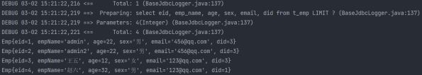

## 动态SQL

Mybatis框架的动态SQL技术是一种根据特定条件动态拼装SQL语句的功能，它存在的意义是为了解
决拼接SQL语句字符串时的痛点问题

### if

* if标签可通过test属性（即传递过来的数据）的表达式进行判断，若表达式的结果为true，则标签中的内容会执行；反之标签中的内容不会执行
* 在where后面添加一个恒成立条件 1=1
* 这个恒成立条件并不会影响查询的结果

  * 这个 1=1 可以用来拼接 and 语句，例如：当empName为null时
  * 如果不加上恒成立条件，则SQL语句为 select * from t_emp where and age = ? and sex = ? and email = ? ，此时 where 会与 and 连用，SQL语句会报错
    * 如果加上一个恒成立条件，则SQL语句为 select * from t_emp where 1= 1 and age = ? and sex = ? and email = ? ，此时不报错

  ```
  <!--List<Emp> getEmpByCondition(Emp emp);-->
  <select id="getEmpByCondition" resultType="Emp">
      select * from t_emp where 1=1
      <if test="empName != null and empName !=''">
          and emp_name = #{empName}
      </if>
      <if test="age != null and age !=''">
          and age = #{age}
      </if>
      <if test="sex != null and sex !=''">
          and sex = #{sex}
      </if>
      <if test="email != null and email !=''">
          and email = #{email}
      </if>
  </select>
  ```

### where

* where和if一般结合使用：

  * 若where标签中的if条件都不满足，则where标签没有任何功能，即不会添加where关键字
  * 若where标签中的if条件满足，则where标签会自动添加where关键字，并将条件最前方多余的and/or去掉

  ```
  <!--List<Emp> getEmpByCondition(Emp emp);-->
  <select id="getEmpByCondition" resultType="Emp">
      select * from t_emp
      <where>
          <if test="empName != null and empName !=''">
              emp_name = #{empName}
          </if>
          <if test="age != null and age !=''">
              and age = #{age}
          </if>
          <if test="sex != null and sex !=''">
              and sex = #{sex}
          </if>
          <if test="email != null and email !=''">
              and email = #{email}
          </if>
      </where>
  </select>
  ```

  注意：where标签不能去掉条件后多余的and/or

  ```
  <!--这种用法是错误的，只能去掉条件前面的and/or，条件后面的不行-->
  <if test="empName != null and empName !=''">
      emp_name = #{empName} and
  </if>
  <if test="age != null and age !=''">
      age = #{age}
  </if>
  ```

### trim

trim用于去掉或添加标签中的内容

**常用属性：**

* prefix：在trim标签中的内容的前面添加某些内容
* suffix：在trim标签中的内容的后面添加某些内容
* prefixOverrides：在trim标签中的内容的前面去掉某些内容
* suffixOverrides：在trim标签中的内容的后面去掉某些内容
* 若trim中的标签都不满足条件，则trim标签没有任何效果，也就是只剩下 select * from t_emp

```
<!--List<Emp> getEmpByCondition(Emp emp);-->
<select id="getEmpByCondition" resultType="Emp">
    select * from t_emp
    <trim prefix="where" suffixOverrides="and|or">
        <if test="empName != null and empName !=''">
            emp_name = #{empName} and
        </if>
        <if test="age != null and age !=''">
            age = #{age} and
        </if>
        <if test="sex != null and sex !=''">
            sex = #{sex} or
        </if>
        <if test="email != null and email !=''">
            email = #{email}
        </if>
    </trim>
</select>
```

```
//测试类
@Test
public void getEmpByCondition() {
    SqlSession sqlSession = SqlSessionUtils.getSqlSession();
    DynamicSQLMapper mapper = sqlSession.getMapper(DynamicSQLMapper.class);
    List<Emp> emps= mapper.getEmpByCondition(new Emp(null, "张三", null, null,null, null));
    System.out.println(emps);
}
```


### choose、when、otherwise

* choose、when、otherwise 相当于 if...else if..else
* when至少要有一个，otherwise至多只有一个

```
<select id="getEmpByChoose" resultType="Emp">
    select * from t_emp
    <where>
        <choose>
            <when test="empName != null and empName != ''">
                emp_name = #{empName}
            </when>
            <when test="age != null and age != ''">
                age = #{age}
            </when>
            <when test="sex != null and sex != ''">
                sex = #{sex}
            </when>
            <when test="email != null and email != ''">
                email = #{email}
            </when>
            <otherwise>
                did = 1
            </otherwise>
        </choose>
    </where>
</select>
```

```
@Test
public void getEmpByChoose() {
    SqlSession sqlSession = SqlSessionUtils.getSqlSession();
    DynamicSQLMapper mapper = sqlSession.getMapper(DynamicSQLMapper.class);
    List<Emp> emps = mapper.getEmpByChoose(new Emp(null, "张三", 23, "男","123@qq.com", null));
    System.out.println(emps);
}
```


相当于 if a else if b else if c else d ，只会执行其中一个

### foreach

**属性：**

* collection：设置要循环的数组或集合
  * item：表示集合或数组中的每一个数据
  * separator：设置循环体之间的分隔符，分隔符前后默认有一个空格，如 ,
  * open：设置foreach标签中的内容的开始符
  * close：设置foreach标签中的内容的结束符
* 批量删除

```
<!--int deleteMoreByArray(Integer[] eids);-->
<delete id="deleteMoreByArray">
    delete from t_emp where eid in
    <foreach collection="eids" item="eid" separator="," open="(" close=")">
        #{eid}
    </foreach>
</delete>
```

```
@Test
public void deleteMoreByArray() {
    SqlSession sqlSession = SqlSessionUtils.getSqlSession();
    DynamicSQLMapper mapper = sqlSession.getMapper(DynamicSQLMapper.class);
    int result = mapper.deleteMoreByArray(new Integer[]{6, 7, 8, 9});
    System.out.println(result);
}
```

* 批量添加

```
<!--int insertMoreByList(@Param("emps") List<Emp> emps);-->
<insert id="insertMoreByList">
    insert into t_emp values
    <foreach collection="emps" item="emp" separator=",">
        (null,#{emp.empName},#{emp.age},#{emp.sex},#{emp.email},null)
    </foreach>
</insert>
```

```
@Test
public void insertMoreByList() {
    SqlSession sqlSession = SqlSessionUtils.getSqlSession();
    DynamicSQLMapper mapper = sqlSession.getMapper(DynamicSQLMapper.class);
    Emp emp1 = new Emp(null,"a",1,"男","123@321.com",null);
    Emp emp2 = new Emp(null,"b",1,"男","123@321.com",null);
    Emp emp3 = new Emp(null,"c",1,"男","123@321.com",null);
    List<Emp> emps = Arrays.asList(emp1, emp2, emp3);
    int result = mapper.insertMoreByList(emps);
    System.out.println(result);
}
```

### SQL片段

* sql片段，可以记录一段公共sql片段，在使用的地方通过include标签进行引入
* 声明sql片段：  标签

  ```
  <sql id="empColumns">eid,emp_name,age,sex,email</sql>
  ```
* 引用sql片段：  标签 `<!--List<Emp> getEmpByCondition(Emp emp);-->`

  ```
  <!--List<Emp> getEmpByCondition(Emp emp);-->
  <select id="getEmpByCondition" resultType="Emp">
      select <include refid="empColumns"></include> from t_emp
  </select>
  ```

## MyBatis的缓存

### MyBatis的一级缓存

一级缓存是SqlSession级别，通过同一个SqlSession查询的数据会被缓存，下次查询相同的数据，就会从缓存中直接获取，不会从数据库重新访问。

使一级缓存失效的四种情况：

* 不同的SqlSession对应不同的一级缓存
* 同一个SqlSession但是查询条件不同
* 同一个SqlSession两次查询期间执行了任何一次增删改操作
* 同一个SqlSession两次查询期间手动清空了缓存

### MyBatis的二级缓存

二级缓存是SqlSessionFactory级别，通过同一个SqlSessionFactory创建的SqlSession查询的结果
会被缓存；此后若再次执行相同的查询语句，结果就会从缓存中获取。

二级缓存开启的条件：

* 在核心配置文件中，设置全局配置属性cacheEnabled="true"，默认为true，不需要设置
* 在映射文件中设置标签
* 二级缓存必须在SqlSession关闭或提交之后有效
* 查询的数据所转换的实体类类型必须实现序列化的接口

使二级缓存失效的情况：两次查询之间执行了任意的增删改，会使一级和二级缓存同时失效

### 二级缓存的相关配置

在mapper配置文件中添加的cache标签可以设置一些属性

* eviction属性：缓存回收策略，默认的是 LRU
  * LRU（Least Recently Used） – 最近最少使用的：移除最长时间不被使用的对象。
  * FIFO（First in First out） – 先进先出：按对象进入缓存的顺序来移除它们。
  * SOFT – 软引用：移除基于垃圾回收器状态和软引用规则的对象。
  * WEAK – 弱引用：更积极地移除基于垃圾收集器状态和弱引用规则的对象。
* flushInterval属性：刷新间隔，单位毫秒。默认情况是不设置，也就是没有刷新间隔，缓存仅仅调用语句（增删改）时刷新
* size属性：引用数目，正整数。代表缓存最多可以存储多少个对象，太大容易导致内存溢出
* readOnly属性：只读，true/false
  * true：只读缓存；会给所有调用者返回缓存对象的相同实例。因此这些对象不能被修改。这提供了很重要的性能优势。
  * false：读写缓存；会返回缓存对象的拷贝（通过序列化）。这会慢一些，但是安全，因此默认是false

### MyBatis缓存查询的顺序

* 先查询二级缓存，因为二级缓存中可能会有其他程序已经查出来的数据，可以拿来直接使用
* 如果二级缓存没有命中，再查询一级缓存
* 如果一级缓存也没有命中，则查询数据库
* SqlSession关闭之后，一级缓存中的数据会写入二级缓存


## 整合第三方缓存EHCache（了解）

### 添加依赖

```
<!-- Mybatis EHCache整合包 -->
<dependency>
    <groupId>org.mybatis.caches</groupId>
    <artifactId>mybatis-ehcache</artifactId>
    <version>1.2.1</version>
</dependency>
<!-- slf4j日志门面的一个具体实现 -->
<dependency>
    <groupId>ch.qos.logback</groupId>
    <artifactId>logback-classic</artifactId>
    <version>1.2.3</version>
</dependency>
```

### 各个jar包的功能

jar

| 包名称          | 作用                            |
| --------------- | ------------------------------- |
| mybatis-ehcache | Mybatis和EHCache的整合包        |
| ehcache         | EHCache核心包                   |
| slf4j-api       | SLF4J日志包                     |
| logback-classic | 支持SLF4J门面接口的一个具体实现 |

### 创建EHCache的配置文件ehcache.xml

名字必须叫 ehcache.xml

```
<?xml version="1.0" encoding="utf-8" ?>
<ehcache xmlns:xsi="http://www.w3.org/2001/XMLSchema-instance"
         xsi:noNamespaceSchemaLocation="../config/ehcache.xsd">
    <!-- 磁盘保存路径 -->
    <diskStore path="D:\atguigu\ehcache"/>
    <defaultCache
            maxElementsInMemory="1000"
            maxElementsOnDisk="10000000"
            eternal="false"
            overflowToDisk="true"
            timeToIdleSeconds="120"
            timeToLiveSeconds="120"
            diskExpiryThreadIntervalSeconds="120"
            memoryStoreEvictionPolicy="LRU">
    </defaultCache>
</ehcache>
```

### 设置二级缓存的类型

在xxxMapper.xml文件中设置二级缓存类型

```
<cache type="org.mybatis.caches.ehcache.EhcacheCache"/>
```

### 加入logback日志

存在SLF4J时，作为简易日志的log4j将失效，此时我们需要借助SLF4J的具体实现logback来打印日
志。创建logback的配置文件 logback.xml ，名字固定，不可改变

```
<?xml version="1.0" encoding="UTF-8"?>
<configuration debug="true">
    <!-- 指定日志输出的位置 -->
    <appender name="STDOUT" class="ch.qos.logback.core.ConsoleAppender">
    <encoder>
    <!-- 日志输出的格式 -->
    <!-- 按照顺序分别是：时间、日志级别、线程名称、打印日志的类、日志主体内容、换行 --
    >
    <pattern>[%d{HH:mm:ss.SSS}] [%-5level] [%thread] [%logger]
    [%msg]%n</pattern>
    </encoder>
    </appender>
    <!-- 设置全局日志级别。日志级别按顺序分别是：DEBUG、INFO、WARN、ERROR -->
    <!-- 指定任何一个日志级别都只打印当前级别和后面级别的日志。 -->
    <root level="DEBUG">
        <!-- 指定打印日志的appender，这里通过“STDOUT”引用了前面配置的appender -->
        <appender-ref ref="STDOUT" />
    </root>
    <!-- 根据特殊需求指定局部日志级别 -->
    <logger name="com.atguigu.crowd.mapper" level="DEBUG"/>
</configuration>
```

**EHCache配置文件说明**

| 属性名                          | 是否必须 | 作用                                                                                                                                            |
| ------------------------------- | -------- | ----------------------------------------------------------------------------------------------------------------------------------------------- |
| maxElementsInMemory             | 是       | 在内存中缓存的element的最大数目                                                                                                                 |
| maxElementsOnDisk               | 是       | 在磁盘上缓存的element的最大数目，若是0表示无穷大                                                                                                |
| eternal                         | 是       | 设定缓存的elements是否永远不过期。 如果为 true，则缓存的数据始终有效， 如果为false那么还 要根据timeToIdleSeconds、timeToLiveSeconds 判断        |
| overflowToDisk                  | 是       | 设定当内存缓存溢出的时候是否将过期的element缓存到磁盘上                                                                                         |
| timeToIdleSeconds               | 否       | 当缓存在EhCache中的数据前后两次访问的时间超 过timeToIdleSeconds的属性取值时， 这些数据便 会删除，默认值是0,也就是可闲置时间无穷大               |
| timeToLiveSeconds               | 否       | 缓存element的有效生命期，默认是0.,也就是element存活时间无穷大                                                                                   |
| diskSpoolBufferSizeMB           | 否       | DiskStore(磁盘缓存)的缓存区大小。默认是30MB。每个Cache都应该有自己的一个缓冲区                                                                  |
| diskPersistent                  | 否       | 在VM重启的时候是否启用磁盘保存EhCache中的数据，默认是false                                                                                      |
| diskExpiryThreadIntervalSeconds | 否       | 磁盘缓存的清理线程运行间隔，默认是120秒。每 个120s， 相应的线程会进行一次EhCache中数据的 清理工作                                               |
| memoryStoreEvictionPolicy       | 否       | 当内存缓存达到最大，有新的element加入的时 候， 移除缓存中element的策略。 默认是LRU（最 近最少使用），可选的有LFU（最不常使用）和 FIFO（先进先出 |

## MyBatis的逆向工程

* 正向工程：先创建Java实体类，由框架负责根据实体类生成数据库表。Hibernate是支持正向工程的
* 逆向工程：先创建数据库表，由框架负责根据数据库表，反向生成如下资源：
  * Java实体类
  * Mapper接口
  * Mapper映射文件

### 创建逆向工程的步骤

```
<dependencies>
    <!-- MyBatis核心依赖包 -->
    <dependency>
        <groupId>org.mybatis</groupId>
        <artifactId>mybatis</artifactId>
        <version>3.5.9</version>
    </dependency>
    <!-- junit测试 -->
    <dependency>
        <groupId>junit</groupId>
        <artifactId>junit</artifactId>
        <version>4.13.2</version>
        <scope>test</scope>
    </dependency>
    <!-- MySQL驱动 -->
    <dependency>
        <groupId>mysql</groupId>
        <artifactId>mysql-connector-java</artifactId>
        <version>8.0.27</version>
    </dependency>
    <!-- log4j日志 -->
    <dependency>
        <groupId>log4j</groupId>
        <artifactId>log4j</artifactId>
        <version>1.2.17</version>
    </dependency>
</dependencies>
        <!-- 控制Maven在构建过程中相关配置 -->
<build>
<!-- 构建过程中用到的插件 -->
<plugins>
    <!-- 具体插件，逆向工程的操作是以构建过程中插件形式出现的 -->
    <plugin>
        <groupId>org.mybatis.generator</groupId>
        <artifactId>mybatis-generator-maven-plugin</artifactId>
        <version>1.3.0</version>
        <!-- 插件的依赖 -->
        <dependencies>
            <!-- 逆向工程的核心依赖 -->
            <dependency>
                <groupId>org.mybatis.generator</groupId>
                <artifactId>mybatis-generator-core</artifactId>
                <version>1.3.2</version>
            </dependency>
            <!-- 数据库连接池 -->
            <dependency>
                <groupId>com.mchange</groupId>
                <artifactId>c3p0</artifactId>
                <version>0.9.2</version>
            </dependency>
            <!-- MySQL驱动 -->
            <dependency>
                <groupId>mysql</groupId>
                <artifactId>mysql-connector-java</artifactId>
                <version>8.0.27</version>
            </dependency>
        </dependencies>
    </plugin>
</plugins>
</build>

```

### 创建MyBatis的核心配置文件

```
<?xml version="1.0" encoding="UTF-8" ?>
<!DOCTYPE configuration
        PUBLIC "-//mybatis.org//DTD Config 3.0//EN"
        "http://mybatis.org/dtd/mybatis-3-config.dtd">
<configuration>
    <properties resource="jdbc.properties"/>
    <typeAliases>
        <package name=""/>
    </typeAliases>
    <environments default="development">
        <environment id="development">
            <transactionManager type="JDBC"/>
            <dataSource type="POOLED">
                <property name="driver" value="${jdbc.driver}"/>
                <property name="url" value="${jdbc.url}"/>
                <property name="username" value="${jdbc.username}"/>
                <property name="password" value="${jdbc.password}"/>
            </dataSource>
        </environment>
    </environments>
    <mappers>
        <package name=""/>
    </mappers>
</configuration>
```

### 创建逆向工程的配置文件

文件名必须是： generatorConfig.xml

```
<?xml version="1.0" encoding="UTF-8"?>
<!DOCTYPE generatorConfiguration
        PUBLIC "-//mybatis.org//DTD MyBatis Generator Configuration 1.0//EN"
        "http://mybatis.org/dtd/mybatis-generator-config_1_0.dtd">
<generatorConfiguration>
    <!--
    targetRuntime: 执行生成的逆向工程的版本
    MyBatis3Simple: 生成基本的CRUD（清新简洁版）
    MyBatis3: 生成带条件的CRUD（奢华尊享版）
    -->
    <context id="DB2Tables" targetRuntime="MyBatis3Simple">
        <!-- 数据库的连接信息 -->
        <jdbcConnection driverClass="com.mysql.cj.jdbc.Driver"
                        connectionURL="jdbc:mysql://localhost:3306/mybatis"
                        userId="root"
                        password="123456">
        </jdbcConnection>
        <!-- javaBean的生成策略-->
        <javaModelGenerator targetPackage="com.atguigu.mybatis.pojo"
                            targetProject=".\src\main\java">
            <property name="enableSubPackages" value="true" />
            <property name="trimStrings" value="true" />
        </javaModelGenerator>
        <!-- SQL映射文件的生成策略 -->
        <sqlMapGenerator targetPackage="com.atguigu.mybatis.mapper"
                         targetProject=".\src\main\resources">
            <property name="enableSubPackages" value="true" />
        </sqlMapGenerator>
        <!-- Mapper接口的生成策略 -->
        <javaClientGenerator type="XMLMAPPER"
                             targetPackage="com.atguigu.mybatis.mapper"
                             targetProject=".\src\main\java">
            <property name="enableSubPackages" value="true" />
        </javaClientGenerator>
        <!-- 逆向分析的表 -->
        <!-- tableName设置为*号，可以对应所有表，此时不写domainObjectName -->
        <!-- domainObjectName属性指定生成出来的实体类的类名 -->
        <table tableName="t_emp" domainObjectName="Emp"/>
        <table tableName="t_dept" domainObjectName="Dept"/>
    </context>
</generatorConfiguration>
```

### 执行MBG插件的generate目标


如果出现报错： Exception getting JDBC Driver ，可能是pom.xml中，数据库驱动配置错误。
dependency中的驱动


mybatis-generator-maven-plugin插件中的驱动


两者的驱动版本应该相同

执行结果


## QBC

### 查询

* selectByExample ：按条件查询，需要传入一个example对象或者null；如果传入一个null，则表示没有条件，也就是查询所有数据
* example.createCriteria().xxx ：创建条件对象，通过andXXX方法为SQL添加查询添加，每个条件之间是and关系
* example.or().xxx ：将之前添加的条件通过or拼接其他条件


```
@Test public void testMBG() throws IOException {
    InputStream is = Resources.getResourceAsStream("mybatis-config.xml");
    SqlSessionFactoryBuilder sqlSessionFactoryBuilder = new SqlSessionFactoryBuilder();
    SqlSessionFactory sqlSessionFactory = sqlSessionFactoryBuilder.build(is);
    SqlSession sqlSession = sqlSessionFactory.openSession(true);
    EmpMapper mapper = sqlSession.getMapper(EmpMapper.class);
    EmpExample example = new EmpExample();
    //名字为张三，且年龄大于等于20
    example.createCriteria().andEmpNameEqualTo("张三").andAgeGreaterThanOrEqualTo(20);
    //或者did不为空
    example.or().andDidIsNotNull();
    List<Emp> emps = mapper.selectByExample(example);
    emps.forEach(System.out::println);
}
```


### 增改

* updateByPrimaryKey ：通过主键进行数据修改，如果某一个值为null，也会将对应的字段改为null
* mapper.updateByPrimaryKey(new Emp(1,"admin",22,null,"456@qq.com",3));

  
* updateByPrimaryKeySelective() ：通过主键进行选择性数据修改，如果某个值为null，则不修改这个字段
* mapper.updateByPrimaryKeySelective(new Emp(2,"admin2",22,null,"456@qq.com",3));

  

## 分页插件

### 分页插件使用步骤

#### 添加依赖

```
<!-- https://mvnrepository.com/artifact/com.github.pagehelper/pagehelper -->
<dependency>
    <groupId>com.github.pagehelper</groupId>
    <artifactId>pagehelper</artifactId>
    <version>5.2.0</version>
</dependency>
```

#### 配置分页插件

在MyBatis的核心配置文件（mybatis-config.xml）中配置插件


```
<plugins>
    <!--设置分页插件-->
    <plugin interceptor="com.github.pagehelper.PageInterceptor"></plugin>
</plugins>
```

### 分页插件的使用

#### 开启分页功能

在查询功能之前使用 PageHelper.startPage(int pageNum, int pageSize) 开启分页功能

* pageNum：当前页的页码
* pageSize：每页显示的条数

```
@Test
public void testPageHelper() throws IOException {
    InputStream is = Resources.getResourceAsStream("mybatis-config.xml");
    SqlSessionFactoryBuilder sqlSessionFactoryBuilder = new SqlSessionFactoryBuilder();
    SqlSessionFactory sqlSessionFactory = sqlSessionFactoryBuilder.build(is);
    SqlSession sqlSession = sqlSessionFactory.openSession(true);
    EmpMapper mapper = sqlSession.getMapper(EmpMapper.class);
    //访问第一页，每页四条数据
    PageHelper.startPage(1,4);
    List<Emp> emps = mapper.selectByExample(null);
    emps.forEach(System.out::println);
}
```



#### 分页相关数据

**方法一：直接输出**

```
@Test
public void testPageHelper() throws IOException {
    InputStream is = Resources.getResourceAsStream("mybatis-config.xml");
    SqlSessionFactoryBuilder sqlSessionFactoryBuilder = new SqlSessionFactoryBuilder();
    SqlSessionFactory sqlSessionFactory = sqlSessionFactoryBuilder.build(is);
    SqlSession sqlSession = sqlSessionFactory.openSession(true);
    EmpMapper mapper = sqlSession.getMapper(EmpMapper.class);
    //访问第一页，每页四条数据
    Page<Object> page = PageHelper.startPage(1, 4);
    List<Emp> emps = mapper.selectByExample(null);
    //在查询到List集合后，打印分页数据
    System.out.println(page);
}
```

分页相关数据结果：

```
Page{count=true, pageNum=1, pageSize=4, startRow=0, endRow=4, total=8, pages=2,
        reasonable=false, pageSizeZero=false}[Emp{eid=1, empName='admin', age=22,
        sex='男', email='456@qq.com', did=3}, Emp{eid=2, empName='admin2', age=22,
        sex='男', email='456@qq.com', did=3}, Emp{eid=3, empName='王五', age=12, sex='女',
        email='123@qq.com', did=3}, Emp{eid=4, empName='赵六', age=32, sex='男',
        email='123@qq.com', did=1}]
```

**方法二使用PageInfo**

在查询获取list集合之后，使用 PageInfo pageInfo = new PageInfo<>(List list, intnavigatePages) 获取分页相关数据

* list：分页之后的数据
* navigatePages：导航分页的页码数

```
@Test
public void testPageHelper() throws IOException {
    InputStream is = Resources.getResourceAsStream("mybatis-config.xml");
    SqlSessionFactoryBuilder sqlSessionFactoryBuilder = new SqlSessionFactoryBuilder();
    SqlSessionFactory sqlSessionFactory = sqlSessionFactoryBuilder.build(is);
    SqlSession sqlSession = sqlSessionFactory.openSession(true);
    EmpMapper mapper = sqlSession.getMapper(EmpMapper.class);
    PageHelper.startPage(1, 4);
    List<Emp> emps = mapper.selectByExample(null);
    PageInfo<Emp> page = new PageInfo<>(emps,5);
    System.out.println(page);
}
```

分页相关数据结果：

```
PageInfo{
        pageNum=1, pageSize=4, size=4, startRow=1, endRow=4, total=8, pages=2,
        list=Page{count=true, pageNum=1, pageSize=4, startRow=0, endRow=4, total=8,
        pages=2, reasonable=false, pageSizeZero=false}[Emp{eid=1, empName='admin',
        age=22, sex='男', email='456@qq.com', did=3}, Emp{eid=2, empName='admin2',
        age=22, sex='男', email='456@qq.com', did=3}, Emp{eid=3, empName='王五', age=12,
        sex='女', email='123@qq.com', did=3}, Emp{eid=4, empName='赵六', age=32, sex='男',
        email='123@qq.com', did=1}],
        prePage=0, nextPage=2, isFirstPage=true, isLastPage=false, hasPreviousPage=false,
        hasNextPage=true, navigatePages=5, navigateFirstPage=1, navigateLastPage=2,
        navigatepageNums=[1, 2]}
```

其中list中的数据等同于方法一中直接输出的page数据

**常用数据：**

* pageNum：当前页的页码
* pageSize：每页显示的条数
* size：当前页显示的真实条数
* total：总记录数
* pages：总页数
* prePage：上一页的页码
* nextPage：下一页的页码
* isFirstPage/isLastPage：是否为第一页/最后一页
* hasPreviousPage/hasNextPage：是否存在上一页/下一页
* navigatePages：导航分页的页码数
* navigatepageNums：导航分页的页码，[1,2,3,4,5]
