通用路由平台VRP（Versatile Routing Platform）是华为出品的通用操作系统平台。

# 交换机的应用

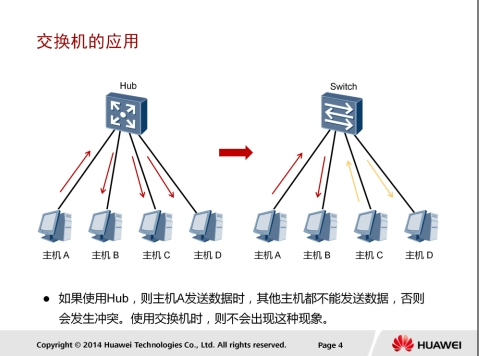

由集线器（HUB）和中继器组建的以太网，实质上是一种共享式以太网。共享式以太网的主要缺陷有：冲突严重、广播泛滥、安全性差。

交换机是工作在数据链路层的设备。交换机可以将一个共享式以太网分割为多个冲突域。链路层流量被隔离在不同的冲突域中进行转发，如此便极大地提升了以太网的性能。更进一步说，通常主机和交换机之间以及交换机不交换机之间都使用全双工技术进行通信，这时冲突现象会被彻底消除。

如本例所示，在由Hub搭建的网络中，所有的主机处于同一个冲突域，主机A发送数据给主机B时，其他主机都将收到此数据，但同时这些主机都不能发送数据。用交换机替代Hub后，因为交换机分割了冲突域，所以在主机A发送数据给主机B时，主机C和主机D之间也可以同时互相发送数据。

# 路由器的应用

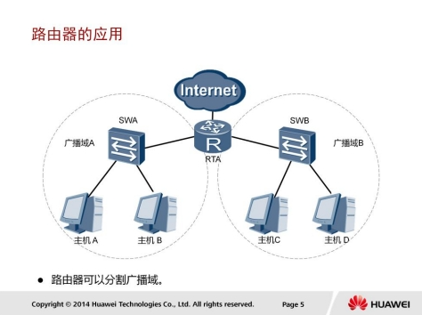

交换机虽然能够隔离冲突域，但是当一台设备发送广播帧时，其他设备仍然都会接收到该广播帧。随着网络规模的增大，广播会越来越多，这样就会影响网络的效率。路由器可以用来分割广播域，减少广播对网络效率的影响。

一般情况下，广播帧的转发被限制在广播域内。广播域的边缘是路由器，因为通常路由器不会转发广播帧。路由器负责在网络间转发报文。它能够在自身的路由表里查找到达目的地的下一跳地址，将报文转发给下一跳路由器，如此重复，并最终将报文送达目的地。

# VRP介绍

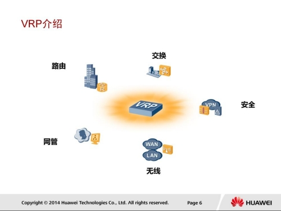

VRP是华为公司具有完全自主知识产权的网络操作系统，可以运行在多种硬件平台之上。VRP拥有一致的网络界面、用户界面和管理界面，为用户提供了灵活丰富的应用解决方案。

VRP平台以TCP/IP协议簇为核心，实现了数据链路层、网络层和应用层的多种协议，在操作系统中集成了路由交换技术、QoS技术、安全技术和IP语音技术等数据通信功能，并以IP转发引擎技术作为基础，为网络设备提供了出色的数据转发能力。

# 设备管理接口

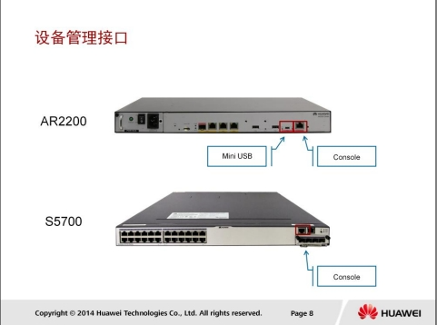

## Console口登录

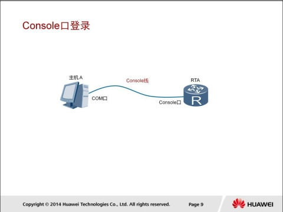

使用Console线缆来连接交换机或路由器的Console口与计算机的COM口，Console口是一种符合RS232串口标准的RJ45接口。

目前大多数台式电脑提供的COM口都可以不Console口连接。笔记本电脑一般不提供COM口，需要使用USB到RS232的转换接口。

### 参数配置

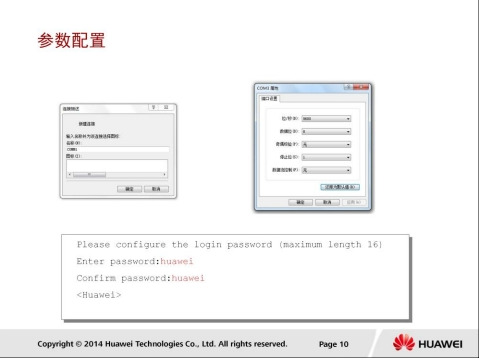

可以使用putty或Secure CRT程序发起Console连接，并连接到VRP，配置参数不上图一致。

## Mini USB口登录

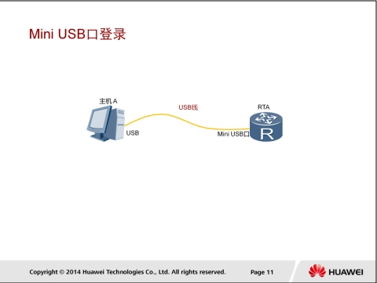

在管理设备时，Console接口和Mini USB接口互斥，即同一时刻只能使用其中的1个接口连接到VRP。

在使用Mini USB口建立连接前，需要在主机上安装驱动程序。您可以从华为企业官方支持网站下载到所需驱动程序。

### 参数配置

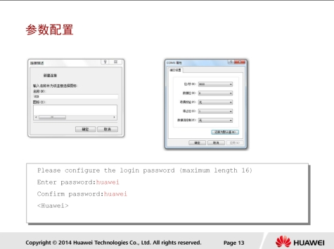

安装驱动程序后，主机上会增加一个新的虚拟COM接口，终端模拟软件可以通过该虚拟COM接口连接到VRP。

# 命令行基础

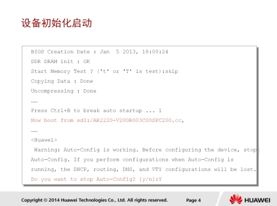

管理员和工程师如果要访问在通用路由平台VRP上运行的华为产品，首先要进入启动程序。开机界面信息提供了系统启动的运行程序和正在运行的VRP版本及其加载路径。

启动完成以后，系统提示目前正在运行的是自动配置模式。用户可以选择是继续使用自动配置模式还是迚入手动配置的模式。如果选择手动配置模式，在提示符处输入Y。在没有特别要求的情况下，我们选择手动配置模式。

## 命令行视图

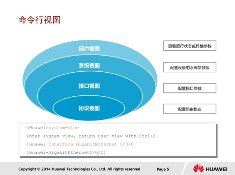

VRP分层的命令结构定义了很多命令行视图，每条命令只能在特定的视图中执行。

本例介绍了常见的命令行视图。每个命令都注册在一个或多个命令视图下，用户只有先进入这个命令所在的视图，才能运行相应的命令。

进入到VRP系统的配置界面后，VRP上最先出现的视图是用户视图。在该视图下，用户可以查看设备的运行状态和统计信息。若要修改系统参数，用户必须进入系统视图。用户还可以通过系统视图进入其他的功能配置视图，如接口视图和协议视图。

通过提示符可以判断当前所处的视图，例如：“< >”表示用户视图，“[]”表示除用户视图以外的其它视图。

## 命令行功能

### 主要快捷键

CTRL+A 移动光标到行首

CTRL+E 移动光标到行尾

CTRL+C 停止当前命令运行

CTRL+Z 回到用户视图

CTRL+] 终止当前连接或切换连接

CTRL+D 删除当前光标所在位置的字符。

CTRL+N 显示历史命令缓冲区中的后一条命令。

CTRL+P 显示历史命令缓冲区中的前一条命令。

CTRL+Y 删除光标所在位置及其右侧所有的字符。

TAB 命令行不全

其他：

在任一命令视图下，用户可以键入“?”获取该命令视图下所有的命令及其简单描述

如果键入一条命令关键字，后接以空格分隔的“?”，如果该位置为关键字，则列出全部关键字及其描述。

## 基本步骤

### 配置设备名称

* sysname

```
sysname RTA	#命名为RTA
```

### 配置系统时钟

* clock datetime：设置当前时间和日期
* clock timezone：设置所在时区

```
clock datetime year-month-day hour:minute:second [timezone-name]
clock datetime 2024-01-25 10:30:00

clock timezone zone-name add-offset
clock timezone GMT+8 8
```

### 配置登录权限

user privilege：配置指定用户界面下的用户级别

```
[Router] user-interface vty 0 4  # 进入虚拟终端线路配置模式
[Router-ui-vty0-4] user privilege level {level-1 | level-2 | level-3} [username]  # 配置用户级别
```

* `level-1` 通常是普通用户权限。
* `level-2` 通常是管理员权限。
* `level-3` 通常是超级用户权限。
* `username` 是要配置的用户名

```
[Router-ui-vty0-4] user privilege level level-2 admin
```

set authentication password：配置本地认证密码

如果您想配置本地认证密码，可以使用以下命令

```
[Router] aaa  # 进入 AAA 配置模式
[Router-aaa] local-user username password irreversible-cipher password  # 配置本地用户密码
```

* `username` 是要配置的用户名。
* `password` 是要为用户设置的密码。

例如，配置一个名为 "user1" 的用户密码为 "mypassword"：

```
[Router-aaa] local-user user1 password irreversible-cipher mypassword
```

## 文件系统基础

VRP基于文件系统来管理设备上的文件和目录。

### 常用命令

```
pwd		#显示当前工作目录。
dir 		#查看当前目录下的文件信息。
more 		#查看文本文件的具体内容。
cd 		#修改用户当前的工作目录。
mkdir 		#创建一个新的目录。目录名称可以包含1-64个字符。
rmdir		#删除文件系统中的目录，此处需要注意的是，只有空目录才能被删除。
copy src dest	#复制
move src dest	#移动
rename old new	#重命名
delete		#删除
undelete	#恢复删除
reset recycle-bin	#清空回收站
```

### 配置文件管理

设备中的配置文件分为两种类型：

* 当前配置文件
* 保存的配置文件。

当前配置文件储存在设备的RAM中。用户可以通过命令行对设备进行配置，配置完成后使用save命令保存当前配置到存储设备中，形成保存的配置文件。保存的配置文件都是以“.cfg”或“.zip”作为扩展名，存放在存储设备的根目录下。

在设备启动时，会从默认的存储路径下加载保存的配置文件到RAM中。

如果默认存储路径中没有保存的配置文件，则设备会使用缺省参数进行初始化配置。

#### 配置文件查询

```
display current-configuration		#查看设备当前生效的配置
display saved-configuration 		#查看设备下次启动时
```

#### 配置文件保存

```
save configuration-file	#保存当前配置信息到系统默认的存储路径中。configuration-file为配置文件的文件名
```

执行save命令后，当前配置被保存到了设备的默认储存路径，默认文件名为vrpcfg.zip。

#### 系统启动文件查询

`display startup`命令用来查看设备本次及下次启动相关的系统软件、备份系统软件、配置文件、License文件、补丁文件以及诧音文件。

* Startup system software表示的是本次系统启动所使用的VRP文件。
* Next startup system software表示的是下次系统启动所使用的VRP文件。
* Startup saved-configuration file表示的是本次系统启动所使用的配置文件。
* Next startup saved-configuration file表示的是下次系统启动所使用的配置文件。

```
display startup		#查看系统启动配置参数
```

#### 系统启动配置文件修改

```
startup saved-configuration	#配置系统下次启动时使用的配置文件
```

#### 配置文件重置

```
reset saved-configuration	#清除下次启动时加载的配置文件
```

执行该命令后，如果不使用命令startup saved-configuration重新指定设备下次启动时使用的配置文件，也不使用save命令保存配置文件，则设备下次启动时会采用缺省的配置参数进行初始化。

### 存储设备

存储设备包括 SDRAM 、 Flash 、 NVRAM、 SD 卡 、 U 盘 。

执行display version命令可以查看华为存储设备的详细信息。

fixdisk命令用来对文件系统出现异常的存储设备进行修复。当存储设备上的文件系统出现异常时，终端会给出提示信息，此时建议使用此命令进行修复，但不确保修复成功。执行此命令后，如果仍然收到系统建议修复的信息，则表示物理介质可能已经损坏。

> 提示：
>
> 此命令是问题修复类命令，在系统未出现问题时，建议用户不要执行此命令。

```
display version		#查看华为存储设备的详细信息
format [devicename]	#格式化存储器。
```

# VRP系统管理

## 文件传输

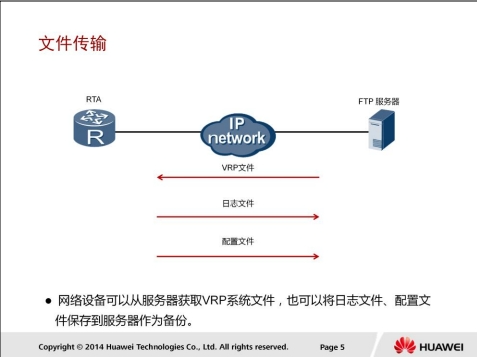
