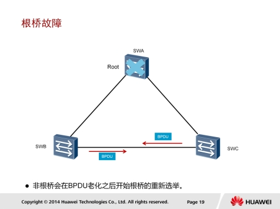
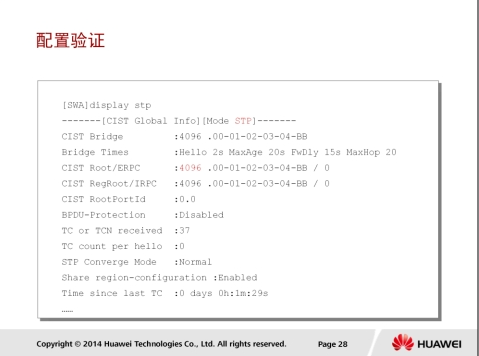

# 交换网的运行

## 交换网基础

### 交换机转发行为


交换机中有一个MAC地址表，里面存放了MAC地址与交换机端口的映射关系。MAC地址表也称为CAM（Content Addressable Memory）表。

如图所示，交换机对帧的转发操作行为一共有三种：泛洪（Flooding），转发（Forwarding），丢弃（Discarding）。

1. 泛洪：交换机把从某一端口进来的帧通过所有其它的端口转发出去（注意，“所有其它的端口”是指除了这个帧进入交换机的那个端口以外的所有端口）。
2. 转发：交换机把从某一端口进来的帧通过另一个端口转发出去（注意，“另一个端口”不能是这个帧进入交换机的那个端口）。
3. 丢弃：交换机把从某一端口进来的帧直接丢弃。

### 交换机的基本工作原理

* 如果进入交换机的是一个单播帧，则交换机会去MAC地址表中查找这个帧的目的MAC地址。
  * 如果查不到这个MAC地址，则交换机执行泛洪操作。
  * 如果查到了这个MAC地址，则比较这个MAC地址在MAC地址表中对应的端口是不是这个帧进入交换机的那个端口。如果不是，则交换机执行转发操作。如果是，则交换机执行丢弃操作。
* 如果进入交换机的是一个广播帧，则交换机不会去查MAC地址表，而是直接执行泛洪操作。
* 如果进入交换机的是一个组播帧，则交换机的处理行为比较复杂，超出了这里的学习范围，所以略去不讲。

交换机还具有学习能力。当一个帧进入交换机后，交换机会检查这个帧的源MAC地址，并将该源MAC地址与这个帧进入交换机的那个端口进行映射，然后将这个映射关系存放进MAC地址表。

#### 交换机初始状态


初始状态下，交换机并不知道所连接主机的MAC地址，所以MAC地址表为空。

本例中，SWA为初始状态，在收到主机A发送的数据帧之前，MAC地址表中没有任何表项。

#### 学习mac地址


主机A发送数据给主机C时，一般会首先发送ARP请求来获取主机C的MAC地址，此ARP请求帧中的目的MAC地址是广播地址，源MAC地址是自己的MAC地址。

SWA收到该帧后，会将源MAC地址和接收端口的映射关系添加到MAC地址表中。

如果在老化时间内再次收到主机A发送的数据帧，SWA中保存的主机A的MAC地址和G0/0/1的映射的老化时间会被刷新。

此后，如果交换机收到目标MAC地址为00-01-02-03-04-AA的数据帧时，都将通过G0/0/1端口转发。

#### 转发数据帧


本例中主机A发送的数据帧的目的MAC地址为广播地址，所以交换机会将此数据帧通过G0/0/2和G0/0/3端口广播到主机B和主机C。

#### 目标主机回复


主机B和主机C接收到此数据帧后，都会查看该ARP数据帧。但是主机B不会回复该帧，主机C会处理该帧并发送ARP回应，此回复数据帧的目的MAC地址为主机A的MAC地址，源MAC地址为主机C的MAC地址。

SWA收到回复数据帧时，会将该帧的源MAC地址和接口的映射关系添加到MAC地址表中。如果此映射关系在MAC地址表已经存在，则会被刷新。

然后SWA查询MAC地址表，根据帧的目的MAC地址找到对应的转发端口后，从G0/0/1转发此数据帧。

### 基本配置


negotiation auto：用来设置以太网端口的自协商功能。端口是否应该使能自协商模式，要考虑对接双方设备的端口是否都支持自动协商。

* 如果对端设备的以太网端口不支持自协商模式，则需要在本端端口上先使用undo negotiation auto命令配置为非自协商模式。之后，修改本端端口的速率和双工模式保持与对端一致，确保通信正常。

duplex命令用来设置以太网端口的双工模式。GE电口工作速率为1000Mbit/s时，只支持全双工模式，不需要与链路对端的端口共同协商双工模式。

speed命令用来设置端口的工作速率。配置端口的速率和双工模式之前需要先配置端口为非自协商模式。

### 配置验证

* display interface [ interface-type [ interface-number [.subnumber ] ] ]：查看端口当前运行状态和统计信息。
  * current state表示端口的物理状态，如果为UP，表示端口处于打开状态
  * Line protocol current state表示端口的链路协议状态，如果为UP，表示端口的链路协议处于正常的启动状态。
  * Speed表示端口的工作速率，SWA的G0/0/1端口工作速率为100Mbit/s
  * Duplex表示端口的双工模式，SWA的G0/0/1端口双工模式为全双工。

## STP原理与配置

### 环路引起的问题


冗余链路虽然增强了网络的可靠性，但是也会产生环路，而环路会带来一系列的问题，继而导致通信质量下降和通信业务中断等问题。

#### 广播风暴


根据交换机的转发原则，如果交换机从一个端口上接收到的是一个广播帧，或者是一个目的MAC地址未知的单播帧，则会将这个帧向除源端口之外的所有其他端口转发。

如果交换网络中有环路，则这个帧会被无限转发，此时便会形成广播风暴，网络中也会充斥着重复的数据帧。

本例中，主机A向外发送了一个单播帧，假设此单播帧的目的MAC地址在网络中所有交换机的MAC地址表中都暂时不存在。SWB接收到此帧后，将其转发到SWA和SWC，SWA和SWC也会将此帧转发到除了接收此帧的其他所有端口，结果此帧又会被再次转发给SWB，这种循环会一直持续，于是便产生了广播风暴。交换机性能会因此急速下降，并会导致业务中断。

#### MAC地址表振荡


交换机是根据所接收到的数据帧的源地址和接收端口生成MAC地址表项的。

主机A向外发送一个单播帧，假设此单播帧的目的MAC地址在网络中所有交换机的MAC地址表中都暂时不存在。SWB收到此数据帧之后，在MAC地址表中生成一个MAC地址表项，00-01-02-03-04-AA，对应端口为G0/0/3，并将其从G0/0/1和G0/0/2端口转发。此例仅以SWB从G0/0/1端口转发此帧为例进行说明。

SWA接收到此帧后，由于MAC地址表中没有对应此帧目的MAC地址的表项，所以SWA会将此帧从G0/0/2转发出去。
SWC接收到此帧后，由于MAC地址表中也没有对应此帧目的MAC地址的表项，所以SWC会将此帧从G0/0/2端口发送回SWB，也会发给主机B。

SWB从G0/0/2接口接收到此数据帧之后，会在MAC地址表中删除原有的相关表项，生成一个新的表项，00-01-02-03-04-AA，对应端口为G0/0/2。此过程会不断重复，从而导致MAC地址表震荡。

### STP工作原理


在以太网中，二层网络的环路会带来广播风暴，MAC地址表震荡，重复数据帧等问题，为解决交换网络中的环路问题，提出了STP。
STP的主要作用：

1. 消除环路：通过阻断冗余链路来消除网络中可能存在的环路。
2. 链路备份：当活动路径发生故障时，激活备份链路，及时恢复网络连通性。

#### STP操作


STP通过构造一棵树来消除交换网络中的环路。

每个STP网络中，都会存在一个根桥，其他交换机为非根桥。根桥或者根交换机位于整个逡辑树的根部，是STP网络的逡辑中心，非根桥是根桥的下游设备。

当现有根桥产生故障时，非根桥之间会交互信息并重新选举根桥，交互的这种信息被称为BPDU。BPDU中包含交换机在参加生成树计算时的各种参数信息，后面会有详细介绍。

STP中定义了三种端口角色

* 指定端口
* 根端口
* 预备端口。

指定端口是交换机向所连网段转发配置BPDU的端口，每个网段有且只能有一个指定端口。一般情况下，根桥的每个端口总是指定端口。

根端口是非根交换机去往根桥路径最优的端口。在一个运行STP协议的交换机上最多只有一个根端口，但根桥上没有根端口。

如果一个端口既不是指定端口也不是根端口，则此端口为预备端口。预备端口将被阻塞。

#### 根桥选举


STP中根桥的选举依据的是桥ID，STP中的每个交换机都会有一个桥ID(Bridge ID) 。桥ID由16位的桥优先级（Bridge Priority）和48位的MAC地址构成。

在STP网络中，桥优先级是可以配置的，取值范围是0～65535，默认值为32768。优先级最高的设备（桥ID最小）会被选举
为根桥。如果优先级相同，则会比较MAC地址，MAC地址越小则越优先。

交换机启动后就自动开始进行生成树收敛计算。默认情况下，所有交换机启动时都认为自己是根桥，自己的所有端口都为指定端口，这样BPDU报文就可以通过所有端口转发。对端交换机收到BPDU报文后，会比较BPDU中的根桥ID和自己的桥ID。如果收到的BPDU报文中的桥ID优先级低，接收交换机会继续通告自己的配置BPDU报文给邻居交换机。如果收到的BPDU报文中的桥ID优先级高，则交换机会修改自己的BPDU报文的根桥ID字段，宣告新的根桥。

#### 根端口选举


非根交换机在选举根端口时分别依据该端口的根路径开销、对端BID（Bridge ID）、对端PID（Port ID）和本端PID。

交换机的每个端口都有一个端口开销（Port Cost）参数，此参数表示该端口发送数据时的开销值，即出端口的开销。STP认为从一个端口接收数据是没有开销的。端口的开销和端口的带宽有关，带宽越高，开销越小。

从一个非根桥到达根桥的路径可能有多条，每一条路径都有一个总的开销值，此开销值是该路径上所有出端口的端口开销总和，即根路径开销RPC（Root Path Cost）。非根桥根据根路径开销来确定到达根桥的最短路径，并生成无环树状网络。根桥的根路径开销是0。

运行STP交换机的每个端口都有一个端口ID，端口ID由端口优先级和端口号构成。端口优先级取值范围是0到240，步长为16，即取值必须为16的整数倍。缺省情况下，端口优先级是128。端口ID（port ID)可以用来确定端口角色。

每个非根桥都要选举一个根端口。根端口是距离根桥最近的端口，这个最近的衡量标准是靠累计根路径开销来判定的，即累计根路径开销最小的端口就是根端口。端口收到一个BPDU报文后，抽取该BPDU报文中累计根路径开销字段的值，加上该端口本身的路径开销即为累计根路径开销。如果有两个或两个以上的端口计算得到的累计根路径开销相同，那么选择收到发送者BID最小的那个端口作为根端口。

如果两个或两个以上的端口连接到同一台交换机上，则选择发送者PID最小的那个端口作为根端口。如果两个或两个以上的端口通过Hub连接到同一台交换机的同一个接口上，则选择本交换机的这些端口中的PID最小的作为根端口。

#### 指定端口选举


在网段上抑制其他端口（无论是自己的还是其他设备的）发送BPDU报文的端口，就是该网段的指定端口。每个网段都应该有一个指定端口，根桥的所有端口都是指定端口（除非根桥在物理上存在环路）。

指定端口的选举也是首先比较累计根路径开销，累计根路径开销最小的端口就是指定端口。如果累计根路径开销相同，则比较端口所在交换机的桥ID，所在桥ID最小的端口被选举为指定端口。如果通过累计根路径开销和所在桥ID选举不出来，则比较端口ID，端口ID最小的被选举为指定端口。

网络收敛后，只有指定端口和根端口可以转发数据。其他端口为预备端口，被阻塞，不能转发数据，只能够从所连网段的指定交换机接收到BPDU报文，并以此来监视链路的状态。

#### 端口状态转换


图中所示为STP的端口状态迁移机制，运行STP协议的设备上端口状态有5种：

1. Forwarding：转发状态。端口既可转发用户流量也可转发BPDU报文，只有根端口或指定端口才能进入Forwarding状态。
2. Learning：学习状态。端口可根据收到的用户流量构建MAC地址表，但不转发用户流量。增加Learning状态是为了防止临时环路。
3. Listening：侦听状态。端口可以转发BPDU报文，但不能转发用户流量。
4. Blocking：阻塞状态。端口仅仅能接收并处理BPDU，不能转发BPDU，也不能转发用户流量。此状态是预备端口的最终状态。
5. Disabled：禁用状态。端口既不处理和转发BPDU报文，也不转发用户流量。

#### BPDU


为了计算生成树，交换机之间需要交换相关的信息和参数，这些信息和参数被封装在BPDU（Bridge Protocol Data Unit）中。

BPDU有两种类型：配置BPDU和TCN BPDU。

* 配置BPDU包含了桥ID、路径开销和端口ID等参数。STP协议通过在交换机之间传递配置BPDU来选举根交换机,以及确定每个交换机端口的角色和状态。在初始化过程中，每个桥都主动发送配置BPDU。在网络拓扑稳定以后，只有根桥主动发送配置BPDU，其他交换机在收到上游传来的配置BPDU后，才会发送自己的配置BPDU。
* TCN BPDU是指下游交换机感知到拓扑发生变化时向上游发送的拓扑变化通知。配置BPDU中包含了足够的信息来保证设备完成生成树计算，其中包含的重要信息如下：
  * 根桥ID：由根桥的优先级和MAC地址组成，每个STP网络中有且仅有一个根。根路径开销：到根桥的最短路径开销。
  * 指定桥ID：由指定桥的优先级和MAC地址组成。
  * 指定端口ID：由指定端口的优先级和端口号组成。
  * Message Age：配置BPDU在网络中传播的生存期。
  * Max Age：配置BPDU在设备中能够保存的最大生存期。
  * Hello Time：配置BPDU发送的周期。
  * Forward Delay：端口状态迁移的延时。

### STP拓扑变化



在稳定的STP拓扑里，非根桥会定期收到来自根桥的BPDU报文。

如果根桥发生了故障，停止发送BPDU报文，下游交换机就无法收到来自根桥的BPDU报文。

如果下游交换机一直收不到BPDU报文，Max Age定时器就会超时（Max Age的默认值为20秒），从而导致已经收到的BPDU报文失效，此时，非根交换机会互相发送配置BPDU报文，重新选举新的根桥。

根桥故障会导致50秒左右的恢复时间，恢复时间约等于Max Age加上两倍的Forward Delay收敛时间。

#### 直连链路故障


此例中，SWA和SWB使用了两条链路互连，其中一条是主用链路，另外一条是备份链路。生成树正常收敛之后，如果SWB检测到根端口的链路发生物理故障，则其Alternate端口会迁移到Listening、 Learning、Forwarding状态，经过2倍Forward Delay后恢复到转发状态。

#### 非直连链路故障


本例中，SWB不SWA之间的链路发生了某种故障（非物理层故障），SWB因此一直收不到来自SWA的BPDU报文。

此时，SWB会认为根桥SWA不再有效，于是开始发送BPDU报文给SWC，通知SWC自己作为新的根桥。

SWC也会继续从原根桥接收BPDU报文，因此会忽略SWB发送的BPDU报文。

由于SWC的Alternate端口再也不能收到包含原根桥ID的BPDU报文。

其Max Age定时器超时后，SWC会切换Alternate端口为指定端口并且转发来自其根端口的BPDU报文给SWB。

SWB放弃宣称自己是根桥并开始收敛端口为根端口。

非直连链路故障后，由于需要等待Max Age加上两倍的Forward Delay时间，端口需要大约50秒才能恢复到转发状态。

#### 拓扑改变导致MAC地址表错误


在交换网络中，交换机依赖MAC地址表转发数据帧。

缺省情况下，MAC地址表项的老化时间是300秒。如果生成树拓扑发生变化，交换机转发数据的路径也会随着发生改变，此时MAC地址表中未及时老化掉的表项会导致数据转发错误，因此在拓扑发生变化后需要及时更新MAC地址表项。

本例中，SWB中的MAC地址表项定义了通过端口GigabitEthernet 0/0/3可以到达主机A，通过端口GigabitEthernet 0/0/1可以到达主机B。由于SWC的根端口产生故障，导致生成树拓扑重新收敛，在生成树拓扑完成收敛之后，从主机A到主机B的帧仍然不能到达目的地。这是因为MAC地址表项老化时间是300秒，主机A发往主机B的帧到达SWB后，SWB会继续通过端口GigabitEthernet 0/0/1转发该数据帧。

#### 拓扑改变改制MAC地址表变化


拓扑变化过程中，根桥通过TCN BPDU报文获知生成树拓扑里发生了故障。根桥生成TC用来通知其他交换机加速老化现有的MAC地址表项。
拓扑变更以及MAC地址表项更新的具体过程如下：

1. SWC感知到网络拓扑发生变化后，会不间断地向SWB发送TCNBPDU报文。
2. SWB收到SWC发来的TCN BPDU报文后，会把配置BPDU报文中的Flags的TCA位设置1，然后发送给SWC，告知SWC停止发送TCN BPDU报文。
3. SWB向根桥转发TCN BPDU报文。
4. SWA把配置BPDU报文中的Flags的TC位设置为1后发送，通知下游设备把MAC地址表项的老化时间由默认的300秒修改为Forwarding Delay的时间（默认为15秒）。
5. 最多等待15秒之后，SWB中的错误映射关系会被自动清除。此后，SWB就能通过G0/0/2端口把从主机A到主机B的帧正确地进行转发。

### STP配置

#### STP模式


一般交换机支持三种生成树协议模式。

```
stp mode stp
```

* stp mode { mstp | stp | rstp }：用来配置交换机的生成树协议模式。

缺省情况下，交换机工作在MSTP模式。在使用STP前，STP模式必须重新配置。

#### 配置交换机优先级


一般建议手动指定网络中配置高、性能好的交换机为根桥。

可以通过配置桥优先级来指定网络中的根桥，以确保企业网络里面的数据流量使用最优路径转发。

```
stp priority 4096
```

* stp priority priority命令用来配置设备优先级值。
  * priority值为整数，取值范围为0到61440，步长为4096。
  * 缺省情况下，交换设备的优先级取值是32768。
* stp root primary：指定生成树里的根桥。

#### 配置路径开销


一般交换机支持三种路径开销标准，以确保和友商设备保持兼容。缺省情况下，路径开销标准为IEEE 802.1t。

* stp pathcost-standard { dot1d-1998 | dot1t | legacy }：配置指定交换机上路径开销值的标准。
  每个端口的路径开销也可以手动指定。此STP路径开销控制方法须谨慎使用，手动指定端口的路径开销可能会生成次优生成树拓扑。
* stp cost cost：取决于路径开销计算方法：
  * 使用华为的私有计算方法时，cost取值范围是1～200000。
  * 使用IEEE 802.1d标准方法时，cost取值范围是1～65535。
  * 使用IEEE 802.1t标准方法时，cost取值范围是1～200000000。

#### 配置验证



```
display stp
```

* display stp：用来检查当前交换机的STP配置。还显示交换机上所有端口信息
  * 命令输出中信息介绍如下。
    * CIST Bridge参数标识指定交换机当前桥ID，包含交换机的优先级和MAC地址。
    * Bridge Times参数标识Hello定时器、Forward Delay定时器、Max Age定时器的值。
    * CIST Root/ERPC参数标识根桥ID以及此交换机到根桥的根路径开销。
* display stp interface：显示交换机上指定端口信息。其他一些信息还包括端口角色、端口状态、以及使用的保护机制等。

## RSTP原理与配置

### STP不足


STP能够提供无环网络，但是收敛速度较慢。如果STP网络的拓扑结构频繁变化，网络也会随之频繁失去连通性，从而导致用户通信频繁中断。

RSTP使用了Proposal/Agreement机制保证链路及时协商，从而有效避免收敛计时器在生成树收敛前超时。

如图所示，在交换网络中，P/A过程可以从根桥向下游级联传递。

### RSTP端口角色


运行RSTP的交换机使用了两个不同的端口角色来实现冗余备份。当到根桥的当前路径出现故障时，作为根端口的备份端口，Alternate端口提供了从一个交换机到根桥的另一条可切换路径。

Backup端口作为指定端口的备份，提供了另一条从根桥到相应LAN网段的备份路径。当一个交换机和一个共享媒介设备例如Hub建立两个戒者多个连接时，可以使用Backup端口。同样，当交换机上两个戒者多个端口和同一个LAN网段连接时，也可以使用Backup端口。

#### RSTP边缘端口


RSTP里，位于网络边缘的指定端口被称为边缘端口。边缘端口一般不用户终端设备直接连接，不与任何交换设备连接。边缘端口不接收配置BPDU 报文 ， 不参不 RSTP 运算 ， 可以由 Disabled 状态直接转到 Forwarding状态，且不经历时延，就像在端口上将STP禁用了一样。

但是，一旦边缘端口收到配置BPDU报文，就丧失了边缘端口属性，成为普通STP端口，并重新进行生成树计算，从而引起网络震荡。


RSTP把原来STP的5种端口状态简化成了3种。

1. Discarding状态，端口既不转发用户流量也不学习MAC地址。
2. Learning状态，端口不转发用户流量但是学习MAC地址。
3. Forwarding状态，端口既转发用户流量又学习MAC地址。

#### RST BPDU


除了部分参数不同，RSTP使用了类似STP的BPDU报文，即RST BPDU报文。

BPDU Type用来区分STP的BPDU报文和RST (Rapid Spanning Tree) BPDU报文。

STP的配置BPDU报文的BPDU Type值为0(0x00)，TCN BPDU报文的BPDU Type值为128 (0x80），RST BPDU报文的BPDU Type值为2 (0x02)。

STP的BPDU报文的Flags字段中只定义了拓扑变化TC（Topology Change）标志和拓扑变化确认TCA（Topology Change Acknowledgment）标志，其他字段保留。在RSTBPDU报文的Flags字段里，还使用了其他字段。包括P/A进程字段和定
义端口角色以及端口状态的字段。

Forwarding，Learning不Port Role表示发出BPDU的端口的状态和角色。


STP中，当网络拓扑稳定后，根桥按照Hello Timer规定的时间间隔发送配置BPDU报文，其他非根桥设备在收到上游设备发送过来的配置BPDU报文后，才会触发发出配置BPDU报文，此方式使得STP协议计算复杂且缓慢。

RSTP对此进行了改进，即在拓扑稳定后，无论非根桥设备是否接收到根桥传来的配置BPDU报文，非根桥设备都会仍然按照
Hello Timer规定的时间间隔发送配置BPDU，该行为完全由每台设备自主进行。

#### RSTP收敛过程


RSTP收敛遵循STP基本原理。网络初始化时，网络中所有的RSTP交换机都认为自己是“根桥”，并设置每个端口为指定端口。此时，端口为Discarding状态。


每个认为自己是“根桥”的交换机生成一个RST BPDU报文来协商指定网段的端口状态，此RST BPDU报文的Flags字段里面的Proposal位需要置位。

当一个端口收到RST BPDU报文时，此端口会比较收到的RST BPDU报文和本地的RST BPDU报文。如果本地的RST BPDU报文优于接收的RST BPDU报文，则端口会丢弃接收的RST BPDU报文，并发送Proposal置位的本地RST BPDU报文来回复对端设备。


交换机使用同步机制来实现端口角色协商管理。当收到Proposal置位并且优先级高的BPDU报文时，接收交换机必须设置所有下游指定端口为Discarding状态。

如果下游端口是Alternate端口戒者边缘端口，则端口状态保持不变。本例说明了下游指定端口暂时迁移到Discarding状态的情形，因此，P/A迚程中任何帧转发都将被阻止。


当确认下游指定端口迁移到Discarding状态后，设备发送RST BPDU报文回复上游交换机发送的Proposal消息。在此过程中，端口已经确认为根端口，因此RST BPDU报文Flags字段里面设置了Agreement标记位和根端口角色。


在P/A迚程的最后阶段，上游交换机收到Agreement置位的RST BPDU报文后，指定端口立即从Discarding状态迁移为Forwarding状态。然后，下游网段开始使用同样的P/A迚程协商端口角色。


在STP中，当出现链路故障戒根桥失效导致交换机收不到BPDU时，交换机需要等待Max Age时间后才能确认出现了故障。而在RSTP中，如果交换机的端口在连续3次Hello Timer规定的时间间隔内没有收到上游交换机发送的RST BPDU，便会确认本端口和对端端口的通信失败，从而需要初始化P/A迚程去重新调整端口角色。

#### RSTP拓扑变化处理


RSTP拓扑变化的处理类似于STP拓扑变化的处理，但也有些细微差别。

本例里面，SWC发生链路故障。SWA和SWC立即检测到链路故障并清除连接此链路的所有端口上的地址表项。

在接下来的P/A迚程中，交换机发送RST BPDU报文开始协商端口状态，拓扑变化通知报文也会随着Agreement置位的RST BPDU报文一起转发。

RST BPDU报文里，Agreement和TC比特位都设置为1，通知上游交换机清除所有其他端口上的MAC地址表项，除了接收到TC置位的RST BPDU报文的端口。

设置了TC位的RST BPDU报文周期性地转发给上游,在此周期时间内，所有相关接口上地址表项将会清除，接口上根据新的RSTP拓扑生成新的MAC地址表项。

图形里面红色X表示由于拓扑变化导致端口上的MAC地址表项被清除。

#### STP兼容


RSTP是可以不STP实现后向兼容的，但在实际中，并不推荐这样的做法，原因是RSTP会失去其快速收敛的优势，而STP慢速收敛的缺点会暴露出来。

当同一个网段里既有运行STP的交换机又有运行RSTP的交换机时，STP交换机会忽略接收到的RST BPDU，而RSTP交换机在某端口上接收到STP BPDU时，会等待两个Hello Time时间之后，把自己的端口转换到STP工作模式，此后便发送STP BPDU，这样就实现了兼容性操作。

### 配置STP模式


```
stp mode rstp
```

* stp mode rstp：配置交换机工作在RSTP模式。
  * 在系统视图下执行，此命令必须在所有参不快速生成树拓扑计算的交换机上配置。

#### 配置验证


```
display stp
```

display stp：显示RSTP配置信息和参数。根据显示信息可以确认交换机是否工作在RSTP模式。

### 配置边缘端口


边缘端口完全不参不STP戒RSTP计算。边缘端口的状态要么是Disabled，要么是Forwarding；

* 终端上电工作后，它就直接由Disabled状态转到Forwarding状态，
* 终端下电后，它就直接由Forwarding状态转到Disabled状态。
* 交换机所有端口默认为非边缘端口。

stp edged-port enable：配置交换机的端口为边缘端口，它是一个针对某一具体端口的命令。
stp edged-port default：配置交换机的所有端口为边缘端口。
stp edged-port disable：将边缘端口的属性去掉，使之成为非边缘端口。它也是一个针对某一具体端口的命令。

#### 根保护


由于错误配置根交换机戒网络中的恶意攻击，根交换机有可能会收到优先级更高的BPDU报文，使得根交换机变成非根交换机，从而引起网络拓扑结构的变动。这种不合法的拓扑变化，可能会导致原来应该通过高速链路的流量被牵引到低速链路上，造成网络拥塞。

交换机提供了根保护功能来解决此问题。根保护功能通过维持指定端口角色从而保护根交换机。一旦启用了根保护功能的指定端口收到了优先级更高的BPDU报文时，端口会停止转发报文并且迚入Listening状态。经过一段时间后，如果端口一直没有再收到优先级较高的BPDU报文，端口就会自动恢复到原来的状态。根保护功能仅在指定端口生效，不能配置在边缘端口戒者使能了环路保护功能的端口上。

### BPDU保护


正常情况下，边缘端口是不会收到BPDU的。但是，如果有人发送BPDU来迚行恶意攻击时，边缘端口就会收到这些BPDU，并自动变为非边缘端口，且开始参不网络拓扑计算，从而会增加整个网络的计算工作量，并可能引起网络震荡。

为防止上述情况的发生，我们可以使用BPDU保护功能。使能BPDU保护功能后的交换机的边缘端口在收到BPDU报文时，会立即关闭该端口，并通知网络管理系统。被关闭的边缘端口只能通过管理员手动迚行恢复。

如需使能BPDU保护功能，可在系统视图下执行stp bpdu-protection命令。

```
stp bpdu-protection
```

#### 环路保护


交换机通过从上游交换机持续收到BPDU报文来维护根端口和阻塞端口的状态。当由于链路拥塞戒者单向链路故障时，交换机不能收到上游交换机发送的BPDU报文，交换机重新选择根端口。

最初的根端口会变成指定端口，阻塞端口迚入Forwarding状态，这就有可能导致网络环路。交换机提供了环路保护功能来避免这种环路的产生。环路保护功能使能后，如果根端口不能收到上游交换机发送的BPDU报文，则向网管发出
通知信息。根端口会被阻塞，阻塞端口仍然将保持阻塞状态，这样就避免了可能发生的网络环路。

如需使能环路保护功能，可在接口视图下执行stp loop-protection命令。

```
stp loop-protection
```

#### 配置验证


* display stp interface ：显示端口的RSTP配置情况。包括端口状态，端口优先级，端口开销，端口角色，是否为边缘端口等等。
  ```
  display stp interface xxxxx
  ```


# Reference Links：

http://bbs.hh010.com/
